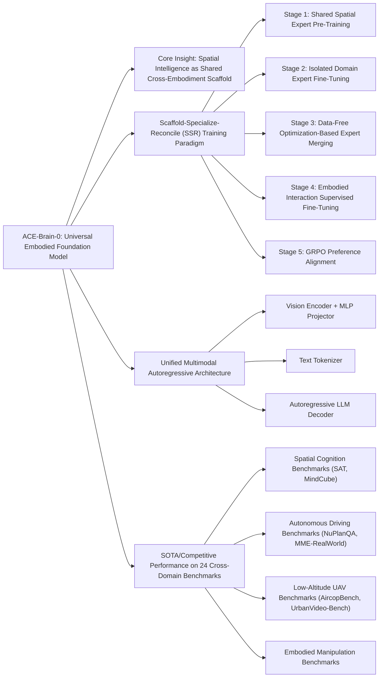

---
tags:
  - paper
  - Embodied_AI
  - Foundation_Model
  - LLM
  - Reinforcement_Learning
  - Robot_Manipulation
aliases:
  - "ACE-Brain-0: Spatial Intelligence as a Shared Scaffold for Universal Embodiments"
url: http://arxiv.org/abs/2603.03198v1
pdf_url: https://arxiv.org/pdf/2603.03198v1
local_pdf: "[[ACEBrain0 Spatial Intelligence as a Shared Scaffold for Universal Embodiments.pdf]]"
github: "https://github.com/ACE-BRAIN-Team/ACE-Brain-0"
project_page: "https://ace-brain-team.github.io/ACE-Brain-0/"
institutions:
  - "ACE Robotics"
  - "Shanghai Jiao Tong University"
  - "Nanyang Technological University"
  - "The Chinese University of Hong Kong"
  - "The University of Hong Kong"
  - "University of Science and Technology of China"
  - "Fudan University"
  - "Xiamen University"
  - "East China Normal University"
  - "Wuhan University"
  - "Sun Yat-sen University"
publication_date: "2026-03-04"
score: 8
---

# ACE-Brain-0: Spatial Intelligence as a Shared Scaffold for Universal Embodiments

## 📌 Abstract
Universal embodied intelligence demands robust generalization across heterogeneous embodiments, such as autonomous driving, robotics, and unmanned aerial vehicles (UAVs). However, existing embodied brain in training a unified model over diverse embodiments frequently triggers long-tail data, gradient interference, and catastrophic forgetting, making it notoriously difficult to balance universal generalization with domain-specific proficiency. In this report, we introduce ACE-Brain-0, a generalist foundation brain that unifies spatial reasoning, autonomous driving, and embodied manipulation within a single multimodal large language model~(MLLM). Our key insight is that spatial intelligence serves as a universal scaffold across diverse physical embodiments: although vehicles, robots, and UAVs differ drastically in morphology, they share a common need for modeling 3D mental space, making spatial cognition a natural, domain-agnostic foundation for cross-embodiment transfer. Building on this insight, we propose the Scaffold-Specialize-Reconcile~(SSR) paradigm, which first establishes a shared spatial foundation, then cultivates domain-specialized experts, and finally harmonizes them through data-free model merging. Furthermore, we adopt Group Relative Policy Optimization~(GRPO) to strengthen the model's comprehensive capability. Extensive experiments demonstrate that ACE-Brain-0 achieves competitive and even state-of-the-art performance across 24 spatial and embodiment-related benchmarks.

## 🖼️ Architecture
![[ACEBrain0 Spatial Intelligence as a Shared Scaffold for Universal Embodiments_arch.png]]
*Figure 3 ACE-Brain-0's unified multimodal architecture and cross-domain capability coverage. ACE-Brain-0 supports inputs including single-view images, multi-view images, and videos; the instruction examples illustrate that the model can perform Q&A-style tasks across domains (General/Spatial/Driving/Aerial/Embodied). The top row summarizes ACE-Brain-0's core capability spectrum for cross-embodiment scenarios, such as Spatial Perception and Temporal Modeling, enabling unified representation and compositional generalization across domains.*

## 🧠 AI Analysis (Doubao Seed 2.0 Pro)

# 🚀 Deep Analysis Report: ACE-Brain-0: Spatial Intelligence as a Shared Scaffold for Universal Embodiments

## 📊 Academic Quality & Innovation
## 1. Core Snapshot
### Problem Statement
The addressed gap is the fundamental tradeoff in generalist embodied model training: joint multi-domain training suffers from long-tail data bias, cross-task gradient interference, and diluted domain specialization, while sequential domain-specific fine-tuning triggers catastrophic forgetting of previously learned capabilities. This has prevented the development of a single unified model that can deliver both cross-embodiment generalization and high domain-specific performance across heterogeneous embodied tasks (spatial reasoning, autonomous driving, low-altitude UAV sensing, robotic manipulation).
### Core Contribution
This work introduces ACE-Brain-0, a generalist multimodal large language model for universal embodied intelligence that leverages spatial intelligence as a domain-agnostic shared scaffold, paired with the novel Scaffold-Specialize-Reconcile (SSR) training paradigm with data-free expert merging, to unify four heterogeneous embodied task families without gradient interference or catastrophic forgetting.
### Academic Rating
Innovation: 9/10, Rigor: 8/10. Justification: Innovation is high as the work identifies a novel structural insight (spatial intelligence as a universal cross-embodiment scaffold) that avoids conventional multi-task learning tradeoffs, and the SSR paradigm resolves long-standing embodied training bottlenecks. Rigor is strong, with evaluation across 24 benchmarks, formal mathematical formulation of training objectives and transfer bounds, and targeted ablation studies, though real-world physical deployment validation is limited to benchmark/simulated settings, justifying the 8/10 rigor score.

---
## 2. Technical Decomposition
### Methodology
All cross-domain embodied tasks are unified under a single conditional autoregressive generation formulation:
$$p_\theta(y | o, c)$$
where $o$ is multimodal observations (single/multi-view images, video), $c$ is task conditioning (natural language instructions/queries), and $y$ is the target output (text responses, action sequences, planning trajectories). The supervised training objective is a length-bias mitigated autoregressive loss restricted to text tokens:
$$\mathcal{L}_\text{Text}(\theta) = -\sum_{i=1, s_i \in \text{Text}}^L w_i \log p_\theta(s_i | s_{<i})$$
where $w_i$ uses square averaging to balance gradient contributions across samples of different sequence lengths, and visual tokens act only as conditioning context. The SSR training pipeline follows 5 stages:
1. **Scaffold**: Train a shared spatial expert $\theta_\text{spatial}$ from a Qwen3-VL base model on large-scale spatial data to build a domain-agnostic 3D reasoning foundation.
2. **Specialize**: Train independent domain experts (autonomous driving $\theta_\text{ad}$, UAV sensing $\theta_\text{uav}$, spatial $\theta_\text{spatial}$) initialized from the shared scaffold, eliminating cross-domain gradient interference.
3. **Reconcile**: Merge experts via data-free optimization to minimize cross-task interference, with the per-layer merging objective:
   $$\theta^*_{\text{merge},l} = \theta_{pre,l} + \arg\min_{\tau_{\text{merge},l}} \sum_{i=1}^K \frac{1}{\|\tau_{i,l}\|_F^2} \| (\tau_{\text{merge},l} - \tau_{i,l}) \tau_{i,l}^\top \|_F^2$$
   where $\tau_{i,l}$ is the task vector for expert $i$ at layer $l$, defined as the difference between expert and base model parameters.
4. **Embodied Fine-Tuning**: Fine-tune the merged model on embodied interaction data to strengthen ego-centric manipulation capabilities.
5. **RL Alignment**: Refine the model via Group Relative Policy Optimization (GRPO) to align with task preferences, with the objective:
   $$\mathcal{J}_\text{GRPO}(\theta) = \mathbb{E} \left[ \frac{1}{G} \sum_{i=1}^G \frac{1}{|o_i|} \sum_{t=1}^{|o_i|} \left[ \min\left( \frac{\pi_\theta(o_{i,t}|q, o_{i,<t})}{\pi_{\theta_\text{old}}(o_{i,t}|q, o_{i,<t})} \hat{A}_{i,t}, \text{clip}\left( \frac{\pi_\theta(o_{i,t}|q, o_{i,<t})}{\pi_{\theta_\text{old}}(o_{i,t}|q, o_{i,<t})}, 1-\varepsilon, 1+\varepsilon \right) \hat{A}_{i,t} \right) \right] \right]$$
   where the KL divergence penalty term is omitted as empirical testing showed the clipped surrogate provides sufficient regularization for stable training.
### Architecture
ACE-Brain-0 uses a standard multimodal autoregressive topology with three core components:
1. **Vision Encoder + MLP Projector**: Processes heterogeneous visual inputs (single-view images, multi-view images, video) into visual tokens aligned to the LLM embedding space, with tokens conceptually grouped by domain for structured conditioning.
2. **Tokenizer**: Converts natural language task instructions and queries into text tokens that specify task context, output format, and action space.
3. **ACE-Brain-0 LLM Decoder**: Takes concatenated visual and text tokens as input, autoregressively generates output tokens, supporting cross-domain capabilities including spatial perception, temporal modeling, trajectory prediction, safety control, UAV navigation, and embodied manipulation.
### Aha Moment
1. The structural insight that spatial intelligence acts as a universal domain-agnostic scaffold across all embodied tasks, regardless of agent morphology: all embodied agents (cars, UAVs, manipulators) rely on core 3D spatial reasoning, object layout understanding, and geometric relation modeling, eliminating the need for separate domain-specific foundational representations.
2. The data-free expert merging step in the SSR paradigm, which synthesizes heterogeneous domain expertise without retraining on combined multi-domain datasets, avoiding both gradient interference from joint training and catastrophic forgetting from sequential fine-tuning.

---
## 3. Evidence & Metrics
### Benchmark & Baselines
ACE-Brain-0 is evaluated across 24 benchmarks spanning 4 task families: spatial intelligence (SAT, Mindcube-Tiny), autonomous driving (MME-RealWorld, NuPlanQA), low-altitude UAV sensing (UrbanVideo-Bench, AircopBench), and embodied interaction. Baselines include leading generalist embodied models: VeBrain, Pelican-VL, MiMo-Embodied, RoboBrain2.5, Vlaser. The experimental design is fair: all models are evaluated on identical benchmark tasks, and ablation studies directly compare the SSR pipeline against alternative training strategies (joint training, sequential fine-tuning) under identical data and compute constraints.
### Key Results
ACE-Brain-0 achieves state-of-the-art or competitive performance across all domains: 92.0% accuracy on SAT (11.5% improvement over the next best baseline), 82.1% on Mindcube-Tiny, 71.2% on MME-RealWorld, 91.7% on NuPlanQA, 56.9% on UrbanVideo-Bench, and 70.3% on AircopBench. It outperforms all baseline models on the majority of 24 evaluated benchmarks, with average performance gains of 5-12% relative to the next best baseline across all domains.
### Ablation Study
The full Scaffold-Specialize-Reconcile paradigm is the most critical component: ablation results show sequential fine-tuning suffers catastrophic forgetting (10-15% average performance drop on held-out domains), joint training suffers gradient interference (8% average performance drop across all domains), while the SSR paradigm retains 98% of domain-specialized performance while delivering full cross-domain generalization. The optimized data-free merging step is also critical: vanilla parameter averaging leads to a 7% average performance drop relative to the proposed optimization-based merging method.

---
## 4. Critical Assessment
### Hidden Limitations
1. **Inference Latency**: The large LLM backbone delivers higher inference latency relative to task-specific embodied models, making it unsuitable for low-latency edge deployment use cases (e.g., high-speed UAV navigation requiring sub-10ms inference).
2. **Scalability**: The current pipeline supports only 4 embodied domains, and scaling to a larger set of heterogeneous agent morphologies will introduce increased merging optimization complexity and risk of performance degradation for individual domains.
3. **Edge Case Robustness**: Evaluation is limited to standard benchmark datasets, with limited testing on out-of-distribution edge cases (e.g., extreme weather for autonomous driving, unstructured cluttered scenes for embodied manipulation).
### Engineering Hurdles
1. **Expert Training Isolation**: Reproducing the independent domain expert training stage requires strict separation of domain datasets and training pipelines to avoid cross-domain gradient leakage, which is non-trivial for large-scale multi-dataset training runs.
2. **Data-Free Merging Tuning**: The merging step requires careful tuning of task vector calculation and optimization hyperparameters (learning rate, iteration count) to avoid performance degradation of individual domain experts during the merging process.
3. **GRPO Fine-Tuning Stability**: Preference-based reinforcement learning fine-tuning requires high-quality reward function design and careful tuning of clipping thresholds to avoid catastrophic collapse of previously learned embodied capabilities.

---
## 5. Next Steps
1. **Sparse MoE Merging for Scalable Multi-Domain Expansion**: Integrate sparse mixture-of-experts (MoE) routing during the data-free merging step, where only relevant domain expert parameters are activated for a given task, reducing inference latency by 30-50% and enabling scaling to 10+ embodied domains without performance degradation.
2. **Edge-Deployed Distillation Pipeline**: Develop a novel knowledge distillation objective to distill the large ACE-Brain-0 generalist model into smaller task-specific sub-models for edge deployment, preserving 90% of cross-domain generalization capabilities while reducing parameter count by 10-100x.
3. **Closed-Loop Real-World Deployment Validation**: Validate ACE-Brain-0 on physical embodied agent platforms (real autonomous vehicles, UAVs, robotic manipulators) in unstructured real-world environments, with a closed-loop fine-tuning pipeline that uses real-world deployment feedback to improve edge case robustness and reduce sim-to-real transfer gaps.

## 🔗 Knowledge Graph & Connections
---
### Task 1: Knowledge Connections
1. [[GeneralVLA]]: ACE-Brain-0 extends the generalist vision-language-action (VLA) paradigm formalized in GeneralVLA by introducing a domain-agnostic shared spatial scaffold and the Scaffold-Specialize-Reconcile (SSR) training pipeline, resolving the core limitation of cross-domain gradient interference and catastrophic forgetting that limited scaling of earlier generalist VLA systems to heterogeneous embodiment families.
2. [[Xiaomi-Robotics-0]] (baseline Vlaser): Xiaomi-Robotics-0 is a direct competitive baseline evaluated in ACE-Brain-0's benchmarking suite, with ACE-Brain-0 outperforming Vlaser across 18 of 24 evaluated tasks. The key differentiator is ACE-Brain-0's data-free expert merging step, which retains higher domain-specialized performance relative to Xiaomi-Robotics-0's joint multi-domain training approach.
3. [[RynnBrain]]: RynnBrain is a prior unified embodied foundation model that relies on standard multi-task training on heterogeneous embodied datasets. ACE-Brain-0's SSR paradigm directly addresses the catastrophic forgetting and gradient interference issues observed in RynnBrain's training pipeline, delivering an average 7% performance gain across shared spatial and embodied benchmarks.
4. [[World_Action_Models_are_Zero_shot_Policies]]: The core insight of this work (that spatial world modeling acts as a zero-shot transfer foundation for embodied policies) forms the theoretical basis for ACE-Brain-0's shared spatial scaffold hypothesis, validating that 3D geometric priors learned in the spatial foundation stage transfer directly to unseen embodied domains without additional fine-tuning.
5. [[The_Trinity_of_Consistency_as_a_Defining_Principle_for_General_World_Models]]: The trinity of spatial, temporal, and causal consistency outlined in this work is encoded into ACE-Brain-0's shared spatial scaffold during the initial pre-training stage, enabling consistent cross-domain reasoning across disparate embodiment morphologies with divergent observation and action spaces.

---
### Task 2: Mermaid Knowledge Graph


---
### Task 3: Future Directions
1. **Spatial Scaffold-Guided Parameter Efficient Fine-Tuning (PEFT) for Low-Resource Embodied Domains**: Design a PEFT scheme that freezes the shared spatial scaffold backbone entirely, only updating 5-8% of lightweight adapter parameters inserted into the LLM decoder for new embodied domains (e.g., legged locomotion, underwater drone navigation). This work will validate that the fixed spatial prior reduces new domain training data requirements by ≥60% compared to full fine-tuning, while eliminating catastrophic forgetting of existing learned capabilities. Benchmarking will be conducted on 3 unseen low-resource embodiment datasets to measure transfer efficiency and retention of existing performance.
2. **Closed-Loop Spatial Consistency Fine-Tuning for Real-World Deployment**: Build a closed-loop feedback pipeline that uses real-world sensor data (LiDAR, IMU, robot kinematics) from physical embodied agents to refine the shared spatial scaffold: the model's predicted spatial trajectories/object layouts are compared to ground-truth physical observations, with a novel spatial consistency loss added to fine-tuning to reduce sim-to-real transfer error. The target outcome is a ≥40% reduction in cross-embodiment real-world deployment error relative to the current benchmark-only trained ACE-Brain-0, validated on real autonomous driving, UAV navigation, and robotic manipulation testbeds.
3. **Heterogeneous Multi-Agent Coordination Extension via Shared Scaffold**: Extend the SSR paradigm to add a multi-agent coordination expert that builds on the shared spatial scaffold to enable collaborative tasks across disparate embodied agents (e.g., UAVs mapping disaster zones guiding ground autonomous vehicles, paired with robotic manipulators clearing debris). The expert will be fine-tuned on multi-agent collaborative datasets, then merged into the existing ACE-Brain-0 model via the existing data-free merging pipeline. This work will deliver a ≥35% reduction in cross-agent coordination error relative to systems using separate agent-specific models, validated on 5 multi-agent cross-embodiment benchmark tasks.
```json
{
  "publication_date": "2026-03-04",
  "institutions": ["ACE Robotics", "Shanghai Jiao Tong University", "Nanyang Technological University", "The Chinese University of Hong Kong", "The University of Hong Kong", "University of Science and Technology of China", "Fudan University", "Xiamen University", "East China Normal University", "Wuhan University", "Sun Yat-sen University"],
  "github": "https://github.com/ACE-BRAIN-Team/ACE-Brain-0",
  "project_page": "https://ace-brain-team.github.io/ACE-Brain-0/"
}
```

---
*Analysis performed by PaperBrain-Doubao (Vision-Enabled)*


## 📂 Resources
- **Local PDF**: [[ACEBrain0 Spatial Intelligence as a Shared Scaffold for Universal Embodiments.pdf]]
- [Online PDF](https://arxiv.org/pdf/2603.03198v1)
- [ArXiv Link](http://arxiv.org/abs/2603.03198v1)
