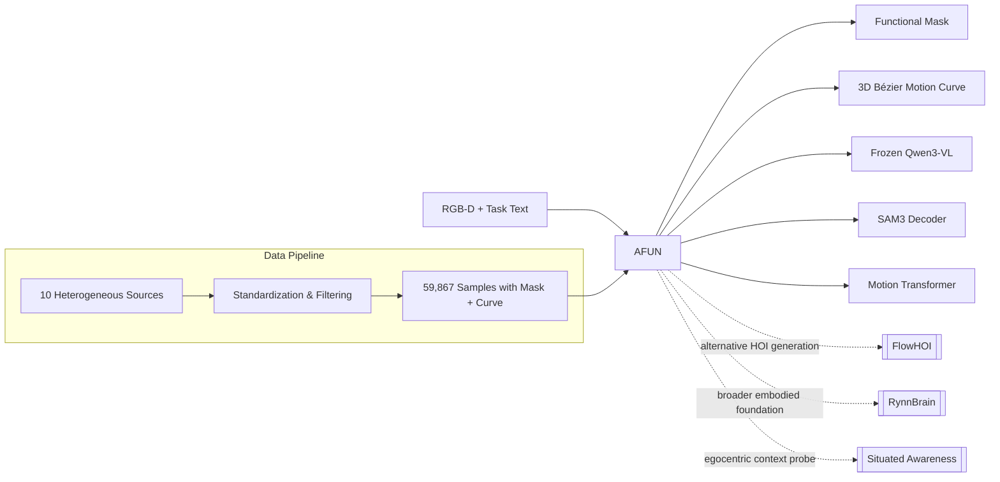

---
tags:
- paper
- domain/3d_perception
- domain/embodied_ai
- domain/multimodal_perception
- domain/reinforcement_learning
- domain/robot_manipulation
- impact/high_value
- impact/solid
- method/benchmark
- method/foundation_model
- method/planning
- method/reinforcement_learning
- method/simulation
- review/auto_tagged
- status/unread
- task/manipulation
- task/planning_reasoning
- task/scene_understanding
- type/benchmark
- type/dataset
- type/method
aliases:
- 'AFUN: Towards an Affordance Foundation Model for Functionality Understanding'
- AFUN
- Affordance Foundation Model
- Functionality Understanding
- Task-Conditional Interaction
- 3D Motion Curves
- RGB-D Affordance
- Language-Driven Affordance
- Shared Affordance Schema
- Affordance Explainable Interface
paper_id: arxiv:2606.02551
arxiv_id: '2606.02551'
url: https://huggingface.co/papers/2606.02551
pdf_url: https://arxiv.org/pdf/2606.02551.pdf
local_pdf: '[[AFUN Towards an Affordance Foundation Model for Functionality Understanding.pdf]]'
github: None
project_page: https://www.zhaoningwang.com/AFUN
institutions:
- University of Michigan
- University of California, San Diego
- NVIDIA
publication_date: '2026-06-02'
score: '7.5'
domains:
- 3d_perception
- embodied_ai
- multimodal_perception
- reinforcement_learning
- robot_manipulation
methods:
- benchmark
- foundation_model
- planning
- reinforcement_learning
- simulation
tasks:
- manipulation
- planning_reasoning
- scene_understanding
paper_type: benchmark
impact_band: solid
reading_status: unread
priority_score: 83
review_status: auto_tagged
next_action: inspect_protocol
year: 2026
---

# AFUN: Towards an Affordance Foundation Model for Functionality Understanding

## 📌 Abstract
Affordance understanding bridges visual perception and physical action, serving as an explainable interface for robot manipulation in open and unstructured real-world environments. Yet, building an affordance foundation model that not only understands where and how the interaction should happen, but also generalizes across diverse environments, objects, and tasks, remains a long-standing research challenge. Existing methods typically address only part of this challenge, either localizing task-relevant regions without specifying executable motion, or predicting motion but with limited scalability. In this paper, we present ourmodel, a step towards an affordance foundation model for functionality understanding. From a single RGB-D observation and a language task description, ourmodel predicts a task-conditional functional mask (where to interact) and a 3D post-contact motion curve (how to interact). To support open-world generalization, we build a large-scale standardized data pipeline that converts heterogeneous robot, human, simulation, and real-world scan data into a shared affordance schema with language, masks, and object-centric 3D motion labels. We evaluate ourmodel from three aspects: for affordance segmentation, ourmodel outperforms all baselines by a large margin across 8 test sets from 4 benchmarks, improving mean gIoU/cIoU by +23.9/+26.3; for contact-point prediction, it predicts substantially more accurate points, with a 12.7--61.3% hit-rate gain over the best baseline; and for 3D motion, it achieves the best performance on all three test sets. ourmodel can be deployed for real-world robot manipulation without finetuning for robot embodiment or using task-specific heuristics, demonstrating the ability to adapt to open-world affordance tasks. Project page: https://www.zhaoningwang.com/AFUN

## 🖼️ Architecture
![[AFUN Towards an Affordance Foundation Model for Functionality Understanding_arch.png]]

## 🧠 AI Analysis
## Abstract

Affordance understanding bridges visual perception and physical action, serving as an explainable interface for robot manipulation in open and unstructured real-world environments. Yet, building an affordance foundation model that not only understands where and how the interaction should happen, but also generalizes across diverse environments, objects, and tasks, remains a long-standing research challenge. Existing methods typically address only part of this challenge, either localizing task-relevant regions without specifying executable motion, or predicting motion but with limited scalability. In this paper, we present AFUN, a step towards an affordance foundation model for functionality understanding. From a single RGB-D observation and a language task description, AFUN predicts a task-conditional functional mask (where to interact) and a 3D post-contact motion curve (how to interact). To support open-world generalization, we build a large-scale standardized data pipeline that converts heterogeneous robot, human, simulation, and real-world scan data into a shared affordance schema with language, masks, and object-centric 3D motion labels. We evaluate AFUN from three aspects: for affordance segmentation, AFUN outperforms all baselines by a large margin across 8 test sets from 4 benchmarks, improving mean gIoU/cIoU by +23.9/+26.3; for contact-point prediction, it predicts substantially more accurate points, with a 12.7–61.3% hit-rate gain over the best baseline; and for 3D motion, it achieves the best performance on all three test sets. AFUN can be deployed for real-world robot manipulation without finetuning for robot embodiment or using task-specific heuristics, demonstrating the ability to adapt to open-world affordance tasks. Project page: https://www.zhaoningwang.com/AFUN

AFUN is a single model that takes an ordinary color-plus-depth photo of a scene plus a short task sentence such as “open the microwave” and returns both the exact region a robot should touch and the smooth three-dimensional path the object should follow after contact.

## 1. Core Snapshot

### Problem Statement

Affordance understanding denotes the ability to recognize which parts of an object serve a specific task and exactly how that object should move once a robot makes contact. This capability forms an explainable link between visual scene understanding and physical execution, making it crucial for open-world manipulation.

The ideal system would receive a single RGB-D image and a natural‑language instruction, then immediately produce two outputs: a pixel‑level mask that marks the functional contact region, and a 3D motion curve that describes the post‑contact trajectory of the object in a way the robot can follow directly. Achieving this ideal in unconstrained environments is the paper’s driving challenge.

The fundamental bottleneck is that existing approaches almost always solve only one side of the problem. Some methods localize task‑relevant regions (the “where”) but output nothing about motion; others predict 2D trajectories or discrete motion types but rely on hand‑crafted localization and lack scalability. In both cases the available training data are either too narrow in object and scene diversity or completely lack motion annotations, so the resulting models break when the environment, object, or task changes. ==Thus, the core unsolved problem is a joint model that simultaneously predicts correct contact regions and executable 3D motion while generalizing across domains.==

### Core Contribution

The key technical contribution of AFUN is a unified architecture that, in a single forward pass, produces a language‑conditioned segmentation mask *and* an anchored 3D Bézier spline representing post‑contact object motion. This departure from separate mask‑only or motion‑only pipelines means the model explicitly couples “where to act” with “how the object should move.”

Equally important is the data infrastructure. The authors build a scalable pipeline that processes 321,190 raw videos from ten heterogeneous sources — robot demonstrations, human activity videos, simulated interactions, and real‑world scans — and distills them into 59,867 standardized training samples. Each sample carries a language task description, a functional mask, and an object‑centric 3D motion curve, consistently formatted across all sources.

> [!note] Dataset scale: The 59,867 curated samples make this one of the largest public affordance datasets with 3D motion annotations, though the paper does not explicitly compare its size with every prior resource.

Compared with earlier work that either performed static segmentation or predicted 2D or hand‑centric trajectories, AFUN therefore unifies “where” and “how” under one objective and scales the training signal far beyond what a single narrow dataset can provide.

The strongest evidence for this contribution comes from the consistent margin of improvement: the model outperforms all baselines on eight segmentation test sets and three motion benchmarks, and it succeeds in real‑world robot deployment without any embodiment‑specific fine‑tuning or task‑specific heuristics.

### Innovation Origin & Rationale

The design starts from a key observation: post‑contact object motion provides a much cleaner supervision signal for affordance than the hand or gripper trajectories used in many previous pipelines. Hand movements include large pre‑contact phases that are irrelevant to the actual functionality, and they vary enormously across embodiments. By tracking the object itself after contact, the data pipeline isolates the motion that the affordance concept attempts to describe.

This rationale is applied in the decision to reuse frozen vision‑language and segmentation foundation models (Qwen3‑VL‑8B and SAM3) through small, learnable MetaQuery tokens, rather than training a large model from scratch. Noisy internet‑scale affordance data can easily destabilize full training; freezing the strong backbones while only tuning the lightweight bridge adapters makes the joint model trainable and robust.

> [!note] The chain of reasoning described here — especially the deliberate shift to object‑centric post‑contact motion as a cleaner supervision target — is an interpretation built from the method description; the paper does not phrase it as an explicit causal hypothesis.

## 2. Reading Map

Readers who are already comfortable with modern vision‑language models (e.g., Qwen‑VL, SAM‑style decoders) and language‑conditioned segmentation will absorb the method most quickly. Those new to affordance should first read the introduction and the related‑work discussion in the paper to understand why affordance is formulated as mask‑plus‑motion, and then return to this note.

The data‑pipeline section (Section 3 in the paper) and the three‑stage training description deserve the most careful study, because they contain the main technical novelty that enables open‑world generalization. The experiment tables (especially Table 1 and Table 3 in the paper) require scrutiny: they report numeric improvements that are unusually large for this area, so the reader should verify the baselines and evaluation protocols.

The related‑work section, the ablation tables, and the appendix can be skimmed on a first pass if the reader already knows the landscape of affordance segmentation, motion prediction, and data‑pipeline papers. The real‑robot deployment examples (Figure 1d and Figure 7 in the paper) are worth examining early, as they anchor the quantitative claims in physical success.

## 3. Method Walkthrough

### Inputs, Outputs, And Assumptions

The method takes a single RGB‑D frame and a short natural‑language task phrase (e.g., “open the drawer”). It returns two items: a binary mask covering the functional region where contact should happen, and a set of control points that define a 3D Bézier curve. The first control point of the curve is anchored at the 3D centroid of the masked depth points, so the motion originates from the predicted interaction site.

Several assumptions quietly underpin this design. The approach assumes that the input depth is sufficiently accurate; depth noise or missing values could corrupt the 3D curve‑fitting step in the data pipeline and the unprojection at inference. It further assumes that the post‑contact object motion is well‑approximated by a smooth parametric curve — a single Bézier segment. Highly discontinuous or multi‑stage motions (e.g., twisting then pulling) may not fit comfortably into this representation.

> [!warning] The paper does not quantify how often objects in the training data move in a way that violates the smoothness assumption, nor does it evaluate the model on tasks involving multi‑stage or discontinuous motion.

### Pipeline From Data To Prediction

The data‑collection pipeline follows a clear sequence of operations.

Raw videos from robot, human, simulation, and scan sources are first segmented into action intervals and converted into a common schema that records the RGB‑D observation, camera intrinsics, and a task‑language label. From this standardized input, a vision‑language model (Qwen3‑VL) extracts a short query describing the manipulable object part (e.g., “pot lid handle”). This query is fed to SAM3, which segments and tracks the relevant object region across frames, producing both a 2D mask and a 2D point track.

The tracked 2D points are then unprojected into 3D using the depth map and camera intrinsics, yielding a sparse, discrete 3D trajectory. To obtain a compact, smooth and robot‑executable representation, a Bézier spline is fitted to these 3D points. The fitted curve becomes the ground‑truth motion label.

At inference, the trained model receives the same RGB‑D and text pair; it internally reuses the SAM3 decoder for the mask branch and a separate transformer head for the curve parameters, without executing the tracking or fitting steps again.

### Key Design Choices

Three architectural decisions stand out.

**Object‑centric tracking instead of hand‑centric tracking.** By tracking the object itself rather than the human hand or robot gripper, the pipeline discards the pre‑contact motion that dominates raw interaction videos. If this step were omitted, the motion labels would include long approach phases that are not part of the functional affordance, making the training signal noisy and the resulting predictions less actionable for a robot that contacts the object from a different pose.

**MetaQuery tokens fed from a frozen VLM.** Rather than training a new lightweight text encoder, AFUN extracts two groups of MetaQuery tokens from the final hidden states of a frozen Qwen3‑VL‑8B model and routes them to the mask and motion heads. This design lets the segmentation and motion branches share the same rich, commonsense‑rich visual‑language representation without requiring the unstable process of fine‑tuning an 8B model on noisy affordance data.

**Bézier curve anchored at the contact centroid.** Representing motion as a low‑order Bézier curve whose first control point is pinned to the surface of the predicted mask keeps the output compact and directly executable. An alternative, such as regressing a dense set of waypoints, would demand far more supervision and would be harder to regularize, especially given the modest size of the curated dataset.

## 4. Core Theory And Formulas

### Main Objective

The model is trained to simultaneously produce an accurate task‑conditioned mask and a motion curve whose sampled 3D points closely match the ground‑truth object trajectory. The joint training objective is a weighted combination of the SAM3 grounding losses and a point‑wise curve regression loss.

### Important Equations

The full training loss is expressed as:

$$
L = \lambda_{\text{sam3}} \, L_{\text{sam3}} \;+\; \lambda_{\text{curve}} \, L_{\text{curve}}
$$

Here $L_{\text{sam3}}$ aggregates the standard SAM3 detection and segmentation terms (box, mask, and presence losses). The weight $\lambda_{\text{sam3}}$ is deliberately chosen to down‑weight the segmentation loss relative to the motion loss, preventing the model from overfitting to mask quality at the expense of motion accuracy. The coefficient $\lambda_{\text{curve}}$ scales the motion loss; the paper does not list exact numeric values, only stating that they are set to balance the two objectives.

$L_{\text{curve}}$ is the average $L1$ distance between uniformly sampled points on the predicted and ground‑truth Bézier curves. Minimizing this distance directly improves how well the predicted 3D path reproduces the actual object motion.

The motion curve itself follows the Bernstein‑form Bézier equation:

$$
B(t) \;=\; \sum_{k=0}^{K} \binom{K}{k} (1-t)^{K-k} \, t^{k} \, P_{k}, \qquad t \in [0,1]
$$

In this expression:

- $B(t)$ is the 3D point on the curve at parameter $t$.
- $K$ is the degree of the Bézier curve (the number of control points minus one).
- $\binom{K}{k}$ is the binomial coefficient.
- $P_0, P_1, \dots, P_K$ are the control points in $\mathbb{R}^3$.

The model fixes $P_0$ to be the 3D centroid of the predicted mask’s depth points, anchoring the motion to the contact surface. The remaining control points $P_1 \dots P_K$ are predicted as offsets relative to $P_0$ and are the learnable outputs of the motion decoder. Once the control points are known, the equation produces a smooth, continuous 3D path that can be sampled at any resolution for robot execution.

> [!warning] The exact Bézier degree $K$ used in AFUN is not reported in the excerpt. A low $K$ (e.g., 2 or 3) gives a very compact representation but may underfit complex trajectories; a higher $K$ increases capacity at the risk of overfitting. The ablation study reportedly shows that varying the curve parameterization degrades motion error, but the specific values tested are not detailed.

### Algorithmic Intuition

Training proceeds in three explicit stages to maintain stability. Stage 1 aligns the MetaQuery tokens to SAM3’s text‑conditioning space on the Visual Genome dataset, so that later mask supervision does not collapse. Stage 2 trains only the mask branch on four public affordance datasets using the full SAM3 objective. Stage 3 jointly optimizes mask and curve losses on the curated 59,867‑sample dataset, sampling sixteen uniformly spaced points along each curve to compute the $L1$ supervision.

This staged curriculum ensures that the segmentation head is already competent before the motion head is added, reducing the chance that noisy motion gradients destabilize the shared vision‑language features.

## 5. Architecture, Figures, And Implementation

The core architecture consists of a frozen Qwen3‑VL‑8B backbone. Its final‑layer hidden states for two groups of MetaQuery tokens — 32 tokens per branch — are routed, respectively, to a SAM3 mask decoder and a 6‑layer transformer motion decoder. The depth stream is processed by a frozen Sonata 3D feature network; its image‑space feature projections are pooled and fed into the motion decoder via cross‑attention.

Figure 1 in the paper (reproduced in the excerpt) shows the overall data‑collection flow: the chain from heterogeneous sources through SAM3 tracking to the fitted 3D curves. Figure 2 illustrates the forward pass with the two MetaQuery streams and the dual outputs.

The only trainable parameters are the 32 MetaQuery tokens per branch, a small projection MLP, and the motion decoder, adding roughly 32 million parameters. This light footprint makes training manageable on a modest GPU setup while the frozen backbones preserve strong visual comprehension.

> [!note] Implementation details not present in the excerpt include the exact Qwen prompt template used to generate the part‑level queries and the Bézier curve degree $K$. These are likely in the appendix or supplementary material.

## 6. Experiments And Evidence

The evaluation is split across three families of benchmarks.

**Affordance segmentation.** AFUN is tested on eight test sets drawn from HANDAL, 3DOI, HOVA‑500K, ReasonAFF, and InstructPart. It achieves a mean gIoU of 69.3 and cIoU of 67.2, improving over the strongest segmentation baseline (which scores 45.4 gIoU) by +23.9 and +26.3 points respectively. These numbers signal a large, robust gain across diverse environments.

**Contact‑point prediction.** When the predicted mask’s pole of inaccessibility is taken as the contact point, AFUN’s hit rate exceeds the best prior method by 12.7 to 61.3 percentage points across the same eight test sets. This improvement flows directly from better mask localization.

**3D motion prediction.** Three motion test sets are used: a held‑out AFUN split, the SceneFun3D validation scenes, and an out‑of‑domain RoboMIND2 subset. On all three, AFUN records the lowest absolute and relative ADE and FDE while also achieving the highest contact‑in‑mask rate. The RoboMIND2 result is especially notable because it measures generalization to a domain not seen during training.

Ablation studies indicate that replacing the 8B VLM with a 2B variant still outperforms all baselines, confirming that the learned representations are strong even with a smaller backbone. Swapping the 3D encoder or changing the curve parameterization degrades motion error on RoboMIND2, supporting the design choices.

Real‑robot experiments on four tasks (e.g., opening drawers, lifting lids) report an average success rate of 90%, with no embodiment‑specific fine‑tuning or heuristics. This gives practical evidence that the joint mask‑and‑curve output is directly executable.

## 7. Strengths, Limitations, And Failure Cases

A major strength is the scale and standardization of the curated dataset: by converting ten heterogeneous sources into a unified schema, AFUN absorbs a variety of interaction styles while still learning a consistent mask‑plus‑motion mapping. The evidence for generalization is strong because the model succeeds on the out‑of‑domain RoboMIND2 motion test and on real‑robot setups without adaptation.

The system’s limitations are tied to its assumptions. **Depth dependency:** the entire pipeline — from data annotation to inference unprojection — assumes reasonably accurate depth. The paper does not report performance when depth is missing or severely noisy, and real‑world sensors in cluttered scenes may violate this assumption. **Motion expressiveness:** a single low‑order Bézier curve may be insufficient for interactions that require multiple contact points, regrasps, or highly articulated, discontinuous motions.

> [!question] How does AFUN behave on tasks where the object must be first pushed, then grasped, then pulled? The paper does not elaborate on multi‑stage failure cases, although it mentions that some failures are discussed in the appendix.

## 8. Reproduction Notes

The training pipeline fixes three large frozen networks — Qwen3‑VL‑8B, SAM3, and Sonata — and only updates the MetaQuery tokens, a projection MLP, and the motion decoder. The three‑stage curriculum runs for 10k, 40k, and 20k steps with batch sizes 196, 128, and 96, respectively, on four GH200 GPUs. The curve loss samples sixteen points and uses $L1$ distance.

The final training mixture after filtering contains 59,867 samples. Motion evaluation interpolates all trajectories to fifty uniform points and reports ADE, FDE, and contact‑in‑mask rate. The exact adapter scripts and quality‑filter thresholds used to convert the raw sources into the standardized format are described at a high level in Appendix B of the paper, but neither the full code nor a direct dataset download is specified beyond the project page.

## 9. What To Read Closely

The three‑stage training description and the exact form of the curve loss should be read first, because they explain why the joint model can be trained without instability. Then examine Table 1 and Table 3 together in the paper: they show the magnitude of improvement across segmentation and motion simultaneously, making it clear that AFUN is not trading off one capability for the other.

The data‑pipeline figure and the real‑robot qualitative examples are worth studying next, because they ground the claim of open‑world deployability in concrete sensor‑to‑execution steps. The related‑work section can be skimmed on a first reading if the reader is already familiar with affordance literature. The ablation tables on LLM size, 3D encoder, and curve parameterization can be inspected last to confirm the design sensitivity.

## 10. Research Ideas And Open Questions

**Multi‑contact and multi‑phase motion.** A natural extension would be to add a second contact point and a second Bézier segment for tasks that require regrasping or multi‑phase articulation. A one‑week experiment could annotate a small subset of the existing data with two‑phase labels, train a lightweight extension that predicts two anchored curves, and measure the change in final displacement error on the RoboMIND2 test set. The main risk is that the added supervision would be too sparse to stabilize training.

**Stochastic motion prediction.** An interesting direction is to test whether the same model can output multiple plausible motions for the same mask by sampling different control‑point offsets during inference. A quick check would generate, say, five trajectories per test sample on the AFUN held‑out set and measure both endpoint diversity and whether each trajectory stays within the ground‑truth mask. The risk is that diversity may rise at the expense of physical plausibility, leading to trajectories that are varied but non‑executable.

**Domain adaptation with minimal robot data.** A third line would investigate fine‑tuning only the motion decoder on a few hundred robot‑specific demonstrations while keeping the VLM frozen, to adapt the motion style to a particular embodiment. The metrics to watch would be the reduction in ADE on the original RoboMIND2 split and the effect on the zero‑shot real‑robot success rate. The potential failure is that even small embodiment‑specific updates could degrade the generalization that the model already demonstrates, making adaptation a delicate balancing act.

## Knowledge Graph & Connections

### Related Work Connections

**[[FlowHOI]]** and AFUN share the goal of converting visual scene understanding into executable manipulation behavior, but they pursue fundamentally different interaction representations. FlowHOI produces full hand-object interaction sequences — hand poses, object poses, and contact states — by conditioning a flow-matching generative process on a 3DGS reconstruction and language instruction. AFUN, by contrast, predicts only an object-centric 3D motion curve and a single functional contact mask from a static RGB-D frame, deliberately discarding hand or gripper trajectories. The key difference is that FlowHOI’s rich state space can capture dexterous multi-finger grasps and pre-contact approach motions, whereas AFUN’s object-only curve is simpler, more embodiment-agnostic, and easier to scale across diverse demonstration sources, but it cannot represent multi-step interactions like regrasping or sliding a hand along a surface. This implies that a promising synthesis would use AFUN’s broad generalization to propose a coarse object motion and contact region, and then feed that suggestion into a model like FlowHOI to generate detailed hand trajectories tailored to a specific robot hand.

**[[RynnBrain]]** is an open-source spatiotemporal foundation model that unifies perception, localization, physically grounded reasoning, and planning under a single architecture. AFUN, in comparison, is a narrow affordance specialist: it produces one specific output (mask + curve) without explicit reasoning, planning, or multi-frame temporal modeling. The relationship is not competitive but complementary. AFUN’s design — freezing a large VLM and injecting lightweight MetaQuery adapters — demonstrates how a small set of trainable tokens can turn a generalist foundation model into an accurate affordance predictor. One could imagine plugging an AFUN-style affordance head into a system like RynnBrain to supply downstream policies with a structured, physically anchored interaction primitive. The contrast suggests that evaluating whether AFUN’s predictions improve the planning or execution success of a broader foundation model like RynnBrain would directly test the hypothesis that explicit affordance bottlenecks make general embodied reasoning more actionable.

**[[Learning Situated Awareness in the Real World]]** introduces SAW-Bench, which probes an agent’s observer-centric understanding of its own viewpoint, pose, and motion from real-world egocentric video. AFUN implicitly requires a form of situated awareness because it must localize functional regions in a single egocentric frame and relate them to an object-relative motion. However, AFUN never explicitly evaluates how changes in viewpoint, camera height, or tilt affect its predictions, nor does it respond to direct awareness questions. The connection lies in the shared egocentric input and the reliance on viewpoint-dependent reasoning. Future work could use SAW-Bench’s diagnostic protocol to stress-test AFUN: varying the camera pose while holding the task constant would reveal whether the model’s mask and motion degrade when the observer’s perspective shifts away from the training distribution. This would clarify whether AFUN’s strong generalization genuinely includes flexible situated reasoning or remains brittle under viewpoint variation.

### Concept Map

### Questions For Future Reading

1. **How do future methods handle tasks that require multiple sequential contact points and motion phases?** AFUN models a single anchored curve, which is insufficient for tasks like opening a door by first pressing a latch, then pulling the handle. As you read new papers, look for evidence that a model can decompose a complex instruction into a pipeline of mask–curve pairs, and check whether evaluation includes per-phase contact accuracy, the ability to autonomously switch contact strategies, and success rates on long-horizon manipulation benchmarks. Such evidence would signal that affordance models are moving beyond single-shot interactions toward temporally extended functional understanding.

2. **What additional 3D scene information (beyond a single depth map) reliably improves motion prediction, especially under occlusions or on transparent surfaces?** AFUN relies on a frozen 3D feature encoder fed by one depth frame, but many future systems will incorporate dense scene reconstructions like NeRF or 3D Gaussian Splatting. While reviewing newer work, pay attention to controlled comparisons that isolate the contribution of a full 3D scene model to trajectory metrics (ADE, FDE) on test splits that specifically include occluded objects or non-Lambertian materials. Strong evidence would be a systematic failure‑case breakdown showing that adding scene geometry reduces errors caused by depth holes or shape ambiguity, not merely improves performance on easy cases.

3. **How can we define and measure the “explainability” of affordance predictions beyond segmentation overlap and trajectory error?** Affordance is often framed as an interpretable bridge between perception and action, yet current evaluations rest on surface-level accuracy. Future papers that genuinely advance explainability should include perturbation studies (e.g., occluding the predicted contact region should alter the motion while occluding a non-functional part should not) or human-subject experiments that test whether observers can infer the intended task from the mask and curve alone. When reading, ask whether the work provides causal evidence that the model’s predictions align with the object’s functional causality, not just statistical pattern matching. An affirmative answer would mark progress toward affordance models that are not only accurate but also trustworthy and inspectable for real-world deployment.

---
*Analysis by PaperBrain (x-ai/grok-4.3; refinement: deepseek/deepseek-v4-pro)*

## 📂 Resources
- **Local PDF**: [[AFUN Towards an Affordance Foundation Model for Functionality Understanding.pdf]]
- [Online PDF](https://arxiv.org/pdf/2606.02551.pdf)
- [ArXiv Link](https://huggingface.co/papers/2606.02551)

## Related Work Updates
- [ ] **2026-06-12**: New paper [[EmbodiedR15]] discusses *affordance foundation model*. Innovation: "A unified Embodied Foundation Model with integrated reasoning, planning, and self-correction, trained with multi-task balanced RL and automated data pipelines, achieving strong zero-shot real-robot performance."