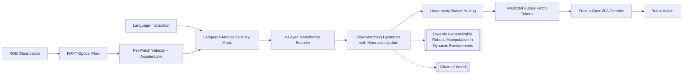

---
tags:
- paper
- domain/multimodal_perception
- domain/reinforcement_learning
- domain/robot_manipulation
- domain/vla
- domain/world_model
- impact/high_value
- method/latent_world_model
- method/reinforcement_learning
- method/simulation
- method/world_model
- review/auto_tagged
- status/unread
- task/manipulation
- task/scene_understanding
- type/system
aliases:
- 'Intercepting the Future: Latent-Space Predictive World Model for Dynamic VLA Manipulation'
- Latent World Model
- Motion-Aware VLA
- Adaptive Spatial Masking
- Uncertainty-Driven Rollout
- Dynamic VLA Manipulation
- Predictive World Model
- Latent-Space Prediction
arxiv_id: '2606.02486'
url: http://arxiv.org/abs/2606.02486v1
pdf_url: https://arxiv.org/pdf/2606.02486v1
local_pdf: '[[Intercepting the Future LatentSpace Predictive World Model for Dynamic
  VLA Manipulation.pdf]]'
github: None
project_page: None
institutions:
- Robotics Institute, Carnegie Mellon University
publication_date: '2026-06-01'
score: '8.0'
domains:
- multimodal_perception
- reinforcement_learning
- robot_manipulation
- vla
- world_model
methods:
- latent_world_model
- reinforcement_learning
- simulation
tasks:
- manipulation
- scene_understanding
paper_type: system
impact_band: high_value
reading_status: unread
priority_score: 111
review_status: auto_tagged
next_action: inspect_protocol
year: 2026
paper_id: arxiv:2606.02486
---

# Intercepting the Future: Latent-Space Predictive World Model for Dynamic VLA Manipulation

## 📌 Abstract
Vision-Language-Action (VLA) models generalize across static manipulation but fail when objects move during task execution. They map the current observation to an action and assume the scene is stationary between observation and execution, so at any non-trivial object speed the resulting latency exceeds the time available to grasp. We close this gap with AHEAD (Anticipatory Horizon Extrapolation with Adaptive Dynamics), a predict-then-act wrapper that augments a frozen VLA with a motion-aware latent world model. A small world model trained on manipulation video forecasts future patch tokens in the VLA's feature space, conditioned on per-token velocity and acceleration from optical flow. A language-and-motion saliency mask concentrates prediction on task-relevant patches, and the model rolls forward for an adaptive horizon, halting when prediction uncertainty crosses a threshold. The frozen action decoder then receives the predicted future tokens in place of the current ones. AHEAD adds 4.9M parameters to a frozen 7B OpenVLA and reaches 79 to 97% success across 20 dynamic simulation scenarios where the strongest baseline reaches 31 to 58%. On a physical UFactory xArm 7, AHEAD succeeds on 29/30 to 30/30 on three conveyor and rolling-ball tasks, 23/30 on paddle interception, and 19/30 on projectile catching where every baseline scores 0/30.

## 🖼️ Architecture
![[Intercepting the Future LatentSpace Predictive World Model for Dynamic VLA Manipulation_arch.png]]

## 🧠 AI Analysis
## Abstract
Vision-Language-Action (VLA) models generalize across static manipulation but fail when objects move during task execution. They map the current observation to an action and assume the scene is stationary between observation and execution, so at any non-trivial object speed the resulting latency exceeds the time available to grasp. We close this gap with AHEAD (Anticipatory Horizon Extrapolation with Adaptive Dynamics), a predict-then-act wrapper that augments a frozen VLA with a motion-aware latent world model. A small world model trained on manipulation video forecasts future patch tokens in the VLA’s feature space, conditioned on per-token velocity and acceleration from optical flow. A language-and-motion saliency mask concentrates prediction on task-relevant patches, and the model rolls forward for an adaptive horizon, halting when prediction uncertainty crosses a threshold. The frozen action decoder then receives the predicted future tokens in place of the current ones. AHEAD adds 4.9M parameters to a frozen 7B OpenVLA and reaches 79 to 97% success across 20 dynamic simulation scenarios where the strongest baseline reaches 31 to 58%. On a physical UFactory xArm 7, AHEAD succeeds on 29/30 to 30/30 on three conveyor and rolling-ball tasks, 23/30 on paddle interception, and 19/30 on projectile catching where every baseline scores 0/30.

AHEAD adds a small prediction module to existing vision-language-action models so they can handle scenes where objects keep moving after the robot sees them. The module works in the model's internal feature space rather than raw images, uses motion data from optical flow to guess where objects will go next, and stops predicting early when its guesses become unreliable. This lets a frozen OpenVLA model act on a future scene state instead of the current one, improving success rates on moving-object tasks without changing the original model weights.

## 1. Paper Card
The paper is titled 'Intercepting the Future: Latent-Space Predictive World Model for Dynamic VLA Manipulation'. The task domain is dynamic robotic manipulation where objects move independently of the robot, such as on conveyors or under gravity, combined with natural language instructions. The main problem is that vision-language-action models assume the world stays still between seeing an image and executing an action, so even modest object speeds make the planned grasp miss because the scene has already changed. The one-sentence contribution is that AHEAD wraps any frozen VLA with a small latent-space world model that predicts future patch tokens only for task-relevant moving patches and feeds those predictions to the original action decoder. The claimed novelty is adaptive spatial and temporal compute allocation through language-and-motion saliency and uncertainty-driven halting, plus explicit kinematic conditioning that propagates velocity and acceleration analytically rather than learning them. This paper matters because it shows how to add predictive capability to large pretrained VLAs without retraining them, addressing a practical gap between static lab tasks and real-world moving objects. Readers who should care are researchers working on VLA generalization, world models for robotics, or real-time dynamic manipulation who want to extend existing models rather than train new ones from scratch.

## 2. Problem And Motivation
Vision-language-action models take an image and a language instruction and directly output a robot action, but they treat each image as a frozen snapshot. When an object is moving on its own, the time between the camera capturing the image and the robot finishing its motion means the planned grasp targets an older location, and the object is no longer there. Previous approaches either tried to shorten the perception-to-action loop with faster policies or used world models that predict entire scenes over fixed horizons in pixel space, both of which either leave residual latency or cost too much compute for real-time use. The limitation matters because simple tasks like picking a cup from a conveyor or catching a rolling ball remain unsolved for current large VLAs even though humans solve them routinely with internal predictions of object motion. The scientific pressure comes from the fact that manufacturing and service robots increasingly encounter independently moving objects, yet scaling VLAs has focused on static data collection where objects do not move during execution.

## 3. Core Method
AHEAD starts with three consecutive camera frames and uses an optical flow estimator to compute per-patch velocity and acceleration vectors. These motion values are attached to the patch tokens coming from the frozen VLA vision encoder so that each token carries both appearance features and its own kinematic state. A cross-attention layer then scores every token for relevance to the language instruction and raises the score for tokens that show independent motion, after which only the top-scoring tokens are kept for further processing while the rest pass through unchanged. The selected tokens enter a small transformer encoder that compresses them into a compact latent representation, and a flow-matching dynamics model then rolls this latent state forward step by step. At each rollout step the velocity is updated analytically using constant-acceleration kinematics before being fed back into the dynamics model, which generates the next latent state. After several steps an uncertainty estimate computed from multiple parallel samples decides whether to stop the rollout, and the final predicted tokens are decoded and spliced back into the full token grid so the frozen action decoder can produce an action that targets the anticipated future state. The authors likely chose flow matching over diffusion because it requires only a handful of Euler steps instead of hundreds, which keeps the whole loop inside the real-time budget. A simpler alternative would have been to predict the entire image or to retrain the whole VLA, but those choices would either explode compute or destroy the pretrained capabilities. Without the saliency mask the model would waste capacity predicting static background patches, and without the adaptive halt it would either stop too early on easy scenes or continue into unreliable predictions on chaotic ones.

## 4. Equations, Algorithms, And Architecture
The architecture shown in Figure 2 begins with RAFT optical flow computed on three frames, pools the flow to the VLA patch grid, and uses finite differences to obtain per-token velocity and acceleration; these values are concatenated to the patch tokens before saliency selection. The main dynamics step uses the autoregressive rollout in Equation 2, where z_{t+k} is drawn from a conditional distribution given the previous latent state together with the current velocity and acceleration vectors for the selected patches. Equation 3 supplies the analytic velocity update V_k = V_0 + A · k · Δt; here V_0 is the initial optical-flow velocity, A is the initial acceleration, k counts rollout steps, and Δt is the time per step, so the equation simply adds the effect of constant acceleration analytically instead of forcing the learned model to discover second-order motion. Equation 4 computes scene-level uncertainty as the average squared distance of S parallel samples from their mean at each future step; the rollout stops at the first k where this average variance exceeds a threshold calibrated on the training set. Figure 2 illustrates how language conditioning and motion magnitude together decide which of the 196 patches are selected, how the flow-matching ODE is solved with Euler integration, and how predicted tokens are re-injected into the frozen OpenVLA backbone; the diagram also marks the small trainable parts in flame icons and the frozen components in snowflake icons. The method assumes that object motion over short horizons can be approximated by constant acceleration, an assumption the paper acknowledges breaks down after collisions.

## 5. Experiments And Evidence
Simulation experiments use custom MuJoCo scenes across four motion categories and report mean success over five seeds and 100 rollouts per cell. Table 1 answers whether explicit prediction helps in both constant-velocity and acceleration regimes, and the numbers show AHEAD at 87.7 to 97.3 percent while the strongest baseline reaches at most 58.3 percent, with the gap largest on acceleration tasks. Table 2 answers speed robustness on the conveyor task and reports that AHEAD stays above 95 percent from 0 to 40 cm/s while all baselines drop steadily once motion begins. Table 3 tests complex scenes including occlusion and shows AHEAD at 79.4 percent on the occlusion task where every baseline except one scores exactly zero, supporting the claim that prediction behind occluders requires lookahead rather than reactivity. Physical experiments on a UFactory xArm 7 evaluate five tasks with 30 trials each and report AHEAD reaching 30/30, 29/30, and 23/30 on three tasks while every baseline scores 0/30 on projectile catching. Table 4 also includes a speed sweep on the conveyor task confirming that only AHEAD exceeds chance beyond 5 cm/s. Ablation Table 5 shows that removing language-and-motion saliency, the kinematic update, or the adaptive horizon each drops average success by 10 to 40 points, and the paper notes graceful degradation rather than competitive performance on chaotic post-collision scenes. No baseline that jointly retrains the VLA backbone is included, which leaves open whether end-to-end fine-tuning could close the gap at higher compute cost.

## 6. Contributions And Limitations
The paper's evidence supports three contributions: a wrapper architecture that adds predictive lookahead to any frozen VLA without retraining, adaptive allocation of compute both across image patches via saliency and across time via uncertainty halting, and an analytic kinematic conditioning step that extends the world model to acceleration regimes without learning second-order dynamics. These claims rest on consistent outperformance across 20 simulation scenarios and five physical tasks, plus ablations that isolate each component. Limitations include the constant-acceleration assumption that causes performance to fall to 48.6 percent on the longest-horizon Plinko task, reliance on image-plane optical flow that ignores depth motion, and use of only about 200 in-lab trajectories for fine-tuning so transfer to different robot morphologies remains untested. The physical results show 11 failures on projectile catching that split between joint-limit stops and timing or contact errors, indicating that prediction quality is necessary but not sufficient when hardware constraints or gripper compliance intervene. Scalability concerns arise because the method still requires a separate motion estimator and multiple forward passes for uncertainty, and the paper provides no data on how the latency budget scales with higher-resolution images or longer maximum horizons.

## 7. Reproduction Notes
The backbone is the 7B OpenVLA model kept completely frozen. Pretraining uses a corpus of manipulation videos; fine-tuning uses approximately 200 in-domain xArm 7 trajectories. The world model is a 4-layer transformer encoder plus MLP decoder trained with conditional flow matching for the dynamics and mean-squared error for reconstruction, plus a separate feature alignment layer. Evaluation uses success rate defined per scenario in Appendix C.1, with 100 rollouts per seed in simulation and 30 trials per task on hardware. Baselines include OpenVLA variants, Realtime ACT, Streaming Diffusion Policy, and DreamVLA. Key hyperparameters are S equals 5 samples, 5 Euler steps, Kmax equals 10, uncertainty threshold at the 90th percentile of training uncertainty, and saliency threshold 0.2. RAFT provides optical flow, and morphological dilation is applied after saliency scoring. The full pipeline runs in approximately 158 milliseconds. No code or data release is stated in the text. Missing details include the exact pretraining corpus size, the precise value of the motion threshold tau_flow, and the calibration procedure for alpha_motion.

## 8. What To Read Closely
Read the Method section fully because it explains how saliency selection, kinematic conditioning, and adaptive halting interact in one pipeline. Study Figure 2 next because it shows the data flow from optical flow through the latent rollout to the frozen decoder, clarifying which parts are trained and which are frozen. Examine Tables 2 and 3 because they directly test the core claim that prediction outperforms reactivity as speed and scene complexity increase. The architecture ablation in Appendix E deserves attention if implementation details matter. Skim the Related Work section after understanding the method, because it mainly positions the paper against concurrent faster-inference work rather than providing new algorithmic insight.

## 9. Research Ideas And Open Questions
One idea is to replace the single RAFT velocity estimate with an ensemble of flow estimates so that velocity uncertainty can be propagated through the rollout alongside dynamics uncertainty. A small experiment could fine-tune the current model on the same 200 trajectories while adding dropout to the flow input and measuring whether the uncertainty threshold now triggers earlier on fast conveyor scenes; the metric would be the fraction of trials where the gripper arrives after the object has passed. The risk is that extra variance simply makes the model halt too early and reduces overall success without improving timing on hard cases.

A second idea is to add a learned depth-augmented flow head that consumes an additional depth image so predictions account for motion toward or away from the camera. The experiment would collect 50 extra trajectories with a depth camera on the projectile task, train a lightweight depth-conditioned flow module, and compare catch success against the image-plane baseline at 20 cm/s conveyor equivalent speeds. Success would be measured by whether the new model reduces late-arrival failures; the risk is that depth noise in real cameras could make the added conditioning hurt performance on the original lateral-motion tasks.

A third idea is to test whether AHEAD can be attached to a faster but weaker VLA backbone without losing its advantage. The experiment would swap the 7B OpenVLA for a distilled 2B variant on the same simulation conveyor suite, keep the world model fixed, and measure whether the combined system still outperforms the original baselines at 30 cm/s while running under 100 milliseconds. The observation to track is the new latency-success trade-off curve; the risk is that the weaker backbone cannot decode the predicted tokens reliably, collapsing the entire advantage.

## 🔗 Knowledge Graph & Connections

### Related Work Connections
AHEAD shares the core problem of enabling vision-language-action models to handle independently moving objects with [[Towards Generalizable Robotic Manipulation in Dynamic Environments]]. Both papers identify that single-frame VLA observations fail in dynamic settings and turn to optical flow for motion awareness, then build predictive mechanisms to anticipate future object states. The key difference is that AHEAD operates as a lightweight wrapper around a frozen 7B OpenVLA using flow-matching dynamics with explicit constant-acceleration updates and uncertainty-based halting, while the other work proposes PUMA as an integrated architecture that adds scene-centric historical optical flow and specialized world queries inside a new model. This implies AHEAD offers easier deployment on existing VLAs without retraining, whereas PUMA may achieve tighter coupling of history and prediction at the cost of architectural changes.

AHEAD also connects to [[Chain of World]] through the shared goal of injecting temporal-causal structure into VLAs via latent world models rather than raw pixel prediction. Both approaches factorize motion into compact representations to avoid wasting capacity on static backgrounds, with AHEAD using per-patch velocity and acceleration from RAFT flow and [[Chain of World]] using a pretrained video VAE to extract structure and motion latents for a continuous latent motion chain. The difference lies in AHEAD keeping the underlying VLA frozen and adding adaptive horizon halting, compared to [[Chain of World]]'s pre-training and co-fine-tuning phases that align latent dynamics directly with the VLA. The distinction suggests AHEAD prioritizes real-time compute efficiency on pretrained models, while the latent-chain method may scale better for long-horizon reasoning but requires joint optimization.

Finally, connections exist with [[World Action Models are Zero shot Policies]] because both papers replace reactive VLA behavior with predictive world models that learn physical dynamics from video-like data. AHEAD predicts future VLA patch tokens conditioned on kinematic states using flow matching, and [[World Action Models are Zero shot Policies]] uses a video diffusion backbone in DreamZero to jointly model video and actions for zero-shot generalization. The main divergence is AHEAD's focus on a small 4.9M-parameter wrapper with language-and-motion saliency and analytic velocity propagation, versus the larger diffusion-based model that enables cross-embodiment transfer from human or other-robot video. This highlights AHEAD's strength in low-latency attachment to existing systems, while the diffusion approach trades compute for broader data-driven physical understanding.

### Concept Map

### Questions For Future Reading
How does the choice between explicit kinematic conditioning and fully learned dynamics influence robustness when object properties like mass or friction vary across environments? This matters because real-world deployments often encounter physical parameters absent from training data, and evidence from

---
*Analysis by PaperBrain (deepseek/deepseek-v4-pro)*

## 📂 Resources
- **Local PDF**: [[Intercepting the Future LatentSpace Predictive World Model for Dynamic VLA Manipulation.pdf]]
- [Online PDF](https://arxiv.org/pdf/2606.02486v1)
- [ArXiv Link](http://arxiv.org/abs/2606.02486v1)

## Related Work Updates
- [ ] **2026-06-02**: New paper [[AHEAD Latent World Model for Dynamic VLA]] discusses *intercepting the future: latent-space predictive world model for dynamic vla manipulation*. Innovation: "A predict-then-act wrapper that augments a frozen VLA with a motion-aware latent world model using language-and-motion saliency and adaptive uncertainty-driven horizon."
- [ ] **2026-06-02**: New paper [[AFUN Affordance Foundation Model]] discusses *predictive world model*. Innovation: "Unified affordance foundation model predicting task-conditional functional masks and 3D post-contact motion curves from RGB-D and language, trained on a large-scale heterogeneous dataset."
- [ ] **2026-06-03**: New paper [[AHEAD Latent World Model for Dynamic VLA Manipulation]] discusses *intercepting the future: latent-space predictive world model for dynamic vla manipulation*. Innovation: "A predict-then-act wrapper that augments a frozen VLA with a motion-aware latent world model, using per-token velocity/acceleration conditioning and adaptive spatial-temporal allocation to handle dynamic objects."
- [ ] **2026-06-03**: New paper [[DynaFLIP DynamicsAware Visual Pretraining]] discusses *dynamic vla manipulation*. Innovation: "Introduces tri-modal (image, language, 3D flow) alignment via simplex volume minimization on a hypersphere to inject dynamics awareness into an image-only encoder."
- [ ] **2026-06-03**: New paper [[QwenVLA Unified VLA for Manipulation and Navigation]] discusses *dynamic vla manipulation*. Innovation: "Unifies manipulation, navigation, and trajectory prediction into a single VLA model using embodiment-aware prompts and a DiT-based action decoder."
- [ ] **2026-06-04**: New paper [[LeJEPA]] discusses *latent world model*. Innovation: "Proves that LeJEPA achieves linear identifiability of world latent variables if and only if the latent distribution is Gaussian, providing the first identifiability guarantee for JEPA-based world models."