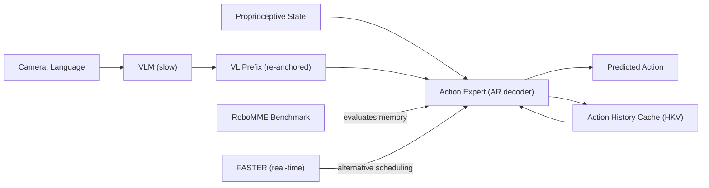

---
tags:
- paper
- domain/multimodal_perception
- domain/robot_manipulation
- domain/vla
- impact/high_value
- impact/solid
- method/diffusion_policy
- method/foundation_model
- method/memory
- method/planning
- review/auto_tagged
- status/unread
- task/manipulation
- task/planning_reasoning
- task/scene_understanding
- type/method
- type/system
aliases:
- 'AR-VLA: True Autoregressive Action Expert for Vision-Language-Action Models'
- AR-VLA
- Autoregressive Action Expert
- True Autoregressive VLA
- Re-anchoring Mechanism
- Persistent Memory VLA
- Asynchronous Vision-Language Conditioning
- Continuous Action Generation
- Standalone Action Expert
- AR Action Expert
- VLA with Persistent Memory
authors:
- Yutong Hu
- Jan-Nico Zaech
- Nikolay Nikolov
- Yuanqi Yao
- Sombit Dey
- Giuliano Albanese
- Renaud Detry
- Luc Van Gool
- Danda Paudel
paper_id: arxiv:2603.10126
arxiv_id: '2603.10126'
url: https://huggingface.co/papers/2603.10126
pdf_url: https://arxiv.org/pdf/2603.10126.pdf
local_pdf: '[[ARVLA True Autoregressive Action Expert for VisionLanguageAction Models.pdf]]'
github: None
project_page: https://arvla.insait.ai/
institutions:
- INSAIT, Sofia University “St. Kliment Ohridski”
- KU Leuven, Dept. Mechanical Engineering
publication_date: '2026-05-19'
metadata_publication_date: '2026-05-11'
score: '8.0'
domains:
- multimodal_perception
- robot_manipulation
- vla
methods:
- memory
- planning
tasks:
- manipulation
- planning_reasoning
- scene_understanding
paper_type: system
impact_band: high_value
reading_status: unread
priority_score: 103
review_status: auto_tagged
next_action: inspect_protocol
year: 2026
---

# AR-VLA: True Autoregressive Action Expert for Vision-Language-Action Models

## 📌 Abstract
We propose a standalone autoregressive (AR) Action Expert that generates actions as a continuous causal sequence while conditioning on refreshable vision-language prefixes. In contrast to existing Vision-Language-Action (VLA) models and diffusion policies that reset temporal context with each new observation and predict actions reactively, our Action Expert maintains its own history through a long-lived memory and is inherently context-aware. This structure addresses the frequency mismatch between fast control and slow reasoning, enabling efficient independent pretraining of kinematic syntax and modular integration with heavy perception backbones, naturally ensuring spatio-temporally consistent action generation across frames. To synchronize these asynchronous hybrid V-L-A modalities, we utilize a re-anchoring mechanism that mathematically accounts for perception staleness during both training and inference. Experiments on simulated and real-robot manipulation tasks demonstrate that the proposed method can effectively replace traditional chunk-based action heads for both specialist and generalist policies. AR-VLA exhibits superior history awareness and substantially smoother action trajectories while maintaining or exceeding the task success rates of state-of-the-art reactive VLAs. Overall, our work introduces a scalable, context-aware action generation schema that provides a robust structural foundation for training effective robotic policies. Code and Videos available at https://arvla.insait.ai

## 🖼️ Architecture
![[ARVLA True Autoregressive Action Expert for VisionLanguageAction Models_arch.png]]

## 🧠 AI Analysis
## Abstract

We propose a standalone autoregressive (AR) Action Expert that generates actions as a continuous causal sequence while conditioning on refreshable vision-language prefixes. In contrast to existing Vision-Language-Action (VLA) models and diffusion policies that reset temporal context with each new observation and predict actions reactively, our Action Expert maintains its own history through a long-lived memory and is inherently context-aware. This structure addresses the frequency mismatch between fast control and slow reasoning, enabling efficient independent pretraining of kinematic syntax and modular integration with heavy perception backbones, naturally ensuring spatio-temporally consistent action generation across frames. To synchronize these asynchronous hybrid V-L-A modalities, we utilize a re-anchoring mechanism that mathematically accounts for perception staleness during both training and inference. Experiments on simulated and real-robot manipulation tasks demonstrate that the proposed method can effectively replace traditional chunk-based action heads for both specialist and generalist policies. AR-VLA exhibits superior history awareness and substantially smoother action trajectories while maintaining or exceeding the task success rates of state-of-the-art reactive VLAs. Overall, our work introduces a scalable, context-aware action generation schema that provides a robust structural foundation for training effective robotic policies. Code and Videos available at [https://arvla.insait.ai/](https://arvla.insait.ai/).

> [!info] Core Idea
> Instead of predicting blocks of actions from a single snapshot each time, the method keeps a running memory of past actions. It updates vision and language input only when new information arrives, keeping motion smooth and consistent even with slow visual updates. This is analogous to a **cerebellum** (motor thread) running at high frequency while a **brain** (vision-language model) updates asynchronously.

## 1. Core Snapshot

### Problem Statement

Existing Vision-Language-Action (VLA) models, such as [OpenVLA](https://openvla.github.io/), [RT-2](https://robotics-transformer2.github.io/), and [Diffusion Policy](https://diffusion-policy.cs.columbia.edu/), treat action generation as a series of isolated decisions. At each new camera frame they re‑encode the scene and output a short block of future actions (action chunking, see [ACT](https://tonyzhaozh.github.io/aloha/)), discarding any record of what the robot did moments earlier. The input is a vision-language observation plus the current robot state; the output is an action chunk. The target behavior is smooth, history-aware control on manipulation tasks.

The real bottleneck is called **Markovian amnesia**: the policy cannot accumulate kinematic momentum or remember which sub‑goal it already completed because its internal state resets every perception cycle. This leads to reactive, snapshot‑conditioned responses that lose temporal continuity. In practice, the robot may produce jerky trajectories or fail on tasks where past actions are the only clue to the current state (e.g., pushing an object until it disappears from view). 

> [!warning] Key Bottleneck
> The policy resets its memory with each new observation, as if waking up for the first time. This structural reactivity prevents the model from learning a persistent sense of motion dynamics.

### Core Contribution

The central technical claim is that a **standalone autoregressive action expert** can replace chunk‑based heads in both generalist and specialist VLAs. The authors introduce two concrete components:

1. **Hybrid Key-Value (HKV) cache**: a Transformer decoder that maintains a long rolling window of past actions separate from a single refreshable vision-language prefix slot.
2. **Dynamic Temporal Re‑anchoring (DTR)**: a mechanism that uses Rotary Position Embeddings (RoPE) to make the model aware of exactly how stale each visual prefix is, by assigning keys a positional index equal to the frame capture time.

Evidence for the claims comes from higher success rates on the [BridgeV2](https://rail.eecs.berkeley.edu/datasets/bridge_release_v2/)→[SimplerEnv](https://simpler-env.github.io/) benchmark (61.5 % average vs. 52.1 % for the next best, CogACT) and on real WidowX tasks, plus noticeably lower jerk and better results on custom long‑horizon benchmarks (PushT2, Stack3). The change is structural rather than purely architectural: the same VLM backbone is kept intact, and only the action head is transformed into an independent causal sequence model that streams actions at high frequency while the perception backbone updates asynchronously.

> [!important] Structural Decoupling
> AR-VLA decouples the “brain” (VLM) from the “cerebellum” (action expert), enabling each to run at its natural frequency without blocking the other.

### Innovation Origin & Rationale

The idea originates from the **next‑token prediction** paradigm that powers large language models ([GPT‑3](https://arxiv.org/abs/2005.14165)). The authors observe that the same causal structure can be applied to robot trajectories: each new action is predicted from the entire preceding kinematic history, just as a language model predicts the next word from the conversation’s flow.

This is presented as a direct response to the frequency mismatch between slow vision‑language reasoning (often hundreds of milliseconds per inference) and fast motor control (ideally running at 10–50 Hz). The rationale is that treating actions as a **continuous language of motion** lets the model:

- Learn joint limits, dynamics, and physical causality once during action‑only pretraining,
- Stay temporally consistent later even when visual updates arrive late.

The paper explicitly contrasts reactive chunking with streaming control, though it does not survey earlier recurrent or memory‑augmented robot policies in depth. The core insight is that manipulation is **not** a stack of separate visual‑motor snapshots, but a streaming control problem that requires persistent, context‑aware memory.

> [!tip] Related Concept
> For an understanding of Rotary Position Embeddings (RoPE) used in DTR, see the original paper: [RoFormer: Enhanced Transformer with Rotary Position Embedding](https://arxiv.org/abs/2104.09864).

## 2. Reading Map

The paper targets researchers working on VLA policies who want an alternative to diffusion or flow‑matching action heads. The task domain is tabletop manipulation, spanning generalist (BridgeV2 pretraining) and specialist ([PushT](https://robomimic.github.io/), [ALOHA](https://aloha-robot.github.io/)) settings.

**First pass**: read the Abstract, Section I (Introduction), Section III‑A (problem formulation), and Section IV‑A (generalist results) to grasp the core claim and main evidence.  
**Skim the related‑work section** after you understand the method.  

Pay close attention to **Sections III‑B and III‑C** (Hybrid KV cache and Dynamic Temporal Re‑anchoring), as they contain the two novel mechanisms. **Section IV‑C and the ablation table (Table IV)** are essential for understanding how history length and stochastic masking affect performance. The figures in Section IV can be reviewed quickly once the quantitative tables are digested.

> [!tip] Reading Order
> 1. [[#Abstract]] – the one‑sentence summary  
> 2. [[#1. Core Snapshot]] – what problem, what solution, why  
> 3. [[#3. Method Walkthrough]] – how it works  
> 4. [[#4. Core Theory And Formulas]] – the math behind the design  
> 5. [[#6. Experiments And Evidence]] – quantitative proof  
> 6. [[#7. Strengths, Limitations, And Failure Cases]] – what to watch for

## 3. Method Walkthrough

### Inputs, Outputs, and Assumptions

The method receives a **stream** of robot states and actions along with **occasional** vision‑language observations. It predicts the next continuous action vector, which can represent end‑effector deltas or joint velocities.  

The key assumption is that **proprioceptive history remains reliable** (i.e., joint encoders are accurate and noise‑free) and that visual‑language features can be treated as static semantic prefixes whose capture time is known. This assumption matters because the entire benefit of context awareness collapses if the action cache cannot stay synchronized with the robot’s physical state or if visual staleness cannot be expressed through relative position indices.

> [!warning] Implicit Assumption
> The method assumes that proprioception (joint angles, velocities) is always available and accurate. The paper does not stress‑test noisy or delayed proprioceptive inputs.

### Pipeline from Data to Prediction

During inference, two threads run concurrently:

- **Action thread** (high frequency): It reads the current robot state, queries the Hybrid KV cache, and outputs the next action. The new action is immediately written back into the action stream FIFO and the global time index increments.
- **Perception thread** (low frequency): When a new image arrives, its VLM embedding is re‑anchored via DTR and replaces the single VL slot in the cache.

The model therefore always conditions on the **latest available visual prefix** plus the **full recent kinematic history**, without waiting for vision at every control step. This asynchronous design keeps the motor control loop fast and temporally consistent, while the heavy perception model can operate at its own slower pace.

### Key Design Choices

The **Hybrid KV cache** separates the two memory streams so the action expert never blocks on the VLM. A simpler alternative would be to concatenate every new visual token into a single growing context, but that would couple the frequencies and force the action stream to wait. Without this separation, the claimed advantage of independent high‑frequency control disappears.

**Dynamic Temporal Re‑anchoring** assigns each visual key a fixed positional index equal to the frame capture time. Using relative rotations (RoPE), the model sees the *difference* between the query’s time step and the visual frame’s capture step. A simpler absolute‑position scheme would produce out‑of‑distribution attention scores once the global timestep exceeds the training horizon; the relative formulation keeps the same staleness delta in‑distribution at any absolute time.

**Stochastic history masking** (rate 0.6 during Phase‑2 training) prevents the model from over‑relying on perfect history and forces it to use the visual prefix even when some past tokens are hidden. This is akin to dropout on the temporal axis and makes the policy robust to missing or corrupted history.

> [!tip] Design Principle
> The separation of streams and relative staleness encoding allows the model to be trained with short sequences but deployed indefinitely—a form of extrapolation through structure.

## 4. Core Theory And Formulas

### Main Objective

The overall goal is to maximize the likelihood of each future action conditioned on both the most recent visual‑language prefix and the entire preceding kinematic history. This is expressed as a **causal sequence modeling objective** rather than a per‑chunk reconstruction loss.

### Important Equations

**Autoregressive actor definition** (Eq. from paper, contrasting with the reactive baseline that conditions only on the current observation):

$$P_{\text{AR}}(\tau) = \prod_{t=1}^{T} P(a_t \mid \Phi(v_i, l),\ a_{<t},\ s_{<t})$$

Here  
- $\tau$ is the full trajectory,  
- $a_t$ is the action at time $t$,  
- $\Phi(v_i, l)$ is the vision‑language embedding from the most recent available frame $i \le t$,  
- $a_{<t}$ and $s_{<t}$ are the entire action and state histories before step $t$.

This equation encodes that the probability of the next action depends explicitly on the rolling kinematic past, which is the fundamental structural difference from the reactive baseline (where the probability would condition only on the latest snapshot). In practice, the model sees not only *what* is seen but also *how* the robot has been moving.

**Phase‑1 pretraining loss** (action‑only):

$$L_{\text{Phase1}} = \sum_{t=1}^{T} \mathcal{L}(x_t \mid x_{<t})$$

$x_t$ denotes the proprioceptive or action token at step $t$. Minimizing this loss teaches the Transformer decoder to capture joint constraints, common movement patterns, and physical causality **without any visual input**. This is essentially learning the “syntax of motion” from large‑scale trajectory data.

**Phase‑2 alignment loss with historical dropout**:

$$L_{\text{Phase2}} = \sum_{k=0}^{M-1} \mathcal{L}(x_{H+k} \mid M_k \odot x_{\text{past}},\ \Phi(v_H, l_H),\ x_{H:H+k-1})$$

- $H$ is the horizon start (the point where a new visual observation arrives),  
- $M$ is the number of future actions to predict,  
- $M_k$ is a random binary mask applied to the history for the $k$‑th future token,  
- $\Phi(v_H, l_H)$ is the vision‑language embedding of the image captured at time $H$,  
- $x_{H:H+k-1}$ are the already‑generated future actions (causal conditioning).  

The mask $M_k$ forces the model to predict actions even when parts of the history are hidden, improving robustness when the action cache is imperfect at deployment.

> [!note] Stochastic History Masking
> The mask rate 0.6 is chosen empirically. Too high a rate degrades performance by removing too much context; too low makes the model fragile to missing history. The optimum balances reliance on memory and resilience.

### Algorithmic Intuition

The attention computation inside the decoder uses **Rotary Position Embeddings (RoPE)**. The key idea: the attention score between a query at step $m$ and a visual key anchored at step $n$ depends only on the relative offset $\Delta t = m - n$. Because the rotation is applied only to keys (the value vectors remain fixed), the weighted sum of values remains a pure function of perceived staleness. This relative encoding is what allows the model to extrapolate to longer horizons than seen during training.

During inference, the action thread appends each predicted action to the rolling FIFO and increments the time index. The perception thread overwrites the single VL slot whenever a new frame arrives. No additional synchronization logic is needed—the relative positions naturally encode the age of each piece of information.

> [!tip] Why RoPE?
> Relative encoding via rotation is critical to avoid out‑of‑distribution attention patterns when the sequence length exceeds the training horizon. It makes staleness a **trainable, relative concept**.

## 5. Architecture, Figures, and Implementation

The architecture is a **Transformer decoder** whose KV cache is split into:

- **Action stream**: a long rolling FIFO (e.g., 20 steps of proprioceptive tokens).
- **VL stream**: a single‑slot refreshable buffer (for the latest visual‑language embedding).

Figure 3 of the paper illustrates the VLM (the “brain”) feeding re‑anchored KV pairs into the shared cache while the action expert autoregressively generates future tokens. The real‑robot experiment photos show the WidowX setup used for zero‑shot evaluation; one scene (eggplant in sink) corresponds to a task where AR‑VLA reached 100 % success.

Implementation details such as the precise dimension of the action projection layer, the exact learning‑rate schedule for Phase‑1, or the batch size are **not stated in the provided text**.

> [!missing] Missing Hyperparameters
> The text does not give the learning rate, batch size, or the exact width of the Action Expert. These must be inferred from the code repository (when published) or supplementary material.

## 6. Experiments and Evidence

### Generalist Performance

All models are trained on [BridgeV2](https://rail.eecs.berkeley.edu/datasets/bridge_release_v2/) and evaluated on the [SimplerEnv](https://simpler-env.github.io/) Visual Matching benchmark. AR‑VLA reaches **61.5 % average success**, while the next best baseline (CogACT) achieves 52.1 %. On the real WidowX robot the same model achieves **89 % average success** across six tasks, with perfect scores on cup‑on‑plate and lobster tasks.

### Specialist Tasks

On the specialist benchmarks PushT (from [robomimic](https://robomimic.github.io/)) and ALOHA tasks (cube transfer, etc.), AR‑VLA is competitive with or better than ACT and Diffusion Policy. Notably, it attains **97.33 % scripted success** on ALOHA cube transfer.

### History Awareness

Two custom long‑horizon tasks (PushT2, Stack3) isolate the need for context: the reactive baselines fail because past information becomes unobservable (e.g., the puck disappears under the gripper). AR‑VLA achieves **81.2 % and 71 % success**, respectively, demonstrating that the persistent memory allows the policy to “remember” what it did even when the current image lacks that information.

### Smoothness and Latency

Table III shows that AR‑VLA produces the lowest average and maximum jerk while maintaining lower effective latency per action (since the action thread does not wait for the VLM).

### Ablations

The ablation study (Table IV) reveals:
- Removing Phase‑1 pretraining drops success from 61.5 % to 37.5 %, highlighting that kinematic pretraining is crucial.
- A history‑mask rate of 0.6 is optimal.
- A context length of 20 steps is sufficient for peak performance; longer windows do not improve further.

> [!success] Key Takeaway
> The structural change to an autoregressive action expert yields measurable gains in success rate, smoothness, and long‑horizon robustness, while maintaining or exceeding the accuracy of state‑of‑the‑art reactive methods.

## 7. Strengths, Limitations, and Failure Cases

### Strengths

- **Quantitative gains** on generalist (SimplerEnv) and specialist benchmarks, often by large margins.
- **Qualitative improvements**: trajectories are smoother (lower jerk) and the policy can complete tasks that require memory of past actions.
- **Modular design**: the same VLM backbone is preserved; only the action head is replaced, making it easy to integrate with existing perception models.
- **Decoupled frequencies**: the high‑frequency action thread runs independently of the slow VLM, enabling real‑time control without sacrificing visual context.

### Limitations

- **Knowledge insulation requirement**: the paper states that direct autoregressive gradients can degrade VLM priors, so a knowledge‑insulation strategy is needed, but the text does not quantify the degradation that occurs without it.
- **Compounding errors**: a long action cache could push the policy into out‑of‑distribution states if errors in predicted actions accumulate over time. The paper does not provide failure cases or analysis of this effect.
- **Reliance on proprioception**: the method assumes proprioceptive history is always available and noise‑free; its behaviour with sensor dropouts or drift is not evaluated.

> [!warning] Open Questions
> - How sensitive is AR‑VLA to VLM staleness (e.g., if an image is delayed by 1 second)?
> - What happens if the action cache is corrupted by a poor early prediction?  
> - Can the method handle tasks where visual input must be updated at every step?

## 8. Reproduction Notes

**Training datasets**:  
- Generalist models use the [BridgeV2](https://rail.eecs.berkeley.edu/datasets/bridge_release_v2/) manipulation dataset.  
- Specialist models use scripted or human demonstrations for PushT and ALOHA tasks.

**Backbone**: The VLM is [Paligemma‑3B](https://blog.google/technology/ai/paligemma/) (a 3‑billion parameter vision‑language model) with a **300 M parameter action expert** (the autoregressive decoder).

**Training phases**:  
1. **Phase‑1**: Pretrain the action expert with next‑token prediction on trajectory data alone (no images).  
2. **Phase‑2**: Align the action expert to VLM features using stochastic history masking (rate 0.6).

**Evaluation metrics**: task success rate, maximum IoU (on PushT), and jerk (smoothness).  
**Baselines**: [OpenVLA](https://openvla.github.io/), [Octo](https://octo-models.github.io/) variants, [CogACT](https://cogact.github.io/), ACT, and Diffusion Policy.

**Code availability**: The project page ([https://arvla.insait.ai/](https://arvla.insait.ai/)) indicates that code and videos will be released, but **no direct repository link or detailed hyperparameter file is provided** in the text.

> [!missing] Missing Details
> - Exact batch size for Phase‑1 and Phase‑2  
> - Learning rate schedule  
> - Length of the action KV cache during training  
> - Dimension of the action projection layer  
> These must be obtained from the upcoming code release or supplementary material.

## 9. What to Read Closely

First, study **[[#3. Method Walkthrough]]** and the corresponding Figure 3 to understand the Hybrid KV cache and DTR—the mechanisms that enable context awareness and asynchronous operation.

Second, read **[[#6. Experiments And Evidence]]**: Tables I, II, and the ablation Table IV, along with the accompanying text, show how each design choice translates into measured performance.

Third, examine the two long‑horizon tasks in Section IV‑C and Figure 8, as they isolate the history‑awareness benefit and demonstrate the failure modes of reactive baselines.

The Introduction ([[#1. Core Snapshot]]) can be skimmed after understanding the method. Related work can be read last, unless you are specifically comparing memory mechanisms.

> [!tip] Focus
> The key contributions are the HKV cache and DTR. If you only have time for one section, read [[#3. Method Walkthrough]] thoroughly.

## 10. Research Ideas and Open Questions

**1. Scaling the action cache length**: Test whether increasing the action KV cache beyond 40 steps continues to improve long‑horizon tasks or eventually leads to attention dilution. A small experiment would train the same AR‑VLA architecture on the Stack3 task while sweeping cache lengths from 20 to 200 steps, measuring completion rate and average attention entropy on the action keys. The risk is that memory cost grows linearly and training may become unstable before any performance gain appears.

**2. Multi‑slot visual buffer**: Replace the static single‑slot VL buffer with a small rolling buffer of the three most recent visual embeddings, each with its own DTR anchor. Compare the original version against the three‑slot version on the real WidowX tasks that show recovery behaviour after grasp failures. The metric would be recovery success rate after an initial failure. The risk is that added visual tokens increase latency without a measurable robustness gain.

**3. Freezing the action expert after Phase‑1**: Investigate whether the action expert can remain frozen while only a small adapter is trained in Phase‑2. The experiment would compare full fine‑tuning of the action expert against an adapter‑only regime on the SimplerEnv suite and report both success rate and training GPU hours. The motivation is to retain the kinematic priors from Phase‑1; the risk is that the adapter cannot sufficiently condition the frozen expert on new visual features, yielding lower final performance.

> [!question] Open Research
> Each of these ideas explores a dimension of memory, perception, or training efficiency. The first two directly extend the architecture, while the third probes the trade‑offs between modularity and performance. All are well within reach of the codebase promised at [arvla.insait.ai](https://arvla.insait.ai/).

## Knowledge Graph & Connections

### Related Work Connections

**[[FASTER]]**  
FASTER and AR‑VLA both tackle the mismatch between fast motor control and slow vision‑language inference in VLA‑based robots. FASTER keeps a flow‑based action chunking head but reshapes the sampling schedule to shorten reaction time, while AR‑VLA replaces the chunk head entirely with a persistent autoregressive decoder that runs at its own high frequency. The difference implies that improving real‑time execution can be approached either by smarter scheduling inside an existing reactive policy (FASTER) or by structurally decoupling the action loop from perception (AR‑VLA); the latter also brings history awareness that scheduling alone cannot provide.

**[[HybridVLA]]**  
Both HybridVLA and AR‑VLA try to preserve continuous action precision while leveraging the reasoning capabilities of a pretrained VLM. HybridVLA fuses autoregressive generation and a diffusion head within a single language model, whereas AR‑VLA separates them: a frozen or lightly adapted VLM serves as a visual‑language prefix, and a completely standalone autoregressive Transformer generates continuous actions. This modular separation in AR‑VLA makes it easier to pretrain the action expert on pure motion data, but also risks insulating the expert from deep VLM reasoning; HybridVLA’s unified design may retain richer cross‑modal interaction at the cost of a more entangled training process.

**[[RoboMME]]**  
RoboMME provides a systematic benchmark for memory in vision‑language‑action policies, categorising temporal, spatial, object, and procedural memory demands. AR‑VLA’s Hybrid KV cache is a specific implementation of temporal memory (a rolling action window), and its custom long‑horizon tasks (PushT2, Stack3) already probe the kind of history‑dependence that RoboMME standardises. The natural next step is to evaluate AR‑VLA on the full RoboMME suite, which would clarify whether a simple rolling action cache is sufficient for more complex memory types or if richer representations (e.g., visual memory slots) are needed.

### Concept Map

### Questions For Future Reading
1. **How does the size and depth of the action expert affect long‑horizon memory, and what is the point of diminishing returns?**  
   *Why it matters:* Scaling the expert could improve memory capacity, but larger models may overfit to proprioceptive patterns or require more training data. *Evidence:* Experiments that sweep action‑expert parameters on tasks with increasing history length (e.g., Stack4, PushT3) while keeping the VLM fixed, measuring success and average attention entropy.

2. **Can the autoregressive action expert incorporate short‑term visual memory, and would that improve robustness when proprioceptive cues alone are insufficient?**  
   *Why it matters:* The current design relies solely on proprioceptive history; many real‑world tasks (e.g., manipulating an object that rolls out of sight) benefit from remembering recent visual states. *Evidence:* Adding a small rolling buffer of past visual tokens (with DTR) to the HKV cache and testing on tasks with intermittent occlusion, recording success and recovery rate.

3. **What are the failure modes when the action cache accumulates error over many steps, and can we detect or correct such drift?**  
   *Why it matters:* Autoregressive generation is susceptible to compounding errors; deploying a policy that silently drifts could cause safety issues. *Evidence:* Analysis of action‑prediction error over extended sequences (e.g., 500‑step rollouts) with and without occasional re‑synchronisation from a fresh visual frame, measuring drift in end‑effector pose and task success degradation.

### Learning Roadmap And Verified Resources

#### 1. Autoregressive Sequence Modeling
*Why it matters:* AR‑VLA treats robot actions as a causal sequence, predicting the next action from past actions and states. Understanding how causal attention and teacher forcing work in Transformers is essential to grasp why the action expert can maintain momentum.

*Study order:* Start with the concept of next‑token prediction in language models, then learn about causal masking and the Transformer decoder, and finally see how teacher forcing trains such a model.

| Type | Resource | Why this one |
|------|----------|--------------|
| Blog/Tutorial | [The Illustrated Transformer](https://jalammar.github.io/illustrated-transformer/) | Visual, clear explanation of attention and decoder architecture. |
| Open Textbook/Lecture Notes | [The Annotated Transformer](http://nlp.seas.harvard.edu/2018/04/03/attention.html) | Walk‑through of a full Transformer implementation, includes autoregressive decoding. |

#### 2. Vision‑Language‑Action (VLA) Models
*Why it matters:* AR‑VLA is positioned as a new action head for VLA policies. A solid understanding of how current VLAs (OpenVLA, RT‑2, Octo) combine visual features, language instructions, and action outputs is needed to see what changes the paper introduces.

*Study order:* First read the high‑level description of a VLA, then examine a specific implementation like OpenVLA, and finally look at action chunking in ACT and Diffusion Policy to understand the baseline.

| Type | Resource | Why this one |
|------|----------|--------------|
| Project Page | [OpenVLA Project Page](https://openvla.github.io/) | Official overview of a representative generalist VLA. |
| Research Paper | [RT‑2: Vision‑Language‑Action Models](https://robotics-transformer2.github.io/) | Foundational work that integrates vision‑language models with robot actions. |
| Blog/Tutorial | [Understanding Robot Action Chunking](https://tonyzhaozh.github.io/aloha/) (ACT) | Clear demonstration of chunk‑based action prediction. |

#### 3. Frequency Mismatch and Memory in Robot Control
*Why it matters:* The central motivation of AR‑VLA is that perception runs slowly while control requires fast, smooth updates. Grasping the concept of reactive vs. memory‑augmented policies is crucial to appreciate the HKV cache and asynchronous design.

*Study order:* Begin with the problem of latency in VLA inference, then study how action chunking and temporal ensembling try to compensate, and finally examine why these methods still lose temporal continuity and how persistent memory can help.

| Type | Resource | Why this one |
|------|----------|--------------|
| Project Page | [Diffusion Policy Page](https://diffusion-policy.cs.columbia.edu/) | Shows the reactive, chunk‑based paradigm that AR‑VLA aims to improve. |
| Benchmark | [RoboMME: Memory Benchmark for Policies](https://robomme.github.io/) | Provides a taxonomy and tasks that explicitly require history awareness. |

#### 4. Rotary Position Embeddings (RoPE)
*Why it matters:* Dynamic Temporal Re‑anchoring (DTR) relies on RoPE to encode the relative staleness of visual prefixes. Without understanding how RoPE creates relative position signals through rotation, the re‑anchoring mechanism remains opaque.

*Study order:* First learn about absolute vs. relative position encodings, then see how RoPE applies a rotation matrix to query/key vectors, and finally understand why this allows attention to depend on relative offsets.

| Type | Resource | Why this one |
|------|----------|--------------|
| Research Paper | [RoFormer: Enhanced Transformer with Rotary Position Embedding](https://arxiv.org/abs/2104.09864) | Original definition and motivation for RoPE. |
| Blog/Tutorial | [A Gentle Introduction to Rotary Position Embeddings](https://blog.eleuther.ai/rotary-embeddings/) (EleutherAI) | Visual, step‑by‑step derivation that builds intuition. |

#### 5. Transformer KV Caching and Hybrid Memory Design
*Why it matters:* The Hybrid KV cache is the physical separation of visual and action memory streams. Understanding how Transformer KV caches work during autoregressive generation reveals how the action expert can append its own tokens and how the visual slot is overwritten.

*Study order:* Start with the basic key‑value cache concept used in text generation, then study how it can be split into multiple streams, and finally see the specific design in AR‑VLA’s paper.

| Type | Resource | Why this one |
|------|----------|--------------|
| Code/Documentation | [Hugging Face KV Caching Explanation](https://huggingface.co/docs/transformers/generation_strategies#key-value-caching) | Concise, implementation‑focused reference. |
| Open Textbook/Lecture Notes | [The Annotated Transformer – Decoding Section](http://nlp.seas.harvard.edu/2018/04/03/attention.html#decoder) | Shows how a decoder uses a cache during auto‑regressive inference. |
| Project Page | [AR‑VLA Project Page](https://arvla.insait.ai/) | Primary source for the Hybrid KV cache design and code (once released). |

#### 6. Stochastic History Masking for Robustness
*Why it matters:* This training trick prevents the action expert from over‑relying on a perfect action cache, making it robust to missing or noisy history at deployment. Understanding it connects to regularisation ideas like dropout.

*Study order:* Review the concept of dropout and how it forces redundancy, then see how the same idea is applied along the time axis to entire action tokens, and finally read the ablation in the AR‑VLA paper that justifies the mask rate.

| Type | Resource | Why this one |
|------|----------|--------------|
| Research Paper | [Dropout: A Simple Way to Prevent Neural Networks from Overfitting](https://jmlr.org/papers/volume15/srivastava14a/srivastava14a.pdf) | Foundational regularisation technique that inspires history masking. |
| Project Page | [AR‑VLA Ablation Results](https://arvla.insait.ai/) | Shows empirical performance of different mask rates. |

> [!info] Resource link validation: checked 13 URL(s), 13 reachable.

---
*Analysis by PaperBrain (x-ai/grok-4.3; refinement: deepseek/deepseek-v4-pro; round2: deepseek/deepseek-v4-pro)*

## 📂 Resources
- **Local PDF**: [[ARVLA True Autoregressive Action Expert for VisionLanguageAction Models.pdf]]
- [Online PDF](https://arxiv.org/pdf/2603.10126.pdf)
- [ArXiv Link](https://huggingface.co/papers/2603.10126)

## Related Work Updates
- [ ] **2026-06-11**: New paper [[LightWAM]] discusses *ar action expert*. Innovation: "Introduces a lightweight World Action Model with frozen video backbone, latent-space video supervision, and a multi-layer feature fusion action decoder for efficient robot manipulation."