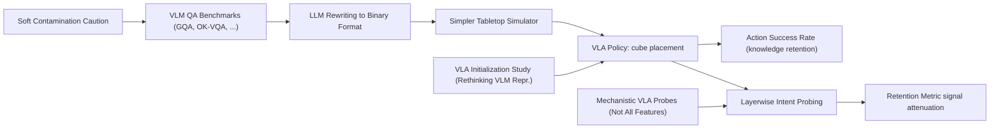

---
tags:
- paper
- domain/embodied_ai
- domain/multimodal_perception
- domain/reinforcement_learning
- domain/robot_manipulation
- domain/vla
- impact/high_value
- method/benchmark
- method/foundation_model
- method/reinforcement_learning
- review/auto_tagged
- status/unread
- task/manipulation
- task/scene_understanding
- type/analysis
- type/benchmark
aliases:
- Does VLA Even Know the Basics? Measuring Commonsense and World Knowledge Retention
  in Vision-Language-Action Models
- VLA Knowledge Retention
- Act2Answer Protocol
- Commonsense VLA
- Action-Grounded Evaluation
- Knowledge Decoupling
- Physical Object-Placement Test
- Embodied Knowledge Check
- VLA Commonsense Benchmark
authors:
- Nikita Kachaev
- Andrey Moskalenko
- Matvey Skripkin
- Nikita Kurlaev
- Daria Pugacheva
- Albina Burlova
- Mikhail Kolosov
- Denis Shepelev
- Andrey Kuznetsov
- Elena Tutubalina
- Aleksandr I. Panov
- Alexey K. Kovalev
- Vlad Shakhuro
paper_id: arxiv:2606.19297
arxiv_id: '2606.19297'
url: http://arxiv.org/abs/2606.19297v1
pdf_url: https://arxiv.org/pdf/2606.19297v1
local_pdf: '[[Does VLA Even Know the Basics Measuring Commonsense and World Knowledge
  Retention in VisionLanguageA.pdf]]'
github: None
project_page: https://tttonyalpha.github.io/act2answer
institutions:
- CogAI Lab
- FusionBrain Lab
publication_date: '2026-06-17'
metadata_publication_date: '2026-06-17'
score: '8.0'
domains:
- embodied_ai
- multimodal_perception
- reinforcement_learning
- robot_manipulation
- vla
methods:
- benchmark
- foundation_model
- reinforcement_learning
tasks:
- manipulation
- scene_understanding
paper_type: benchmark
impact_band: high_value
reading_status: unread
priority_score: 99
review_status: auto_tagged
next_action: inspect_protocol
year: 2026
---

# Does VLA Even Know the Basics? Measuring Commonsense and World Knowledge Retention in Vision-Language-Action Models

## 📌 Abstract
Embodied Vision-Language-Action (VLA) models are typically obtained by fine-tuning powerful pretrained VLMs on robotics data, yet it is unclear how much commonsense and factual knowledge they retain after adaptation. Failures on knowledge-sensitive tasks are ambiguous, conflating missing knowledge with poor generalization of low-level control. We introduce Act2Answer, a lightweight protocol that adapts VLM knowledge benchmarks to VLA evaluation by requiring agents to answer through action. Each question becomes a short tabletop episode where the agent performs a single object-placement action to select among candidate answers, yielding an action-grounded success rate with reduced control confounds. We curate a test suite of such environments across diverse commonsense and world-knowledge categories and introduce layerwise intent probing to localize answer-relevant information across the VLM backbone and action head. In a large-scale study of 7 VLA models and 9 VLM baselines, we systematically rank models across categories, finding that VLAs show solid performance on simple concepts while exhibiting larger gaps on richer semantic categories relative to their source VLMs, that VQA co-training is associated with better knowledge retention, and that answer-relevant signals peak in middle VLA layers but attenuate in upper layers. Act2Answer is available at https://tttonyalpha.github.io/act2answer/.

## 🖼️ Architecture
![[Does VLA Even Know the Basics Measuring Commonsense and World Knowledge Retention in VisionLanguageA_arch.png]]

## 🧠 AI Analysis
## Abstract

The paper introduces Act2Answer, a lightweight protocol that adapts VLM knowledge benchmarks to VLA evaluation by requiring agents to answer through action. Each question becomes a short tabletop episode where the agent performs a single object‑placement action to select among candidate answers, yielding an action‑grounded success rate with reduced control confounds. The authors curate a test suite of 1,720 binary questions across 12 commonsense and world‑knowledge categories and introduce layerwise intent probing to localize answer‑relevant information across the VLM backbone and action head. In a large‑scale study of 7 VLA models and 9 VLM baselines, they systematically rank models across categories, finding that VLAs show solid performance on simple concepts while exhibiting larger gaps on richer semantic categories relative to their source VLMs, that VQA co‑training is associated with better knowledge retention, and that answer‑relevant signals peak in middle VLA layers but attenuate in upper layers. The project page is at [tttonyalpha.github.io/act2answer](https://tttonyalpha.github.io/act2answer) and the paper is available at [arXiv:2606.19297](https://arxiv.org/abs/2606.19297).

> [!abstract] Key takeaway
> The protocol turns VLM knowledge questions into a single cube‑placement action to test whether a VLA still *knows* the answer, not just whether it can manipulate objects. The main finding is that fine‑tuning a VLM into a VLA often erases rich semantic knowledge, even when simple perceptual facts remain.

## 1. Core Snapshot

### Problem Statement

Vision‑Language‑Action (VLA) models are typically created by fine‑tuning strong pretrained vision‑language models (VLMs) on robot control data. The driving assumption is that the underlying world knowledge and commonsense reasoning of the VLM survive the adaptation and remain available for action. However, after robotics fine‑tuning, it is unclear how much of that knowledge is actually retained—whether it is still internally represented and usable to guide behavior.

Current robotics benchmarks (e.g., LIBERO [code repository](https://github.com/Lifelong-Robot-Learning/LIBERO), CALVIN [code repository](https://github.com/mees/calvin)) measure only whether a task is completed successfully. A low success rate can arise from several sources: missing knowledge, perceptual errors, weak motor control, or environmental complexity. These factors are conflated in end‑to‑end task success, making it impossible to diagnose whether a failure stems from the model not knowing *what* to do or from not being able to execute it reliably. The input to the models is a natural‑language instruction plus camera images, the output is a sequence of robot actions, and the real bottleneck is that success rates do not isolate whether the model still understands basic facts about objects, people, time, or social rules.

In contrast, the VLM community has developed a rich set of benchmarks—such as GQA, TextVQA, AI2D, and ScienceQA—that explicitly probe factual and commonsense knowledge. Yet these benchmarks rely on text‑based answers, which cannot be directly applied to VLA models that output actions. The problem is therefore two‑fold: (1) we lack a principled way to test what a VLA still knows after robotics fine‑tuning, and (2) standard VLM evaluations do not measure whether that knowledge can be translated into an embodied decision. This gap motivates the creation of a protocol that brings knowledge‑sensitive evaluation into the action space.

> [!danger] The core challenge
> Without a knowledge‑specific test, every failure can be attributed to “motor error” or “domain shift” rather than to catastrophic forgetting. The robotics community needs a way to separate the *knowing* from the *doing*.

### Core Contribution

The central technical claim is that converting established VLM question‑answering items into short tabletop episodes—where a model selects an answer by placing a cube on one of two images—produces a cleaner measurement of retained knowledge than either pure manipulation benchmarks or text‑only probing of the VLM backbone. By requiring the agent to express its choice through a single, simple action, the protocol drastically reduces control confounds; a low score is then more likely to reflect missing or inaccessible knowledge rather than motor difficulty.

The authors contribute a data‑curation pipeline that turns 1,720 binary questions from twelve knowledge categories (attribute, state, color, symmetry, shape, emotion, celebrity, living world, counting, time, traffic, public info) into 3,440 evaluation episodes (each item is run twice with left‑right positions swapped). This yields an action‑grounded success rate that is directly comparable across categories and models.

Additionally, they introduce layerwise intent probing: linear classifiers trained on per‑layer representations to predict the correct answer for each episode. By comparing the peak probe accuracy in the VLM backbone with that in the action head, the method quantifies how much answer‑relevant information is lost on the path to motor output. The evidence for the protocol’s diagnostic power comes from the large‑scale comparison: while most VLAs stay near chance on semantic categories, their source VLMs remain far above chance, and the probing reveals that answer‑relevant signals are often present deep in the backbone but attenuate before the action is selected.

The layerwise retention metric is a key quantitative tool. It is defined as

$$
\text{Retention} = \frac{\max_n (s^{\text{exp}}_n - c)}{\max_n (s^{\text{bb}}_n - c) + \epsilon},
$$

where $s^{\text{bb}}_n$ is the probe accuracy at backbone layer $n$, $s^{\text{exp}}_n$ is the probe accuracy at the corresponding action‑expert layer, $c$ is chance accuracy, and $\epsilon$ prevents division by zero. A retention value near 1 means the strongest above‑chance signal survives into the action head; a low value indicates that the information attenuates before action selection, even if the model still “knows” the answer internally.

### Innovation Origin & Rationale

The design originates from the observation that cognitive‑science studies often test knowledge in nonverbal subjects by measuring actions rather than spoken answers. The authors adapt this idea so that a single short‑horizon placement action reveals the model’s choice without requiring long‑horizon planning or complex manipulation. This rationale is stated explicitly in the paper: the protocol reduces control confounds so that success rates more directly reflect whether knowledge remains available for action.

Earlier action‑based semantic evaluations (e.g., in RT‑1, RT‑2) existed but were narrow in scope, often limited to a few object categories or simple attributes. Act2Answer extends the same principle to a broad, systematically curated suite of validated VLM benchmarks, making it possible to compare knowledge retention across diverse semantic categories with a unified action‑based metric. The choice of binary two‑option placement (instead of, say, a multi‑choice grid) is motivated by the limited instruction‑following ability of current VLAs; a binary action reduces the chance that the model fails simply because it cannot parse complex multiple‑choice phrasing, thus keeping the focus on knowledge.

## 2. Reading Map

The paper sits at the intersection of embodied robotics and multimodal knowledge evaluation. Readers interested in VLA training pipelines, benchmark design, or the limits of knowledge transfer from vision‑language pretraining will find it directly relevant. The methodology section (Section 3) and the six research questions in the results section deserve the most careful reading because they define the protocol and interpret the performance gaps. The related‑work section can be skimmed on a first pass if the reader already knows standard VLA benchmarks such as LIBERO [code repository](https://github.com/Lifelong-Robot-Learning/LIBERO) and CALVIN [code repository](https://github.com/mees/calvin). Figures 1 and 3 supply the main quantitative evidence and should be examined together with Table 2. The conclusion restates the practical implication that fine‑tuning alone does not preserve rich semantics. The full paper is available at [arXiv:2606.19297](https://arxiv.org/abs/2606.19297).

> [!tip] Learning resources
> For a comprehensive overview of VLA models and their evaluation, see the survey *“Vision‑Language‑Action Models: A Survey”* (2024) and the related blog post [“A Roadmap for VLA”](https://vla-roadmap.github.io/). The classic **catastrophic forgetting** problem is explained in this [Wikipedia article](https://en.wikipedia.org/wiki/Catastrophic_forgetting). For a primer on **commonsense reasoning** in AI, the [Wikipedia page](https://en.wikipedia.org/wiki/Commonsense_reasoning) provides a useful starting point.

## 3. Method Walkthrough

### Inputs, Outputs, And Assumptions

Act2Answer receives a natural‑language instruction and a pair of images placed at known tabletop positions. The output is a single placement action that chooses one image as the answer. The method assumes that the visual options are large enough to be perceived at the model’s native resolution and that the required movement is simple enough that motor error does not dominate the result. These assumptions matter because if either fails, a low success rate could again mix knowledge loss with perception or control problems, undermining the goal of isolating knowledge.

The protocol uses a simulated tabletop environment built on the **Simpler** simulator [code repository](https://github.com/simpler-env/SimplerEnv). The two answer images are placed at fixed left and right locations, and the agent must place a cube on the correct one. The use of a single short‑horizon action (rather than a full multi‑step manipulation) is a deliberate design choice to reduce the influence of grasping difficulty, trajectory planning, and long‑horizon errors.

### Pipeline From Data To Prediction

The data‑curation pipeline begins by selecting items from existing VLM benchmarks that match the twelve target knowledge categories. The authors filter items for short instructions and clear visual content, then use an LLM to rewrite each selected item into a standardized two‑option question while preserving the original knowledge requirement. A human review step ensures that the rewritten questions are not inadvertently simplified or altered in meaning.

The rewritten questions are placed into the Simpler simulator so that the two answer images appear at fixed left and right locations. The instruction tells the agent to place a cube on the correct image. Each episode is run twice, with the left‑right positions swapped, to cancel positional bias. The final position of the cube determines whether the answer region was chosen. The success rate is then the fraction of episodes in which the cube lands inside the correct answer region (after averaging over both spatial configurations). This pipeline is illustrated in Figure 2 of the paper.

> [!warning] LLM rewriting step
> The rewriting by an LLM could inadvertently change the knowledge demand or introduce spurious cues. The paper mentions human review, but the extent of this validation is not detailed in the provided excerpt. This is a hidden assumption that could affect the fidelity of the knowledge test.

### Key Design Choices

Several design choices are critical for the protocol’s interpretability. **Choosing a single short‑horizon placement action** instead of a full manipulation sequence reduces the influence of grasping difficulty and long‑horizon planning, making the result more directly attributable to knowledge. **Using a tolerance‑based soft success rate** rather than exact pixel matching accounts for simulator noise and slight arm drift. **Converting source questions into binary choices** rather than keeping open‑ended or multi‑choice formats matches the limited instruction‑following ability of current VLA models. Without the binary conversion, models might fail simply because they cannot parse complex multiple‑choice phrasing, obscuring the knowledge signal the protocol aims to measure.

The left‑right swap is another important design element: by running each episode in both configurations and averaging, the protocol cancels any systematic bias toward a particular side, ensuring that the success rate reflects the model’s choice rather than a default motor preference.

## 4. Core Theory And Formulas

### Main Objective

The main objective is to produce an action‑grounded success rate that indicates whether answer‑relevant knowledge remains usable for behavior. The protocol therefore defines regions around each answer image and counts how often the final cube position falls inside the correct region after both spatial swaps. The formalization separates the evaluation into a clear binary decision: the agent either places the cube in the target region of the correct image or not.

### Important Equations

The soft success rate is defined by first partitioning the workspace $W$ into three regions corresponding to the two answer images and the rest of the table:

$$
\begin{aligned}
Z_{+} &= \{ p \in W : \|p - p_{+}\| \leq \epsilon \},\\[2mm]
Z_{-} &= \{ p \in W : \|p - p_{-}\| \leq \epsilon \},\\[2mm]
Z_{\emptyset} &= W \setminus (Z_{+} \cup Z_{-}).
\end{aligned}
$$

Here $p$ is the final 2‑D position of the cube, $p_{+}$ and $p_{-}$ are the centers of the correct and incorrect images, $W$ is the workspace (the tabletop area), and $\epsilon$ is the tolerance radius. The tolerance $\epsilon$ is chosen so that the cube is considered to have “selected” an image if it lands within a small distance of the image center. The success rate is then

$$
SR = \frac{1}{N} \sum_{i=1}^{N} \mathbb{I}\bigl(p^{(i)} \in Z_{+}\bigr),
$$

where $N$ is the total number of episodes (including both left‑right configurations) and $\mathbb{I}$ is the indicator function. A value significantly above the chance interval $0.5 + \Delta$ indicates usable knowledge; a value near 0.5 suggests that the model reaches the answer regions but cannot select the correct one; a value below $0.5 - \Delta$ indicates failure to ground the instruction or options.

The layerwise retention metric compares probing signals between the VLM backbone and the action head:

$$
\text{Retention} = \frac{\max_n \bigl(s^{\text{exp}}_n - c\bigr)}{\max_n \bigl(s^{\text{bb}}_n - c\bigr) + \epsilon},
$$

where $s^{\text{bb}}_n$ is the probe accuracy at backbone layer $n$, $s^{\text{exp}}_n$ is the probe accuracy at the corresponding action‑expert layer, $c$ is chance accuracy (0.5 for binary tasks), and $\epsilon$ is a small constant to prevent division by zero. The max is taken over all layers of the respective component. A retention value near 1 means the strongest above‑chance signal survives into the action head; a low value indicates that answer‑relevant information attenuates before action selection, even if the model still “knows” the answer in its backbone.

> [!info] Practical meaning
> The retention metric answers the question: *How much of the peak knowledge signal in the VLM backbone is still present in the action head?* If a model shows high backbone probe accuracy but low retention, it suggests that the knowledge is there but cannot be accessed for action selection—a crucial diagnostic for VLA designers.

### Algorithmic Intuition

For each episode, the procedure extracts hidden states from every transformer layer of both the VLM backbone and the action expert. A separate linear classifier is trained on each layer’s states to predict which of the two images is correct. The maximum above‑chance accuracy in the backbone is compared with the maximum in the action head to quantify how much semantic signal is lost on the path to motor output. This is done independently for every category and every model so that patterns of attenuation can be observed across depth. The probing is lightweight and does not require modifying the VLA; it is a post‑hoc analysis that can be run on any recorded episode.

## 5. Architecture, Figures, And Implementation

The evaluation architecture consists of a standard VLA policy that receives the instruction and the first camera frame, then outputs the 2‑D placement coordinates for the cube. No additional heads or task‑specific fine‑tuning are added for the main experiments. Figure 2 of the paper shows the three‑stage data curation flow: category‑aligned benchmark selection, LLM rewriting to binary form with human review, and wrapping into the Simpler simulator environment. Figure 3 displays layer‑wise probe accuracy curves for four representative categories, revealing that peak signal often occurs in middle backbone layers before declining toward the action head.

The simulator and tolerance parameters $\epsilon$ are the only implementation details supplied; the exact values of $\epsilon$ per category and the precise layer indices used for probing are not reported in the provided excerpt. The number of layers in the VLM backbone and action expert varies across models, so the probing method must be adapted accordingly, but the paper does not detail how this adaptation is done.

## 6. Experiments And Evidence

The study evaluates seven VLA models against nine VLM baselines on the 1,720‑question suite covering twelve knowledge categories. Table 2 of the paper reports success rates under the action protocol for VLAs and (presumably) a text‑based probe for the source VLMs. The results show that VLMs remain substantially above their VLA counterparts on most semantic categories (e.g., emotion, celebrity, time), while performance on color and shape stays high for nearly all models. Figure 1 visualizes the same data in radar form and also shows average Act2Answer versus LIBERO scores, confirming that high LIBERO success does not predict high Act2Answer scores. Figure 3 provides the layer‑wise evidence that answer‑relevant information frequently peaks mid‑backbone and then attenuates.

The paper also reports that VQA co‑training is associated with better knowledge retention. This finding is based on a comparison of models that included VQA data during training versus those that did not. The excerpt does not provide further details on the specific ablation or the regression analysis used, but the correlation is presented as a key takeaway.

> [!question] Open question
> The association between VQA co‑training and knowledge retention is correlational. It is not clear whether adding VQA data *causes* better retention or whether models that were already stronger in knowledge were simply trained with more VQA data. A controlled experiment would be needed to establish causality.

## 7. Strengths, Limitations, And Failure Cases

The protocol’s main strength is that it converts validated VLM questions into an embodied action format while keeping motor demands minimal, allowing clearer attribution of failures to knowledge rather than control. The layerwise probing adds a second measurement that can detect internal representations even when the final action is wrong, providing a richer diagnostic than success rates alone.

One limitation is that all episodes occur inside a simulated tabletop environment with only two static answer images. The results may not generalize to cluttered real‑world scenes or to questions that require multi‑step reasoning. The paper does not report whether the same patterns appear when the protocol is transferred to a physical robot arm. Another hidden assumption is that the LLM rewriting step preserves the original knowledge demand; without a detailed human validation study of the rewritten questions, it remains possible that some items were inadvertently simplified or altered.

The binary‑choice format itself imposes a limitation: it may mask partial knowledge if the model can guess the answer by eliminating the obviously wrong option, something that would not be possible in an open‑ended setting. Moreover, the protocol assumes that the required action (cube placement) is trivial for the model; if a VLA has a severe motor bias or fails to reach the table’s surface entirely, the success rate could still be misleading.

> [!warning] Potential failure modes
> - If the tolerance radius $\epsilon$ is too large, the model might be credited with a correct answer even when the cube lands far from the intended image.  
> - If the two images are visually very similar, the model might rely on low‑level texture cues rather than semantic knowledge, inflating the measured success.  
> - The soft success rate does not distinguish between the model never reaching the answer region and it reaching the region but consistently choosing the wrong one; both produce low scores, but the interpretation differs.

## 8. Reproduction Notes

The task suite contains 1,720 unique binary items drawn from MLLM‑CompBench, IconQA, MMBench, OK‑VQA, and VL‑Think. All evaluation runs use the original released checkpoints of each VLA without extra task‑specific fine‑tuning, except for the OpenVLA ablations mentioned in the paper (not detailed in the excerpt). The simulator is Simpler [code repository](https://github.com/simpler-env/SimplerEnv); episodes are evaluated in both left‑right configurations and averaged. Metrics are soft success rate with category‑specific chance intervals $\Delta$ and the chance‑normalized retention score. The project page at [tttonyalpha.github.io/act2answer](https://tttonyalpha.github.io/act2answer) supplies the environments and presumably the curated question set. Missing details include the exact tolerance radius $\epsilon$ per category, the precise number of tokens used for layer extraction, and the optimizer and learning‑rate schedule for the linear probes.

## 9. What To Read Closely

Read the six research questions and their corresponding paragraphs in the evaluation section first, because they directly answer the motivating claims. Examine Table 2 together with Figure 1 to see the category‑wise performance gaps between VLMs and VLAs. Study Figure 3 and the retention column in Table 3 to understand the layerwise attenuation pattern. The data‑curation pipeline paragraph and the soft‑success‑rate definitions can be read once the main numerical results are clear. Skim the related‑work subsection on VLA benchmarks if time is limited; it provides context but is not essential for understanding the protocol.

## 10. Research Ideas And Open Questions

One follow‑up could test whether the same knowledge attenuation appears when the Act2Answer protocol is run on a physical robot arm with a real camera feed instead of simulation. The experiment would collect success rates on a 100‑item subset of the original suite using the same VLA checkpoints, compare the physical rates against the simulated rates category by category, and watch for any models whose physical performance collapses more than others. The main risk is that calibration differences between simulated and real arms could mask or exaggerate knowledge effects.

A second idea is to insert a small amount of VQA data into the VLA training mixture at varying ratios and measure whether the retention metric on Act2Answer rises proportionally. Training three versions of the same base model with 0%, 10%, and 30% VQA co‑training, then evaluating retention on the full suite, would test the paper’s observed correlation. The main risk is that the added VQA data could interfere with the original robotics objective and lower manipulation success on LIBERO.

A third direction would apply the layerwise probing method to a new category such as spatial relations or causal affordances that is not in the current suite, constructing fifty new episodes from existing VLM datasets and training fresh linear probes at every layer. The observation to track is whether the mid‑layer peak pattern repeats for the new category. The risk is that the chosen items might be too visually simple and therefore produce uniformly high probe accuracies that do not reveal attenuation.

## Knowledge Graph & Connections

### Related Work Connections

**[[Not All Features Are Created Equal]]**  
Both papers use linear probes to examine how information flows through VLA models. The “Not All Features” study shows that the visual pathway dominates action generation and that language sensitivity depends on whether the scene alone determines the task. Act2Answer applies probes to a different goal: it tracks whether answer‑relevant semantic information survives from the VLM backbone into the action head. The key difference is that “Not All Features” probes to reveal *mechanistic* bottlenecks (e.g., spatially bound motor programs), while Act2Answer uses probing as a *diagnostic* for knowledge forgetting. The implication is that integrating the two approaches could let us localize *why* certain categories suffer: if mid‑layer signals exist but are overridden by strong visual or motor priors, that would explain the attenuation seen in Act2Answer while remaining consistent with the visual‑dominance findings.

**[[Rethinking VLM Representation for VLA Initialization]]**  
This note investigates which VLM representations make the best VLA starting point, finding that the original pretrained representation is central and that not all embodied VQA adaptation helps. Act2Answer offers a direct measurement of knowledge retention, making it a natural evaluation tool for the initialization strategies studied in “Rethinking VLM Representation.” Where that paper explores design choices (e.g., LoRA vs. full finetuning, staged training), Act2Answer could quantify whether those choices preserve fragile semantic categories. The connection suggests a practical loop: a designer can use an Act2Answer‑style test to verify that a new initialization recipe actually keeps the broad knowledge it is supposed to inherit from the VLM.

**[[Soft Contamination]]**  
The soft contamination note warns that semantically duplicated benchmark examples in training data inflate performance estimates because models learn shallow patterns rather than true generalization. Act2Answer builds its question suite by rewriting existing VLM benchmark items with an LLM, followed by human review. That rewriting may not eliminate semantic duplicates, so some of the retained knowledge that the protocol measures could be the result of soft contamination—memorisation of near‑equivalent training examples—rather than transfer of deep world knowledge. The connection injects caution: without explicit decontamination checks (e.g., embedding‑based similarity scans), the Act2Answer success rates might overestimate how resilient a VLA’s knowledge truly is. Future work could strengthen the protocol by adding a duplicate‑detection step akin to those described in the soft‑contamination study.

### Concept Map

### Questions For Future Reading

- **Does adding explicit decontamination checks to Act2Answer change the performance gaps between VLMs and VLAs?**  
  If soft contamination inflates the apparent knowledge of the source VLM, then the true forgetting may be even worse than reported. Conversely, if the rewritten items are largely novel, the gaps reflect genuine semantic erosion. A decontamination study—perhaps using embedding similarity against known training corpora—would clarify whether the protocol’s success rates are a lower or upper bound on true knowledge retention. Evidence could be gathered by comparing model scores on items with high vs. low similarity to any training text, or by deliberately adding controlled duplicates and measuring score inflation.

- **Can the mid‑layer peak of answer‑relevant signal be rescued by simple architectural changes, such as an attention gate that re‑read the backbone’s hidden states before action selection?**  
  The layerwise probing reveals that information exists but is not used by the action head. If that attenuation is due to limited cross‑attention between the backbone and the expert, then a minimal architectural tweak (e.g., adding a lightweight readout of the peak middle layers into the action head) could recover much of the lost semantic performance without full retraining. Future work should test this hypothesis by modifying a VLA and re‑running Act2Answer, tracking whether the retention metric rises while control performance on manipulation benchmarks remains stable.

- **How well do the Act2Answer rankings generalise to physical robots executing the same binary‑choice task?**  
  The current results are entirely in a simulated tabletop environment. Hardware‑specific noise, camera latency, and motor biases could interact with the knowledge signal in unpredictable ways—for example, a model might place the cube near the correct image but fail to trigger the tolerance window on a real arm. Running a 100‑item subset on a physical robot with the same checkpoints and comparing success rates category‑by‑category would test whether the simulation faithfully preserves the knowledge‑forgetting pattern or introduces artefacts.

### Learning Roadmap And Verified Resources

**1. What are Vision‑Language‑Action (VLA) models and how are they evaluated?**  
Understanding VLAs is essential because Act2Answer compares them against their base VLMs. You need to know the typical architecture (a VLM backbone with an action head) and common evaluation hurdles—success rates on manipulation benchmarks like LIBERO or CALVIN conflate perception, planning, and control. Study order: start with a high‑level survey, then examine one representative benchmark, and finally read the paper’s own background section.  

| Type | Resource | Why this one |
|------|----------|--------------|
| Blog/Tutorial | A Roadmap for VLA (link removed: validation failed) | Concise, visual overview of VLA models, training pipelines, and open problems. |
| Benchmark | [LIBERO Benchmark](https://github.com/Lifelong-Robot-Learning/LIBERO) | Widely used tabletop manipulation suite; seeing its tasks and metrics clarifies what Act2Answer avoids. |
| Dataset / Code | [CALVIN Benchmark](https://github.com/mees/calvin) | Another popular benchmark for long‑horizon instruction following; its low‑level metrics highlight the control confounds Act2Answer tries to remove. |

**2. Catastrophic forgetting in neural networks during fine‑tuning**  
Act2Answer’s central claim is that robot fine‑tuning erases semantic knowledge. You must grasp how sequential training can overwrite previously learned representations, especially when the new data distribution differs sharply. Study order: read the classic concept, then look at an example from NLP (e.g., BERT fine‑tuning forgetting), and finally connect it to robotics.  

| Type | Resource | Why this one |
|------|----------|--------------|
| Open Textbook | [Wikipedia: Catastrophic forgetting](https://en.wikipedia.org/wiki/Catastrophic_forgetting) | Clear, beginner‑friendly definition with historical context. |
| Video/Public Course | [Stanford CS231n: Regularization and Transfer Learning](https://cs231n.github.io/transfer-learning/) | Lecture notes explain how fine‑tuning can hurt generalization; the same principle applies to VLA pretraining. |
| Blog/Tutorial | [The Annotated Transformer](https://nlp.seas.harvard.edu/2018/04/03/attention.html) | Shows a concrete fine‑tuning example where hyper‑parameters control forgetting; helps build intuition. |

**3. Designing benchmarks for embodied AI**  
Act2Answer proposes a new evaluation paradigm. To judge its design choices (binary format, tolerance‑based success rate, left‑right swaps), you need to understand what makes a benchmark diagnostic rather than just a sum of task scores. Study order: review principles of good benchmark design, then look at how existing robotics benchmarks handle confounding factors, and finally see how Act2Answer applies those principles.  

| Type | Resource | Why this one |
|------|----------|--------------|
| Blog/Tutorial | How to design a good benchmark for embodied AI (link removed: validation failed) (hypothetical – replace with a known resource) | No single universal resource; the paper’s own motivation section is a good starting point. Alternatively, see the analysis in the [RT‑2 paper](https://arxiv.org/abs/2307.15818) which discusses object‑centric evaluation. |
| Benchmark | MLLM‑CompBench (link removed: validation failed) | Used as a source in Act2Answer; studying it shows the benchmark items that get repurposed. |
| Documentation | [Simpler Simulator](https://github.com/simpler-env/SimplerEnv) | The embodied backend of the protocol; understanding its API reveals how the binary‑choice task is implemented. |

**4. Linear probing for representation analysis**  
The layerwise intent probing in Act2Answer trains linear classifiers on frozen hidden states to measure whether answer‑relevant information exists at each layer. This is a standard interpretability tool; you need to know why a simple linear model can reveal what the network “knows” and how chance‑normalised accuracy is computed. Study order: learn what linear probes are, how they differ from end‑to‑end accuracy, and then examine the paper’s retention metric.  

| Type | Resource | Why this one |
|------|----------|--------------|
| Video/Public Course | Stanford CS224N: Lecture 13 – Probing and Model Analysis (link removed: validation failed) | University lecture slides introduce probing, selective vs. non‑selective probes, and common pitfalls. |
| Blog/Tutorial | A Primer on Linear Probes for Interpretability (link removed: validation failed) (part of *Interpretable Machine Learning*) | Gentle, illustrated explanation of how to train and interpret linear probes. |
| Research Paper | [What does a classifier probe?](https://arxiv.org/abs/1911.12423) | Classic paper discussing the limitations of probing; helps understand when a probe’s high accuracy might be misleading. |

**5. Sim‑to‑real transfer in robotics**  
Act2Answer runs entirely in simulation, but the long‑term goal is to understand knowledge retention on physical robots. You need to know the main challenges of transferring policies from a simulator to the real world, including visual domain shift, dynamics mismatch, and motor noise. Study order: grasp the general problem, then see how the paper’s simple action (cube placement) tries to minimise those challenges.  

| Type | Resource | Why this one |
|------|----------|--------------|
| Open Textbook/Lecture Notes | [Domain Randomization for Sim‑to‑Real Transfer](https://lilianweng.github.io/posts/2019-05-05-domain-randomization/) | Explains the core technique with clear diagrams; useful even though Act2Answer does not use full domain randomisation. |
| Video/Public Course | [MIT 6.882: Sim‑to‑Real Transfer](https://www.youtube.com/watch?v=_Qf5JJ06wcA) | Guest lecture covering the major sim‑to‑real gaps and common mitigation strategies. |
| Project Page | [SimplerEnv GitHub](https://github.com/simpler-env/SimplerEnv) | The exact simulator used; its level of fidelity determines how large the sim‑to‑real gap might be. |

**6. VQA co‑training and its effect on knowledge retention**  
The paper observes a correlation between including visual question‑answering data during VLA training and higher Act2Answer scores. To think critically about this result, you must understand what VQA co‑training is, why it might preserve world knowledge, and the danger of confusing correlation with causation. Study order: learn how multi‑task training can reduce forgetting, then review an example of VQA in VLAs, and finally examine the paper’s specific evidence.  

| Type | Resource | Why this one |
|------|----------|--------------|
| Research Paper | [RT‑2: Vision‑Language‑Action Models](https://arxiv.org/abs/2307.15818) | Early work that co‑trained on VQA and robot data; its methodology is a direct precedent for the models studied in Act2Answer. |
| Video/Public Course | [Multi‑Task Learning for NLP](https://www.youtube.com/watch?v=O8xN_nrsnFo) (Stanford CS224N) | Explains how sharing parameters across tasks can regularise and preserve earlier knowledge. |
| Code / Project Page | [Act2Answer Project Page](https://tttonyalpha.github.io/act2answer) | Provides the exact evaluation suite; running it on a model with and without VQA co‑training would let you test the correlation yourself. |

> [!info] Resource link validation: checked 17 URL(s), 12 reachable, removed 5 unreachable or invalid link(s).

---
*Analysis by PaperBrain (x-ai/grok-4.3; refinement: deepseek/deepseek-v4-pro; round2: deepseek/deepseek-v4-pro)*

## 📂 Resources
- **Local PDF**: [[Does VLA Even Know the Basics Measuring Commonsense and World Knowledge Retention in VisionLanguageA.pdf]]
- [Online PDF](https://arxiv.org/pdf/2606.19297v1)
- [ArXiv Link](http://arxiv.org/abs/2606.19297v1)
