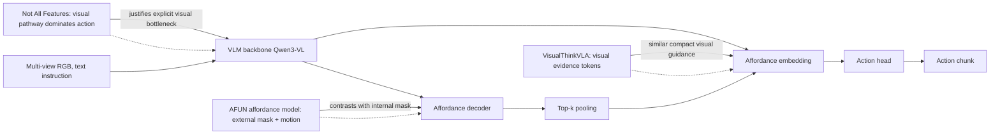

---
tags:
- paper
- domain/embodied_ai
- domain/multimodal_perception
- domain/reinforcement_learning
- domain/robot_manipulation
- domain/vla
- impact/solid
- method/benchmark
- method/foundation_model
- method/planning
- method/reinforcement_learning
- method/simulation
- review/auto_tagged
- status/unread
- task/manipulation
- task/planning_reasoning
- task/scene_understanding
- type/benchmark
- type/method
aliases:
- 'Afford-VLA: Action-Aligned Visual Planning via Internalized Affordance'
- Afford-VLA
- Internalized Affordance
- Action-Aligned Visual Planning
- Task-conditioned affordance tokens
- Affordance decoding masks
- Generalist robot manipulation
- Visual planning for manipulation
- Learnable affordance tokens
- VLA affordance conditioning
paper_id: arxiv:2605.24203
arxiv_id: '2605.24203'
url: http://arxiv.org/abs/2605.24203v1
pdf_url: https://arxiv.org/pdf/2605.24203v1
local_pdf: '[[AffordVLA ActionAligned Visual Planning via Internalized Affordance.pdf]]'
github: None
project_page: None
institutions:
- Fudan University
- KAUST
- SJTU
- East China Normal University
publication_date: '2026-05-22'
metadata_publication_date: '2026-05-22'
score: '7.5'
domains:
- embodied_ai
- multimodal_perception
- reinforcement_learning
- robot_manipulation
- vla
methods:
- benchmark
- planning
- reinforcement_learning
- simulation
tasks:
- manipulation
- planning_reasoning
- scene_understanding
paper_type: benchmark
impact_band: solid
reading_status: unread
priority_score: 83
review_status: auto_tagged
next_action: inspect_protocol
year: 2026
---

# Afford-VLA: Action-Aligned Visual Planning via Internalized Affordance

## 📌 Abstract
Vision-language-action (VLA) models have shown strong potential for generalist robot manipulation, yet they remain limited by insufficient spatial reasoning, particularly in determining where to interact in complex visual scenes. While recent efforts introduce various forms of visual planning to address this issue, existing approaches either rely on global geometric cues, symbolic intermediate representations, or externally generated visual signals, which are often weakly coupled with downstream action prediction. In this work, we revisit visual planning in VLA systems and argue that effective planning should be local, visually grounded, internally generated, and directly aligned with action. Based on this insight, we propose Afford-VLA, a unified framework that internalizes task-conditioned affordance as an explicit visual planning interface within VLA models. Concretely, we introduce learnable  tokens to query task-relevant interaction regions, decode affordance masks from multimodal features, and convert them into compact embeddings that directly condition action generation. This design enables affordance to be both generated and utilized within the VLA, forming a tightly coupled perception-action pathway. To further support this integration, we adopt a training strategy that allows the affordance pathway to be jointly optimized with action prediction, improving its effectiveness for downstream control. We evaluate our method on multiple simulation benchmarks, including LIBERO, LIBERO-Plus, and SimplerEnv, achieving consistent state-of-the-art performance, along with strong real-world results. These findings demonstrate that internalizing affordance as action-aligned visual planning provides a powerful paradigm for improving VLA systems.

## 🖼️ Architecture
![[AffordVLA ActionAligned Visual Planning via Internalized Affordance_arch.png]]

## 🧠 AI Analysis
## Abstract
Vision-language-action (VLA) models have shown strong potential for generalist robot manipulation, yet they remain limited by insufficient spatial reasoning, particularly in determining **where** to interact in complex visual scenes. While recent efforts introduce various forms of visual planning, existing approaches either rely on global geometric cues, symbolic intermediate representations, or externally generated visual signals, which are often weakly coupled with downstream action prediction. This work revisits visual planning in VLA systems and argues that effective planning should be local, visually grounded, internally generated, and directly aligned with action. Based on this insight, the authors propose Afford-VLA, a unified framework that internalizes task-conditioned affordance as an explicit visual planning interface within VLA models. Concretely, they introduce learnable `<AFF>` tokens to query task-relevant interaction regions, decode affordance masks from multimodal features, and convert them into compact embeddings that directly condition action generation. This design enables affordance to be both generated and utilized within the VLA, forming a tightly coupled perception–action pathway. To further support this integration, a training strategy allows the affordance pathway to be jointly optimized with action prediction. Evaluated on multiple simulation benchmarks (LIBERO, LIBERO-Plus, SimplerEnv), the method achieves consistent state-of-the-art performance, along with strong real-world results. [arXiv](https://arxiv.org/abs/2605.24203).

In simpler terms: Afford-VLA adds an internal “where to touch” map to a VLA model. Instead of relying on external modules or loose hints, the model learns a task-specific mask from the same vision‑language backbone and immediately feeds a compact version of that mask into the motion head, so that the selected interaction region directly influences the action.

## 1. Core Snapshot

### Problem Statement
Current vision-language-action models receive an image and a language instruction but still struggle to decide *exactly which pixels* matter for the next action. The model sees multi-view RGB images and outputs a sequence of robot joint or end‑effector commands. The bottleneck is not a lack of global scene understanding; it is the absence of a **local, task‑conditioned signal** that explicitly tells the action decoder where the useful interaction region lies.

Existing visual planning methods address spatial reasoning in three broad ways, each incomplete for tight action coupling:
- **Geometry‑based** methods ([3D cues, point clouds](https://en.wikipedia.org/wiki/Point_cloud)) provide global, scene‑level context but not task‑conditioned interaction regions.
- **Symbolic‑based** methods translate visual observations into textual descriptions or structured tokens, offering only indirect guidance to the action module.
- **Visually grounded** methods produce masks or heatmaps, but often from external perception models or as an auxiliary objective that does not feed directly into action prediction.

The paper therefore formulates four properties that effective visual planning must satisfy: **locality**, **visual grounding**, **internal generation**, and **action alignment**. This redefinition of the problem motivates a representation that is both pixel‑precise and natively integrated into the action‑learning pipeline.

> [!note] Reading implication
> The four‑property framework appears early and recurs throughout the paper; internalising it helps to understand every subsequent design decision.

### Core Contribution
The central claim is that **task‑conditioned affordance can be generated inside the VLA model itself and turned into a compact embedding that directly conditions the action expert**. The authors introduce:
- a small set of learnable `<AFF>` tokens,
- a lightweight decoder that produces patch‑level affordance masks,
- a straight‑through top‑k pooling step that selects the most salient patches and injects the pooled evidence into the action head.

Evidence for this claim comes from state‑of‑the‑art results on LIBERO (97.4 %), SimplerEnv (58.1 %), and zero‑shot LIBERO‑Plus (78.1 %), together with an ablation showing that both internal generation *and* action‑aligned training are necessary for the largest gains. The method therefore unifies perception and action inside a single model, avoiding the weak coupling of previous approaches.

### Innovation Origin & Rationale
The design originates from the observation that prior visual‑planning methods either stay too global, rely on external perception modules, or supervise affordance as an isolated target. The authors reason that an internal mask should be shaped by both dense ground‑truth supervision *and* the downstream action loss, because a mask that is accurate in segmentation terms might still select patches that are useless for control.

This reasoning is operationalised through the four properties and enforced by a straight‑through gradient estimator that lets action‑loss gradients reach the affordance head. The contrast with existing paradigms is made explicit in the paper’s introduction figure, where alternative methods are shown to fail one or more of the four properties.

> [!warning] Assumption alert
> The approach assumes that a binary patch‑level mask can capture the interaction region stably enough for top‑k pooling. When the relevant region changes rapidly across frames, this assumption could weaken performance.

## 2. Reading Map
The paper targets readers already familiar with transformer‑based policies and visual‑language models. The introduction and related‑work sections can be read quickly to extract the four desired properties of visual planning.

The methodology sections (internal affordance mask generation, action‑aligned training, two‑stage schedule) deserve close attention because they contain the `<AFF>` token design, the mask‑pooling step, and the straight‑through estimator.

After the method, study the ablation table (Table 3 in the paper) to see how much each property contributes. The LIBERO‑Plus results (zero‑shot robustness under visual perturbations) are also instructive, as they showcase the benefit of localised affordance.

The introduction figure comparing four visual‑planning paradigms can be skimmed once you have understood the four properties. Real‑world results and figures can be left for a later pass unless you plan immediate hardware deployment.

## 3. Method Walkthrough

### Inputs, Outputs, And Assumptions
**Inputs**: a set of RGB images \(I_t\) from multiple cameras, a language instruction \(x\), and optional robot proprioception \(s_t\).

**Outputs**: a future action chunk \(\hat{a}_{t:t+H}\) (7‑DoF commands over \(H\) steps) plus an internal affordance mask \(M_t\) (patch‑level, one per camera view).

**Main assumption**: task‑relevant interaction regions can be expressed as binary patch‑level masks that are stable enough to be pooled into a single embedding vector. This assumption is critical because the straight‑through estimator and top‑k selection rely on the predicted mask approximately overlapping the true interaction area; if the area changes drastically from frame to frame, the pooled representation may become noisy.

A second, implicit assumption is that the vision‑language backbone’s patch features already contain enough spatial detail to decode affordance without further high‑resolution processing.

### Pipeline From Data To Prediction
1. **Tokenisation**: multi‑view images are divided into patches and converted into patch tokens \(Q_{\text{img}}\); the language instruction becomes text tokens \(Q_{\text{text}}\). A handful of learnable `<AFF>` query tokens \(Q_{\text{aff}}\) (typically four per view) are appended to the sequence.
2. **VLM processing**: the entire sequence is passed through the vision‑language model (Qwen3‑VL‑4B‑Instruct). The output contains contextualised states \(H_t\) for image and language tokens, and separate states \(A_t\) for the `<AFF>` positions. This is the point where the `<AFF>` tokens aggregate both visual and linguistic information through the transformer’s self‑attention.
3. **Affordance decoding**: the <AFF> states \(A_t\) together with the raw visual patch features \(P_t\) (taken before the VLM’s projector) are fed to a lightweight affordance decoder. The decoder produces per‑patch logits \(G_t\) (one logit per patch, per view).
4. **Mask pooling**: the top‑k patches (k = 16) according to \(G_t\) are selected. Their features are averaged and projected to form a compact affordance embedding \(r_t\). During the forward pass this is a hard selection; during the backward pass a straight‑through estimator allows action‑loss gradients to flow back through the logits.
5. **Action prediction**: the affordance embedding \(r_t\) is concatenated with the original VLM hidden states \(H_t\), and together with the proprioception \(s_t\) is fed to the flow‑matching action expert, which outputs the predicted action chunk \(\hat{a}_{t:t+H}\).

This pipeline ensures that the same VLM backbone produces both the visual context and the internal planning signal, and that the planning signal directly conditions the action head.

### Key Design Choices
- **Lightweight affordance head**: a two‑layer decoder with eight attention heads. Keeping it small avoids overwhelming the VLM and allows joint training without excessive compute.
- **Straight‑through top‑k pooling**: a soft attention or differentiable top‑k could have been used, but the authors argue that a hard selection matches the inference‑time behaviour and forces the mask to be informative. Removing the action gradient path (i.e., using the mask only as an auxiliary loss) is exactly the ablation that shows smaller gains.
  > [!warning] Key mechanism
  > Without the straight‑through link, the affordance mask could perfectly match the ground‑truth label yet still select patches that are irrelevant for the robot’s motion; the action loss provides the corrective signal that makes the mask *useful* for control.
- **Per‑view independent tokens**: each camera view receives its own `<AFF>` queries and decoder, and the resulting embeddings are simply concatenated. This design respects the different viewpoints and avoids forcing a fused, single‑view representation.

## 4. Core Theory And Formulas

### Main Objective
The goal is to train a policy that predicts future actions while simultaneously learning an internal affordance mask that both matches dense ground‑truth labels and improves action accuracy. The training therefore minimises a joint loss consisting of:
- a binary cross‑entropy term \(L_{\text{aff}}\) that supervises the affordance mask against a provided ground‑truth mask,
- a flow‑matching action loss \(L_{\text{act}}\) that measures how well the predicted action chunk matches the expert trajectory.

Crucially, gradients from \(L_{\text{act}}\) are allowed to propagate back through the mask‑pooling step, enabling the affordance head to be optimised *not only for segmentation accuracy but also for its downstream utility*.

### Important Equations
The augmented input sequence containing affordance queries is processed by the VLM:

$$
[H_t, A_t] = f_{\text{VLM}}([Q_{\text{img}}, Q_{\text{text}}, Q_{\text{aff}}])
$$

- \(Q_{\text{img}},\; Q_{\text{text}},\; Q_{\text{aff}}\) are the patch, text, and learnable `<AFF>` token embeddings, respectively.
- \(H_t\) is the contextualised representation of the image and text tokens (used later by the action head).
- \(A_t\) is the contextualised representation at the `<AFF>` token positions, now conditioned on both vision and language.

The affordance head then produces patch‑level logits:

$$
G_t = D_{\text{aff}}(A_t, P_t)
$$

where \(P_t\) are the raw visual patch features taken before the VLM’s projector, preserving low‑level spatial detail. \(G_t\) is a set of real numbers, one per patch; higher values indicate higher affordance.

The action head receives both the original hidden states and the pooled affordance embedding \(r_t\). The embedding is formed by selecting the top‑\(k\) patches from \(G_t\), averaging their features, and applying a linear projection. The action prediction is:

$$
\hat{a}_{t:t+H} = f_{\text{act}}([H_t; r_t], s_t)
$$

- \([H_t; r_t]\) denotes concatenation along the feature dimension.
- \(s_t\) is the robot proprioception (e.g., joint angles, gripper state).
- \(\hat{a}_{t:t+H}\) is the predicted action chunk.

The two loss terms are:

$$
L_{\text{aff}} = \text{BCEWithLogits}(G_t, Y_t)
$$

$$
L_{\text{act}} = \ell_{\text{FM}}\bigl(f_{\text{act}}(Z_t, s_t),\; a_{t:t+H}\bigr)
$$

where \(Y_t\) is the ground‑truth affordance mask, and \(\ell_{\text{FM}}\) is the [flow‑matching](https://arxiv.org/abs/2210.02747) loss used by the action expert. The total training objective is:

$$
L_{\text{joint}} = L_{\text{act}} + L_{\text{aff}}
$$

The straight‑through gradient estimator is applied to the top‑k selection: in the forward pass it behaves as a hard masking operation; in the backward pass the gradient of \(L_{\text{act}}\) with respect to the pooled features is passed straight through to the logits \(G_t\), as if the top‑k selection were an identity function. This allows the action loss to directly update the affordance head without requiring a differentiable sorting operation.

### Algorithmic Intuition
During the first training stage, only the affordance decoder is updated using the binary cross‑entropy loss against the ground‑truth mask. This provides a warm‑start for the mask decoder before the full system is trained jointly.

In the second stage, the model predicts its own \(G_t\), selects the top‑16 patches, forms \(r_t\), and trains the action expert on the resulting conditioning vector; the affordance loss continues to provide dense supervision. The straight‑through estimator ensures that the affordance representation is optimised for *both* mask accuracy and action quality.

At test time, the same hard top‑k selection is applied but without the straight‑through approximation, so the mask that the action head sees is exactly what was selected.

## 5. Architecture, Figures, And Implementation
The vision‑language backbone is [Qwen3‑VL‑4B‑Instruct](https://huggingface.co/Qwen/Qwen3-VL-4B-Instruct); patch features are taken before the projector to preserve spatial resolution. The action expert follows the [GR00T](https://developer.nvidia.com/gr00t) flow‑matching design with a DiT‑B backbone that predicts 8‑step 7‑DoF chunks using 4 sampling steps. Each camera view uses four `<AFF>` queries and an independent affordance head; the resulting embeddings are concatenated and fed to the action head.

Figure 2 of the paper illustrates the data flow: multi‑view images and text enter the VLM, `<AFF>` tokens query the features, the affordance head produces masks, mask pooling produces embeddings, and the action head reads the augmented sequence. The provided real‑world frames show a successful fork‑in‑bowl sequence on an ARX X5 arm with wrist and external RealSense cameras.

## 6. Experiments And Evidence
The method is evaluated on the [LIBERO benchmark](https://libero-project.github.io/libero/) (four suites), [SimplerEnv](https://simpler-env.github.io/) (four tasks), and zero‑shot [LIBERO‑Plus](https://libero-project.github.io/libero/) (seven perturbation types). Baselines include OpenVLA, π0 variants, GR00T, SpatialVLA, and CoA‑VLA.

Afford‑VLA reaches **97.4 %** average success on LIBERO, **58.1 %** on SimplerEnv, and **78.1 %** on LIBERO‑Plus. The ablation study (Table 3) compares four integration strategies and shows that only the combination of internal generation plus action‑aligned training reaches the full 97.4 %. Real‑world evaluation on two tabletop tasks (Cup‑to‑Plate and Fork‑in‑Bowl) reports 80 % and 70 % success over 20 trials each, outperforming the same OpenVLA‑OFT and π0 checkpoints.

> [!warning] Missing ablation
> The paper does not report an ablation that freezes the affordance head after stage one and only fine‑tunes the action expert. Such an experiment would clarify how much of the performance gain stems from the continued joint optimisation versus the initial warm‑start.

## 7. Strengths, Limitations, And Failure Cases
**Strengths**
- The explicit gradient path from action loss to the affordance head is the design element that, according to the ablation, yields the largest improvement; it makes the mask directly useful for control.
- The same pipeline works across simulation suites and real‑robot deployments without external perception modules, demonstrating practical transferability.
- The modular design (independent affordance heads per view, lightweight decoder) adds only modest computational overhead.

**Limitations**
- Performance is weaker on tasks requiring long‑horizon coordination rather than precise localisation, such as block stacking on SimplerEnv. This suggests the top‑k pooling may not capture sequential “contact switching” well.
- The construction of ground‑truth affordance masks is described only at a high level in the appendix; the exact annotation procedure and its consistency are not fully transparent, making the reproducibility of the dense supervision signal uncertain from the main text.
- Scalability to more than two camera views or to higher‑resolution images is not tested, so it is unclear whether the `<AFF>` token count or the decoder complexity would need to grow.

**Failure cases**: the paper shows that when the interaction region cannot be localised to a small set of patches (e.g., tasks that require manipulating two widely separated objects simultaneously), the affordance pooling may lose critical information.

## 8. Reproduction Notes
The model uses Qwen3‑VL‑4B‑Instruct, a two‑stage schedule (first warm‑up affordance head only, then joint training with straight‑through top‑16 pooling), and a flow‑matching action loss. Evaluation uses success rate on the standard LIBERO, SimplerEnv, and LIBERO‑Plus splits; real‑world tests use 20 random‑initialisation trials per task.

Several exact hyperparameters (learning rates, batch size, number of epochs) are not stated in the main text. The joint affordance–action dataset and the mask‑generation procedure are deferred to the appendix. Code and models are promised but not yet linked; monitor the [project page](https://afford-vla.github.io) for releases.

## 9. What To Read Closely
First, focus on the methodology subsections **internal affordance mask generation** and **action‑aligned training**. They contain the core technical contributions: the `<AFF>` token design, the mask pooling with straight‑through estimator, and the two‑stage schedule. Understanding how these pieces fit together is essential.

Immediately after that, study the ablation table (Table 3) to see the quantitative contribution of each component. The LIBERO‑Plus results (Table 2) are worth careful inspection because they test robustness under visual perturbations that should favour a model with explicit, localised affordance.

The introduction figure comparing four visual‑planning paradigms can be skimmed once the four properties are clear, as it encodes the paper’s motivation visually.

## 10. Research Ideas And Open Questions

**Temporal reuse of `<AFF>` tokens.** Test whether the same affordance tokens can be carried over across consecutive time steps instead of being recomputed from scratch each frame. Freeze the VLM backbone, keep the affordance head, and add a small recurrent connection that propagates the previous affordance embedding. Key metrics would be success rate and inference latency on LIBERO long‑horizon tasks. The risk is that temporal consistency could hurt performance if the interaction region changes rapidly.

**Learned soft selection.** Replace the hard top‑k selection with a learned gating network on top of \(G_t\) that produces a sparse embedding while allowing gradients to flow naturally. Compare it against the current straight‑through approach on SimplerEnv tasks where affordance alone is insufficient (e.g., block stacking). The main risk is increased parameter count and possible training instability, but a softer mask might improve long‑horizon coordination.

**Cross‑embodiment affordance transfer.** Investigate whether the affordance pathway can be trained on a mixture of simulation and real‑robot data while the action head remains embodiment‑specific. A small experiment would fine‑tune only the affordance head and pooling weights on a few hundred real demonstrations and measure zero‑shot success on a held‑out real task. Success would be indicated by higher real‑world success rates than the current two‑stage real‑robot baseline; failure would occur if simulation‑trained masks become misaligned with new camera intrinsics or gripper geometry.

> [!idea] Refinement
> A simpler variant of the cross‑embodiment idea would be to freeze the affordance decoder and only adapt the projection that maps pooled features to the action embedding, keeping the mask prediction unchanged. This could preserve the general‑purpose visual grounding while still accommodating new action spaces.

## Knowledge Graph & Connections

### Related Work Connections

**AFUN Affordance Foundation Model**  
Both Afford-VLA and AFUN produce task‑conditioned visual masks (where to interact), but they differ in purpose and integration. AFUN works as a standalone perceptual module that outputs a functional mask *and* a 3D post‑contact motion curve, treating the mask as an interpretable output for external motion planners. Afford‑VLA, in contrast, embeds the mask inside the action pipeline: the predicted affordance is immediately pooled into an embedding that directly conditions the flow‑matching action head, with gradients from the action loss flowing back through the mask. This difference implies that Afford‑VLA’s masks are shaped not only by segmentation accuracy but also by their downstream utility for control, while AFUN’s masks may be accurate in a perceptual sense yet remain decoupled from the specific action space. The comparison suggests a design choice: external affordance models prioritize transferability and interpretability, whereas internal, action‑aligned affordance may yield tighter task performance at the cost of embodiment‑specific fine‑tuning.

**Not All Features Are Created Equal**  
Not All Features reveals that the visual pathway dominates action generation in VLA models, often ignoring language unless multiple goals share a scene. Afford‑VLA aligns with this finding by explicitly conditioning the action head on a spatio‑visual affordance embedding derived from the same visual features. The difference is that Afford‑VLA actively shapes this pathway rather than only analyzing it: the affordance tokens and top‑k pooling impose a *task‑conditioned spatial bottleneck* that forces the model to use specific visual regions. This implies that future VLA designs could use such bottlenecks to systematically control the visual‑action coupling that the mechanistic study observed, potentially making models more robust to spurious visual cues and more sensitive to language when needed.

**VisualThinkVLA**  
Both Afford‑VLA and VisualThinkVLA propose compact visual‑evidence interfaces that guide action prediction without adding text‑decoding latency. VisualThinkVLA learns visual evidence tokens through a routing mechanism and reconstructs visual signals, whereas Afford‑VLA uses an internally generated affordance mask pooled into a single embedding. The key difference is the source of supervision: VisualThinkVLA uses a visual‑thinking supervision kit (reconstructed evidence), while Afford‑VLA relies on dense ground‑truth affordance masks. This distinction matters because dense mask annotations may be expensive or ambiguous, but they provide explicit spatial grounding; the VisualThinkVLA route could be more scalable, while Afford‑VLA’s explicit masks may yield better localization guarantees. Comparing them on benchmarks without mask annotations would reveal whether a self‑supervised visual thinking interface can match an affordance‑supervised one.

### Concept Map

### Questions For Future Reading

1. **When does dense spatial supervision become a bottleneck, and can self‑supervised replacement signals produce equally useful grounding?** The paper relies on ground‑truth affordance masks that are expensive to annotate. Future work might explore whether contrastive objectives, click‑based supervision, or video prediction losses can train the affordance decoder while preserving the action‑aligned gradient path. The evidence that would answer this is an ablation that replaces the binary cross‑entropy term with an unsupervised objective and measures success rates and localization accuracy.

2. **How do internal visual planning modules interact with language when the task requires reasoning beyond a local interaction region?** Afford‑VLA assumes a single, localizable region each step, but many tasks involve sequential contact points or global spatial relationships. Future papers should compare performance on tasks where language disambiguates which of multiple candidate regions to attend to, or where the “where to act” decision requires composing multiple affordance cues. Evidence would come from benchmarks like LIBERO‑Goal with scenes containing multiple identical objects, evaluated with probes that measure whether the model attends to the right object when language alone disambiguates.

3. **What is the minimal architectural change needed to bring the training‑time gradient alignment (straight‑through) into deployment without sacrificing runtime efficiency?** The current design trains with a straight‑through estimator but uses hard selection at test time. Future work could investigate learnable, sparse gating mechanisms that remain differentiable and maintain the same inference‑time selection, potentially closing the train‑test gap. Evidence would include latency‑matched comparisons between straight‑through training and a fully differentiable sparse selection, looking at both success rates and the stability of the selected patches across frames.

---
*Analysis by PaperBrain (x-ai/grok-4.3; refinement: deepseek/deepseek-v4-pro)*

## 📂 Resources
- **Local PDF**: [[AffordVLA ActionAligned Visual Planning via Internalized Affordance.pdf]]
- [Online PDF](https://arxiv.org/pdf/2605.24203v1)
- [ArXiv Link](http://arxiv.org/abs/2605.24203v1)
