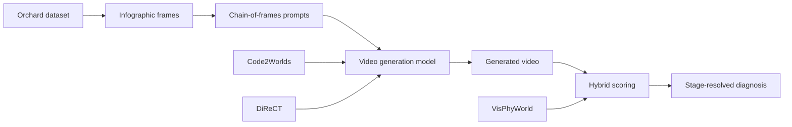

---
tags:
- paper
- domain/embodied_ai
- domain/multimodal_perception
- domain/reinforcement_learning
- domain/robot_manipulation
- domain/sim2real
- domain/world_model
- impact/high_value
- method/benchmark
- method/foundation_model
- method/planning
- method/reinforcement_learning
- method/simulation
- review/auto_tagged
- status/unread
- task/manipulation
- task/planning_reasoning
- task/scene_understanding
- task/video_prediction
- type/benchmark
- type/dataset
aliases:
- 'Apple-π: Benchmarking Thinking with Video Towards Law-Grounded Physical Intelligence'
- Apple-π
- Law-Grounded Video Benchmark
- Three-Stage Reasoning Protocol
- Perception Formulation Deduction
- Hybrid Physics-Law Metrics
- MLLM Metrics
- Physical Intelligence Benchmark
- Video World Model Evaluation
- Law-Grounded Physical Intelligence
- Benchmarking Thinking with Video
authors:
- Runmao Yao
- Kairui Hu
- Yukang Cao
- Ruisi Wang
- Shulin Tian
- Ziang Cao
- Weichen Fan
- Ziqi Huang
- Yuhao Dong
- Hao Li
- Zhaoxi Chen
- Zhongang Cai
- Lei Yang
- Ziwei Liu
paper_id: arxiv:2607.16401
arxiv_id: '2607.16401'
url: https://huggingface.co/papers/2607.16401
pdf_url: https://arxiv.org/pdf/2607.16401.pdf
local_pdf: '[[Appleπ Benchmarking Thinking with Video Towards LawGrounded Physical
  Intelligence.pdf]]'
github: None
project_page: https://21yrm.github.io/Apple-PI-homepage/
institutions:
- S-Lab, Nanyang Technological University
- The Chinese University of Hong Kong
publication_date: '2026-07-21'
metadata_publication_date: '2026-07-17'
score: '8.1'
domains:
- embodied_ai
- multimodal_perception
- reinforcement_learning
- robot_manipulation
- sim2real
- world_model
methods:
- benchmark
- foundation_model
- planning
- reinforcement_learning
- simulation
tasks:
- manipulation
- planning_reasoning
- scene_understanding
- video_prediction
paper_type: benchmark
impact_band: high_value
reading_status: unread
priority_score: 104
review_status: auto_tagged
next_action: inspect_protocol
year: 2026
---

# Apple-π: Benchmarking Thinking with Video Towards Law-Grounded Physical Intelligence

## 📌 Abstract
Modern video generation models are increasingly hailed as emerging world models with an internalized grasp of physical law. Yet existing benchmarks largely evaluate physical plausibility only at the output level, without verifying whether the model arrives there through a faithful, law-grounded reasoning process. We introduce Apple-PI, the first benchmark that anchors video-model evaluation explicitly in physical laws. Apple-PI comprises three components. 1) Orchard: a dataset of 400 videos covering ten canonical tasks in classical mechanics. It separates single-law tasks for confounder-free diagnosis from multi-law tasks for probing generalization. 2) Benchmark Protocol: a three-stage protocol based on scientific reasoning, including Perception, Formulation, and Deduction. It uses chain-of-frames prompting on infographic-annotated first frames, treating the generated video as the model's visible reasoning trace. 3) Evaluation Suite: a hybrid evaluation suite that combines MLLM-based subjective scoring with physics-law-grounded objective measures. This enables stage-resolved diagnosis of not only whether a model fails, but where it fails. Benchmarking 11 models shows that current video models remain far from reliable law-grounded world simulators, with the best video model scoring only 0.473. Our stage-, pillar-, and source-resolved analyses further expose a Perception-to-Formulation-to-Deduction bottleneck, weak multi-law state transfer, and a persistent Sim-to-Real gap. These findings position Apple-PI as a diagnostic foundation for guiding future video models toward world models with law-grounded physical intelligence.

## 🖼️ Architecture

## 🧠 AI Analysis
## Abstract
Modern video generation models are increasingly hailed as emerging world models with an internalized grasp of physical law. Yet existing benchmarks largely evaluate physical plausibility only at the output level, without verifying whether the model arrives there through a faithful, law-grounded reasoning process. We introduce Apple-π, the first benchmark that anchors video-model evaluation explicitly in physical laws. Apple-π comprises three components. 1) Orchard: a dataset of 400 videos covering ten canonical tasks in classical mechanics. It separates single-law tasks for confounder-free diagnosis from multi-law tasks for probing generalization. 2) Benchmark Protocol: a three-stage protocol based on scientific reasoning, including Perception, Formulation, and Deduction. It uses chain-of-frames prompting on infographic-annotated first frames, treating the generated video as the model’s visible reasoning trace. 3) Evaluation Suite: a hybrid evaluation suite that combines MLLM-based subjective scoring with physics-law-grounded objective measures. This enables stage-resolved diagnosis of not only whether a model fails, but where it fails. Benchmarking 11 models shows that current video models remain far from reliable law-grounded world simulators, with the best video model scoring only 0.473. Our stage-, pillar-, and source-resolved analyses further expose a Perception-to-Formulation-to-Deduction bottleneck, weak multi-law state transfer, and a persistent Sim-to-Real gap. These findings position Apple-π as a diagnostic foundation for guiding future video models toward world models with law-grounded physical intelligence.  
[Paper link](https://arxiv.org/abs/2607.16401) | [Project page](https://21yrm.github.io/Apple-PI-homepage/)

## 1. Core Snapshot

### Problem Statement
Most physical-intelligence benchmarks for video generation only inspect the final output: does the video “look right”? This approach cannot distinguish between a model that truly applied a physical law and one that merely reproduced a visually plausible pattern from its training data. The input to the model is typically a text prompt or a first frame, the output is a generated future sequence, and the target behaviour is motion that obeys classical mechanics.  
==The critical bottleneck is that there is no mechanism to trace or verify the intermediate reasoning steps.== Without tracing, we cannot tell whether a model misperceived a quantity, selected the wrong governing law, or failed to carry the law’s prediction forward in time. Consequently, success may be due to memorised visual regularities rather than to genuine law-grounded deduction.

### Core Contribution
Apple-π is the first benchmark to anchor video-model evaluation explicitly in physical laws. It decomposes the task into five subtracks that span three scientific reasoning stages—Perception, Formulation, and Deduction. The benchmark is built on a 400‑video dataset, Orchard, that separates single‑law cases (clean diagnosis) from multi‑law compositional cases (generalisation test).  
Infographic‑annotated first frames are paired with chain‑of‑frames prompts so that the generated video itself becomes an auditable reasoning trace. A hybrid evaluation suite combines an MLLM judge’s subjective scores with physics‑law‑grounded objective measures (e.g., spatial IoU, velocity accuracy). The stage‑wise performance drop observed across all tested models, together with this metric design that separates format compliance from physics consistency, provides the evidence for the benchmark’s diagnostic power.  
> [!note] Apple-π is the first benchmark to decompose video physics evaluation into Perception → Formulation → Deduction stages, enabling fine‑grained failure analysis.

### Innovation Origin & Rationale
The design is motivated by the classic contrast between Aristotle‑style intuitive description and Newton‑style law‑grounded deduction, which the paper prominently illustrates in its Figure 1. Aristotle could describe a falling apple, but Newton formulated a universal law from which the entire motion could be deduced. Previous benchmarks could not tell whether a video model was “thinking like Aristotle” (pattern matching) or “thinking like Newton” (law application).  
The use of infographic overlays—rather than plain text parameters—directly addresses the reference‑resolution problem. When physical quantities are supplied only in text, the model must also solve which quantity belongs to which spatial object, a confounding factor unrelated to physical reasoning itself. Overlaying the numbers and symbols on the visual scene removes this confound, allowing the benchmark to isolate failures in perception, law selection, or dynamics. This rationale is inferred from the paper’s method and ablation sections; no specific prior work is quoted on exactly this failure mode.

## 2. Reading Map
The paper sits at the intersection of video world models and physical reasoning benchmarks. Researchers working on video generation, multimodal reasoning, or embodied AI should read it carefully.  
For a first pass, the abstract and Section 4 (Experiments) give the main quantitative picture. Skim Section 2 (Related Work) only after you understand the benchmark itself.  
Pay close attention to Section 3.2 (Benchmark Protocol) and Section 3.3 (Evaluation Suite) because they define the five subtracks and the hybrid scoring system that drive every result. Section 4.3 (Stage‑Resolved Diagnosis) and the accompanying Figure 4 supply the diagnostic evidence that justifies the benchmark’s value. The qualitative failure cases in Section 4.5 are useful for spotting common model weaknesses.  
The protocol ablations in Section 4.6 and Table 3 can be read quickly once the protocol is clear; the conclusion (Section 5) can be read last for the authors’ own summary of implications.

## 3. Method Walkthrough

### Inputs, Outputs, And Assumptions
The method receives an infographic‑style annotated first frame together with a chain‑of‑frames text prompt that specifies which reasoning track (Perception – Text, Perception – Graphic, etc.) the model should follow. The model produces a short video sequence that visualises its answer.  
The key assumptions are:
- The infographic overlays bind each physical quantity (mass, initial velocity, etc.) to the correct visual referent, so the model does not need to solve reference resolution.
- The generated video can serve as a faithful, visible trace of the intermediate reasoning steps, i.e., the frames correspond to the model’s internal reasoning about perception, law selection, or deduction.
These assumptions allow the benchmark to isolate failures in perception, law selection, or dynamics, rather than confounding them with text‑to‑scene binding problems. If a model fails on an infographic prompt but passes a pure‑text variant, the failure is almost certainly due to physical reasoning rather than to low‑level visual parsing.

### Pipeline From Data To Prediction
The pipeline begins with the Orchard dataset, which supplies the annotated first frame and the ground‑truth physics trajectory (simulated or measured). The chain‑of‑frames prompt then instructs the model to evolve that frame toward the required answer format, which differs per subtrack:
- **Perception‑Text**: reproduce the numeric annotations on a final‑frame artifact.
- **Perception‑Graphic**: segment the relevant objects.
- **Formulation‑Text**: select a multiple‑choice law and render the chosen formula with substituted values.
- **Formulation‑Graphic**: predict object positions and velocities at a target time.
- **Deduction**: generate the full future sequence obeying the law.
The resulting video is scored by a combination of MLLM rubrics (subjective) and physics‑derived objective measures (spatial IoU, masked PSNR, velocity accuracy, etc.). This two‑pronged scoring lets researchers know whether a model follows the output format and whether the drawn dynamics are physically correct.

### Key Design Choices
The decision to use infographic overlays, rather than supplying parameters only in structured text, is critical. Pure‑text parameters would force the model to solve reference resolution, a confounding variable unrelated to physical reasoning. A simpler alternative would have been structured text; the authors ablate this choice in Section 4.6 and find that it produces only small average changes, confirming that the infographic format is not a performance shortcut but a necessary tool for clean diagnosis.  
Splitting each of Perception and Formulation into text and graphic subtracks exposes different failure modes: reading a number vs. grounding it to a spatial region, and selecting a symbolic equation vs. instantiating that equation at a specific future time. Without these splits, the benchmark would lose the ability to tell whether a model’s error originates from symbolic abstraction or from spatio‑temporal instantiation.  
> [!info] The infographic design is a deliberate choice to remove the reference‑resolution burden, not an attempt to make the task easier.

## 4. Core Theory And Formulas
The benchmark itself does not train a model; it evaluates generated videos against the exact predictions of classical mechanics. The objective metrics derive from the governing equations of each task.

**Free Fall**  
For an object starting from rest with initial height $h_0$, the vertical displacement after time $t$ is
$$
h(t) = h_0 - \frac{1}{2} g \, t^2,
$$
where $g = 9.8\ \mathrm{m/s^2}$ is the standard gravitational acceleration. The term $-\frac{1}{2} g t^2$ represents the distance fallen; subtracting it from $h_0$ gives the current height. In the Deduction track this equation yields the ground‑truth positions that are compared with the model’s output via spatial IoU and velocity accuracy. If the model’s video shows a falling object that does not follow this $t^2$ dependence, the score drops sharply.  
For more on the kinematics, see the [free fall Wikipedia entry](https://en.wikipedia.org/wiki/Free_fall).

**Projectile Motion**  
For an initial position $\vec{r}_0$ and initial velocity $\vec{v}_0$ under constant gravitational acceleration $\vec{g} = (0, -g, 0)$ (assuming a vertical $y$‑axis), the trajectory is
$$
\vec{r}(t) = \vec{r}_0 + \vec{v}_0 t + \frac{1}{2} \vec{g} \, t^2.
$$
This vector equation encodes the parabolic path: the $\vec{v}_0 t$ term gives the linear drift from the initial velocity, and the $\frac{1}{2} \vec{g} t^2$ term adds the downward arc. Multi‑law composition cases require the model to carry the final state of one law (e.g., the velocity at the end of a projectile segment) as the initial condition of the next (e.g., a collision). The benchmark checks whether the generated frames follow this exact path and whether the state at the boundary matches the law’s prediction.  
A solid introduction is provided by [Projectile motion on Wikipedia](https://en.wikipedia.org/wiki/Projectile_motion).

**Collisions**  
The coefficient of restitution $e$ determines how relative velocities change across a collision. It is defined as
$$
e = \frac{v_2' - v_1'}{v_1 - v_2},
$$
where $v_1$ and $v_2$ are the pre‑collision velocities of two objects along the line of impact, and $v_1'$, $v_2'$ are the corresponding post‑collision velocities. For a perfectly elastic collision $e = 1$ (kinetic energy conserved), for a perfectly inelastic collision $e = 0$ (objects stick together), and for general inelastic collisions $0 < e < 1$. These values directly parameterise the objective velocity‑accuracy metric in the Deduction track: if the model’s video shows post‑collision speeds that do not satisfy this relation, the score falls.  
The concept is explained further at the [coefficient of restitution Wikipedia page](https://en.wikipedia.org/wiki/Coefficient_of_restitution).

**Multi‑Law State Transfer**  
In tasks that combine several laws (e.g., a free‑fall segment followed by an elastic collision), the physics equations provide the exact mapping from the final dynamical state of the first law to the initial state of the second. Measuring the accuracy of this transition lets Apple‑π isolate whether a model’s errors originate from applying a single law incorrectly or from failing to propagate state across the law boundary. This decomposition is a key diagnostic capability absent from prior benchmarks.

## 5. Architecture, Figures, And Implementation
Apple‑π is not a neural architecture—it is a prompting and scoring protocol that can be applied to any video generation or unified understanding‑generation model.  
Figure 1 gives the high‑level Aristotle‑vs‑Newton framing and lists the ten canonical tasks. Figure 2 shows the per‑task source breakdown (simulated, self‑recorded, internet) and the two‑level taxonomy of single‑law vs. multi‑law cases. Figure 3 illustrates the five subtracks with their distinct output formats (textual formulas vs. drawn overlays vs. full dynamic sequences). Figure 4 plots stage‑wise, pillar‑wise, and source‑wise performance trends, providing the backbone of the diagnostic analysis. Figure 5 visualises representative failure modes where annotation text is preserved but the physical meaning (e.g., velocity direction) is misbound.  
Implementation details for the MLLM judge rubric and the physics objective measures are stated to reside in Appendices D and E, which are not included in the provided excerpt. Not clear from the provided text are the exact weighting scheme that combines subjective and objective scores, or the precise prompt templates for each subtrack.

## 6. Experiments And Evidence
Eleven models are evaluated on all 400 cases across five subtracks and three independent rollouts. The results answer three central questions:
1. Does strong video synthesis imply law‑grounded reasoning?
2. Does performance degrade across the Perception → Formulation → Deduction funnel?
3. Do models generalise across single‑law pillars and from simulation to real footage?

The best video‑only generation model (Seedance 2.0) reaches a composite score of only 0.473. In contrast, unified understanding‑generation models GPT Image 2 and Nano Banana 2 reach 0.704 and 0.699, respectively, suggesting that explicit understanding can boost law‑grounded generation.  
The stage‑resolved drop—scores falling from Perception through Formulation to Deduction—appears consistently across all models, directly evidencing the bottleneck claim. The Sim‑to‑Real gap (higher scores on simulator data than on real‑world videos) persists, even for strong models, indicating that internalised visual patterns do not yet transfer to law‑consistent behaviour on natural footage.  
The ablation on text‑parameter input vs. infographic overlays (Section 4.6) shows only small performance deltas, weakening the hypothesis that the benchmark is solved simply by easier parsing.
> [!warning] Even the top generation‑only model scores only 0.473, far below what is required for reliable law‑grounded world simulation.

## 7. Strengths, Limitations, And Failure Cases
The main strength is the explicit decomposition into diagnosable stages, supported by complementary subjective and objective metrics. This lets researchers localise whether a model fails at reading quantities, selecting laws, or maintaining dynamics. The separation of single‑law and multi‑law cases further enables controlled diagnosis of state‑transfer failures.  
A clear limitation visible in the results is that even the strongest unified models reach only around 0.40 on the Deduction track, showing that law‑consistent temporal generation remains unsolved. The qualitative analysis reveals that models can preserve annotation text and object identity while still assigning incorrect physical directions to initial velocities—a failure mode that pixel‑level plausibility metrics would miss entirely.  
> [!question] Not clear from the provided text is whether the MLLM judge rubric was validated against human raters on a held‑out set, so the absolute MLLM scores may contain judge‑specific biases.

## 8. Reproduction Notes
The Orchard dataset contains 400 videos split across simulated (243), self‑recorded (121), and internet‑sourced (36) sources, all standardised to four primitive object shapes. Evaluation requires access to the eleven listed models and to Gemini 3 Flash as the MLLM judge.  
The five subtracks each have distinct output formats (textual, graphic, full‑video) that must be rendered exactly as specified in the benchmark protocol. Hyperparameters: prompt length is not explicitly quoted, and the rollout count is three independent generations per case. Code and data availability are not stated beyond the project page, although the [project page](https://21yrm.github.io/Apple-PI-homepage/) may host the dataset and evaluation tools.  
Missing implementation details include the exact weighting scheme that combines MLLM and objective scores, and the precise prompt templates for each subtrack; these are likely in the appendices, which are not part of the provided excerpt.

## 9. What To Read Closely
Read Section 3.2 (Benchmark Protocol) first because it defines the five subtracks and output formats that drive every later result. Study Table 2 together with Figure 4(a,b) next, because they show the stage‑wise and pillar‑wise trends that justify the bottleneck claims. The protocol ablations in Section 4.6 and Table 3 can be read after the main results to confirm that the infographic format is not an unfair advantage. The related‑work table (Table 1) can be skimmed once the evaluation design is understood; the conclusion can be read last for the authors’ own summary of implications.

## 10. Research Ideas And Open Questions
1. **Add an explicit symbolic reasoner before generation.** Take the strongest unified model, insert a frozen large language model that first selects the governing law and computes target states at a few intermediate times, then condition the video generator on those states. The metric to watch is the Deduction score on the multi‑law subset; the risk is that the added module may introduce new format‑following failures that offset any physical consistency gains.

2. **Measure Sim‑to‑Real gap reduction via fine‑tuning.** Fine‑tune an open‑source video model on the 121 self‑recorded Orchard videos with physics‑consistent trajectories, while holding the simulated videos as a validation set. Compare source‑wise scores before and after fine‑tuning; the risk is that the limited diversity of self‑recorded footage may cause overfitting without improving generalisation to the internet‑sourced cases.

3. **Force intermediate keyframe supervision.** Prompt the model to generate a sparse set of intermediate frames at law‑predicted timestamps, and add a light consistency loss between consecutive keyframes. Check whether Deduction velocity accuracy rises without harming visual smoothness scores. The risk is that forcing explicit intermediate states may reduce the model’s ability to produce temporally coherent full sequences when law parameters are only partially observed.

## Knowledge Graph & Connections

## Connection and Reflection

### Related Work Connections
- **[[Code2Worlds]]** shares with Apple-π the goal of bridging visual plausibility and physical law, but it approaches the problem from the generation side—by producing simulator code that guarantees law‑consistent dynamics. Apple-π, in contrast, is a diagnostic benchmark that evaluates whether a video model’s output reflects genuine law‑grounded reasoning. The difference is that Code2Worlds *enforces* physics through code execution, while Apple-π *measures* whether a purely generative model has internalised those laws. The implication is that Apple-π’s stage‑resolved scoring could be used to evaluate Code2Worlds‑generated videos, revealing whether code‑driven generation still suffers from perception or formulation failures before the dynamics are scripted.

- **[[DiReCT]]** proposes a contrastive flow‑matching regulariser that explicitly penalises physically impossible trajectories during training. Apple-π supplies the fine‑grained evaluation toolkit that DiReCT lacks: it can tell whether an improvement from DiReCT comes from better perception of annotated quantities, better law selection, or more accurate temporal deduction. Because Apple-π separates text‑based vs. graphic‑based perception and formulation, it can pinpoint exactly where the contrastive regulariser helps. The difference is that DiReCT is a training method, while Apple-π is a post‑hoc diagnostic; the two are complementary, and future work could use Apple-π’s metrics as a reward signal for physics‑informed training.

- **[[VisPhyWorld]]** also pursues execution‑based evaluation of physical reasoning, but it does so by requiring models to generate runnable simulator code. Apple-π keeps the evaluation in the video domain, using the generated video itself as the reasoning trace. Both benchmarks decompose physical reasoning into stages: VisPhyWorld’s appearance reconstruction and motion reproduction roughly parallel Apple-π’s perception and deduction. The difference is that Apple-π includes an explicit Formulation stage that diagnoses whether a model can select the correct governing law, whereas VisPhyWorld’s code‑generation pipeline conflates law selection with code writing. Apple-π’s infographic‑annotated frames could be adopted by VisPhyWorld to reduce visual‑parsing confounds when evaluating code‑writing models.

### Concept Map

*Notes:* Arrow from H (Code2Worlds) and I (DiReCT) to D indicates these methods produce videos that can be evaluated by Apple-π. The arrow from J (VisPhyWorld) to F highlights the shared evaluation philosophy of stage‑wise physical reasoning diagnosis.

### Questions For Future Reading
1. **Can stage‑resolved benchmarks be extended to stochastic or open‑world physical scenarios?** Classical mechanics is deterministic; evaluating models on fluid dynamics, soft‑body interactions, or daily‑life physics will require probabilistic metrics and a definition of what constitutes a “law‑grounded” action in uncertain environments. Evidence would come from new benchmarks that report not only accuracy but also aleatoric uncertainty estimates alongside Apple‑π‑style stage scores.

2. **How can we design training objectives that explicitly target the Perception‑to‑Formulation bottleneck identified by Apple-π?** The consistent drop from Perception to Formulation suggests that models struggle to map sensory quantities to the correct physical law. Future work should test whether auxiliary losses—such as contrastive law‑selection losses or infographic‑style data augmentation—can close this gap. Evidence would be a controlled experiment showing that Formulation scores rise without degrading Deduction performance.

3. **What is the minimal form of symbolic reasoning that can close the Deduction gap without sacrificing visual quality?** Apple-π shows that even unified understanding‑generation models plateau at around 0.40 on the Deduction track. A promising direction is to insert a lightweight symbolic module that outputs only a few intermediate keyframes; the open question is whether such a module can be made robust to partial observations and how its contribution should be measured separately from the generative backbone. Evidence would come from ablation studies that decompose the Deduction score into symbolic‑precision and visual‑smoothness components.

### Learning Roadmap And Verified Resources
*Ordered from foundational concepts to paper‑specific implementation details.*

#### 1. Classical Mechanics: Kinematics and Collisions
**Why this matters:** Apple-π evaluates video models against exact predictions of free fall, projectile motion, and collisions. Without a working knowledge of the equations of motion and the coefficient of restitution, you cannot interpret the objective metrics (velocity accuracy, spatial IoU) that define the benchmark’s scoring.
**Study order:** Start with 1‑D kinematics (displacement, velocity, acceleration), then learn 2‑D projectile motion, and finally study momentum conservation and the coefficient of restitution. Work through a few numerical examples by hand before moving to the paper’s equations.

| Type | Resource | Why this one |
|------|----------|--------------|
| Video/Public Course | [Khan Academy Physics](https://www.khanacademy.org/science/physics) | Friendly, self‑paced introduction with interactive exercises; covers all the mechanics needed. |
| Open Textbook/Lecture Notes | [MIT 8.01SC Classical Mechanics](https://ocw.mit.edu/courses/8-01sc-classical-mechanics-fall-2016/) | Rigorous college‑level treatment with problem sets; the lecture notes on projectiles and collisions are directly applicable. |
| Documentation | [Coefficient of restitution (Wikipedia)](https://en.wikipedia.org/wiki/Coefficient_of_restitution) | Quick reference for the definition and bounding values used in the benchmark. |

#### 2. Video Generation Fundamentals
**Why this matters:** The paper evaluates video diffusion and flow‑matching models. Understanding the core idea of iterative denoising and how models are prompted with images and text is essential to see why the chain‑of‑frames prompting is a meaningful design choice.
**Study order:** First grasp the principle of diffusion models for images, then extend to video generation, and finally read about flow matching as an alternative formulation.

| Type | Resource | Why this one |
|------|----------|--------------|
| Blog/Tutorial | [The Annotated Diffusion Model](https://huggingface.co/blog/annotated-diffusion) | Step‑by‑step implementation of a diffusion model; builds intuition for the denoising process. |
| Survey/Paper | [A Survey on Video Diffusion Models](https://arxiv.org/abs/2303.08302) | Comprehensive overview of video generation architectures and training paradigms; helps contextualise the eleven models tested. |

#### 3. Multimodal Large Language Models as Judges
**Why this matters:** Apple-π uses Gemini 3 Flash as an MLLM judge to assign subjective scores. To assess the trustworthiness of the results, you need to know the strengths and pitfalls of LLM‑as‑a‑judge protocols, including prompt sensitivity, bias, and calibration.
**Study order:** Read about the general LLM‑judge methodology, then explore specific critiques and validation studies in the vision‑language setting.

| Type | Resource | Why this one |
|------|----------|--------------|
| Blog/Tutorial | LMSYS: LLM‑as‑a‑Judge (link removed: validation failed) | Introduces the concept, provides prompt templates, and discusses evaluation pitfalls; directly relevant to the MLLM scoring rubric. |
| Documentation | [Gemini API Documentation](https://ai.google.dev/gemini-api/docs/vision) | Official documentation for the vision‑capable Gemini model used as the judge; helps understand input format and capabilities. |

#### 4. Physics‑Grounded Evaluation Metrics
**Why this matters:** The objective side of Apple-π’s hybrid suite relies on spatial IoU, PSNR, and velocity accuracy. Grasping these metrics is necessary to interpret the benchmark’s scores and to design your own physics‑based evaluations.
**Study order:** Learn IoU in the context of segmentation, then PSNR as an image‑quality metric, and finally see how velocity accuracy can be derived from bounding‑box trajectories.

| Type | Resource | Why this one |
|------|----------|--------------|
| Blog/Tutorial | [Intersection over Union (IoU) for object detection](https://pyimagesearch.com/2016/11/07/intersection-over-union-iou-for-object-detection/) | Clear, visual explanation of IoU with code examples; maps directly to the spatial IoU metric. |
| Documentation | Peak signal‑to‑noise ratio (Wikipedia) (link removed: validation failed) | Concise definition of PSNR and its use in image/video quality assessment. |
| Benchmark | [Apple‑π Project Page](https://21yrm.github.io/Apple-PI-homepage/) | Hosts the official implementation details of the objective metrics; the appendices referenced in the paper. |

#### 5. Benchmark Design Principles for Physical Reasoning
**Why this matters:** Apple-π’s value lies in its diagnostic decomposition into Perception, Formulation, and Deduction. Understanding the general principles of benchmark design—confound removal, subtask splitting, and hybrid evaluation—will help you evaluate the benchmark’s validity and apply similar ideas to other domains.
**Study order:** Start with a general guide on ML model evaluation, then focus on the specific challenges of evaluating physical reasoning, and finally read the paper’s own protocol and ablations.

| Type | Resource | Why this one |
|------|----------|--------------|
| Blog/Tutorial | How to Benchmark Machine Learning Models (link removed: validation failed) | Broad overview of evaluation strategies, metric selection, and common pitfalls; frames the discussion before diving into the paper’s specifics. |
| Project Page | [Apple‑π Homepage](https://21yrm.github.io/Apple-PI-homepage/) | Central source for the dataset, protocol, and evaluation suite; essential for hands‑on reproduction. |

> [!info] Resource link validation: checked 11 URL(s), 8 reachable, removed 3 unreachable or invalid link(s).

---
*Analysis by PaperBrain (x-ai/grok-4.3; refinement: deepseek/deepseek-v4-pro; round2: deepseek/deepseek-v4-pro)*

## 📂 Resources
- **Local PDF**: [[Appleπ Benchmarking Thinking with Video Towards LawGrounded Physical Intelligence.pdf]]
- [Online PDF](https://arxiv.org/pdf/2607.16401.pdf)
- [ArXiv Link](https://huggingface.co/papers/2607.16401)
