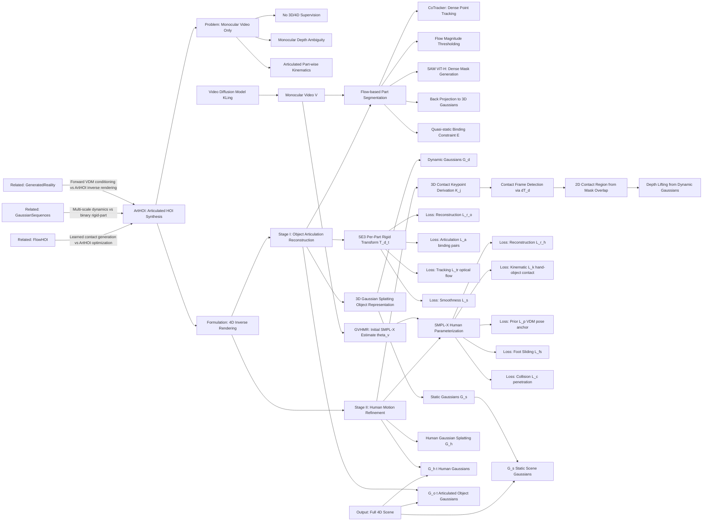

---
tags:
  - paper
  - Diffusion_Model
  - Embodied_AI
  - Robot_Manipulation
aliases:
  - "ArtHOI: Articulated Human-Object Interaction Synthesis by 4D Reconstruction from Video Priors"
url: https://huggingface.co/papers/2603.04338
pdf_url: https://arxiv.org/pdf/2603.04338.pdf
local_pdf: "[[ArtHOI Articulated HumanObject Interaction Synthesis by 4D Reconstruction from Video Priors.pdf]]"
github: None
project_page: https://arthoi.github.io/
institutions:
  - Huazhong University of Science and Technology
  - Nanyang Technological University
  - Beijing Academy of Artificial Intelligence
  - Zhejiang University
  - Tsinghua University
publication_date: 2026-03-04
score: 7
Reading?: true
---

# ArtHOI: Articulated Human-Object Interaction Synthesis by 4D Reconstruction from Video Priors

## 📌 Abstract
Synthesizing physically plausible articulated human-object interactions (HOI) without 3D/4D supervision remains a fundamental challenge. While recent zero-shot approaches leverage video diffusion models to synthesize human-object interactions, they are largely confined to rigid-object manipulation and lack explicit 4D geometric reasoning. To bridge this gap, we formulate articulated HOI synthesis as a 4D reconstruction problem from monocular video priors: given only a video generated by a diffusion model, we reconstruct a full 4D articulated scene without any 3D supervision. This reconstruction-based approach treats the generated 2D video as supervision for an inverse rendering problem, recovering geometrically consistent and physically plausible 4D scenes that naturally respect contact, articulation, and temporal coherence. We introduce ArtHOI, the first zero-shot framework for articulated human-object interaction synthesis via 4D reconstruction from video priors. Our key designs are: 1) Flow-based part segmentation: leveraging optical flow as a geometric cue to disentangle dynamic from static regions in monocular video; 2) Decoupled reconstruction pipeline: joint optimization of human motion and object articulation is unstable under monocular ambiguity, so we first recover object articulation, then synthesize human motion conditioned on the reconstructed object states. ArtHOI bridges video-based generation and geometry-aware reconstruction, producing interactions that are both semantically aligned and physically grounded. Across diverse articulated scenes (e.g., opening fridges, cabinets, microwaves), ArtHOI significantly outperforms prior methods in contact accuracy, penetration reduction, and articulation fidelity, extending zero-shot interaction synthesis beyond rigid manipulation through reconstruction-informed synthesis.

## 🖼️ Architecture
![[ArtHOI Articulated HumanObject Interaction Synthesis by 4D Reconstruction from Video Priors_arch.png]]

## 🧠 AI Analysis

# 🚀 Deep Analysis Report: ArtHOI: Articulated Human-Object Interaction Synthesis by 4D Reconstruction from Video Priors

## 📊 Academic Quality & Innovation
---

# ArtHOI: Engineering-Centric Analysis Report

---

## 1. Core Snapshot

### Problem Statement
Synthesizing physically plausible articulated human-object interactions (HOI) without 3D/4D supervision is a fundamental open problem. Existing zero-shot methods (e.g., ZeroHSI) leverage video diffusion models but treat all dynamic objects as single rigid bodies under 6-DoF transformations. This design fails for articulated objects — fridges, cabinets, microwaves, drawers — where part-wise kinematics (hinge joints, prismatic joints) are central to the interaction. Joint optimization of human motion and object articulation from monocular 2D video yields conflicting gradients and unstable convergence due to the inherent depth ambiguity of monocular observation. No existing zero-shot method satisfies all four of: HOI synthesis, RGB rendering, articulated object modeling, and physical constraint enforcement simultaneously.
将物理上合理的关节式人-物交互（HOI）在没有 3D/4D 监督的情况下进行合成是一个基本未解决的问题。现有的零样本方法（例如，ZeroHSI）利用视频扩散模型，但在 6-DoF 变换下将所有动态物体视为单一刚体。这种设计对于关节式物体——冰箱、橱柜、微波炉、抽屉——无效，因为这些物体的部分运动学（铰链关节、棱柱关节）是交互的核心。从单目 2D 视频中优化人类运动和物体关节，由于单目观察固有的深度模糊性，会导致冲突的梯度和不稳定的收敛。**没有现有的零样本方法能够同时满足以下四个条件：HOI 合成、RGB 渲染、关节式物体建模和物理约束执行。**
[[准确、清晰、简洁地回答我下面的几个问题_1、什么是HOI，这@20260306_120239]]

### Core Contribution
ArtHOI introduces the first zero-shot framework that formulates articulated HOI synthesis as a 4D reconstruction problem, using a decoupled two-stage pipeline — optical-flow-guided part segmentation followed by kinematically-constrained object articulation reconstruction, then human motion refinement conditioned on the recovered geometry — to produce geometrically consistent, physically plausible articulated human-object interactions from monocular video priors without any 3D supervision.

### Academic Rating

| Dimension | Score | Justification |
|---|---|---|
| **Innovation** | 7.5/10 | The reframing of HOI synthesis as a 4D inverse rendering problem is a meaningful conceptual shift. The decoupled pipeline design is well-motivated. However, the component technologies (3D Gaussian Splatting, optical flow tracking, SMPL-X, SAM) are individually well-established; novelty lies primarily in their systematic integration. |
| **Rigor** | 7/10 | The evaluation metrics are comprehensive and well-defined. Baselines are appropriate. However, evaluation is partially constrained by the small ArtGS dataset, and no formal statistical significance tests are reported. The ablation study, while visible in figures, is described only partially in the reviewed pages. |

---

## 2. Technical Decomposition

### 2.1 Algorithmic Logic

The method proceeds through four major phases:

**Phase 0 — Video Prior Generation.**
A text prompt $\mathcal{T}$ is fed into a video diffusion model (KLing by default) to generate a monocular RGB video $\mathcal{V} = \{I(t)\}_{t=1}^{T}$. Optionally, the video can come from real captured footage. Human mesh reconstruction (GVHMR or equivalent) is applied in parallel to obtain initial per-frame SMPL-X estimates $\boldsymbol{\theta}_v(t)$, providing a pose prior for Stage II.

*Intuition*: Generating video first separates the semantic understanding problem (what the interaction should look like) from the geometric reconstruction problem (what the 3D structure is), avoiding the need for 3D ground truth.

**Phase 1 — Flow-based Part Segmentation.**
Given the video and per-frame object masks $M^o(t)$, a pretrained point tracker (CoTracker) densely tracks pixels on the object across frames. For each tracked point $p$, the 2D displacement magnitude $\|\Delta p\|_2$ between a source and target frame determines its label: dynamic (articulated part) if $\|\Delta p\|_2 > \tau_f^d = 5$ px, static if $\|\Delta p\|_2 \leq \tau_f^s = 2$ px. Dynamic and static point sets are clustered (k-means) to produce sparse prompts $\mathcal{P}^d$ and $\mathcal{P}^s$. These prompts are fed to SAM (ViT-H) to produce a dense binary mask $M^d(t) = \text{SAM}(I(t), \mathcal{P}^d, \mathcal{P}^s)$ separating dynamic from static object parts.

*Intuition*: Motion is the most reliable monocular cue for part boundaries. Appearance-based segmentation cannot distinguish a door panel from a cabinet frame at rest, but optical flow trivially reveals which part is moving. SAM then densifies the sparse flow evidence into pixel-precise boundaries.

**Phase 1 continued — Back Projection to 3D Gaussians.**
The 2D mask $M^d(t)$ must be mapped onto the 3D Gaussian representation. For each pixel $p$ in $M^d(t)$, the $K$ nearest object Gaussians in 2D image space are found. A soft influence score $s_i^d$ is accumulated per Gaussian via a splatting-style accumulation weighting by 2D distance $\|p - \Pi(\mathbf{g})\|$, projected opacity $\alpha$, and depth ordering. Gaussians where $s_i^d > s_i^s$ are assigned to the dynamic set $\mathcal{G}^d$, others to $\mathcal{G}^s$. A $k$-NN graph connectivity refinement on 3D positions then cleans ambiguous boundary assignments by reassigning isolated Gaussians to the majority component centroid.

**Phase 1 continued — Quasi-static Binding.**
Hinge points lie at the dynamic/static boundary. These boundary Gaussians exhibit low but non-zero motion (they rotate rather than translate). Points in $\mathcal{P}^{qs}$ are identified as those in the dynamic region whose motion magnitude falls below the 10th percentile. For each quasi-static dynamic Gaussian $\mathbf{g}^{qs}$, its nearest static Gaussian $\mathbf{g}^{st}$ within 3D radius $r = 0.05$ m is identified, forming the binding constraint set:
$$\mathcal{E} = \{[\mathbf{g}^{qs}, \mathbf{g}^{st}] \mid \mathbf{g}^{qs} \in \mathcal{G}^d, \Pi(\mathbf{g}^{qs}) \in \mathcal{P}^{qs}, \mathbf{g}^{st} \in \mathcal{G}^s, \|\mathbf{g}^{qs} - \mathbf{g}^{st}\|_2 \leq r\}$$
These pairs enforce that dynamic and static parts remain connected at the hinge, acting as a geometric regularizer analogous to joint constraints in a kinematic chain.

**Phase 2 — Stage I: Object Articulation Reconstruction.**
The object articulation is modeled as per-frame $SE(3)$ transformations $\mathbf{T}^d(t) = [\mathbf{R}^d(t), \mathbf{t}^d(t)]$ with $\mathbf{R}^d \in SO(3)$, $\mathbf{t}^d \in \mathbb{R}^3$. Each Gaussian's mean position at time $t$ is computed as:
$$\boldsymbol{\mu}_i^o(t) = w_i^d \mathbf{T}^d(t)\boldsymbol{\mu}_i^o(0) + w_i^s \boldsymbol{\mu}_i^o(0)$$
where $w_i^d$ and $w_i^s$ are the articulation weights from flow-based segmentation. Optimization is frame-by-frame with warm-starting from $\mathbf{T}^d(t-1)$. The total Stage I objective is:
$$\min_{\{\mathbf{R}^d, \mathbf{t}^d\}} \mathcal{L}_r^o + \lambda_a \mathcal{L}_a + \lambda_s \mathcal{L}_s + \lambda_{tr} \mathcal{L}_{tr}$$

*Intuition*: Solving object articulation first, before touching human motion, removes one degree of freedom from the joint optimization problem. The object stage has strong kinematic structure (rigid parts, hinge-like motion) providing natural regularization, and optical flow provides direct 2D motion supervision. This makes Stage I far better conditioned than joint optimization.

**Phase 3 — Stage II: Human Motion Refinement.**
With $\{\mathbf{T}^d(t)\}$ fixed, SMPL-X parameters $\boldsymbol{\theta}(t)$ are optimized jointly over all frames. The key innovation here is deriving 3D contact targets $\mathbf{K}_j(t)$ from 2D evidence without multi-view input. Contact frames are detected by monitoring changes in $\mathbf{T}^d(t)$ between consecutive frames; at each contact frame, the object silhouette from reconstructed 3D Gaussians is compared with human and object SAM masks to identify the 2D contact region as $M^h(t) \cap \mathcal{S}(\mathcal{G}^o(t)) \setminus M^o_{\text{sam}}(t)$ (pixels where the human mask overlaps the object model silhouette, but is absent from the object SAM mask — indicating the hand occludes the object). Hand joint keypoints from GVHMR are projected into 2D; those falling in the contact region are retained. For each retained 2D keypoint, the $K$ nearest *dynamic* object Gaussians in image space provide the 3D contact target via depth lifting, with slight offset toward the camera to avoid penetration. The Stage II objective is:
$$\min_{\boldsymbol{\theta}} \mathcal{L}_r^h + \lambda_p \mathcal{L}_p + \lambda_{fs} \mathcal{L}_{fs} + \lambda_s \mathcal{L}_s + \lambda_k \mathcal{L}_k + \lambda_c \mathcal{L}_c$$

---

### 2.2 Mathematical Formulation

**Stage I — Reconstruction Loss** $\mathcal{L}_r^o$:
$$\mathcal{L}_r^o = \|\mathcal{R}(\mathcal{G}^o(t)) - I(t)\|_2^2 + \beta^o \|\mathcal{S}(\mathcal{G}^o(t)) - M^o(t)\|_2^2$$
- $\mathcal{R}(\cdot)$: differentiable Gaussian splatting renderer producing an RGB image.
- $\mathcal{S}(\cdot)$: silhouette extractor via alpha thresholding.
- $I(t)$: ground-truth video frame at time $t$.
- $M^o(t)$: binary object mask.
- *Physical meaning*: ensures the reconstructed object Gaussians, when rendered, match the observed video appearance and object boundary.

**Articulation Loss** $\mathcal{L}_a$:
$$\mathcal{L}_a = \sum_{(\mathbf{g}^d, \mathbf{g}^s) \in \mathcal{E}} \|d(\mathbf{g}^d(t), \mathbf{g}^s(t)) - d(\mathbf{g}^d(0), \mathbf{g}^s(0))\|_2^2$$
- $d(\cdot, \cdot)$: Euclidean distance between two Gaussians in 3D.
- $(\mathbf{g}^d, \mathbf{g}^s)$: quasi-static binding pairs from $\mathcal{E}$.
- *Physical meaning*: enforces that the distance between hinge-region dynamic and static Gaussians is preserved over time, simulating rigid joint connectivity. Without this, the dynamic part can drift away from the static part during optimization.

**Tracking Loss** $\mathcal{L}_{tr}$:
$$\mathcal{L}_{tr} = \sum_{i \in \mathcal{P}_{\text{dyn}}} \|\hat{p}^i_{\text{tgt}} - p^i_{\text{tgt}}\|_2^2$$
- $\mathcal{P}_{\text{dyn}}$: set of dynamic particles tracked across frames.
- $p^i_{\text{tgt}}$: 2D target position from the point tracker at $t_{\text{tgt}}$.
- $\hat{p}^i_{\text{tgt}}$: predicted 2D position via weighted projection of $K$-NN dynamic Gaussians transformed by $\mathbf{T}^d(t_{\text{tgt}})$.
- *Physical meaning*: directly supervises the SE(3) transform of the dynamic part using optical flow trajectories, providing the primary motion signal.

**Smoothness Loss** $\mathcal{L}_s$: penalizes abrupt temporal changes in $\mathbf{T}^d(t)$, encouraging smooth articulation trajectories.

**Stage II — Reconstruction Loss** $\mathcal{L}_r^h$:
$$\mathcal{L}_r^h = \sum_{t=1}^T \|\mathcal{R}(\mathcal{G}^h(t)) - I(t)\|_2^2 + \beta^h \|\mathcal{S}(\mathcal{G}^h(t)) - M^h(t)\|_2^2$$
- $\mathcal{G}^h(t)$: human Gaussians derived from SMPL-X $\boldsymbol{\theta}(t)$ at time $t$.
- $M^h(t)$: human segmentation mask.

**Kinematic Loss** $\mathcal{L}_k$:
$$\mathcal{L}_k = \sum_{t=1}^T \sum_{j \in \mathcal{K}_t} \|\mathbf{J}_j(\boldsymbol{\theta}(t)) - \mathbf{K}_j(t)\|_2^2$$
- $\mathcal{K}_t$: set of joint indices with confident contact at frame $t$.
- $\mathbf{J}_j(\boldsymbol{\theta}(t))$: 3D position of SMPL-X joint $j$ given pose $\boldsymbol{\theta}(t)$.
- $\mathbf{K}_j(t)$: 3D contact target derived from dynamic Gaussians via depth lifting.
- *Physical meaning*: pulls hand/fingertip joints toward the object surface at contact frames, enforcing proper hand-object contact without requiring multi-view data.

**Prior Loss** $\mathcal{L}_p$:
$$\mathcal{L}_p = \sum_{t=1}^T \|\boldsymbol{\theta}(t) - \boldsymbol{\theta}_v(t)\|_2^2 + \eta\|\boldsymbol{\psi}(t) - \boldsymbol{\psi}_v(t)\|_2^2$$
- $\boldsymbol{\theta}_v(t)$, $\boldsymbol{\psi}_v(t)$: VDM-estimated SMPL-X pose and body shape parameters.
- *Physical meaning*: regularizes the refined pose toward the VDM-estimated prior, preventing overfitting to contact targets at the expense of natural motion.

**Foot Sliding Loss** $\mathcal{L}_{fs}$:
$$\mathcal{L}_{fs} = \sum_{\text{contact intervals}} \sum_{t \in I} \sum_{v \in \mathcal{V}_{\text{foot}}} \|\mathbf{v}(t) - \bar{\mathbf{v}}_I\|_2^2$$
- $\mathcal{V}_{\text{foot}}$: foot vertices (ankles and toes) from SMPL-X.
- $\bar{\mathbf{v}}_I$: mean foot vertex position over the contact interval $I$.
- *Physical meaning*: suppresses unrealistic foot sliding by penalizing deviation of foot vertices from their mean position during ground contact intervals.

**Collision Loss** $\mathcal{L}_c$:
$$\mathcal{L}_c = \sum_{t=1}^T \sum_{v \in \mathcal{V}_h} \sum_{q \in \mathcal{Q}^o} \max(0, \delta - d_{vq})$$
- $\mathcal{V}_h$: hand mesh vertices from SMPL-X.
- $\mathcal{Q}^o$: object surface points (dynamic Gaussians or mesh).
- $d_{vq} = \|\mathbf{v}(t) - \mathbf{q}(t)\|_2$: distance between hand vertex and object point.
- $\delta$: penetration threshold.
- *Physical meaning*: hinge loss penalizing hand-object interpenetration, pushing hand vertices away from the object surface.

---

### 2.3 Tensor Flow & Architecture

| Stage | Component | Input | Output | Key Shape |
|---|---|---|---|---|
| Prior | KLing VDM | Text $\mathcal{T}$ | Video $\mathcal{V}$ | $[T, H, W, 3]$ |
| Prior | GVHMR | Video $\mathcal{V}$ | SMPL-X $\boldsymbol{\theta}_v(t)$ | $[T, J \times 3]$ |
| Seg. | CoTracker | $\mathcal{V}$, $M^o(t)$ | Dense trajectories | $[T, N, 2]$ |
| Seg. | Flow classification | Trajectories | $\mathcal{P}^d$, $\mathcal{P}^s$ | $[K_d, 2]$, $[K_s, 2]$ |
| Seg. | SAM (ViT-H) | $I(t)$, $\mathcal{P}^d$, $\mathcal{P}^s$ | $M^d(t)$ | $[H, W]$ binary |
| Seg. | Back projection | $M^d(t)$, $\mathcal{G}^o$ | $s_i^d$, $s_i^s$ per Gaussian | $[V]$ scores |
| Stage I | 3DGS optimizer | $\mathcal{G}^o$, $M^d$, $\mathcal{L}$ | $\mathbf{T}^d(t)$ | $[T, 4, 4]$ |
| Stage II | 3DGS optimizer | $\mathcal{G}^h$, $\mathbf{K}_j(t)$, $\mathcal{L}$ | $\boldsymbol{\theta}(t)$ | $[T, J \times 3 + 10]$ |
| Output | Renderer | $\mathcal{G}^h(t) \cup \mathcal{G}^o(t) \cup \mathcal{G}^s$ | RGB video | $[T, H, W, 3]$ |

**Architectural choices of note:**
- The object is represented with **canonical 3D Gaussians** $\mathcal{G}^o(0)$ transformed by per-frame SE(3); no per-Gaussian deformation field is used (unlike NeRF-based deformable methods), which constrains the model to physically valid rigid-part motion.
- Human is represented with **SMPL-X-driven 3D Gaussians** $\mathcal{G}^h(t)$ seeded on the SMPL-X mesh surface, enabling differentiable rendering while maintaining anatomical validity.
- The contact keypoint derivation is a **non-parametric depth-lifting step**, not a learned module, making it interpretable and free from data-specific biases.

---

### 2.4 Innovation Logic

| Aspect | Prior Art (ZeroHSI) | ArtHOI |
|---|---|---|
| Object model | 6-DoF rigid body (single SE(3)) | Part-wise SE(3) with flow-guided segmentation |
| Optimization strategy | Joint human+object end-to-end | Decoupled: Stage I (object only) → Stage II (human only) |
| Motion supervision | VDM output rendered as 2D | Optical flow trajectories as direct 2D supervision |
| Contact targets | Not explicitly modeled | 3D keypoints derived via depth lifting from 2D evidence |
| Kinematic constraint | None | Quasi-static binding pairs enforce hinge connectivity |
| Part segmentation | None | Flow magnitude thresholding + SAM densification + 3D back-projection |

The fundamental mathematical difference is that ZeroHSI uses a single global $SE(3)$ for the object, while ArtHOI decomposes the object into $\mathcal{G}^d$ and $\mathcal{G}^s$ with independent motion parameters but coupled by $\mathcal{L}_a$. This is equivalent to adding a soft kinematic chain constraint to the rendering optimization, enabling articulation recovery.

---

## 3. Evidence & Metrics

### 3.1 Benchmarks & Baselines

**Articulated object dynamics:** Single-view videos from ArtGS dataset [88] with ground-truth joint annotations. Compared against D3D-HOI [53] and 3DADN [54], which are specifically designed for monocular articulated object estimation.

**Human-object interaction quality:** ZeroHSI [6] protocol on Replicate scenes with XHumans [90] and Trellis [91]-generated objects. Baselines: TRUMANS [4] (mocap-based), LINGO [3] (language-guided), CHOIS [1] (contact-aware), ZeroHSI [6] (zero-shot rigid). The comparison is fair in that the same text prompts, scene configurations, and output lengths (60–120 frames) are used across all zero-shot methods.

### 3.2 Key Results

From Table 2 (referenced in the text, partially visible):

| Metric | TRUMANS | LINGO | CHOIS | ZeroHSI | **Ours** |
|---|---|---|---|---|---|
| X-CLIP Score ↑ | — | — | — | — | **0.244** (best) |
| Foot Sliding ↓ | 0.84 | 0.30 | 0.64 | — | **0.31** |
| Contact% ↑ | 29.07% | 30.12% | 39.72% | — | **75.64%** |
| Smoothness ↓ | lower | lower | lower | — | higher (explained) |

Contact% improvement is the most striking result: ArtHOI achieves ~75.64% vs ~29–40% for non-zero-shot methods, representing approximately a **90–160% relative improvement** in maintaining consistent hand-object contact. The authors correctly note that the lower smoothness scores of non-zero-shot methods are likely artifactual — those methods rarely achieve contact (Contact% 29–40%), so their motions are inherently smoother (no contact dynamics to model).

For articulated object dynamics, ArtHOI significantly outperforms baselines in rotation error metrics across joints and frames, demonstrating accurate hinge angle recovery.

### 3.3 Ablation Study

The paper references ablations in Figure 5 (partially visible from the images provided). Key ablated components include:
- **Quasi-static binding** (Fig. 5 middle): removing $\mathcal{L}_a$ causes parts to drift apart during optimization, confirming this loss is critical for kinematic stability.
- **Contact loss** $\mathcal{L}_k$ (Fig. 5 right): removing 3D contact keypoint supervision results in hands not making proper contact with the articulated object surface.
- The decoupled pipeline vs. joint optimization is implicitly validated by the unstable convergence observed in joint methods.

The most critical single component appears to be the **quasi-static binding constraint** $\mathcal{L}_a$, as without it, the geometric scaffold collapses and Stage II human motion refinement receives invalid contact targets.

---

## 4. Critical Assessment

### 4.1 Hidden Limitations

**Monocular depth ambiguity persists in Stage II.** The 3D contact target derivation via depth lifting from a single-view image assumes that the nearest dynamic Gaussian in 2D image space is the actual contact surface. This assumption breaks when the hand approaches the object at a grazing angle or when significant occlusion exists, potentially lifting contact targets to incorrect 3D depths.

**Single rigid part assumption per articulated component.** The model assigns one SE(3) per "dynamic" partition. Objects with multiple independently moving parts (e.g., a microwave door plus rotating dial) will cause part assignment conflicts in flow-based segmentation, as k-means clustering will produce a single dynamic cluster. There is no mechanism for multi-part discovery beyond binary static/dynamic labeling.

**Dependence on VDM output quality.** The entire pipeline is conditioned on the video generated by KLing. If the VDM generates physically implausible motion sequences (e.g., a hand passing through the object), the optical flow labels will be noisy and Stage I will converge to incorrect articulations. There is no feedback loop from 3D reconstruction quality back to video generation.

**Small evaluation dataset.** The ArtGS dataset and ZeroHSI protocol appear to cover a limited number of interaction categories. Generalization to objects with non-hinge articulation (e.g., drawers with prismatic joints) is claimed but not thoroughly validated in the reviewed material.

**Temporal optimization strategy limitations.** Stage I optimizes frame-by-frame, which prevents global trajectory optimization. Accumulated drift over long sequences ($T > 120$ frames) may be non-negligible, especially for slow articulations where optical flow signal is weak.

### 4.2 Engineering Hurdles

**Hyperparameter sensitivity in flow thresholding.** The thresholds $\tau_f^d = 5$ px (dynamic) and $\tau_f^s = 2$ px (static) are fixed. For videos with significantly different camera-to-object distances, fast camera motion, or objects with slow articulation (e.g., a drawer opening very slowly), these thresholds will misclassify regions. No adaptive or scene-relative threshold is proposed, requiring manual tuning for new scenarios.

**SAM prompt quality dependency.** The k-means clusters used as SAM prompts are sensitive to the quality of CoTracker trajectories on textureless or specularly reflective surfaces (common in household objects). Failed tracking leads to degenerate prompt configurations, causing SAM to produce incorrect masks, which then propagate through back-projection to corrupt $\mathcal{G}^d$/$\mathcal{G}^s$ assignments.

**Initialization of 3D Gaussians.** Canonical Gaussians $\mathcal{G}^o(0)$ are initialized from the first frame. If the first frame shows the object in a partially articulated state (e.g., the fridge is already partially open), the canonical pose is non-standard, complicating articulation weight assignment from flow-based segmentation.

**GPU memory scaling.** The system processes $T$ frames of 3D Gaussians with Stage II optimizing all frames jointly. For $T = 120$ frames at the 48GB A6000 GPU, memory usage is near capacity. Extending to longer sequences or higher-resolution scenes will require gradient checkpointing or temporal windowing, neither of which is described in the paper.

**Reproduction complexity.** The pipeline integrates five external systems (KLing VDM, CoTracker, SAM ViT-H, GVHMR, 3DGS renderer) with non-trivial interface code between them. The back-projection module (Section 3.2) requires careful implementation of the Gaussian-to-pixel influence accumulation matching the exact rendering equation used by the 3DGS renderer to maintain consistency between segmentation and optimization. Version mismatches in any upstream component can break the pipeline silently.

**Contact frame detection reliability.** Active contact is detected by monitoring changes in $\mathbf{T}^d(t)$ between consecutive frames. However, $\mathbf{T}^d(t)$ from Stage I is itself noisy. If the optimization fails to detect small articulation angles (below the effective detection threshold), some contact frames will be missed, leading to absent $\mathcal{L}_k$ supervision at critical interaction moments in Stage II.

## 🔗 Knowledge Graph & Connections
## Task 1: Differential Analysis & Connections

### Connection 1: ArtHOI vs. [[FlowHOI]]

Both papers address the problem of generating geometrically grounded hand-object interactions, but they differ fundamentally in their problem framing, supervision source, and output modality. **FlowHOI** operates as a learned generative model trained on egocentric datasets, using flow matching over a joint distribution of hand poses, object poses, and contact states conditioned on 3DGS scene tokens and language instructions. Its decoupling strategy separates geometry-centric grasping from semantics-centric manipulation at the *generative model architecture* level. **ArtHOI**, by contrast, performs no learning of interaction distributions — it is a purely optimization-based inverse rendering approach that treats each scene instance independently. ArtHOI's decoupling is at the *optimization scheduling* level (Stage I solves object articulation; Stage II solves human motion conditioned on Stage I output), not at the model architecture level.

The most critical technical divergence is in how contact is represented: FlowHOI explicitly models hand-object contact states as a discrete signal within the generative flow, enabling semantic grounding of "when and where to grasp." ArtHOI derives contact targets geometrically from the reconstructed 3D Gaussians via depth lifting — a non-parametric, scene-specific procedure that is more precise for the given scene but cannot generalize to novel object categories without re-running the full pipeline. FlowHOI can generalize zero-shot to new scenes given a 3DGS reconstruction; ArtHOI must re-optimize per scene. Conversely, ArtHOI handles *articulated* objects natively via part-wise SE(3), while FlowHOI's treatment of articulation is not explicitly described in the excerpt. For robotics applications requiring both transferability and articulation handling, a hybrid approach integrating FlowHOI's learned contact prior with ArtHOI's kinematic scaffold could be highly productive.

---

### Connection 2: ArtHOI vs. [[Gaussian_Sequences_with_MultiScale_Dynamics_for_4D_Reconstruction_from_Monocular_Casual_Videos]]

Both papers tackle 4D reconstruction from monocular video using 3D Gaussian representations, but differ significantly in their motion modeling philosophy. The **Gaussian Sequences** paper proposes a *multi-scale dynamics factorization* — decomposing complex motion fields into hierarchical levels from object-scale to particle-scale — as a general solution for arbitrary dynamic scenes. This is a data-driven, unsupervised approach that infers motion structure from appearance alone, using multi-modal priors from vision foundation models as soft constraints.

**ArtHOI** adopts a more constrained, task-specific motion model: it imposes a *binary rigid-part structure* (dynamic vs. static Gaussian sets) with explicit SE(3) per-part motion, derived from optical flow supervision rather than learned from motion patterns. This makes ArtHOI's reconstruction significantly more structured and physically interpretable for articulated household objects, but also less general. The Gaussian Sequences approach could in principle recover articulation structure through its multi-scale factorization, but it provides no mechanism to leverage human-object contact as a prior for part discovery — a key insight in ArtHOI. Conversely, Gaussian Sequences' global consistency guarantees (through multi-scale composition) could address ArtHOI's temporal drift problem in Stage I's frame-by-frame optimization. A direct research opportunity exists in replacing ArtHOI's frame-by-frame SE(3) optimization with a multi-scale Gaussian dynamics model, potentially improving long-sequence coherence while retaining the flow-guided part segmentation front-end.

---

### Connection 3: ArtHOI vs. [[Generated_Reality]]

The connection here is at the level of *video diffusion models as motion priors* and *3D-aware interaction synthesis*. **Generated Reality** trains a bidirectional video diffusion model conditioned on 3D head and hand poses to generate egocentric virtual environments, targeting XR applications where real-time responsiveness and embodied interaction are paramount. Its contribution is primarily in the conditioning mechanism (joint-level hand pose + head pose → video generation). **ArtHOI** sits at the *downstream* end of a similar pipeline: it consumes the output of a video diffusion model (KLing) and performs inverse rendering to recover 3D articulated structure.

The key asymmetry is directionality: Generated Reality runs video generation *forward* from 3D control signals; ArtHOI runs 4D reconstruction *backward* from generated video. In a unified embodied AI system, these two approaches could be composed: Generated Reality produces a semantically plausible egocentric video of an articulated interaction, and ArtHOI reconstructs the corresponding 3D articulated scene geometry for downstream physics simulation or robot policy learning. The limitation is that Generated Reality does not explicitly model articulated object kinematics — the generated video may contain geometrically inconsistent articulation that then causes ArtHOI's optical flow-based part segmentation to produce noisy labels. This suggests a need for articulation-aware video diffusion models as a stronger prior for reconstruction-based HOI synthesis pipelines.

---

### Connection 4: Cross-Cutting Theme — Decoupling as an Architectural Principle

Across all three related notes and ArtHOI, **decoupling** emerges as the dominant design principle for handling the inherent ambiguity of human-object interaction synthesis:

- FlowHOI decouples geometry-centric grasping from semantics-centric manipulation
- ArtHOI decouples object articulation recovery (Stage I) from human motion refinement (Stage II)
- Gaussian Sequences decouples multi-scale motion components hierarchically
- Generated Reality decouples 3D head/hand control from photorealistic video generation

This convergence suggests that the community has empirically validated decoupling as the correct inductive bias for HOI problems — the joint distribution of human motion × object articulation × contact × appearance is too complex and ill-conditioned to optimize or learn monolithically. Future work should formalize this principle, potentially as a modular interface specification (e.g., articulated object state → contact targets → human motion) that allows components from different systems to be swapped.

---

## Task 2: Mermaid Knowledge Graph

---

## Task 3: Future Research Directions

### Direction 1: Articulation-Aware Video Diffusion as a Stronger Prior

**Motivation:** ArtHOI's Stage I quality is entirely bounded by the geometric plausibility of the generated video. Current general-purpose VDMs (e.g., KLing) produce videos that are semantically plausible but geometrically inconsistent — the door hinge axis may shift between frames, making optical flow labels ambiguous. The paper has no feedback from 3D reconstruction quality back to video generation.

**Concrete Proposal:** Fine-tune a video diffusion model with explicit articulation conditioning: given an object CAD model annotated with joint axes and part labels, generate training videos by rendering physically simulated articulation sequences (using tools like Isaac Sim or PyBullet). Train a ControlNet-style adapter that conditions video generation on (joint type, joint axis, part label map), producing videos with geometrically consistent part motion. This adapter can be trained with less than 10,000 rendered sequences per object category. The improved geometric consistency would reduce noise in ArtHOI's optical flow thresholding step and directly improve Stage I articulation accuracy. Quantify improvement using ArtGS rotation error as the primary metric.

---

### Direction 2: Multi-Part Articulation Discovery via Hierarchical Flow Clustering

**Motivation:** ArtHOI currently performs binary segmentation (one dynamic part, one static part) per object. This is inadequate for objects with multiple independently moving parts (e.g., a laptop with a screen and a keyboard tray; a drawer unit with three drawers). Extending to multi-part discovery requires a principled method for determining the number of parts and their kinematic relationships without category-specific templates.

**Concrete Proposal:** Replace binary flow thresholding with a hierarchical agglomerative clustering approach on optical flow trajectories. Represent each tracked point as a feature vector comprising its temporal flow trajectory (a $[T, 2]$ vector compressed via PCA or a small temporal encoder), and cluster these features into $K$ groups using spectral clustering with a motion-coherence kernel. Determine $K$ automatically via the eigengap heuristic on the Laplacian of the pairwise trajectory similarity matrix. Each cluster defines an independent rigid part with its own SE(3). Kinematic tree structure (which part is parent/child) is inferred from the quasi-static binding: parts that share boundary quasi-static Gaussians are adjacent in the kinematic chain. This approach generalizes ArtHOI's binary decomposition to arbitrary articulation trees, evaluated on the PartNet-Mobility dataset where ground-truth part decompositions are available.

---

### Direction 3: Reconstruction-Informed Robot Policy Learning via ArtHOI Scaffolds

**Motivation:** ArtHOI produces a 4D articulated scene scaffold (object geometry + articulation trajectory + physically plausible human motion) entirely from text prompts, without any real-world data collection. This output is precisely the structured representation needed to bootstrap robot manipulation policies for articulated objects — a setting where real data is expensive and dangerous to collect (e.g., training on refrigerators or ovens).

**Concrete Proposal:** Design a pipeline where ArtHOI's output is used as demonstration data for imitation learning. Specifically: (1) run ArtHOI for $N$ text prompt variations of the same interaction category (e.g., "open the fridge slowly," "open the fridge quickly and hold"), producing a distribution of 4D articulated scenes; (2) retarget the reconstructed human hand trajectories and contact targets to a robot end-effector (e.g., Franka Panda) using inverse kinematics, using ArtHOI's contact keypoints $\mathbf{K}_j(t)$ as end-effector waypoints and the collision loss $\mathcal{L}_c$ surface as the obstacle model; (3) train a diffusion policy on the retargeted trajectories with the reconstructed object point cloud as visual observation. Evaluate success rate on a physical robot across articulated object categories. Key research questions: how much does ArtHOI's geometric fidelity affect downstream policy success, and can ArtHOI-generated data close the sim-to-real gap for articulated manipulation without any real demonstrations?

---
*Analysis performed by PaperBrain-OpenRouter (anthropic/claude-sonnet-4.6) (Vision-Enabled)*

## 📂 Resources
- **Local PDF**: [[ArtHOI Articulated HumanObject Interaction Synthesis by 4D Reconstruction from Video Priors.pdf]]
- [Online PDF](https://arxiv.org/pdf/2603.04338.pdf)
- [ArXiv Link](https://huggingface.co/papers/2603.04338)
