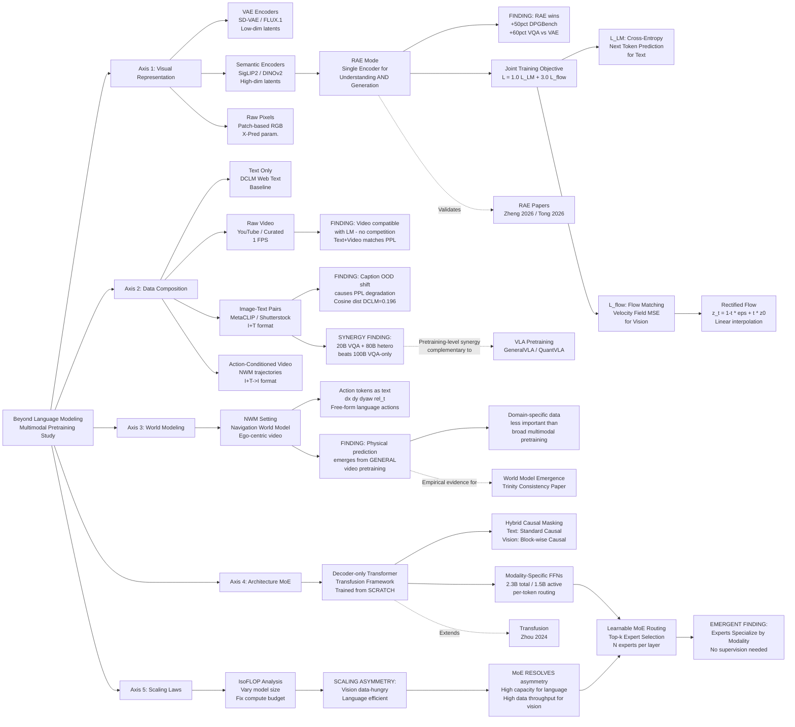

---
tags:
  - paper
  - World_Model
  - Diffusion_Model
  - Foundation_Model
  - LLM
  - VLA
aliases:
  - "Beyond Language Modeling: An Exploration of Multimodal Pretraining"
url: http://arxiv.org/abs/2603.03276v1
pdf_url: https://arxiv.org/pdf/2603.03276v1
local_pdf: "[[Beyond Language Modeling An Exploration of Multimodal Pretraining.pdf]]"
github: "None"
project_page: "https://beyond-llms.github.io/"
institutions:
  - "FAIR, Meta"
  - "New York University"
publication_date: "2026-03-03"
score: 8
---

# Beyond Language Modeling: An Exploration of Multimodal Pretraining

## 📌 Abstract
The visual world offers a critical axis for advancing foundation models beyond language. Despite growing interest in this direction, the design space for native multimodal models remains opaque. We provide empirical clarity through controlled, from-scratch pretraining experiments, isolating the factors that govern multimodal pretraining without interference from language pretraining. We adopt the Transfusion framework, using next-token prediction for language and diffusion for vision, to train on diverse data including text, video, image-text pairs, and even action-conditioned video. Our experiments yield four key insights: (i) Representation Autoencoder (RAE) provides an optimal unified visual representation by excelling at both visual understanding and generation; (ii) visual and language data are complementary and yield synergy for downstream capabilities; (iii) unified multimodal pretraining leads naturally to world modeling, with capabilities emerging from general training; and (iv) Mixture-of-Experts (MoE) enables efficient and effective multimodal scaling while naturally inducing modality specialization. Through IsoFLOP analysis, we compute scaling laws for both modalities and uncover a scaling asymmetry: vision is significantly more data-hungry than language. We demonstrate that the MoE architecture harmonizes this scaling asymmetry by providing the high model capacity required by language while accommodating the data-intensive nature of vision, paving the way for truly unified multimodal models.

## 🖼️ Architecture
![[Beyond Language Modeling An Exploration of Multimodal Pretraining_arch.png]]

## 🧠 AI Analysis

# 🚀 Deep Analysis Report: Beyond Language Modeling: An Exploration of Multimodal Pretraining

## 📊 Academic Quality & Innovation
---

# Deep Engineering-Centric Analysis: "Beyond Language Modeling: An Exploration of Multimodal Pretraining"

---

## 1. Core Snapshot

### Problem Statement

The dominant paradigm for building multimodal models is to initialize from pretrained language model checkpoints and then adapt them for vision—a procedure that conflates two distinct sources of knowledge: what is learned from language pretraining and what is learned from multimodal co-training. This initialization bias makes it impossible to cleanly attribute capabilities to multimodal training dynamics, and it leaves fundamental questions unanswered: How do vision and language modalities interact when trained jointly from scratch? What visual representation best serves both understanding and generation? How does the scaling relationship between vision and language data behave under iso-compute conditions? The design space for native, from-scratch multimodal models remains empirically underexplored.

### Core Contribution

Through controlled, from-scratch pretraining experiments under the Transfusion framework, this work provides the first systematic empirical characterization of how visual representation choice, data composition, architecture (MoE vs. dense), and compute scaling jointly govern the capabilities of a unified multimodal model, culminating in the discovery that (i) Representation Autoencoders (RAE) unify visual understanding and generation in a single encoder, (ii) vision and language data are synergistic rather than competitive, (iii) world-modeling capabilities emerge from general multimodal pretraining, and (iv) Mixture-of-Experts architectures harmonize the scaling asymmetry between the two modalities.

### Academic Rating

- **Innovation: 7.5/10** — The paper's primary contribution is empirical and systematic rather than algorithmically novel. It does not introduce new architectures or objectives, but its controlled ablation methodology—isolating variables across visual representation, data composition, architecture, and scaling—produces insight that has been inaccessible in prior work due to initialization confounds. The RAE finding and the vision-language scaling asymmetry are substantively new empirical facts.
- **Rigor: 8/10** — The experimental design is unusually disciplined: fixed compute budgets within each ablation family, consistent hyperparameter settings, multiple evaluation axes (PPL, FID, GenEval, DPGBench, VQA), and IsoFLOP scaling analysis. The primary limitation is that conclusions are drawn at a moderate scale (2.3B total parameters); extrapolation to frontier scales is not empirically validated.

---

## 2. Technical Decomposition

### 2.1 Algorithmic Logic

The system is built on the **Transfusion** framework, which trains a single autoregressive transformer to handle both discrete text tokens (via next-token prediction) and continuous visual tokens (via flow matching/diffusion). The full algorithmic pipeline is as follows:

**Step 1: Input Encoding**
- Text sequences $(x_1, \ldots, x_n)$ are tokenized using a standard BPE tokenizer from LLaMA-3.
- Each image or video frame is encoded by a *frozen* visual encoder (e.g., SigLIP 2 So400m) into a spatial latent grid. For a 224×224 image with patch size 14×14, the output is a $16 \times 16 = 256$ token sequence in the encoder's latent space. These are denoted $\mathtt{I}$ tokens.
- A simple linear projection layer maps the visual encoder's output dimensionality into the transformer's model dimensionality (no U-Net used, unlike the original Transfusion).

**Step 2: Noise Injection for Flow Matching**
- Let $z_0 \in \mathbb{R}^{d \times L}$ denote the clean latent tokens for an image or video frame (flattened into a sequence of $L$ tokens of dimension $d$).
- Sample $\epsilon \sim \mathcal{N}(0, I)$ and $t \sim \mathcal{U}[0, 1]$.
- Construct the interpolated noisy latent: $z_t = (1 - t)\epsilon + t z_0$.
- This linear interpolation (rectified flow) establishes a straight-line trajectory from noise to data.

**Step 3: Causal Masking Strategy (Hybrid)**
- For text tokens: standard causal (autoregressive) mask.
- For visual tokens: a *block-wise causal* mask. All tokens within a single image/video frame attend bidirectionally to each other, and also attend to all prior tokens in the sequence. This respects the spatial independence within a frame while maintaining temporal causality across frames. This is implemented via FlexAttention.

**Step 4: Transformer Forward Pass with Modality-Specific FFNs**
- The backbone is a decoder-only transformer (similar architecture to LLaMA).
- Crucially, within each transformer block, there are **two separate FFN sub-networks**: one for text tokens and one for visual tokens. These are selected at the per-token level based on modality type.
- The intuition: text and visual tokens occupy fundamentally different semantic spaces; shared FFN capacity creates interference, while modality-specific FFNs allow specialized feature transformations without increasing the active parameter count.
- Default model: 2.3B total parameters, 1.5B active per token (with modality-specific FFNs, a dense model with shared FFNs would also be ~1.5B parameters).

**Step 5: Dual-Objective Training**
- Language modeling loss for text tokens; flow matching loss for visual tokens.
- Both losses are computed in a single forward pass on mixed batches (text-only, video-only, image-text pairs, action-conditioned video).

**Step 6: Inference**
- Text generation: standard autoregressive sampling.
- Image generation: a 25-step Euler sampler denoises the model's predicted velocity field. The resulting $z_0$ estimate is decoded to pixel space via a pretrained VAE decoder (SD-VAE or FLUX.1 decoder for VAE encoders; RAE decoder for semantic encoders).
- Classifier-Free Guidance (CFG): conditioning is randomly dropped 10% of the time during training; a fixed CFG scale of 3.0 is used at inference.

**Intuition for this design over alternatives:**
Prior work maintains dual encoders (one semantic for understanding, one VAE for generation), which doubles the tokenization pipeline complexity. The key insight enabling simplification is that diffusion models can effectively operate in high-dimensional semantic latent spaces (the RAE finding), eliminating the need for a separate generation-specific encoder. The block-wise causal mask for vision is chosen because diffusion over visual tokens requires the model to see all spatial positions of a frame simultaneously (not autoregressively), while still respecting the sequential nature of video.

---

### 2.2 Mathematical Formulation

**Language Modeling Loss:**
$$\mathcal{L}_{\text{LM}} = -\sum_{i=1}^{n} \log p_\theta(x_i \mid x_{<i}) \tag{1}$$
- $x_i$: the $i$-th text token in the sequence.
- $x_{<i}$: all previous tokens (context).
- $p_\theta$: the model's predicted probability distribution over the vocabulary.
- *Physical meaning*: Minimizing this loss drives the model to accurately predict the next token given all prior context, i.e., to model the conditional distribution of natural language.

**Flow Matching Loss (Visual Tokens):**
$$\mathcal{L}_{\text{flow}} = \mathbb{E}_{t, z_0, \epsilon} \left[ \left\| v_\theta(z_t, t, \cdot) - (z_0 - \epsilon) \right\|_2^2 \right] \tag{2}$$
- $z_0 \in \mathbb{R}^{d \times L}$: the clean (ground-truth) latent representation of an image/video frame, output by the frozen visual encoder.
- $\epsilon \sim \mathcal{N}(0, I)$: Gaussian noise of the same shape.
- $t \sim \mathcal{U}[0, 1]$: the interpolation time step, sampled uniformly.
- $z_t = (1-t)\epsilon + t z_0$: the linearly interpolated noisy latent at time $t$.
- $v_\theta(z_t, t, \cdot)$: the transformer's predicted velocity field at the noisy latent $z_t$, conditioned on time $t$ and the context (prior tokens).
- $(z_0 - \epsilon)$: the target velocity field under the rectified flow formulation (the direction from noise to data).
- *Physical meaning*: The model learns to predict, at any point along the straight-line trajectory from noise to clean image, the exact direction and magnitude required to reach $z_0$. Minimizing this squared error teaches the model to denoise visual representations conditioned on textual or visual context.

**Important implementation detail on noise scheduling:** The authors shift the noise schedule toward the noisier end of the spectrum for high-dimensional visual representations, following the recommendation from Esser et al. (2024) and the RAE papers. This counteracts the tendency for the model to trivially predict low-frequency structure when operating in high-dimensional latent spaces.

**Alternative parameterization (x-pred):** In Section 3 and 6.1, the authors also explore predicting $z_0$ directly (the "x-prediction" parameterization from JiT/Li & He 2025), rather than the velocity field. The velocity parameterization $(z_0 - \epsilon)$ is the default.

**Joint Training Objective:**
$$\mathcal{L} = \lambda_{\text{LM}} \mathcal{L}_{\text{LM}} + \lambda_{\text{flow}} \mathcal{L}_{\text{flow}} \tag{3}$$
- $\lambda_{\text{LM}} = 1.0$ and $\lambda_{\text{flow}} = 3.0$ (default, chosen empirically to stabilize joint training).
- *Physical meaning*: A weighted combination ensures neither objective dominates training dynamics; the higher weight on flow loss compensates for the scale difference between cross-entropy and mean squared error.

---

### 2.3 Tensor Flow & Architecture

The data flow through the model can be described as follows:

**Visual branch:**
$$\text{Image}\ [B, 3, 224, 224] \xrightarrow{\text{Frozen SigLIP 2}} \text{Latent}\ [B, 256, d_{\text{enc}}] \xrightarrow{\text{Linear Projection}} [B, 256, d_{\text{model}}]$$
Where $d_{\text{enc}}$ is the encoder's output dimension (e.g., 1152 for SigLIP 2 So400m) and $d_{\text{model}}$ is the transformer's model dimension.

During flow matching training:
$$[B, 256, d_{\text{model}}] \xrightarrow{\text{Noise injection at time } t} z_t\ [B, 256, d_{\text{model}}]$$

**Text branch:**
$$\text{Token IDs}\ [B, T] \xrightarrow{\text{Embedding}} [B, T, d_{\text{model}}]$$

**Joint transformer processing:**
The concatenated mixed-modality sequence $[B, T + 256, d_{\text{model}}]$ is processed through $L$ transformer layers. Within each layer:
- Self-attention: shared across modalities (with hybrid causal/block-wise mask)
- FFN: *modality-specific* — a router selects the text FFN or vision FFN based on the token's source modality

**Output heads:**
- Text tokens: linear head $[B, T, d_{\text{model}}] \rightarrow [B, T, |\mathcal{V}|]$ (vocabulary logits)
- Visual tokens: velocity prediction head $[B, 256, d_{\text{model}}] \rightarrow [B, 256, d_{\text{latent}}]$

**For VAE-based encoders:** The latent $z_0$ lives in the VAE's low-dimensional latent space (e.g., $[B, 4, 32, 32]$ for SD-VAE, then flattened to $[B, 4096, 4]$). For semantic encoders (SigLIP 2), the latent lives in a high-dimensional space ($[B, 256, 1152]$), which is the RAE regime.

**Key architectural note on MoE (Section 6):** Beyond modality-specific FFNs, the paper explores fully learnable MoE routing. In the MoE setting, each FFN is replaced by a set of $N$ expert FFNs, with a learned router selecting the top-$k$ experts per token. The paper observes that experts *naturally specialize* by modality without explicit modality-supervised routing—an emergent behavior.

---

### 2.4 Innovation Logic

**vs. Dual-encoder baselines (Janus, BAGEL):** Prior systems maintain two separate visual encoders—a semantic encoder (e.g., SigLIP) for understanding and a VAE (e.g., SD-VAE or FLUX VAE) for generation. This paper demonstrates that a single semantic encoder (SigLIP 2 in RAE mode) can outperform FLUX.1 VAE on generation metrics (DPGBench, GenEval) while simultaneously outperforming it on understanding (VQA), eliminating the dual-encoder overhead entirely.

**vs. Standard Transfusion (Zhou et al., 2024):** The original Transfusion uses a U-Net for processing visual tokens within the transformer. This work replaces the U-Net with a simple linear projection, which is motivated by keeping the number of visual tokens fixed (not downsampled), allowing a more direct projection into the transformer's latent space.

**vs. shared FFN designs:** Mathematically, shared FFNs apply the same $W_1, W_2$ weight matrices to both text and visual hidden states. Modality-specific FFNs apply separate $W_1^{\text{text}}, W_2^{\text{text}}$ and $W_1^{\text{vis}}, W_2^{\text{vis}}$, effectively doubling FFN parameters while keeping active parameters per token constant. This is structurally equivalent to a 2-expert MoE with modality-supervised routing, and it provably provides greater representational capacity per modality without increasing inference cost.

---

## 3. Evidence & Metrics

### 3.1 Benchmarks & Baselines

The evaluation suite is comprehensive and multi-dimensional:
- **Language modeling**: Perplexity on held-out DCLM validation set and an in-house "Notes" OOD corpus
- **Image generation**: COCO FID, DPGBench (compositional text-to-image), GenEval (multi-object alignment)
- **Visual understanding**: Average VQA accuracy on the 16-benchmark Cambrian evaluation suite (after 1 epoch finetuning on Cambrian-7M)
- **Diffusion loss**: Held-out CC12M validation set (perceptual proxy for generation quality)

Baselines compared within the controlled ablation framework include: SigLIP 2 So400m, DINOv2-L, WebSSL-L, SD-VAE, FLUX.1, and raw pixels. All comparisons are at matched compute budgets (~520B text + 520B multimodal tokens), which is a key fairness control.

The experimental design is generally fair for ablation purposes. A notable caveat is that VQA results require 1 epoch of finetuning on Cambrian-7M, introducing a small confound; however, this is a standard protocol in the field.

### 3.2 Key Results

**RAE vs. VAE (Section 3 / Figure 4):**
- SigLIP 2 (RAE-mode) achieves DPGBench score ~0.60 vs. FLUX.1 ~0.40 (≈+50% relative improvement) and GenEval ~0.35 vs. FLUX.1 ~0.20 (≈+75% relative improvement)
- Avg VQA: SigLIP 2 ~40% vs. FLUX.1 ~25% (≈+60% relative improvement)
- SigLIP 2 maintains text PPL comparable to the text-only baseline, while FLUX.1 shows marginal text degradation

**Data composition (Section 4.1 / Figure 5):**
- Text + Video achieves DCLM PPL ≈13.5, matching text-only baseline (~13.5), confirming raw video does not compete with text
- Text + MetaCLIP degrades PPL to ~14.0 on DCLM (distribution shift from captions)
- Text + Video + MetaCLIP + Action recovers partially to ~13.8

**Cross-modal synergy (Section 4.3 / Figure 9):**
- Mixed models (20B VQA + 80B heterogeneous) outperform both a 20B VQA-only baseline and a 100B VQA-only baseline on VQA, providing >5× data efficiency gain for the multimodal pretraining approach

**MoE vs. dense (Section 6):**
- MoE with emergent modality specialization improves across all metrics simultaneously (DPGBench, GenEval, VQA, PPL)
- Expert specialization by modality emerges without supervision: vision-only experts and text-only experts appear naturally

**Scaling asymmetry (Section 7):**
- IsoFLOP analysis shows vision requires substantially more data tokens than language to reach the same loss reduction: the optimal token allocation shifts dramatically toward visual data
- MoE architecture's ability to provide high model capacity for language (through large total parameter count) while keeping active compute tractable resolves this asymmetry

### 3.3 Ablation Study

The most critical component identified is the **visual representation choice** (Section 3). Switching from VAE-based encoders (SD-VAE, FLUX.1) to a semantic encoder (SigLIP 2) in RAE mode yields the largest single improvement across all visual metrics. The modality-specific FFN design is the second most critical architectural choice (Figure 3 shows improvements across all 7 evaluated metrics simultaneously). The data composition finding (synergy from diverse multimodal data) is the third critical factor.

---

## 4. Critical Assessment

### 4.1 Hidden Limitations

**Scale ceiling:** All experiments are conducted at the 2.3B parameter scale with ~1T total training tokens. Scaling laws are derived via IsoFLOP analysis, but the conclusions (particularly about vision-language scaling asymmetry and MoE harmonization) are extrapolated beyond empirically validated compute regimes. The behavior of expert specialization and the optimal MoE routing structure may change at much larger scales.

**Frozen encoder assumption:** The visual encoder (SigLIP 2) is kept frozen throughout training. This means the visual representations are not jointly optimized with the transformer, potentially leaving cross-modal representation alignment on the table. It also implies that the model's visual understanding is upper-bounded by what SigLIP 2 can represent—the model cannot develop visual concepts that SigLIP 2 does not encode.

**VQA evaluation confound:** All VQA results require 1 epoch of finetuning on Cambrian-7M, which introduces a non-trivial confound. Differences in pretraining representations may have differential interaction effects with the finetuning data, making it difficult to cleanly attribute VQA performance to pretraining choices alone.

**World modeling scope:** The navigation world model (NWM) setting is restricted to ego-centric navigation with structured action tokens (dx, dy, dyaw, rel_t). The generality of the world modeling finding—that capabilities emerge from general multimodal pretraining—is demonstrated only in this narrow domain and may not generalize to more complex physical prediction tasks.

**Video tokenization:** Video is processed frame-by-frame at 1 FPS, with each frame encoded independently. This ignores temporal correlations at the token level, relying entirely on the transformer's attention mechanism to capture temporal dynamics. This may be suboptimal for tasks requiring fine-grained temporal understanding.

### 4.2 Engineering Hurdles

**Reproducing the noise schedule shift:** The paper references shifting the noise schedule toward the noisier end for high-dimensional RAE latents, following Esser et al. (2024). The precise schedule parameterization is not fully detailed in the main paper and requires careful reading of the appendix and referenced works. Incorrect noise scheduling in RAE-mode training is likely to cause training instability or poor generation quality.

**FlexAttention implementation for hybrid masking:** The block-wise causal mask for visual tokens combined with the standard causal mask for text tokens requires a custom attention mask pattern. Implementing this correctly in FlexAttention (or equivalent) without introducing memory or speed regressions requires non-trivial engineering. In particular, handling variable-length sequences with mixed modalities and different masking rules in a batched setting is complex.

**Loss weighting sensitivity:** The $\lambda_{\text{LM}} = 1.0$, $\lambda_{\text{flow}} = 3.0$ weighting was chosen empirically to stabilize joint training. This ratio is likely sensitive to the specific data mixture ratio, model scale, and visual encoder dimensionality. Practitioners who change any of these variables will need to re-tune the loss weights, which requires multiple expensive training runs.

**MoE routing load balancing:** The paper does not provide detailed specification of the load balancing auxiliary loss used to prevent expert collapse in the MoE setting. Expert collapse (all tokens routed to one or two experts) is a well-documented failure mode in MoE training that would prevent the emergent modality specialization from occurring. Reproducers must implement appropriate auxiliary losses with tuned coefficients.

**Decoder dependency at inference:** For semantic encoders (SigLIP 2) in RAE mode, image generation at inference time requires decoding the high-dimensional latent back to pixel space using the RAE decoder (from Zheng et al., 2026; Tong et al., 2026). These decoders are external pretrained components not trained as part of this system. Their availability and compatibility with the specific SigLIP 2 latent space must be verified carefully, and the decoding quality will introduce its own artifacts independent of the generative model's quality.

**Data pipeline complexity:** The training data spans four heterogeneous sources (DCLM text, raw YouTube/curated video at 1 FPS, MetaCLIP/Shutterstock image-text pairs, NWM action-conditioned video) with different formats, temporal structures, and quality distributions. Building a batched dataloader that correctly interleaves these modalities, applies appropriate preprocessing (224×224 frame resizing, BPE tokenization, action token formatting), and maintains the desired token budget ratios is a substantial engineering task not documented in detail.

## 🔗 Knowledge Graph & Connections
## Task 1: Knowledge Connections

### Connection 1: [[The_Trinity_of_Consistency_as_a_Defining_Principle_for_General_World_Models]]
This is the most direct conceptual connection. Both papers address the emergence of **world modeling capabilities from unified multimodal pretraining**. The Trinity paper defines consistency (temporal, semantic, physical) as the organizing principle for world models; the current paper empirically demonstrates that such consistency-grounded prediction capabilities *emerge naturally* from general-purpose video pretraining under the Transfusion framework (Section 5), without domain-specific world model training. The NWM experiments in Section 5 are essentially a minimal test of whether a general multimodal model satisfies the temporal-physical consistency criteria articulated in the Trinity framework. The two papers are complementary: one provides the normative framework, the other provides the empirical mechanism.

---

### Connection 2: [[GeometryAware_Rotary_Position_Embedding_for_Consistent_Video_World_Model]]
Both papers tackle the architecture of **video-conditioned world models** processed by transformer backbones. The Geometry-Aware RoPE paper addresses the position encoding problem for spatiotemporal video tokens—precisely the issue that arises in the block-wise causal masking scheme of the current paper. The current paper uses a flat, frame-indexed block mask (each frame attends bidirectionally internally, causally to prior frames), which is a coarse approximation of spatial geometry. The Geometry-Aware RoPE work provides a direct upgrade path: replacing the flat position encoding with geometry-aware 3D RoPE could improve temporal consistency in the NWM rollouts described in Section 5.3. This represents a concrete and actionable technical integration point.

---

### Connection 3: [[Generated_Reality]]
The "Generated Reality" paper and the current work share the **core architectural commitment to unified generative pretraining over visual and linguistic data**, with both treating image/video generation as a first-class training signal rather than a downstream task. However, the current paper's finding on RAE-based representations—that a single semantic encoder suffices for both understanding and generation—directly challenges architectures in the Generated Reality line that maintain dual-pathway tokenization. The empirical evidence here (SigLIP 2 outperforming FLUX.1 on DPGBench by ~+50% relative) suggests that systems like Generated Reality that rely on VAE-based generation latents may be operating with a suboptimal representation. This is a **conflicting empirical result** that warrants cross-examination.

---

### Connection 4: [[MALLVI]]
MALLVI (Multimodal Action-Language-Vision-Language Instruction) and the current paper both address the question of **how vision and language co-training affects downstream task capabilities**. The current paper's synergy finding in Section 4.3—that 20B VQA tokens + 80B heterogeneous multimodal tokens outperforms 100B VQA-only tokens—directly validates the motivation behind instruction-tuning pipelines like MALLVI that mix heterogeneous visual data sources. However, the current paper operates at the *pretraining* level while MALLVI operates at the *finetuning* level, suggesting the synergy mechanism is not limited to one training phase and may compound across stages.

---

### Connection 5: [[QuantVLA]] and [[GeneralVLA]]
The **action-conditioned video modeling** component (NWM setting, Section 5) and the MoE architecture findings connect directly to VLA (Vision-Language-Action) model design. Both QuantVLA and GeneralVLA grapple with the question of how to efficiently route computation across vision, language, and action modalities. The current paper's discovery that MoE experts naturally specialize by modality without explicit supervision provides a theoretical foundation for why MoE-based VLA architectures may be superior to dense alternatives. Furthermore, the finding that physical prediction capabilities emerge from *general* video pretraining rather than domain-specific robot data has direct implications for how VLA pretraining corpora should be constructed—a point directly relevant to GeneralVLA's data strategy.

---

## Task 2: Mermaid Knowledge Graph

---

## Task 3: Future Research Directions

### Direction 1: End-to-End Joint Optimization of Visual Encoder and Multimodal Backbone

**Motivation:** A critical limitation identified in this paper is that the visual encoder (SigLIP 2) is kept *frozen* throughout training. The RAE finding demonstrates that high-dimensional semantic latents are effective for generation, but the representations were learned for discriminative contrastive objectives—not for the flow-matching generation task or for world-modeling. Joint end-to-end training could allow the visual encoder to develop representations that are simultaneously optimal for understanding, generation, and physical prediction.

**Concrete Proposal:** Design a curriculum training scheme where the visual encoder is initially frozen (for training stability), then unfrozen at a specified checkpoint with a much lower learning rate (e.g., 10× lower than the transformer backbone). Evaluate whether jointly-optimized visual representations (i) improve generation quality beyond RAE-mode SigLIP 2, (ii) enable better temporal consistency in video generation, and (iii) develop representations that capture physical properties (depth, contact geometry, optical flow) not present in SigLIP 2's contrastive pretraining. Compare against the current frozen baseline on the full evaluation suite including the NWM setting.

---

### Direction 2: Geometry-Aware Spatiotemporal Position Encoding for Video in Multimodal Pretraining

**Motivation:** The current paper uses a block-wise causal mask where all tokens within a frame attend bidirectionally, but the positional encoding within a frame is flat (no spatial geometry). Video frames are 2D spatial samples of a 3D world; a flat position encoding discards the camera geometry and spatial topology that is critical for physical world modeling (depth estimation, 3D consistency, egomotion prediction). The NWM rollout failures (e.g., poor handling of rapid camera rotation) are likely attributable in part to this geometric blindness.

**Concrete Proposal:** Replace the flat 1D positional encoding for visual tokens with a geometry-aware 3D RoPE scheme (extending [[GeometryAware_Rotary_Position_Embedding_for_Consistent_Video_World_Model]]) that encodes (x, y) patch coordinates within a frame and (t) frame index. Investigate whether this improves: (i) temporal consistency in multi-frame generation rollouts, (ii) NWM prediction accuracy on egomotion-conditioned trajectories, and (iii) VQA tasks requiring spatial reasoning (object localization, relative position questions). Conduct an IsoFLOP comparison to determine whether the geometry-aware encoding provides sufficient benefit per parameter count to justify its added complexity.

---

### Direction 3: Modality-Adaptive Compute Allocation via Learned Token Dropping in MoE Multimodal Models

**Motivation:** This paper demonstrates a scaling asymmetry—vision is substantially more data-hungry than language under matched compute. The MoE architecture partially resolves this by increasing total model capacity without proportionally increasing active compute per token. However, the asymmetry also manifests *within* a sequence: visual tokens may require more representational work (higher-dimensional space, more spatial detail) than text tokens. Current models allocate a fixed number of transformer layers and attention heads to every token regardless of modality.

**Concrete Proposal:** Develop a *dynamic depth routing* scheme within the MoE multimodal transformer, where each token (text or visual) is assigned a variable number of active transformer layers based on a learned importance score. Visual tokens in high-uncertainty (noisy, high-$t$) diffusion steps would receive more compute; visual tokens at low-$t$ (near-clean) or simple text tokens would early-exit. This is inspired by adaptive computation time (Graves, 2016) but applied specifically to the multimodal MoE setting. Evaluate against fixed-depth baselines at matched FLOP budgets using the IsoFLOP methodology from Section 7, measuring whether dynamic allocation achieves better utilization of the compute budget across the vision-language scaling asymmetry.

---
*Analysis performed by PaperBrain-OpenRouter (anthropic/claude-4.6-sonnet) (Vision-Enabled)*

## 📂 Resources
- **Local PDF**: [[Beyond Language Modeling An Exploration of Multimodal Pretraining.pdf]]
- [Online PDF](https://arxiv.org/pdf/2603.03276v1)
- [ArXiv Link](http://arxiv.org/abs/2603.03276v1)
