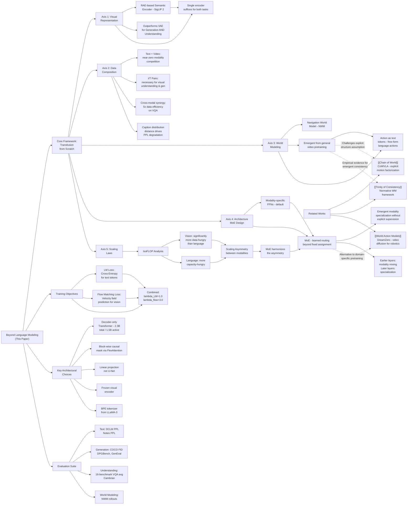

---
tags:
  - paper
  - World_Model
  - Diffusion_Model
  - Foundation_Model
  - LLM
  - VLA
aliases:
  - "Beyond Language Modeling: An Exploration of Multimodal Pretraining"
url: https://huggingface.co/papers/2603.03276
pdf_url: https://arxiv.org/pdf/2603.03276.pdf
local_pdf: "[[Beyond Language Modeling An Exploration of Multimodal Pretraining.pdf]]"
github: "None"
project_page: "https://beyond-llms.github.io/"
institutions:
  - "FAIR, Meta"
  - "New York University"
publication_date: "2026-03-03"
score: 8
---

# Beyond Language Modeling: An Exploration of Multimodal Pretraining

## 📌 Abstract
The visual world offers a critical axis for advancing foundation models beyond language. Despite growing interest in this direction, the design space for native multimodal models remains opaque. We provide empirical clarity through controlled, from-scratch pretraining experiments, isolating the factors that govern multimodal pretraining without interference from language pretraining. We adopt the Transfusion framework, using next-token prediction for language and diffusion for vision, to train on diverse data including text, video, image-text pairs, and even action-conditioned video. Our experiments yield four key insights: (i) Representation Autoencoder (RAE) provides an optimal unified visual representation by excelling at both visual understanding and generation; (ii) visual and language data are complementary and yield synergy for downstream capabilities; (iii) unified multimodal pretraining leads naturally to world modeling, with capabilities emerging from general training; and (iv) Mixture-of-Experts (MoE) enables efficient and effective multimodal scaling while naturally inducing modality specialization. Through IsoFLOP analysis, we compute scaling laws for both modalities and uncover a scaling asymmetry: vision is significantly more data-hungry than language. We demonstrate that the MoE architecture harmonizes this scaling asymmetry by providing the high model capacity required by language while accommodating the data-intensive nature of vision, paving the way for truly unified multimodal models.

## 🖼️ Architecture
![[Beyond Language Modeling An Exploration of Multimodal Pretraining_arch.png]]

## 🧠 AI Analysis

# 🚀 Deep Analysis Report: Beyond Language Modeling: An Exploration of Multimodal Pretraining

## 📊 Academic Quality & Innovation
---

# Deep Engineering Analysis: *Beyond Language Modeling: An Exploration of Multimodal Pretraining*

---

## 1. Core Snapshot

### Problem Statement

The dominant paradigm for building multimodal models begins with a pretrained language model (LLM) and then adapts it to handle visual inputs. This initialization from a language-pretrained backbone confounds any empirical conclusions about the intrinsic dynamics of joint vision-language training: it is impossible to separate what the model learned from multimodal data versus what it inherited from language pretraining. Consequently, the fundamental design questions—which visual representation to use, how data mixtures interact, how to scale architecture efficiently across modalities—remain poorly characterized. There is no clean, controlled empirical foundation for the science of native multimodal pretraining from scratch.

### Core Contribution

The paper provides a systematic, controlled, from-scratch empirical study of unified multimodal pretraining using the Transfusion framework, yielding four actionable design principles: (1) Representation Autoencoders (RAE) with semantic encoders like SigLIP 2 suffice for both visual understanding and generation; (2) visual and language data are complementary rather than competitive; (3) world modeling capabilities emerge naturally from diverse multimodal pretraining; and (4) Mixture-of-Experts (MoE) resolves the scaling asymmetry between vision (data-hungry) and language (capacity-hungry) by harmonizing compute allocation.

### Academic Rating

- **Innovation: 7/10** — The paper does not introduce a new architecture per se; rather, it adapts and rigorously validates existing components (Transfusion, RAE, MoE) in a clean experimental harness. The key novelty lies in the *controlled experimental design* and the discovery of the vision-language scaling asymmetry, particularly the finding that RAE-based semantic encoders outperform VAEs for generation—a non-obvious result that challenges the prevailing assumption that VAEs are necessary for diffusion-based generation.
- **Rigor: 8/10** — The paper conducts careful IsoFLOP analysis, ablates across multiple encoder families, data compositions, and architecture variants, and reports results across a broad evaluation suite (PPL, FID, GenEval, DPGBench, 16-benchmark VQA average). The controlled experimental design (fixed compute budget within ablation families) is methodologically sound. Some limitations exist in evaluation breadth for world modeling and in the relatively modest scale of the experiments compared to deployed systems.

---

## 2. Technical Decomposition

### 2.1 Algorithmic Logic

The system is built around a single decoder-only Transformer trained from scratch. The full pipeline is as follows:

**Step 1: Input Tokenization**
- *Text*: Tokenized with a BPE tokenizer derived from LLaMA-3. Each token is an integer index from the vocabulary.
- *Visual frames (images/video)*: Each 224×224 image is passed through a frozen visual encoder (e.g., SigLIP 2 So400m). The encoder maps the image to a sequence of patch-level latent vectors. These are passed through a simple linear projection layer to align their dimensionality with the Transformer's hidden space. Crucially, the encoder is not a VAE; it is a semantic encoder, and its decoder is provided by the off-the-shelf RAE decoder (Zheng et al., 2026; Tong et al., 2026), which maps latents back to pixel space.
- Videos are processed frame-by-frame at 1 FPS.

**Step 2: Masking Strategy**
- Text uses a standard causal mask (autoregressive, left-to-right).
- Visual tokens use a block-wise causal mask: tokens within the same frame attend bidirectionally to each other (as in BERT-style attention within a frame), but frames attend causally to all prior frames. This hybrid masking is implemented via FlexAttention.
- *Intuition*: The bidirectional within-frame attention is motivated by the fact that spatial relationships within a single image are non-causal, while temporal progression across frames is causal. This mirrors how diffusion models treat images as holistic objects.

**Step 3: Forward Pass through Decoder-Only Transformer**
- The model backbone (2.3B total parameters, 1.5B active per token) is a standard Transformer decoder. Within each block, FFNs are modality-specific by default (one FFN for text tokens, one for visual tokens). In MoE experiments, these are replaced by learned routing.
- The shared self-attention layers process interleaved text and visual tokens, allowing cross-modal information exchange.

**Step 4: Dual-Objective Training**
- For text tokens: standard next-token prediction (cross-entropy).
- For visual tokens: flow matching. The model predicts a velocity field in the latent space of the frozen encoder.

**Step 5: Inference**
- *Text generation*: Standard autoregressive sampling.
- *Image generation*: The model denoises using a 25-step Euler sampler. Classifier-free guidance (CFG=3.0) is applied by randomly dropping conditioning 10% of training time.

**Why this flow over alternatives?**
The choice of flow matching over discrete tokenization for vision is motivated by the superior generation quality of continuous diffusion-based models compared to VQ-VAE-based discrete visual tokenizers (e.g., VQGAN). The choice of a frozen encoder (rather than end-to-end training of the visual encoder) is a pragmatic compute efficiency decision and follows prior work showing that high-quality pretrained encoders transfer well.

---

### 2.2 Mathematical Formulation

**Language Modeling Objective:**
$$\mathcal{L}_{\text{LM}} = -\sum_{i=1}^{n} \log p_\theta(x_i \mid x_{<i})$$

- $x_i$: the $i$-th text token in a sequence of length $n$.
- $x_{<i}$: all preceding tokens.
- $p_\theta$: the model's predicted probability distribution over the vocabulary.
- *Physical meaning*: Minimizing this loss drives the model to accurately predict the next token, learning syntactic, semantic, and world-knowledge representations from text.

**Flow Matching Objective (Visual):**
$$\mathcal{L}_{\text{flow}} = \mathbb{E}_{t, z_0, \epsilon} \left[ \| v_\theta(z_t, t, \cdot) - (z_0 - \epsilon) \|_2^2 \right]$$

- $z_0$: the clean latent for an image or video frame, obtained from the frozen visual encoder.
- $\epsilon \sim \mathcal{N}(0, I)$: Gaussian noise.
- $t \sim \mathcal{U}[0,1]$: the interpolation time step.
- $z_t = (1-t)\epsilon + t z_0$: the interpolated (noisy) latent at time $t$ along the linear flow path.
- $v_\theta(z_t, t, \cdot)$: the velocity field predicted by the model, where the context (`·`) includes conditioning tokens (e.g., text captions or prior frames).
- $(z_0 - \epsilon)$: the target velocity, i.e., the direction pointing from noise to clean data.
- *Physical meaning*: Minimizing this squared error teaches the model to predict the direction of the "flow" from noise to the clean image latent. At inference, this velocity field is integrated (e.g., via Euler steps) to progressively denoise a random latent into a coherent image.

**Combined Training Objective:**
$$\mathcal{L} = \lambda_{\text{LM}} \mathcal{L}_{\text{LM}} + \lambda_{\text{flow}} \mathcal{L}_{\text{flow}}$$

- Default weights: $\lambda_{\text{LM}} = 1.0$, $\lambda_{\text{flow}} = 3.0$.
- *Rationale*: The higher weight on $\mathcal{L}_{\text{flow}}$ compensates for the lower magnitude of flow matching gradients in high-dimensional latent spaces and helps stabilize joint training.

**Noise Schedule Modification:**
The noise schedule is shifted toward the noisier end of the spectrum when operating in high-dimensional latent spaces (following RAE and Esser et al., 2024). A single independent $t$ is sampled per image/frame and applied uniformly to all tokens of that frame. This is equivalent to the "Diffusion Forcing" paradigm and ensures consistency with image-wise flow matching.

---

### 2.3 Tensor Flow & Architecture

| Stage | Tensor Shape | Notes |
|---|---|---|
| Input image | $[B, 3, 224, 224]$ | Pre-processed to fixed resolution |
| Frozen visual encoder (SigLIP 2) | $[B, N_v, d_\text{enc}]$ | $N_v$ = number of patch tokens; $d_\text{enc}$ = encoder dim |
| Linear projection | $[B, N_v, d_\text{model}]$ | Aligned to Transformer hidden dim |
| Text tokens | $[B, N_t]$ → embedding → $[B, N_t, d_\text{model}]$ | Standard embedding lookup |
| Interleaved sequence | $[B, N_t + N_v, d_\text{model}]$ | Mixed text and visual tokens |
| Transformer decoder (L layers) | $[B, N_t + N_v, d_\text{model}]$ | Hybrid causal/bidirectional mask; modality-specific FFNs |
| Text output head | $[B, N_t, \|\text{vocab}\|]$ | Cross-entropy loss |
| Visual output head | $[B, N_v, d_\text{model}]$ | Predicts velocity $v_\theta$; flow matching loss |
| Decoded image (inference) | $[B, 3, H, W]$ | Via RAE decoder after 25-step Euler integration |

**Key architectural choices:**
1. **Modality-specific FFNs (default)**: Each Transformer block contains two FFNs—one for text tokens and one for visual tokens. Shared attention weights allow cross-modal communication, while separate FFNs allow modality-specific computation. This is shown to consistently improve all metrics over fully shared FFNs (Figure 3).
2. **Simple linear projection (not U-Net)**: Unlike the original Transfusion paper which uses a U-Net-style upsampling decoder for visual diffusion, this work uses only a linear layer, because the number of visual tokens is kept fixed and no spatial resolution changes are needed within the Transformer.
3. **MoE (explored in Section 6)**: In MoE configurations, the modality-specific FFNs are replaced by a learned router that dispatches tokens to a subset of experts. The paper reports emergent modality-specialist behavior in experts even without explicit routing supervision.
4. **Block-wise causal masking via FlexAttention**: This is an engineering choice that enables a single attention kernel to handle the hybrid masking pattern efficiently on modern hardware.

---

### 2.4 Innovation Logic

**vs. Prior multimodal models (e.g., Janus, BAGEL, LLaVA variants)**: Those models initialize from a pretrained LLM backbone, which conflates language pretraining knowledge with multimodal learning. This work trains *from scratch*, isolating the contribution of multimodal data.

**vs. Discrete visual tokenization (e.g., VQGAN + AR)**: This work uses continuous flow matching in the latent space of a semantic encoder rather than discretizing visual tokens. The key difference is that the model does not lose information through quantization, and the generation task is formulated as a regression (velocity prediction) rather than classification over a visual codebook.

**vs. Dual-encoder designs (e.g., Janus, BAGEL which use VAE for generation + SigLIP for understanding)**: The central empirical finding of Section 3 is that a *single* RAE-based semantic encoder (SigLIP 2) achieves better performance than VAE-based encoders on both generation benchmarks (DPGBench, GenEval) and understanding benchmarks (VQA), while also matching text perplexity. This challenges the widely held assumption that VAEs are uniquely suited for diffusion-based generation due to their low-dimensional continuous latent spaces. The explanation is that diffusion in high-dimensional semantic latent spaces is equally (or more) effective when combined with the appropriate noise schedule adjustment.

**vs. Dense models for multimodal scaling**: The IsoFLOP analysis reveals that vision requires significantly more data than language to converge (a *scaling asymmetry*). A dense model with sufficient capacity for vision would over-provision capacity for language. MoE resolves this by providing high model capacity (benefiting language) while routing a larger fraction of data-dependent compute to vision experts, effectively addressing both modalities' needs within a single architecture.

---

## 3. Evidence & Metrics

### 3.1 Benchmark & Baselines

**Baselines:**
- Text-only LM (same compute budget): establishes the cost of adding visual modalities.
- Modality-specific vs. shared FFN ablations.
- Encoder family ablations: SD-VAE, FLUX.1 (VAE-based), SigLIP 2 So400m, DINOv2-L, WebSSL-L (semantic), raw pixels.
- Data mixture ablations: Text+Video, Text+MetaCLIP, Text+Video+MetaCLIP+Action.
- MoE configuration ablations: number of experts, routing granularity, top-k, expert placement frequency.

**Evaluation suite:**
- **Language**: DCLM perplexity (in-distribution), Notes perplexity (OOD).
- **Visual generation**: COCO FID, DPGBench, GenEval.
- **Visual understanding**: Average VQA accuracy over 16 Cambrian benchmarks (after 1 epoch of SFT on Cambrian-7M).
- **World modeling**: Navigation rollout quality (qualitative + NWM protocol).

**Fairness**: The paper explicitly controls compute budgets within each ablation family, which is the correct methodological choice. All models are evaluated at the end of pretraining without instruction tuning, except VQA which uses 1 epoch of finetuning. This is clearly stated, enabling reproducibility.

---

### 3.2 Key Results

**Visual Representation (Section 3, Figure 4):**
- SigLIP 2 (RAE) achieves the best generation score on DPGBench (~0.59 vs. ~0.50 for FLUX.1 VAE), best GenEval (~0.35 vs. ~0.22 for FLUX.1), and best VQA (~40% vs. ~27% for FLUX.1), while maintaining text PPL comparable to the text-only baseline.
- Semantic encoders outperform VAE-based encoders on generation despite VAEs being the conventional choice—a key empirical finding.

**Data Impact (Section 4, Figures 5-9):**
- Text+Video achieves comparable or slightly better text PPL than text-only, demonstrating near-zero modality competition from raw video.
- Text+MetaCLIP causes the largest PPL degradation among data mixtures, attributable to distributional distance of image captions from the DCLM text corpus (cosine distance 0.196 for standard MetaCLIP vs. 0.286 for recaptioned data).
- Mixed data with 20B VQA + 80B heterogeneous data outperforms 100B VQA-only training, demonstrating positive cross-modal transfer (~5× data efficiency improvement for reaching equivalent VQA performance).

**Architecture—MoE (Section 6):**
- MoE consistently outperforms dense counterparts at matched active-parameter count. Emergent modality specialization is observed without explicit routing supervision (Figure 11 shows visual and text experts naturally segregating).

**Scaling Laws (Section 7):**
- Vision follows a steeper data-scaling curve than language under IsoFLOP analysis: vision needs significantly more tokens to achieve the same loss reduction relative to its compute allocation.
- MoE harmonizes this asymmetry by allowing more model capacity (needed by language) while the data-intensive nature of vision is accommodated by routing more tokens to vision-specialized experts.

---

### 3.3 Ablation Study — Critical Components

1. **Modality-specific FFNs** (Figure 3): Replacing shared FFNs with modality-specific FFNs improves *all* metrics simultaneously—lower text PPL, lower diffusion loss, higher DPGBench, GenEval, and VQA scores. This is arguably the lowest-cost, highest-impact architectural choice.
2. **I/T paired data** (Figure 6): Text+Video alone (no I/T pairs) produces near-zero image generation capability (omitted from generation metrics), demonstrating that paired image-text data is a necessary condition for visual understanding and generation, not just helpful.
3. **MoE with modality-aware routing** (Section 6.2): Natural expert specialization emerges across layers, with earlier layers showing more modality mixing and later layers showing stronger specialization—suggesting the model learns to process modality-specific features at higher abstraction levels.
4. **RAE encoder choice** (Section 3): The single most impactful finding is that semantic encoders (SigLIP 2) are superior to VAEs for generation, not just understanding. This collapses the dual-encoder requirement and simplifies the architecture.

---

## 4. Critical Assessment

### 4.1 Hidden Limitations

**1. Inference Latency for Visual Generation**: The 25-step Euler sampler over a full Transformer decoder is substantially more expensive than text generation. For a single image, the model must run 25 full forward passes through the 2.3B-parameter model. This creates a severe latency asymmetry between text and image outputs in any interactive deployment setting. The paper does not report wall-clock generation times.

**2. Fixed-Resolution Visual Processing**: All frames are preprocessed to 224×224 pixels. This is a hard constraint inherited from the frozen SigLIP 2 encoder. High-resolution image generation or understanding of fine-grained spatial details is not addressed. Any deployment requiring higher-resolution outputs would require retraining or a different encoder.

**3. World Modeling Evaluation Depth**: The world modeling section (Section 5) demonstrates qualitative rollouts and uses the NWM benchmark, but the evaluation is relatively shallow. Performance on more rigorous planning benchmarks (e.g., requiring multi-step physical reasoning or novel environment generalization) is not provided. The claim that "world modeling capabilities emerge from general training" is supported primarily by qualitative evidence.

**4. Scale of Experiments**: The primary models are at the ~2B parameter scale with ~1T tokens. Many conclusions about scaling laws (Section 7) are derived from IsoFLOP experiments at smaller scales (well below 2B). Extrapolating these scaling laws to the 10B–100B regime—where most production systems operate—requires caution, particularly regarding the vision-language scaling asymmetry.

**5. Frozen Encoder Dependency**: The architecture is conditioned on the quality of the frozen visual encoder. Any downstream capability improvement requires retraining the entire system if a better encoder becomes available. End-to-end training of the encoder remains unexplored.

---

### 4.2 Engineering Hurdles

**1. Reproducing the Noise Schedule**: The paper states the noise schedule is "shifted towards the noisier end" for high-dimensional latents, following RAE and Esser et al. The exact logit-normal or shifted cosine parameterization is not specified in the main text; this is delegated to cited prior works (Zheng et al., 2026; Tong et al., 2026). Practitioners would need to carefully study those companion papers to reproduce the noise schedule correctly, as the choice significantly affects generation quality in high-dimensional spaces.

**2. FlexAttention for Hybrid Masking**: The block-wise causal mask (bidirectional within frames, causal across frames) requires custom attention mask implementation. FlexAttention (Dong et al., 2024a) is cited but the exact mask specification logic—handling interleaved text and variable-length image sequences—involves non-trivial engineering. Sequences with varying numbers of frames per sample require dynamic mask construction per batch.

**3. Modality-Specific FFN Routing in MoE**: In Section 6, the paper explores MoE configurations beyond fixed modality-specific FFNs. The interaction between the learned MoE router and the pre-existing modality structure (text vs. visual tokens) is subtle: the router must effectively rediscover modality identity without explicit supervision. Implementing this correctly requires ensuring that the router's input features (token representations) carry sufficient modality-discriminative information at the beginning of training, which is not guaranteed and may require careful initialization or warmup strategies.

**4. Decoupled I/T Data Pipelines**: Section 4.2 recommends using MetaCLIP for image-to-text (I→T) and SSTK (Shutterstock) for text-to-image (T→I) generation, sourcing different data by objective. Implementing this in a mixed-batch training loop requires maintaining separate data pipelines with different sampling rates, caption formats, and directional conditioning, adding significant data engineering overhead.

**5. Classifier-Free Guidance (CFG) Dropout**: Conditioning is dropped 10% of the time during training to enable CFG at inference. When training on mixed batches containing text-only, video-only, I/T pairs, and action-conditioned data simultaneously, the CFG dropout logic must be applied correctly per-sample and per-modality-pair. Incorrect implementation (e.g., dropping conditioning from text tokens in text-only examples) would corrupt the language modeling objective.

**6. VQA Evaluation Requires Finetuning**: The paper reports VQA results after 1 epoch of SFT on Cambrian-7M. This means that reproducing VQA numbers requires a separate finetuning stage with a specific dataset. Comparisons against models evaluated without finetuning would be invalid, and the sensitivity of results to the finetuning data distribution is not fully characterized.

---

*Summary*: This paper is best read as a well-executed empirical science paper rather than an architecture paper. Its primary value is in establishing a clean experimental basis for unified multimodal pretraining design decisions. The four key design recommendations—use RAE, embrace diverse data, expect world modeling to emerge, use MoE for scaling—are each supported by controlled experiments, and the vision-language scaling asymmetry finding has direct implications for how future multimodal systems should be architected and budgeted.

## 🔗 Knowledge Graph & Connections
## Task 1: Differential Analysis & Connections

### Connection 1: [[Chain of World]] — Complementary but Architecturally Divergent Approaches to Video-Conditioned Action Modeling

Both papers treat video as a first-class training signal and ground action prediction in visual dynamics. However, the approaches diverge fundamentally in their representational philosophy. CoWVLA uses a **dedicated video VAE** to factorize video into disentangled structure and motion latents, requiring a specialized two-stage pipeline. The present paper instead trains a **single unified decoder-only Transformer** that jointly handles raw video (encoded frame-by-frame by a frozen semantic encoder) and action tokens formatted as text. The key differential is architectural parsimony: this paper's world modeling emerges as a *byproduct* of general multimodal pretraining rather than being explicitly engineered via disentangled motion representations. Empirically, Section 5 demonstrates that navigation world modeling capabilities arise from co-training on generic video data without any motion-specific inductive biases—directly contradicting the design philosophy of CoWVLA, which posits that explicit motion factorization is necessary for effective temporal reasoning. This paper would argue that sufficient data diversity (rather than architectural specialization) is the primary driver.

---

### Connection 2: [[The_Trinity_of_Consistency_as_a_Defining_Principle_for_General_World_Models]] — Empirical Evidence for vs. Theoretical Framework of World Model Properties

The Trinity framework proposes that a general world model must satisfy Modal Consistency, Spatial Consistency, and Temporal Consistency as principled theoretical requirements. The present paper provides empirical grounding that partially validates and partially challenges this framework. Specifically, the finding that multimodal co-training with diverse data (text, video, I/T pairs, action trajectories) produces emergent world modeling behavior suggests that **temporal and modal consistency need not be explicitly enforced**—they arise naturally from the training objective when data is sufficiently diverse. This is a weaker inductive bias than the Trinity framework prescribes. However, the paper's finding that raw video training is essential (Section 5.2: NWM-specific data alone is insufficient) aligns with the Trinity's emphasis on temporal consistency as "the causal engine"—causal video data appears to be the necessary substrate, even if not explicitly architected for. The key differential: Trinity is a normative framework prescribing what a world model *should* be; this paper is a descriptive framework showing what *emerges* from scale and data diversity.

---

### Connection 3: [[World_Action_Models_are_Zero_shot_Policies]] — Shared Goal of Emergent Physical Generalization, Different Computational Strategies

DreamZero builds a World Action Model (WAM) on top of a **pretrained video diffusion backbone**, achieving real-time control at 7Hz through a 14B autoregressive video diffusion model. The paper under review pursues a conceptually similar goal—learning physical dynamics from video to enable action prediction—but takes a fundamentally different approach: rather than initializing from a domain-specific video diffusion model, it trains a **unified autoregressive-diffusion hybrid** (Transfusion) from scratch on heterogeneous data. The critical differential is the source of generalization. DreamZero achieves cross-embodiment transfer by leveraging a strong video diffusion prior. This paper achieves navigation world modeling by leveraging *general* video pretraining, arguing in Section 5.2 that generic video data contributes more to world modeling than domain-specific navigation data (NWM). This is a stronger generalization claim but is evaluated only in a narrow navigation domain. DreamZero provides stronger evidence of real-world robotic utility; this paper provides stronger evidence of the *architectural unification* path. A practical synthesis would be to apply the MoE scaling and RAE representation findings from this paper to a system like DreamZero to improve its parameter efficiency.

---

### Connection 4: Cross-Cutting Theme — The Role of Explicit vs. Emergent Structure Across All Three Related Works

All three related notes ([[Chain of World]], [[The_Trinity_of_Consistency_as_a_Defining_Principle_for_General_World_Models]], [[World_Action_Models_are_Zero_shot_Policies]]) share a common underlying assumption: that world modeling requires *explicit structural inductive biases*, whether through motion factorization (CoWVLA), theoretical consistency principles (Trinity), or video diffusion priors (DreamZero). The present paper's most provocative contribution relative to this entire cluster is the demonstration that **emergent structure from diverse multimodal pretraining** may be a viable—and perhaps more scalable—alternative to hand-engineered structure. The MoE result further supports this: modality specialization emerges without explicit routing supervision, suggesting that the model's inductive capacity, when sufficiently large and diversely trained, self-organizes in ways that researchers were previously hand-engineering.

---

## Task 2: Mermaid Knowledge Graph

---

## Task 3: Future Research Directions

### Direction 1: End-to-End Joint Training of Visual Encoder and Generative Model

The present paper uses a **frozen** visual encoder throughout training, which means the encoder's representations are fixed and cannot be optimized for the downstream generation and understanding objectives. A concrete research direction is to study **co-training the visual encoder jointly with the Transfusion backbone**, using a carefully designed optimization schedule (e.g., differential learning rates, staged unfreezing, or distillation from the frozen encoder as a regularizer). The key question is whether the encoder representations would specialize further toward the generative objective, potentially improving generation quality at the cost of understanding, or whether the joint objective would produce a more balanced representation. The RAE framework (Zheng et al., 2026) suggests that high-dimensional semantic latents are sufficient for diffusion; it remains unknown whether jointly trained encoders would converge to qualitatively similar representations or discover fundamentally different visual abstractions. This is practically important because it determines whether future generations of these systems can escape the dependency on externally pretrained encoders.

---

### Direction 2: Empirical Characterization of the Vision-Language Scaling Asymmetry at Production Scale

The scaling law analysis in Section 7 is conducted at relatively modest scales (sub-2B parameters, sub-1T tokens per modality). The finding that vision is significantly more data-hungry than language is derived from IsoFLOP curves at these scales, but the functional form and the crossover point of the asymmetry at 10B–100B parameter scales remain unknown. A concrete research direction is to conduct **IsoFLOP scaling experiments across a wider compute range** (e.g., 10^20 to 10^23 FLOPs) with systematic variation of the text-to-vision token ratio, measuring whether the asymmetry persists, narrows, or reverses at scale. Of particular interest is the interaction with MoE: the paper claims MoE harmonizes the asymmetry, but this claim is made based on fixed-scale experiments. Characterizing MoE scaling laws for the multimodal setting—specifically, how the optimal number of experts, expert capacity, and top-k routing interact with the text/vision token ratio as a function of total compute—would provide actionable design guidelines for building production-scale unified multimodal systems and directly extend the Chinchilla-style analysis to the multimodal regime.

---

### Direction 3: Structured World Model Probing and Benchmark Development for Emergent Physical Reasoning

Section 5 demonstrates that world modeling capabilities emerge from general multimodal pretraining, but the evaluation is limited to qualitative navigation rollouts and the narrow NWM benchmark. A critical open question is whether the emergent world model encodes **generalizable physical laws** (object permanence, conservation principles, contact mechanics) or merely superficial visual patterns sufficient for navigation. A concrete research direction is to develop a **structured physical reasoning benchmark** specifically designed to probe emergent world models trained via the approach described in this paper: the benchmark would include held-out physical scenarios (novel object geometries, unseen material properties, counterfactual physics) evaluated via next-frame prediction accuracy, rollout consistency over long horizons, and downstream policy performance in zero-shot transfer settings. This would directly connect to the theoretical framework in [[The_Trinity_of_Consistency_as_a_Defining_Principle_for_General_World_Models]] by testing whether the Trinity's consistency axes are satisfied by emergent representations, and would provide the rigorous evaluation scaffold needed to determine whether the "train on diverse data and world modeling emerges" hypothesis scales beyond narrow domains.

---
*Analysis performed by PaperBrain-OpenRouter (anthropic/claude-4.6-sonnet) (Vision-Enabled)*

## 📂 Resources
- **Local PDF**: [[Beyond Language Modeling An Exploration of Multimodal Pretraining.pdf]]
- [Online PDF](https://arxiv.org/pdf/2603.03276.pdf)
- [ArXiv Link](https://huggingface.co/papers/2603.03276)
