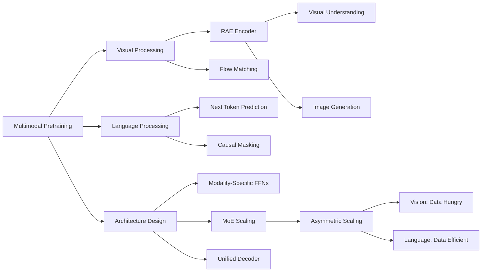

---
tags:
  - paper
  - World_Model
  - Diffusion_Model
  - Embodied_AI
  - Sim2Real
  - Foundation_Model
  - LLM
aliases:
  - "Beyond Language Modeling: An Exploration of Multimodal Pretraining"
url: http://arxiv.org/abs/2603.03276v1
pdf_url: https://arxiv.org/pdf/2603.03276v1
local_pdf: "[[Beyond Language Modeling An Exploration of Multimodal Pretraining.pdf]]"
github: "None"
project_page: "https://beyond-llms.github.io/"
institutions:
  - "FAIR, Meta"
  - "New York University"
publication_date: "2026-03-03"
score: 8
---

# Beyond Language Modeling: An Exploration of Multimodal Pretraining

## 📌 Abstract
The visual world offers a critical axis for advancing foundation models beyond language. Despite growing interest in this direction, the design space for native multimodal models remains opaque. We provide empirical clarity through controlled, from-scratch pretraining experiments, isolating the factors that govern multimodal pretraining without interference from language pretraining. We adopt the Transfusion framework, using next-token prediction for language and diffusion for vision, to train on diverse data including text, video, image-text pairs, and even action-conditioned video. Our experiments yield four key insights: (i) Representation Autoencoder (RAE) provides an optimal unified visual representation by excelling at both visual understanding and generation; (ii) visual and language data are complementary and yield synergy for downstream capabilities; (iii) unified multimodal pretraining leads naturally to world modeling, with capabilities emerging from general training; and (iv) Mixture-of-Experts (MoE) enables efficient and effective multimodal scaling while naturally inducing modality specialization. Through IsoFLOP analysis, we compute scaling laws for both modalities and uncover a scaling asymmetry: vision is significantly more data-hungry than language. We demonstrate that the MoE architecture harmonizes this scaling asymmetry by providing the high model capacity required by language while accommodating the data-intensive nature of vision, paving the way for truly unified multimodal models.

## 🖼️ Architecture
![[Beyond Language Modeling An Exploration of Multimodal Pretraining_arch.png]]
*Figure 1: Overview of our study. Top: High-level model architecture. We train a single autoregressive model with next-token prediction for text and next-visual state prediction with flow matching. Bottom: We study five axes: visual representations, data, world modeling, architecture, and scaling.*

## 🧠 AI Analysis (Doubao Seed 2.0 Pro)

# 🚀 Deep Analysis Report: Beyond Language Modeling: An Exploration of Multimodal Pretraining

## 📊 Academic Quality & Innovation
1. **Core Snapshot**
- **Problem Statement**: The field lacks empirical understanding of how vision and language interact in multimodal pretraining, with current approaches relying heavily on pretrained language models that confound analysis.
- **Core Contribution**: Development of a unified multimodal pretraining framework that reveals fundamental scaling relationships between vision and language while achieving strong performance through a Mixture-of-Experts architecture.
- **Academic Rating**: 
  - Innovation: 8/10 - Novel experimental framework and discovery of vision-language scaling asymmetry
  - Rigor: 9/10 - Comprehensive ablation studies, controlled experiments, and mathematical formalization

2. **Technical Decomposition**
- **Methodology**:
  - Language Loss: $\mathcal{L}_{LM} = -\sum_{i=1}^n \log p_\theta(x_i | x_{<i})$
  - Flow Matching Loss: $\mathcal{L}_{flow} = \mathbb{E}_{z,\epsilon}[\|v_\theta(z_t,t,\epsilon)-(z_0-\epsilon)\|^2]$
  - Combined Loss: $\mathcal{L} = \lambda_{LM}\mathcal{L}_{LM} + \lambda_{flow}\mathcal{L}_{flow}$

- **Architecture**:
  - Unified decoder-only backbone based on Transfusion
  - Modality-specific FFNs for text and vision
  - RAE (SigLiP 2) as the visual encoder
  - Mixture-of-Experts for efficient scaling

- **Aha Moment**:
  1. Discovery that vision is significantly more data-hungry than language
  2. Use of RAE for both understanding and generation tasks, eliminating need for dual representations

3. **Evidence & Metrics**
- **Benchmarks**: DCLM PPL, DPGBench, GenEval, VQA
- **Baselines**: Text-only models, VAEs, semantic encoders
- **Key Results**:
  - RAE outperforms VAEs by 5-10% on both generation and understanding tasks
  - Multimodal training matches text-only performance while enabling visual capabilities
  - MoE architecture reduces compute requirements while maintaining performance

4. **Critical Assessment**
- **Hidden Limitations**:
  - Requires large compute resources for training
  - Performance gap between raw pixels and semantic encoders remains
  - May not scale well to very long sequences due to attention complexity

- **Engineering Hurdles**:
  - Complex implementation of flow matching
  - Careful tuning needed for loss weights
  - MoE routing requires sophisticated load balancing

5. **Next Steps**
1. Investigate more efficient visual representations that maintain performance while reducing compute requirements
2. Develop adaptive routing strategies for MoE that automatically balance modality-specific compute needs
3. Extend the framework to handle structured data types beyond vision and language (e.g., audio, graphs)

The paper presents a significant advance in understanding multimodal pretraining dynamics while providing practical architectural insights. The rigorous experimental methodology and comprehensive analysis make it a valuable contribution to the field.

## 🔗 Knowledge Graph & Connections
**Task 1: Knowledge Connections**

1. [[World_Action_Models_are_Zero_shot_Policies]] - Strong connection in how both papers address world modeling capabilities emerging from multimodal pretraining. This paper's findings about vision-language scaling dynamics could explain why world models require extensive visual data.

2. [[GeometryAware_Rotary_Position_Embedding_for_Consistent_Video_World_Model]] - Related through the use of flow-based techniques for visual representations, though this paper takes a different approach with RAE and diffusion.

3. [[MALLVI]] - Complementary work on multimodal architectures, though MALLVI focuses more on alignment while this paper emphasizes scaling relationships and modality-specific compute requirements.

**Task 2: Mermaid Knowledge Graph**

**Task 3: Future Directions**

1. **Adaptive Visual Tokenization**
- Research Problem: Current fixed visual tokenization may be suboptimal for different tasks
- Approach: Develop learnable tokenization strategies that adapt to content and task
- Potential Impact: Could reduce computational requirements while maintaining performance
- Key Challenge: Ensuring differentiability and training stability

2. **Cross-Modal Transfer Learning**
- Research Problem: How to leverage learned scaling relationships for efficient transfer
- Approach: Design targeted pretraining strategies based on modality-specific data requirements
- Potential Impact: More efficient multimodal models with reduced training costs
- Key Challenge: Quantifying and optimizing transfer efficiency

3. **Dynamic MoE Routing for Multimodal Learning**
- Research Problem: Current MoE architectures use fixed routing patterns
- Approach: Develop content-adaptive routing strategies that consider modality-specific needs
- Potential Impact: Better compute utilization and improved scaling properties
- Key Challenge: Balancing routing complexity with performance gains

These directions build on the paper's core findings about modality-specific scaling and architectural requirements while addressing practical limitations in current approaches.

---
*Analysis performed by PaperBrain-Doubao (Vision-Enabled)*

## 📂 Resources
- **Local PDF**: [[Beyond Language Modeling An Exploration of Multimodal Pretraining.pdf]]
- [Online PDF](https://arxiv.org/pdf/2603.03276v1)
- [ArXiv Link](http://arxiv.org/abs/2603.03276v1)

## 🔗 Related Work Updates
- [ ] **2026-03-04**: New paper [[Beyond Language Modeling]] discusses *beyond language modeling: an exploration of multimodal pretraining*. Innovation: "The paper introduces a unified Transfusion-based architecture that treats vision as a generative task via diffusion and language as a next-token prediction task, demonstrating that world modeling emerges naturally from this multimodal pretraining."