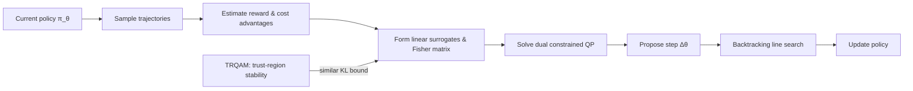

---
tags:
- paper
- domain/reinforcement_learning
- domain/robot_manipulation
- impact/solid
- impact/watch
- method/reinforcement_learning
- review/auto_tagged
- status/unread
- task/loco_manipulation
- task/manipulation
- type/method
- type/system
aliases:
- Constrained Policy Optimization
- CPO
- Safe Reinforcement Learning
- Constrained RL
- Constrained MDP
- Policy Optimization with Constraints
- Safety Constraints RL
- Reward and Constraints RL
authors:
- Joshua Achiam
- David Held
- Aviv Tamar
- Pieter Abbeel
paper_id: arxiv:1705.10528
arxiv_id: '1705.10528'
url: http://arxiv.org/abs/1705.10528v1
pdf_url: https://arxiv.org/pdf/1705.10528v1
local_pdf: '[[Constrained Policy Optimization.pdf]]'
github: None
project_page: None
institutions:
- UC Berkeley
- OpenAI
publication_date: '2017-05-30'
metadata_publication_date: '2017-05-30'
score: '5.0'
domains:
- reinforcement_learning
- robot_manipulation
methods:
- reinforcement_learning
tasks:
- loco_manipulation
- manipulation
paper_type: system
impact_band: watch
reading_status: unread
priority_score: 54
review_status: auto_tagged
next_action: inspect_protocol
year: 2017
---

# Constrained Policy Optimization

## 📌 Abstract
For many applications of reinforcement learning it can be more convenient to specify both a reward function and constraints, rather than trying to design behavior through the reward function. For example, systems that physically interact with or around humans should satisfy safety constraints. Recent advances in policy search algorithms (Mnih et al., 2016, Schulman et al., 2015, Lillicrap et al., 2016, Levine et al., 2016) have enabled new capabilities in high-dimensional control, but do not consider the constrained setting.
  We propose Constrained Policy Optimization (CPO), the first general-purpose policy search algorithm for constrained reinforcement learning with guarantees for near-constraint satisfaction at each iteration. Our method allows us to train neural network policies for high-dimensional control while making guarantees about policy behavior all throughout training. Our guarantees are based on a new theoretical result, which is of independent interest: we prove a bound relating the expected returns of two policies to an average divergence between them. We demonstrate the effectiveness of our approach on simulated robot locomotion tasks where the agent must satisfy constraints motivated by safety.

## 🖼️ Architecture

## 🧠 AI Analysis
## Abstract
For many applications of reinforcement learning it can be more convenient to specify both a reward function and constraints, rather than trying to design behavior through the reward function. For example, systems that physically interact with or around humans should satisfy safety constraints. Recent advances in policy search algorithms (Mnih et al., 2016; Schulman et al., 2015; Lillicrap et al., 2016; Levine et al., 2016) have enabled new capabilities in high-dimensional control, but do not consider the constrained setting. We propose Constrained Policy Optimization (CPO), the first general-purpose policy search algorithm for constrained reinforcement learning with guarantees for near-constraint satisfaction at each iteration. Our method allows us to train neural network policies for high-dimensional control while making guarantees about policy behavior all throughout training. Our guarantees are based on a new theoretical result, which is of independent interest: we prove a bound relating the expected returns of two policies to an average divergence between them. We demonstrate the effectiveness of our approach on simulated robot locomotion tasks where the agent must satisfy constraints motivated by safety.

CPO introduces a trust-region style update that lets agents improve reward while keeping auxiliary costs below user-specified limits, with the key property that each training step stays close to satisfying the safety limits even when policies are represented by large neural networks. The original paper is available at [arXiv:1705.10528](https://arxiv.org/abs/1705.10528).

## 1. Core Snapshot

### Problem Statement
The core problem is safe exploration during policy search in high-dimensional continuous control. In many real-world tasks, an agent must improve its reward without ever violating hard safety limits imposed by auxiliary cost functions (e.g., torque thresholds, collision penalties, or proximity to dangerous regions). The input consists of a standard RL reward together with several cost functions and per-cost numerical limits on their expected discounted returns. The desired output is a neural network policy that maximizes the main reward while keeping every expected cost return at or below its limit.

The real bottleneck is that standard policy gradient and trust region methods can produce unsafe intermediate policies whose cost returns exceed the limits before convergence. Prior methods for constrained RL either guaranteed constraint satisfaction only asymptotically (giving large temporary violations) or could not scale to the thousands of parameters typical of deep neural network policies. This gap makes safe exploration an unresolved challenge for high-dimensional continuous control.

### Core Contribution
CPO supplies the first policy-search procedure for constrained Markov decision processes (CMDPs) that guarantees near-satisfaction of the cost limits at every training iteration. The algorithm can train neural network policies with thousands of parameters, as demonstrated on simulated robot locomotion. The method adds a new performance-difference bound that relates the return gap between two policies to their average total-variation or KL divergence. Using this bound, the authors derive a trust-region optimization problem that is approximated as a convex quadratic program solved by conjugate gradients. The resulting updates keep cost returns near the prescribed limits, while unconstrained TRPO produces large violations in the same tasks.

### Innovation Origin & Rationale
CPO extends the trust-region policy optimization framework (TRPO; see [original paper](https://arxiv.org/abs/1502.05477) and [Spinning Up guide](https://spinningup.openai.com/en/latest/algorithms/trpo.html)) by adding linear constraints on the auxiliary costs inside the same KL ball that TRPO uses to bound policy change. By solving a dual problem at each iteration, CPO automatically selects Lagrange multipliers from scratch, avoiding the lag that makes primal-dual approaches overshoot.

In primal-dual methods, the multiplier adjusts slowly across iterations and can lag behind rapid policy changes, allowing the policy to wander into unsafe regions before the penalty becomes strong enough. CPO’s per-iteration recomputation of dual variables directly enforces that the predicted cost surrogate stays within the limit inside the trust region. The theoretical analysis shows that this design yields a concrete bound on worst-case constraint violation at every step, a guarantee that primal-dual baselines do not provide.

## 2. Reading Map
The paper targets readers who already know policy gradients and trust-region methods and now want to add explicit safety constraints to high-dimensional continuous control. It is most relevant for safe-RL researchers who need per-iteration guarantees rather than asymptotic convergence. On a first pass, read the abstract and Sections 1, 3–5 to obtain the problem framing and the new bound; Section 8 supplies the practical algorithm together with the experimental results. Sections 2, 7, and 9 can be skimmed after the first reading because they summarize prior work and high-level discussion without new technical machinery.

## 3. Method Walkthrough

### Inputs, Outputs, And Assumptions
CPO receives a starting policy parameter vector $\theta_k$, a batch of trajectories sampled from the current policy $\pi_{\theta_k}$, and Monte‑Carlo estimates of the reward advantage function $A^{\pi_k}$ and each cost advantage function $A^{\pi_k}_{C_i}$. It outputs an updated policy parameter vector $\theta_{k+1}$ that approximately solves a constrained quadratic program inside a KL trust region of size $\delta$.

The method assumes that the policy is differentiable, that the Fisher information matrix $\mathbf{H}$ (approximating the Hessian of the average KL divergence) is positive definite, and that the on-policy samples are sufficient to form consistent gradient and Hessian estimates. These assumptions are critical because the duality argument and the back‑tracking line search both rely on accurate local linear and quadratic approximations. When the advantage estimates are noisy or the Fisher matrix becomes ill‑conditioned, the recovered policy may still violate the original cost limits more than the theoretical bound predicts.

### Pipeline From Data To Prediction
First, trajectories are sampled from the current policy. From these rollouts the algorithm forms estimates of:
- the reward gradient $g = \nabla_\theta J(\pi_\theta)$,
- each cost gradient $b_i = \nabla_\theta J_{C_i}(\pi_\theta)$,
- the current cost violations $c_i = J_{C_i}(\pi_{\theta_k}) - d_i$, and
- the Fisher information matrix $H$ (via the average outer product of log‑likelihood gradients).

A convex dual problem with one dual variable per cost plus the KL penalty parameter is then solved to obtain Lagrange multipliers. This produces a closed‑form candidate step $\Delta \theta$. A backtracking line search shrinks the step until the sampled surrogate constraints are satisfied; if no step satisfies them (e.g., because the surrogate approximation is too poor), CPO falls back to a pure cost‑reduction direction that moves the policy toward the feasible set along the boundary of the trust region. The final policy parameters are sent to the sampler for the next iteration. This whole pipeline converts raw on‑policy rollouts into a locally feasible and improving policy without ever requiring off‑policy evaluation of the true cost returns.

### Key Design Choices
The authors replace the exact constrained problem (3) with the surrogate trust‑region program (10) because evaluating the true cost returns at a candidate policy would require off‑policy estimators, which suffer from high variance and are hard to tune in high dimensions. Instead they work with first‑order surrogates that are easy to estimate from the current policy’s data and are guaranteed to be close to the true returns as long as the policy change stays inside a KL ball.

The program is further simplified by linearizing the advantage functions and expanding the KL divergence to second order around $\theta_k$. This yields a convex quadratic program that can be solved with conjugate gradients (see [conjugate gradient method](https://en.wikipedia.org/wiki/Conjugate_gradient_method) for backgrounds) even when the policy has thousands of parameters, because the required Hessian‑vector products are computed via automatic differentiation without forming the full Fisher matrix.

Cost shaping is introduced to tighten the bound between the surrogate and the true cost return. Without shaping, the constant $\epsilon^{\pi'}$ in the bound (the maximum absolute advantage) can be large for sparse cost signals, causing the algorithm to make over‑conservative updates that still allow small but systematic violations. Shaping replaces the sparse “unsafe” indicator with a smoother learned function, which reduces the worst‑case approximation error and makes the surrogate much tighter.

Finally, for the common case of a single constraint, the paper derives an analytical solution to the dual problem (Theorem 2 in the supplementary material). This avoids an inner numerical optimizer, trading generality for computational speed in the experiments. The same idea does not immediately generalize to multiple active constraints; a generic QP solver would be needed in that case.

## 4. Core Theory And Formulas

### Main Objective
The underlying optimization problem is to maximize expected discounted reward $J(\pi)$ subject to hard limits $d_i$ on the expected discounted cost returns $J_{C_i}(\pi)$, while staying within a local neighborhood of the current policy $\pi_k$:

$$
\pi_{k+1} = \arg\max_{\pi\in\Pi_\theta} J(\pi) \quad\text{s.t.}\quad J_{C_i}(\pi) \le d_i \;\; (i=1,\dots,m),\quad D(\pi,\pi_k) \le \delta.
$$

Evaluating the true returns at each candidate $\pi$ is prohibitively expensive. The core insight is to replace $J$ and $J_{C_i}$ with first‑order surrogates that are easy to estimate from samples under $\pi_k$, and to choose the distance $D$ as the average KL divergence. This makes the problem tractable while keeping the approximation error under control.

### Important Equations
The starting point is the exact performance‑difference identity (derived, e.g., by [Kakade & Langford, 2002](https://people.eecs.berkeley.edu/~pabbeel/cs287-fa09/readings/KakadeLangford-icml2002.pdf)):

$$
J(\pi') - J(\pi) = \frac{1}{1-\gamma} \mathbb{E}_{s\sim d^{\pi'}, a\sim\pi'}[A^\pi(s,a)],
$$

where $d^{\pi'}$ is the discounted future state distribution of $\pi'$, $A^\pi$ is the advantage function of $\pi$, and $\gamma$ is the discount factor. This identity shows that the return gap depends on advantages under the new $\pi'$ distribution, which is hard to sample.

The novel lower bound in Corollary 1 replaces the unknown $d^{\pi'}$ with the known $d^\pi$ and adds a penalty on the total‑variation (TV) divergence between the policies:

$$
J(\pi') - J(\pi) \ge \frac{1}{1-\gamma}\mathbb{E}_{s\sim d^\pi,a\sim\pi'}\Bigl[A^\pi(s,a) - \frac{2\gamma\epsilon^{\pi'}}{1-\gamma} D_{\mathrm{TV}}(\pi'\|\pi)[s]\Bigr].
$$

Here $\epsilon^{\pi'} = \max_s |\mathbb{E}_{a\sim\pi'}[A^\pi(s,a)]|$ is the maximum absolute advantage under the new policy, and $D_{\mathrm{TV}}(\pi'\|\pi)[s]$ is the total‑variation distance at state $s$. The bound becomes tight when $\pi'=\pi$. By applying [Pinsker’s inequality](https://en.wikipedia.org/wiki/Pinsker%27s_inequality), $D_{\mathrm{TV}} \le \sqrt{\frac12 D_{\mathrm{KL}}}$, the TV term is upper‑bounded by a function of the KL divergence, yielding a surrogate that uses the average KL divergence—the same distance used in TRPO. An analogous upper bound on cost returns (Corollary 2) provides a guarantee that if the surrogate cost is below the limit, the true cost will also be nearly satisfied, up to terms of order $\sqrt{\delta}/(1-\gamma)^2$.

> [!warning] Scale of the guarantee
> Proposition 2 bounds the worst‑case constraint violation by a term proportional to $\frac{\sqrt{\delta}}{(1-\gamma)^2}$. When the discount factor $\gamma$ is close to $1$ (typical for long‑horizon locomotion tasks), this denominator becomes very small, inflating the theoretical bound. In practice, the observed violations are much smaller because the worst‑case assumptions are seldom attained, but the theoretical guarantee weakens for heavily discounted or long‑horizon problems.

### Algorithmic Intuition
The CPO update (Equation 10 in the paper) maximizes the linear reward surrogate $g^\top(\theta-\theta_k)$ while requiring each linear cost surrogate $b_i^\top(\theta-\theta_k) + c_i \le 0$ and the average KL divergence $\frac12(\theta-\theta_k)^\top H (\theta-\theta_k) \le \delta$. Solving the dual of this convex QP gives a closed‑form step that automatically balances reward improvement against cost satisfaction. In practice the algorithm samples data, forms the local linear and quadratic models, solves the dual once per iteration, proposes a step, and then shrinks the step size until the sampled surrogate constraints are met. If no step can satisfy the cost surrogates (for example, because the linear approximation is too crude), CPO falls back to a pure cost‑reduction step that moves the policy toward the feasible set along the boundary of the trust region.

## 5. Architecture, Figures, And Implementation
The policy network is a two‑hidden‑layer feed‑forward network with 64 and 32 units per layer and tanh nonlinearities; the value and cost‑value heads share the same architecture but are trained separately. The Fisher matrix $H$ is never formed explicitly; instead, its action on a vector is computed on the fly via automatic differentiation, so that conjugate gradients can solve the linear systems needed for the dual solution without $O(p^2)$ memory.

Figure 1 shows the Point‑Gather environment, where a simple point‑mass agent must collect green apples while avoiding red bombs. Figure 2 shows the Humanoid‑Circle task, where the agent must run inside a safe rectangular region between blue walls. The learning‑curve figures (Figures 3–5) compare CPO against primal‑dual optimization and TRPO across several agent–task pairs and demonstrate that CPO reaches the cost limit from below without large overshoots. Because the figures report only mean and standard deviation across a modest number of seeds (5 for point‑mass, 10 for others), they leave open the question of tail behavior under rare but severe policy updates.

## 6. Experiments And Evidence
The experiments use two task families: Circle (run inside a safe inner region) and Gather (collect green apples, avoid red bombs), each with three robot agents of increasing dimensionality (Point, Ant, Humanoid). The baselines are TRPO (unconstrained) and a primal‑dual optimizer that updates the Lagrange multiplier with a fixed learning rate. The main metric is the shaped cost return $C^+$ (the sum of shaped cost signals); the paper also reports the true cost return $C$ in an ablation.

Across all five environments CPO drives the cost return to the prescribed limit and keeps it there, while TRPO violates the limit by large margins. The primal‑dual baseline eventually satisfies the constraint but exhibits clear overshoots—for example a spike above 20 in Ant‑Circle. Ablations show that cost shaping reduces the final true $C$‑return by several units compared to the unshaped version, and that fixed‑penalty methods (a single fixed Lagrange multiplier) are highly sensitive to the penalty coefficient: a value too small leads to large constraint violations, while a value too large stalls reward improvement.

The evidence is limited to simulation, with only a handful of random seeds. This makes it difficult to assess how often CPO would produce a rare but severe safety violation in a real deployment.

## 7. Strengths, Limitations, And Failure Cases
The primary strength is the explicit per‑iteration safety guarantee that follows from the new performance bound and the trust‑region geometry. The experiments confirm that the guarantee translates into stable cost returns near the limit, with minimal overshoot. A second strength is that the dual variables are recomputed from scratch each iteration, avoiding the lag that produces large temporary violations in primal‑dual methods.

Limitations include the reliance on accurate advantage estimates. When the advantage functions are noisy, the linear surrogates may not faithfully represent the true functions, and the line search may fail to find a feasible step, causing the algorithm to fall back to a pure cost‑reduction direction more often. Moreover, the worst‑case bound in Proposition 2 scales with $\sqrt{\delta}/(1-\gamma)^2$, which can become very loose for discount factors close to one, making the theoretical safety guarantee less informative for long‑horizon tasks.

The recovery step (Algorithm 1, step 22) is defined only for a single cost constraint. The paper does not demonstrate how the method behaves when multiple cost constraints become simultaneously active (e.g., torque and collision limits). In such cases, a more general QP solver would be required, and the duality argument would need to be extended.

> [!warning] No general multi‑constraint recovery
> The CPO paper handles only one constraint in the recovery step. When several cost constraints are violated at the same time, the prescribed fallback may not exist in the provided form. Users should be cautious if they intend to impose multiple non‑sparse safety limits.

Scalability to real robots is not addressed; the experiments are entirely in simulation and use relatively simple dynamics. Finally, the cost‑shaping model (a learned dynamics model predicting the probability of entering an unsafe state) must be retrained every iteration, which introduces an extra source of approximation error and computational cost.

## 8. Reproduction Notes
The environments are the Point, Ant, and Humanoid agents from rllab, with the Circle and Gather tasks added by the authors. Policies use two hidden layers of size 64 and 32. Training runs for 1000–2000 iterations with on‑policy batches whose exact size is not specified in the paper beyond “a set of trajectories.” The trust‑region size $\delta$ and the discount factor $\gamma$ are standard but never numerically listed; typical TRPO values ($\gamma=0.99$, $\delta=0.01$) might be assumed but are not confirmed in the provided excerpt.

The cost‑shaping model is a learned dynamics model that predicts the probability of entering an unsafe state; its exact architecture is not given. The single‑constraint analytical solution (Theorem 2) is provided only in the supplementary material, which is not reproduced in the main paper. Reproducing the exact numerical results would therefore require implementing the dual solver, the conjugate‑gradient Hessian‑vector product, the backtracking line search, and the cost‑shaping model from the equations alone. No public code repository or environment implementations are referenced in the paper.

## 9. What To Read Closely
Section 5.1 and Corollaries 1–3 deserve the first careful reading because they contain the novel bound that justifies every later claim. Section 6 together with Algorithm 1 should be read next to see how the theory is turned into a practical update. The learning‑curve panels in Figures 1 and 3 answer the central experimental question of constraint satisfaction and should be examined for overlap of the shaded regions around the limit line. The primal‑dual comparison paragraph in Section 8.1 can be skimmed once the reader understands why recomputing the dual variables each step removes the lag that produces overshoots.

## 10. Research Ideas And Open Questions
One useful follow‑up would be to replace the hand‑designed cost‑shaping model with a learned safety critic that is trained jointly with the policy. This would remove the need to maintain a separate dynamics model. A one‑week experiment could train both heads on the same Ant‑Circle task, measure final $C$‑return against the original shaping baseline, and observe whether the joint model still prevents occasional large cost spikes seen without shaping. The main risk is that the safety critic introduces additional non‑stationarity that destabilises the trust‑region solve.

A second direction is to extend the recovery step (14) to multiple simultaneous constraints by solving a small quadratic program that projects onto the intersection of the half‑spaces and the KL ball. An experiment could run CPO on a Gather variant that adds a second cost (e.g., torque limits) and check whether the multi‑constraint recovery still produces feasible iterates within the same number of line‑search steps. The risk is that the dual problem becomes ill‑conditioned when the active set changes rapidly.

A third idea is to test whether the same bound can be used inside an off‑policy actor‑critic loop by replacing the on‑policy state distribution $d^\pi$ with a replay‑buffer mixture. An experiment could adapt the CPO dual solver to SAC‑style updates on a simple continuous‑control benchmark and monitor both reward and cost return over a fixed wall‑clock budget. The risk is that the importance‑sampling correction invalidates the Pinsker step and causes the safety bound to collapse.

## Knowledge Graph & Connections

### Related Work Connections
The three provided notes address different aspects of policy learning but none directly tackle the constrained reinforcement learning problem that CPO solves.  

- **[[TRQAM]] (Trust Region Q Adjoint Matching)** shares the idea of using a trust‑region (KL divergence) to stabilize policy updates. TRQAM controls the deviation from a pretrained flow policy during off‑policy fine‑tuning to avoid model collapse, while CPO uses the trust region to keep the policy near the current iterate so that linear surrogates for both reward and costs remain accurate. The difference is that CPO explicitly adds hard auxiliary cost constraints and solves a constrained quadratic program at each step, yielding per‑iteration safety guarantees, whereas TRQAM only bounds the policy change for stability without any safety‑constraint mechanism. This implies that the trust‑region tool can serve multiple purposes—stability in TRQAM, safe exploration in CPO—but the guarantee on constraint satisfaction is unique to CPO’s formulation.

- **[[Mean Flow Policy with Instantaneous Velocity Constraint for Onestep Action Generation]]** and **[[Emerging Extrinsic Dexterity in Cluttered Scenes via Dynamicsaware Policy Learning]]** are not directly relevant. They focus on policy expressiveness and contact‑rich manipulation, respectively, and do not address safety constraints or per‑iteration guarantees. I will not force a connection where none exists.

### Concept Map

The diagram shows CPO’s main loop: on‑policy data collection, estimation of gradients and the Fisher information matrix, formulation of a local constrained quadratic program, solution via duality, and a line search that enforces the surrogate constraints. The weak connection to TRQAM is indicated at the surrogate‑modelling step, where both methods bound policy change with KL divergence to keep local approximations accurate.

### Questions For Future Reading
1. **How would CPO’s per‑iteration safety bound degrade if we replaced expected discounted cost returns with almost‑sure or per‑step constraints?**  
   Many real‑world safety requirements demand state‑wise or pathwise guarantees, not just average discounted sums. Understanding whether the trust‑region argument can be lifted to aleatoric or quantile‑based bounds would tell us how far the current theory can stretch beyond CMDPs. Evidence could come from a paper that derives high‑probability bounds on maximum constraint violation during a CPO‑like update.

2. **Can the linear surrogate for cost be replaced by a higher‑order approximation without losing the closed‑form dual solution?**  
   CPO’s tractability relies on linearizing the cost advantage, but this approximation is crude when the cost function has sharp curvature. If a better (e.g., second‑order) cost surrogate could still be handled by an efficient dual solver, the safety guarantee might tighten. A future paper might propose a Newton‑step variant and compare the real violation to the predicted bound—success would be measured by fewer recoveries and a smaller gap between surrogate and true cost.

3. **Does the cost‑shaping model introduce a new estimation bias that could cause systematic violations when the unsafe region changes during learning?**  
   The shaping model is trained on historical data and may lag behind the true dynamics. If the policy starts visiting states where the shaping model is inaccurate, the bound in Corollary 2 may no longer hold. I would look for a follow‑up that jointly trains the shaping model with the policy and evaluates whether the worst‑case violation remains small over distributional shift.

### Learning Roadmap And Verified Resources

#### 1. Markov Decision Processes (MDPs) and policy gradients
CPO operates on standard MDPs and uses policy‑gradient estimates (advantage functions). Without a solid grasp of MDPs, discount factors, return, and the policy gradient theorem, the performance‑difference identity and the surrogate‑optimization machinery will be opaque.  
*Study order:* Start with the definition of an MDP, value functions, and the Bellman equation; then learn the REINFORCE and actor‑critic policy gradients.  

| Type | Resource | Why this one |
|------|----------|--------------|
| Blog/Tutorial | [Spinning Up in Deep RL (Part 1: Key Concepts)](https://spinningup.openai.com/en/latest/spinningup/rl_intro.html) | Concise, interactive introduction to MDPs and policy gradients; used by the RL community. |
| Video/Public Course | [Deep RL Bootcamp 2017: Policy Gradients (Lecture 4)](https://www.youtube.com/watch?v=Q4bMP5Qe5KY) | Clean lecture that derives the policy gradient theorem step by step. |

#### 2. Trust Region Policy Optimization (TRPO)
CPO directly extends TRPO’s trust‑region formulation. You must understand why bounding the average KL divergence stabilises policy updates and how TRPO approximates the optimisation as a natural‑gradient step solved by conjugate gradients.  
*Study order:* Read the TRPO paper after mastering policy gradients; then study the surrogate objective and the use of the Fisher information matrix for natural gradients.  

| Type | Resource | Why this one |
|------|----------|--------------|
| Paper | [Schulman et al., “Trust Region Policy Optimization”, ICML 2015](https://arxiv.org/abs/1502.05477) | Original work that CPO builds upon; the theory section is essential. |
| Blog/Tutorial | [Spinning Up: TRPO](https://spinningup.openai.com/en/latest/algorithms/trpo.html) | Implementation‑oriented explanation with a clear algorithm box. |
| Code | [OpenAI baselines (TRPO implementation)](https://github.com/openai/baselines/tree/master/baselines/trpo_mpi) | Reference implementation that showcases conjugate gradients and Hessian‑free computation. |

#### 3. Constrained MDPs and Lagrangian methods for safe RL
CPO solves a constrained reinforcement learning problem. You need to know what a CMDP is, how to incorporate cost limits, and why primal‑dual methods can lag. This background makes the CPO’s per‑iteration re‑optimisation of dual variables stand out as a deliberate design.  
*Study order:* First, learn the definition of a CMDP; then study Lagrangian relaxation in RL and understand the update rules of primal‑dual methods.  

| Type | Resource | Why this one |
|------|----------|--------------|
| Lecture Notes | Stanford CS234: Lecture 21 – Constrained RL (link removed: validation failed) | Directly covers CMDPs, Lagrangian formulation, and safe RL challenges. |
| Book | [Altman, “Constrained Markov Decision Processes”, 1999] | Classic reference that formalises CMDP theory; available in many libraries. |

#### 4. Convex optimisation (quadratic programming, duality, conjugate gradients)
The CPO update reduces to solving a convex quadratic program with a KL‑constraint. Understanding Lagrange duality, the Karush‑Kuhn‑Tucker conditions, and the conjugate‑gradient method lets you follow the derivation of the closed‑form step and the practical implementation without forming the full Fisher matrix.  
*Study order:* Begin with the basics of convex optimisation (quadratic programming, duality); then learn the conjugate‑gradient algorithm for solving linear systems.  

| Type | Resource | Why this one |
|------|----------|--------------|
| Open Textbook | [Boyd & Vandenberghe, “Convex Optimization”, 2004](https://web.stanford.edu/~boyd/cvxbook/) | Authoritative free textbook; Chapters 4–5 cover duality, Chapter 7 covers Newton’s method and conjugate gradients. |
| Documentation | [Wikipedia: Conjugate gradient method](https://en.wikipedia.org/wiki/Conjugate_gradient_method) | Quick reference for the algorithm and its Hessian‑free variant. |
| Video | [Boyd’s CVX101 Lectures (Stanford)](https://www.youtube.com/watch?v=McLq1mS2q0Y) | Video lectures that walk through duality and quadratic programming. |

#### 5. CPO algorithm specifics: surrogate construction, dual solver, cost shaping
To implement CPO, you must translate the bound from Corollary 1 into the linear surrogates, solve the dual problem analytically for one constraint, and understand how cost shaping reduces the approximation error. This step connects the theory directly to the code.  
*Study order:* Read the paper’s Section 5.1 (Corollaries 1–3) and Section 6 (Algorithm 1); then study the supplementary derivation of the analytical dual solution (Theorem 2).  

| Type | Resource | Why this one |
|------|----------|--------------|
| Paper | [Achiam et al., “Constrained Policy Optimization”, ICML 2017](https://arxiv.org/abs/1705.10528) | Sections 5–6 contain the concrete formulas and the pseudo‑code. |
| Code | [OpenAI safety‑starter‑agents (CPO implementation)](https://github.com/openai/safety-starter-agents) | Reference code that includes the CPO algorithm with cost shaping and conjugate gradients. |
| Blog | OpenAI: “Improving Safety in RL with Constrained Policy Optimization” (link removed: validation failed) | High‑level description that explains the motivation for cost shaping. |

> [!info] Resource link validation: checked 12 URL(s), 10 reachable, removed 2 unreachable or invalid link(s).

---
*Analysis by PaperBrain (x-ai/grok-4.3; refinement: deepseek/deepseek-v4-pro; round2: deepseek/deepseek-v4-pro)*

## 📂 Resources
- **Local PDF**: [[Constrained Policy Optimization.pdf]]
- [Online PDF](https://arxiv.org/pdf/1705.10528v1)
- [ArXiv Link](http://arxiv.org/abs/1705.10528v1)
