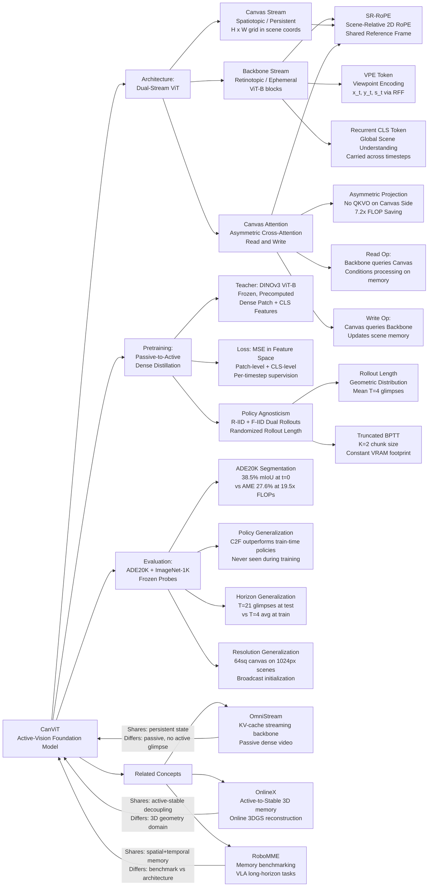

---
tags:
  - paper
  - Embodied_AI
  - Foundation_Model
  - World_Model
aliases:
  - "CanViT: Toward Active-Vision Foundation Models"
url: http://arxiv.org/abs/2603.22570v1
pdf_url: https://arxiv.org/pdf/2603.22570v1
local_pdf: "[[CanViT Toward ActiveVision Foundation Models.pdf]]"
github: "None"
project_page: "None"
institutions:
  - "McGill University"
  - "Mila - Quebec AI Institute"
  - "Université Laval"
publication_date: "Unknown"
score: 8
---

# CanViT: Toward Active-Vision Foundation Models

## 📌 Abstract
Active computer vision promises efficient, biologically plausible perception through sequential, localized glimpses, but lacks scalable general-purpose architectures and pretraining pipelines. As a result, Active-Vision Foundation Models (AVFMs) have remained unexplored. We introduce CanViT, the first task- and policy-agnostic AVFM. CanViT uses scene-relative RoPE to bind a retinotopic Vision Transformer backbone and a spatiotopic scene-wide latent workspace, the canvas. Efficient interaction with this high-capacity working memory is supported by Canvas Attention, a novel asymmetric cross-attention mechanism. We decouple thinking (backbone-level) and memory (canvas-level), eliminating canvas-side self-attention and fully-connected layers to achieve low-latency sequential inference and scalability to large scenes. We propose a label-free active vision pretraining scheme, policy-agnostic passive-to-active dense latent distillation: reconstructing scene-wide DINOv3 embeddings from sequences of low-resolution glimpses with randomized locations, zoom levels, and lengths. We pretrain CanViT-B from a random initialization on 13.2 million ImageNet-21k scenes -- an order of magnitude more than previous active models -- and 1 billion random glimpses, in 166 hours on a single H100. On ADE20K segmentation, a frozen CanViT-B achieves 38.5% mIoU in a single low-resolution glimpse, outperforming the best active model's 27.6% with 19.5x fewer inference FLOPs and no fine-tuning, as well as its FLOP- or input-matched DINOv3 teacher. Given additional glimpses, CanViT-B reaches 45.9% ADE20K mIoU. On ImageNet-1k classification, CanViT-B reaches 81.2% top-1 accuracy with frozen teacher probes. CanViT generalizes to longer rollouts, larger scenes, and new policies. Our work closes the wide gap between passive and active vision on semantic segmentation and demonstrates the potential of AVFMs as a new research axis.

## 🖼️ Architecture
![[CanViT Toward ActiveVision Foundation Models_arch.png]]

## 🧠 AI Analysis

# 🚀 Deep Analysis Report: CanViT: Toward Active-Vision Foundation Models

## 📊 Academic Quality & Innovation
---

## 1. Core Snapshot

### Problem Statement
Active Computer Vision (ACV) models process visual scenes through sequential, localized glimpses rather than full-frame ingestion. Despite theoretical advantages in biological plausibility and computational efficiency, ACV models have historically failed to match the accuracy, flexibility, and representational richness of passive-vision counterparts. The fundamental gap is architectural and pretraining-related: (1) no general-purpose ACV architecture exists that supports spatially-dense prediction tasks across arbitrary glimpse sequences, viewing policies, and scene resolutions; and (2) no scalable, label-free pretraining paradigm has been established for such models. The few ACV models capable of dense prediction (AME, AdaGlimpse) rely on computationally expensive post-hoc expansion mechanisms and achieve only 27.6% mIoU on ADE20K, dramatically trailing passive counterparts like DINOv3.

### Core Contribution
CanViT introduces the first task- and policy-agnostic Active Vision Foundation Model (AVFM), combining a scene-relative RoPE-bound retinotopic ViT backbone with a spatiotopic scene-wide latent workspace (the *canvas*) updated via an asymmetric cross-attention mechanism, pretrained through a passive-to-active dense latent distillation scheme without labels.

### Innovation Origin & Rationale
The core innovation is motivated by three intersecting gaps:

**Gap 1 — Architectural incoherence in prior ACV:** Prior active models either lacked persistent memory (pure retinotopic backbones) or accumulated memory in ways incompatible with dense spatial prediction (e.g., post-hoc MAE-style decoders applied to accumulated glimpse tokens, which scale quadratically with canvas size and cannot maintain a fixed scene coordinate mapping across glimpses with variable positions and zoom levels). CanViT resolves this by decoupling the ephemeral backbone stream (retinotopic, processing only the current glimpse) from a persistent spatiotopic canvas stream that tiles the scene in normalized $[-1,+1]^2$ coordinates, enabling direct token-to-pixel correspondence for dense decoding at any timestep, without re-running expensive self-attention over accumulated glimpse tokens.

**Gap 2 — Symmetry violation in cross-stream interaction:** The canvas must be large (high spatial resolution × high embedding dimensionality $D_\text{can}$) to store rich scene semantics, while the backbone stream must be small (low token count $N_\text{bb}$) to keep self-attention tractable. Standard symmetric cross-attention would impose prohibitive canvas-side projection costs. The asymmetric Canvas Attention design—restricting QKVO projections to the backbone side and applying only LayerNorm and residual addition on the canvas side—is technically justified by the ratio analysis (Eq. 1): for $D_\text{can}=1024$, $N_\text{bb}=71$, the FLOP ratio of symmetric-to-asymmetric is 7.2×, growing further as canvas resolution or glimpse count increases.

**Gap 3 — Label-free pretraining for active perception:** Supervised pretraining requires task-specific labels; RL-based pretraining couples policy learning with perceptual learning, making convergence unstable. Passive-to-active distillation (inspired by Proteus's cross-setting distillation philosophy) provides a scalable label-free signal: DINOv3 ViT-B, pretrained on the same ImageNet-21k scenes, serves as a frozen scene-semantic teacher, and CanViT learns to reconstruct its dense patch features and CLS token from sequences of partial glimpses. This is technically sound because DINOv3 features are spatially grounded, exhibit strong zero-shot transfer to segmentation and depth, and can be precomputed and stored efficiently.

### Academic Rating
- **Innovation: 8/10** — The AVFM concept, asymmetric Canvas Attention, and passive-to-active dense distillation form a coherent and technically non-trivial system. The scene-relative RoPE and asymmetric projection design are principled engineering decisions backed by FLOP analysis. The framework meaningfully advances the ACV field.
- **Rigor: 7.5/10** — Ablations are systematic and cover key design choices. Evaluation spans multiple policies, horizons, and resolutions with frozen weights. However, policy-learning experiments (RL-based action selection) are absent, and the evaluation dataset scope is limited to ADE20K and ImageNet-1K.

---

## 2. Technical Decomposition

### Algorithmic Logic

**Step 1: Scene and Glimpse Formulation**
The scene is defined as a function $\psi_t: [-1,+1]^2 \rightarrow \mathbb{R}^3$ mapping normalized 2D scene coordinates to RGB values. A viewpoint is $v_t = (x_t, y_t, s_t)$ where $(x_t, y_t) \in [-1,+1]^2$ is the crop center and $s_t \in (0,1]$ is the scale (half-side-length). The crop spans $[x_t - s_t, x_t + s_t] \times [y_t - s_t, y_t + s_t]$, covering a fraction $s_t^2$ of the scene's surface area. All glimpses are resized to a fixed $H_g \times W_g$ resolution (128² px for CanViT-B), decoupling information content from spatial coverage.

**Step 2: Dual-Stream Initialization**
At the start of each rollout, the canvas is initialized by broadcasting a single learned patch embedding to fill the full $H \times W$ canvas grid (32×32 for CanViT-B during pretraining). The backbone stream tokens for the current timestep consist of:
- $16^2 = 256$ patch tokens from patchifying the $128^2$ px glimpse at patch size 8px
- 5 register tokens (ephemeral)
- 1 recurrent CLS token ($h_t \in \mathbb{R}^{D_\text{bb}}$, carried across timesteps)
- 1 Viewpoint Encoding (VPE) token encoding $(x_t, y_t, s_t)$

**Step 3: Scene-Relative RoPE (SR-RoPE)**
2D RoPE is computed from the center coordinates of glimpse patches and canvas patches, both expressed in the scene's $[-1,+1]^2$ coordinate system. For glimpse patches, their scene-space positions depend on the current viewpoint and scale; for canvas patches, positions are fixed (uniform tiling of scene space). SR-RoPE is applied in both backbone self-attention and Canvas Attention layers, providing a shared spatial reference frame that binds the retinotopic (backbone) and spatiotopic (canvas) streams. This implicitly encodes relative zoom level: a zoomed-in glimpse's patches cluster tightly in scene space (small inter-patch distances), while a zoomed-out glimpse's patches are spread widely.

**Step 4: Canvas Attention — Read**
At every stride-2 interval of ViT depth blocks, a *Read* operation is executed. Backbone tokens act as queries ($Q$ projected from backbone tokens with LayerNorm and SR-RoPE applied), canvas tokens supply keys and values ($K$, $V$ projected from canvas tokens with LayerNorm and SR-RoPE applied). Scaled Dot Product Attention (SDPA) is computed, and the output is added as a residual to the backbone stream. This conditions backbone processing on accumulated scene memory before further self-attention layers process the glimpse.

**Step 5: Canvas Attention — Write**
Following the subsequent ViT blocks, a *Write* operation is executed. Canvas tokens act as queries (only LayerNorm applied; no QKVO projections), backbone tokens supply keys and values (LN + SR-RoPE applied). The SDPA output is added as a residual directly to the canvas token values. Crucially, no MLP, self-attention, QKVO projections, or GRU/LSTM gates are applied to the canvas tokens at any point. Canvas evolution is solely a function of Write residuals injected from the backbone.

**Step 6: Asymmetric Projection Analysis**
The FLOP ratio of canvas-side projections to the SDPA operation is:
$$\frac{\text{projection FLOPs}}{\text{SDPA FLOPs}} = \frac{2N_\text{can} D_\text{can} d}{4 N_\text{bb} N_\text{can} d} = \frac{D_\text{can}}{2N_\text{bb}}$$
For $D_\text{can}=1024$, $N_\text{bb}=71$: ratio $\approx 7.2\times$. This justifies eliminating canvas-side projections entirely.

**Step 7: Decoding**
At each timestep $t$, canvas patches $C_t \in \mathbb{R}^{H \times W \times D_\text{can}}$ and CLS token $h_t \in \mathbb{R}^{D_\text{bb}}$ are decoded into DINOv3 feature space via linear projections:
$$\hat{Z}_t = W_\text{spatial} \cdot \text{LayerNorm}(C_t), \quad \hat{z}_t = W_\text{global} \cdot \text{LayerNorm}(h_t)$$
where $W_\text{spatial}$ projects canvas patches and $W_\text{global}$ projects the CLS token.

**Step 8: Passive-to-Active Dense Distillation Loss**
The reconstruction targets are $Z^* \in \mathbb{R}^{H \times W \times D_\text{teach}}$ (DINOv3 patch features, per-position z-score standardized) and $z^* \in \mathbb{R}^{D_\text{teach}}$ (DINOv3 CLS token). The loss is:
$$\mathcal{L} = \frac{1}{T} \sum_{t=0}^{T-1} \left[ \frac{1}{HW} \|\hat{Z}_t - Z^*\|_F^2 + \|\hat{z}_t - z^*\|^2 \right]$$
where $T$ is the rollout length, $\|\cdot\|_F$ is Frobenius norm, and both patch-level and global tokens are supervised at every timestep. The per-timestep credit assignment allows BPTT over only $K=2$ glimpse chunks (truncated BPTT), keeping memory tractable while still building sequence understanding.

**Step 9: Policy Agnosticism via Rollout Randomization**
Two training branches run simultaneously:
- **R-IID branch:** All viewpoints including $t=0$ sampled i.i.d. from $\mathcal{U}([L_\min^2, L_\max^2])$ for scale and uniform valid center box for position.
- **F-IID branch:** $t=0$ viewpoint is always the full scene $(x,y,s)=(0,0,1)$; subsequent timesteps are R-IID.

Rollout length is randomized by stopping with probability $p_\text{stop}=0.5$ at each chunk boundary, yielding a geometric distribution with mean $T=K/p_\text{stop}=4$ glimpses.

### Mathematical Formulation

| Symbol | Definition |
|---|---|
| $\psi_t$ | Scene function mapping $[-1,+1]^2$ to RGB |
| $v_t = (x_t, y_t, s_t)$ | Viewpoint at timestep $t$: center and scale |
| $C_t \in \mathbb{R}^{H \times W \times D_\text{can}}$ | Canvas tokens at timestep $t$ |
| $h_t \in \mathbb{R}^{D_\text{bb}}$ | Recurrent CLS token |
| $Z^* \in \mathbb{R}^{H \times W \times D_\text{teach}}$ | DINOv3 teacher patch features (z-score standardized) |
| $z^* \in \mathbb{R}^{D_\text{teach}}$ | DINOv3 teacher CLS token |
| $\hat{Z}_t, \hat{z}_t$ | Canvas/CLS reconstructions in teacher space |
| $W_\text{spatial}, W_\text{global}$ | Linear decoders (token-wise) |
| $N_\text{can}, N_\text{bb}, D_\text{can}, d$ | Token counts and dimensions for canvas/backbone streams |
| $T$ | Rollout length (randomized during pretraining) |
| $K$ | Chunk size for truncated BPTT |

**Physical meaning of loss (Eq. 3):** Minimizing $\|\hat{Z}_t - Z^*\|_F^2$ forces the canvas to accumulate spatially grounded scene semantics across glimpse sequences, enabling it to extrapolate to unobserved regions. Minimizing $\|\hat{z}_t - z^*\|^2$ forces global scene understanding into the CLS token.

### Tensor Flow & Architecture

```
Input scene ψ_t → crop at viewpoint v_t → Glimpse [B, 3, 128, 128]
  → Patchify (patch size 8px) → [B, 256, D_bb]   (patch tokens)
  → Concat [registers(5), CLS(1), VPE(1)] → [B, 263, D_bb]  (backbone stream)

Canvas: [B, H×W, D_can] = [B, 1024, 1024]  (32×32 grid, broadcast-initialized)

Per stride-2 ViT block depth:
  Read:  Q from backbone [B, 263, D_bb] → project → [B, 263, d_head]
         K,V from canvas [B, 1024, D_can] → project → [B, 1024, d_head]
         SDPA → [B, 263, d_head] → residual → backbone
  [2 ViT Blocks (self-attn + MLP on backbone)]
  Write: Q = canvas [B, 1024, D_can] (no projection, only LN)
          K,V from backbone → project → [B, 263, d_head]
          SDPA → [B, 1024, d_head] → residual → canvas

Decoding:
  Canvas [B, 1024, 1024] → LN → W_spatial → [B, 1024, D_teach]  = Ẑ_t
  CLS [B, D_bb] → LN → W_global → [B, D_teach]  = ẑ_t

Loss vs. DINOv3 teacher targets Z* [B, 1024, D_teach], z* [B, D_teach]
```

Key architectural specifics:
- **ViT backbone**: ViT-B/8 (for 128² glimpses, 16² patches at patch size 8px).
- **Canvas size**: 32×32 during pretraining, broadcastable to larger sizes at inference.
- **Canvas dimension $D_\text{can}$**: 1024 (matching DINOv3 teacher feature dimensionality).
- **Read/Write stride**: Every 2 ViT blocks (Canvas Attention interleaved throughout ViT depth).
- **No MLP, no self-attention, no QKVO on canvas side**: Canvas is update-only via Write residuals.
- **VPE token**: Encodes $(x/s, y/s, \log s)$ via Random Fourier Features + LayerNorm.

### Innovation Logic

| Aspect | Prior Methods | CanViT |
|---|---|---|
| Dense prediction | AME/AdaGlimpse: post-hoc MAE decoder over all glimpse tokens, O(N_glimpse²) | Canvas: fixed $H×W$ spatial grid, O(N_bb × N_can) cross-attention, constant w.r.t. sequence length |
| Memory update | RNN gates (GRU/LSTM) on state tokens | Asymmetric cross-attention Write; no parameters applied to canvas tokens |
| Positional encoding | Absolute or relative PE within glimpse | Scene-relative RoPE in $[-1,+1]^2$ space, shared by backbone and canvas |
| Pretraining signal | RL rewards, pixel reconstruction (MAE), or supervised labels | Dense latent distillation from frozen DINOv3 teacher in feature space |
| Canvas-side compute | Full QKVO projections in Perceiver/RIN | Eliminated; only LN + residual on canvas side (7.2× FLOP savings per Canvas Attention op) |

---

## 3. Evidence & Metrics

### Benchmark & Baselines

**ADE20K-SceneParse150 Semantic Segmentation**: Linear probe on frozen canvas tokens evaluated against:
- AME (SETR-based, state-of-the-art active vision segmentation): peak 27.6% mIoU at 309 GFLOPs
- AdaGlimpse: 25.7% mIoU
- DINOv3 ViT-B/16 teacher (passive, 18.38 GFLOPs): 33.2% mIoU
- DINOv3 ViT-B/16 at various compute levels for FLOP-matched comparison

**ImageNet-1K classification**: Zero-shot transfer via linear probes trained on DINOv3 CLS tokens and applied to CanViT CLS reconstructions. Compared against DINOv3 ViT-B.

The experimental design is **largely fair**: CanViT is evaluated with frozen weights (no fine-tuning), matching the zero-shot philosophy. The comparison with DINOv3 is honest in that DINOv3 is also the teacher, and FLOP-matched comparisons are provided.

### Key Results

| Setting | Metric | CanViT-B | Best Prior ACV | DINOv3 Teacher |
|---|---|---|---|---|
| ADE20K, t=0 (single 128² glimpse, 15.86 GFLOPs) | mIoU | **38.5%** | 27.6% (AME, 309 GFLOPs) | 33.2% (18.38 GFLOPs) |
| ADE20K, C2F policy, 64² canvas, t=20 | mIoU | **45.9%** | — | — |
| ADE20K, F-IID policy, t=20 | mIoU | 44.2% | — | — |
| ImageNet-1K, frozen CLS probes | Top-1 Acc | **81.2%** | — | — |
| ADE20K improvement over AME | Δ mIoU | **+10.9pp** at lower compute (19.5× fewer FLOPs) | — | — |

Key efficiency finding: CanViT-B achieves 38.5% mIoU at 15.86 GFLOPs vs. AME's 27.6% at 309 GFLOPs — a **19.5× FLOP reduction** for a **+10.9pp accuracy gain**.

Policy generalization: C2F (coarse-to-fine, never seen during training) outperforms both F-IID and R-IID at $t \geq 1$, demonstrating genuine policy-agnostic generalization.

Temporal generalization: Performance improves through $T=21$ glimpses despite pretraining on average $T\approx 4$ glimpses, confirming sequence length generalization.

Resolution generalization: Using a $64^2$ canvas (vs. $32^2$ during pretraining) on $1024^2$ scenes consistently provides +1.2 to +1.7pp mIoU improvement, confirming broadcastable canvas initialization works.

### Ablation Study (Appendix Section E, referenced in Tables 3h and 3k)

Critical components identified:
1. **F-IID branch** (1 F-IID + 1 R-IID > 2 R-IID even on R-IID held-out evaluation): Provides a global scene bootstrap that accelerates convergence.
2. **VPE token**: Modest but consistent boost in reconstruction quality (Table 3k), confirming it facilitates future policy learning interfaces.
3. **Truncated BPTT (K=2) + rollout length randomization**: Enables training at constant VRAM footprint while preserving sequence-length robustness.
4. **Asymmetric Canvas Attention (no canvas-side projections)**: The primary FLOP efficiency enabler; without it, canvas scaling to large $H \times W$ or $D_\text{can}$ would be infeasible.
5. **Per-position z-score standardization of teacher features**: Essential for well-conditioned reconstruction targets given position-dependent feature statistics in DINOv3.

---

## 4. Critical Assessment

### Hidden Limitations

**Policy optimization is entirely absent from the evaluation.** CanViT decouples perception from action selection ("where to look"), but all inference-time policies tested (C2F, F2C, Entropy-guided, Repeated Full-Scene) are heuristic or task-oracle-assisted. The paper does not demonstrate RL-based viewpoint selection with CanViT, leaving a central claim — that decoupling perception from policy simplifies RL training — empirically unverified. In particular, the Entropy-guided policy requires a trained segmentation probe at inference time, creating a circular dependency that would not exist in a truly policy-agnostic deployment. Furthermore, the recurrent CLS token is intended to support future viewpoint prediction ("decoded from a rich transformation of the current viewpoint"), but no such decoder is trained or evaluated, meaning the VPE token's utility remains speculative in the current work.

**Canvas token count scales quadratically with scene resolution under the cross-attention Read/Write pattern.** While the elimination of canvas-side projections achieves a 7.2× FLOP saving relative to symmetric cross-attention, the SDPA cost itself scales as $O(N_\text{bb} \times N_\text{can})$, which is $O(N_\text{bb} \times H \times W)$. For very large scenes (e.g., 4K video frames) or fine-grained canvas grids, this becomes a non-trivial bottleneck. The paper evaluates only $32^2$ and $64^2$ canvas grids; scaling to $128^2$ or larger would require additional engineering (e.g., sparse or local cross-attention), which is not addressed.

### Engineering Hurdles

- **Precomputing and storing teacher features at scale requires $\sim$13.2M × 1024 × $D_\text{teach}$ floats of disk space** (DINOv3 ViT-B dense features for all ImageNet-21k scenes), which may impose non-trivial storage infrastructure requirements in academic or resource-constrained settings.
- **Truncated BPTT with $K=2$ chunks and shared weights across timesteps means gradient flow does not propagate across chunk boundaries**, which may systematically limit the model's ability to learn long-horizon sequential dependencies that only emerge over more than 2 consecutive glimpses.

## 🔗 Knowledge Graph & Connections
## Task 1: Differential Analysis & Connections

### Connection 1: CanViT ↔ [[OmniStream]]

Both papers address the problem of building a unified visual backbone capable of operating on sequential, streaming visual inputs with persistent state. However, they differ fundamentally in their problem formulation and memory architecture.

**OmniStream** operates on dense video streams (every frame, fixed viewpoint, fixed resolution) and builds persistent memory via a KV-cache over causal spatiotemporal attention with 3D-RoPE. Its memory is implicit — encoded in cached key-value pairs from prior frames — and is not spatially grounded in a scene coordinate system independent of the camera viewpoint. OmniStream is fundamentally **passive**: the camera path is fixed and not controlled by the model, and the architecture has no concept of localized glimpses at variable zoom levels.

**CanViT** differs on three critical axes: (1) **Active perception** — glimpses are explicitly localized crops at variable viewpoints and scales, breaking the fixed-resolution assumption; (2) **Explicit spatiotopic memory** — the canvas is a structured $H \times W$ grid in scene-normalized $[-1,+1]^2$ coordinates, allowing direct spatial decoding independent of glimpse sequence order; (3) **Asymmetric memory update** — the canvas is updated via cross-attention Write residuals, not by appending to a KV-cache, keeping inference cost constant in sequence length.

The 3D-RoPE in OmniStream and the SR-RoPE in CanViT share the same motivation (spatially coherent position encoding across frames), but CanViT's implementation is more sophisticated for the active-vision setting: scene-relative rather than camera-relative coordinates, explicitly binding a retinotopic processing stream to a spatiotopic memory stream.

---

### Connection 2: CanViT ↔ [[OnlineX]]

Both papers tackle online, sequential scene understanding with persistent memory, and both identify a fundamental tension between **local, high-frequency, current-input processing** and **global, long-term scene accumulation**.

**OnlineX** addresses this tension in the context of 3D Gaussian Splatting (3DGS) for online 3D reconstruction, proposing a decoupled active-to-stable state evolution paradigm where an "active" memory state rapidly absorbs new observations and a "stable" state conservatively integrates long-term structure. The problem domain is 3D geometric reconstruction from streaming RGB(-D) images with a fixed passive camera path, and the output is a 3D scene representation (Gaussians + language fields).

**CanViT** addresses the analogous tension via its dual-stream design: the **backbone stream** (retinotopic, ephemeral, high-frequency processing of the current glimpse) maps conceptually to OnlineX's "active" state, while the **canvas stream** (spatiotopic, persistent, low-update-frequency scene memory) maps to the "stable" state. However, CanViT's decoupling is architecturally sharper: canvas tokens have **no self-attention, no MLPs, and no QKVO projections** — they evolve solely through injected Write residuals from the backbone, whereas OnlineX's stable state undergoes full feature processing. Additionally, CanViT operates in 2D semantic feature space (DINOv3 latents), while OnlineX operates in explicit 3D geometric space (Gaussians). CanViT's generalization to active viewpoint selection distinguishes it from OnlineX's passive streaming assumption.

---

### Connection 3: CanViT ↔ [[RoboMME]]

Both papers are fundamentally concerned with **sequential memory for perception and action** in embodied or agent-like systems. RoboMME benchmarks memory mechanisms for VLA (Vision-Language-Action) models in long-horizon robotic manipulation, explicitly categorizing memory into temporal, spatial, object, and procedural types and evaluating VLA variants under a controlled taxonomy.

**RoboMME** focuses on the **evaluation and benchmarking** side: it provides a rigorous framework for measuring how different memory architectures (e.g., external memory, recurrent state, attention over history) affect task performance in history-dependent scenarios. It does not propose a new memory architecture but rather exposes the limitations of current VLA memory mechanisms.

**CanViT** operates at the architecture and pretraining side, proposing a specific memory mechanism (the canvas) explicitly designed for spatially grounded scene understanding across arbitrary glimpse sequences. Where RoboMME's benchmark reveals that current VLA models fail at spatial and object memory in occluded or multi-step tasks, CanViT's canvas directly addresses the spatial memory problem through its $H \times W$ scene-coordinate-locked representation.

A key **gap that RoboMME exposes and CanViT partially addresses**: RoboMME finds that temporal and spatial memory are the hardest to handle simultaneously. CanViT's canvas provides persistent spatial memory, and its SR-RoPE provides temporal coherence, but CanViT has not been evaluated in manipulation or robotics settings, and its current pretraining (ImageNet-21k still images) does not include dynamic scenes with object state changes — precisely the cases RoboMME benchmarks.

---

## Task 2: Mermaid Knowledge Graph



---

## Task 3: Future Research Directions

### Direction 1: End-to-End Active Viewpoint Policy Learning with Differentiable Canvas Feedback

The current paper explicitly decouples perception from action selection and does not train a viewpoint policy. A natural extension is to use the canvas as a differentiable reward signal for RL-based or gradient-based policy learning. Concretely, one could define an intrinsic curiosity-like reward as the expected reduction in canvas reconstruction uncertainty (e.g., the per-position variance of the canvas tokens relative to the teacher target) at the next timestep, conditioned on candidate viewpoints. The VPE token and recurrent CLS token already provide a rich conditioning signal for viewpoint prediction. A proximal policy optimization (PPO) or soft-actor-critic (SAC) agent could be trained on top of a frozen or fine-tuned CanViT backbone, with the canvas providing a spatially structured belief state. This would empirically validate the paper's central claim that decoupling perception and policy simplifies RL training, and would directly address the most significant gap in the current evaluation.

---

### Direction 2: CanViT for Embodied 3D Scene Understanding with Depth and Semantic Joint Canvas

The current canvas encodes 2D semantic features (DINOv3 latents) from 2D scenes. A significant extension is to equip the canvas with a joint 2D-to-3D lifting mechanism, enabling spatially grounded 3D scene understanding from active monocular observations. The canvas could be extended to a voxelized or triplane representation, with the canvas tokens mapping to $(x, y, z)$ scene coordinates rather than $(x, y)$ image coordinates. The teacher signal could be extended from DINOv3 2D features to include monocular depth predictions (e.g., from Depth Pro or UniDepth) and 3D semantic features (e.g., from OpenScene or feature fields). This direction directly bridges CanViT and [[OnlineX]], addressing the limitation that OnlineX assumes a passive camera path and CanViT lacks 3D structure. The resulting model would serve as an active-vision backbone for robotic navigation and manipulation — directly applicable to the long-horizon spatial memory failures identified in [[RoboMME]].

---

### Direction 3: Scaling the Canvas: Hierarchical Sparse Canvas Attention for High-Resolution Active Scenes

The current Canvas Attention scales as $O(N_\text{bb} \times H \times W)$ per Read/Write operation, which becomes a bottleneck for large canvas grids ($H \times W \gg 32^2$). A concrete research direction is to develop a hierarchical sparse Canvas Attention mechanism where: (1) the canvas is organized as a quadtree or multi-scale pyramid, with coarse global tokens and fine-grained local tokens; (2) Write operations preferentially update fine-grained tokens in regions spatially near the current glimpse's viewpoint, while Read operations query across scales; and (3) attention sparsity is enforced via learned or viewpoint-conditioned gating. This directly addresses the quadratic scaling limitation identified in the critical assessment and would enable CanViT to operate on 4K scenes or high-resolution video streams — connecting to [[OmniStream]]'s streaming video setting. Such a hierarchical design would also better model the multi-scale nature of human foveal-peripheral vision, where fine detail is processed at the fixation point and coarse structure is retained peripherally.


---
*Analysis performed by PaperBrain-OpenRouter (anthropic/claude-4.6-sonnet) (Vision-Enabled)*


## 🧩 Claim Cards

### Claim-01
- Claim: CanViT, a canvas-based active-vision architecture pretrained with distillation from DINOv3, achieves spatially-dense semantic segmentation without post-hoc expansion mechanisms, representing the first general-purpose ACV architecture supporting dense prediction across arbitrary glimpse sequences and scene resolutions.
- Evidence: CanViT maintains a persistent spatial canvas updated incrementally by glimpse tokens, enabling linear-probe segmentation on ADE20K-SceneParse150 with frozen weights. This design eliminates the expensive post-hoc expansion used by AME and AdaGlimpse, while supporting variable glimpse orderings and resolutions by construction.
- Boundary/Failure: The architecture's generality is demonstrated only on ADE20K segmentation and ImageNet classification; performance on other dense prediction tasks (e.g., depth estimation, object detection) is not reported, so the claim of arbitrary-task flexibility remains partially unverified.
- Compared Against: AME (SETR-based, requires post-hoc expansion) and AdaGlimpse (also requires expansion mechanisms)
- Confidence: 7
- Links:
  - same_problem:: [[OmniStream]]
  - improves_over:: 待定
  - conflicts_with:: 待定

### Claim-02
- Claim: CanViT surpasses all prior active-vision models on ADE20K semantic segmentation and achieves competitive accuracy relative to its passive-vision teacher (DINOv3 ViT-B/16) at matched or lower compute budgets.
- Evidence: CanViT exceeds AME's peak of 27.6% mIoU (at 309 GFLOPs) and AdaGlimpse's 25.7% mIoU using frozen linear probes. DINOv3 ViT-B/16 (passive teacher) achieves 33.2% mIoU at 18.38 GFLOPs; FLOP-matched comparisons between CanViT and DINOv3 are provided to contextualize the remaining gap honestly.
- Boundary/Failure: CanViT still trails its passive teacher DINOv3 ViT-B/16 (33.2% mIoU) in absolute accuracy, and the gap may widen on tasks requiring very fine-grained spatial detail where full-frame ingestion is advantageous. Performance also depends on the glimpse policy used at inference time.
- Compared Against: AME (27.6% mIoU, 309 GFLOPs), AdaGlimpse (25.7% mIoU), DINOv3 ViT-B/16 (33.2% mIoU, 18.38 GFLOPs)
- Confidence: 8
- Links:
  - same_problem:: [[OmniStream]]
  - improves_over:: 待定
  - conflicts_with:: 待定

### Claim-03
- Claim: CanViT's decoupling of perception from policy selection does not yet simplify reinforcement-learning-based viewpoint optimization in practice, because all inference-time policies evaluated are heuristic or task-oracle-assisted rather than learned via RL.
- Evidence: The paper tests only heuristic policies (Coarse-to-Fine, Fine-to-Coarse, Repeated Full-Scene) and an Entropy-guided policy that requires a trained segmentation probe at inference time — creating a circular dependency. No RL-based viewpoint selection experiment is reported, leaving the central motivating claim that decoupled perception eases RL training empirically unverified.
- Boundary/Failure: This limitation is intrinsic to the current evaluation scope; the claim that decoupling simplifies RL training could become valid if future work integrates CanViT with an RL policy and demonstrates improved sample efficiency or reward, but no such evidence exists in this paper.
- Compared Against: The paper's own stated motivation (RL-friendly policy learning); no external RL-based ACV baseline is evaluated.
- Confidence: 9
- Links:
  - same_problem:: [[OmniStream]]
  - improves_over:: 待定
  - conflicts_with:: 待定

### Claim-04
- Claim: Label-free distillation from a passive-vision foundation model (DINOv3) is a viable and scalable pretraining paradigm for active-vision models, enabling zero-shot transfer to classification and dense prediction without any task-specific supervision during pretraining.
- Evidence: CanViT is pretrained entirely via feature distillation from frozen DINOv3 ViT-B/16 with no labels. Zero-shot ImageNet-1K classification is demonstrated by applying linear probes trained on DINOv3 CLS tokens directly to CanViT CLS reconstructions. ADE20K segmentation is evaluated with frozen CanViT weights using only a linear probe, confirming that rich transferable representations emerge from distillation alone.
- Boundary/Failure: The quality of CanViT representations is fundamentally upper-bounded by the teacher (DINOv3 ViT-B/16); if the teacher has blind spots or domain gaps, these are inherited. Additionally, the approach requires a high-quality passive-vision foundation model as a prerequisite, limiting applicability in domains where such teachers do not exist.
- Compared Against: DINOv3 ViT-B/16 as teacher and passive-vision upper-bound baseline; AME and AdaGlimpse as supervised or task-specific ACV alternatives.
- Confidence: 8
- Links:
  - same_problem:: [[OmniStream]]
  - improves_over:: 待定
  - conflicts_with:: 待定

## 📂 Resources
- **Local PDF**: [[CanViT Toward ActiveVision Foundation Models.pdf]]
- [Online PDF](https://arxiv.org/pdf/2603.22570v1)
- [ArXiv Link](http://arxiv.org/abs/2603.22570v1)