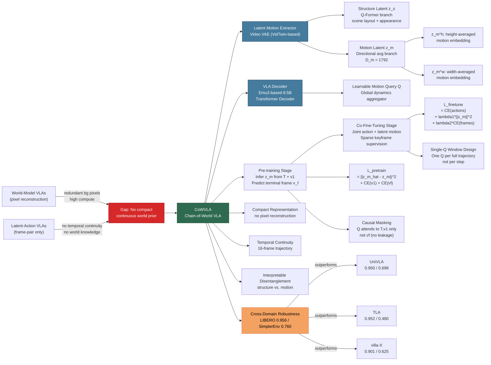

---
tags:
  - paper
  - World_Model
  - VLA
  - Embodied_AI
  - Robot_Manipulation
  - Foundation_Model
aliases:
  - "Chain of World: World Model Thinking in Latent Motion"
url: http://arxiv.org/abs/2603.03195v1
pdf_url: https://arxiv.org/pdf/2603.03195v1
local_pdf: "[[Chain of World World Model Thinking in Latent Motion.pdf]]"
github: "None"
project_page: "https://fx-hit.github.io/cowvla-io"
institutions:
  - "Harbin Institute of Technology"
  - "Li Auto"
  - "Beijing Academy of Artificial Intelligence (BAAI)"
  - "University of New South Wales"
  - "Chongqing Research Institute of HIT"
  - "Peking University"
publication_date: "2026-03-03"
score: 8
---

# Chain of World: World Model Thinking in Latent Motion

## 📌 Abstract
Vision-Language-Action (VLA) models are a promising path toward embodied intelligence, yet they often overlook the predictive and temporal-causal structure underlying visual dynamics. World-model VLAs address this by predicting future frames, but waste capacity reconstructing redundant backgrounds. Latent-action VLAs encode frame-to-frame transitions compactly, but lack temporally continuous dynamic modeling and world knowledge. To overcome these limitations, we introduce CoWVLA (Chain-of-World VLA), a new "Chain of World" paradigm that unifies world-model temporal reasoning with a disentangled latent motion representation. First, a pretrained video VAE serves as a latent motion extractor, explicitly factorizing video segments into structure and motion latents. Then, during pre-training, the VLA learns from an instruction and an initial frame to infer a continuous latent motion chain and predict the segment's terminal frame. Finally, during co-fine-tuning, this latent dynamic is aligned with discrete action prediction by jointly modeling sparse keyframes and action sequences in a unified autoregressive decoder. This design preserves the world-model benefits of temporal reasoning and world knowledge while retaining the compactness and interpretability of latent actions, enabling efficient visuomotor learning. Extensive experiments on robotic simulation benchmarks show that CoWVLA outperforms existing world-model and latent-action approaches and achieves moderate computational efficiency, highlighting its potential as a more effective VLA pretraining paradigm. The project website can be found at https://fx-hit.github.io/cowvla-io.

## 🖼️ Architecture
![[Chain of World World Model Thinking in Latent Motion_arch.jpeg]]

## 🧠 AI Analysis

# 🚀 Deep Analysis Report: Chain of World: World Model Thinking in Latent Motion

## 📊 Academic Quality & Innovation
---

## 1. Core Snapshot

### Problem Statement
Vision-Language-Action (VLA) models for robotic manipulation currently fall into two paradigms, each with a structural deficiency. World-model VLAs (e.g., WorldVLA, UniVLA, FlowVLA) predict future pixel frames to provide environmental priors, but this forces the model to reconstruct redundant static background pixels, is computationally expensive, and produces excessively long token sequences when multiple frames are used. Latent-action VLAs (e.g., LAPA, villa-X, TLA) encode frame-to-frame transitions compactly, but restrict temporal modeling to pairs of frames, providing no continuous dynamic understanding or causal world knowledge about how the scene evolves across time. Neither paradigm simultaneously achieves compactness, temporal continuity, and interpretable world knowledge.

### Core Contribution
CoWVLA introduces a "Chain-of-World" pretraining paradigm that disentangles video segments into structure and motion latents via a fine-tuned video VAE, then trains a unified VLA decoder to reason through a continuous latent motion chain—predicting the segment's terminal keyframe—before co-fine-tuning on discrete action sequences, thereby merging the temporal modeling strength of world models with the compactness of latent actions.

### Academic Rating
- **Innovation: 7.5/10** — The combination of structure-motion disentanglement with continuous latent motion as a "chain-of-thought" analog for robotic VLAs is well-motivated and novel in framing, though it is an integration of existing ideas (video VAE disentanglement, latent action pretraining, keyframe co-tuning) rather than a fundamentally new mathematical framework.
- **Rigor: 7/10** — Experiments span two benchmark families with multiple task suites, include ablations on loss weights, architectural variants, and computational cost. Some ablations are conducted on LIBERO only, and SimplerEnv results are less thoroughly ablated.

---

## 2. Technical Decomposition

### Algorithmic Logic

**Step 1: Latent Motion Extraction (Video VAE)**

A pretrained video VAE (VidTwin [49]) is fine-tuned on a 237k robot video dataset. Given a video segment $\mathbf{V}_{1:f} = \{v_1, \ldots, v_f\}$ sampled uniformly to $f=16$ frames at $224\times224$, the encoder produces an intermediate tensor $z \in \mathbb{R}^{d_z \times f \times h \times w}$.

- **Structure branch**: A Q-Former module with $n_q \leq f$ learnable queries $\{q_i\}_{i=1}^{n_q}$ aggregates global scene semantics and low-frequency dynamics across the temporal dimension, yielding $z_s \in \mathbb{R}^{d_z \times n_q \times h_s \times w_s}$. This captures scene layout and appearance.
- **Motion branch**: Convolutional layers reduce $z$ along spatial dimensions to $z' \in \mathbb{R}^{d_m \times f \times h_m \times w_m}$. Spatial averaging $\mu(\cdot)$ is applied independently along height and width axes to extract directional motion embeddings: $z_m^h = \mu_h(z') \in \mathbb{R}^{d_m \times f \times w_m}$ and $z_m^w = \mu_w(z') \in \mathbb{R}^{d_m \times f \times h_m}$. These are concatenated and flattened into a unified latent motion vector $z_m \in \mathbb{R}^{D_m}$, where $D_m = f \times d_m \times (h_m + w_m) = 16 \times d_m \times (7+7) = 1792$.

The intuition is that directional spatial averages capture how objects and the robot arm translate across spatial axes without encoding static content, providing a compact yet informative dynamic signal.

The decoder reconstructs $\hat{\mathbf{V}}_{1:f}$ by upsampling the three components $(z_s, z_m^h, z_m^w)$ back to the same spatial/temporal size, summing them, and passing through the VAE decoder. Training uses:
$$\mathcal{L}_{vae} = \mathcal{L}_{\text{rec}} + \lambda_p \mathcal{L}_p + \lambda_{\text{GAN}} \mathcal{L}_{\text{GAN}} + \lambda_{\text{KL}} \mathcal{L}_{\text{KL}} \tag{1}$$

**Step 2: VLA Pre-training (Latent Motion Prediction)**

The VLA backbone follows UniVLA's transformer decoder design built on Emu3 (8.5B parameters). Visual frames are tokenized via VQGAN; actions are chunked with chunk length $l_a$ and discretized with FAST. A learnable motion query token $Q \in \mathbb{R}^{D_Q}$ is introduced.

The input sequence is organized as $[T, v_q^1, Q, v_q^f]$, where:
- $T$: language instruction tokens
- $v_q^1$: VQGAN tokens of the initial frame $v_1$
- $Q$: learnable motion query token
- $v_q^f$: VQGAN tokens of the terminal frame $v_f$ (used for supervision only)

Causal masking ensures $Q$ attends to $\{T, v_q^1\}$ but is masked from $v_q^f$ (preventing information leakage). The hidden state at $Q$ is passed through an MLP to predict $\hat{z}_m$.

The pre-training loss is:
$$\mathcal{L}_{\text{pretrain}} = \|\hat{z}_m - z_m\|_2^2 + \sum_{x \in \{1,f\}} \text{CE}(\hat{v}_q^x, v_q^x) \tag{2}$$

Term 1 forces the model to learn to infer the full continuous latent motion trajectory from instruction and initial frame. Term 2 ensures coherent visual state predictions at both start and end frames. This establishes a dynamics-aware world prior in latent space without reconstructing any pixel background.

**Step 3: Co-Fine-Tuning (Action Alignment)**

Given a video $\mathbf{V}_{1:f}$ with action sequence $\mathbf{A}_{1:t}$, $N = f/l_a$ keyframes are extracted and tokenized as $\tilde{\mathbf{V}}_q = \{\tilde{v}_q^1, \ldots, \tilde{v}_q^N\}$. Action chunks are discretized as $\{\mathbf{A}_q^1, \ldots, \mathbf{A}_q^N\}$. The input follows a "single-Q for full window" design:
$$[T,\, \tilde{v}_q^1,\, Q,\, \mathbf{A}_q^1,\, \tilde{v}_q^2,\, \mathbf{A}_q^2,\, \ldots,\, \mathbf{A}_q^N]$$

$Q$ appears once after the first keyframe and acts as a global latent dynamics aggregator. Its hidden state is passed through the MLP to predict $\hat{z}_m$, enforcing consistency between latent dynamics and all subsequent action predictions. The co-fine-tuning loss is:
$$\mathcal{L}_{\text{finetune}} = \sum_{j=1}^{N} \text{CE}\!\left(\hat{\mathbf{A}}_q^j,\, \mathbf{A}_q^j\right) + \lambda_1 \|\hat{z}_m - z_m(\mathbf{V}_{1:f})\|_2^2 + \lambda_2 \sum_{j=1}^{N} \text{CE}(\tilde{\hat{v}}_q^j, \tilde{v}_q^j) \tag{3}$$

- Term 1: cross-entropy over discretized action tokens, the primary task objective.
- Term 2 ($\lambda_1$): latent motion supervision, guiding the model to maintain continuous dynamic reasoning even as it predicts discrete actions.
- Term 3 ($\lambda_2$): visual token prediction at sparse keyframes, anchoring state transitions.

The hyperparameter settings used are $\lambda_1 = 0.1$, $\lambda_2 = 0.01$ for LIBERO and $\lambda_1 = 0.1$, $\lambda_2 = 0$ for SimplerEnv.

### Mathematical Formulation — Variable Definitions

| Symbol | Definition |
|---|---|
| $\mathbf{V}_{1:f}$ | Video segment with $f$ frames |
| $v_i \in \mathbb{R}^{H \times W \times 3}$ | $i$-th raw RGB frame |
| $z \in \mathbb{R}^{d_z \times f \times h \times w}$ | Intermediate encoder latent |
| $z_s$ | Structure latent from Q-Former branch |
| $z_m^h, z_m^w$ | Directional motion embeddings (height-averaged, width-averaged) |
| $z_m \in \mathbb{R}^{D_m}$ | Concatenated unified latent motion vector, $D_m = 1792$ |
| $T$ | Instruction token sequence |
| $Q \in \mathbb{R}^{D_Q}$ | Learnable motion query token |
| $v_q^1, v_q^f$ | VQGAN-quantized tokens of first and last frames |
| $\hat{z}_m$ | Predicted latent motion from MLP at $Q$ position |
| $\mathbf{A}_q^j$ | Discretized action chunk tokens for chunk $j$ |
| $\tilde{v}_q^j$ | VQGAN tokens of $j$-th keyframe |
| $\lambda_1, \lambda_2$ | Loss weight scalars for latent motion and visual token losses |

### Tensor Flow & Architecture

```
Input Frames V_{1:f}: [B, f=16, 3, 224, 224]
        │
        ▼
Video VAE Encoder
        │
        ├──► z: [B, d_z, f, h, w]
        │         │
        │    Structure Branch (Q-Former)
        │         │
        │         └──► z_s: [B, d_z, n_q, h_s, w_s]  (n_q ≤ f)
        │
        └──► Motion Branch (Conv layers → z': [B, d_m, f, h_m, w_m])
                  │
                  ├──► z_m^h = μ_h(z'): [B, d_m, f, w_m]   (w_m=7)
                  └──► z_m^w = μ_w(z'): [B, d_m, f, h_m]   (h_m=7)
                  
                  Concatenate & Flatten:
                  z_m: [B, D_m=1792]

Pre-training Decoder Input: [T | v_q^1 | Q | v_q^f]
        │
Transformer Decoder (Emu3-based, 8.5B)
        │
Hidden state at Q position: [B, D_hidden]
        │
MLP → ẑ_m: [B, D_m=1792]

Co-fine-tuning Input: [T | ṽ_q^1 | Q | A_q^1 | ṽ_q^2 | A_q^2 | ... | A_q^N]
```

**Architectural choices of note:**
- VidTwin [49] serves as the base video VAE, chosen for its proven structure-motion disentanglement capacity in video generation tasks. This is repurposed here as a dynamic prior for robotics—the first such application.
- Q-Former for structure extraction reduces temporal redundancy by aggregating across frames with a small number of learnable queries, analogous to BLIP-2's visual aggregation but applied temporally.
- The single-Q design across the full temporal window (rather than one Q per step) is a deliberate architectural choice that forces the query to integrate global trajectory information rather than local step dynamics.
- Causal masking prevents $Q$ from attending to $v_q^f$ (the target state), forcing genuine forward prediction rather than interpolation.

### Innovation Logic

Compared to prior approaches:

- **vs. World-model VLAs (UniVLA, FlowVLA)**: Instead of predicting full pixel frames (requiring reconstruction of redundant background), CoWVLA predicts a compact latent motion vector $z_m \in \mathbb{R}^{1792}$. This eliminates per-pixel cross-entropy over full frame sequences, drastically reducing sequence length and computation while preserving dynamic information.
- **vs. Latent-action VLAs (LAPA, villa-X, TLA)**: Existing methods compute one latent per frame pair, restricting temporal modeling to $\Delta(v_{i}, v_{i+1})$. CoWVLA's $z_m$ is computed across $f=16$ frames and encodes the entire trajectory's directional motion, providing temporally continuous supervision analogous to a "chain-of-thought" in language reasoning.
- **vs. TLA [6]**: TLA disentangles task-relevant and task-irrelevant factors but still operates on frame pairs. CoWVLA's structure-motion disentanglement is segment-level, providing a more global and interpretable prior.
- **Mathematically**: The pretraining loss (Eq. 2) replaces pixel-level frame reconstruction cross-entropy with an $\ell_2$ regression on a 1792-dimensional latent plus sparse keyframe CE. The co-fine-tuning loss (Eq. 3) jointly optimizes action tokens and latent motion in a single autoregressive pass—a unified objective that prior works handle in separate stages.

---

## 3. Evidence & Metrics

### Benchmark & Baselines

**LIBERO** benchmark: Four task suites (Spatial, Object, Goal, Long) covering spatial reasoning, object recognition, procedural learning, and long-horizon multi-step tasks. **SimplerEnv-WidowX**: Four manipulation tasks (Stack Block, Put Carrot, Put Spoon, Put Eggplant) with a 7-DoF WidowX arm, focusing on real-to-sim generalization. These are standard, widely-used benchmarks in robot learning.

The comparison set is comprehensive: VLA baselines (OpenVLA, SpatialVLA, CogACT, Dita, $\pi_0$, $\pi_0$-FAST, GR00T N1), latent-action approaches (LAPA, villa-X, TLA), and world-model approaches (WorldVLA, CoT-VLA, UniVLA, FlowVLA). The experimental design is broadly fair, though it should be noted that some baselines (e.g., LAPA) do not report SimplerEnv numbers, limiting cross-paradigm comparisons.

### Key Results

| Setting | CoWVLA Avg. | Best Prior Avg. | Improvement |
|---|---|---|---|
| LIBERO (4 suites) | **0.956** | 0.952 (TLA) | +0.4 pp absolute |
| SimplerEnv-WidowX | **0.760** | 0.740 (FlowVLA) | +2.0 pp absolute |
| LIBERO + SimplerEnv combined stability | 0.956 / 0.760 | UniVLA: 0.950 / 0.698 | +0.6 pp / +6.2 pp |

The most notable result is cross-domain stability: TLA achieves 0.952 on LIBERO but drops to 0.480 on SimplerEnv (a 49.6% relative drop), while CoWVLA maintains 0.760—a significantly more robust generalization profile. UniVLA, the strongest prior world-model baseline, achieves 0.950/0.698 vs. CoWVLA's 0.956/0.760, demonstrating CoWVLA's consistent superiority on both benchmarks simultaneously.

Computational efficiency (Figure 6): CoWVLA ("motion" config) achieves ~7 s/iter training speed with ~40 GB GPU memory, comparable to CoT-VLA (fastest at ~8 s/iter, 30 GB) and faster than UniVLA (~12 s/iter, 76 GB), while achieving higher success rates than both.

### Ablation Study

**Most critical components (Table 3, LIBERO):**

1. **Latent motion supervision** ($\lambda_1 > 0$): Removing latent action entirely ("w/o LA") yields average 0.448. Adding LAPA-style latent actions brings it to 0.716. CoWVLA's motion latent reaches 0.877, and the full "motion & cot" variant with terminal frame $v_f$ supervision during pre-training reaches 0.947. This indicates that the continuous latent motion representation is the single most important component.

2. **Structure-motion disentanglement**: Replacing CoWVLA's disentangled latent with a structure-only latent gives 0.817 vs. the motion latent's 0.877—demonstrating that the motion branch specifically contributes actionable dynamic information.

3. **Pre-training paradigm (World Model vs. Latent Action)**: World model-style pre-training (UniVLA style: 0.942, CoT-VLA style: 0.924) consistently exceeds latent action alternatives (best: villa-X at 0.812), confirming the value of future-state reasoning during pre-training.

4. **Loss weight analysis (Table 4)**: The optimal configuration is $\lambda_1 = 0.1$, $\lambda_2 = 0.01$, achieving 0.955. Setting $\lambda_1 = 0$ (no latent motion loss) gives only 0.872, confirming the indispensability of the latent motion regularization during fine-tuning. Setting $\lambda_2$ too high (0.05) hurts performance (0.946), suggesting over-emphasis on visual token reconstruction competes with action learning.

---

## 4. Critical Assessment

### Hidden Limitations

1. **Temporal resolution ceiling**: The video VAE is fixed at $f = 16$ frames uniformly sampled at $224 \times 224$. For long-horizon tasks with fine-grained temporal structure (e.g., multi-minute assembly), the 16-frame window may miss critical intermediate states. The "LIBERO-Long" suite shows CoWVLA at 0.928, its weakest suite, consistent with this concern.

2. **Directional averaging as motion proxy**: The spatial averaging operation $\mu_h(\cdot)$ and $\mu_w(\cdot)$ is geometrically motivated but loses spatial locality information—it cannot distinguish whether two different sub-regions move simultaneously in opposite directions. For tasks requiring precise, spatially localized manipulation (e.g., bi-manual dexterous tasks), this could be an information bottleneck.

3. **Single-Q global aggregator**: The design that $Q$ appears only once in the co-fine-tuning sequence and aggregates information for the full temporal horizon places a high capacity demand on a single token. In tasks with highly non-stationary dynamics (e.g., tasks where the robot strategy changes mid-sequence), a single global prior may insufficiently capture mode changes.

4. **Discretized action token dependency**: The method inherits the limitations of FAST-based action discretization. The tokenizer assumes action distributions are well-covered by a fixed vocabulary; out-of-distribution robot morphologies or action ranges may require re-training the discretizer.

5. **No real-world hardware evaluation**: All reported results are in simulation (LIBERO and SimplerEnv). The sim-to-real gap is not directly addressed in the empirical analysis.

### Engineering Hurdles

1. **Two-stage fine-tuning complexity**: Reproducing CoWVLA requires (a) fine-tuning VidTwin on 237k robot videos, (b) pre-training the 8.5B Emu3-based VLA for 10k steps with batch size 256 (implying substantial multi-GPU infrastructure), and (c) benchmark-specific co-fine-tuning. The three-stage pipeline with multiple hyperparameters ($\lambda_1$, $\lambda_2$, $l_a$, $f$, $N$) increases the reproducibility burden significantly.

2. **Dataset dependency**: The latent motion extractor is fine-tuned on 237k videos curated from OpenVLA's dataset mix. Practitioners targeting a different robot platform or embodiment would need to curate a comparable dataset and repeat fine-tuning of the video VAE, which is non-trivial.

3. **No public code or model weights**: At submission time, no GitHub repository is provided (only a project page). This makes reproduction dependent entirely on the method description, which omits some implementation details (e.g., exact Q-Former configuration, VidTwin fine-tuning hyperparameters).

4. **Sensitivity to $\lambda_1$ schedule**: Table 4 shows that $\lambda_1 = 0$ (no latent motion) gives 0.872 while $\lambda_1 = 1.0$ gives 0.946, but the optimal is 0.955 at $\lambda_1 = 0.1$. This non-monotonic sensitivity means that reproducing the claimed performance requires careful hyperparameter search, which is not fully automated or principled.

5. **Memory requirements for 8.5B model**: The backbone is Emu3 at 8.5B parameters. The reported GPU memory ranges from 30–42 GB per device (Figure 6) with batch size 4. Scaling to batch size 128 for co-fine-tuning requires a substantial multi-GPU cluster, creating a barrier for academic reproducibility.

## 🔗 Knowledge Graph & Connections
## Task 1: Knowledge Connections

### Connection 1: [[GeneralVLA]] — Shared Paradigm of World-Model-Augmented VLA Pretraining
CoWVLA directly competes with and extends the world-model VLA paradigm. [[GeneralVLA]] similarly investigates how pretraining VLA models with environmental prediction objectives improves downstream manipulation. The key divergence is that CoWVLA replaces pixel-space future frame prediction with latent motion prediction, addressing the computational redundancy problem that plagues pixel-reconstruction world models. The ablation comparison in Table 3 (UniVLA-style vs. CoWVLA) directly quantifies this gap at 0.942 vs. 0.947 average success rate on LIBERO.

### Connection 2: [[QuantVLA]] — Latent Action Quantization and Discrete Token Policies
[[QuantVLA]] explores quantizing actions into discrete token vocabularies for autoregressive VLA modeling, which is directly relevant to CoWVLA's use of FAST-based action discretization and VQGAN visual tokenization. Both works share the architectural assumption that unified autoregressive decoding over mixed modality tokens (vision + action) is a productive inductive bias. CoWVLA extends this by adding a third modality stream—the continuous latent motion vector—into the same decoder, creating a richer supervision signal that QuantVLA-style approaches lack.

### Connection 3: [[The_Trinity_of_Consistency_as_a_Defining_Principle_for_General_World_Models]] — Theoretical Framing of World Model Properties
This work provides a principled framework for what constitutes a coherent world model, specifically addressing temporal consistency, spatial consistency, and semantic consistency as defining properties. CoWVLA's design choices map onto this framework: the continuous latent motion chain enforces temporal consistency, the structure-motion disentanglement enforces a form of spatial consistency (background separation), and the language-conditioned motion prediction enforces semantic consistency. This connection is useful for situating CoWVLA within a broader theoretical literature on world model design principles.

### Connection 4: [[WIMLE]] — World Models with Latent Evolution for Embodied Agents
[[WIMLE]] and CoWVLA share a fundamental research hypothesis: that latent space evolution is a more efficient substrate for world modeling than pixel-space evolution. If WIMLE operates in a learned latent space and models state transitions autoregressively, the two works converge on the same architectural solution from different starting points. The key technical differentiator is CoWVLA's explicit structure-motion disentanglement via a video VAE, which provides an interpretable intermediate representation that general latent world models typically lack.

### Connection 5: [[VisPhyWorld]] — Physics-Informed Visual World Models for Robotics
[[VisPhyWorld]] addresses the problem of making world models physically grounded, which is relevant to CoWVLA's claim that latent motion representations provide "physically plausible future states." CoWVLA's directional motion embeddings ($z_m^h$, $z_m^w$) encode translational dynamics that implicitly capture some physical structure (object displacement patterns), but lack explicit physics constraints. [[VisPhyWorld]]'s approach of injecting physics priors into the latent dynamics could be a natural extension of CoWVLA's motion branch, potentially improving generalization to novel object interactions.

---

## Task 2: Mermaid Knowledge Graph



---

## Task 3: Future Research Directions

### Direction 1: Hierarchical Latent Motion Chains for Long-Horizon Tasks

**Motivation**: CoWVLA's single-level 16-frame motion latent shows its weakest performance on LIBERO-Long (0.928 vs. 0.978 on LIBERO-Object), suggesting that a flat temporal window is insufficient for long-horizon task decomposition. The "LIBERO-Long" suite specifically tests multi-step procedural tasks where intermediate sub-goals are critical.

**Concrete Proposal**: Introduce a two-level hierarchical latent motion structure. The high-level latent $z_m^{\text{global}}$ would encode task-level dynamics across an entire episode (e.g., 128 frames), while the low-level latent $z_m^{\text{local}}$ would encode step-level dynamics within 16-frame windows. The VLA decoder would first predict $z_m^{\text{global}}$ conditioned on the instruction, then predict $z_m^{\text{local}}$ for each window conditioned on both instruction and $z_m^{\text{global}}$. This mirrors the hierarchical structure used in options frameworks and feudal reinforcement learning, but implemented entirely in the latent motion space. The expected benefit is improved long-horizon coherence without increasing per-step computational cost.

**Key Technical Challenge**: Training the two-level VAE to maintain disentanglement across temporal scales—ensuring that $z_m^{\text{global}}$ does not simply replicate the information in $z_m^{\text{local}}$ requires careful regularization (e.g., mutual information minimization between levels).

---

### Direction 2: Physics-Informed Motion Latent via Contact-Aware Regularization

**Motivation**: CoWVLA's motion latent uses directional spatial averaging, which is a purely data-driven, geometry-free representation. It cannot distinguish physically plausible from implausible trajectories (e.g., a robot arm passing through an object). Connecting to [[VisPhyWorld]] and [[SemanticContact_Fields_for_CategoryLevel_Generalizable_Tactile_Tool_Manipulation]], incorporating physical contact structure into the motion latent could significantly improve generalization to novel object geometries.

**Concrete Proposal**: Augment the motion branch of the video VAE with a physics-aware auxiliary loss during fine-tuning. Specifically, use a differentiable contact detector (or predicted depth/surface normals from a frozen depth estimation model) to identify contact events in the video. Add a contrastive regularization term that pulls together motion latents from physically similar contact configurations and pushes apart latents from physically distinct ones:
$$\mathcal{L}_{\text{contact}} = \sum_{(i,j) \in \mathcal{P}_+} \|z_m^i - z_m^j\|_2^2 + \sum_{(i,j) \in \mathcal{P}_-} \max(0, \alpha - \|z_m^i - z_m^j\|_2^2)$$
where $\mathcal{P}_+$ are pairs with similar contact patterns and $\mathcal{P}_-$ are pairs with dissimilar contact patterns. This would ground the motion latent in physical interaction semantics rather than purely visual statistics.

**Key Technical Challenge**: Reliable contact detection in in-the-wild robot videos is non-trivial. A practical approximation would be to use synthetic data with known contact labels for pre-training the contact detector, then transfer to real video.

---

### Direction 3: Online Latent Motion Adaptation via Test-Time Inference Refinement

**Motivation**: CoWVLA's motion query $Q$ is fixed at inference—it makes a single forward pass to predict $\hat{z}_m$ and then generates actions conditioned on it. If the initial motion prediction is poor (e.g., due to partial observability or distribution shift), there is no mechanism to correct it during execution. This is a fundamental limitation for deployment in real-world environments with sensor noise.

**Concrete Proposal**: Develop an online test-time adaptation loop for the latent motion. After each action chunk execution, the robot observes a new visual frame $v_t^{\text{obs}}$. Compute the discrepancy between the predicted visual state (decoded from $\hat{z}_m$ using the VAE decoder) and the observed state:
$$\delta_t = \|\hat{v}_t - v_t^{\text{obs}}\|_2^2$$
If $\delta_t$ exceeds a threshold $\tau$, perform a small number of gradient steps to refine $\hat{z}_m$:
$$\hat{z}_m \leftarrow \hat{z}_m - \eta \nabla_{\hat{z}_m} \delta_t$$
This creates a closed-loop latent motion correction mechanism where the motion prior is continuously updated based on real-world feedback. The key advantage is that only the latent vector $\hat{z}_m \in \mathbb{R}^{1792}$ is optimized—not the full model weights—making this computationally feasible at inference time. This connects to the broader test-time compute literature (analogous to chain-of-thought refinement in LLMs) and could significantly improve robustness to distribution shift, directly addressing CoWVLA's sim-to-real gap.

**Key Technical Challenge**: Ensuring that gradient updates on $\hat{z}_m$ remain within the valid latent manifold learned by the VAE. A practical solution is to add a KL regularization term during refinement: $\delta_t + \beta \cdot \text{KL}(q(\hat{z}_m) \| p(z_m))$, where $p(z_m)$ is the prior distribution learned during VAE training.

---
*Analysis performed by PaperBrain-OpenRouter (anthropic/claude-4.6-sonnet) (Vision-Enabled)*


## 📂 Resources
- **Local PDF**: [[Chain of World World Model Thinking in Latent Motion.pdf]]
- [Online PDF](https://arxiv.org/pdf/2603.03195v1)
- [ArXiv Link](http://arxiv.org/abs/2603.03195v1)
