---
tags:
  - paper
  - World_Model
  - Embodied_AI
  - Robot_Manipulation
  - VLA
  - Foundation_Model
aliases:
  - "Chain of World: World Model Thinking in Latent Motion"
url: https://huggingface.co/papers/2603.03195
pdf_url: https://arxiv.org/pdf/2603.03195.pdf
local_pdf: "[[Chain of World World Model Thinking in Latent Motion.pdf]]"
github: "None"
project_page: "https://fx-hit.github.io/cowvla-io"
institutions:
  - "Harbin Institute of Technology"
  - "Li Auto"
  - "Beijing Academy of Artificial Intelligence (BAAI)"
  - "University of New South Wales"
  - "Chongqing Research Institute of HIT"
  - "Peking University"
publication_date: "2026-03-03"
score: 8
---

# Chain of World: World Model Thinking in Latent Motion

## 📌 Abstract
Vision-Language-Action (VLA) models are a promising path toward embodied intelligence, yet they often overlook the predictive and temporal-causal structure underlying visual dynamics. World-model VLAs address this by predicting future frames, but waste capacity reconstructing redundant backgrounds. Latent-action VLAs encode frame-to-frame transitions compactly, but lack temporally continuous dynamic modeling and world knowledge. To overcome these limitations, we introduce CoWVLA (Chain-of-World VLA), a new "Chain of World" paradigm that unifies world-model temporal reasoning with a disentangled latent motion representation. First, a pretrained video VAE serves as a latent motion extractor, explicitly factorizing video segments into structure and motion latents. Then, during pre-training, the VLA learns from an instruction and an initial frame to infer a continuous latent motion chain and predict the segment's terminal frame. Finally, during co-fine-tuning, this latent dynamic is aligned with discrete action prediction by jointly modeling sparse keyframes and action sequences in a unified autoregressive decoder. This design preserves the world-model benefits of temporal reasoning and world knowledge while retaining the compactness and interpretability of latent actions, enabling efficient visuomotor learning. Extensive experiments on robotic simulation benchmarks show that CoWVLA outperforms existing world-model and latent-action approaches and achieves moderate computational efficiency, highlighting its potential as a more effective VLA pretraining paradigm. The project website can be found at https://fx-hit.github.io/cowvla-io.

## 🖼️ Architecture
![[Chain of World World Model Thinking in Latent Motion_arch.jpeg]]

## 🧠 AI Analysis

# 🚀 Deep Analysis Report: Chain of World: World Model Thinking in Latent Motion

## 📊 Academic Quality & Innovation
---

## 1. Core Snapshot

### Problem Statement

Vision-Language-Action (VLA) models for robotic manipulation face two competing but complementary paradigms, each with a fundamental deficiency. **World-model VLAs** (e.g., WorldVLA, UniVLA, FlowVLA) predict future pixel-level frames to instill temporal world knowledge, but this forces the model to reconstruct massive amounts of static, redundant background content — an information-theoretically wasteful objective that also introduces prohibitive computational cost when sequences of frames are involved. **Latent-action VLAs** (e.g., LAPA, villa-X, TLA) compress frame-to-frame transitions into compact latent codes, avoiding pixel reconstruction, but they are fundamentally **temporally shallow**: each latent encodes only the transition between two adjacent frames and carries no understanding of how the world state should evolve over a longer horizon. Additionally, latent actions entangle static scene content with dynamic motion, producing representations that lack physical interpretability. The core gap is therefore: *no existing VLA pretraining paradigm simultaneously achieves temporally continuous dynamic modeling, compact motion representation, and world-knowledge-level generalization.*

### Core Contribution

CoWVLA introduces a "Chain-of-World" pretraining paradigm that unifies world-model temporal reasoning with disentangled latent motion representations by training a VLA decoder to predict a continuous latent motion summary and a terminal keyframe from a video segment, then co-fine-tuning it to jointly autoregressively predict sparse keyframes and multi-step action sequences conditioned on that same latent motion aggregator.

### Academic Rating

- **Innovation: 7.5/10** — The paper's central insight — repurposing a video VAE's disentangled structure-motion latent space as a compact world model prior — is conceptually clean and non-trivial. The single-query temporal aggregation mechanism is a practical architectural contribution. However, the individual components (video VAE disentanglement, Q-Former, autoregressive VLA decoding) are all borrowed from prior work; the novelty lies primarily in their systematic composition and the specific alignment strategy.
- **Rigor: 7/10** — Experiments cover two independent benchmarks (LIBERO and SimplerEnv-WidowX) with diverse task suites and a broad set of baselines across all three paradigm categories. The ablation studies are well-structured. Limitations include the absence of real-robot experiments at scale, and the cross-domain generalization claim rests on a relatively small evaluation set.

---

## 2. Technical Decomposition

### 2.1 Algorithmic Logic

The method consists of three independent but sequentially dependent phases.

**Phase 0 — Latent Motion Extractor Training (Video VAE)**

A pretrained video VAE (VidTwin [49]) is fine-tuned on a 237k-video robot-centric dataset to produce a **structure-motion disentangled** latent space. Given a video segment $\mathbf{V}_{1:f} = \{v_1, \ldots, v_f\}$, the encoder produces an intermediate tensor $z \in \mathbb{R}^{d_z \times f \times h \times w}$.

- **Structure branch**: A Q-Former module with $n_q \leq f$ learnable queries $\{q_i\}_{i=1}^{n_q}$ aggregates $z$ along the temporal dimension, yielding $z_s \in \mathbb{R}^{d_s \times n_q \times h_s \times w_s}$. This captures global scene layout and low-frequency spatial semantics that are stable over time.
- **Motion branch**: Convolutional layers reduce the channel dimension of $z$ to $z' \in \mathbb{R}^{d_m \times f \times h_m \times w_m}$, then spatial averaging independently along height and width axes extracts two **directional motion embeddings**: $z_m^h = \mu_h(z') \in \mathbb{R}^{d_m \times f \times w_m}$ and $z_m^w = \mu_w(z') \in \mathbb{R}^{d_m \times f \times h_m}$. Concatenating these yields the unified latent motion vector $z_m \in \mathbb{R}^{D_m}$, $D_m = f \times d_m \times (h_m + w_m)$.

*Intuition*: By forcing the two branches to specialize — one aggregating temporally while the other aggregating spatially — the VAE's information bottleneck naturally pushes static appearance into $z_s$ and dynamic trajectory information into $z_m$. The directional decomposition of $z_m$ into height- and width-projected motion is geometrically motivated: robot arm motion in 2D image space can be approximately factored into vertical and horizontal components.

**Phase 1 — Pre-training to Think in Latent Motion**

The VLA decoder (based on UniVLA/Emu3 architecture, 8.5B parameters) is trained to infer the latent motion of a video segment from only its first frame and the task instruction, without accessing any intermediate frames. This corresponds to learning a **dynamics-aware world prior** in the latent motion space.

- **Input sequence**: $[T,\ v_q^1,\ Q,\ v_q^f]$, where $T$ is the tokenized text instruction, $v_q^1$ is the VQGAN-quantized first frame, $Q$ is a single learnable motion query token, and $v_q^f$ is the VQGAN-quantized last (terminal) frame.
- **Causal masking**: $Q$ attends only to $\{T, v_q^1\}$ and is masked from $v_q^f$, ensuring the model cannot "peek" at the future.
- The hidden state at the $Q$ position is passed through an MLP to predict $\hat{z}_m$.
- The model also autoregressively predicts $v_q^1$ and $v_q^f$ via cross-entropy.

*Intuition*: World models gain their advantage by predicting how the environment evolves, providing a supervisory signal that encodes physical plausibility. This stage replicates that advantage but in the compact latent motion space rather than at the pixel level, eliminating the need to reconstruct backgrounds.

**Phase 2 — Co-Fine-Tuning for Action Alignment**

The pre-trained decoder is fine-tuned on labeled robot datasets. Action sequences $\mathbf{A}_{1:t}$ are partitioned into $N = f/l_a$ chunks of length $l_a$, each quantized via FAST [35] into action tokens $\mathbf{A}_q^j$. The corresponding video is subsampled into $N$ keyframes, each quantized via VQGAN into $\tilde{v}_q^j$.

- **Input sequence** ("single-Q for full window"): $[T,\ \tilde{v}_q^1,\ Q,\ \mathbf{A}_q^1,\ \tilde{v}_q^2,\ \mathbf{A}_q^2,\ \ldots,\ \mathbf{A}_q^N]$.
- $Q$ appears once after the first keyframe and serves as a global latent dynamics aggregator for the entire temporal horizon.
- The decoder autoregressively predicts both action tokens and visual keyframe tokens; the hidden state at $Q$ is again projected through an MLP to predict $\hat{z}_m$.

*Intuition*: The single $Q$ token acts as a "chain of world" — it integrates information from all past context and provides a continuous, globally consistent dynamics representation that guides multi-step action generation, preventing the drift that occurs when each frame-pair generates an independent latent.

---

### 2.2 Mathematical Formulation

**VAE Training Loss (Eq. 1)**

$$\mathcal{L}_{vae} = \mathcal{L}_{rec} + \lambda_p \mathcal{L}_p + \lambda_{GAN} \mathcal{L}_{GAN} + \lambda_{KL} \mathcal{L}_{KL}$$

| Term | Variable Definition | Physical Meaning |
|---|---|---|
| $\mathcal{L}_{rec}$ | Pixel-level reconstruction loss between $\hat{\mathbf{V}}_{1:f}$ and $\mathbf{V}_{1:f}$ | Forces the decoder to faithfully reproduce the input video from the disentangled latents |
| $\mathcal{L}_p$ | Perceptual (VGG feature-level) loss | Preserves semantic and structural fidelity beyond pixel-level matching |
| $\mathcal{L}_{GAN}$ | Adversarial loss from a discriminator | Encourages the reconstruction to be photorealistic |
| $\mathcal{L}_{KL}$ | KL divergence between the posterior $q(z|\mathbf{V})$ and $\mathcal{N}(0,I)$ | Regularizes the latent space for continuity and generalization |
| $\lambda_p, \lambda_{GAN}, \lambda_{KL}$ | Scalar loss weights | Control the trade-off between reconstruction fidelity and latent regularity |

**Pre-training Loss (Eq. 2)**

$$\mathcal{L}_{pretrain} = \|\hat{z}_m - z_m\|_2^2 + \sum_{x \in \{1,f\}} \text{CE}(\hat{v}_q^x, v_q^x)$$

| Term | Variable Definition | Physical Meaning |
|---|---|---|
| $\hat{z}_m$ | Predicted latent motion from MLP applied to $Q$'s hidden state | The model's inferred representation of how the scene will evolve |
| $z_m$ | Ground-truth latent motion from the pre-trained extractor | The target continuous dynamic summary of the full video |
| $\|\hat{z}_m - z_m\|_2^2$ | L2 regression loss on latent motion | Enforces that $Q$ accurately summarizes the entire temporal trajectory $v_1 \to v_f$ |
| $\text{CE}(\hat{v}_q^x, v_q^x)$ | Cross-entropy loss on discrete visual tokens for frames $x \in \{1,f\}$ | Ensures coherent prediction of the initial and terminal visual states |

**Co-Fine-Tuning Loss (Eq. 3)**

$$\mathcal{L}_{finetune} = \sum_{j=1}^{N} \text{CE}\!\left(\hat{\mathbf{A}}_q^j,\ \mathbf{A}_q^j\right) + \lambda_1 \|\hat{z}_m - z_m(\mathbf{V}_{1:f})\|_2^2 + \lambda_2 \sum_{j=1}^{N} \text{CE}\!\left(\hat{\tilde{v}}_q^j,\ \tilde{v}_q^j\right)$$

| Term | Variable Definition | Physical Meaning |
|---|---|---|
| $\hat{\mathbf{A}}_q^j, \mathbf{A}_q^j$ | Predicted and ground-truth action tokens for chunk $j$ | Standard imitation learning objective |
| $z_m(\mathbf{V}_{1:f})$ | Continuous latent motion signal from the extractor over the full episode | Provides world-model-level supervision during action learning |
| $\lambda_1$ | Weight for latent motion consistency (0.1 in practice) | Controls how strongly the world prior guides action generation |
| $\lambda_2$ | Weight for keyframe visual prediction (0.01 in practice) | Anchors motion predictions to sparse visual checkpoints |

The ablation (Table 4) confirms that $\lambda_1 = 0, \lambda_2 = 0$ (pure action CE) achieves only 0.872 average success; adding $\lambda_1 = 0.1$ boosts to 0.936; the optimal combination $\lambda_1 = 0.1, \lambda_2 = 0.01$ achieves 0.955.

---

### 2.3 Tensor Flow & Architecture

**Latent Motion Extractor (Video VAE)**

```
Input video segment V_{1:f}: [B, f=16, 3, 224, 224]
  ↓ Encoder
Intermediate latent z: [B, d_z, f, h, w]  (where h,w are spatial downsampled dims)

  ↓ Structure Branch (Q-Former)
z_s: [B, d_s, n_q, h_s, w_s]              (n_q ≤ f temporal queries; shape: [B, 4, 16, 7, 7])

  ↓ Motion Branch (Conv layers)
z': [B, d_m, f, h_m, w_m]
  ↓ Spatial avg along height axis
z_m^h: [B, d_m, f, w_m]                   (shape: [B, 8, 16, 7])
  ↓ Spatial avg along width axis
z_m^w: [B, d_m, f, h_m]                   (shape: [B, 8, 16, 7])
  ↓ Concatenate + Flatten
z_m: [B, D_m]                             (D_m = 16 × 8 × (7+7) = 1792)

  ↓ Decoder (receives z_s, z_m^h, z_m^w; upsampled and summed)
Reconstructed V̂_{1:f}: [B, f, 3, 224, 224]
```

Key design choice: The structure latent uses Q-Former temporal pooling (borrowed from BLIP-2 [27]) to compress the temporal dimension without information loss about global semantics. The motion latent uses directional spatial pooling rather than global average pooling, preserving the spatial directionality of motion trajectories.

**VLA Decoder**

The decoder is an 8.5B autoregressive transformer (Emu3 [47]) with the following token modalities:
- Text tokens $T$: Standard BPE tokenization
- Visual tokens $v_q$: VQGAN [15] discrete codes at resolution adapted to 200×200 or 256×256
- Action tokens $\mathbf{A}_q$: FAST [35] frequency-domain action discretization with chunk length $l_a$
- Motion query $Q$: A single learnable embedding $Q \in \mathbb{R}^{D_Q}$; its final hidden state is projected by a 2-layer MLP to $\hat{z}_m \in \mathbb{R}^{D_m=1792}$

The decoder uses causal attention throughout. The single-$Q$ design is architecturally significant: unlike Villa-X which generates one latent per frame pair, $Q$ appears once at a fixed position and must summarize all subsequent dynamics through the learned attention pattern across the full autoregressive context.

---

### 2.4 Innovation Logic

**vs. World-model VLAs (WorldVLA, UniVLA, FlowVLA)**: These methods supervise on pixel-space future frames, requiring the model to predict $O(H \times W \times f)$ tokens per sequence. CoWVLA replaces this with a regression target of dimension 1792 and a cross-entropy target on two keyframes, reducing the prediction target dimensionality by orders of magnitude while preserving the temporal causal supervision signal. The key innovation is demonstrating that a *pretrained video VAE's disentangled latent space* contains sufficient dynamic information to serve as a world model proxy.

**vs. Latent-action VLAs (LAPA, MoTo, TLA)**: These methods train a separate VQ-VAE on frame pairs to produce discrete action tokens, which only capture between-frame transitions and discard global temporal coherence. CoWVLA instead uses a **continuous** latent that is extracted from the **entire video segment** (16 frames) and maintains a **single aggregating query** that reasons over the full temporal horizon. Structurally, the motion latent is also explicitly disentangled from scene structure, whereas prior latent actions entangle both.

**vs. Villa-X [11]**: The closest prior work, which also extends latent actions to multi-frame settings. Villa-X still generates one latent action per frame pair at inference, resulting in $N$ independent latent vectors. CoWVLA uses a single $Q$ for the full window, enforcing global temporal consistency and enabling the model to reason about long-range dynamics in a unified representation.

---

## 3. Evidence & Metrics

### Benchmark & Baselines

**LIBERO** [32]: Four task suites of increasing difficulty (Spatial, Object, Goal, Long), each requiring distinct forms of knowledge transfer. All methods evaluated on the same four suites; results are averages across 20 episodes × 10 tasks per suite.

**SimplerEnv-WidowX** [30]: Four real-world-correlated manipulation tasks (Stack Block, Put Carrot, Put Spoon, Put Eggplant) using a 7-DoF WidowX arm. Designed to assess sim-to-real transfer quality.

**Baselines** span three paradigm categories:
- VLA baselines: OpenVLA [24], SpatialVLA [36], CogACT [28], DiTA [21], π₀ [3], π₀-FAST [35], GR00T-N1 [2]
- Latent-action: LAPA [54], villa-X [11], TLA [6]
- World-model: WorldVLA [7], CoT-VLA [57], UniVLA [50], FlowVLA [58]

The experimental design is **reasonably fair**: all methods are evaluated on the same benchmarks with the same evaluation protocol. However, the paper does not fully control for parameter count or training data volume across all baselines, which could introduce confounds — for example, GR00T-N1 and π₀ may use substantially different pretraining corpora.

### Key Results (Table 1)

| Method | LIBERO Avg. | SimplerEnv Avg. |
|---|---|---|
| UniVLA (best prior WM) | 0.950 | 0.687 |
| TLA (best prior LA) | **0.952** | 0.480 |
| villa-X | 0.901 | 0.625 |
| FlowVLA | 0.881 | 0.740 |
| **CoWVLA (Ours)** | **0.956** | **0.760** |

- CoWVLA achieves the highest average on LIBERO (0.956) and the highest average on SimplerEnv (0.760).
- The critical result is the **cross-domain stability**: TLA leads on LIBERO (0.952) but collapses to 0.480 on SimplerEnv (-47%). FlowVLA is competitive on SimplerEnv (0.740) but weak on LIBERO (0.881). CoWVLA maintains top-tier performance on both (+0.4% over UniVLA on LIBERO, +10.6% over UniVLA on SimplerEnv).
- On SimplerEnv, CoWVLA specifically improves over UniVLA by +0.073 absolute on average (0.760 vs. 0.687), suggesting better generalization to novel visual domains.

### Ablation Study (Tables 3 & 4)

**Most critical component**: The **motion latent supervision** ($\lambda_1$) during co-fine-tuning. From Table 4, removing it entirely ($\lambda_1 = 0$) drops average success from 0.955 to 0.872 — a 9.5% absolute drop — the largest single-component degradation in the study.

**Second most critical**: The **structure-motion disentanglement**. Comparing the "motion latent" variant (0.877) against undisentangled "structure latent" (0.817) and LAPA-style (0.716) in Table 3 confirms that cleaner motion representations significantly benefit policy learning.

**World model advantage over latent actions**: "UniVLA style" pre-training achieves 0.942 vs. the best latent-action variant (villa-X style: 0.812), a +13% absolute improvement attributable purely to the world-model temporal reasoning objective.

**Terminal frame ($v_f$) supervision**: Adding it during pre-training ("motion & cot" vs. "motion") improves from 0.936 to 0.947, confirming that predicting the future visual state as an evolutionary target meaningfully enhances world knowledge.

---

## 4. Critical Assessment

### Hidden Limitations

**1. Temporal resolution rigidity**: The entire pipeline assumes video segments of exactly $f = 16$ frames sampled uniformly. Tasks with highly variable execution speeds (e.g., contact-rich manipulation with stalls or pauses) may produce semantically inconsistent $z_m$ estimates due to temporal aliasing. The model has no explicit mechanism to handle variable-length dynamics.

**2. Single-Q bottleneck for long-horizon tasks**: On LIBERO-Long (10 tasks with diverse objects), CoWVLA achieves 0.928, still below TLA's 0.920 and above most others, but the single $Q$ token must compress dynamics across significantly longer and more compositional action sequences. As task horizon grows, a single fixed-dimension vector ($D_m = 1792$) may become an information bottleneck, particularly for tasks requiring multiple distinct sub-goal transitions.

**3. Real-robot validation gap**: Both benchmarks are simulation-based or have limited real-robot evaluation. SimplerEnv is designed to correlate with real-robot performance, but CoWVLA is not validated on actual hardware, leaving sim-to-real transfer properties unverified for the model specifically. Real-world noise in visual observations (lighting variation, motion blur) may degrade the VAE's disentanglement quality more than anticipated.

**4. Sensitivity to VAE quality**: The entire framework's quality depends on VidTwin's latent space being well-disentangled *after* fine-tuning on 237k videos. If domain-specific fine-tuning is insufficient (e.g., due to limited robot data in a new environment), $z_m$ will carry corrupted dynamic signals that propagate through both pre-training and fine-tuning stages.

**5. Discrete action tokenization dependency**: The method relies on FAST [35] for action discretization, which introduces a separate hyperparameter ($l_a$, set to 10 for LIBERO and 5 for SimplerEnv) that affects action chunk granularity. The sensitivity of results to this choice is not fully ablated; different task domains may require careful re-tuning.

### Engineering Hurdles

**1. Multi-stage training complexity**: Reproducing CoWVLA requires three independent training stages — VAE fine-tuning, VLA pre-training, and co-fine-tuning — each with separate datasets, hyperparameters, and hardware requirements. The pre-training stage alone requires 237k videos and an 8.5B-parameter model with batch size 256 for 10k steps; this translates to substantial cluster-scale compute (estimated >100 A100-GPU-hours based on comparable literature).

**2. VidTwin dependency**: The latent motion extractor is built on VidTwin [49], a specific video generation VAE. Its architectural details, checkpoint availability, and license terms are external dependencies that may be difficult to reproduce exactly. Small deviations in the VAE's disentanglement quality will cascade into different latent supervision signals.

**3. Action token-visual token co-modeling in a single autoregressive LLM**: Training a single 8.5B transformer to jointly predict text, visual VQGAN tokens, FAST action tokens, and an MLP regression head for $\hat{z}_m$ requires careful management of token type embeddings, causal masking patterns, and loss weighting. The "single-Q for full window" masking pattern (where $Q$ can attend to only the first keyframe but is used to predict the dynamics of all subsequent keyframes) requires a non-standard attention mask implementation that is not off-the-shelf in standard transformer libraries.

**4. Dataset curation for pre-training**: The 237k videos used for VAE fine-tuning and VLA pre-training are described as "robot-centric" but sourced from OpenVLA [24]'s curated set. Reproducing this from scratch requires access to and preprocessing of the Open-X Embodiment dataset at scale, which involves non-trivial data pipeline engineering and robot-specific filtering.

**5. Evaluation reproducibility**: The SimplerEnv benchmark is noted to show strong correlation with real-robot performance but is a simulation environment requiring specific physics engine configurations (MuJoCo/Genesis) and robot model parameters (WidowX 7-DoF). Differences in physics engine version or PID controller tuning can produce non-trivially different success rates, making exact replication challenging without the authors' exact environment setup.

## 🔗 Knowledge Graph & Connections
## Task 1: Differential Analysis & Connections

### Connection 1: CoWVLA vs. [[World_Action_Models_are_Zero_shot_Policies]] (DreamZero)

Both papers address the same foundational critique of standard VLAs: they lack physical world understanding and fail to generalize to novel environments. However, they arrive at diametrically opposed engineering decisions regarding **representation density**.

DreamZero (WAM) doubles down on pixel-space world modeling — it uses a 14B video diffusion backbone to jointly predict dense future frames and actions, arguing that video is the richest possible supervision signal. This achieves strong zero-shot generalization (2× improvement over VLAs on novel tasks) but at severe computational cost: the paper explicitly acknowledges the need for "model and system optimizations" just to reach 7Hz closed-loop control.

CoWVLA takes the opposite stance: it argues that pixel-level future prediction is informationally wasteful and proposes a **compressed latent motion proxy** for the world model. By replacing the video diffusion target with a 1792-dimensional continuous vector, CoWVLA achieves comparable cross-domain robustness (demonstrated by its stability across LIBERO and SimplerEnv) at dramatically lower inference overhead. The fundamental trade-off is: DreamZero preserves maximal fidelity to visual dynamics at compute cost; CoWVLA sacrifices pixel-level precision for compactness and speed. An open question their juxtaposition raises is whether the zero-shot generalization of DreamZero (which CoWVLA does not test) could be retained in a latent-motion-based framework.

---

### Connection 2: CoWVLA vs. [[RISE]] (Self-Improving Robot Policy with Compositional World Model)

Both papers share the insight that a **world model should be compositionally disentangled** — RISE separates a "controllable dynamics model" (predicting multi-view future states) from a "progress value model" (evaluating outcomes), while CoWVLA separates a "structure latent" (static scene content) from a "motion latent" (dynamic trajectory). Both papers use this compositional structure to provide richer supervisory signals than naive imitation learning.

The key architectural divergence is in the **feedback loop**. RISE builds a closed-loop self-improving pipeline: the world model generates imaginary rollouts, the value model scores them, and these scores provide advantages for RL-style policy updates. This enables continuous improvement without additional real-world interaction. CoWVLA operates entirely in the open-loop imitation learning paradigm — the latent motion prior is a static supervisory signal, not a feedback mechanism. RISE's approach is therefore more principled for contact-rich and dynamic tasks where imitation data is insufficient, but it requires a functioning value model and imaginary rollout infrastructure. CoWVLA is significantly simpler to train and deploy. The two approaches are potentially complementary: CoWVLA's latent motion extractor could serve as the dynamics backbone within RISE's compositional world model architecture, replacing its pixel-level prediction component.

---

### Connection 3: CoWVLA vs. [[Chain of World]] (Self-Reference)

This is the primary paper under analysis. The vault entry confirms the abstract-level summary. The deep technical analysis above adds the following that is not captured in the vault's abbreviated description: (1) the specific dimensional analysis of the latent space ($D_m = 1792$, derived from $f \times d_m \times (h_m + w_m) = 16 \times 8 \times 14$); (2) the precise causal masking design that prevents $Q$ from attending to $v_q^f$; (3) the quantitative ablation showing that $\lambda_1$ is the single most critical hyperparameter (+9.5% absolute when enabled); and (4) the cross-domain stability advantage over TLA (0.952/0.480) and FlowVLA (0.881/0.740) as the paper's most distinctive empirical finding.

---

### Connection 4: Triangular Relationship — Latent Compression Spectrum

Viewing all three related papers together reveals a **compression-fidelity spectrum** in world model design for robotics:

| Paper | World Model Target | Representation | Generalization Mode |
|---|---|---|---|
| DreamZero ([[World_Action_Models_are_Zero_shot_Policies]]) | Dense pixel video | 14B diffusion model | Zero-shot transfer |
| RISE ([[RISE]]) | Multi-view future frames + value | Compositional pixel+value | Self-improving RL |
| CoWVLA ([[Chain of World]]) | Latent motion vector (1792-d) | Disentangled VAE | Cross-benchmark stability |

The field has not yet established which point on this spectrum is optimal for general-purpose robot manipulation. CoWVLA's contribution is showing that the extreme compression end can match or exceed the pixel-reconstruction end on standard benchmarks, while DreamZero demonstrates the compression end may sacrifice true zero-shot physical generalization. RISE occupies the most computationally expensive but potentially most powerful position by closing the loop with RL.

---

## Task 2: Mermaid Knowledge Graph

```mermaid
graph LR
    %% Core Paper Node
    CoWVLA["CoWVLA: Chain-of-World VLA"]

    %% Problem Space
    ProblemSpace["Problem Space"]
    WM_Limit["World Model VLAs:\nPixel Reconstruction Waste"]
    LA_Limit["Latent Action VLAs:\nNo Temporal Continuity"]
    VLA_Limit["Standard VLAs:\nNo World Knowledge"]

    %% Core Components
    LME["Latent Motion Extractor\nVideo VAE - VidTwin-based"]
    VLADecoder["VLA Decoder\n8.5B Emu3 Transformer"]

    %% Latent Space Design
    StructLatent["Structure Latent z_s\nGlobal Scene Layout\nQ-Former Temporal Pooling"]
    MotionLatent["Motion Latent z_m\nDirectional Motion Embeddings\nD_m = 1792"]
    ZmH["z_m_h: Height-avg Motion\nShape: d_m x f x w_m"]
    ZmW["z_m_w: Width-avg Motion\nShape: d_m x f x h_m"]

    %% Training Stages
    Stage0["Stage 0: VAE Fine-tuning\n237k Robot Videos"]
    Stage1["Stage 1: Pre-training\nLatent Motion + Terminal Frame"]
    Stage2["Stage 2: Co-Fine-tuning\nAction + Keyframe + Motion"]

    %% Key Mechanisms
    SingleQ["Single Motion Query Q\nGlobal Temporal Aggregator"]
    CausalMask["Causal Masking\nQ attends only to T and v1"]
    MLPProj["MLP Projection\nHidden State to z_m_hat"]

    %% Loss Functions
    L_vae["L_vae = L_rec + λp·L_p\n+ λGAN·L_GAN + λKL·L_KL"]
    L_pretrain["L_pretrain = ||z_m_hat - z_m||^2\n+ CE(v1) + CE(vf)"]
    L_finetune["L_finetune = CE(Actions)\n+ λ1·||z_m||^2 + λ2·CE(Keyframes)"]

    %% Key Design Choices
    FAST["FAST Action Tokenizer\nFrequency-domain Discretization"]
    VQGAN["VQGAN Visual Tokenizer\nDiscrete Frame Tokens"]
    QFormer["Q-Former Module\nTemporal Semantic Aggregation"]

    %% Benchmarks
    LIBERO["LIBERO Benchmark\nSpatial/Object/Goal/Long"]
    SimplerEnv["SimplerEnv-WidowX\n4 Real-World-Correlated Tasks"]

    %% Baselines
    UniVLA["UniVLA\nBest Prior World Model VLA"]
    TLA["TLA\nBest Prior Latent Action VLA"]
    FlowVLA["FlowVLA\nFlow-based World Model"]
    VillaX["villa-X\nMulti-frame Latent Action"]

    %% Related Works in Vault
    DreamZero["DreamZero WAM\nPixel-Dense World Model\n14B Diffusion"]
    RISE_node["RISE\nCompositional World Model\nRL Self-Improvement"]

    %% Results
    Result1["LIBERO Avg: 0.956\nBest across all methods"]
    Result2["SimplerEnv Avg: 0.760\nBest across all methods"]
    CrossDomain["Cross-Domain Stability\nKey Differentiator"]

    %% Problem connections
    ProblemSpace --> WM_Limit
    ProblemSpace --> LA_Limit
    ProblemSpace --> VLA_Limit
    WM_Limit --> CoWVLA
    LA_Limit --> CoWVLA
    VLA_Limit --> CoWVLA

    %% Architecture connections
    CoWVLA --> LME
    CoWVLA --> VLADecoder
    LME --> StructLatent
    LME --> MotionLatent
    MotionLatent --> ZmH
    MotionLatent --> ZmW
    StructLatent --> QFormer
    LME --> Stage0

    %% Training pipeline
    Stage0 --> Stage1
    Stage1 --> Stage2
    VLADecoder --> Stage1
    VLADecoder --> Stage2

    %% Mechanisms
    Stage1 --> SingleQ
    Stage2 --> SingleQ
    SingleQ --> CausalMask
    SingleQ --> MLPProj
    MLPProj --> L_pretrain
    MLPProj --> L_finetune

    %% Tokenization
    Stage2 --> FAST
    Stage1 --> VQGAN
    Stage2 --> VQGAN

    %% Loss connections
    Stage0 --> L_vae
    Stage1 --> L_pretrain
    Stage2 --> L_finetune

    %% Evaluation
    CoWVLA --> LIBERO
    CoWVLA --> SimplerEnv
    LIBERO --> Result1
    SimplerEnv --> Result2
    Result1 --> CrossDomain
    Result2 --> CrossDomain

    %% Baseline comparisons
    UniVLA -.->|"outperformed by CoWVLA\n+0.6% LIBERO +7.3% SimplerEnv"| CoWVLA
    TLA -.->|"stable vs unstable\ncross-domain"| CoWVLA
    FlowVLA -.->|"outperformed on both"| CoWVLA
    VillaX -.->|"single-Q vs per-pair latent"| CoWVLA

    %% Related work spectrum
    DreamZero -.->|"pixel-dense vs latent-compact\nfidelity-efficiency tradeoff"| CoWVLA
    RISE_node -.->|"compositional disentanglement\nopen-loop vs closed-loop RL"| CoWVLA

    %% Styling
    style CoWVLA fill:#2d6a4f,color:#fff,stroke:#1b4332
    style CrossDomain fill:#d4a017,color:#000
    style Result1 fill:#52b788,color:#000
    style Result2 fill:#52b788,color:#000
    style DreamZero fill:#e07a5f,color:#fff
    style RISE_node fill:#e07a5f,color:#fff
    style L_finetune fill:#457b9d,color:#fff
    style SingleQ fill:#457b9d,color:#fff
```



---

## Task 3: Future Research Directions

### Direction 1: Adaptive Temporal Resolution via Learned Segment Boundaries

**Gap identified**: CoWVLA assumes uniformly sampled 16-frame segments, but real manipulation tasks have non-uniform temporal structure — some sub-tasks are fast (grasping) and others are slow (precise placement). A single fixed $z_m$ per 16-frame window will be semantically inconsistent across varying execution speeds.

**Proposed research**: Develop a **temporally adaptive segmentation mechanism** that learns to identify semantically meaningful boundaries in video streams (contact events, state transitions, goal completions) and extracts a separate $z_m$ per discovered sub-segment. This could be formulated as a hierarchical latent structure: a high-level $z_m^{task}$ summarizing the full episode's intention and a sequence of low-level $z_m^{seg,k}$ summarizing each adaptive sub-segment. The boundary detector could be trained using optical flow energy or contact-force signals as weakly supervised segmentation cues. The hypothesis is that this would substantially improve performance on LIBERO-Long-style tasks where the fixed-window assumption is most violated.

---

### Direction 2: Closing the Loop — CoWVLA as a Dynamics Model for Model-Based RL

**Gap identified**: CoWVLA learns a strong dynamics prior but operates in open-loop imitation learning. The latent motion extractor already encodes *what happens* in a video segment; with a small additional component, it could predict *what will happen* given a candidate action sequence — enabling imaginary rollouts for model-based reinforcement learning, directly analogous to what [[RISE]] achieves with its pixel-level world model.

**Proposed research**: Train an **inverse latent dynamics model** $p(z_m | v_1, \mathbf{A}_{1:f})$ that predicts the latent motion given an initial frame and a proposed action sequence, alongside a **value function** $V(z_m, T)$ that scores how well a predicted $z_m$ aligns with the task instruction $T$ (potentially using the VLM's own text-visual alignment capability as a reward signal). This creates a closed loop: CoWVLA's policy proposes action sequences → the inverse model imagines the resulting $z_m$ → the value function scores it → the policy is improved via gradient-free optimization (CEM/MPPI) or RL. The key advantage over RISE is that imagination operates in the compact 1792-dimensional $z_m$ space rather than pixel space, making imaginary rollouts orders of magnitude cheaper.

---

### Direction 3: Cross-Embodiment Transfer via Embodiment-Agnostic Motion Latents

**Gap identified**: The motion latent $z_m$ is currently extracted from robot-arm video data and is therefore implicitly embodiment-specific (it captures WidowX or simulated arm trajectories). However, the directional spatial averaging design ($z_m^h$, $z_m^w$ as height/width projections) is geometrically general — in principle, the same motion structure exists in human hand demonstrations or demonstrations from other robot morphologies. [[World_Action_Models_are_Zero_shot_Policies]] demonstrates cross-embodiment transfer using video-only demonstrations, suggesting that video-level motion representations have embodiment-agnostic components.

**Proposed research**: Investigate whether **disentangling embodiment-specific structure from task-relevant motion** within $z_m$ enables cross-embodiment transfer. Concretely, train the VAE on paired datasets of the same task performed by different embodiments (robot arm, human hand, different robot morphologies) and introduce a **contrastive alignment loss** that pulls together $z_m$ representations of the same task across embodiments while pushing apart $z_m$ representations of different tasks. A VLA pre-trained on human video demonstrations (which are far more abundant than robot data) but fine-tuned on a small set of robot demonstrations could then leverage the human-derived $z_m$ prior — dramatically reducing the robot data requirements for new task domains. The critical technical question is whether the spatial averaging design is sufficient to abstract away gripper morphology differences, or whether explicit embodiment disentanglement (e.g., masking the end-effector region during motion latent extraction) is necessary.

---
*Analysis performed by PaperBrain-OpenRouter (anthropic/claude-4.6-sonnet) (Vision-Enabled)*


## 📂 Resources
- **Local PDF**: [[Chain of World World Model Thinking in Latent Motion.pdf]]
- [Online PDF](https://arxiv.org/pdf/2603.03195.pdf)
- [ArXiv Link](https://huggingface.co/papers/2603.03195)
