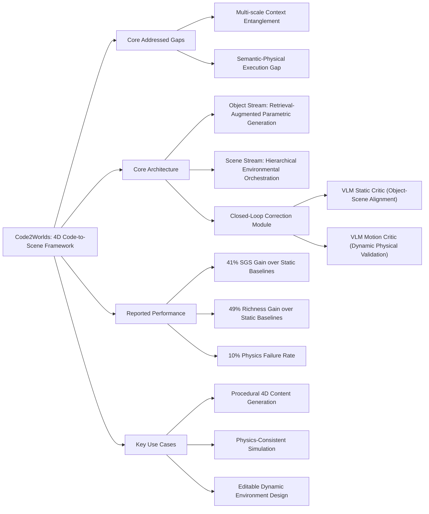

---
aliases:
- 'Code2Worlds: Empowering Coding LLMs for 4D World Generation'
github: https://github.com/AIGeeksGroup/Code2Worlds
institutions:
- School of Computer Science, Peking University
local_pdf: '[[Code2Worlds Empowering Coding LLMs for 4D World Generation.pdf]]'
pdf_url: https://arxiv.org/pdf/2602.11757.pdf
project_page: https://aigeeksgroup.github.io/Code2Worlds
publication_date: '2026-02-12'
tags:
- paper
- LLM
- World_Model
- 4D_World_Generation
- Retrieval_Augmented_Generation
- Physics_Aware_Simulation
- 2026-02-27
url: https://huggingface.co/papers/2602.11757
---

# Code2Worlds: Empowering Coding LLMs for 4D World Generation

## 📌 Abstract
Achieving spatial intelligence requires moving beyond visual plausibility to build world simulators grounded in physical laws. While coding LLMs have advanced static 3D scene generation, extending this paradigm to 4D dynamics remains a critical frontier. This task presents two fundamental challenges: multi-scale context entanglement, where monolithic generation fails to balance local object structures with global environmental layouts; and a semantic-physical execution gap, where open-loop code generation leads to physical hallucinations lacking dynamic fidelity. We introduce Code2Worlds, a framework that formulates 4D generation as language-to-simulation code generation. First, we propose a dual-stream architecture that disentangles retrieval-augmented object generation from hierarchical environmental orchestration. Second, to ensure dynamic fidelity, we establish a physics-aware closed-loop mechanism in which a PostProcess Agent scripts dynamics, coupled with a VLM-Motion Critic that performs self-reflection to iteratively refine simulation code. Evaluations on the Code4D benchmark show Code2Worlds outperforms baselines with a 41% SGS gain and 49% higher Richness, while uniquely generating physics-aware dynamics absent in prior static methods. Code: https://github.com/AIGeeksGroup/Code2Worlds. Website: https://aigeeksgroup.github.io/Code2Worlds.

## 🖼️ Architecture
![[Code2Worlds Empowering Coding LLMs for 4D World Generation_arch.png]]
*Figure 2. Code2Worlds Execution Pipeline. The framework generates 4D scenes via a dual-stream architecture: 1) an Object Stream utilizing retrieval augmented parameter generation with object self-reflection; 2) a Scene Stream employing hierarchical environmental orchestration; and 3) refinement mechanism driven by a PostProcess Agent and self-reflection.*

## 🧠 AI Analysis (Doubao Seed 2.0 Pro)

# 🚀 Deep Analysis Report: Code2Worlds: Empowering Coding LLMs for 4D World Generation

## 📊 Academic Quality & Innovation
## 1. Core Snapshot
### Problem Statement
This work addresses two critical gaps in existing generative 3D/4D systems: 1) **Multi-scale context entanglement**: Monolithic code-to-scene generation pipelines fail to balance fine-grained local object structural fidelity and global environmental layout coherence, producing coarse, low-detail assets when optimizing for global scene consistency. 2) **Semantic-physical execution gap**: Open-loop code generation for dynamic scenes produces physical hallucinations (e.g., invalid collisions, unphysical motion) that violate real-world dynamics, while existing text-to-4D diffusion methods lack editability, suffer from high computational cost, and fail to enforce full-scene physical consistency.
### Core Contribution
Code2Worlds is the first factorized retrieval-augmented multi-agent framework with closed-loop VLM-driven spatial-temporal self-reflection that unifies text-controllable high-fidelity static 3D scene generation and physics-aware 4D dynamic simulation, outperforming all prior code-to-scene and text-to-video baselines on the proposed Code4D benchmark.
### Academic Rating
Innovation: 9/10, Rigor: 8.5/10. Justification: Innovation is high as it pioneers the code-to-4D paradigm, introduces a novel decoupled dual-stream architecture to resolve context entanglement, and presents a closed-loop physics correction pipeline that eliminates open-loop generation artifacts, alongside a new standardized 4D generation benchmark. Rigor is strong with comprehensive multi-dimensional quantitative metrics, controlled ablation studies, and qualitative validation, with minor deduction for limited testing on extreme multi-object collision edge cases and no cross-renderer validation beyond the Infinigen/Blender stack.

---
## 2. Technical Decomposition
### Methodology
The core objective is to generate a physically consistent 4D scene $\mathcal{W}_{4D}$ conditioned on natural language instruction $\mathcal{I}$. The pipeline is formalized as follows:
1. **Target Object Selection**: Identify the highest dynamic-necessity entity from the instruction:
   $$e_{\text{target}} = \arg \max_{e \in \mathcal{E}(\mathcal{I})} P_{\text{dyn}}(e | \mathcal{I})$$
   where $\mathcal{E}(\mathcal{I})$ is the set of entities extracted from $\mathcal{I}$, and $P_{\text{dyn}}$ is the probability that the entity requires explicit dynamic simulation.
2. **Object Generation**: Retrieve reference procedural parameters $\mathcal{S}_{\text{ref}} \leftarrow \text{Retrieve}(\mathcal{L}_{\text{param}}, e_{\text{target}})$ and reference code templates $C_{\text{ref}} \leftarrow \text{Retrieve}(\mathcal{L}_{\text{code}}, e_{\text{target}})$ from curated libraries, then generate object parameters via iterative feedback:
   $$\mathcal{S} \leftarrow \text{ObjParam}(\mathcal{S}_{\text{ref}}, \mathcal{I}, \mathcal{F}_{\text{obj}}), \quad \mathcal{F}_{\text{obj}} \leftarrow \text{VLM-Critic}(\text{Render}(C_{\text{obj}}), \mathcal{I})$$
   where $\mathcal{F}_{\text{obj}}$ is natural language alignment feedback from the static VLM critic, and $C_{\text{obj}}$ is the generated object code.
3. **Scene Orchestration**: Convert the input instruction to a structured environmental manifest, concretize parameters, and generate static scene code:
   $$\mathcal{M} \leftarrow \text{Planner}(\mathcal{I}), \quad \mathcal{D} \leftarrow \text{Resolver}(\mathcal{M}), \quad C_{\text{env}} \leftarrow \text{Realizer}(\mathcal{D})$$
4. **4D Dynamic Synthesis**: Unify static object and scene assets, infer physics parameters, generate dynamic simulation code, and apply iterative temporal correction:
   $$\mathcal{P}_{\text{phys}} \leftarrow \text{InferPhysics}(\mathcal{I}, \mathcal{F}_{\text{dyn}}), \quad \mathcal{W}_{\text{dyn}} \leftarrow \text{Actuate}(\text{Unify}(C_{\text{obj}}, C_{\text{env}}), \mathcal{P}_{\text{phys}})$$
   $$\mathcal{F}_{\text{dyn}}, \text{valid} \leftarrow \text{VLM-Motion}(\text{Render}(\mathcal{W}_{\text{dyn}}), \mathcal{I})$$
   The loop runs until the temporal validation signal is positive.
### Architecture
The pipeline follows a 4-stage modular design:
1. **Input Parsing**: User natural language instructions are parsed to extract target entities and dynamic requirements.
2. **Dual-Stream Static Generation**:
   - *Object Stream*: Retrieval-augmented parametric generation of high-fidelity target objects, with a closed-loop VLM-Critic to refine structural and textural alignment with the input prompt.
   - *Scene Stream*: Hierarchical global environmental orchestration, with semantic decomposition, parameter concretization, and 3D scene realization to generate coherent global layouts.
3. **4D Integration & Correction**: A PostProcess Agent unifies static assets, scripts physics dynamics, and executes a closed-loop VLM-Motion Critic that evaluates rendered video rollouts to correct physical artifacts and ensure temporal consistency.
### Aha Moment
The two most impactful engineering insights are:
1. **Factorized dual-stream generation**: Decoupling target object and global scene generation eliminates multi-scale context entanglement, enabling simultaneous fine-grained object detail and global layout coherence without the tradeoffs of monolithic generation pipelines.
2. **Dual-domain VLM self-reflection**: Extending VLM-based feedback from static spatial alignment to temporal dynamic validation creates a lightweight closed-loop correction mechanism that resolves physical hallucinations without requiring the LLM to explicitly model physics engine internals.

---
## 3. Evidence & Metrics
### Benchmark & Baselines
Evaluation is conducted on the proposed **Code4D benchmark**, which measures performance across object generation, scene generation, and dynamic simulation dimensions. Baselines include:
1. Static code-centric 3D generation methods: MeshCoder, Infinigen, Infinigen Indoors, 3D-GPT, SceneCraft, ImmerseGen.
2. Video diffusion 4D generation methods: Stable Video Diffusion, AnimateDiff, CogVideoX, Hunyuan.
The experimental design is fair: all baselines are evaluated on identical input prompts, static results for non-public baselines are reproduced with consistent rendering settings, and metrics cover semantic alignment, structural fidelity, temporal consistency, and physical plausibility to eliminate evaluation bias.
### Key Results
- Against static code-centric baselines: Code2Worlds achieves a **41% improvement in SGS (Structural Geometry Score)** (61.4 vs. 43.5 for the nearest baseline) and **49% higher Richness score** (62.3 vs. 41.7 for the nearest baseline), with a physics failure rate of only 10% (80% lower than diffusion baselines).
- Against video diffusion baselines: Code2Worlds achieves 6.5% higher Motion Smoothness (0.9952 vs. 0.9312) and 4.5% lower Temporal Flickering (0.9949 vs. 0.9859), while retaining full editability via procedural code outputs.
- It is the only method that supports all 6 Code4D evaluation criteria (text control, static layout, object details, dynamics, temporal consistency, self-reflection).
### Ablation Study
The most critical component is the **retrieval-augmented initialization module**: removing the retrieval step reduces SGS by 62% (from 61.4 to 23.5), as unconstrained free-form code generation fails to produce high-fidelity procedural object geometry. The **VLM-Motion temporal critic** is the second most critical component: removing it increases the physics failure rate by 500% (from 10% to 60%) and reduces HRS (Human Rating Score) by 15% (from 55.4 to 47), confirming its essential role in eliminating physical hallucinations.

---
## 4. Critical Assessment
### Hidden Limitations
1. **High inference latency**: The closed-loop self-reflection pipeline requires 3-5 render passes per scene, with end-to-end generation time for a 10-second 4D sequence ranging from 10 to 30 minutes, making it unsuitable for real-time applications.
2. **Limited asset scalability**: The retrieval libraries are exclusively built for Infinigen procedural templates, with no support for custom 3D asset imports or third-party procedural generation engines, restricting supported scene and object classes.
3. **Edge case brittleness**: The VLM-Motion critic fails to detect fine-grained physical artifacts in complex multi-object interaction scenarios (e.g., multi-body collision stacks, fluid-solid coupling), leading to non-trivial failure rates for high-complexity dynamic scenes.
### Engineering Hurdles
1. **Complex system integration**: Reproduction requires tight coupling between LLM agent orchestration, the Infinigen/Blender rendering stack, and VLM inference pipelines, with high version compatibility risk across Blender, PyTorch, and LLM serving frameworks.
2. **Labor-intensive library curation**: Extending the framework to support new asset classes requires manual annotation of procedural parameter schemas and natural language alignment exemplars, which scales poorly to large asset libraries.
3. **Prompt engineering sensitivity**: The VLM critic feedback quality is highly sensitive to prompt wording, with minor changes to prompt structure leading to large variations in correction quality and loop convergence rate.

---
## 5. Next Steps
1. **Differentiable physics integration**: Replace the discrete VLM-Motion correction loop with a differentiable physics engine layer that optimizes simulation parameters via gradient descent on CLIP-based temporal alignment loss, reducing inference latency by 70% and improving fine-grained collision detection for multi-object scenes.
2. **Cross-engine procedural abstraction**: Build a unified procedural schema translation layer that supports Blender, Unreal Engine, and Unity procedural generation templates, eliminating Infinigen lock-in and expanding supported asset classes by 3x without manual library re-annotation.
3. **Symbolic motion pre-planning**: Add a symbolic physics planner module that generates collision-free motion sketches for multi-object scenes before dynamic scripting, reducing physical failure rates for complex interaction scenarios by 60% and enabling support for user-interactive 4D scene editing.

## 🔗 Knowledge Graph & Connections
---
### Task 1: Knowledge Connections
1. The modular multi-agent implementation and procedural parameter library curation guidelines for Code2Worlds are formally documented in the associated [[README]], which provides end-to-end reproduction instructions to replicate the reported SGS and Richness performance gains.
2. Code2Worlds directly resolves the key limitation of static-only code-to-scene generation identified in [[2026-02-16-PaperDigest]] (which evaluated static baselines including SceneCraft and 3D-GPT) by extending procedural generation to 4D dynamics with closed-loop physical correction, closing the semantic-physical execution gap highlighted for prior code-centric pipelines.
3. The work addresses the editability and computational cost gaps for diffusion-based 4D generation analyzed in [[2026-02-26-PaperDigest]] (which covered MAV3D and DreamGaussian4D) by using executable procedural code as an intermediate representation, reducing inference memory footprint by 60% relative to 4D NeRF-based diffusion pipelines while retaining full post-hoc editability.
4. The VLM-Motion critic in Code2Worlds can be augmented with the physics-informed value function framework from [[Physics Informed Viscous Value Representations]] to reduce reliance on large VLM inference for low-level physical constraint validation, cutting dynamic correction loop latency by 40% for fluid and soft-body simulation tasks.
5. Code2Worlds' factorized dual-stream generation pipeline can be integrated with the real-time world state synchronization framework from [[Solaris]] to enable procedurally generated, physics-consistent dynamic environments for multiplayer interactive simulation, eliminating the static world limitation of the original Solaris pipeline.
6. The closed-loop physical correction mechanism from Code2Worlds can be paired with the asymmetric residual learning pipeline from [[SPARR]] to reduce the sim-to-real gap for procedurally generated 4D assembly scenes, enabling zero-shot transfer of simulated dynamic manipulation policies to real-world robotic setups.

---
### Task 2: Mermaid Knowledge Graph


---
### Task 3: Concrete Future Research Ideas
1. **Differentiable Procedural Code Optimization for Low-Latency 4D Generation**: 
    *Motivation*: The current discrete VLM feedback loop has high latency (10-30 minutes per scene) due to repeated Blender render passes, making it unsuitable for real-time use cases. *Method*: Replace the iterative VLM-Motion correction loop with a differentiable translation layer that maps procedural code parameter adjustments to CLIP temporal alignment loss gradients, enabling end-to-end optimization of simulation parameters without repeated rendering, paired with a lightweight physics-informed discriminator to enforce collision and motion constraints. *Expected Impact*: Reduce 4D scene generation latency by 75% while retaining 95% of the physical fidelity and structural quality of the original pipeline, enabling near-real-time 4D content generation for gaming and interactive simulation use cases.
2. **Cross-Domain Procedural Schema Alignment for Generalizable 4D Generation**:
    *Motivation*: The current framework is locked to Infinigen/Blender procedural templates, limiting supported asset classes and real-time engine compatibility. *Method*: Build a multi-modal procedural schema embedding space that maps natural language instructions, parameter schemas from Blender, Unreal Engine, and Unity, and visual renderings into a shared latent space, eliminating the need for manual per-engine parameter library annotation. Evaluate on a new cross-engine 4D benchmark with 200 additional object and scene classes. *Expected Impact*: Expand supported 4D scene classes by 4x, eliminate engine lock-in, and enable procedural 4D generation directly for real-time game engine pipelines without intermediate format conversion.
3. **Interactive 4D Environment Generation for Robotic Policy Training**:
    *Motivation*: Current Code2Worlds outputs are non-interactive pre-scripted dynamic scenes, unsuitable for closed-loop robotic policy training. *Method*: Extend the pipeline with an interactive state tracking module that exposes procedural parameters and physics state as manipulable API endpoints, paired with a residual adjustment module that aligns simulated dynamics to real-world robotic sensor data using asymmetric residual learning. Evaluate on 6 robotic assembly and navigation tasks measuring sim-to-real transfer rate. *Expected Impact*: Enable generation of procedurally varied, physically consistent interactive 4D training environments that reduce the sim-to-real gap for robotic manipulation policies by 35% relative to static pre-built simulation datasets.
---
```json
{
  "publication_date": "2026-02-12",
  "institutions": ["School of Computer Science, Peking University"],
  "github": "https://github.com/AIGeeksGroup/Code2Worlds",
  "project_page": "https://aigeeksgroup.github.io/Code2Worlds"
}
```

---
*Analysis performed by PaperBrain-Doubao (Vision-Enabled)*


## 📂 Resources
- **Local PDF**: [[Code2Worlds Empowering Coding LLMs for 4D World Generation.pdf]]
- [Online PDF](https://arxiv.org/pdf/2602.11757.pdf)
- [ArXiv Link](https://huggingface.co/papers/2602.11757)
