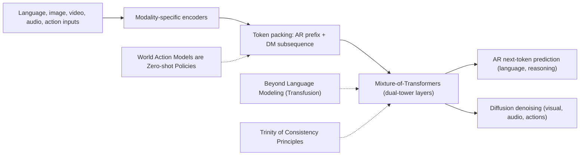

---
tags:
- paper
- domain/embodied_ai
- domain/multimodal_perception
- domain/reinforcement_learning
- domain/vla
- domain/world_model
- impact/high_value
- method/benchmark
- method/diffusion_policy
- method/foundation_model
- method/planning
- method/reinforcement_learning
- method/simulation
- review/auto_tagged
- status/unread
- task/planning_reasoning
- task/scene_understanding
- task/video_prediction
- type/benchmark
- type/system
aliases:
- 'Cosmos 3: Omnimodal World Models for Physical AI'
- Cosmos 3
- Omnimodal World Models
- Mixture-of-Transformers
- Physical AI
- Unified World Model
- Omnimodal Transformers
- Joint Generation Model
- Action-Aware Model
- Omnimodal Architecture
authors:
- Aditi
- Niket Agarwal
- Arslan Ali
- Jon Allen
- Martin Antolini
- Adeline Aubame
- Alisson Azzolini
- Junjie Bai
- Maciej Bala
- Yogesh Balaji
- Josh Bapst
- Aarti Basant
- Mukesh Beladiya
- Mohammad Qazim Bhat
- Zaid Pervaiz Bhat
- Dan Blick
- Vanni Brighella
- Han Cai
- Tiffany Cai
- Eric Cameracci
- Jiaxin Cao
- Yulong Cao
- Mark Carlson
- Carlos Casanova
- Ting-Yun Chang
- Yan Chang
- Yu-Wei Chao
- Prithvijit Chattopadhyay
- Roshan Chaudhari
- Chieh-Yun Chen
- Junyu Chen
- Ke Chen
- Qizhi Chen
- Wenkai Chen
- Xiaotong Chen
- Yu Chen
- An-Chieh Cheng
- Click Cheng
- Xiu Chia
- Jeana Choi
- Chaeyeon Chung
- Wenyan Cong
- Yin Cui
- Magdalena Dadela
- Nalin Dadhich
- Wenliang Dai
- Joyjit Daw
- Alperen Degirmenci
- Rodrigo Vieira Del Monte
- Robert Denomme
- Sameer Dharur
- Marco Di Lucca
- Ke Ding
- Wenhao Ding
- Yifan Ding
- Yuzhu Dong
- Nicole Drumheller
- Yilun Du
- Aigul Dzhumamuratova
- Aleksandr Efitorov
- Hamid Eghbalzadeh
- Naomi Eigbe
- Imad El Hanafi
- Hassan Eslami
- Benedikt Falk
- Jiaojiao Fan
- Jim Fan
- Amol Fasale
- Sergiy Fefilatyev
- Liang Feng
- Francesco Ferroni
- Sanja Fidler
- Xiao Fu
- Vikram Fugro
- Prashant Gaikwad
- TJ Galda
- Katelyn Gao
- Yihuai Gao
- Wenhang Ge
- Sreyan Ghosh
- Arushi Goel
- Vivek Goel
- Akash Gokul
- Rama Govindaraju
- Jinwei Gu
- Miguel Guerrero
- Elfie Guo
- Aryaman Gupta
- Siddharth Gururani
- Hugo Hadfield
- Song Han
- Ankur Handa
- Zekun Hao
- Mohammad Harrim
- Ali Hassani
- Nathan Hayes-Roth
- Yufan He
- Chris Helvig
- Cyrus Hogg
- Madison Huang
- Michael Huang
- Sophia Huang
- Yufan Huang
- Jacob Huffman
- DeLesley Hutchins
- Suneel Indupuru
- Boris Ivanovic
- Arihant Jain
- Joel Jang
- Ryan Ji
- Yanan Jian
- Dongfu Jiang
- Jingyi Jin
- Atharva Joshi
- Nikhilesh Joshi
- Pranjali Joshi
- Jaehun Jung
- Weiwei Kang
- Scott Kassekert
- Jan Kautz
- Ashna Khetan
- Julia Kiczka
- Slawek Kierat
- Gwanghyun Kim
- Kuno Kim
- Sunny Kim
- Kezhi Kong
- Xin Kong
- Zhifeng Kong
- Tomasz Kornuta
- Egor Krivov
- Hui Kuang
- Saurav Kumar
- Chia-Wen Kuo
- George Kurian
- Wojciech Kutak
- JF Lafleche
- Himangshu Lahkar
- Omar Laymoun
- Jayjun Lee
- Sanggil Lee
- Gabriele Leone
- Boyi Li
- Freya Li
- Jiajun Li
- Jinfeng Li
- Ling Li
- Pengcheng Li
- Shangru Li
- Tingle Li
- Xiaolong Li
- Xuan Li
- Zhaoshuo Li
- Zhiqi Li
- Hao Liang
- Maosheng Liao
- Chen-Hsuan Lin
- Tsung-Yi Lin
- Ming-Yu Liu
- Sifei Liu
- Zihan Liu
- Hai Loc Lu
- Xiangyu Lu
- Alice Luo
- Ruipu Luo
- Wenjie Luo
- Jiangran Lyu
- Martin Ding Ma
- Nic Ma
- Qianli Ma
- Dawid Majchrowski
- Louis Marcoux
- Miguel Martin
- Qing Miao
- Ashkan Mirzaei
- Shreyas Misra
- Kaichun Mo
- Durra Mohsin
- Hyejin Moon
- Pawel Morkisz
- Saeid Motiian
- Kirill Motkov
- Seungjun Nah
- Yashraj Narang
- Deepak Narayanan
- Thabang Ngazimbi
- Julian Ouyang
- David Page
- Yatian Pang
- Sehwi Park
- Mahesh Patekar
- Mostofa Patwary
- Marco Pavone
- Trung Pham
- Wei Ping
- Soha Pouya
- Shrimai Prabhumoye
- Varun Praveen
- Delin Qu
- Hesam Rabeti
- Morteza Ramezanali
- Marilyn Reeb
- Xuanchi Ren
- Kristen Rumley
- Wojciech Rymer
- Jun Saito
- Yeongho Seol
- John Shao
- Piyush Shekdar
- Tianwei Shen
- Humphrey Shi
- Min Shi
- Stella Shi
- Kevin Shih
- Mohammad Shoeybi
- Mateusz Sieniawski
- Shuran Song
- Alexander Sotelo
- Amir Sotoodeh
- Sunil Srinivasa
- Vignesh Srinivasakumar
- Bartosz Stefaniak
- Rahul Heinrich Steiger
- Shangkun Sun
- Jiaxiang Tang
- Shitao Tang
- Yangyang Tang
- Yue Tang
- Tolou Tavakkoli
- Kayley Ting
- Krzysztof Tomala
- Wei-Cheng Tseng
- Jibin Varghese
- Sergei Vasilev
- Thomas Volk
- Raju Wagwani
- Roger Waleffe
- Andrew Z. Wang
- Boxiang Wang
- Haoxiang Wang
- Qiao Wang
- Shihao Wang
- Shijie Wang
- Ting-Chun Wang
- Yan Wang
- Yu Wang
- David Wehr
- Fangyin Wei
- Xinshuo Weng
- Jay Zhangjie Wu
- Kedi Wu
- Hongchi Xia
- Summer Xiao
- Tianjun Xiao
- Kevin Xie
- Daguang Xu
- Jiashu Xu
- Mengyao Xu
- Ruqing Xu
- Xingqian Xu
- Yao Xu
- Dinghao Yang
- Dong Yang
- Hans Yang
- Xiaodong Yang
- Xuning Yang
- Yichu Yang
- Yurong You
- Zhiding Yu
- Hao Yuan
- Simon Yuen
- Xiaohui Zeng
- Pengcuo Zeren
- Cindy Zha
- Haotian Zhang
- Jenny Zhang
- Jing Zhang
- Liangkai Zhang
- Paris Zhang
- Shun Zhang
- Xuanmeng Zhang
- Zhizheng Zhang
- Ann Zhao
- Yilin Zhao
- Yuliya Zhautouskaya
- Charles Zhou
- Fengzhe Zhou
- Shilin Zhu
- Yuke Zhu
- Dima Zhylko
- Artur Zolkowski
paper_id: arxiv:2606.02800
arxiv_id: '2606.02800'
url: https://huggingface.co/papers/2606.02800
pdf_url: https://arxiv.org/pdf/2606.02800.pdf
local_pdf: '[[Cosmos 3 Omnimodal World Models for Physical AI.pdf]]'
github: https://github.com/nvidia/cosmos
project_page: https://research.nvidia.com/labs/cosmos-lab/cosmos3
institutions:
- NVIDIA
publication_date: '2026-06-04'
metadata_publication_date: '2026-06-01'
score: '8.9'
domains:
- embodied_ai
- multimodal_perception
- reinforcement_learning
- vla
- world_model
methods:
- benchmark
- planning
- reinforcement_learning
- simulation
tasks:
- planning_reasoning
- scene_understanding
paper_type: benchmark
impact_band: high_value
reading_status: unread
priority_score: 116
review_status: auto_tagged
next_action: inspect_protocol
year: 2026
---

# Cosmos 3: Omnimodal World Models for Physical AI

## 📌 Abstract
We introduce Cosmos 3, a family of omnimodal world models designed to jointly process and generate language, image, video, audio, and action sequences within a unified mixture-of-transformers architecture. By supporting highly flexible input-output configurations, Cosmos 3 seamlessly unifies critical modalities for Physical AI -- effectively subsuming vision-language models, video generators, world simulators, and world-action models into a single framework. Our evaluation demonstrates that Cosmos 3 establishes a new state-of-the-art across a diverse suite of understanding and generation tasks, demonstrating omnimodal world models as scalable, general-purpose backbones for embodied agents. Our post-trained Cosmos 3 models were ranked as the best open-source Text-to-Image and Image-to-Video models by Artificial Analysis, and the best policy model by RoboArena at the time the technical report was written. To accelerate open research and deployment in Physical AI, we make our code, model checkpoints, curated synthetic datasets, and evaluation benchmark available under the Linux Foundation's OpenMDW-1.1 https://openmdw.ai/license/1-1/ License at https://github.com/nvidia/cosmos}{github.com/nvidia/cosmos and https://huggingface.co/collections/nvidia/cosmos3 . The project website is available at https://research.nvidia.com/labs/cosmos-lab/cosmos3 .

## 🖼️ Architecture
![[Cosmos 3 Omnimodal World Models for Physical AI_arch.png]]

## 🧠 AI Analysis
## Abstract
We introduce Cosmos 3, a family of omnimodal world models designed to jointly process and generate language, image, video, audio, and action sequences within a unified mixture-of-transformers architecture.  
By supporting highly flexible input‑output configurations, Cosmos 3 seamlessly unifies critical modalities for Physical AI—effectively subsuming vision‑language models, video generators, world simulators, and world‑action models into a single framework.  
Our evaluation demonstrates that Cosmos 3 establishes a new state‑of‑the‑art across a diverse suite of understanding and generation tasks, demonstrating omnimodal world models as scalable, general‑purpose backbones for embodied agents.  
Our post‑trained Cosmos 3 models were ranked as the best open‑source Text‑to‑Image and Image‑to‑Video models by Artificial Analysis, and the best policy model by RoboArena at the time the technical report was written.  
To accelerate open research and deployment in Physical AI, we make our code, model checkpoints, curated synthetic datasets, and evaluation benchmark available under the Linux Foundation’s OpenMDW‑1.1 License at [GitHub](https://github.com/nvidia/cosmos) and [Hugging Face](https://huggingface.co/collections/nvidia/cosmos3). The project website is at [research.nvidia.com/labs/cosmos‑lab/cosmos3](https://research.nvidia.com/labs/cosmos-lab/cosmos3).

Cosmos 3 is a single model family that handles language, pictures, videos, sound, and robot actions together. It can reason like a vision‑language model or generate future scenes and actions like a simulator, all inside one network instead of switching between separate tools.

## 1. Core Snapshot

### Problem Statement
Physical AI agents must perceive their surroundings, reason about what to do next, and generate actions or future states.  
The input is partial observations from cameras, microphones, and sensors, while the output is either language‑based plans or sequences of images, audio, and control signals.  
The real bottleneck is that prior work kept understanding models separate from generation models, forcing robots to stitch together vision‑language models, video generators, and policy networks at deployment time.

This separation creates wasted computation and inconsistent internal representations because reasoning about future states should inform action prediction and vice versa.  
The problem narrows to finding one scalable backbone that can fluidly switch between understanding tasks and generation tasks without changing its architecture.

### Core Contribution
The central claim is that Cosmos 3 provides a single **Mixture‑of‑Transformers** backbone that processes language, images, video, audio, and actions in the same network and supports both autoregressive next‑token prediction for reasoning and iterative denoising for generation.  
Compared with prior separate pipelines, Cosmos 3 changes the design by placing an autoregressive subsequence first and a diffusion subsequence second inside every transformer layer, then routing them through two distinct but jointly attending towers.  
Evidence comes from Table 1, where the post‑trained Cosmos3‑Super variant reaches 73.7 on reasoning benchmarks and 91.36 on text‑to‑image tasks while outperforming specialised open‑source baselines across most listed capabilities.

### Innovation Origin & Rationale
The design originates from the observation that **understanding and generation are coupled capabilities**: reasoning about consequences requires generating plausible futures, while generation benefits from structured world representations learned through reasoning.  
A prior limitation was that unified models either stayed purely autoregressive or purely generative, so the authors created two parallel parameter sets inside each layer to preserve both strengths.  
This is an explicit paper motivation rather than pure interpretation.

## 2. Reading Map
The paper targets readers interested in embodied AI, world models, and multimodal generation for robotics.  
The task domain is Physical AI agents that must both understand scenes and simulate or act inside them.  
On a first pass, read the Introduction and the high‑level Figure 1 to grasp the unification claim, then Section 2 for architecture and Section 6 for results.  
Section 3 on data and Section 5 on infrastructure can be skimmed unless preparing for reproduction.  
Focus later on the action token details in Section 2.1.3 and the token arrangement rules in Section 2.2 because they define how the model switches between modes.

## 3. Method Walkthrough

### Inputs, Outputs, And Assumptions
The method receives interleaved sequences that can mix discrete language tokens, ViT‑encoded images or video frames, VAE‑encoded visual tokens, audio tokens, and action vectors.  
It outputs either next language tokens through autoregressive prediction or denoised visual, audio, or action tokens through flow‑matching style denoising.  
The core assumption is that **all modalities can share the same transformer hidden dimension** after linear projection and that position embeddings can align them on a common physical timeline.

This assumption matters because mismatched sampling rates across video, audio, and actions would otherwise break consistency; if it fails, generated videos would drift out of sync with generated actions.

### Pipeline From Data To Prediction
First, modality‑specific encoders turn raw inputs into tokens.  
Language tokens stay as discrete IDs.  
Images and videos for understanding go through a ViT encoder (see [Vision Transformer](https://en.wikipedia.org/wiki/Vision_transformer) for background), while those for generation go through a frozen **VAE encoder** (learn about VAE basics at [Variational Autoencoder](https://en.wikipedia.org/wiki/Variational_autoencoder)) that compresses spatially and temporally.  
Audio uses a separate frozen VAE, and actions are projected by domain‑specific linear layers that map different robot or camera formats into a shared space.

Next, the tokens are packed into one long sequence: an *autoregressive prefix* containing text and ViT vision tokens comes first, followed by a *diffusion subsequence* that holds noisy or conditioning tokens from VAE, audio, and action encoders.  
Inside every transformer layer, the autoregressive tokens are processed by one set of weights while the diffusion tokens use another set, yet both attend jointly so generation stays conditioned on the reasoning prefix.

Finally, during inference the model either continues the autoregressive prefix with next‑token sampling or iteratively denoises the diffusion tokens until they match the learned distribution.

### Key Design Choices
The **dual‑tower layer structure** inside the Mixture‑of‑Transformers lets the reasoner tower keep its original VLM weights for strong language reasoning while the generator tower learns to denoise high‑fidelity visuals.  
Without separate parameters, the model would either lose reasoning quality or generation quality. The simpler alternative of a single shared tower was rejected because the paper states the two tasks require different internal computations.

Domain‑aware input and output projections for **actions** preserve embodiment‑specific lengths while sharing the backbone; removing them would force all robots into one fixed action vector length and lose fine‑grained control signals.

The **absolute temporal modulation** in the position embedding aligns tokens from different modalities to the same physical clock even when their frame rates differ. Without it, audio tokens sampled at 25 fps could not stay synchronised with video tokens at a different temporal compression ratio.

## 4. Core Theory And Formulas

### Main Objective
Cosmos 3 aims to model the joint distribution over multimodal sequences so that the same parameters can perform both next‑token language prediction for reasoning and velocity prediction for denoising generation tokens.  
The paper does not give a single closed‑form loss equation, but the training combines standard language modelling on the autoregressive subsequence with flow‑matching objectives on the diffusion subsequence (for flow‑matching background, see [“Flow Matching for Generative Modeling”](https://arxiv.org/abs/2210.02747)).

### Important Equations

#### Action Input Projection
The action input projection maps an embodiment‑specific vector into the shared model dimension:

$$ z = W^{(k)}_{\text{in}} x + b^{(k)}_{\text{in}} $$

- ($z$) : latent action token fed to the transformer  
- ($x$) : normalised action vector from one domain (e.g., robot gripper states)  
- ($W^{(k)}_{\text{in}}$) and ($b^{(k)}_{\text{in}}$) : learned weights and bias that belong only to domain \(k\) (the superscript indexes the embodiment type)  

This equation increases alignment with other modalities when the domain‑specific matrix correctly compensates for different action lengths. It decreases alignment when the projection is removed and all domains share one matrix, because the shared matrix cannot represent both 9‑DOF vehicle steering and 29‑DOF humanoid states equally well.

#### Joint Attention for Diffusion Tokens
The diffusion tokens attend to all keys and values from both subsequences:

$$ O_{\text{DM}} = \mathrm{Attn}_{\text{full}}\bigl(Q_{\text{DM}},\ [K_{\text{AR}} ; K_{\text{DM}}],\ [V_{\text{AR}} ; V_{\text{DM}}]\bigr) $$

- ($Q_{\text{DM}}$) : queries from diffusion tokens  
- ($[K_{\text{AR}} ; K_{\text{DM}}]$) : concatenation of keys from the autoregressive (AR) and diffusion (DM) subsequences  
- ($[V_{\text{AR}} ; V_{\text{DM}}]$) : corresponding values  

Every noisy video token can see the text prompt in the autoregressive part while also attending to other conditioning frames. The causal mask on the autoregressive part prevents text tokens from being inadvertently changed by later diffusion tokens.

### Algorithmic Intuition
Training proceeds by packing a sample into the fixed AR‑then‑DM layout, applying noise only to the diffusion tokens, running the dual‑tower forward pass with the masked attention pattern, computing language cross‑entropy on the AR tokens, and computing velocity error on the diffusion tokens.  
At inference the user chooses the layout based on the desired mode; for example, placing only text in AR and noisy image tokens in DM produces text‑to‑image output.

## 5. Architecture, Figures, And Implementation
The core architecture appears in the left diagram of the Mixture‑of‑Transformers figure. An input sequence starts with AR tokens from language and ViT, then switches to DM tokens from VAE, audio, and action encoders.  
Each layer runs independent LayerNorm and MLP on the two subsequences but shares a single attention operation that respects the causal‑versus‑full mask shown on the right side of the same figure.

Implementation details that are present include freezing the VAE encoders, initialising both towers from a pre‑trained VLM, and using domain‑specific linear layers only for action projection. Missing details include the exact flow‑matching schedule coefficients and the token counts used for each modality in the long‑context training runs.

## 6. Experiments And Evidence
Table 1 reports that Cosmos3‑Super scores 73.7 on reasoning, 57.8 on general generation, and 91.36 on text‑to‑image after post‑training, outperforming Qwen3‑VL‑32B on most shared metrics.  
The table also shows the post‑trained policy variant reaches competitive numbers on DROID robot tasks. The experiment answers whether a single model can match or exceed specialised open‑source systems across understanding and generation; the results support the claim on the listed benchmarks.

The ablation on synthetic data impact in appendix C7 examines whether adding the five SDG datasets improves video and action quality, but the text does not report the exact delta values. The paper therefore provides strong leaderboard evidence yet limited transparency on which data sources drive the largest gains.

## 7. Strengths, Limitations, And Failure Cases
A clear strength is the flexible input‑output layout that lets the same checkpoint act as a vision‑language model, text‑to‑video generator, or robot policy without any code changes; evidence is the post‑training recipes in Section 4.2 that keep the architecture fixed.  
> [!info] Open Release  
> The paper releases code, weights, synthetic datasets, and evaluation benchmark, which lowers the barrier for reproduction and extension.

Limitations include the dependence on frozen VAE encoders, which may cap the highest visual fidelity if those encoders were trained on narrower data distributions.  
> [!warning] Missing Long‑Horizon Evaluation  
> The paper does not report failure cases such as long‑horizon action drift or audio‑video desynchronisation; the behaviour over long rollouts on real hardware remains unvalidated. Scalability to real robot hardware is also not addressed beyond the DROID post‑training example.

## 8. Reproduction Notes
Available resources include the Cosmos3‑Super and Cosmos3‑Nano checkpoints on Hugging Face, five synthetic datasets tagged `SDG‑*`, and the Cosmos‑HUE evaluation benchmark.  
Preprocessing details for action vectors are given in Section 2.1.3: ego and effector poses use 3‑DOF translation plus 6‑DOF rotation, while grasp states are kept as raw open‑close values.  
Training protocols appear in Section 4 but lack the precise learning‑rate schedule, batch size, and number of GPUs used for the pre‑training run.

Evaluation uses standard metrics such as the numbers listed in Table 1 together with human preference rankings from Artificial Analysis and RoboArena. Missing details are the exact flow‑matching noise schedule and the checkpointing frequency during the multi‑stage training described in Section 5.2.

## 9. What To Read Closely
Read Section 2.1.3 on action representation and tokenisation first because the domain‑specific projections are the main addition that allows one model to handle cars, robots, and human motion.  
Next study the token arrangement rules and dual‑stream attention mask in Section 2.2 and Figure 5 because these two choices determine all supported generation modes.  
The results table and the action generation evaluation in Section 6.2.5 deserve close inspection to understand where the unified model does and does not yet match specialised policies.  
The data section and infrastructure section can be read more lightly unless the goal is immediate reproduction.

## 10. Research Ideas And Open Questions
One idea is to test whether freezing the VAE encoder limits long‑term video coherence by replacing it with a jointly trained visual tokenizer on a small set of robot videos and measuring frame‑wise PSNR and action prediction accuracy after one week of fine‑tuning. The metric to check is whether joint training reduces accumulated drift over 30‑second rollouts; the risk is that the added training instability could erase the original text‑to‑image quality that the paper already demonstrated.

A second idea is to add a new embodiment domain such as a quadruped robot by learning only the domain‑specific projection layers on a few hours of walking data while keeping the rest of the model frozen, then evaluate zero‑shot transfer of the shared world representation on a navigation task. Success would be measured by lower action prediction error compared with training a fresh policy head; the risk is that the geometric components chosen for action vectors do not capture leg kinematics well enough, causing the shared backbone to ignore useful signals.

A third idea is to measure how much the reasoner tower actually improves generator quality by ablating the joint attention connection during mid‑training and comparing the resulting video FID scores on the SDG datasets. The observation to track is whether severing the attention link increases visual artifacts on long‑horizon predictions after two weeks of training; the risk is that the ablation could be too destructive and collapse generation entirely, making the comparison uninformative.

## Knowledge Graph & Connections

#### Related Work Connections

This paper connects to the reading note on **[[The Trinity of Consistency as a Defining Principle for General World Models]]**. That work proposes that general world models must satisfy modal, spatial, and temporal consistency. Cosmos 3 addresses modal consistency through its joint attention mechanism linking autoregressive and diffusion subsequences, which enables language reasoning, visual generation, and action prediction to share a unified representation. The difference is that the Trinity note stays at a conceptual level, while Cosmos 3 provides a concrete architecture and training protocol that directly implements some of those consistency principles. This implies that future designs of general world models could explicitly embed the trinity of consistency constraints to improve long‑range coherence, a direction Cosmos 3’s results encourage but does not yet systematically verify.

The note on **[[World Action Models are Zero-shot Policies]]** shares the goal of jointly modelling world dynamics and actions within a single network, specifically in the context of robotic control. DreamZero uses a pure video‑diffusion backbone with autoregressive action prediction, while Cosmos 3 uses a mixture‑of‑transformers that dedicates separate but interacting towers for reasoning and generation. The difference suggests that explicit separation of reasoning (AR) and generation (diffusion) may confer stronger language reasoning abilities than a purely diffusion‑based world action model, as evidenced by Cosmos 3’s superior scores on vision‑language tasks. However, DreamZero’s focus on closed‑loop control at 7 Hz shows that Cosmos 3’s approach still needs to prove its real‑time control adequacy, because the dual‑tower inference cost is likely higher.

**[[Beyond Language Modeling]]** explores the Transfusion framework, which uses a single model that can do autoregressive language processing and diffusion‑based generation but does not jointly route them through the same transformer layer. Cosmos 3 builds on a Transfusion‑like idea but advances it by placing both operations inside every transformer layer, sharing attention maps, and adding domain‑specific action projections. The difference reveals that a more tightly integrated mixture delivers stronger multimodal synergy: Cosmos 3 shows that the reasoning tower directly conditions the denoising process, whereas Transfusion typically processes modalities in separate blocks. This implies that future Transfusion‑style models could benefit from moving the fusion point deeper into each transformer layer instead of relying on post‑hoc conditioning.

---

### Concept Map

*The pipeline inside Cosmos 3 (solid arrows) and connections to related research (dashed links). The **World Action Models** note (DreamZero) relates to the token‑packing phase and the joint modelling of actions and video, but it uses a pure‑diffusion design. The **Beyond Language Modeling** note (Transfusion) influences the Mixture‑of‑Transformers concept, although Cosmos 3 integrates AR and diffusion at every layer rather than in separate blocks. The **Trinity of Consistency** framework provides theoretical motivation for the joint attention pattern that links the AR and DM towers, aiming for the consistency of generated content across modalities and time.*

---

### Questions For Future Reading

1. **What happens to multimodal consistency when the model extrapolates well beyond its training distribution?**  
   Cosmos 3 demonstrates excellent in‑domain synthesis of future scenes, but the paper does not test how its joint reasoning and generation pipeline perform when faced with novel object combinations or physical laws not seen during training. In future reading, look for experiments that purposely stress cross‑modal consistency – for instance, whether generated moving objects obey narrative constraints placed in the autoregressive prefix. Understanding failure at the boundary of knowledge can show whether the model has truly learned an internal world simulator or is merely interpolating a complex memorised mapping.

2. **Does the frozen VAE bottleneck limit the evolution of video tokens during long‑horizon generation?**  
   The VAE encoders are fixed after initial pre‑training, which means that visual details cannot improve during later training stages. When reading other work, note whether they allow end‑to‑end joint fine‑tuning of the encoder–decoder for action‑conditioned generation. Because Cosmos 3’s visual quality is gated by the VAE’s capacity, improvements in video prediction might require investing in better visual autoencoders rather than scaling the transformer. The evidence to watch for is whether drifting artifacts over long rollouts disappear when the visual encoder is continuously adapted.

3. **How does the geometry of domain‑specific action projections impact learning efficiency?**  
   Cosmos 3 maps multiple robot embodiments into a shared representation using per‑domain linear layers, which avoids catastrophic compression but raises the question of how much of the physical world model can be shared versus must be re‑learned for each new robot. In future papers, compare architectures that use standardized action spaces against those using domain‑specific projections. The key evidence is whether a shared action tokenizer can achieve similar control quality with substantially fewer training steps, as that would indicate whether the representation is truly invariant to embodiment changes.

---
*Analysis by PaperBrain (x-ai/grok-4.3; refinement: deepseek/deepseek-v4-pro)*

## 📂 Resources
- **Local PDF**: [[Cosmos 3 Omnimodal World Models for Physical AI.pdf]]
- [Online PDF](https://arxiv.org/pdf/2606.02800.pdf)
- [ArXiv Link](https://huggingface.co/papers/2606.02800)

## Related Work Updates
- [ ] **2026-06-06**: New paper [[WLA]] discusses *physical ai*. Innovation: "Proposes a unified autoregressive model that predicts both high-level textual subtasks and low-level physical dynamics to guide action synthesis, enabling optional world prediction for test-time scaling."
- [ ] **2026-06-09**: New paper [[StableVLA]] discusses *physical ai*. Innovation: "Proposes an Information Bottleneck Adapter that selectively filters visual noise without extra data, improving VLA robustness by 30% on average."
- [ ] **2026-06-12**: New paper [[EmbodiedR15]] discusses *physical ai*. Innovation: "A unified Embodied Foundation Model with integrated reasoning, planning, and self-correction, trained with multi-task balanced RL and automated data pipelines, achieving strong zero-shot real-robot performance."
- [ ] **2026-06-15**: New paper [[Diffusion Policy]] discusses *physical ai*. Innovation: "Introduces a diffusion-based visuomotor policy that leverages receding horizon control and a time-series diffusion transformer to model multimodal action distributions for robot manipulation."
- [ ] **2026-06-18**: New paper [[Act2Answer]] discusses *physical ai*. Innovation: "Proposes Act2Answer, an action-grounded protocol that evaluates VLA knowledge retention by requiring agents to answer benchmark questions through physical object-placement actions, decoupling knowledge from control."
- [ ] **2026-07-22**: New paper [[Appleπ]] discusses *physical ai*. Innovation: "Introduces the first benchmark that evaluates video models as world models through a three-stage law-grounded reasoning protocol (Perception, Formulation, Deduction) with hybrid physics-law and MLLM metrics."