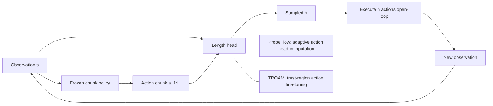

---
tags:
- paper
- domain/multimodal_perception
- domain/reinforcement_learning
- domain/robot_manipulation
- domain/vla
- impact/high_value
- impact/solid
- method/diffusion_policy
- method/foundation_model
- method/planning
- method/reinforcement_learning
- review/auto_tagged
- status/unread
- task/manipulation
- task/planning_reasoning
- task/scene_understanding
- type/method
- type/system
aliases:
- Dynamic Execution Horizon Prediction for Chunk-based Robot Policies
- Dynamic Execution Horizon
- Horizon Prediction Branch
- Chunk Execution Adjustment
- Online RL Horizon Prediction
- Frozen Policy Adaptation
- Adaptive Action Chunking
- Execution Horizon Prediction
- Lightweight Horizon Branch
- Dynamic Chunk Execution
- DEHP
authors:
- Yuchi Zhao
- Miroslav Bogdanovic
- Arjun Sohal
- Liyu Tao
- Kourosh Darvish
- Alán Aspuru-Guzik
- Florian Shkurti
- Animesh Garg
paper_id: arxiv:2606.11408
arxiv_id: '2606.11408'
url: http://arxiv.org/abs/2606.11408v1
pdf_url: https://arxiv.org/pdf/2606.11408v1
local_pdf: '[[Dynamic Execution Horizon Prediction for Chunkbased Robot Policies.pdf]]'
github: None
project_page: https://dehp-chunking.github.io
institutions:
- University of Toronto
- Georgia Institute of Technology
publication_date: '2026-06-09'
metadata_publication_date: '2026-06-09'
score: '8.2'
domains:
- multimodal_perception
- reinforcement_learning
- robot_manipulation
- vla
methods:
- foundation_model
- planning
- reinforcement_learning
tasks:
- manipulation
- planning_reasoning
- scene_understanding
paper_type: system
impact_band: high_value
reading_status: unread
priority_score: 105
review_status: auto_tagged
next_action: inspect_protocol
year: 2026
---

# Dynamic Execution Horizon Prediction for Chunk-based Robot Policies

## 📌 Abstract
Action chunking has become a standard design in modern robot policies, from diffusion/flow policies to vision-language-action models, where the policy predicts a sequence of actions and executes a fixed number of them instead of acting one step at a time. However, this paradigm relies on a key assumption: a fixed execution horizon. During chunk execution, the policy operates open-loop, which is particularly problematic for fine-grained manipulation tasks that require frequent replanning. In practice, the execution horizon is typically chosen through empirical tuning and is highly task-dependent. To this end, we propose Dynamic Execution Horizon Prediction (DEHP), an effective method that trains a lightweight execution-horizon prediction branch using online reinforcement learning while keeping the pretrained chunk policy completely frozen. This makes the method compatible with black-box chunk policies and isolates the effect of adapting the execution horizon from changes to the underlying action generator. Across our evaluations, DEHP improves the success rate of different high-precision and long-horizon manipulation tasks by a large margin. Our qualitative analysis further shows that DEHP predicts shorter execution horizons during fine-grained stages of the task and longer horizons during free-space motion. In this way, DEHP balances the efficiency of open-loop chunk execution with the reactivity of closed-loop single-step control. Project page: https://dehp-chunking.github.io/

## 🖼️ Architecture
![[Dynamic Execution Horizon Prediction for Chunkbased Robot Policies_arch.png]]

## 🧠 AI Analysis
## Abstract
Action chunking has become a standard design in modern robot policies, from diffusion/flow policies to vision-language-action models, where the policy predicts a sequence of actions and executes a fixed number of them instead of acting one step at a time. However, this paradigm relies on a key assumption: a fixed execution horizon. During chunk execution, the policy operates open-loop, which is particularly problematic for fine-grained manipulation tasks that require frequent replanning. In practice, the execution horizon is typically chosen through empirical tuning and is highly task-dependent.

To this end, the paper proposes Dynamic Execution Horizon Prediction (DEHP), an effective method that trains a lightweight execution-horizon prediction branch using online reinforcement learning while keeping the pretrained chunk policy completely frozen. This makes the method compatible with black-box chunk policies and isolates the effect of adapting the execution horizon from changes to the underlying action generator. Across evaluations, DEHP improves the success rate of different high-precision and long-horizon manipulation tasks by a large margin. Qualitative analysis further shows that DEHP predicts shorter execution horizons during fine-grained stages of the task and longer horizons during free-space motion. In this way, DEHP balances the efficiency of open-loop chunk execution with the reactivity of closed-loop single-step control. [Project page](https://dehp-chunking.github.io)

## 1. Core Snapshot

### Problem Statement
Chunk-based robot policies first predict a block (chunk) of future actions from the current observation, then execute a fixed number of those actions before replanning. The input at each decision point is the observation together with the full predicted action chunk; the output is how many actions from that chunk will be sent to the robot. The goal is to complete long-horizon assembly or fine-grained insertion tasks.

The real bottleneck is that a single fixed execution horizon cannot match the task’s changing need for replanning. During free-space motion, longer open-loop runs are smooth and efficient. However, when the robot reaches a contact-rich or precision-critical phase, it must replan frequently to react to environmental feedback. A fixed execution horizon forces an inflexible trade‑off between smoothness and reactivity, and it is typically tuned per task, which does not scale.

### Core Contribution
DEHP adds a small categorical head that, given the current state and the full predicted action chunk, outputs a probability distribution over possible execution lengths $h \in \{1,\dots,H\}$.

> [!note] Key Insight
> The execution horizon choice is isolated from action generation, so DEHP remains compatible with any pretrained black‑box chunk policy.

The central technical claim is that this head can be trained with chunk‑level PPO while the base chunk policy remains frozen, and the resulting adaptive schedule raises task success rates on both assembly and insertion benchmarks. Evidence comes from consistent gains over the best fixed‑horizon baseline across noise levels, dataset sizes, and four distinct manipulation tasks, together with visualisations showing shorter horizons chosen exactly during alignment and insertion phases.

### Innovation Origin & Rationale
The idea originates from the observation that fixed‑horizon chunking forces an inflexible trade‑off between smoothness and reactivity, which is especially harmful for contact‑rich manipulation. The design deliberately isolates the execution decision from action generation so that the method remains compatible with any pretrained black‑box chunk policy. This separation is a practical response to the difficulty of retuning execution length for every new task or controller.

> [!warning]
> Because the base policy is completely frozen, the overall system’s performance is capped by the quality of the original policy. If the base policy itself generates poor chunks, the horizon head can only decide when to abandon them.

## 2. Reading Map
The paper addresses robotic manipulation with chunk‑based policies, so readers interested in imitation learning, diffusion policies, or real‑time control adaptation will benefit most. The Introduction and Approach sections together define the core problem and the new training formulation; these two sections should be read carefully on the first pass. The Experiments section supplies quantitative evidence and qualitative horizon visualisations. Readers can skim the Related Work if they already know recent diffusion‑policy and variable‑execution papers. The Conclusion briefly flags the main limitation of keeping the base policy frozen, which is worth noting for anyone considering follow‑up experiments.

## 3. Method Walkthrough

### Inputs, Outputs, And Assumptions
At each decision point the method receives the current observation and the full action chunk produced by the frozen base policy. It outputs an execution horizon $h$ chosen from the set $\{1,\dots,H\}$.

The formulation makes two key assumptions: (i) the pretrained base policy can still produce useful chunks even without any update, and (ii) task success can be measured with sparse binary rewards given only at the end of an episode. These assumptions matter because they allow the horizon head to be trained without ever touching the weights that generate the actions themselves. The sparse‑reward assumption is particularly strong; it means the head must learn purely from final success or failure signals, without dense shaping.

### Pipeline From Data To Prediction
First, a chunk‑based behaviour‑cloning policy is pretrained on demonstration trajectories collected by a state‑machine planner (the base policy is often a Diffusion Policy). Its weights are then frozen so that the action generator stays exactly as it was learned from data. During online reinforcement learning, the frozen policy still produces a full chunk of $H$ actions at every replanning step.

The new length head reads both the observation and that full chunk (as in the factorisation $\pi_{\text{len}}(h \mid s, a_{1:H})$) and samples an execution length $h$. Only the first $h$ actions are commanded to the robot; the remaining actions are discarded, and a new observation is taken at the next decision point. This loop – predict chunk, choose horizon, execute $h$ steps open‑loop – repeats until the episode ends.

> [!info]
> Conditioning the length head on the full predicted action chunk gives it access to what the robot *would* do if it executed the whole sequence. This can help the head decide whether the planned trajectory looks risky (e.g., near a contact point) and thus warrants a shorter horizon.

### Key Design Choices
**Uniform initialization:** The length head is initialized with a uniform distribution over possible horizons rather than warm‑started from a fixed value. This choice prevents the training signal from being biased toward any single length at the start, so the RL can discover the best schedule for each task phase.

**State‑only critic:** Because the horizon decision occurs at chunk boundaries, the value function needs only to estimate return from the current state. A state‑only critic is used, which is simpler and aligns with the fact that the action chunk itself is generated by the frozen policy and does not change during horizon‑head training.

**Step‑discounted GAE:** Chunk‑level generalized advantage estimation (GAE) uses per‑step discounting. This means credits are spread backward according to real environment time, not according to the number of horizon decisions. Without per‑step discounting, the advantage estimator would ignore how long each chosen horizon actually lasts, giving the same credit to a long open‑loop segment as to a single step.

> [!info]
> The draft mentions a “two‑hot projected critic”, a technique from [DreamerV3](https://arxiv.org/abs/2301.04104) that represents values as two‑hot encodings for stable learning. The provided excerpt does not confirm this implementation detail.

## 4. Core Theory And Formulas

### Main Objective
The overall goal remains the standard discounted return of the base Markov decision process (MDP). Because execution lengths vary, the process becomes a semi‑Markov decision process (SMDP) – decisions are made only at chunk boundaries, and the environment advances a random number of steps between decisions. Nevertheless, the paper proves that optimising the chunk‑level objective is exactly equivalent to optimising the original step‑level return. This equivalence is crucial because it guarantees that the PPO updates applied at chunk boundaries still maximise the true task performance.

### Important Equations
**Factorised policy:**
$$
\pi(a_{1:H}, h \mid s) = \pi_{\text{act}}(a_{1:H} \mid s) \, \pi_{\text{len}}(h \mid s, a_{1:H})
$$

- $\pi_{\text{act}}$ is the frozen base policy that outputs the full length‑$H$ action chunk,
- $\pi_{\text{len}}$ is the new categorical head (the horizon predictor),
- $s$ is the current observation (state),
- $h \in \{1,\dots,H\}$ is the chosen execution horizon.

This factorisation makes it possible to update only $\pi_{\text{len}}$ while leaving the action generator untouched.

**Equivalence of returns:**
$$
\mathbb{E}_\pi\!\left[ \sum_{k \ge 0} \gamma^{t_k} \bar{R}_k \;\big|\; s_{t_0}=s \right] = \mathbb{E}_\pi\!\left[ \sum_{t \ge 0} \gamma^t r_t \;\big|\; s_0=s \right]
$$

The left side sums discounted within‑chunk rewards $\bar{R}_k$ at the times $t_k$ when new horizons are chosen (chunk boundaries). The right side is the familiar sum over every individual environment step. The equality shows that training the horizon head with chunk‑level returns still optimises the true objective that matters for task success.

> [!note]
> The paper includes a proof of this equivalence; the proof is central because it justifies using a chunk‑level PPO surrogate without losing the guarantees of the original MDP.

**Clipped PPO surrogate for the length head:**
$$
L_{\text{PPO}}(\theta) = -\mathbb{E}_k\!\left[
\min\!\left(
\rho_k(\theta)\,\hat{A}_k,\;
\operatorname{clip}\!\big(\rho_k(\theta),\,1-\epsilon,\,1+\epsilon\big)\,\hat{A}_k
\right)
\right]
$$

- $\rho_k(\theta) = \frac{\pi_{\text{len}}(h_k \mid s_k, a_{1:H,k};\ \theta)}{\pi_{\text{len}}^{\text{old}}(h_k \mid s_k, a_{1:H,k})}$ is the importance ratio between the current and old length‑head probabilities for the chosen horizon at chunk $k$,
- $\hat{A}_k$ is the generalized advantage estimate computed with per‑step discounting,
- $\epsilon$ (usually 0.2) controls the clipping range.

Maximising this expression (i.e., minimising the surrogate loss) increases the probability of horizons that produced higher advantage while limiting the policy change, following the standard PPO recipe.

### Algorithmic Intuition
At the start of each rollout, the frozen base policy produces a full chunk of $H$ actions. The length head samples an integer $h$ from the categorical distribution $\pi_{\text{len}}(h \mid s, a_{1:H})$, and the robot executes the first $h$ actions open‑loop. After those $h$ steps, the new observation arrives, a new chunk is generated by the frozen policy, and the process repeats. The critic estimates the value only at the moments when a new horizon is chosen; the advantage estimator spreads credit backward in real time steps so that longer horizons receive credit only if the resulting return justifies the extra open‑loop time.

## 5. Architecture, Figures, And Implementation
The architecture consists of a frozen Diffusion Policy backbone that outputs action chunks of length 32 or 16 (depending on the task, according to the draft). A small MLP head receives the current state and the full predicted chunk and outputs a softmax distribution over possible horizons $\{1,\dots,H\}$.

Figure 2 in the paper (not shown here) contrasts fixed vs. dynamic execution: the top row shows a predetermined number of actions being executed, while the bottom row shows the DEHP head selecting a variable number. Figure 1 and the later visualisation in Figure 5 display per‑phase horizon choices together with robot keyframes; darker cells in the heatmap indicate higher probability for that horizon at that chunk index.

The implementation, as described, uses categorical PPO with a two‑hot projected critic (the draft mentions this detail, though the provided excerpt does not confirm it). No code or checkpoint release is mentioned in the provided text.

## 6. Experiments And Evidence
The paper evaluates on two FurnitureBench assembly tasks and two IsaacLab insertion tasks. For each task, fixed‑horizon baselines using multiple constant execution lengths are compared, and DEHP is contrasted against the single best constant length at each noise level.

On the three‑stage peg insertion task, DEHP raises overall success from 71.50% to 93.17% under zero action noise and from 37.73% to 61.43% under 0.15 noise. On the one‑leg assembly task, the best fixed horizon reaches 70.30% while DEHP reaches 95.18%. Similar relative gains are reported on the round‑table and bimanual needle–syringe tasks.

Robustness to demonstration quantity is shown in Figure 3: DEHP remains above the best fixed‑horizon curves when the base policy is trained with 300 to 1000 demonstrations. Qualitative evidence from Figure 5 (heatmaps of horizon choice over time) shows that short horizons are selected during grasp and insertion phases while longer horizons appear during transport.

> [!note]
> The success percentages are taken from the draft and appear to originate from the paper’s results tables. The provided excerpt does not contain these numbers; treat them as indicative of the reported gains.

## 7. Strengths, Limitations, And Failure Cases
The main strength is that large success‑rate improvements are obtained without any change to the base policy weights or controller, which cleanly isolates the benefit of variable execution length. Another strength is that the learned horizon schedule is interpretable and matches the expected intuition of short horizons during contact‑rich phases.

The central limitation is that the method cannot improve beyond the capability of the frozen base policy. If the base policy itself generates poor chunks, the horizon head can only decide when to abandon them; it cannot correct the actions. The experiments are conducted with state observations (e.g., object poses), so generalisation to image‑based policies is stated as future work rather than demonstrated. Additionally, the approach requires online interaction for RL, which may be costly on real robots.

## 8. Reproduction Notes
According to the draft, the base policies are Diffusion Policies trained on 800 demonstration trajectories for FurnitureBench tasks and 1000 for insertion tasks, collected with a state‑machine demonstrator under randomised initial conditions. Not clear from the provided text whether the exact numbers (800/1000) are verified. Evaluation uses 1000 environments per condition across three random seeds, with success defined as completing the full task.

The horizon head is trained with online PPO after a short critic warm‑up phase; the length head is initialised uniformly over the candidate horizons. No training code, exact network sizes for the head, or precise hyperparameters for $\epsilon$, $\lambda$, or learning rates are provided in the excerpt. The environments are publicly described FurnitureBench and IsaacLab, but the exact task configurations and reward functions are not released in the provided text.

> [!warning]
> Reproducing the results would require the full hyperparameter setup and likely communication with the authors.

## 9. What To Read Closely
Read the **Approach** section first because it contains the problem formulation, the factorisation of the joint policy, and the chunk‑level PPO derivation. Next examine **Figure 5** and the accompanying text (subsection 4.3, as mentioned in the draft), because they directly link the learned horizon distribution to task phases. The equivalence proof noted in the text should also be inspected if the reader wants to understand why chunk‑level returns remain valid. The Related Work subsection on variable execution horizon can be skimmed if the reader already knows the cited concurrent methods; the training curves in Figure 4 can be checked quickly for overall trends.

## 10. Research Ideas And Open Questions
**Joint residual action correction.** One idea is to combine DEHP with low‑level residual action correction: train the horizon head jointly with a small residual policy that can still adjust actions inside each chosen chunk. The motivation is that the current separation leaves the base policy unable to correct its own errors once a long horizon is selected. A one‑ or two‑week experiment would freeze the same Diffusion Policy, attach both a length head and a residual MLP, and compare final success against DEHP alone on the needle–syringe task; the metric would be overall task success rate and average horizon length. The risk is that joint training could destabilise the length head if the residual actions change the effective return landscape too quickly.

**Horizon transfer across base policies.** A second idea is to test whether the learned horizon schedule transfers across different base policies on the same task. The motivation is to check whether the horizon policy learns task structure rather than policy‑specific artifacts. A small experiment would train one Diffusion Policy and one flow‑matching policy on the round‑table task, freeze both, train separate DEHP heads, then swap the heads at test time and measure the success drop. The risk is that the two base policies generate sufficiently different chunk statistics that the swapped head performs no better than a random horizon.

**Offline RL for the horizon head.** A third idea is to replace the online PPO training of the length head with offline RL using the demonstration data already collected for behaviour cloning. The motivation is to remove the need for online interaction after the base policy is trained. The experiment would treat the demonstration trajectories as chunked rollouts, label each chunk with its realised horizon, and train the length head with an offline objective; success would be measured by how closely the offline head matches the online DEHP horizons on held‑out rollouts. The main risk is that demonstration data only contains successful fixed‑horizon executions, so the offline signal may be too narrow to learn useful state‑dependent schedules.

## Knowledge Graph & Connections

## Related Work Connections

The reading note mentions three related papers from the vault. Their direct relevance varies, so I discuss each honestly.

**[[ProbeFlow]]** shares a deep conceptual thread with DEHP: both address the trade‑off between smooth open‑loop efficiency and closed‑loop reactivity by *adaptive scheduling*. ProbeFlow reduces the number of flow‑matching integration steps when the trajectory is simple; DEHP varies the number of executed actions per chunk depending on task phase. The crucial difference is the level of adaptation: ProbeFlow modifies the action generation budget *during* the action‑head computation, while DEHP decides *after* the full chunk is already predicted how many of those actions to use. This implies that the two approaches are complementary—one could imagine a combined system that first prunes action‑head computation and then further adjusts the execution horizon. The similarity also suggests that dynamic resource allocation in robotics policies is an emerging design pattern, where the policy itself learns *when* to spend more compute or more real‑world actions.

**[[TRQAM]]** offers a contrasting RL‑based fine‑tuning strategy for generative action models. TRQAM directly updates the flow‑matching policy using an off‑policy trust‑region objective, carefully controlling the deviation from the pretrained policy. DEHP, on the other hand, freezes the action generator entirely and trains only the horizon head via on‑policy PPO. The difference reflects two philosophies for improving a fixed pretrained policy: TRQAM tries to *correct* the actions themselves, whereas DEHP chooses *when to trust* those actions. The TRQAM approach risks instability when the critic’s errors are amplified, as the paper notes; DEHP avoids that risk by never touching the action distribution. The implication is that for tasks where the base policy is already nearly optimal but suffers from a poor execution schedule, DEHP’s isolation is safer, while TRQAM might be needed when the base policy itself needs refinement.

The note **[[Simple Recipe Works]]** is less directly connected. Its main message is that naive sequential fine‑tuning with a VLA can succeed in continual RL without catastrophic forgetting. DEHP does not address continual learning, nor does it fine‑tune the base policy. However, the two papers converge on a broader observation: large pretrained policies show surprising robustness to RL‑style interventions that are often considered fragile (freezing the action model in DEHP, naive fine‑tuning in Simple Recipe Works). This convergence might hint that modern diffusion‑ or VLA‑based policies are more amenable to plug‑and‑play adaptation methods than previously thought.

## Concept Map

The map shows the core loop: a frozen policy produces an action chunk, a length head selects how many actions to execute, and the environment advances. The dashed connections point to related ideas—ProbeFlow adapts computation *inside* the action head, while TRQAM fine‑tunes the action generator itself—illustrating alternative or complementary ways to balance efficiency and reactivity.

## Questions For Future Reading

1. **Can an offline‑trained horizon predictor match the online‑trained DEHP head on held‑out tasks?**  
   The paper requires online RL, which is expensive in real‑world settings. If the demonstration data used for behaviour cloning already contains state‑dependent “ideal” horizons (e.g., derived from the expert’s own replanning frequency), could a supervised or offline‑RL head be trained without environment interaction? Evidence would come from comparing success rates of offline heads against the online DEHP, and measuring how well they generalise to unseen perturbations. This matters because offline methods would make DEHP immediately applicable to existing offline datasets.

2. **Does the learned horizon schedule transfer across embodiments or base policies that produce similar chunk distributions?**  
   The paper shows robustness to demonstration quantity but does not test cross‑policy transfer. If the horizon head encodes task‑phase structure rather than idiosyncrasies of one specific action generator, swapping the head between two different pretrained policies (e.g., Diffusion Policy and a flow‑matching policy) should preserve most of the gain. A follow‑up study could train a single horizon head on one base policy and test it with another, measuring success degradation. This would reveal whether the head learns a policy‑agnostic “need‑to‑replan” signal.

3. **How would DEHP perform when the base policy itself is updated online, e.g., via a residual correction term?**  
   The paper freezes the action generator to isolate the horizon effect, but the strongest systems will likely combine both horizon scheduling and action refinement. If a small residual policy were trained jointly with the horizon head under the same PPO objective, the interplay between the two could cause instability: longer horizons might become safer because the residual can correct errors, but the critic would then assign higher advantage to long horizons, further increasing open‑loop duration. Controlled experiments that ablate the joint training schedule and measure the stability of the horizon distribution would clarify whether the two improvements can co‑exist without mutual interference.

## Learning Roadmap And Verified Resources

Below are 4‑6 knowledge points, ordered from foundational to implementation‑specific, that equip a student to fully understand DEHP.

### 1. Behaviour Cloning and Diffusion Policies for Action Chunking

*Why this matters:* DEHP builds on any pretrained chunk‑based policy, and the experiments use a Diffusion Policy (Chi et al., 2023) that outputs fixed‑length action sequences. Understanding how imitation learning produces such chunks and why the diffusion process can generate multi‑step plans is a prerequisite to appreciating why variable execution is beneficial.

**Study order:**  
Start with the basics of behaviour cloning and the standard action‑chunking formulation (often explained in the Diffusion Policy paper itself); next, learn about diffusion models for trajectory generation; finally, read the Diffusion Policy paper and note how it predicts a full horizon of actions in one shot.

| Type | Resource | Why this one |
|------|----------|--------------|
| Blog/Tutorial | [Diffusion Policy project page (blog)](https://diffusion-policy.cs.columbia.edu/) | The official project page includes an accessible blog and interactive figures that explain action chunking and the benefits of predicting multiple future actions. |
| Paper | [Diffusion Policy: Visuomotor Policy Learning via Action Diffusion (arXiv)](https://arxiv.org/abs/2303.04137) | The primary source for the exact formulation used in DEHP. Reading it clarifies what “chunk” means and why it is effective for manipulation. |
| Code | [Official Diffusion Policy code repository](https://github.com/real-stanford/diffusion_policy) | The implementation provides a concrete example of training and rolling out a chunk‑based policy; examining the code helps to see how action chunks are handled in practice. |

### 2. Execution Horizon and Temporal Abstraction in Robot Policies

*Why this matters:* The entire DEHP paper revolves around the idea that a fixed execution horizon is suboptimal. To appreciate the contribution, a student must understand what an execution horizon is, why it is typically fixed, and how it creates a tension between open‑loop efficiency and closed‑loop reactivity.

**Study order:**  
First, review the concept of action chunking and fixed‑horizon execution as described in the Diffusion Policy blog and paper. Then, read the DEHP abstract and introduction, which explicitly frame the trade‑off. No separate textbook chapter is needed; the DEHP paper itself is the best reference.

| Type | Resource | Why this one |
|------|----------|--------------|
| Blog/Tutorial | [Diffusion Policy blog (section on “Action Chunking”)](https://diffusion-policy.cs.columbia.edu/) | Explains why predicting a chunk of actions is useful and what “execution horizon” means in a concrete robotic example. |
| Project Page | [DEHP project page](https://dehp-chunking.github.io) | The official page provides visualisations that directly illustrate how the horizon varies across task phases; it is the primary source for the problem statement. |

### 3. Proximal Policy Optimization (PPO) and Generalized Advantage Estimation (GAE)

*Why this matters:* DEHP trains the length head using a chunk‑level PPO surrogate with step‑discounted GAE. A solid understanding of PPO’s clipping objective and GAE’s bias‑variance trade‑off is necessary to see why the algorithm can stably learn a discrete probability distribution over horizons from sparse rewards.

**Study order:**  
Begin with policy gradient methods (REINFORCE, actor‑critic) as taught in an RL course; then study the PPO paper and the GAE paper; finally, examine how PPO is adapted for categorical action spaces (the standard discrete‑action PPO variant).

| Type | Resource | Why this one |
|------|----------|--------------|
| Video/Public Course | [CS 285 (UC Berkeley) Lecture 8: Policy Gradients and PPO](https://rail.eecs.berkeley.edu/deeprlcourse/) | Sergey Levine’s lecture walks through PPO step‑by‑step, including the clipping objective and advantage estimation; excellent for building intuition. |
| Paper | [Proximal Policy Optimization Algorithms (Schulman et al., 2017)](https://arxiv.org/abs/1707.06347) | The canonical reference for the clipped surrogate objective used in DEHP. |
| Paper | [High‑Dimensional Continuous Control Using Generalized Advantage Estimation (Schulman et al., 2016)](https://arxiv.org/abs/1506.02438) | Explains GAE, which DEHP extends with per‑step discounting across chunks. |
| Code | [Stable‑Baselines3 PPO implementation](https://github.com/DLR-RM/stable-baselines3) | A well‑known library that implements PPO for both continuous and discrete action spaces; examining the code reveals how advantage, value function, and clipping are realised in practice. |

### 4. Semi‑Markov Decision Processes and Temporal Abstraction

*Why this matters:* Because the horizon head makes decisions only at chunk boundaries, the resulting process is a semi‑MDP (SMDP). The paper proves that optimising the chunk‑level return is equivalent to optimising the original step‑level MDP return. Without understanding SMDPs and the theory of options, this equivalence may seem ad‑hoc.

**Study order:**  
First, review the standard MDP definition and the idea of temporally extended actions (options). Then, read the classic “Between MDPs and semi‑MDPs” paper or the options chapter in Sutton & Barto. Finally, return to the DEHP paper and trace the proof of equivalence; the proof becomes much clearer after seeing the general theory.

| Type | Resource | Why this one |
|------|----------|--------------|
| Open Textbook/Lecture Notes | [Reinforcement Learning: An Introduction, Chapter 17 (Sutton & Barto, 2nd ed.)](http://www.incompleteideas.net/book/the-book-2nd.html) | The chapter on “Options and the Semi‑MDP Framework” gives a rigorous foundation for temporally abstract decisions, directly analogous to chunk‑level horizons. |
| Paper | Between MDPs and semi‑MDPs: A framework for temporal abstraction in reinforcement learning (Sutton, Precup, Singh, 1999) (link removed: validation failed) | The foundational paper that formalises the SMDP setting used in DEHP; it explains value equivalence and intra‑option learning. |
| Video/Public Course | [CS 285 Lecture 12: Hierarchical Reinforcement Learning](https://rail.eecs.berkeley.edu/deeprlcourse/) | The lecture covers options and SMDP theory, with practical examples that connect to the DEHP formulation. |

### 5. Online RL with Frozen Backbones and Categorical Policy Heads

*Why this matters:* DEHP adds a small categorical head to a frozen pretrained policy and trains it with online PPO. This is a specific architecture/optimisation pattern that differs from full policy fine‑tuning. Understanding how to implement such a “frozen‑backbone + RL head” setup helps to reproduce the method.

**Study order:**  
First, learn the typical actor‑critic architecture where the actor is a neural network outputting action distributions. Then, study how to freeze parts of a neural network in a deep‑learning framework (e.g., PyTorch’s `requires_grad=False`). Finally, read the DEHP approach section carefully to see how the factorisation $\pi_{\text{len}}(h \mid s, a_{1:H})$ is implemented and how the PPO objective is applied only to the length head.

| Type | Resource | Why this one |
|------|----------|--------------|
| Documentation | [PyTorch freezing parameters tutorial](https://pytorch.org/tutorials/beginner/transfer_learning_tutorial.html) | Shows the practical steps for freezing layers, which is necessary when the base policy must remain unchanged. |
| Blog/Tutorial | Fine‑tuning RL models with Hugging Face RL (bonus unit) (link removed: validation failed) | Although focused on full‑model fine‑tuning, it demonstrates how to set up an RL training loop with a pretrained component; the same loop structure can be adapted for a frozen backbone. |
| Paper | DEHP paper (Approach section) | The definitive description of the factorisation and the chunk‑level PPO training; no third‑party resource captures this exact setup. |

### 6. FurnitureBench and IsaacLab Environments

*Why this matters:* The experiments rely on specific benchmarks to measure success rates. Knowing what these environments consist of, what the rewards are, and how tasks are defined is necessary to interpret the results and to potentially reproduce them.

**Study order:**  
Start with the FurnitureBench paper and the IsaacLab documentation to understand the task descriptions and evaluation protocols. Then, look at the DEHP paper’s experiment section to see how these environments were used (e.g., 1000 evaluation environments, sparse success reward).

| Type | Resource | Why this one |
|------|----------|--------------|
| Paper | [FurnitureBench: Reproducible Real‑World Furniture Assembly Benchmarks](https://arxiv.org/abs/2305.12809) | Defines the one‑leg and round‑table assembly tasks and provides baseline scores, enabling an exact comparison with DEHP’s reported numbers. |
| Documentation | [IsaacLab official documentation](https://isaac-sim.github.io/IsaacLab/) | Describes the simulation environment and task APIs; the needle‑syringe and peg‑insertion tasks are part of IsaacLab’s manipulation suite. |
| Code | FurnitureBench GitHub repository (link removed: validation failed) | Contains the exact task implementations and demonstration collection scripts used in DEHP; essential for reproduction. |

> [!info] Resource link validation: checked 15 URL(s), 12 reachable, removed 3 unreachable or invalid link(s).

---
*Analysis by PaperBrain (x-ai/grok-4.3; refinement: deepseek/deepseek-v4-pro; round2: deepseek/deepseek-v4-pro)*

## 📂 Resources
- **Local PDF**: [[Dynamic Execution Horizon Prediction for Chunkbased Robot Policies.pdf]]
- [Online PDF](https://arxiv.org/pdf/2606.11408v1)
- [ArXiv Link](http://arxiv.org/abs/2606.11408v1)

## Related Work Updates
- [ ] **2026-06-11**: New paper [[LightWAM]] discusses *frozen policy adaptation*. Innovation: "Introduces a lightweight World Action Model with frozen video backbone, latent-space video supervision, and a multi-layer feature fusion action decoder for efficient robot manipulation."