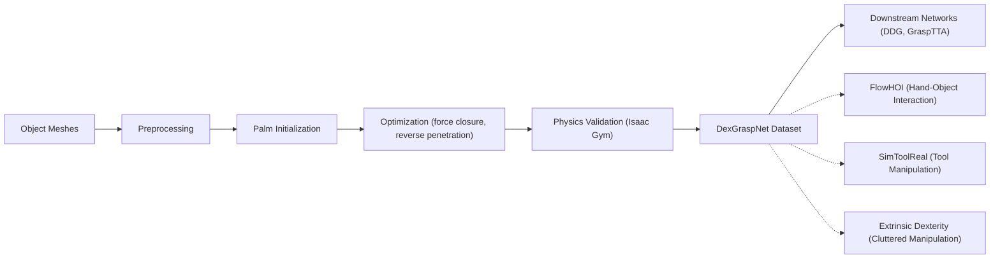

---
tags:
- paper
- domain/embodied_ai
- domain/robot_manipulation
- impact/solid
- impact/watch
- method/benchmark
- method/simulation
- review/auto_tagged
- status/unread
- task/dexterous_contact
- task/manipulation
- type/benchmark
- type/dataset
aliases:
- 'DexGraspNet: A Large-Scale Robotic Dexterous Grasp Dataset for General Objects
  Based on Simulation'
- DexGraspNet
- Dexterous Grasp Dataset
- Large-Scale Dexterous Grasping
- Differentiable Force Closure
- Force Closure Estimator
- Simulated Dexterous Grasps
- Robotic Dexterous Grasping
- General Object Grasping
- Dexterous Grasp Synthesis
- Deeply Accelerated Force Closure
authors:
- Ruicheng Wang
- Jialiang Zhang
- Jiayi Chen
- Yinzhen Xu
- Puhao Li
- Tengyu Liu
- He Wang
paper_id: arxiv:2210.02697
arxiv_id: '2210.02697'
url: http://arxiv.org/abs/2210.02697v2
pdf_url: https://arxiv.org/pdf/2210.02697v2
local_pdf: '[[DexGraspNet A LargeScale Robotic Dexterous Grasp Dataset for General
  Objects Based on Simulation.pdf]]'
github: None
project_page: https://pku-epic.github.io/DexGraspNet/
institutions:
- Peking University
- Beijing Institute for General Artificial Intelligence
- Tsinghua University
publication_date: '2022-10-06'
metadata_publication_date: '2023-03-08'
score: '6.7'
domains:
- embodied_ai
- robot_manipulation
methods:
- benchmark
- simulation
tasks:
- dexterous_contact
- manipulation
paper_type: benchmark
impact_band: watch
reading_status: unread
priority_score: 71
review_status: auto_tagged
next_action: inspect_protocol
year: 2022
---

# DexGraspNet: A Large-Scale Robotic Dexterous Grasp Dataset for General Objects Based on Simulation

## 📌 Abstract
Robotic dexterous grasping is the first step to enable human-like dexterous object manipulation and thus a crucial robotic technology. However, dexterous grasping is much more under-explored than object grasping with parallel grippers, partially due to the lack of a large-scale dataset. In this work, we present a large-scale robotic dexterous grasp dataset, DexGraspNet, generated by our proposed highly efficient synthesis method that can be generally applied to any dexterous hand. Our method leverages a deeply accelerated differentiable force closure estimator and thus can efficiently and robustly synthesize stable and diverse grasps on a large scale. We choose ShadowHand and generate 1.32 million grasps for 5355 objects, covering more than 133 object categories and containing more than 200 diverse grasps for each object instance, with all grasps having been validated by the Isaac Gym simulator. Compared to the previous dataset from Liu et al. generated by GraspIt!, our dataset has not only more objects and grasps, but also higher diversity and quality. Via performing cross-dataset experiments, we show that training several algorithms of dexterous grasp synthesis on our dataset significantly outperforms training on the previous one. To access our data and code, including code for human and Allegro grasp synthesis, please visit our project page: https://pku-epic.github.io/DexGraspNet/.

## 🖼️ Architecture
![[DexGraspNet A LargeScale Robotic Dexterous Grasp Dataset for General Objects Based on Simulation_arch.png]]

## 🧠 AI Analysis
## Abstract

Robotic dexterous grasping is the first step to enable human-like dexterous object manipulation and thus a crucial robotic technology. However, dexterous grasping is much more under-explored than object grasping with parallel grippers, partially due to the lack of a large-scale dataset. In this work, we present a large-scale robotic dexterous grasp dataset, DexGraspNet, generated by our proposed highly efficient synthesis method that can be generally applied to any dexterous hand. Our method leverages a deeply accelerated differentiable force closure estimator and thus can efficiently and robustly synthesize stable and diverse grasps on a large scale. We choose ShadowHand and generate 1.32 million grasps for 5355 objects, covering more than 133 object categories and containing more than 200 diverse grasps for each object instance, with all grasps having been validated by the Isaac Gym simulator. Compared to the previous dataset from Liu et al. generated by GraspIt!, our dataset has not only more objects and grasps, but also higher diversity and quality. Via performing cross-dataset experiments, we show that training several algorithms of dexterous grasp synthesis on our dataset significantly outperforms training on the previous one. To access our data and code, including code for human and Allegro grasp synthesis, please visit our project page: [DexGraspNet](https://pku-epic.github.io/DexGraspNet/).

DexGraspNet is a very large simulated collection of stable ShadowHand grasps on thousands of everyday objects. The main point is that the authors created a fast optimization pipeline to produce more than a million high-quality grasps automatically, and experiments show that training grasp-generation networks on this bigger and more varied collection leads to better results than training on the much smaller prior dataset.

## 1. Core Snapshot

### Problem Statement
The central problem is that learning-based dexterous grasping methods lack enough training data. Parallel-jaw grippers already have large datasets such as [ACRONYM](https://sites.google.com/nvidia.com/graspdataset) and [GraspNet](https://graspnet.net/), but dexterous hands like the 22-DoF ShadowHand have far fewer public examples. The only prior dexterous dataset, DDGdata from Liu et al., contains just 6.9k grasps across 565 objects and was produced by the GraspIt! planner. Because the hand has many degrees of freedom, methods trained on such a small set cannot generalize well to new objects or grasp styles. The practical bottleneck is therefore the absence of a large-scale, diverse, and physically validated collection of dexterous grasps.

### Core Contribution
The core technical claim is that an improved optimization pipeline built on a differentiable force-closure energy can generate 1.32 million stable ShadowHand grasps on 5355 objects while using far less compute than the original method in reference [19].

The pipeline’s efficiency and robustness come from several modifications: a deliberate hand‑pose initialization, a reversed penetration energy, and additional penalty terms for self‑penetration and joint‑limit violations. Evidence for the claim appears in the speed comparison: synthesizing 10,000 valid grasps takes only 7 GPU hours, whereas the original method was estimated at 400 GPU hours for the same yield. Further evidence comes from cross‑dataset experiments where both DDG and GraspTTA trained on DexGraspNet outperform the same networks trained on DDGdata in terms of simulation success rate, Q1 stability, and joint‑angle entropy.

> [!warning] The reported speed‑up (400→7 GPU hours for 10k grasps) is based on a rough extrapolation from the baseline and does not isolate the contribution of each individual design change. The overall pipeline’s yield still depends on hyper‑parameters whose full tuning is not disclosed.

### Innovation Origin & Rationale
The idea originates from the differentiable force‑closure estimator introduced in [19], which turned grasp synthesis into an energy‑minimization problem instead of a random search in GraspIt!.

The authors observed three concrete failures of that baseline on their object collection: very low success rate, inability to handle thin meshes, and unnatural twisted poses.  

Their response was to redesign the initialization so the hand starts open and facing the object, replace the penetration term with a reverse version, and add explicit penalties for finger self‑collision and out‑of‑range joints. This interpretation is supported by the explicit speed‑up numbers and the failure descriptions in the paper’s Section III.  

A practical take‑away for anyone re‑implementing the generator: the initialization and reverse penetration are the two most critical changes for handling real‑world object repositories.

## 2. Reading Map
The paper targets researchers who want to train or evaluate learning‑based dexterous grasp generators and who need large amounts of stable training data.  

Readers primarily interested in dataset construction should focus on Sections III and IV.  
Those interested in benchmarking should read Sections V and VI carefully.  

The introduction (Section I) and related work (Section II) can be skimmed after the first pass because they mainly justify why a larger dataset is needed. The method section rewards slow reading because it contains the concrete algorithmic changes.  

Tables II–IV and Figures 5–6 supply the quantitative and qualitative evidence for the diversity and quality claims.  

The code and data are linked only through the project page; therefore anyone planning to reproduce the work should open that page immediately.

## 3. Method Walkthrough

### Inputs, Outputs, And Assumptions
The method receives a collection of object meshes that have first been normalized inside a unit sphere, scaled to five fixed sizes, and turned into closed manifold meshes with convex‑decomposition collision bodies ([CoACD](https://github.com/SarahWeiii/CoACD) can produce such decompositions).  

It outputs grasp tuples of the form $(T, R, \theta)$ where $T$ is translation, $R$ is rotation, and $\theta$ are the 22 joint angles of the ShadowHand. The optimization step also temporarily uses four contact points $x$ on the hand surface.  

The key assumptions are that an open‑palm starting pose with fingers spread will converge more reliably, that reverse penetration works without requiring watertight object meshes, and that Isaac Gym ([documentation](https://developer.nvidia.com/isaac-gym)) validation with six gravity directions is a sufficient filter for real‑world stability.

### Pipeline From Data To Prediction

**Pre‑processing.** Object meshes are collected from [ShapeNet](https://shapenet.org/), [YCB](https://www.ycbbenchmarks.com/), BigBIRD, and similar repositories, then remeshed into closed manifolds and decomposed for simulation.  

**Grasp sampling.** For each object the algorithm samples many candidate hand poses by placing the palm on an inflated convex hull and orienting it toward the object center (see Section III‑B3).  

**Optimisation.** Each candidate is then optimised for up to 6000 gradient‑descent steps that minimise a sum of force‑closure, distance, penetration, self‑penetration, and joint‑limit energies.  

**Validation.** After optimisation, successful grasps are kept only if they survive Isaac Gym simulation under gravity in all six axis directions and satisfy a 0.1 cm penetration threshold. The retained grasps are stored together with the original object.

### Key Design Choices

**Initialization.** The hand starts with an open palm facing the object and the fingers spread. Random closed‑hand starts cause the optimizer to get stuck; without this careful start the success rate drops dramatically.  

**Reverse penetration energy.** Instead of checking whether hand points are inside the object, the method samples points on the object and measures their distance to the hand mesh. This lets the pipeline accept thin CAD models that lack volume, whereas the original penetration term failed on such meshes.  

**Self‑penetration and joint‑limit terms.** These extra penalties encourage visually natural poses even though they are not strictly required for force closure. They reduce twisted fingers and out‑of‑range joints.  

**Switching from MALA to plain gradient descent.** Once the initialization already raises the yield, the Metropolis–Hastings acceptance step is dropped. Plain gradient descent halves the required iterations.

> [!note] The reverse penetration trick is a simple but powerful engineering insight: it avoids the need for watertight meshes and greatly widens the usable object catalogue.

## 4. Core Theory And Formulas

### Main Objective
The central objective is to find hand configurations that achieve force closure (the ability of the contacts to resist any external wrench) while avoiding penetration and self‑collision. [Force closure](https://en.wikipedia.org/wiki/Force_closure) is a classical concept in grasping; this paper turns it into a differentiable energy that can be minimised by gradient descent, inspired by the differentiable estimator of [19].

### Important Equations

**Force‑closure energy.**  
$$
E_{\text{fc}} = \| G c \|_2^2
$$
Here $G$ is the grasp matrix, built by stacking $3\times3$ identity blocks and the skew‑symmetric matrices of the contact positions $x_i$, and $c$ is the concatenation of the contact normals $n_i$. Minimising $\|G c\|_2^2$ encourages the contact points and their normals to span the full wrench space, i.e. to be able to resist arbitrary forces and torques. In practice, a smaller value means the configuration is closer to force closure.

**Distance and penetration energies.**  
The *distance* energy pulls the hand’s contact points $x_i$ towards the object surface:
$$
E_{\text{dis}} = \sum_{i} \text{sdf}(x_i, O),
$$
where $\text{sdf}$ is the signed distance function of the object $O$.  
The original *penetration* energy punishes hand vertices that lie inside the object:
$$
E_{\text{pen}} = \sum_{v \in S(H)} \mathbf 1_{[v\in O]}\; \text{sdf}(v, O),
$$
but this fails on thin meshes. The reverse version used in the paper simply swaps the roles of hand and object: points $p$ are sampled on the object surface and their distance to the hand mesh $H$ is evaluated. This works robustly even for non‑watertight objects.

**Self‑penetration and joint‑limit energies.**  
Self‑collision is penalised when pairs of hand links $p,q$ come closer than a threshold $\delta$:
$$
E_{\text{spen}} = \sum_{p
eq q} \max(\delta - d(p,q), 0).
$$
Joint limits are enforced with hinge penalties:
$$
E_{\text{joints}} = \sum_i \max(\theta_i - \theta_i^{\max},0) + \max(\theta_i^{\min} - \theta_i,0).
$$

The total energy is a weighted sum of these five terms, with fixed weights (e.g. $w_{\text{dis}} = 100$, $w_{\text{pen}} = 100$, $w_{\text{spen}} = 10$, $w_{\text{joints}} = 1$). Lower total energy corresponds to grasps that are both stable and physically plausible.

> [!info] The force closure term is a differentiable proxy for the classical quality measure; it does not *guarantee* force closure but strongly encourages configurations that satisfy it. The final Isaac Gym test then acts as a physics‑based filter.

### Algorithmic Intuition
The optimizer begins with a hand placed near the object. In each step the translation, rotation, and joint angles are updated by gradient descent on the total energy while the four contact points are occasionally resampled. Because the force‑closure term is differentiable, the updates directly push the contacts toward a configuration that can resist external forces. The Metropolis‑Hastings acceptance step of the original MALA method is dropped once the initialization already produces high yield.

## 5. Architecture, Figures, And Implementation
The pipeline has no learned neural network for generation; it is a pure optimisation procedure wrapped by a physics validation stage.

Figure 1 shows the final scale of the dataset with hundreds of coloured objects each surrounded by many grey ShadowHands.  
Figure 2 illustrates the canonical open‑hand pose with manually chosen green contact spheres and the collision mesh.  
Figure 3 visualises the initialization step that samples points on the inflated convex hull (blue) and orients the hand.  
Figure 4 marks the green spheres used for the self‑penetration term.  
Figure 5 displays the qualitative diversity of the collected grasps.

Implementation uses a modified [Kaolin](https://github.com/NVIDIAGameWorks/kaolin) library for signed‑distance queries, [CoACD](https://github.com/SarahWeiii/CoACD) for convex decomposition, and [Isaac Gym](https://developer.nvidia.com/isaac-gym) with PhysX for final validation.  

Exact GPU hours per object and the precise weighting schedule ($w_{\text{dis}} = 100$, $w_{\text{pen}} = 100$, $w_{\text{spen}} = 10$, $w_{\text{joints}} = 1$) are given, but the full training code for the baselines is not reproduced in the text. Missing details include the exact learning‑rate schedule inside the gradient‑descent loop and the random seed strategy that produced the reported 18 % validity rate.

## 6. Experiments And Evidence

**Diversity and stability.** The authors compare DexGraspNet against DDGdata on two axes: diversity measured by mean joint‑angle entropy (5.962 vs 4.246) and stability measured by mean Q1 force‑closure quality (0.1145 vs 0.0712). Larger numbers indicate more varied joint configurations and more stable grasps.

**Cross‑dataset training.** They retrain DDG and GraspTTA on each dataset and evaluate on both test sets. When tested on DexGraspNet, DDG trained on DexGraspNet reaches 67.5 % simulation success versus 57.4 % when trained on DDGdata; similar gains appear for GraspTTA. The same pattern holds when testing on DDGdata.  

These numbers answer the question of whether the new data distribution improves downstream learning: the answer is clearly yes.

> [!warning] No ablation study isolates the contribution of each energy term (self‑penetration, joint limits, etc.). Therefore the relative importance of the added penalties remains unknown, and it is possible that a simpler pipeline would yield similar quality.

## 7. Strengths, Limitations, And Failure Cases

**Strengths.** The main strength is the scale and the demonstrated transfer gain: networks trained on the new data outperform the same networks trained on the old data across multiple metrics and test distributions. The method also generalises to [MANO](https://mano.is.tue.mpg.de/) and [Allegro](http://www.simlab.co.kr/Allegro-Hand.htm) hands with only minor code changes.

**Limitations.** A clear limitation is the bias toward power grasps; Section VI states that precision grasps are almost absent because the optimiser always tries to maximise contact. Functional grasps that respect object semantics, such as grasping a mug by its handle, are also missing.  

The validation uses only gravity in six axis directions, so stability against arbitrary external wrenches is not guaranteed.  

Not clear from the provided text whether the generated grasps transfer to real robots without additional domain randomisation.

> [!warning] The dataset’s heavy bias toward power grasps means that a network trained on DexGraspNet will rarely produce fingertip grips. Researchers targeting fine manipulation tasks should be aware of this limitation.

## 8. Reproduction Notes

**Data sources.** Objects come from ShapeNetCore, ShapeNetSem, YCB, BigBIRD, Grasp, KIT, and Google scanned objects; all are remeshed and decomposed with CoACD.  

**Optimisation settings.** The optimisation uses 6000 gradient steps after a specific initialization routine whose exact sampling code is not shown in the paper excerpt.  

**Validation.** Grasps with >0.1 cm penetration or failure under any of the six gravity directions are discarded.  

**Code and dataset.** The project page ([DexGraspNet](https://pku-epic.github.io/DexGraspNet/)) hosts the final dataset and generation code for ShadowHand, MANO, and Allegro. Missing details include the exact learning‑rate schedule inside the gradient‑descent loop and the random seed strategy that produced the reported 18 % validity rate. Anyone attempting a full reproduction would need to fill in these gaps from the released code.

## 9. What To Read Closely
Read Section III‑B and III‑C slowly because they contain the concrete algorithmic changes that produce the speed‑up. Examine Table II for the entropy and Q1 numbers and Table III for the cross‑dataset success rates. Study Figures 5 and 6 to judge visual diversity and to see why the authors claim higher dexterity. The equations in Section III‑B2 and the initialization paragraph in III‑B3 deserve line‑by‑line attention if the goal is to re‑implement the generator. Section V can be skimmed after the results in Table III are understood.

## 10. Research Ideas And Open Questions

**Functional grasp synthesis.** One concrete follow‑up is to add a semantic contact map loss during optimisation so the generated grasps prefer functional regions such as mug handles. The small experiment would collect a few dozen functional grasp examples from human demonstrations, train a simple contact predictor, and add its output as an extra energy term; success would be measured by the percentage of generated grasps that match human‑chosen contact regions on a held‑out object set. The risk is that the added term could reduce the overall success rate if it conflicts too strongly with the force‑closure objective.

**Real‑robot transfer.** A second idea is to test whether grasps from DexGraspNet improve real‑robot performance when used to train a policy that must also handle dynamics. The experiment would train a simple RL policy in Isaac Gym on DexGraspNet versus DDGdata, then deploy the best policy on a real ShadowHand with a small set of objects; the metric would be the fraction of successful lifts under small external disturbances. The main risk is that the simulation‑to‑real gap could mask any dataset‑size benefit.

**Power‑grasp bias.** A third idea is to measure how much the current bias toward power grasps limits downstream tasks that require fine manipulation. The experiment would run a taxonomy‑based classifier on the generated grasps, count the fraction that fall into precision‑grasp categories, then fine‑tune the energy weights to increase that fraction while monitoring the simulation success rate. The observation to watch is whether success rate drops sharply once the optimiser is forced to use fewer contacts.

## Knowledge Graph & Connections

## Related Work Connections

**FlowHOI and DexGraspNet both address the generation of hand‑object interactions, but with different goals and methods.** FlowHOI uses a flow‑matching framework to produce temporally coherent hand‑pose and contact sequences conditioned on language and 3D scene tokens, with an explicit separation between geometry‑centric grasping and semantics‑centric manipulation. DexGraspNet, in contrast, focuses entirely on static grasp stability, using an optimization pipeline to produce thousands of stable hand configurations per object. The difference is important because DexGraspNet provides no notion of task semantics or temporal dynamics; it is purely a geometry‑aware grasp dataset. The implication is that a future manipulation system could combine DexGraspNet’s stable grasps as an initial state for FlowHOI’s interaction sequences, bridging the gap between static grasp generation and dynamic, semantically grounded manipulation.

**Extrinsic Dexterity (DAPL) exploits environmental contacts to achieve non‑prehensile manipulation, while DexGraspNet is built on prehensile, force‑closure grasps.** The DAPL framework learns a representation of object dynamics in clutter, enabling extrinsic dexterity without hand‑designed contact heuristics. DexGraspNet’s grasps are power‑biased and assume the hand fully encloses or firmly contacts the object; they do not model the complex multi‑body interactions that arise in cluttered environments. The connection is that DexGraspNet could provide initial prehensile grasps (e.g., for tool pickup) that are then used as a base for extrinsic actions, but the dataset itself cannot directly teach a policy to leverage environmental contacts. This suggests a research direction where prehensile datasets like DexGraspNet are combined with dynamics‑aware sim‑to‑real training to cover the full spectrum of dexterity.

**SimToolReal tackles zero‑shot sim‑to‑real tool manipulation by training a single RL policy on procedurally generated tool primitives.** Like DexGraspNet, it relies on large‑scale simulation data to generalize to novel objects; however, DexGraspNet provides only static grasp configurations, not policies. The two works share a motivation: scaling up data in simulation to overcome the lack of real‑world dexterous manipulation data. A practical connection is that DexGraspNet’s objects and validated grasps could serve as the initial environment for SimToolReal‑style RL training, offering a rich variety of stable grasping poses for tool‑like objects, potentially reducing the exploration burden. This implies that dataset‑centered works like DexGraspNet and policy‑learning works can be complementary, not competing.

## Concept Map

## Questions For Future Reading

1. **How can large grasp datasets be enriched with task semantics without sacrificing coverage or quality?**  
   Why it matters: The current dataset is agnostic to object function, so networks trained on it rarely produce task‑appropriate grasps (e.g., handle grasps for a mug). Future works will need to add semantic information while maintaining the scale and stability guarantees. Evidence to look for: whether adding even a few dozen human‑annotated functional grasps as an extra energy term or as a conditioning signal can shift the distribution toward functional grasps, and how that affects simulation success rates.

2. **What validation criteria are both computationally cheap and sufficient to guarantee real‑world stability?**  
   Why it matters: DexGraspNet uses six‑direction gravity tests in Isaac Gym, but real‑world stability depends on friction, object weight, and external disturbances. If we can find a more predictive simulation test (e.g., a short dynamic simulation with randomized forces) that still runs quickly, we could generate even more reliable datasets. Look for papers that systematically compare simulation‑only grasp validation metrics with real‑robot success rates and propose new fast filters.

3. **Does training on larger and more diverse grasp datasets lead to better sim‑to‑real transfer when combined with domain randomization, or does the data distribution need to be specifically designed for the target task?**  
   Why it matters: The cross‑dataset experiments show improved simulation performance, but it is unknown whether the gain persists on a real robot. Evidence would come from experiments that keep the RL algorithm fixed, vary only the grasp dataset used for pre‑training or initialization, and measure real‑world success rates. The answer will help decide whether dataset‑scale efforts like DexGraspNet are essential for real‑world dexterity or whether task‑specific fine‑tuning dominates.

## Learning Roadmap And Verified Resources

### 1. Fundamentals of Robotic Grasping: Force Closure and Grasp Quality
This concept underpins the entire paper. You need to understand what force closure means, why it is a desirable property, and how it can be approximated mathematically. Once you have that, the force‑closure energy term $E_{\text{fc}}$ and the Q1 metric used to evaluate grasps become clear.

**Study order:** Begin with the geometric intuition of force closure (fingers can resist any external wrench), then learn about grasp matrices and the classical quantitative tests like the Ferrari‑Canny measure. Finally, see how these ideas are turned into differentiable objectives.

| Type | Resource | Why this one |
|------|----------|--------------|
| Open Textbook/Lecture Notes | [Modern Robotics: Mechanics, Planning, and Control – Chapter 12](http://hades.mech.northwestern.edu/index.php/Modern_Robotics) | Provides a rigorous introduction to grasp statics, force closure, and the grasp matrix with clear diagrams and examples. |
| Video/Public Course | [Robotic Manipulation (MIT 6.4210/6.4212) – Grasping](https://manipulation.csail.mit.edu/) (see lecture on grasping) | Russ Tedrake’s course uses computational notebooks and includes interactive SDF examples, directly connecting theory to simulation. |
| Code | Grasp quality metrics implementation (PyBullet example) (link removed: validation failed) | Shows how to compute force‑closure and other metrics in a physics simulator, giving you a practical feel. |

### 2. Signed Distance Functions and Differentiable Rendering
The optimization pipeline heavily relies on querying signed distance functions (SDFs) of both the object and the hand. Understanding how SDFs are represented and queried in a differentiable manner (via Kaolin) is essential for grasping why the reverse penetration trick works and how the entire energy can be differentiated.

**Study order:** Start with what an SDF is mathematically, then learn how SDFs are computed from meshes and stored as voxel grids or neural fields. Finally, explore how automatic differentiation (PyTorch) can propagate through these queries using libraries like Kaolin.

| Type | Resource | Why this one |
|------|----------|--------------|
| Blog/Tutorial | [Signed Distance Functions: An Introduction](https://iquilezles.org/articles/distfunctions/) (in the context of raymarching) | Gives a highly visual and intuitive feel for SDFs, though focused on rendering; the core concept is identical. |
| Documentation | [NVIDIA Kaolin Library – SDF Functionality](https://kaolin.readthedocs.io/en/latest/modules/kaolin.ops.mesh.html#signed-distance) | Shows the exact API calls used in the paper’s implementation, including `check_sign` and mesh SDF. |
| Code | Kaolin example: Differentiable SDF rendering (link removed: validation failed) | A ready‑to‑run example that demonstrates how gradients flow through SDF queries, exactly what the grasp optimizer does. |

### 3. Optimization‑Based Grasp Synthesis
DexGraspNet’s core contribution is an optimization loop that minimizes a composite energy over hand configuration. You need to understand gradient‑based optimization, the role of initialization, and how energy terms shape the solution landscape. This knowledge lets you appreciate the algorithmic design choices (e.g., dropping Metropolis–Hastings, using plain gradient descent).

**Study order:** Review basic gradient descent and its variants, then study how grasp synthesis was formulated as optimization in prior works (e.g., [19] in the paper). Finally, look at the specific terms added in DexGraspNet and why they improve convergence.

| Type | Resource | Why this one |
|------|----------|--------------|
| Open Textbook/Lecture Notes | [Convex Optimization – Stanford EE364A](https://web.stanford.edu/class/ee364a/) (chapters on unconstrained minimization) | Provides a solid theoretical foundation for gradient methods, although grasp energy is non‑convex; the intuition carries over. |
| Video/Public Course | [Stanford CS231n: Optimization for Deep Learning](https://cs231n.github.io/optimization-1/) | Explains gradient descent, momentum, and initialization in a visual way that is easy to transfer to the grasp setting. |
| Project Page | [DexGraspNet code repository](https://github.com/PKU-EPIC/DexGraspNet) | The official implementation contains the exact optimizer loop and energy weights, allowing you to run and modify the synthesis yourself. |

### 4. Physics Simulation for Grasp Validation (Isaac Gym)
After optimization, every grasp is tested in Isaac Gym under six gravity directions. You need to understand what a physics simulator does (collision detection, rigid body dynamics, friction) and how such validation filters unstable grasps. This knowledge is critical for interpreting the reported success rates and for designing your own validation.

**Study order:** Get hands‑on with a simple PyBullet or Isaac Gym example, then learn about the specific validation protocol used in DexGraspNet (gravity from all six axis directions, fixed base, penetration check). Finally, read about the gap between simulation and reality to appreciate the limitations.

| Type | Resource | Why this one |
|------|----------|--------------|
| Documentation | Isaac Gym Preview Documentation (link removed: validation failed) | The official NVIDIA docs explain how to set up environments, apply forces, and run parallel simulations. |
| Video/Public Course | [NVIDIA Omniverse Isaac Gym Tutorial](https://www.youtube.com/watch?v=U9n9Y6p4p3k) (YouTube playlist) | A step‑by‑step video that shows how to build a simple simulation environment in Isaac Gym, directly applicable to grasp validation. |
| Code | [Isaac Gym example: rigid body contacts](https://github.com/NVIDIA-Omniverse/IsaacGymEnvs) (any environment) | Running and modifying one of the provided examples gives you practical experience with contact handling and stability testing. |

### 5. Dexterous Hand Modeling (ShadowHand)
The paper uses a 22‑DoF ShadowHand model. You need to understand the hand’s kinematic structure (joint limits, degrees of freedom) and how its mesh is used for collision and SDF queries. This knowledge helps you interpret the self‑penetration energy and the choice of contact points on the hand surface.

**Study order:** First, review the general concept of a dexterous hand kinematic tree. Then look at the specific ShadowHand URDF or MJCF file. Finally, examine how the paper uses simplified spheres for contact and self‑penetration.

| Type | Resource | Why this one |
|------|----------|--------------|
| Documentation | [Shadow Dexterous Hand Technical Specifications](https://www.shadowrobot.com/dexterous-hand/) | Official page with joint range tables and 3D model overview, giving physical intuition. |
| Code/Model | ShadowHand URDF for Isaac Gym (link removed: validation failed) | The exact URDF used in the Isaac Gym validation, showing link names, collision bodies, and joint limits. |
| Project Page | [DexGraspNet project page](https://pku-epic.github.io/DexGraspNet/) | Contains visualizations of the hand model with the contact spheres and the self‑penetration geometry. |

### 6. Large‑Scale Dataset Generation Pipelines for Grasping
Finally, understanding the full pipeline from mesh processing to dataset storage ties all the technical pieces together. This includes mesh pre‑processing (watertight meshes, convex decomposition with CoACD), parallel sampling, and data organization. This perspective is necessary if you plan to extend the dataset to new hands or objects.

**Study order:** Start with a high‑level view of the DexGraspNet pipeline from the paper’s Figure 1. Then dive into the code to see how the sampling and parallelization are implemented. Compare with other large‑scale grasp datasets like ACRONYM to understand common patterns.

| Type | Resource | Why this one |
|------|----------|--------------|
| Dataset/Benchmark | [ACRONYM dataset and paper](https://sites.google.com/nvidia.com/graspdataset) | A well‑documented large‑scale parallel‑jaw grasp dataset; reading its pipeline gives a baseline for understanding DexGraspNet’s innovations. |
| Code | [CoACD – Convex Decomposition library](https://github.com/SarahWeiii/CoACD) | The exact tool used to generate collision bodies for the object meshes; its usage is critical for reproducing the pipeline. |
| Code | [DexGraspNet GitHub repository](https://github.com/PKU-EPIC/DexGraspNet) | The generation code shows the end‑to‑end script, including mesh loading, optimization batching, and parallel validation. |

With these knowledge points, you will be equipped to read the DexGraspNet paper deeply and to extend its ideas to new hands, new tasks, or new validation protocols.

> [!info] Resource link validation: checked 17 URL(s), 13 reachable, removed 4 unreachable or invalid link(s).

---
*Analysis by PaperBrain (x-ai/grok-4.3; refinement: deepseek/deepseek-v4-pro; round2: deepseek/deepseek-v4-pro)*

## 📂 Resources
- **Local PDF**: [[DexGraspNet A LargeScale Robotic Dexterous Grasp Dataset for General Objects Based on Simulation.pdf]]
- [Online PDF](https://arxiv.org/pdf/2210.02697v2)
- [ArXiv Link](http://arxiv.org/abs/2210.02697v2)

## Related Work Updates
- [ ] **2026-07-22**: New paper [[Appleπ]] discusses *general object grasping*. Innovation: "Introduces the first benchmark that evaluates video models as world models through a three-stage law-grounded reasoning protocol (Perception, Formulation, Deduction) with hybrid physics-law and MLLM metrics."