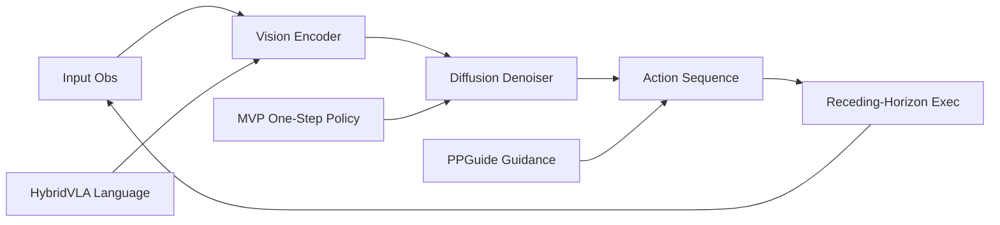

---
tags:
- paper
- domain/embodied_ai
- domain/multimodal_perception
- domain/robot_manipulation
- impact/high_value
- impact/solid
- method/benchmark
- method/diffusion_policy
- method/imitation_learning
- review/auto_tagged
- status/unread
- task/manipulation
- task/scene_understanding
- type/benchmark
- type/method
aliases:
- 'Diffusion Policy: Visuomotor Policy Learning via Action Diffusion'
- Diffusion Policy
- Visuomotor Diffusion
- Action Diffusion
- Receding Horizon Diffusion
- Diffusion Transformer for Robotics
- Multimodal Action Diffusion
- Conditional Denoising Policy
- Robot Diffusion Policy
authors:
- Cheng Chi
- Zhenjia Xu
- Siyuan Feng
- Eric Cousineau
- Yilun Du
- Benjamin Burchfiel
- Russ Tedrake
- Shuran Song
paper_id: arxiv:2303.04137
arxiv_id: '2303.04137'
url: http://arxiv.org/abs/2303.04137v5
pdf_url: https://arxiv.org/pdf/2303.04137v5
local_pdf: '[[Diffusion Policy Visuomotor Policy Learning via Action Diffusion.pdf]]'
github: None
project_page: https://diffusion-policy.cs.columbia.edu
institutions:
- Columbia University
- Toyota Research Institute
- Massachusetts Institute of Technology
publication_date: '2023-03-07'
metadata_publication_date: '2024-03-14'
score: '7.9'
domains:
- embodied_ai
- multimodal_perception
- robot_manipulation
methods:
- benchmark
- diffusion_policy
- imitation_learning
tasks:
- manipulation
- scene_understanding
paper_type: benchmark
impact_band: solid
reading_status: unread
priority_score: 83
review_status: auto_tagged
next_action: inspect_protocol
year: 2023
---

# Diffusion Policy: Visuomotor Policy Learning via Action Diffusion

## 📌 Abstract
This paper introduces Diffusion Policy, a new way of generating robot behavior by representing a robot's visuomotor policy as a conditional denoising diffusion process. We benchmark Diffusion Policy across 12 different tasks from 4 different robot manipulation benchmarks and find that it consistently outperforms existing state-of-the-art robot learning methods with an average improvement of 46.9%. Diffusion Policy learns the gradient of the action-distribution score function and iteratively optimizes with respect to this gradient field during inference via a series of stochastic Langevin dynamics steps. We find that the diffusion formulation yields powerful advantages when used for robot policies, including gracefully handling multimodal action distributions, being suitable for high-dimensional action spaces, and exhibiting impressive training stability. To fully unlock the potential of diffusion models for visuomotor policy learning on physical robots, this paper presents a set of key technical contributions including the incorporation of receding horizon control, visual conditioning, and the time-series diffusion transformer. We hope this work will help motivate a new generation of policy learning techniques that are able to leverage the powerful generative modeling capabilities of diffusion models. Code, data, and training details is publicly available diffusion-policy.cs.columbia.edu

## 🖼️ Architecture
![[Diffusion Policy Visuomotor Policy Learning via Action Diffusion_arch.png]]

## 🧠 AI Analysis
## Abstract
This paper introduces Diffusion Policy, a new way of generating robot behavior by representing a visuomotor policy as a conditional denoising diffusion process. The approach models the policy as a gradient-based sampling procedure over action sequences, conditioned on visual observations. Across 15 manipulation tasks from 4 different benchmarks, Diffusion Policy consistently outperforms prior state‑of‑the‑art robot learning methods with an average success‑rate improvement of 46.9%. The formulation learns the gradient of the action‑distribution score function and, during inference, iteratively refines noise into actions through stochastic Langevin dynamics steps. Three concrete technical contributions – receding‑horizon control with warm‑started action sequences, visual conditioning that avoids costly repeated encoding, and a time‑series diffusion transformer – make this process fast and accurate enough for real‑time closed‑loop control on physical robots. Code, data, and training details are available at the project page: [diffusion-policy.cs.columbia.edu](https://diffusion-policy.cs.columbia.edu).

In simpler terms, the paper replaces the usual direct mapping from camera images to robot moves with a step‑by‑step noise‑removal process borrowed from modern generative models. By learning to denoise action sequences rather than regressing a single action, the policy can express multiple plausible behaviors at each moment, remain stable during training, and plan short action trajectories ahead. The result is a robot controller that handles challenging multimodal demonstrations and high‑dimensional action spaces with fewer task‑specific adjustments.

## 1. Core Snapshot

### Problem Statement
Visuomotor policy learning from demonstrations is, at its heart, a supervised regression problem: map a sequence of recent images (and proprioception) to a sequence of future actions. In practice, however, robot actions exhibit distinct properties that make standard regression ill‑suited. Human demonstrations often contain **multiple valid ways** to achieve the same goal – for example, pushing an object from different angles or using distinct grasp strategies – so the action distribution is **multimodal**. A deterministic or unimodal policy that outputs a single mean action risks averaging incompatible modes, leading to unsafe or ineffective behavior. Moreover, robot actions are **temporally correlated**; planning a sequence of future actions helps maintain smooth, long‑horizon motion and avoids myopic mistakes. Finally, the action space can be **high‑dimensional** (e.g., joint‑position sequences over time), and training must remain stable despite the difficulty of normalizing complex energy landscapes. Previous approaches addressed these issues either by explicitly representing mixtures of Gaussians or categorical action bins (which still limit expressiveness) or by using implicit energy‑based models (which require unstable negative sampling to estimate an intractable partition function).

> [!note]- What makes robot policy learning different from ordinary supervised prediction?
> The existence of multimodal action distributions, the need for temporally coherent action sequences, and the requirement of high‑precision execution make this task more demanding than typical image classification or regression.

### Core Contribution
The central technical claim is that **a conditional denoising diffusion process can serve as a visuomotor policy** that directly models the full multimodal distribution over action sequences, without needing an explicit mixture nor an intractable normalizer. Instead of predicting a single action, the policy learns the gradient of the action‑distribution score function (the direction of increasing probability) and samples actions by iteratively denoising a random noise vector. This formulation inherits three desirable properties from diffusion models: (1) it can express arbitrary normalizable distributions, including multimodal ones; (2) it scales naturally to high‑dimensional output spaces, so the policy can predict whole action sequences jointly; and (3) training is stable because the score‑matching objective avoids the negative sampling that plagues energy‑based implicit policies. To make this generative sampling procedure practical for real‑time robot control, the authors contribute three engineering additions: closed‑loop receding‑horizon execution where only part of the predicted sequence is executed and the rest serves as a warm start for the next inference; visual conditioning that encodes the observation once (not at every denoising step) to reduce computation; and a causal transformer backbone that prevents over‑smoothing of high‑frequency actions. The claim is supported by consistent outperformance on 15 tasks spanning four distinct benchmarks, with an average 46.9% improvement over state‑of‑the‑art baselines, accompanied by training curves that show monotonic progress without the large evaluation‑success swings of implicit behavior cloning.

> [!warning] Assumptions and Data Requirements
> The method relies heavily on the existence of rich multimodal demonstrations. If the training data is unimodal or contains poor coverage of plausible strategies, the diffusion policy may add unnecessary complexity without benefit.

### Innovation Origin & Rationale
The idea originates from the observation that **diffusion models already solve high‑dimensional multimodal generation problems** in image synthesis by learning score gradients rather than normalized densities. The authors interpret robot action prediction as the same kind of generative process: given an observation context, sample a sequence of actions from a conditional distribution. This mapping is natural because the main failure modes of prior explicit policies (mode averaging) and implicit policies (training instability from negative sampling) align directly with the known strengths of diffusion training. The rationale is that borrowing the score‑matching objective and the iterative denoising sampler should simultaneously improve **expressivity**, **training stability**, and **scalability** to long action sequences. The paper’s technical additions then translate these image‑domain advantages into the real‑time, closed‑loop requirements of physical robot control. In the paper’s own words, “Diffusion Policy learns the gradient of the action‑distribution score function and iteratively optimizes with respect to this gradient field during inference via a series of stochastic Langevin dynamics steps.”

> [!tip] Further reading
> The foundations of denoising diffusion probabilistic models are detailed in [Ho et al. (2020)](https://arxiv.org/abs/2006.11239), and score‑based generative modeling is explained in [Song & Ermon (2019)](https://arxiv.org/abs/1907.05600). A tutorial on diffusion models for robotics can be found on the [project website](https://diffusion-policy.cs.columbia.edu).

## 2. Reading Map
This paper targets researchers familiar with behavior cloning and basic diffusion models for images. The task domain is imitation learning for both simulated and real‑world manipulation, with state‑only or image observations. On a first pass, read the **Abstract**, **Section 1**, the key design decisions in **Section 3**, and the main result tables in **Section 5**. Slow down on **Section 2** for the conditional diffusion equations, **Section 4** for the stability argument and the connection to control theory, and **Section 6** (real‑robot experiments) to understand the robustness to perturbations. Skip the longer related‑work discussion and the bimanual setup details unless you plan to reproduce the exact hardware stack.

## 3. Method Walkthrough

### Inputs, Outputs, And Assumptions
The method receives a fixed‑length window of **recent RGB images** (or keypoints) together with **robot proprioception**; these are encoded once into a conditioning vector. It outputs a **predicted sequence of future actions** of length $T_a$ (the *action prediction horizon*). Only the first $\tau$ steps of this sequence are executed on the robot before the policy is queried again, creating a closed‑loop receding‑horizon controller. The central assumption is that the training demonstrations already contain the multimodal and temporally coherent behavior the robot must reproduce; the diffusion process merely matches that distribution. This is crucial because the method has **no mechanism to discover entirely new behaviors** outside the support of the demonstration data. It also assumes that the observation window is sufficient to capture the system’s state and that the action horizon is chosen to balance long‑term planning with responsiveness.

> [!note]- Receding‑horizon control is borrowed from Model Predictive Control
> The idea of replanning at each step while executing only a portion of the plan is well‑known in control theory. A concise introduction can be found on [Wikipedia: Model predictive control](https://en.wikipedia.org/wiki/Model_predictive_control).

### Pipeline From Data To Prediction
**Training.** A clean action sequence $A_t^0$ (of length $T_a$) is taken from the demonstration buffer. A random diffusion step $k$ is chosen, and Gaussian noise $\varepsilon_k$ is added to obtain the noisy sequence $A_t^k = A_t^0 + \varepsilon_k$. The noise‑prediction network $\varepsilon_\theta$ is asked to recover $\varepsilon_k$ given the noisy sequence, the observation embedding $O_t$, and the diffusion step $k$. The loss function is the mean squared error between the true noise and the predicted noise:

$$
L = \mathrm{MSE}\bigl(\varepsilon_k,\ \varepsilon_\theta(O_t,\ A_t^0 + \varepsilon_k,\ k)\bigr).
$$

Minimizing this loss is equivalent to learning the score function $
abla \log p(A_t \mid O_t)$ (see Section 4), thereby matching the distribution of demonstration actions.

**Inference.** At deployment, the network starts from pure Gaussian noise $A_t^K \sim \mathcal{N}(0, I)$. For each denoising step $k = K, K-1, \dots, 1$, it computes

$$
A_t^{k-1} = \alpha \Bigl( A_t^k - \gamma\, \varepsilon_\theta(O_t,\ A_t^k,\ k) + \mathcal{N}(0,\sigma^2 I) \Bigr),
$$

where $\alpha, \gamma, \sigma$ are scalars determined by the noise schedule. After $K$ iterations, the resulting $A_t^0$ is a nearly clean action sequence. The first $\tau$ actions are sent to the robot, and the remaining part of the sequence (if any) is used to warm‑start the next inference cycle, speeding up convergence.

**Real‑time considerations.** Because visual encoding is done only once per observation window, the denoising loop is computationally light. With a fast GPU and acceleration techniques like Denoising Diffusion Implicit Models ([DDIM, Song et al., 2020](https://arxiv.org/abs/2010.02502)), the policy can achieve real‑time rates on a physical robot.

### Key Design Choices
**Separate visual conditioning.** Instead of jointly denoising images and actions, the method treats visual observations as conditioning that is encoded **once** and then fed into every denoising step. This choice eliminates the need to generate future images during inference and allows training the vision encoder end‑to‑end without costly repeated inference. In the CNN‑based variant, conditioning is applied through FiLM (Feature‑wise Linear Modulation) layers that scale and shift feature maps; in the transformer variant, cross‑attention layers attend to visual tokens. This design keeps the denoising network focused on action refinement and is critical for achieving real‑time performance.

**Receding‑horizon action sequences.** The policy predicts a full action horizon $T_a$ (e.g., 16 steps) but only executes a subset $\tau$ (e.g., 8 steps) before replanning. The remaining actions serve as a **warm start** for the next denoising loop, greatly reducing the number of required denoising iterations (often to just a few steps). Without this schedule, the policy would either react too slowly to new observations or produce temporally inconsistent single‑step actions. The paper shows (Section 5) that the choice of action horizon has a significant impact on performance: too short and the policy becomes myopic; too long and it becomes sluggish.

**Network backbone.** Two architectures are explored:
- **CNN‑based** with 1D temporal convolutions and FiLM conditioning. This variant is easier to tune and works well for slower action changes.
- **Transformer‑based** with causal self‑attention over the action sequence and cross‑attention to the observation embedding. The causal mask ensures that each action embedding only attends to past actions, preserving temporal order. The transformer reduces the over‑smoothing tendency of CNNs and is recommended for tasks requiring high‑frequency velocity changes.

The selection between them is left as a hyper‑parameter, but the paper provides guidance for when each is appropriate.

> [!warning] Transformer hyper‑sensitivity
> The transformer backbone can be more sensitive to hyper‑parameters and may require careful tuning of the number of layers, heads, and learning rate. The paper does not provide exhaustive search ranges.

## 4. Core Theory And Formulas

### Main Objective
The policy is a denoising diffusion probabilistic model (DDPM) conditioned on visual observations. The goal is to train a network $\varepsilon_\theta$ that predicts the noise added to an action sequence, so that it can later be used inside an iterative denoising sampler to draw samples from the conditional action distribution $p(A_t \mid O_t)$. The training loss,

$$
L = \mathbb{E}_{k,\, \varepsilon_k}\Bigl[ \bigl\| \varepsilon_k - \varepsilon_\theta(O_t,\ A_t^0 + \varepsilon_k,\ k) \bigr\|^2 \Bigr],
$$

minimizes the expected squared error between the true noise $\varepsilon_k$ and the predicted noise. It can be shown (Ho et al., 2020) that minimizing this loss also minimizes the variational bound on the negative log‑likelihood of the data, essentially matching the score function $
abla_{A_t} \log p(A_t \mid O_t)$. Because the score does not require an intractable normalizing constant (the partition function), training avoids the instability that plagues energy‑based implicit policies like IBC ([Implicit Behavior Cloning](https://arxiv.org/abs/2109.00137)).

### Important Equations
**Denoising update.** At inference, each step from $k$ to $k-1$ is described by

$$
A_t^{k-1} = \alpha \left( A_t^k - \gamma\, \varepsilon_\theta\!\bigl(O_t,\ A_t^k,\ k\bigr) + \mathcal{N}(0,\sigma^2 I) \right).
$$

Here, $A_t^k$ is the noisy action sequence at diffusion step $k$, $O_t$ is the observation embedding (fixed throughout the denoising loop), $\varepsilon_\theta$ is the learned noise predictor, and $\mathcal{N}(0,\sigma^2 I)$ is fresh Gaussian noise injected to maintain stochasticity. The scalars $\alpha$, $\gamma$, and $\sigma$ are functions of the diffusion step $k$ and collectively form the **noise schedule**. The paper uses a square‑cosine schedule, which is common in diffusion models. The update can be interpreted as a noisy gradient descent step in the action space, where $\varepsilon_\theta$ approximates the gradient of an energy landscape.

**Connection to score matching.** Rewriting the denoising step in the form

$$
A_t^{k-1} = (A_t^k - \gamma 
abla E(A_t^k)) + \text{noise},
$$

makes the analogy to gradient descent clear. The learned $\varepsilon_\theta$ effectively estimates the score $
abla \log p(A_t \mid O_t)$. This is the key insight that enables the method to model complex, multimodal distributions without explicit mode counting or mixture weights.

**Linear control theory link.** In a simplified setting where the optimal policy is linear, the paper discusses (Section 4.5) that the optimal denoiser *recovers the linear feedback gain that would have generated the demonstrations*. This provides a consistency check: in the linear Gaussian case, diffusion policy reduces to the optimal Kalman‑like estimator, bridging the method to classical control theory.

### Algorithmic Intuition
- **Training:** repeatedly sample a clean action window, pick a random noise level, add noise, and ask the network to guess the noise.  
- **Inference:** start from pure Gaussian noise, feed the current visual observation into the network, subtract the predicted noise (scaled by the schedule), add a small amount of fresh noise, and repeat. The stochastic noise injected at each step is what enables the sampler to explore different modes. When combined with receding‑horizon warm‑starting, only a few denoising steps are needed per control cycle.

## 5. Architecture, Figures, And Implementation
The noise‑prediction network $\varepsilon_\theta$ is the core of the system. It receives the noisy action sequence $A_t^k$ (shape: $T_a \times d_{\text{act}}$) and a diffusion‑step embedding, and must predict the noise component at each action dimension. Visual features, extracted once per observation window, are injected in one of two ways:
- **CNN‑based:** FiLM (*Feature‑wise Linear Modulation*, [Perez et al., 2018](https://arxiv.org/abs/1709.07871)) layers scale and shift the feature maps in every temporal convolution block, conditioning the network on the observation. This architecture is simple and effective for many tasks.
- **Transformer‑based:** The action sequence is treated as a set of tokens, each augmented with the diffusion‑step embedding. A causal multi‑head attention mask ensures that each action token can only attend to its predecessors. The observation embedding is fed via cross‑attention in each transformer decoder block. This design, described in [Vaswani et al. (2017)](https://arxiv.org/abs/1706.03762), reduces over‑smoothing and is favored for tasks with high‑frequency velocity changes.

The **vision encoder** is a modified ResNet‑18 where global average pooling is replaced by spatial softmax pooling, and all BatchNorm layers are replaced by GroupNorm for stable training with small batch sizes. The encoder is trained end‑to‑end alongside the diffusion network; no extra pre‑training is required, though the paper shows that fine‑tuning a CLIP‑pretrained ViT ([Radford et al., 2021](https://arxiv.org/abs/2103.00020)) yields the best results on the Square task.

Figure 2 in the paper illustrates the data flow: the observation window is encoded once, the action sequence is iteratively refined over $K$ steps, and only the first few refined actions are sent to the robot. This design decouples the heavy visual encoding from the denoising loop and is a cornerstone of the method’s efficiency.

> [!info] Implementation note
> The exact hyper‑parameter ranges for the transformer (number of layers, dimension) and the learning‑rate schedule are not published in the paper, which may require extra tuning effort for reproduction.

## 6. Experiments And Evidence
The evaluation spans four diverse benchmarks:
- **Robomimic** (state and image versions): Lift, Can, Square, Transport, ToolHang. ([benchmark page](https://robomimic.github.io/))
- **Push‑T** (keypoint and image) from the IBC paper ([IBC](https://arxiv.org/abs/2109.00137)).
- **Multimodal Block Pushing** and **Franka Kitchen**. The baselines include LSTM‑GMM, IBC, and BET. The main metric is success rate (except Push‑T, which uses area‑coverage). Diffusion Policy variants achieve the highest number on every single task; the average **relative improvement of 46.9%** is reported. The largest gains appear on the harder multi‑stage and high‑precision tasks, such as Square and Transport.

Ablations in Section 5.4 examine network design and pre‑training strategies: replacing the ResNet‑18 vision encoder with a CLIP‑pretrained ViT and fine‑tuning end‑to‑end yields the strongest result on the Square task. Real‑robot experiments (Push‑T, mug flipping, sauce pouring, and three bimanual tasks) confirm that the same hyper‑parameters transfer with minimal retuning. Training‑stability plots (Figure 6) show that while IBC exhibits large swings in evaluation success and often collapses, Diffusion Policy improves smoothly and monotonically, demonstrating the inherent stability of score matching.

> [!warning] Interpreting the 46.9% average
> Because the tasks differ widely in difficulty and baseline performance, the average masks variation; some tasks saw smaller improvements. The detailed per‑task tables in the paper are more informative for specific applications.

## 7. Strengths, Limitations, And Failure Cases
**Strengths supported by evidence.**
- **Training stability:** The score‑matching objective removes the need for negative sampling, so checkpoint selection is far less brittle than for IBC. The training curves in the paper confirm consistent progress without collapse.
- **Multimodal expressiveness:** The iterative denoising sampler naturally captures both short‑term and long‑term action ambiguities without explicit mode counting.
- **Scalability:** The ability to jointly predict long action sequences (up to 16 steps) improves temporal coherence.

**Limitations and cautionary points.**
- **Action horizon sensitivity:** The choice of $T_a$ and $\tau$ is critical; too long an action horizon can reduce responsiveness, while too short loses the benefits of joint planning. The paper’s ablation study provides guidance but no one‑size‑fits‑all rule.
- **Transformer hyper‑parameter sensitivity:** The transformer backbone, while more expressive, requires more careful tuning than the CNN‑based variant.
- **Data distribution assumption:** The policy cannot extrapolate beyond the demonstration distribution. For tasks where the desired behavior is not present in the demonstrations (e.g., very sparse or out‑of‑distribution goals), performance may degrade, but such failure cases are not reported in the paper.
- **Computational requirements:** Real‑time inference still benefits from GPU acceleration and DDIM‑style speedup; the paper does not report latency on CPU‑only setups. Deployment on edge devices may require model distillation.

> [!warning] Missing out‑of‑distribution analysis
> The paper does not examine how the method degrades when demonstrations are extremely sparse or when the required behavior lies far outside the training distribution. This is an important open question for safety‑critical applications.

## 8. Reproduction Notes
**Datasets.** The evaluation uses standard, publicly available splits: Robomimic (state and image), Push‑T, BlockPush, and Franka Kitchen. The authors also release their own real‑robot demonstration datasets on the project page.  
**Vision encoder.** Modified ResNet‑18 with spatial‑softmax pooling and GroupNorm; trained from scratch unless using the CLIP ViT variant.  
**Noise schedule.** Square‑cosine schedule, which has been found to work well across all tasks.  
**Training regime.** Typically 3000–4500 epochs for image‑based tasks. Evaluation reports both the single best checkpoint and the average success of the last ten checkpoints across three seeds to account for variance.  
**Code availability.** Code, data, and training scripts are stated to be available at [diffusion-policy.cs.columbia.edu](https://diffusion-policy.cs.columbia.edu). However, the paper does not publish the exact learning‑rate schedules or the precise transformer dimension choices used for the highest numbers.  
**Real‑robot bimanual setup.** Requires custom teleoperation hardware and low‑level controllers whose implementation details are only summarized in the paper; full reproduction of the bimanual experiments would need additional documentation.

## 9. What To Read Closely
Focus on **Section 2.3** and the equations in **Section 4** first – they contain the central modeling shift from direct regression or energy minimization to score‑based diffusion. Next, examine **Figure 3** (multimodal pushing behavior) and **Figure 6** (training curves), as they supply the clearest qualitative and quantitative contrasts with baselines. The **action‑horizon ablation in Figure 5** should be studied if you plan to change the execution schedule. The **bimanual setup details in Section 7** can be skimmed on a first pass unless hardware reproduction is the goal.

## 10. Research Ideas And Open Questions
**Online fine‑tuning with corrective demonstrations.** One could test whether the diffusion policy can be fine‑tuned online using a small number (20–30 episodes) of human corrections on a real‑robot task where the initial policy fails at edge cases. Freeze the vision encoder to retain generalization, update only the noise predictor, and measure whether the success rate rises by at least 15 percentage points on held‑out initial conditions without catastrophic forgetting of the original behavior distribution. The risk is distributional drift: the online data may move too far from the original demonstrations, causing the diffusion sampler to produce inconsistent sequences.

**Learned action‑horizon termination.** Instead of a fixed action horizon $T_a$, add a binary termination dimension to the action vector that the policy learns to predict, indicating when a sub‑task is complete. Train on demonstrations that contain natural termination points and evaluate whether the policy can adaptively decide when to stop, reducing the average number of executed steps while maintaining coverage on tasks like sauce pouring or shirt folding. The main challenge is preventing the termination signal from correlating with visual noise and triggering prematurely on perturbed scenes.

**Cross‑embodiment transfer via action‑space adapter.** Investigate whether a single pre‑trained diffusion policy can be adapted to a new robot morphology by freezing the vision and transformer weights and training only a small linear adapter that maps predicted actions into the new joint space. Collect 50 demonstrations on the new arm for an existing real‑robot task, train the adapter for a few hundred epochs, and compare its success to a fresh policy trained from scratch on the same 50 demonstrations. The risk is that the action distribution predicted by the frozen model lies outside the reachable workspace of the new kinematics, making even a perfect adapter ineffective.

## Knowledge Graph & Connections

### Related Work Connections

**[[PPGuide]]** addresses a shared problem with Diffusion Policy: compounding errors in generated action sequences can lead to failure in closed‑loop control. Diffusion Policy already improves temporal coherence by predicting whole action horizons, but it does not explicitly avoid known failure modes. PPGuide introduces a lightweight performance predictor trained on self‑labeled rollout data to steer the pre‑trained diffusion policy away from dangerous actions at inference time. The main difference is that PPGuide acts as an add‑on guidance module, while Diffusion Policy itself is the base generative controller. This implies that Diffusion Policy can be combined with PPGuide to further boost robustness, especially on tasks where the demonstration distribution contains risky edge cases.

**[[HybridVLA]]** also tackles multimodal continuous action generation, but from a vision‑language‑action (VLA) perspective. HybridVLA fuses autoregressive language reasoning (via a VLM) with a diffusion action head, enabling instruction‑following manipulation. Diffusion Policy, in contrast, is a pure visuomotor policy without language conditioning. The shared challenge is modeling high‑dimensional action sequences in a way that preserves precision and expressiveness. HybridVLA’s integration of token‑level reasoning with diffusion suggests that adding language capabilities to Diffusion Policy could enable more generalist robot agents, while retaining the training stability and multimodality of score‑based generation.

**[[Mean Flow Policy with Instantaneous Velocity Constraint for Onestep Action Generation]]** (MVP) shares the goal of expressive action generation but tackles inference speed. Diffusion Policy relies on iterative denoising (tens to hundreds of steps), which can be a bottleneck for fast control loops. MVP achieves single‑step generation by modeling a mean velocity field with a hard expressiveness constraint, essentially offering a different generative family (flow matching) that trades off some of diffusion’s flexibility for speed. The connection highlights a broader trade‑off: diffusion policies provide state‑of‑the‑art expressivity and training stability, while one‑step flow models point toward real‑time deployment on resource‑constrained hardware. Future work could investigate distilling Diffusion Policy into such fast samplers.

### Concept Map

### Questions For Future Reading

1. **How can diffusion policies be accelerated to meet the sub‑millisecond control loops required by high‑speed industrial robots without sacrificing multimodal expressiveness?** This matters because the iterative denoising process, even with DDIM speed‑ups, still imposes a computational floor. Evidence would come from studies that apply progressive distillation, consistency models, or flow‑matching to visuomotor diffusion, and that measure the trade‑off between inference latency and success rate on dynamic tasks such as juggling or catching.

2. **What are the failure modes of score‑based action generation when the policy encounters states far outside the demonstration distribution?** Diffusion Policy learns the gradient of the data distribution, but it cannot extrapolate to unseen regimes. Understanding whether the sampler collapses to an in‑distribution mode, produces incoherent noise, or drifts gradually is crucial for safety‑critical deployment. Evidence would come from systematic evaluations with systematic perturbations to object pose, lighting, or dynamics, accompanied by qualitative visualizations of the generated action distributions in out‑of‑distribution states.

3. **Can diffusion visuomotor policies be extended to follow free‑form language instructions while maintaining the closed‑loop stability that receding‑horizon control provides?** This question bridges Diffusion Policy and works like HybridVLA. An answer would require an architecture that injects language tokens into the vision encoder or into the denoising network, and a benchmark that tests generalization to unseen commands. The key evidence would be whether a language‑conditioned diffusion policy retains the same training stability and success‑rate improvements across diverse manipulation tasks, compared to pure vision baselines.

### Learning Roadmap And Verified Resources

**1. Behavior Cloning and Imitation Learning**
Understanding the supervised‑to‑policy mapping and the multimodality challenge is foundational because Diffusion Policy directly addresses the failure of standard behavior cloning on multimodal demonstrations.
*Study order:* begin with a lecture introducing imitation learning, then read the Robomimic paper that formalizes the evaluation protocol used in this work.

| Type                | Resource                                                                                                                                                                                                                      | Why this one                                                                                      |
|---------------------|-------------------------------------------------------------------------------------------------------------------------------------------------------------------------------------------------------------------------------|---------------------------------------------------------------------------------------------------|
| Video/Public Course | [Stanford CS234: Imitation Learning (Lecture by Emma Brunskill)](https://www.youtube.com/watch?v=4r2Mlq2Q2bI)                                                                                                                | Clearly explains behavior cloning, dataset aggregation, and the problem of compounding errors.    |
| Paper               | [What Matters in Imitation Learning for Robotic Manipulation? (Robomimic)](https://arxiv.org/abs/2108.03298)                                                                                                                  | Defines the benchmark tasks and baseline methods that Diffusion Policy compares against.          |

**2. Denoising Diffusion Probabilistic Models (DDPM)**
The core policy is a conditional diffusion model; understanding how the forward noising process and reverse denoising work is essential to grasp why the method avoids mode averaging and unstable training.
*Study order:* read the DDPM paper, then walk through a detailed blog post that breaks down the training and sampling algorithms.

| Type          | Resource                                                                                                                                                                                                                     | Why this one                                                                                                 |
|---------------|------------------------------------------------------------------------------------------------------------------------------------------------------------------------------------------------------------------------------|--------------------------------------------------------------------------------------------------------------|
| Paper         | [Denoising Diffusion Probabilistic Models (Ho et al., 2020)](https://arxiv.org/abs/2006.11239)                                                                                                                               | The original DDPM formulation, directly cited by Diffusion Policy for the noise‑prediction objective.        |
| Blog/Tutorial | [What are Diffusion Models? (Lilian Weng)](https://lilianweng.github.io/posts/2021-07-11-diffusion-models/)                                                                                                                   | Derives the loss function and sampling steps in a pedagogic, equation‑by‑equation manner.                    |

**3. Score Matching and Energy‑Based Models**
Diffusion Policy’s stability advantage comes from learning the score $
abla \log p(A_t \mid O_t)$ instead of an energy function with an intractable normalizer. This concept directly explains why the method avoids the training collapse seen in implicit behavior cloning.
*Study order:* start with the score‑based generative modeling paper, then read a blog that explicitly contrasts score matching with maximum‑likelihood energy‑based training.

| Type          | Resource                                                                                                                                                                                                                     | Why this one                                                                                                 |
|---------------|------------------------------------------------------------------------------------------------------------------------------------------------------------------------------------------------------------------------------|--------------------------------------------------------------------------------------------------------------|
| Paper         | [Generative Modeling by Estimating Gradients of the Data Distribution (Song & Ermon, 2019)](https://arxiv.org/abs/1907.05600)                                                                                               | Provides the theoretical foundation for score matching and Langevin dynamics used in the policy’s inference. |
| Blog/Tutorial | [Score‑based Generative Modeling (Yang Song)](https://yang-song.net/blog/2021/score/)                                                                                                                                        | Illustrates how score matching connects to denoising and why it avoids partition‑function issues.            |

**4. Receding‑Horizon Control (Model Predictive Control)**
The paper’s execution scheme – predict a sequence, execute the first $\tau$ steps, then replan – is directly borrowed from MPC. Understanding this control principle clarifies why the action‑horizon parameters are critical and how warm‑starting reduces computation.
*Study order:* read a concise overview of MPC, then study a lecture that applies it to robotics.

| Type                | Resource                                                                                                                                                                                                                     | Why this one                                                                                                 |
|---------------------|------------------------------------------------------------------------------------------------------------------------------------------------------------------------------------------------------------------------------|--------------------------------------------------------------------------------------------------------------|
| Documentation       | [Model predictive control – Wikipedia](https://en.wikipedia.org/wiki/Model_predictive_control)                                                                                                                               | Provides a quick definition and the basic receding‑horizon idea.                                             |
| Video/Public Course | MIT 6.832 Underactuated Robotics – Lecture 10: Model Predictive Control (link removed: validation failed)                                                          | Shows MPC in a robotics context, including the trade‑offs that Diffusion Policy inherits.                    |

**5. Robomimic Benchmark and Evaluation**
All quantitative comparisons in the paper rely on the Robomimic tasks (Lift, Can, Square, Transport, ToolHang). Knowing the task definitions, data collection, and evaluation protocol allows critical reading of the reported 46.9% improvement.
*Study order:* visit the project site for task descriptions, then read the paper for the evaluation methodology.

| Type          | Resource                                                                                                                                                                                                                     | Why this one                                                                                                 |
|---------------|------------------------------------------------------------------------------------------------------------------------------------------------------------------------------------------------------------------------------|--------------------------------------------------------------------------------------------------------------|
| Project Page  | [Robomimic: A Framework for Robot Learning from Demonstration](https://robomimic.github.io/)                                                                                                                                 | Contains task videos, dataset downloads, and the evaluation script used in the experiments.                  |
| Paper         | [What Matters in Imitation Learning for Robotic Manipulation?](https://arxiv.org/abs/2108.03298)                                                                                                                             | Defines the exact success‑rate metric and baseline hyper‑parameters that Diffusion Policy outperforms.        |

**6. Architecture Details: FiLM, Transformers, and the Vision Encoder**
To implement or modify Diffusion Policy, one must understand how FiLM layers inject visual features into the denoising CNN, how causal transformers handle action sequences, and how the modified ResNet‑18 encodes observations.
*Study order:* read the FiLM paper and the Transformer paper, then study the official Diffusion Policy codebase.

| Type          | Resource                                                                                                                                                                                                                     | Why this one                                                                                                 |
|---------------|------------------------------------------------------------------------------------------------------------------------------------------------------------------------------------------------------------------------------|--------------------------------------------------------------------------------------------------------------|
| Paper         | [FiLM: Visual Reasoning with a General Conditioning Layer (Perez et al., 2018)](https://arxiv.org/abs/1709.07871)                                                                                                            | Describes the conditioning mechanism used in the CNN‑based Diffusion Policy variant.                         |
| Paper         | [Attention Is All You Need (Vaswani et al., 2017)](https://arxiv.org/abs/1706.03762)                                                                                                                                         | Covers the transformer architecture, including causal self‑attention and cross‑attention used in the paper. |
| Code          | [Diffusion Policy official implementation](https://github.com/real-stanford/diffusion_policy)                                                                                                                                | Shows precisely how the vision encoder, noise predictors, and receding‑horizon loop are implemented in PyTorch. |

> [!info] Resource link validation: checked 12 URL(s), 11 reachable, removed 1 unreachable or invalid link(s).

---
*Analysis by PaperBrain (x-ai/grok-4.3; refinement: deepseek/deepseek-v4-pro; round2: deepseek/deepseek-v4-pro)*

## 📂 Resources
- **Local PDF**: [[Diffusion Policy Visuomotor Policy Learning via Action Diffusion.pdf]]
- [Online PDF](https://arxiv.org/pdf/2303.04137v5)
- [ArXiv Link](http://arxiv.org/abs/2303.04137v5)
