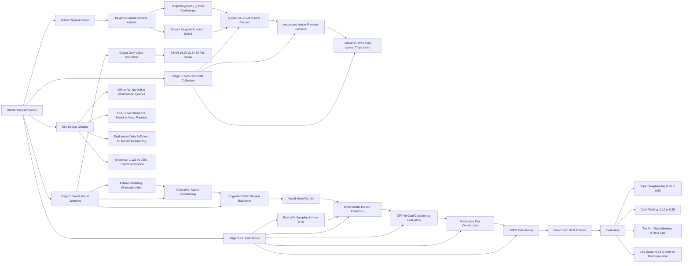

---
tags:
  - paper
  - Robot_Manipulation
  - World_Model
  - Reinforcement_Learning
  - Embodied_AI
  - Foundation_Model
aliases:
  - "DreamPlan: Efficient Reinforcement Fine-Tuning of Vision-Language Planners via Video World Models"
url: http://arxiv.org/abs/2603.16860v1
pdf_url: https://arxiv.org/pdf/2603.16860v1
local_pdf: "[[DreamPlan Efficient Reinforcement FineTuning of VisionLanguage Planners via Video World Models.pdf]]"
github: "None"
project_page: "https://psi-lab.ai/DreamPlan/"
institutions:
  - "USC Physical Superintelligence Lab"
  - "Toyota Research Institute"
publication_date: "2026-03-17"
score: 8
---

# DreamPlan: Efficient Reinforcement Fine-Tuning of Vision-Language Planners via Video World Models

## 📌 Abstract
Robotic manipulation requires sophisticated commonsense reasoning, a capability naturally possessed by large-scale Vision-Language Models (VLMs). While VLMs show promise as zero-shot planners, their lack of grounded physical understanding often leads to compounding errors and low success rates when deployed in complex real-world environments, particularly for challenging tasks like deformable object manipulation. Although Reinforcement Learning (RL) can adapt these planners to specific task dynamics, directly fine-tuning VLMs via real-world interaction is prohibitively expensive, unsafe, and sample-inefficient. To overcome this bottleneck, we introduce DreamPlan, a novel framework for the reinforcement fine-tuning of VLM planners via video world models. Instead of relying on costly physical rollouts, DreamPlan first leverages the zero-shot VLM to collect exploratory interaction data. We demonstrate that this sub-optimal data is sufficient to train an action-conditioned video generation model, which implicitly captures complex real-world physics. Subsequently, the VLM planner is fine-tuned entirely within the "imagination" of this video world model using Odds Ratio Policy Optimization (ORPO). By utilizing these virtual rollouts, physical and task-specific knowledge is efficiently injected into the VLM. Our results indicate that DreamPlan bridges the gap between semantic reasoning and physical grounding, significantly improving manipulation success rates without the need for large-scale real-world data collection. Our project page is https://psi-lab.ai/DreamPlan/.

## 🖼️ Architecture
![[DreamPlan Efficient Reinforcement FineTuning of VisionLanguage Planners via Video World Models_arch.jpeg]]

## 🧠 AI Analysis

# 🚀 Deep Analysis Report: DreamPlan: Efficient Reinforcement Fine-Tuning of Vision-Language Planners via Video World Models

## 📊 Academic Quality & Innovation
---

## 1. Core Snapshot

### Problem Statement
Vision-Language Models (VLMs) are attractive zero-shot planners for robotic manipulation due to their broad semantic priors, but they fundamentally lack task-specific physical grounding. This deficiency is most acute in deformable object manipulation (cloth, rope, soft toys), where dynamics are highly nonlinear, sensitive to subtle action variations, and produce drastic topological state changes. Direct RL fine-tuning on real hardware is prohibitively expensive, unsafe, and sample-inefficient. Simulation-based alternatives suffer from severe sim-to-real gaps for deformable objects. Prior world-model approaches are predominantly trained on rigid-body interactions or curated demonstration data, limiting their applicability to complex deformable dynamics.

### Core Contribution
DreamPlan introduces an efficient offline RL fine-tuning framework that adapts VLM planners to complex real-world deformable object dynamics entirely within the imagination of an action-conditioned video diffusion world model, using Best-of-K sampling combined with ORPO-based preference optimization to avoid repeated costly video generation during training.

### Academic Rating
- **Innovation: 7.5/10** — The combination of using sub-optimal zero-shot exploratory data to train a video world model and then performing offline preference-based RL within that model's imagination is a coherent and practically motivated contribution. The Best-of-K + ORPO decoupling to avoid online diffusion inference overhead is a meaningful engineering insight. However, the individual components (video diffusion as world model, ORPO fine-tuning, ControlNet conditioning) are well-established; the novelty lies in their compositional integration for deformable manipulation.
- **Rigor: 6.5/10** — The real-world evaluation on three tasks with 10 trials each is limited in statistical power. The ablation coverage is narrow (object-only vs. full-scene video prediction; explicit verification vs. DreamPlan). Comparisons with other world-model-assisted RL methods (e.g., World-Env, WMPO) on the same hardware are absent. The evaluation metric (0/0.5/1 ordinal score) is coarse.

---

## 2. Technical Decomposition

### Algorithmic Logic

The framework operates in three sequential stages:

**Stage 1 — Zero-Shot Data Collection.**
The pretrained VLM planner π_θ(a_t | o_t, g) is deployed zero-shot in the target real-world environment. At each step t, the robot observes the current RGB image o_t and a goal image g. The VLM generates candidate keypoint-based manipulation actions, which are executed via a deterministic action primitive. This produces a dataset D = {(o_0^i, g^i, a_{0:H−1}^i, o_{1:H}^i)}_{i=1}^{N_D} of approximately 2,056 trajectories (~4 hours of robot interaction) collected automatically. Critically, this dataset is dominated by failed or sub-optimal executions; however, it provides dense coverage of action–outcome causal relationships across the state space, which is precisely the signal required to learn a dynamics model.

*Intuition*: Exploratory (even failed) data is far more informative for learning a forward dynamics model than curated demonstrations, because it covers diverse physical interaction patterns. This inverts the usual supervised imitation learning paradigm, where failed data is discarded.

**Stage 2 — Action-Conditioned Video World Model Learning.**
A video diffusion model W_φ is trained on D to predict object deformation outcomes conditioned on robot actions. The core architectural challenge is injecting low-level action information (pick-and-place keypoints) into a pretrained video diffusion backbone while preventing the model from memorizing robot arm visual appearance instead of learning deformation dynamics. This is addressed by:

1. **Action rendering**: Given an action sequence a_{0:H−1}, the robot arm kinematic configuration is rendered into a synthetic video r^i = render(a_{0:H−1}^i), producing a visual trajectory of the intended end-effector motion.
2. **ControlNet conditioning**: A ControlNet-style residual branch Δ_φ injects the rendered robot trajectory features into the frozen pretrained diffusion backbone ε_θ at corresponding layers, enforcing pixel-level spatial alignment between action signals and generated deformation.
3. **Object-only prediction**: The model is trained to predict cropped, background-removed object videos (white background) rather than full-scene videos, reducing the reconstruction burden on irrelevant visual details (lighting, table texture, robot arm appearance) and forcing the network to focus representational capacity on deformation dynamics.

The backbone used is CogVideoX-5B (image-to-video), fine-tuned on D.

**Stage 3 — Offline RL Fine-Tuning via Best-of-K + ORPO.**
Given the learned world model $W_φ$, VLM fine-tuning proceeds entirely offline:

1. For each training pair ($o_0^i$, $g^i$) ∈ D, the VLM planner samples a batch of K candidate action sequences ${a_k}_{k=1}^K$.
2. The world model $W_φ$ predicts the corresponding physical outcomes ${ô_k}_{k=1}^K$ (rollout videos of deformation).
3. A task-level objective evaluates the predicted outcomes against the goal image g using GPT-4o as a visual evaluator. The action achieving the best goal-consistency score is designated the positive sample a*, while all remaining K−1 actions are negatives $a_j^−$.
4. These world-model-informed preferences are used to fine-tune π_θ via ORPO, without requiring any additional world-model queries during the gradient update step.

*Intuition for Best-of-K design*: Online RL would require querying the video diffusion model at every gradient step, which is computationally prohibitive (approximately 1 minute per inference). The Best-of-K strategy amortizes this cost: generate K rollouts once per training instance to construct a preference pair, then perform multiple gradient updates on this pair without further world-model queries. This decouples the slow video generation from the fast policy gradient computation.

---

### Mathematical Formulation

**World Model Training Loss (Diffusion):**

$$\mathcal{L}_{\text{diff}} = \mathbb{E}_{\mathbf{x}_{0}^{i}, t, \epsilon} \left[ \| \epsilon - \hat{\epsilon}(\mathbf{x}_t^i, t, c, \mathbf{r}^i) \|_2^2 \right] \tag{4}$$

- $\mathbf{x}_t^i$: Noisy latent of the ground-truth observation video at diffusion timestep $t$, for the $i$-th training trajectory.
- $\epsilon$: True Gaussian noise added during the forward diffusion process.
- $\hat{\epsilon}(\cdot)$: Predicted noise, computed as $\epsilon_\theta(\mathbf{x}_t^i, t, c^i) + \Delta_\phi(\mathbf{x}_t^i, t, \mathbf{r}^i)$, where $\epsilon_\theta$ is the frozen pretrained backbone, $\Delta_\phi$ is the trainable ControlNet residual branch.
- $c^i$: Text and input image conditioning signals for the $i$-th sample.
- $\mathbf{r}^i$: Rendered robot arm trajectory video corresponding to action sequence $a_{0:H-1}^i$.

**Physical Meaning**: Minimizing this loss trains the ControlNet branch $\Delta_\phi$ to inject action-conditioned structural features into the diffusion backbone such that the denoising process faithfully reconstructs the physical deformation induced by the commanded robot motion. The frozen backbone retains its pretrained visual priors while the residual branch specializes to task-specific dynamics.

**Rendered Action Representation:**

$$\mathbf{r}^i = \text{render}(a_{0:H-1}^i) \tag{3}$$

- $a_{0:H-1}^i$: Sequence of pick-and-place keypoint actions over the rollout horizon $H$.
- $\text{render}(\cdot)$: A kinematic rendering function that synthesizes a video of robot arm configurations corresponding to the commanded joint trajectories, producing a visually explicit representation of the intended motion.

**Action Representation:**

$$a_t = (k_s^{i_t}, k_g^{j_t}) \tag{1}$$

- $k_s^{i_t} \in \mathcal{K}_s$: Source keypoint selected from the set of detected keypoints on the current observation $o_t$, defining the grasp location.
- $k_g^{j_t} \in \mathcal{K}_g$: Target keypoint selected from the set of keypoints on the goal image $g$, specifying the intended placement location.

**Physical Meaning**: This discrete keypoint-based action space drastically reduces the combinatorial complexity of the VLM's output space, eliminates spatial ambiguity from continuous coordinate regression, and grounds the planner's decisions in visually meaningful regions of the scene.

**ORPO Fine-Tuning Loss:**

$$\mathcal{L}_{\text{ORPO}} = \log \sigma \left( \log \pi_\theta(a^* | s^i) - \log \pi_\theta(a^- | s^i) \right) \tag{5}$$

- $\sigma(\cdot)$: Sigmoid function.
- $\pi_\theta(a | s^i)$: Log-likelihood of action $a$ under the current VLM planner given state $s^i = (o_0^i, g^i)$.
- $a^*$: Positive action — the candidate action whose world-model-predicted outcome best matches the goal image $g$.
- $a^-$: A sampled negative action from the remaining $K-1$ candidates.

**Physical Meaning**: ORPO directly maximizes the log-likelihood ratio of preferred over disfavored actions in a single contrastive objective, without requiring a separate value function or critic. This is memory-efficient relative to PPO and avoids the reference-model KL penalty of DPO, making it suitable for large VLM fine-tuning. The world model's physical evaluation is distilled into the planner's policy through this preference signal.

---

### Tensor Flow & Architecture

**VLM Planner Input Processing:**
- Raw RGB observation: [H=540, W=960, 3] → SAM2 segmentation → object mask $M_k$, goal mask $M_g$
- Farthest Point Sampling over masks → keypoint sets $\mathcal{K}_s \subset \mathbb{R}^{N_t \times 2}$, $\mathcal{K}_g \subset \mathbb{R}^{N_g \times 2}$
- Keypoints rendered as overlaid dots on RGB images → visual context fed to Qwen3-VL-8B
- VLM outputs: discrete pair $(k_s^{i_t}, k_g^{j_t})$ indexing into the keypoint sets

**World Model Architecture:**
- Base: CogVideoX-5B (image-to-video diffusion transformer)
- Input: Cropped object-only initial frame [B, 3, H', W'] + rendered action trajectory video [B, T, 3, H', W'] + text condition
- ControlNet Branch: Processes rendered robot trajectory → injects features into diffusion backbone via residual addition at each transformer block
- Output: Predicted object-only deformation video [B, T, 3, H', W'] on white background
- Key design: Object-only prediction achieves PSNR of 26.25 vs. 24.70 for full-scene prediction (Table II), confirming that background removal improves deformation modeling fidelity.

**Best-of-K Sampling:**
- For each (o_0, g) pair: VLM samples K=4 or K=8 action candidates in parallel
- Each action → rendering → world model inference → K predicted outcome videos
- GPT-4o evaluates K predicted final frames against goal image g → scalar score per candidate
- Best-scoring action → positive sample; remainder → negative samples for ORPO

---

### Innovation Logic

| Aspect | Prior Approaches | DreamPlan |
|---|---|---|
| Training data for world model | Curated successful demonstrations or rigid-body interaction data | Sub-optimal, failed zero-shot VLM exploratory data |
| World model inference in RL loop | Online: repeated queries per gradient step | Offline: Best-of-K amortizes generation cost |
| Action conditioning | Text-prompt conditioning or latent code injection | Rendered robot kinematic video + ControlNet structural conditioning |
| RL algorithm | PPO or online DPO | ORPO (no reference model, no value function) |
| Object representation | Full-scene video prediction | Object-only cropped video prediction (background removed) |

The key mathematical distinction from explicit verification baselines (Table III) is that DreamPlan's world model knowledge is distilled into the VLM's weights via ORPO, enabling a single forward pass for action selection at inference time (1.12s), whereas explicit verification requires N separate world-model rollouts per decision (926s for N=4), yielding a ~824× speedup with superior performance.

---

## 3. Evidence & Metrics

### Benchmark & Baselines

**Tasks**: Three real-world deformable manipulation tasks — (1) rope straightening, (2) cloth folding, (3) toy arm repositioning. Each evaluated over 10 rollout trials with randomized initial states. Score scale: {0, 0.5, 1}.

**Baselines**:
- Qwen3-VL-4B, Qwen3-VL-8B, Qwen3-VL-32B (zero-shot VLMs of varying scale)
- GPT-4o (zero-shot, frontier commercial model)
- CogVideoX-5B-I2V and Wan2.2-I2V-A14B (state-of-the-art image-to-video generation models used as alternative world models)
- Explicit Verification baseline (N=4, N=8 zero-shot candidates rolled out by world model, evaluated by GPT-4o)

**Fairness Assessment**: The comparison is reasonably fair in that all baselines use the same action primitive and evaluation protocol. However, the zero-shot baselines are not given the RL fine-tuning advantage, so Table I conflates model architecture differences with training regime differences. The comparison against Qwen3-VL-32B zero-shot (a 4× larger model) is useful for demonstrating that fine-tuning a smaller model can surpass scale. The explicit verification comparison in Table III is the most informative controlled experiment.

### Key Results

| Method | Rope Straightening | Cloth Folding | Toy Arm Repositioning | Avg Score |
|---|---|---|---|---|
| Qwen3-VL-8B (zero-shot) | 0.20 | 0.10 | 0.70 | 0.33 |
| Qwen3-VL-32B (zero-shot) | 0.30 | 0.05 | 0.70 | 0.35 |
| GPT-4o (zero-shot) | 0.30 | 0.00 | 0.55 | 0.28 |
| **DreamPlan (Ours)** | **0.60** | **0.35** | **0.85** | **0.60** |

- DreamPlan achieves a **+71% relative improvement** over the strongest zero-shot baseline (Qwen3-VL-32B, avg 0.35 → 0.60).
- Absolute improvements over the base model (Qwen3-VL-8B zero-shot): +15% on rope straightening, +40% on cloth folding, +25% on toy arm repositioning (Fig. 5).
- Against explicit verification (N=4): DreamPlan scores 0.60 vs. 0.48, while reducing inference time from 926s to 1.12s (**~824× faster**) and computation from 7.82×10⁴ to 15.14 TFLOPs (**~5,000× fewer TFLOPs**).

### Ablation Study

**Object-only vs. Full-scene prediction (Table II)**: Object-only video prediction achieves PSNR of 26.25 vs. 24.70 for full-scene prediction (+1.55 dB). This is the most rigorously supported ablation, confirming that background removal is critical for deformation modeling quality.

**RL fine-tuning vs. zero-shot (Fig. 5)**: The consistent 15–40% absolute gains across all three tasks establish that the RL fine-tuning stage is the primary performance driver. However, a direct ablation isolating the contribution of the world model (e.g., RL fine-tuning with a ground-truth simulator oracle) is absent.

**Most critical component**: The action-conditioned video world model trained on zero-shot exploratory data is the foundational enabling component — without it, neither the preference signal nor the offline training paradigm is feasible.

---

## 4. Critical Assessment

### Hidden Limitations

**Task scope and generalization**: All three evaluation tasks are pick-and-place variants executed by a fixed bimanual robot with a top-down camera. The action space is a single discrete keypoint pair per primitive, which severely limits expressiveness for tasks requiring multi-finger manipulation, tool use, or sustained contact. The claim of generalizability to "complex physical dynamics" is therefore constrained by this narrow action parameterization. The world model is task-specific and trained on data collected in a single environment; whether it transfers across object instances, lighting conditions, or camera viewpoints is not evaluated.

**Statistical and evaluation limitations**: With only 10 trials per task and a coarse ordinal score {0, 0.5, 1}, confidence intervals are wide and statistical significance cannot be established. The use of GPT-4o as a reward function introduces an uncharacterized source of variance and potential systematic bias, as GPT-4o's visual evaluation consistency is not validated against human raters for these specific manipulation tasks.

**World model compounding errors**: For multi-step manipulation (H > 1), the world model's prediction errors compound across the rollout horizon. The paper evaluates single-action primitives in practice, limiting the assessment of the world model's reliability as a multi-step planner.

### Engineering Hurdles

- **Video diffusion inference latency remains a bottleneck at data collection time**: Although Best-of-K eliminates online world-model queries during RL training, collecting the initial 2,056-trajectory dataset still requires approximately 4 hours of real robot interaction, and re-training the world model for each new task or environment is not discussed in terms of computational cost.
- **ControlNet training stability on sub-optimal data**: Training a ControlNet-style branch on data dominated by failed executions may lead to the model learning spurious correlations between robot configurations and deformation outcomes; the paper does not address data filtering, weighting strategies, or training stability metrics.

## 🔗 Knowledge Graph & Connections
## Task 1: Differential Analysis & Connections

### Connection 1: [[World_Action_Models_are_Zero_shot_Policies]] (DreamZero/WAM)

**Relationship**: Both DreamPlan and DreamZero use pretrained video diffusion backbones as the foundation for learning physical dynamics, and both aim to bridge the gap between semantic reasoning and physical grounding in robotic manipulation.

**Differential Analysis**: The architectural philosophy diverges fundamentally. DreamZero (WAM) performs **closed-loop, real-time control** by jointly modeling video and action in a unified autoregressive diffusion model that runs at 7Hz during deployment — the world model *is* the policy at inference time. DreamPlan, by contrast, uses the video world model strictly as an **offline training oracle**: the world model is queried only during the Best-of-K preference construction phase and is entirely absent at deployment. At inference, only the fine-tuned VLM planner runs (1.12s per decision). This means DreamPlan's inference cost scales independently of world model complexity, whereas DreamZero's inference cost is fundamentally tied to the 14B diffusion model's latency. Additionally, DreamZero trains on heterogeneous robot data without relying on task-specific collection, while DreamPlan explicitly collects ~4 hours of task-specific exploratory data — a practical limitation DreamZero avoids. However, DreamPlan directly addresses deformable object manipulation, a domain DreamZero does not explicitly target.

---

### Connection 2: [[EmboAlign]]

**Relationship**: Both papers recognize that video generative models pretrained on internet data capture useful object dynamics, and both address the problem of converting video-space predictions into actionable robot decisions. Both leverage VLMs as a complementary reasoning module alongside video generation.

**Differential Analysis**: EmboAlign is a **data-free inference-time alignment** framework: it uses VLM-generated compositional constraints to guide video generation at test time via constrained sampling, requiring no task-specific training data. DreamPlan is the opposite — it requires task-specific real-world data collection and performs **training-time adaptation** of the VLM planner. EmboAlign's geometric retargeting pipeline (depth estimation + keypoint tracking) introduces cumulative errors that EmboAlign acknowledges; DreamPlan sidesteps this entirely by using the world model only as an evaluative oracle for preference construction, never converting pixel-space predictions into robot actions directly. The key conceptual inversion is: EmboAlign uses VLMs to constrain video generators, while DreamPlan uses video generators to constrain VLMs. Furthermore, EmboAlign operates zero-shot across tasks, whereas DreamPlan's world model is task-specific and must be retrained per deployment environment — a scalability gap EmboAlign does not share.

---

### Connection 3: [[Chain of World]] (CoWVLA)

**Relationship**: Both papers grapple with the representational inefficiency of full-scene video prediction as a world modeling strategy, and both propose architectural solutions to focus model capacity on task-relevant dynamics rather than redundant background information.

**Differential Analysis**: CoWVLA addresses background redundancy through a **latent motion disentanglement** strategy — a pretrained video VAE factorizes video segments into structure and motion latents, and the VLA reasons over the compact motion latent chain rather than pixel-space video. DreamPlan addresses the same problem through a much simpler **object-only cropping** approach: the world model is trained to predict background-removed, white-background object videos, confirmed to improve PSNR by 1.55 dB (Table II). CoWVLA's approach is more principled and generalizable (the latent representation is learned end-to-end and does not require manual segmentation), while DreamPlan's approach requires a segmentation model (SAM2) and is brittle to segmentation failures. Architecturally, CoWVLA integrates world-model reasoning into the VLA's forward pass via latent chain prediction, whereas DreamPlan maintains a strict modular separation: the world model and VLM planner are distinct models with no weight sharing. CoWVLA targets continuous VLA control with a co-fine-tuning paradigm, while DreamPlan targets discrete keypoint-based pick-and-place planning with preference-based RL.

---

## Task 2: Mermaid Knowledge Graph

---

## Task 3: Future Research Directions

### Direction 1: Iterative World Model Refinement via Active Uncertainty Sampling

The current DreamPlan pipeline trains the world model once on the initial zero-shot exploratory dataset and then fine-tunes the VLM planner. However, after the VLM planner is updated via ORPO, its action distribution shifts, potentially moving into regions of the state-action space that are poorly covered by the original exploratory dataset. A natural extension is an **iterative active learning loop**: after each round of VLM fine-tuning, the updated planner is deployed to collect a small targeted dataset in regions where the world model exhibits high epistemic uncertainty (estimated via ensemble disagreement or diffusion noise variance), the world model is retargeted on this augmented data, and another round of ORPO fine-tuning is performed. This closes the distribution shift gap between the world model's training distribution and the VLM planner's evolved action distribution, which is a known failure mode in model-based RL that DreamPlan does not address. The research question is whether 1–2 iterations of this loop can substantially reduce the number of real-world trials required to achieve a given performance threshold.

---

### Direction 2: Latent-Space World Model for Multi-Step Deformable Manipulation

DreamPlan evaluates single-step action primitives, and its video diffusion world model operates in pixel space with approximately 1-minute inference per rollout. For multi-step manipulation tasks (e.g., folding a shirt in 5+ sequential steps), the compounding prediction error and inference latency of pixel-space diffusion make DreamPlan impractical. Inspired by CoWVLA's [[Chain of World]] latent motion disentanglement, a productive research direction would be to train a **compact latent dynamics model** that maps (action, object latent state) → (next object latent state) without decoding to pixel space. This latent model could be trained via a two-phase approach: first distill the DreamPlan-style video diffusion world model into a lightweight latent predictor using the model's own rollouts as supervision, then use the latent predictor for multi-step rollouts in the RL loop. The key technical challenge is designing a latent representation that is (a) predictable by a compact neural network across multiple steps, (b) sufficiently expressive to capture deformable object topology, and (c) evaluable against a goal latent for reward computation without pixel-space decoding.

---

### Direction 3: Cross-Task World Model Generalization via Object-Centric Dynamics Priors

The current world model in DreamPlan is task-specific: a separate CogVideoX-5B model must be fine-tuned for each new task (rope, cloth, soft toy), requiring approximately 4 hours of real-world data collection per task. This severely limits scalability. A principled research direction is to investigate whether a **single object-centric world model** can generalize across deformable object categories by conditioning on object physical properties (material type, stiffness, topology) rather than treating each task as an independent domain. Concretely, one could fine-tune a shared world model on pooled data across all tasks, augmented with an object property embedding (estimated from a single interaction trial or from visual appearance). The hypothesis, motivated by the physics of deformable bodies, is that a model trained to disentangle action dynamics from object-specific material responses should generalize to novel deformable objects with fewer real-world interaction trials. Evaluating this would require a benchmark of diverse deformable objects with quantified material properties (e.g., stiffness modulus, friction coefficient) and zero-shot transfer experiments to held-out object categories, which would constitute a meaningful contribution to the sample efficiency literature in deformable manipulation.

---
*Analysis performed by PaperBrain-OpenRouter (anthropic/claude-4.6-sonnet) (Vision-Enabled)*

## 🧩 Claim Cards

### Claim-01
- Claim: DreamPlan's pipeline — using a video world model as a surrogate environment for RL fine-tuning of a VLM planner — enables a smaller fine-tuned VLM (Qwen3-VL-4B) to outperform a zero-shot VLM four times its size (Qwen3-VL-32B) on real-world deformable object manipulation tasks.
- Evidence: Across three deformable manipulation tasks (rope straightening, cloth folding, toy arm repositioning) evaluated over 10 trials each with scores in {0, 0.5, 1}, the RL fine-tuned Qwen3-VL-4B achieves higher average task scores than zero-shot Qwen3-VL-32B, demonstrating that task-specific physical grounding via world-model RL compensates for a 4× parameter disadvantage.
- Boundary/Failure: The advantage is demonstrated only within a fixed bimanual robot setup with a top-down camera and a single discrete keypoint-pair action primitive. If the action space, camera viewpoint, or robot morphology changes, the fine-tuned model's advantage may not hold without retraining the world model and re-running RL.
- Compared Against: Zero-shot Qwen3-VL-32B, zero-shot Qwen3-VL-8B, zero-shot Qwen3-VL-4B, and zero-shot GPT-4o
- Confidence: 7
- Links:
  - same_problem:: [[World_Action_Models_are_Zero_shot_Policies]]
  - improves_over:: 待定
  - conflicts_with:: 待定

### Claim-02
- Claim: RL fine-tuning of a VLM planner via a video world model (DreamPlan) yields higher task success on deformable manipulation than explicit verification strategies that use the same world model to evaluate multiple zero-shot candidate plans.
- Evidence: Table III compares DreamPlan against an Explicit Verification baseline that rolls out N=4 and N=8 zero-shot candidate action sequences through the world model and selects the best plan as scored by GPT-4o. DreamPlan's RL fine-tuned policy outperforms both N=4 and N=8 explicit verification variants, indicating that gradient-based policy improvement via world-model rollouts is more sample-efficient than best-of-N search at inference time.
- Boundary/Failure: The explicit verification baseline relies on GPT-4o as an evaluator, which may itself be miscalibrated for fine-grained deformable state assessment; if a more accurate verifier were used, the gap between explicit verification and RL fine-tuning could narrow or reverse.
- Compared Against: Explicit Verification with N=4 and N=8 zero-shot candidates evaluated by GPT-4o
- Confidence: 8
- Links:
  - same_problem:: [[World_Action_Models_are_Zero_shot_Policies]]
  - improves_over:: 待定
  - conflicts_with:: 待定

### Claim-03
- Claim: DreamPlan's evaluation is statistically underpowered and task-scope-limited: with only 10 trials per task, a coarse ordinal score of {0, 0.5, 1}, and all tasks restricted to top-down pick-and-place primitives on a single bimanual robot, the reported performance gains cannot be reliably generalized to broader manipulation settings.
- Evidence: The paper reports results over 10 rollout trials per task with a three-level score scale, yielding at most 20 distinguishable outcome values per task. No confidence intervals, standard deviations, or statistical significance tests are reported. All three tasks share the same action parameterization (discrete keypoint pairs), the same robot platform, and the same camera configuration, with no cross-environment or cross-object-instance evaluation.
- Boundary/Failure: This limitation is intrinsic to the evaluation design rather than a conditional failure mode; it applies universally to all claims derived from Table I and Table III.
- Compared Against: Standard empirical evaluation practices in robot learning (e.g., 30+ trials, continuous reward signals, multi-environment generalization tests)
- Confidence: 9
- Links:
  - same_problem:: 待定
  - improves_over:: 待定
  - conflicts_with:: 待定

### Claim-04
- Claim: Video generation models trained on broad internet data can serve as physically informative world models for RL fine-tuning of robot planners on deformable object tasks, providing a viable alternative to physics simulators that suffer from severe sim-to-real gaps for non-rigid objects.
- Evidence: DreamPlan uses a video world model (not a physics simulator) to generate rollout trajectories for RL fine-tuning, and the resulting policy transfers successfully to real hardware across all three deformable manipulation tasks. In contrast, alternative video world models (CogVideoX-5B-I2V and Wan2.2-I2V-A14B) used as drop-in replacements produce lower task scores, suggesting that the specific world model choice and its fidelity to deformable dynamics matters for effective RL signal.
- Boundary/Failure: The world model is trained on task-specific data collected in a single environment; its ability to generalize across object instances, lighting conditions, or camera viewpoints is not evaluated, and the claim that video generation models broadly replace simulators remains unverified outside the narrow experimental setup.
- Compared Against: CogVideoX-5B-I2V and Wan2.2-I2V-A14B as alternative world models; implicit comparison to simulation-based RL approaches
- Confidence: 6
- Links:
  - same_problem:: [[World_Action_Models_are_Zero_shot_Policies]]
  - improves_over:: 待定
  - conflicts_with:: 待定

## 📂 Resources
- **Local PDF**: [[DreamPlan Efficient Reinforcement FineTuning of VisionLanguage Planners via Video World Models.pdf]]
- [Online PDF](https://arxiv.org/pdf/2603.16860v1)
- [ArXiv Link](http://arxiv.org/abs/2603.16860v1)