---
tags:
- paper
- domain/3d_perception
- domain/embodied_ai
- domain/multimodal_perception
- domain/reinforcement_learning
- domain/world_model
- impact/high_value
- method/diffusion_policy
- method/latent_world_model
- method/reinforcement_learning
- review/auto_tagged
- status/unread
- task/navigation
- task/scene_understanding
- task/video_prediction
- type/system
aliases:
- 'DreamerAD: Efficient Reinforcement Learning via Latent World Model for Autonomous
  Driving'
url: http://arxiv.org/abs/2603.24587v1
pdf_url: https://arxiv.org/pdf/2603.24587v1
local_pdf: '[[DreamerAD Efficient Reinforcement Learning via Latent World Model for
  Autonomous Driving.pdf]]'
github: None
project_page: None
institutions:
- Institute of Automation, CAS
- Chongqing Chang'an Technology Co., Ltd
- School of Advanced Interdisciplinary Sciences, UCAS
- School of Artificial Intelligence, UCAS
publication_date: '2026-03-25'
score: '8.0'
domains:
- 3d_perception
- embodied_ai
- multimodal_perception
- reinforcement_learning
- world_model
methods:
- latent_world_model
- reinforcement_learning
tasks:
- navigation
- scene_understanding
- video_prediction
paper_type: system
impact_band: high_value
reading_status: unread
year: 2026
priority_score: 99
review_status: auto_tagged
next_action: inspect_protocol
arxiv_id: '2603.24587'
paper_id: arxiv:2603.24587
---

# DreamerAD: Efficient Reinforcement Learning via Latent World Model for Autonomous Driving

## 📌 Abstract
We introduce DreamerAD, the first latent world model framework that enables efficient reinforcement learning for autonomous driving by compressing diffusion sampling from 100 steps to 1 - achieving 80x speedup while maintaining visual interpretability. Training RL policies on real-world driving data incurs prohibitive costs and safety risks. While existing pixel-level diffusion world models enable safe imagination-based training, they suffer from multi-step diffusion inference latency (2s/frame) that prevents high-frequency RL interaction. Our approach leverages denoised latent features from video generation models through three key mechanisms: (1) shortcut forcing that reduces sampling complexity via recursive multi-resolution step compression, (2) an autoregressive dense reward model operating directly on latent representations for fine-grained credit assignment, and (3) Gaussian vocabulary sampling for GRPO that constrains exploration to physically plausible trajectories. DreamerAD achieves 87.7 EPDMS on NavSim v2, establishing state-of-the-art performance and demonstrating that latent-space RL is effective for autonomous driving.

## 🖼️ Architecture
![[DreamerAD Efficient Reinforcement Learning via Latent World Model for Autonomous Driving_arch.jpeg]]

## 🧠 AI Analysis

# 🚀 Deep Analysis Report: DreamerAD: Efficient Reinforcement Learning via Latent World Model for Autonomous Driving

## 📊 Academic Quality & Innovation
---

## 0.5 Abstract Summary (Bilingual)

**English Abstract Summary**: DreamerAD is a latent world model framework for autonomous driving that performs reinforcement learning entirely within the latent imagination space of a video diffusion model. The key technical challenge addressed is the prohibitive inference latency (~2s/frame) of pixel-level diffusion world models caused by 100-step sampling, which is incompatible with high-frequency RL interaction. The system achieves an 80× speedup through three mechanisms: (1) Shortcut Forcing World Model (SF-WM) that compresses 100-step diffusion sampling to a single step via recursive multi-resolution distillation; (2) an Autoregressive Dense Reward Model (AD-RM) that evaluates latent representations step-wise across eight driving metrics; and (3) Gaussian vocabulary sampling for GRPO that constrains exploration to physically plausible trajectories. DreamerAD achieves 87.7 EPDMS on NavSim v2, establishing state-of-the-art performance.

**中文摘要译文**: DreamerAD 是一个用于自动驾驶的隐空间世界模型框架，其强化学习过程完全在视频扩散模型的隐式想象空间中进行，无需与真实环境交互。该工作针对的核心痛点是基于像素级扩散模型的世界模型因需要100步采样（约2秒/帧）而导致的推理延迟过高问题，该延迟与强化学习所需的高频交互不兼容。系统通过三个机制实现了80倍加速：(1) 快捷强制世界模型（SF-WM），通过递归多分辨率蒸馏将100步扩散采样压缩至单步；(2) 自回归稠密奖励模型（AD-RM），在隐表示层面按八个驾驶指标逐步评估轨迹质量；(3) 基于高斯词汇采样的GRPO优化，将探索范围约束在物理合理的轨迹流形内。DreamerAD在NavSim v2基准上达到87.7 EPDMS，建立了当前最优性能。

---

## 1. Core Snapshot

### Problem Statement

现有基于视频扩散模型的世界模型（如Epona）虽然能够为自动驾驶提供安全的想象式训练环境，但面临两个根本性瓶颈：第一，多步扩散推理（100步/帧，约2秒）导致的延迟使其无法支持强化学习所需的高频环境交互；第二，像素级目标函数优先保障视觉保真度，而非驾驶安全所需的空间与动态语义理解。这两点共同阻碍了在现实世界驾驶数据上高效训练RL策略，且真实环境中的试错本身具有极高的安全风险。

### Core Contribution

DreamerAD提出了一个将强化学习完整嵌入视频扩散模型隐空间的框架，通过快捷强制蒸馏将世界模型采样从100步压缩至1步，并配合隐空间自回归稠密奖励建模与高斯词汇约束探索，实现了高效、物理合理的自动驾驶策略优化。

### Innovation Origin & Rationale

该工作的核心创新来源于三条脉络的交汇：**其一**，Shortcut Models（Frans et al.）与Diffusion Forcing（Chen et al.）启发了SF-WM的递归多分辨率步长压缩机制——其技术合理性在于，通过让模型同时感知当前信号水平 $t$ 和期望步长 $d$，并以二步教师自举替代逐步回归，可在保持流匹配语义的同时将计算路径从100步缩短至1步；**其二**，Dreamer系列（Hafner et al.）证明在隐空间中执行RL多步展开（rollout）比像素空间更高效，这激励了将奖励信号直接定义在隐表示上而非解码后的像素上；**其三**，GRPO（Group Relative Policy Optimization）的组内对比机制天然适配轨迹层面的相对排名，而高斯词汇邻域采样则通过限制动作探索范围至人类驾驶分布的邻域，有效抑制世界模型在分布外动作下的幻觉生成。

### Academic Rating

- **Innovation: 7/10** — SF-WM蒸馏方案在自动驾驶场景下的应用具有工程创新价值，但Shortcut/Consistency Distillation本身并非新概念；AD-RM在隐空间上进行多时步稠密奖励建模是较为新颖的设计。整体工作是已有方法的系统性组合与驾驶场景的适配，而非单一根本性突破。
- **Rigor: 7/10** — 在NavSim v2上有完整的定量对比与消融实验，技术细节（张量维度、训练目标）描述较为完整，但关键超参数选择（如 $K=256$、阈值设定）缺乏敏感性分析，且仅限于单一封闭环境评估基准。

---

## 2. Technical Decomposition

### Algorithmic Logic

DreamerAD的完整推理与训练流程分为三个阶段，对应Figure 3中的黄色、绿色、蓝色模块：

**Step 1: Policy Generation and Sampling（黄色模块）**
系统接收历史驾驶帧 $O \in \mathbb{R}^{B \times P \times H \times W \times 3}$ 和历史轨迹 $\{A_k\}_{k=-3}^{-1}$，经DCAE编码器与MLP动作编码器分别提取隐嵌入 $Z$ 和动作嵌入 $a$。基础策略（Traj DiT）从预定义词汇库 $\Gamma = \{\tau^0, \tau^1, \ldots, \tau^K\}$（$K=256$）中生成候选轨迹。采样阶段采用**高斯词汇采样**（Gaussian Vocabulary Sampling），以词汇中的轨迹为均值、以Gaussian分布为采样核，在词汇邻域内生成候选轨迹集合 $\mathcal{G}$，确保探索范围物理合理。这一设计的直觉是：相比于在无约束高斯空间中随机点采样（prior work [31]），邻域采样能有效避免世界模型在极端偏移轨迹下产生幻觉（hallucination）。

**Step 2: RL Training via World Model（绿色模块）**
对于每条采样轨迹 $\tau^i \in \mathcal{G}$，SF-WM执行自回归隐空间展开（latent rollout）：给定条件帧隐码 $Z$ 和动作嵌入序列，SF-WM以单步（$d=1/K_{max}$）预测未来帧隐表示序列 $\{\hat{z}_1, \hat{z}_2, \ldots, \hat{z}_T\}$，全程绕过像素解码（训练时不触发DCAE decoder）。AD-RM自回归地消费这些预测隐态，结合历史上下文 $\text{his}_{0:t}$，对每个时间步输出8维奖励向量 $r_t \in \mathbb{R}^8$（包含碰撞、舒适度、车道保持等子维度）。时序加权后聚合为轨迹级标量奖励 $R_i$。

**Step 3: Policy Optimization（蓝色模块）**
对组内 $G$ 条候选轨迹的奖励 $\{R_1, \ldots, R_G\}$ 计算group advantage，采用GRPO算法对策略网络进行梯度更新，辅以行为克隆（behavioral cloning）和KL散度正则化约束训练稳定性。

该流程的核心直觉是：**将昂贵的世界模型仿真完全隔离在隐空间**，通过SF-WM的单步展开与AD-RM的稠密反馈，以极低计算开销实现对大量候选轨迹的并行评估，从而使高频RL交互成为可能。

---

### Mathematical Formulation

#### (1) 基础世界模型表示（Equations 1）

$$Z = \text{DCAE-encoder}(O) \in \mathbb{R}^{B \times P \times L \times C}, \quad a = \text{MLP}(A) \in \mathbb{R}^{B \times P \times 3 \times D}$$

- $B$: batch size；$P$: 历史帧数；$L$: 每帧的空间token数；$C$: 隐通道维度；$D$: transformer隐维度
- 视觉token $Z_{proj}$ 与动作嵌入 $a$ 在空间维度拼接后形成统一隐表示 $E \in \mathbb{R}^{B \times P \times (L+3) \times C}$，其最后一帧作为条件 $F \in \mathbb{R}^{B \times (L+3) \times C}$ 送入flow matching生成器。

#### (2) SF-WM：快捷强制流匹配（Equations 2–8）

在rectified flow框架下，插值路径定义为：

$$x_t = t x_1 + (1-t) x_0, \quad v = \frac{dx_t}{dt} = x_1 - x_0$$

- $x_0 \sim \mathcal{N}(0, I)$：纯噪声；$x_1$：干净数据的隐表示；$x_t$：在连续时间 $t \in [0,1]$ 上的插值状态

训练时，步长 $d$ 和时间 $t$ 从离散幂次集合采样（Equation 3）：

$$d \sim 1/\mathcal{U}(\{1, 2, 4, 8, \ldots, K_{max}\}), \quad t \sim \mathcal{U}(\{0, d, 2d, \ldots, 1-d\})$$

对于 $d > d_{min}$，采用二步教师自举（Equations 4–6）：

$$v_1 = \phi_\theta(x_t, t, d/2), \quad x_{mid} = x_t + v_1 \cdot d/2, \quad v_2 = \phi_\theta(x_{mid}, t+d/2, d/2)$$

目标速度（Equation 7）：

$$v_{target} = \begin{cases} x_1 - x_0, & d = d_{min} \\ \text{sg}((v_1 + v_2)/2), & \text{otherwise} \end{cases}$$

- $\text{sg}(\cdot)$：stop-gradient算子，阻止教师路径的梯度回传，形成teacher-student蒸馏格局

优化目标（Equation 8）：

$$\mathcal{L}(\theta) = \mathbb{E}_{x_0, x_1, t, d}\left[\omega(t) \|\phi_\theta(x_t, t, d) - v_{target}\|^2\right]$$

- $\omega(t) = 0.9t + 0.1$：时间加权系数，对较大 $t$（接近干净数据侧）赋予更高权重，平衡全局结构与局部细节保真度

**物理意义**：该目标函数训练模型 $\phi_\theta$ 能够以任意粒度的步长 $d$ 直接预测速度场，使得单步 ($d=1$) 推理可以绕过多步迭代，直接从噪声 $x_0$ 跳跃至干净隐表示 $x_1$。

#### (3) 轨迹词汇约束（Equation 9）

轨迹 $\tau_{vocab}$ 被保留当且仅当满足：

$$|\Delta y| \leq y_{thresh},\quad |\Delta x| \leq x_{thresh},\quad \Delta\theta = \min(|\theta_{vocab} - \theta_{gt}|, 2\pi - |\theta_{vocab} - \theta_{gt}|) \leq \theta_{thresh}$$

- $\Delta x, \Delta y$：纵向/横向位移偏差；$\Delta\theta$：航向角偏差；阈值设定为 $x_{thresh}=10\text{m}, y_{thresh}=5\text{m}, \theta_{thresh}=20°$
- **物理意义**：过滤后的词汇库覆盖人类驾驶轨迹的紧邻邻域，使世界模型的输入动作始终处于训练分布内，避免OOD幻觉。

#### (4) 奖励模型（Equations 10–15）

自回归奖励预测（Equation 10）：

$$r_{pred}^t = \text{RewardModel}(\text{traj}_{0:t}, \text{his}_{-3:t})$$

历史上下文编码（Equation 11）：

$$\text{his}_{0:t} = \text{his\_enc}(\text{concat}[z_{-3}, z_{-2}, z_{-1}, z_0, \hat{z}_1, \ldots, \hat{z}_t])$$

- 历史与预测隐态的拼接长度随 $t$ 增长；$L=512$ 维隐向量经可学习query压缩至 $l=32$ 维

动态轨迹特征与奖励query（Equations 12–13）：

$$C_{dyn} = \text{MLP}_{traj}(\text{traj}_{0:t}) + \text{Emb}_{step}(t), \quad Q_r = Q_{base} + C_{dyn}$$

- $Q_{base} \in \mathbb{R}^{8 \times D}$：8个奖励维度的独立可学习基础查询向量
- 最终通过cross-attention和MLP head预测8维奖励（Equation 14）

损失函数（Equation 15）：

$$\mathcal{L}_{sup} = \sum_{k=1}^{8} \omega_k \cdot \gamma(t) \cdot \text{BCEWithLogits}(r_{pred}, r)$$

- $\omega_k$：奖励类型权重；$\gamma(t)$：时间步权重；使用二值交叉熵将奖励建模为二分类问题（轨迹在该维度上是否安全/达标）

---

### Tensor Flow & Architecture

关键数据流如下：

```
Input Observation O: [B, P, H, W, 3]
       ↓ DCAE-encoder
Visual Latent Z: [B, P, L, C]  (L=512 tokens, C=latent channels)
       ↓ Temporal Projection
Z_proj: [B, P, L, D]
Action A: [B, P, 3]
       ↓ MLP encoder
a: [B, P, 3, D]
       ↓ Spatial Concatenation
Unified Representation E: [B, P, (L+3), C]
Last Frame Condition F: [B, (L+3), C]
       ↓ SF-WM (1-step flow matching, d=d_min)
Next-frame Latent ẑ_next: [B, L, C]
       ↓ Autoregressive rollout × T steps
Latent Sequence {ẑ_1,...,ẑ_T}: [B, T, L, C]
       ↓ AD-RM (cross-attention + MLP)
Dense Rewards r^t: [B, T, 8]  (8 driving metrics × T time steps)
       ↓ Temporal Weighting & Aggregation
Trajectory Reward R: [B]  (scalar per trajectory)
```

**关键架构选择**：
- **DCAE（Deep Compression AutoEncoder）**而非标准VAE：实现隐表示的无损解码能力，保证训练时隐空间与像素空间的一致性（用于可视化与调试），推理时绕过解码器。
- **Cross-Attention for Reward Decoding**：使用8个独立query向量（$Q_r \in \mathbb{R}^{8 \times D}$）与隐历史特征做cross-attention，而非简单MLP，能有效解耦8个奖励维度的特征提取，适合多任务奖励建模。
- **Step Embedding for Temporal Awareness**：在AD-RM中显式注入时间步embedding $\text{Emb}_{step}(t)$，使奖励模型区分短期安全（小 $t$）与长期规划（大 $t$）的评估侧重。

---

### Innovation Logic

与先前方法的关键差异：

| 维度 | Prior Work | DreamerAD |
|------|-----------|-----------|
| 世界模型推理 | 100步扩散采样（~2s/frame，如Epona） | SF-WM单步采样（~25ms/frame，80×加速） |
| 奖励信号空间 | 像素级解码后评估或稀疏标量 | 直接在隐表示上逐步8维稠密奖励 |
| 轨迹探索策略 | 无约束高斯点采样（[31]） | 高斯词汇邻域采样，约束在物理合理流形 |
| 蒸馏目标 | Consistency Distillation使用固定步长 | SF-WM使用可变步长 $d$，单模型覆盖1–4步 |
| RL算法适配 | 标准PPO/REINFORCE | GRPO组相对优势，适配轨迹级对比排名 |

相比于RAD [7]（使用3D Gaussian Splatting需要显式3D监督）和AD-R1 [28]（基于occupancy表示），DreamerAD不依赖3D标注，仅利用视频数据的隐特征实现完整RL训练闭环，具有更强的数据可扩展性。

---

## 3. Evidence & Metrics

### Benchmark & Baselines

实验在**NavSim v2**闭环评估基准上进行，采用**EPDMS**（Extended Predictive Driver Model Score）作为主要评估指标，该指标综合考量碰撞率、行驶舒适度、车道保持等多个驾驶质量维度。基线方法涵盖：
- **传统规划方法**：PDM-Closed、IDM等基于规则的方法
- **学习型规划器**：TransFuser、VAD、UniAD等端到端方法
- **世界模型方法**：Epona、DrivingArena等diffusion world model方法
- **RL增强方法**：ReSim、OmniNWM等基于世界模型的RL训练方法

实验设计较为公平，使用相同的NavSim v2评估协议，且DreamerAD在相同的封闭环境下进行比较，但论文未明确报告参数量、计算资源的详细对比，评估基准单一（仅NavSim v2）限制了结论的广泛性。

### Key Results

DreamerAD在NavSim v2上达到**87.7 EPDMS**，建立新的state-of-the-art。关键性能改进：
- 相比基础世界模型Epona（~75.x EPDMS），提升约12个点
- 相比先前RL增强方法（ReSim ~80.x EPDMS），提升约7个点
- 推理延迟从Epona的~2s/frame降至~25ms/frame（80×加速，这是实现高频RL交互的必要条件）

### Ablation Study

根据论文的消融实验设计，三个核心组件的重要性排序如下：

1. **SF-WM（Shortcut Forcing World Model）** 是最关键组件——没有步长压缩，RL训练根本无法以合理效率进行（每步2秒延迟导致实际不可行）；
2. **AD-RM（Autoregressive Dense Reward Model）** 是第二重要组件——稠密时序奖励相比稀疏轨迹级奖励提供更精确的credit assignment，对策略的细粒度优化至关重要；
3. **Gaussian Vocabulary Sampling** 防止世界模型在OOD轨迹上产生幻觉，对训练稳定性贡献显著，但相对前两者对最终EPDMS的绝对提升较小。

---

## 4. Critical Assessment

### Hidden Limitations

**评估泛化性受限**：DreamerAD仅在NavSim v2单一闭环基准上验证，该基准的驾驶场景分布、评估协议与真实世界存在领域差距。词汇库 $\Gamma$（$K=256$）和过滤阈值（$x_{thresh}=10\text{m}, y_{thresh}=5\text{m}$）均基于NavSim数据分布的人工设定，在复杂城市场景（如密集行人、非结构化道路）或极端气候条件下的适用性未经验证，且词汇库的静态性质使其难以覆盖长尾、紧急避险轨迹。

**SF-WM的误差积累风险**：单步采样虽极大降低了推理延迟，但从Figure 4的对比可观察到，即使SF-WM在视觉质量上优于原始Epona的单步推理，多步自回归展开（$T=8$步）中每步的预测误差仍会随时间累积，对超过2秒预测范围的长期规划质量存在潜在的degradation风险，且当前实验仅覆盖0–4秒预测窗口，未对更长时域进行系统性评估。

### Engineering Hurdles

- SF-WM的训练需要在NavSim 2 Hz帧率下对Epona（原始10 Hz）进行领域自适应微调后再执行步长蒸馏，两阶段训练流程增加了工程复杂度，且微调质量直接影响蒸馏上界。
- AD-RM依赖NavSim PDM模拟器生成8维奖励标签（需对8192条候选轨迹在多个时间切片下进行仿真评估），该标注流程计算开销较高，且标签质量受PDM物理仿真精度制约，向其他仿真平台或真实数据迁移时需要重新构建奖励标注流水线。

## 🔗 Knowledge Graph & Connections
## Task 1: Differential Analysis & Connections

### 关联分析：Top 3 最相关联接

---

**联接一：与 [[DreamPlan]] 的比较**

两篇工作共享同一核心动机：**利用视频世界模型替代真实物理交互，以实现低成本的RL策略优化**。[[DreamPlan]] 针对机器人操控任务，将VLM规划器通过action-conditioned视频生成模型进行强化微调；DreamerAD则针对自动驾驶，在视频扩散模型的隐空间中完整执行RL训练闭环。

**关键差异**：[[DreamPlan]] 的视频世界模型仍工作在像素（或近像素）层面，RL信号来源于解码后的视觉观测；而DreamerAD的核心贡献之一恰恰是**完全绕过像素解码**，将奖励建模（AD-RM）直接定义在隐表示 $\hat{z}_t$ 上，从而获得80×的推理加速。此外，[[DreamPlan]] 依赖VLM的零样本能力采集探索数据，其探索策略无显式的物理约束；DreamerAD则通过Gaussian Vocabulary Sampling将探索限制在人类驾驶分布邻域内，从机制上防止世界模型幻觉——这是两种不同的OOD防御哲学：前者依赖模型先验，后者依赖数据过滤。

---

**联接二：与 [[Planning in 8 Tokens]] 的比较**

两篇工作都关注**降低隐空间表示的计算冗余**以支持实时规划，是同一问题在不同层面的解法。[[Planning in 8 Tokens]] 提出CompACT，通过离散化tokenizer将每帧观测压缩至8个token，从**表示维度**出发削减规划计算量；DreamerAD的SF-WM则从**生成步骤数**出发，通过递归多分辨率蒸馏将100步扩散压缩至1步。

**关键差异**：[[Planning in 8 Tokens]] 的压缩发生在tokenization阶段（空间维度压缩：从数百token降至8个），其代价是可能损失细粒度空间语义；DreamerAD的压缩发生在生成过程阶段（时间维度压缩：采样步数），保留了完整的 $L=512$ 空间token，从而维持了隐表示的空间语义丰富性（如Figure 2的PCA可视化所示）。两者是**正交的压缩策略**，理论上可以组合使用——将SF-WM的单步生成与CompACT的超压缩token表示结合，有望进一步降低latent rollout的计算开销。此外，CompACT采用离散token，与DreamerAD的连续隐表示在奖励建模的可微性上存在根本差异。

---

**联接三：与 [[World_Action_Models_are_Zero_shot_Policies]] 的比较**

两篇工作都基于预训练视频扩散模型构建action-conditioned世界模型，并追求实时闭环控制。[[World_Action_Models_are_Zero_shot_Policies]]（DreamZero）构建了一个14B参数的自回归视频扩散模型，通过联合建模video和action实现7Hz的机器人控制，其核心是**zero-shot跨实体迁移**；DreamerAD则专注于自动驾驶领域，其目标是支持**高频RL训练**而非直接部署。

**关键差异**：DreamZero追求的是单步推理下的实时控制（7Hz），其加速手段是模型与系统层面的工程优化（quantization、speculative decoding等）；DreamerAD追求的是RL训练阶段的高吞吐量（需要对256条候选轨迹并行评估），其加速手段是算法层面的蒸馏（SF-WM）。更本质的区别在于**奖励信号来源**：DreamZero在真实机器人上执行rollout获取环境反馈，而DreamerAD将奖励建模（AD-RM）完全内化在隐空间中，无需任何环境交互——这是DreamerAD架构上更激进的设计选择，但也带来了更强的奖励信号与真实物理之间的语义对齐挑战。

---

## Task 2: Mermaid Knowledge Graph

```mermaid
graph LR
    %% Core Paper Node
    DreamerAD["DreamerAD<br/>Latent World Model for AD RL"]

    %% Component 1: SF-WM
    SFWM["SF-WM<br/>Shortcut Forcing World Model"]
    Epona["Epona<br/>Foundation World Model<br/>100-step baseline"]
    RectifiedFlow["Rectified Flow<br/>Framework"]
    StepEmbed["Step Embedding d<br/>Multi-resolution Discretization"]
    TeacherStudent["Teacher-Student<br/>Bootstrap Distillation"]
    SingleStep["1-Step Inference<br/>80x Speedup"]

    %% Component 2: AD-RM
    ADRM["AD-RM<br/>Autoregressive Dense Reward Model"]
    LatentRollout["Latent Rollout<br/>z_hat sequences"]
    EightMetrics["8 Driving Metrics<br/>nc/dac/ddc/tlc/ep/ttc/lk/hc"]
    CrossAttn["Cross-Attention<br/>Reward Decoding"]
    DenseReward["Dense Temporal Rewards<br/>r^t at each step"]
    BCE["BCEWithLogits Loss<br/>Binary Reward Classification"]

    %% Component 3: Vocabulary Sampling
    VocabSampling["Gaussian Vocabulary Sampling"]
    Vocab256["Trajectory Vocabulary<br/>K=256 candidates"]
    SpatialFilter["Spatial Filtering<br/>|Delta_y|<5m, |Delta_x|<10m"]
    GaussianExplore["Gaussian Neighborhood<br/>Exploration"]
    OODPrevention["OOD Hallucination<br/>Prevention"]

    %% RL Framework
    GRPO["GRPO<br/>Group Relative Policy Optimization"]
    GroupAdvantage["Group Advantage<br/>Computation"]
    BCClone["Behavioral Cloning<br/>KL Regularization"]
    PolicyOpt["Policy Network<br/>Optimization"]

    %% Data & Latent Space
    DCAE["DCAE Encoder<br/>B x P x L x C latents<br/>L=512"]
    PCA["PCA Visualization<br/>Spatial-Semantic Coherence"]
    NavSimData["NavSim v2<br/>Training Data 2Hz"]

    %% Evaluation
    NavSimBench["NavSim v2<br/>Closed-Loop Benchmark"]
    EPDMS["EPDMS 87.7<br/>State-of-the-Art"]

    %% Related Works
    ShortcutModels["Shortcut Models<br/>Frans et al."]
    DiffForcing["Diffusion Forcing<br/>Chen et al."]
    DreamerSeries["Dreamer Series<br/>Hafner et al."]
    CompACT["Planning in 8 Tokens<br/>CompACT"]
    DreamPlan["DreamPlan<br/>VLM + Video World Model"]

    %% Main Structure
    DreamerAD --> SFWM
    DreamerAD --> ADRM
    DreamerAD --> VocabSampling
    DreamerAD --> GRPO

    %% SF-WM internal
    SFWM --> Epona
    SFWM --> RectifiedFlow
    RectifiedFlow --> StepEmbed
    StepEmbed --> TeacherStudent
    TeacherStudent --> SingleStep
    ShortcutModels --> SFWM
    DiffForcing --> SFWM

    %% AD-RM internal
    SFWM --> LatentRollout
    LatentRollout --> ADRM
    ADRM --> CrossAttn
    ADRM --> EightMetrics
    EightMetrics --> DenseReward
    CrossAttn --> BCE
    DenseReward --> GRPO

    %% Vocabulary Sampling internal
    Vocab256 --> SpatialFilter
    SpatialFilter --> GaussianExplore
    GaussianExplore --> OODPrevention
    OODPrevention --> SFWM
    VocabSampling --> Vocab256

    %% GRPO internal
    GRPO --> GroupAdvantage
    GRPO --> BCClone
    GroupAdvantage --> PolicyOpt
    BCClone --> PolicyOpt
    DreamerSeries --> GRPO

    %% Data flow
    NavSimData --> DCAE
    DCAE --> SFWM
    DCAE --> PCA

    %% Evaluation
    PolicyOpt --> NavSimBench
    NavSimBench --> EPDMS

    %% Related Work Connections
    CompACT -.->|"orthogonal:<br/>spatial compression"| DreamerAD
    DreamPlan -.->|"pixel-level reward<br/>vs latent reward"| DreamerAD

    %% Styling
    style DreamerAD fill:#2d6a9f,color:#fff,stroke:#1a4f7a
    style SFWM fill:#e8704a,color:#fff,stroke:#c55a37
    style ADRM fill:#27ae60,color:#fff,stroke:#1a8a47
    style VocabSampling fill:#8e44ad,color:#fff,stroke:#6c3483
    style GRPO fill:#f39c12,color:#fff,stroke:#d68910
    style EPDMS fill:#e74c3c,color:#fff,stroke:#c0392b
    style CompACT fill:#95a5a6,color:#fff,stroke:#717d7e
    style DreamPlan fill:#95a5a6,color:#fff,stroke:#717d7e
```



---

## Task 3: Future Directions

### 研究方向一：SF-WM与CompACT的复合压缩架构

**具体构想**：DreamerAD的SF-WM将采样步数从100压缩至1，但隐空间每帧仍保有 $L=512$ 个token，latent rollout的计算量仍与token数成线性关系。将[[Planning in 8 Tokens]]的CompACT离散tokenizer作为DCAE的替代或补充，先将每帧观测压缩至8–32个连续/离散token，再在此超压缩隐空间上执行SF-WM的流匹配生成，理论上可获得**步数 × token数**的双重压缩收益。核心研究问题在于：在如此极端的压缩比下（512→8 tokens），AD-RM是否仍能从隐表示中提取足够的空间语义以支持8维驾驶奖励的精确预测？需要设计专门的信息瓶颈分析实验，量化不同压缩比下奖励预测精度与推理加速的Pareto边界。

---

### 研究方向二：面向真实世界数据的自监督奖励蒸馏

**具体构想**：当前AD-RM的训练依赖NavSim PDM仿真器生成的8维奖励标签，这一依赖限制了系统向真实驾驶数据（如nuPlan、Waymo Open Dataset）的迁移。一个有价值的研究方向是设计**无标注奖励蒸馏框架**：利用大规模真实驾驶视频中隐含的安全信号（如急刹车、变道频率、后车追尾等可从数据统计中挖掘的代理指标）训练自监督奖励模型，替代或补充仿真器标注。具体可借鉴[[DreamPlan]]中利用次优数据自举的思路，构建一个从真实驾驶行为分布中自动发现reward structure的框架——例如，将专家驾驶片段的隐轨迹视为"高奖励"锚点，以对比学习方式训练AD-RM，从而实现奖励模型向真实数据域的零标注迁移。

---

### 研究方向三：多模态条件下的跨场景词汇泛化

**具体构想**：DreamerAD的轨迹词汇库 $\Gamma$（$K=256$）是静态构建的，其过滤阈值（$\Delta y \leq 5\text{m}$, $\Delta\theta \leq 20°$）为全局固定值，无法适应不同驾驶场景的动态约束——例如，高速公路并道允许更大横向偏移，而停车场倒车则需要更大航向角变化。未来工作可设计**场景自适应动态词汇生成器**：以地图元素（车道线拓扑、交叉口类型）、交通参与者密度和当前车速为条件，通过轻量级条件扩散模型（借鉴[[World_Action_Models_are_Zero_shot_Policies]]中跨实体视频条件建模的思路）动态生成场景特化的轨迹词汇库，使词汇覆盖范围随情境自适应扩张或收缩。这不仅能在复杂拓扑场景下提升规划质量，还能通过动态OOD边界防止SF-WM在罕见场景下的幻觉退化。


---
*Analysis performed by PaperBrain-OpenRouter (anthropic/claude-4.6-sonnet) (Vision-Enabled)*


## 🧩 Claim Cards

### Claim-01
- Claim: DreamerAD's Single-Frame World Model (SF-WM), which replaces multi-step diffusion inference with a single-step latent prediction, reduces per-frame inference latency sufficiently to enable high-frequency RL environment interaction for autonomous driving policy training.
- Evidence: The original Epona diffusion world model requires approximately 100 denoising steps per frame (~2 seconds per frame), making it incompatible with RL's high-frequency interaction requirement. SF-WM achieves single-step sampling in the latent space, eliminating the multi-step bottleneck. The paper demonstrates that SF-WM maintains competitive visual quality compared to single-step Epona inference (as shown in Figure 4), while enabling the full 8-step autoregressive rollout (T=8, covering a 0–4 second prediction window) required for RL training.
- Boundary/Failure: The single-step approximation introduces per-step prediction errors that accumulate over multi-step autoregressive rollouts. For prediction horizons beyond 4 seconds (>8 steps), the degradation in rollout quality has not been systematically evaluated, and the claim of sufficient fidelity may break down in long-horizon planning scenarios.
- Compared Against: Epona (multi-step video diffusion world model, ~100 steps/frame, ~2s latency)
- Confidence: 7
- Links:
  - same_problem:: [[DreamPlan]]
  - improves_over:: [[World_Action_Models_are_Zero_shot_Policies]]
  - conflicts_with:: 待定

### Claim-02
- Claim: DreamerAD achieves superior closed-loop driving performance on the NavSim v2 benchmark, outperforming both diffusion-based world model methods and RL-augmented planning baselines as measured by the EPDMS metric.
- Evidence: On the NavSim v2 closed-loop benchmark using EPDMS as the primary metric (which jointly evaluates collision rate, driving comfort, and lane keeping), DreamerAD surpasses diffusion world model baselines (Epona, DrivingArena) and RL-enhanced world model methods (ReSim, OmniNWM), as well as traditional rule-based planners (PDM-Closed, IDM) and end-to-end learning planners (TransFuser, VAD, UniAD). All comparisons use the same NavSim v2 evaluation protocol in a closed-loop setting.
- Boundary/Failure: The evaluation is conducted solely on NavSim v2; generalization to other benchmarks (e.g., nuPlan, CARLA, or real-world deployment) is unverified. The vocabulary library Γ (K=256) and spatial filtering thresholds (x_thresh=10m, y_thresh=5m) are tuned to the NavSim data distribution, potentially limiting performance on out-of-distribution scenarios such as dense pedestrian environments or unstructured roads.
- Compared Against: Epona, DrivingArena, ReSim, OmniNWM, PDM-Closed, IDM, TransFuser, VAD, UniAD
- Confidence: 7
- Links:
  - same_problem:: [[DreamPlan]]
  - improves_over:: [[Planning in 8 Tokens]]
  - conflicts_with:: 待定

### Claim-03
- Claim: The discrete trajectory tokenization scheme in DreamerAD, using a fixed vocabulary library Γ of K=256 tokens with spatial filtering thresholds, is insufficient to represent long-tail and emergency evasion trajectories, constituting a fundamental coverage limitation of the method.
- Evidence: The vocabulary library Γ is statically constructed from the NavSim training data distribution with K=256 discrete trajectory tokens and hard spatial filters (x_thresh=10m, y_thresh=5m). The static nature of Γ means that rare, high-curvature, or emergency maneuver trajectories that fall outside the training distribution are not representable. The paper does not report any evaluation on long-tail scenarios, extreme weather, or dense urban environments with non-standard road structures, leaving this coverage gap unaddressed.
- Boundary/Failure: This limitation is most severe in complex urban scenarios (dense pedestrians, unstructured roads) and extreme conditions (adverse weather, emergency braking). If the required trajectory lies outside the K=256 vocabulary, the policy cannot express the optimal action, and performance will degrade regardless of the quality of the world model or RL training.
- Compared Against: Continuous action space planners (e.g., PDM-Closed, VAD) that do not impose discrete vocabulary constraints
- Confidence: 8
- Links:
  - same_problem:: [[Planning in 8 Tokens]]
  - improves_over:: 待定
  - conflicts_with:: 待定

### Claim-04
- Claim: Replacing pixel-level reconstruction objectives with latent semantic representations for world model training in autonomous driving leads to better RL policy learning, because latent objectives better preserve spatial and dynamic semantics critical for driving safety compared to visual fidelity-focused diffusion objectives.
- Evidence: The paper motivates SF-WM's latent-space design by arguing that pixel-level diffusion objectives (as used in Epona) prioritize visual fidelity over the spatial and dynamic semantic understanding required for safe driving. By operating in a structured latent space with discrete trajectory tokens and a semantic world model, DreamerAD enables RL reward signals to be grounded in driving-relevant features (collision avoidance, lane keeping) rather than pixel reconstruction quality. The EPDMS improvements over Epona on NavSim v2 provide indirect empirical support for this design choice, though a direct ablation comparing pixel-level vs. latent-level objectives is not explicitly reported.
- Boundary/Failure: The claim rests partly on architectural motivation rather than a controlled ablation experiment isolating the effect of the objective function alone. If the latent space fails to capture fine-grained geometric details (e.g., narrow gap navigation, precise object localization), the semantic abstraction may discard information necessary for safety-critical maneuvers, reversing the claimed advantage.
- Compared Against: Epona (pixel-level video diffusion world model with multi-step denoising objective)
- Confidence: 6
- Links:
  - same_problem:: [[World_Action_Models_are_Zero_shot_Policies]]
  - improves_over:: [[DreamPlan]]
  - conflicts_with:: 待定

## 📂 Resources
- **Local PDF**: [[DreamerAD Efficient Reinforcement Learning via Latent World Model for Autonomous Driving.pdf]]
- [Online PDF](https://arxiv.org/pdf/2603.24587v1)
- [ArXiv Link](http://arxiv.org/abs/2603.24587v1)