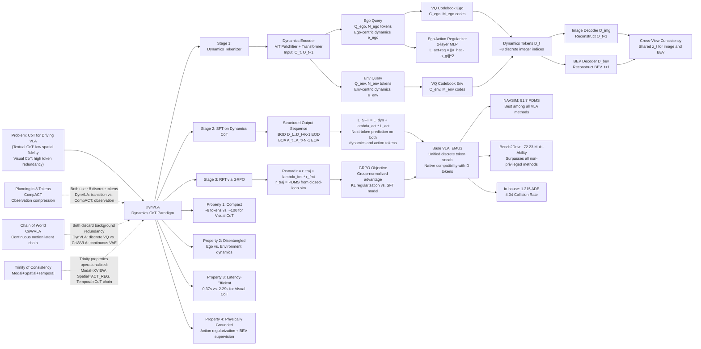

---
tags:
- paper
- domain/embodied_ai
- domain/reinforcement_learning
- domain/vla
- domain/world_model
- impact/solid
- method/benchmark
- method/foundation_model
- method/latent_world_model
- method/planning
- method/reinforcement_learning
- review/auto_tagged
- status/unread
- task/navigation
- task/planning_reasoning
- type/benchmark
aliases:
- 'DynVLA: Learning World Dynamics for Action Reasoning in Autonomous Driving'
url: http://arxiv.org/abs/2603.11041v1
pdf_url: https://arxiv.org/pdf/2603.11041v1
local_pdf: '[[DynVLA Learning World Dynamics for Action Reasoning in Autonomous Driving.pdf]]'
github: None
project_page: None
institutions:
- NLPR, Institute of Automation, Chinese Academy of Sciences (CASIA)
- Yinwang Intelligent Technology Co. Ltd.
publication_date: '2026-03-11'
score: '7.0'
domains:
- embodied_ai
- reinforcement_learning
- vla
- world_model
methods:
- benchmark
- foundation_model
- latent_world_model
- planning
- reinforcement_learning
tasks:
- navigation
- planning_reasoning
paper_type: benchmark
impact_band: solid
reading_status: unread
year: 2026
priority_score: 82
review_status: auto_tagged
next_action: inspect_protocol
arxiv_id: '2603.11041'
paper_id: arxiv:2603.11041
---

# DynVLA: Learning World Dynamics for Action Reasoning in Autonomous Driving

## 📌 Abstract
We propose DynVLA, a driving VLA model that introduces a new CoT paradigm termed Dynamics CoT. DynVLA forecasts compact world dynamics before action generation, enabling more informed and physically grounded decision-making. To obtain compact dynamics representations, DynVLA introduces a Dynamics Tokenizer that compresses future evolution into a small set of dynamics tokens. Considering the rich environment dynamics in interaction-intensive driving scenarios, DynVLA decouples ego-centric and environment-centric dynamics, yielding more accurate world dynamics modeling. We then train DynVLA to generate dynamics tokens before actions through SFT and RFT, improving decision quality while maintaining latency-efficient inference. Compared to Textual CoT, which lacks fine-grained spatiotemporal understanding, and Visual CoT, which introduces substantial redundancy due to dense image prediction, Dynamics CoT captures the evolution of the world in a compact, interpretable, and efficient form. Extensive experiments on NAVSIM, Bench2Drive, and a large-scale in-house dataset demonstrate that DynVLA consistently outperforms Textual CoT and Visual CoT methods, validating the effectiveness and practical value of Dynamics CoT.

## 🖼️ Architecture
![[DynVLA Learning World Dynamics for Action Reasoning in Autonomous Driving_arch.png]]

## 🧠 AI Analysis

# 🚀 Deep Analysis Report: DynVLA: Learning World Dynamics for Action Reasoning in Autonomous Driving

## 📊 Academic Quality & Innovation
---

# Deep Engineering Analysis: DynVLA

## 1. Core Snapshot

### Problem Statement

Vision-Language-Action (VLA) models for autonomous driving have adopted Chain-of-Thought (CoT) reasoning to improve decision quality. Two dominant CoT paradigms exist: (1) **Textual CoT**, which reasons in language space (e.g., scene descriptions, meta-actions), and (2) **Visual CoT**, which generates future image frames as intermediate reasoning steps. Both paradigms are fundamentally inadequate. Textual CoT produces discrete symbolic abstractions that fail to capture fine-grained spatiotemporal relationships—linguistically encoding "traffic light is red" does not convey the precise spatial evolution of surrounding agents. Visual CoT, while spatiotemporally richer, forces the model to generate full pixel-level future frames, encoding decision-irrelevant background textures, leading to substantial token redundancy (~100 tokens for a future image) and inference latency over an order of magnitude higher than the action head alone. Neither paradigm is simultaneously compact, accurate in spatiotemporal modeling, and latency-efficient.

### Core Contribution

DynVLA introduces **Dynamics CoT**, a novel CoT paradigm that compresses future world dynamics into a small set of discrete tokens (~8 tokens) via a VQ-based Dynamics Tokenizer with decoupled ego-centric and environment-centric branches, and trains a VLA model to autoregressively reason over these tokens before generating action trajectories.

### Academic Rating

- **Innovation: 7/10** — The insight of using VQ-compressed world dynamics as a CoT intermediate is clean and well-motivated. The decoupling of ego vs. environment dynamics with physical regularization is a non-trivial engineering contribution. However, using VQ-VAE for world state compression is a known technique, and the core idea of "compress world model state, then plan" has precedent in model-based RL and latent world models. The novelty lies primarily in the specific integration into the VLA + CoT training pipeline for driving.
- **Rigor: 7.5/10** — Three benchmarks are evaluated, ablations are systematic and informative, and the codebook collapse analysis is mechanistically sound. The in-house dataset (700k frames) provides scale evidence. However, key implementation details (codebook sizes M_ego, M_env; N_ego, N_env values; decoder architecture depth) are deferred to an appendix not shown, and no statistical significance testing is reported.

---

## 2. Technical Decomposition

### Algorithmic Logic

The system operates in three sequential training stages:

**Stage 1: Dynamics Tokenizer Training**

The goal is to learn a compact, disentangled, and transferable discrete representation of the transition from observation $O_t$ to $O_{t+1}$.

- **Step 1 — Input Encoding**: Adjacent camera frames $O_t$ and $O_{t+1}$ (multi-view images) are tokenized into patch sequences $\mathbf{x}_t$ and $\mathbf{x}_{t+1}$ using a ViT Patchifier (based on Dosovitskiy 2020). These two sequences are jointly processed.
- **Step 2 — Dynamics Encoding with Decoupled Queries**: A Transformer-based Dynamics Encoder $E_\text{dyn}$ (with $L_\text{Enc}$ layers) processes the concatenated patch tokens. Two sets of learnable cross-attention queries are applied: $Q_\text{ego} \in \mathbb{R}^{N_\text{ego} \times d}$ and $Q_\text{env} \in \mathbb{R}^{N_\text{env} \times d}$, where $N_\text{ego}$ and $N_\text{env}$ are kept small (yielding compact representations). The encoder outputs continuous ego-centric dynamics $e_t^\text{ego} \in \mathbb{R}^{N_\text{ego} \times d_\text{VQ}}$ and environment-centric dynamics $e_t^\text{env} \in \mathbb{R}^{N_\text{env} \times d_\text{VQ}}$.
- **Step 3 — Vector Quantization**: Two separate VQ codebooks are maintained: $\mathcal{C}_\text{ego} = \{c_i^\text{ego}\}_{i=1}^{M_\text{ego}}$ and $\mathcal{C}_\text{env} = \{c_j^\text{env}\}_{j=1}^{M_\text{env}}$, each with code dimensionality $d_\text{VQ}$. Nearest-neighbor codebook assignment (Van Den Oord et al., 2017) discretizes $e_t^\text{ego}$ and $e_t^\text{env}$ into discrete tokens $\mathcal{D}_t^\text{ego}$ and $\mathcal{D}_t^\text{env}$, which are concatenated: $\mathcal{D}_t = [\mathcal{D}_t^\text{ego}, \mathcal{D}_t^\text{env}]$. The total number of dynamics tokens is $N_\text{ego} + N_\text{env}$, which is approximately 8 in practice.
- **Step 4 — Conditional Decoding for Supervision**: Discrete tokens are mapped back to continuous embeddings $z_t \in \mathbb{R}^{(N_\text{ego}+N_\text{env}) \times d_\text{VQ}}$ via codebook lookup. Two modality-specific decoders ($D_\text{dyn}^\text{img}$ and $D_\text{dyn}^\text{bev}$), each with $L_\text{Dec}$ Transformer layers, take $z_t$ and the current-frame patch tokens ($\mathbf{x}_t$ for image, $\mathbf{b}_t$ for BEV) and reconstruct the future image $\hat{O}_{t+1}$ and future BEV map $\widehat{BEV}_{t+1}$, respectively. Both decoders share the same dynamics representation $z_t$ but condition on their respective modality's current observation.
- **Step 5 — Ego-Action Regularization**: A 2-layer MLP action decoder predicts the ego action $\hat{a}_{t \to t+1}$ from $\mathcal{D}_t^\text{ego}$ and penalizes the discrepancy with the ground-truth ego action $a_{t \to t+1}$, forcing the ego branch to exclusively encode ego motion.
- **Step 6 — Cross-View Consistency**: Both image and BEV decoders receive the same $z_t$, enforcing that the single dynamics representation is semantically consistent across modalities.

**Stage 2: SFT on Dynamics CoT**

With the Dynamics Tokenizer frozen, the VLA model is trained on structured Dynamics CoT sequences.

- **Input**: Current image $O_t$, previous image $O_{t-1}$, text instruction $T_t$, ego state $S_t$.
- **Dynamics Token Generation**: For $K$ future steps, $\mathcal{D}_{t+k} = E_\text{dyn}(O_{t+k}, O_{t+k+1})$ for $0 \leq k \leq K-1$ are computed using the frozen encoder. These form the ground-truth dynamics reasoning trace.
- **Target Output Sequence**: $\mathbf{y} = [\langle\text{BOD}\rangle, \mathcal{D}_{t:t+K-1}, \langle\text{EOD}\rangle, \langle\text{BOA}\rangle, \mathcal{A}_{t:t+N-1}, \langle\text{EOA}\rangle]$, where $\mathcal{A}$ are action tokens from the FAST tokenizer (Pertsch et al., 2025). The VLA autoregressively generates dynamics tokens first, then action tokens—creating a causal "reason-then-act" structure.
- **Loss**: $\mathcal{L}_\text{SFT} = \mathcal{L}_\text{dyn} + \lambda_\text{act}\mathcal{L}_\text{act}$, where $\mathcal{L}_\text{dyn}$ is the negative log-likelihood over dynamics token prediction and $\mathcal{L}_\text{act}$ is the negative log-likelihood over action token prediction.

**Stage 3: RFT on Dynamics CoT**

Group Relative Policy Optimization (GRPO) is applied to further refine the policy using trajectory-level rewards.

- **Reward**: $r = r_\text{traj} + \lambda_\text{fmt} r_\text{fmt}$, where $r_\text{traj}$ is the PDM Score (PDMS) from a closed-loop driving simulator (scalar in $[0,1]$), and $r_\text{fmt} \in \{0,1\}$ enforces that the output follows the required BOD/EOD/BOA/EOA token structure.
- **GRPO Objective**: For each sample, $G$ candidate trajectory sequences are rolled out. The normalized advantage $\hat{A}_i = \frac{r_i - \text{mean}(\{r_j\})}{\text{std}(\{r_j\})}$ is computed per group. The clipped policy gradient with KL regularization (Eq. 10) is applied, with reference model $\pi_\text{ref}$ initialized from the SFT model.

**Intuition Behind This Flow**: The three-stage design separates concerns cleanly. Stage 1 learns *what dynamics look like* in a self-supervised manner from raw observations, without requiring any action labels beyond the ego regularization. Stage 2 teaches the VLA *to use* dynamics as an intermediate reasoning step in a supervised fashion. Stage 3 uses environment feedback to push dynamics reasoning toward *causally useful* patterns that actually improve trajectory quality—closing the gap between imitation-learned dynamics reasoning and outcome-optimized reasoning.

---

### Mathematical Formulation

**Dynamics Tokenizer Training Loss (Eq. 4)**:

$$\mathcal{L} = \mathcal{L}_\text{recon}^\text{img} + \lambda_\text{bev}\mathcal{L}_\text{recon}^\text{bev} + \lambda_\text{vq}\mathcal{L}_\text{VQ} + \lambda_\text{act-reg}\mathcal{L}_\text{act-reg}$$

- $\mathcal{L}_\text{recon}^\text{img}$: Image reconstruction loss = MSE + perceptual loss (Zhang et al., 2018). Minimizing this encourages $z_t$ to encode sufficient information to reconstruct the future image conditioned on the current image. The perceptual component biases learning toward semantically meaningful features rather than pixel-level noise.
- $\mathcal{L}_\text{recon}^\text{bev}$: BEV map reconstruction loss = cross-entropy. This provides a top-down, geometry-aware supervision signal that is complementary to the ego-centric image view. Together with $\mathcal{L}_\text{recon}^\text{img}$, it enforces cross-view consistency.
- $\mathcal{L}_\text{VQ}$: Standard VQ-VAE commitment + codebook loss (Van Den Oord et al., 2017). Minimizing this keeps the encoder outputs close to their assigned codebook vectors and updates the codebook vectors toward the encoder outputs, stabilizing the discrete bottleneck.
- $\mathcal{L}_\text{act-reg} = \|\hat{a}_{t\to t+1} - a_{t\to t+1}\|_2^2$: Ego action regularization. Here $\hat{a}_{t\to t+1}$ is the ego action predicted by the 2-layer MLP from $\mathcal{D}_t^\text{ego}$, and $a_{t\to t+1}$ is the ground-truth ego action. Minimizing this enforces that the ego-centric dynamics tokens are exclusively predictive of ego motion, disambiguating them from environment-centric tokens.

**SFT Loss (Eqs. 7–9)**:

$$\mathcal{L}_\text{dyn} = -\sum_{k=0}^{K-1} \log p_\theta(\mathcal{D}_{t+k} \mid \mathcal{D}_{t:t+k-1}, \mathbf{c}_t)$$

$$\mathcal{L}_\text{act} = -\sum_{n=0}^{N-1} \log p_\theta(\mathcal{A}_{t+n} \mid \mathcal{A}_{t:t+n-1}, \mathcal{D}_{t:t+K-1}, \mathbf{c}_t)$$

- $\mathcal{D}_{t+k}$: The discrete dynamics token set at timestep $t+k$, consisting of $N_\text{ego} + N_\text{env}$ integer indices.
- $\mathbf{c}_t = \{O_t, O_{t-1}, T_t, S_t\}$: The conditioning context (current image, previous image, text instruction, ego state).
- $K$: Number of future dynamics steps modeled.
- $\mathcal{A}_{t+n}$: The $n$-th action token in the FAST-encoded trajectory.
- $N$: Length of action token sequence.
- Physically: $\mathcal{L}_\text{dyn}$ trains the VLA to be a good predictor of future world dynamics in the discrete token space. $\mathcal{L}_\text{act}$ trains the action head to leverage the already-reasoned dynamics tokens as context—this causal conditioning is the key mechanistic difference from non-CoT baselines.

**GRPO Objective (Eq. 10)**:

$$\mathcal{J}_\text{GRPO}(\theta) = \frac{1}{G}\sum_{i=1}^G \frac{1}{|o_i|}\sum_{t=1}^{|o_i|} \min\left(\rho_{i,t}(\theta)\hat{A}_{i,t}, \text{clip}(\rho_{i,t}(\theta), 1-\epsilon, 1+\epsilon)\hat{A}_{i,t}\right) - \beta D_\text{KL}(\pi_\theta \| \pi_\text{ref})$$

- $G$: Number of sampled candidate trajectories per input.
- $o_i$: The $i$-th sampled output sequence (contains both dynamics tokens and action tokens).
- $\rho_{i,t}(\theta) = \frac{\pi_\theta(o_{i,t}|\mathbf{c}_t, o_{i,<t})}{\pi_{\theta_\text{old}}(o_{i,t}|\mathbf{c}_t, o_{i,<t})}$: Token-level importance ratio between current and old policy.
- $\hat{A}_{i,t} = \frac{r_i - \text{mean}(\{r_j\}_{j=1}^G)}{\text{std}(\{r_j\}_{j=1}^G)}$: Group-normalized advantage (trajectory-level reward assigned uniformly to all tokens in the sequence).
- $\epsilon$: PPO clipping parameter.
- $\beta$: KL penalty weight; $\pi_\text{ref}$ is the frozen SFT model.
- Physically: This objective nudges the VLA to generate dynamics-then-action sequences that lead to higher PDMS scores in closed-loop simulation, while the KL term prevents catastrophic forgetting of the structured CoT format learned during SFT.

---

### Tensor Flow & Architecture

**Dynamics Tokenizer Forward Pass**:

1. Input frames: $O_t, O_{t+1}$ — each is a multi-view camera observation. After patchification: $\mathbf{x}_t, \mathbf{x}_{t+1} \in \mathbb{R}^{B \times L_\text{patch} \times d_\text{patch}}$, where $L_\text{patch}$ is the number of patches across all views.
2. Dynamics Encoder: $(\mathbf{x}_t, \mathbf{x}_{t+1}) \xrightarrow{E_\text{dyn} + Q_\text{ego}/Q_\text{env}} (e_t^\text{ego}, e_t^\text{env})$, where $e_t^\text{ego} \in \mathbb{R}^{B \times N_\text{ego} \times d_\text{VQ}}$, $e_t^\text{env} \in \mathbb{R}^{B \times N_\text{env} \times d_\text{VQ}}$.
3. VQ Discretization: $e_t^\text{ego} \rightarrow \mathcal{D}_t^\text{ego} \in \mathbb{Z}^{B \times N_\text{ego}}$ (integer indices); $e_t^\text{env} \rightarrow \mathcal{D}_t^\text{env} \in \mathbb{Z}^{B \times N_\text{env}}$.
4. Codebook lookup: $\mathcal{D}_t \rightarrow z_t \in \mathbb{R}^{B \times (N_\text{ego}+N_\text{env}) \times d_\text{VQ}}$.
5. Image Decoder: $(z_t, \mathbf{x}_t) \xrightarrow{D_\text{dyn}^\text{img}} \hat{O}_{t+1}$.
6. BEV Decoder: $(z_t, \mathbf{b}_t) \xrightarrow{D_\text{dyn}^\text{bev}} \widehat{BEV}_{t+1}$.

**DynVLA Forward Pass (at inference)**:

1. Input: $(O_t, O_{t-1}, T_t, S_t) \rightarrow$ VLA backbone (EMU3 with unified token vocabulary).
2. Autoregressive generation: $\langle\text{BOD}\rangle \rightarrow \mathcal{D}_t^{(1)} \rightarrow \ldots \rightarrow \mathcal{D}_{t+K-1}^{(N_\text{ego}+N_\text{env})} \rightarrow \langle\text{EOD}\rangle \rightarrow \langle\text{BOA}\rangle \rightarrow \mathcal{A}_0 \rightarrow \ldots \rightarrow \mathcal{A}_{N-1} \rightarrow \langle\text{EOA}\rangle$.
3. Action tokens decoded via FAST tokenizer to continuous trajectory waypoints.

**Key Architectural Choices**:
- **EMU3 as base VLA**: EMU3 uses a unified discrete token vocabulary for both images and text, making it naturally compatible with adding discrete dynamics tokens to the vocabulary. This is why it is selected as the final base model (Table 5 shows it achieves best performance).
- **Separate Codebooks for Ego/Env**: Rather than a single shared codebook, two independent codebooks prevent the quantization space from being dominated by either dynamics type. This is a non-obvious but important design choice evidenced by the ablation in Table 6 and Fig. 5.
- **Dual decoder (Image + BEV)**: The cross-view consistency enforced by sharing $z_t$ across both decoders provides a stronger self-supervised signal than either modality alone, analogous to multi-task learning regularization.

---

### Innovation Logic

Compared to **Textual CoT** (e.g., AutoDrive-R², AdaThinkDrive): Textual CoT requires language generation (high token count, low spatial precision). DynVLA replaces language tokens with discrete dynamics codes—mathematically, this changes the reasoning vocabulary from a large natural language token space to a compact VQ codebook space of size $M_\text{ego} \times M_\text{env}$, which is orders of magnitude smaller and inherently spatiotemporal.

Compared to **Visual CoT** (e.g., FSDrive, PWM): Visual CoT requires predicting $H \times W$ pixel values (or patch tokens), typically ~100 tokens. DynVLA encodes only the *change* between frames via dynamics queries, discarding static background. The VQ bottleneck forces compression to only the motion-relevant signal, reducing reasoning tokens from ~100 to ~8 while preserving spatiotemporal grounding.

Compared to **Latent Action Tokenizers** (e.g., Ye et al., 2024): Prior latent tokenizers for embodied agents do not separate ego and environment dynamics. DynVLA's decoupled design is specifically motivated by the fact that driving involves large ego-viewpoint transformations (camera moves with ego vehicle) that systematically entangle with agent motion—a problem unique to ego-centric mobile robotics.

---

## 3. Evidence & Metrics

### Benchmark & Baselines

**NAVSIM** (real-world, non-reactive): Compares against 14+ methods including traditional E2E (VADv2, LAW, Hydra-MDP), VLA without CoT (ReCogDrive, DriveVLA-W0), VLA with Textual CoT (AutoVLA, AdaThinkDrive, AutoDrive-R²), and VLA with Visual CoT (FSDrive, PWM). The evaluation metric is PDMS (PDM Score, composite of multiple safety/comfort sub-metrics: NC, DAC, TTC, C, EP).

**Bench2Drive** (closed-loop, interactive): Compares against 15+ methods using DS (Driving Score), SR (Success Rate), and Mean Multi-Ability. Includes strong recent baselines: ORION, MindDrive, AutoVLA, SimLingo.

**In-house Dataset** (~700k frames): Compares against Transfuser, DriveVLA-W0 (VQ), DriveVLA-W0 (ViT) using ADE (m) and Collision Rate (%₀₀).

The experimental design is broadly fair: the same base model (EMU3) is used in controlled ablations (Table 5), and multiple base models are tested (EMU3, Qwen2.5-VL). The use of a privileged-information-free comparison in Bench2Drive (methods marked with † use privileged perceptual information are noted) adds clarity. A potential concern is that the in-house dataset is not publicly available for reproduction.

### Key Results

| Benchmark | Metric | DynVLA | Best Competitor | Improvement |
|---|---|---|---|---|
| NAVSIM | PDMS | **91.7** | 90.3 (AutoDrive-R²) | +1.4 pts |
| Bench2Drive | Mean Multi-Ability | **72.23** | 64.39 (TF++) | +7.84 pts |
| In-house | ADE (m) | **1.215** | 1.344 (DriveVLA-W0 ViT) | -9.6% |
| In-house | Collision Rate (%₀₀) | **4.04** | 5.13 (DriveVLA-W0 ViT) | -21.2% |

The Bench2Drive improvements (+7.84 Mean Multi-Ability over the non-privileged best TF++) are substantial. The NAVSIM improvements are more modest in absolute terms (+1.4 PDMS) but represent meaningful gains given the competitive field. The collision rate reduction of 21.2% on the in-house dataset is the most safety-relevant result.

**Latency**: Dynamics CoT runs at 0.37s inference latency vs. 2.29s for Visual CoT (Future Image) and 3.04s for Textual CoT (Scene Description)—an approximately **6–8× speedup** over competing CoT methods (Table 4).

### Ablation Study

**Most Critical Component**: The ego-environment dynamics decoupling (Table 6). Without decoupling (no separate queries, no ego-action regularization), the model with Dynamics CoT achieves only 85.8 PDMS—nearly identical to the non-CoT baseline (85.6 PDMS). Adding image reconstruction brings it to 86.2; adding BEV brings it to 86.7. The full model with decoupling achieves 87.2. This shows that **decoupling is necessary for Dynamics CoT to work at all**, and that the codebook collapse (Fig. 5) without decoupling is the mechanistic explanation—without disentanglement, the tokenizer simply memorizes static background via the conditioning decoder and does not learn meaningful dynamics codes.

**Second Most Critical**: The combination of SFT + RFT (Table 5). SFT alone with Dynamics CoT gives 87.2 PDMS; adding RFT yields the same 91.7 on NAVSIM (the table shows this across both EMU3 and Qwen2.5-VL backbones). The RFT without CoT shows a smaller improvement (+1.8 pts vs. +3.1 pts for CoT SFT + RFT), confirming that Dynamics CoT provides a structured reasoning trace that RFT can optimize more effectively than raw action generation.

---

## 4. Critical Assessment

### Hidden Limitations

**1. Dynamics Tokenizer Generalization Boundary**: The Dynamics Tokenizer is trained on a specific data distribution. At deployment, out-of-distribution scenarios (unusual weather, sensor configurations, or novel road topologies) may produce dynamics tokens that fall outside the codebook's learned support, leading to silent failure—the model will assign the nearest codebook entry, which may be semantically incorrect. Unlike language tokens, there is no obvious fallback.

**2. Codebook Size vs. Expressiveness Trade-off**: The paper uses small $N_\text{ego}$, $N_\text{env}$ and codebook sizes $M_\text{ego}$, $M_\text{env}$. The exact values are deferred to an appendix (not shown). If $M$ is too small, the codebook cannot express the full diversity of driving dynamics; if too large, codebook collapse risk increases. The paper addresses collapse via decoupling, but the sensitivity of the final PDMS to these hyperparameters is not analyzed.

**3. K-step Lookahead Assumption**: The SFT constructs dynamics sequences over $K$ future steps, implying the model must predict dynamics conditioned only on the current observation at inference (since future frames are unavailable). The encoder uses $(O_{t+k}, O_{t+k+1})$ to produce $\mathcal{D}_{t+k}$ at training time, but at inference the VLA must *autoregressively predict* these tokens—this is a train-test gap. The quality of predicted dynamics tokens (vs. ground-truth extracted tokens) is not explicitly evaluated, creating uncertainty about how much of the performance comes from the VLA correctly predicting dynamics vs. the architecture's action head.

**4. Reward Signal Sparsity in RFT**: The PDMS reward is trajectory-level (one scalar per rollout), distributed uniformly to all tokens in the sequence (both dynamics and action tokens). This creates a credit assignment problem: the reward signal provides no direct guidance on whether the dynamics reasoning was correct—only whether the final trajectory was good. An incorrectly reasoned but accidentally correct trajectory receives positive reward, and the model has no incentive to improve dynamics accuracy beyond its impact on the final reward.

**5. Non-reactive Benchmark (NAVSIM)**: NAVSIM uses non-reactive simulation, meaning other agents do not respond to the ego vehicle's actions. The advantage of Dynamics CoT (modeling other agents' intentions) is most relevant in interactive scenarios, suggesting the NAVSIM results may understate the benefit of the approach, while Bench2Drive (reactive, closed-loop) is the more appropriate primary evaluation venue.

### Engineering Hurdles

**1. Three-Stage Training Complexity**: Reproducing DynVLA requires three distinct training pipelines with their own data loading, loss functions, and optimization schedules. Stage 1 (Dynamics Tokenizer) uses a combination of image reconstruction, BEV cross-entropy, VQ-VAE, and action regularization losses with four separate weighting hyperparameters ($\lambda_\text{bev}$, $\lambda_\text{vq}$, $\lambda_\text{act-reg}$, plus SFT's $\lambda_\text{act}$ and RFT's $\lambda_\text{fmt}$, $\beta$). Tuning these jointly is non-trivial and likely required extensive sweeping on the in-house dataset.

**2. BEV Map Dependency**: The Dynamics Tokenizer requires ground-truth BEV maps ($BEV_t$) for cross-view consistency training. Constructing accurate BEV maps requires either LiDAR point clouds (expensive), HD maps, or a separate BEV perception model. This dependency is not explicitly discussed and may require additional infrastructure unavailable to many practitioners.

**3. FAST Tokenizer Integration**: The action tokenization uses FAST (Pertsch et al., 2025), a flow-based tokenizer for continuous actions. Integrating FAST with a discrete-token VLM (EMU3) requires careful vocabulary expansion and matching the tokenizer's continuous-to-discrete mapping with the VLM's generation procedure. Numerical precision issues in the inverse FAST transform can affect trajectory accuracy.

**4. Closed-Loop Simulation for RFT**: Stage 3 requires rolling out $G$ candidate trajectories in a driving simulator (compatible with Bench2Drive/NAVSIM) for each training sample. This is computationally expensive and requires maintaining a fast, parallelizable simulator alongside the VLA training loop. The paper does not report compute costs (GPU-hours), making it difficult to assess feasibility for resource-constrained practitioners.

**5. Codebook Collapse Sensitivity**: As shown in Fig. 5, the Dynamics Tokenizer without decoupling collapses to using only ~20 VQ codes out of the full codebook even after 200k training steps. This collapse is subtle—the reconstruction loss continues to decrease while the codebook utilization collapses—and standard monitoring metrics (loss curves) would not reveal it. Practitioners must explicitly track codebook utilization (unique code activation counts) during Stage 1 training to detect and diagnose this failure mode.

## 🔗 Knowledge Graph & Connections
## Connection & Refinement

---

### Task 1: Differential Analysis & Connections

#### Connection 1: DynVLA vs. [[Planning in 8 Tokens]]

This is the most structurally proximate relationship in the vault. Both papers independently converge on the same target representation density—**8 discrete tokens per observation step**—using VQ-based compression of world dynamics for downstream planning. The convergence is not coincidental; it reflects a shared information-theoretic intuition that the action-relevant state change between consecutive frames is low-dimensional.

**Key Differentiators**:

| Dimension | [[Planning in 8 Tokens]] (CompACT) | DynVLA |
|---|---|---|
| **Tokenization Target** | Single observation frame compressed into 8 tokens | Frame-to-frame *transition* (dynamics) compressed into ~8 tokens |
| **Decoupling** | None — single unified codebook per observation | Explicit ego/environment decoupling with separate codebooks and physical regularization |
| **Integration Paradigm** | World model for action-conditioned planning (separate from policy) | Integrated into VLA as a Dynamics CoT intermediate reasoning step |
| **Training Signal** | Action-conditioned reconstruction | Reconstruction + ego-action regularization + cross-view BEV consistency |
| **Policy Optimization** | Planning via world model rollouts | SFT + RFT (GRPO) directly on the VLA |

The critical structural difference is that CompACT compresses *observations*, while DynVLA compresses *transitions*. This means CompACT's tokens must still encode sufficient information to reconstruct the full scene (including background), whereas DynVLA's tokens explicitly encode only what *changes*—making the latter more information-efficient per token but also more sensitive to the quality of the delta signal extracted by the encoder. Additionally, DynVLA's integration into the autoregressive CoT pipeline is architecturally more complex but enables end-to-end optimization via RFT, which CompACT's separate world model/planner design does not readily support.

---

#### Connection 2: DynVLA vs. [[Chain of World]]

Both papers address the same fundamental criticism of Visual CoT: **predicting full future frames is computationally wasteful because backgrounds are redundant**. Both propose encoding only the motion/dynamics component rather than the full frame. However, the architectural solutions diverge significantly.

**Key Differentiators**:

| Dimension | [[Chain of World]] (CoWVLA) | DynVLA |
|---|---|---|
| **Representation Space** | *Continuous* latent motion chain from a pretrained video VAE | *Discrete* VQ codes (integer indices) |
| **Temporal Structure** | Chain of continuous latent motion vectors across time | Sequence of discrete dynamics token sets per timestep |
| **Disentanglement** | Structural/motion factorization via video VAE (pretrained) | Ego-centric/environment-centric factorization via learned queries + VQ |
| **Ego Modeling** | Not explicitly addressed; video VAE treats ego-motion and agent motion uniformly | Explicit ego-centric branch with ground-truth action regularization |
| **Optimization** | Pre-training + co-fine-tuning (no RL stage reported) | SFT + RFT (GRPO with closed-loop simulator reward) |
| **Token Count** | Continuous latent (dimensionality depends on video VAE) | ~8 discrete integer tokens |

The most significant architectural distinction is continuous vs. discrete: CoWVLA's continuous latent chain preserves gradient flow through the dynamics representation and avoids the VQ commitment loss instability (codebook collapse), but continuous representations are harder to inject into autoregressive token-based VLMs without specialized adapters. DynVLA's discrete tokens are natively compatible with the VLM's vocabulary, enabling the elegant BOD/EOD framing of Dynamics CoT. However, this comes at the cost of the codebook collapse risk documented in Fig. 5 of DynVLA—a problem CoWVLA sidesteps entirely by operating in continuous space.

---

#### Connection 3: DynVLA vs. [[The_Trinity_of_Consistency_as_a_Defining_Principle_for_General_World_Models]]

This connection operates at a higher theoretical level. The Trinity of Consistency framework proposes that a principled world model must satisfy three consistency properties: **Modal Consistency** (semantic alignment across modalities), **Spatial Consistency** (geometric grounding), and **Temporal Consistency** (causal dynamics modeling). DynVLA can be interpreted as an empirical instantiation of all three properties within the constrained driving domain.

**Mapping DynVLA to the Trinity**:

- **Modal Consistency** ↔ Cross-view consistency regularization: DynVLA explicitly enforces that the same dynamics tokens $z_t$ must decode coherently into both the image future ($\hat{O}_{t+1}$) and the BEV future ($\widehat{BEV}_{t+1}$). This is a direct operational implementation of modal consistency between ego-centric camera view and top-down geometric view.
- **Spatial Consistency** ↔ Physical ego-action regularization: By requiring that $\mathcal{D}_t^\text{ego}$ predicts the ground-truth ego action, DynVLA grounds the dynamics representation in the vehicle's physical motion in metric space—a form of spatial consistency enforcement.
- **Temporal Consistency** ↔ Dynamics CoT autoregressive chain: The structured sequence $[\mathcal{D}_t, \mathcal{D}_{t+1}, \ldots, \mathcal{D}_{t+K-1}]$ forms a causal temporal chain, trained autoregressively to maintain temporal coherence across prediction steps.

**Where DynVLA falls short of the Trinity framework**: The Trinity paper argues that a general world model must maintain these consistencies *across arbitrary domains and scales*. DynVLA's Dynamics Tokenizer is domain-specific (trained on driving data) and its generalization to novel environments is not evaluated. The Trinity framework would predict that without explicit cross-domain modal consistency training, the dynamics representations will fail to transfer—a limitation corroborated by DynVLA's reliance on an in-house dataset for competitive performance.

---

### Task 2: Mermaid Knowledge Graph

---

### Task 3: Future Research Directions

#### Direction 1: Predictive Dynamics Token Quality Evaluation and Self-Consistency Training

The current DynVLA architecture has a fundamental **train-test asymmetry**: during training, dynamics tokens $\mathcal{D}_{t+k}$ are extracted from ground-truth future frames $(O_{t+k}, O_{t+k+1})$ by the frozen Dynamics Encoder. At inference, the VLA must *predict* these tokens autoregressively from the current observation alone—without access to future frames. The paper does not report how accurately the VLA predicts the ground-truth dynamics tokens (token prediction accuracy), nor whether errors in predicted dynamics tokens compound across the $K$-step chain and degrade action quality.

**Proposed Research**: Introduce a **self-consistency objective** during RFT where, in addition to the PDMS reward, a reconstruction consistency reward is computed by: (1) decoding the VLA's *predicted* dynamics tokens $\hat{\mathcal{D}}_{t+k}$ back to predicted future states $\hat{O}_{t+k+1}$ via the frozen Dynamics Decoder; (2) comparing these to the actual future observations obtained from the simulator rollout. This closes the train-test gap and provides token-level credit assignment signal that the current trajectory-level PDMS reward cannot provide. The hypothesis is that models with more accurate dynamics token prediction will exhibit more reliable safety behavior, particularly for out-of-distribution scenarios where the VLA's dynamics predictions diverge from the tokenizer's training distribution.

---

#### Direction 2: Hierarchical Dynamics Tokenization with Temporal Abstraction

The current Dynamics Tokenizer captures dynamics at a single temporal scale: one-step frame transitions ($O_t \to O_{t+1}$). However, autonomous driving requires reasoning at multiple temporal scales simultaneously—immediate dynamics (next 0.5s, e.g., braking), short-horizon dynamics (next 2s, e.g., lane changes), and medium-horizon dynamics (next 5s, e.g., intersection negotiation). A flat 8-token representation must trade off fidelity across these scales.

**Proposed Research**: Design a **hierarchical Dynamics Tokenizer** with $L$ levels, where level $\ell$ captures dynamics over a temporal window of $2^\ell$ frames. Each level has its own encoder (with scale-specific positional encodings), separate ego/env VQ codebooks, and its own reconstruction target (short-window future at fine levels, long-window future at coarse levels). The DynVLA's Dynamics CoT sequence would then be organized as a multi-scale tree: coarse-level dynamics (fewer tokens, longer horizon) generated first to establish the global intent, followed by fine-level dynamics (more tokens, immediate horizon) to refine the plan. The intuition—validated by cognitive science models of human driving—is that drivers first commit to a coarse intent (merge, stop, yield) before refining precise trajectory, and this hierarchical structure should be reflected in the CoT.

---

#### Direction 3: Cross-Scenario Dynamics Transfer for Long-Tail Robustness

The transferability visualization in Fig. 4 of DynVLA shows that dynamics tokens extracted from one scenario can be injected into another to produce coherent future states—suggesting the learned dynamics representations are to some degree scenario-agnostic. However, this transferability is only demonstrated qualitatively. A rigorous exploration of **cross-scenario dynamics transfer** could yield a practical method for long-tail scenario augmentation.

**Proposed Research**: Develop a **Dynamics Augmentation** training strategy where, during SFT, the ground-truth dynamics tokens for a training sample are stochastically replaced with dynamics tokens from a *different* scenario (drawn from a curated library of rare-event dynamics, e.g., sudden braking agents, unexpected pedestrian crossings, adverse weather motion patterns). The VLA must then learn to generate safe actions conditioned on *counterfactual* dynamics—dynamics that did not occur in the original scenario but represent plausible alternatives. This effectively creates a data augmentation scheme for rare events without requiring actual rare-event data collection, addressing one of the fundamental challenges of long-tail robustness in autonomous driving. The key research questions are: (1) which dynamics are transferable (ego-centric vs. environment-centric, as DynVLA's decoupling suggests they have different transferability profiles); (2) what is the optimal curriculum for dynamics replacement difficulty; and (3) whether RFT with a simulator can further validate that transferred dynamics lead to appropriate counterfactual responses.

---
*Analysis performed by PaperBrain-OpenRouter (anthropic/claude-4.6-sonnet) (Vision-Enabled)*

## 🧩 Claim Cards

### Claim-01
- Claim: DynVLA's Dynamics Tokenizer compresses future world state into a compact set of discrete dynamics tokens (covering ego and environment dynamics separately) that serve as a spatiotemporally faithful yet token-efficient Chain-of-Thought intermediate, avoiding the pixel-level redundancy of Visual CoT while preserving fine-grained spatiotemporal structure lost by Textual CoT.
- Evidence: Visual CoT methods (e.g., FSDrive, PWM) require ~100 tokens per future image frame, incurring inference latency over an order of magnitude higher than the action head alone. DynVLA's dynamics tokens are far fewer, and ablation results (Table 5, using EMU3 as base) confirm that replacing dynamics tokens with either textual or visual CoT degrades both PDMS on NAVSIM and DS/SR on Bench2Drive.
- Boundary/Failure: The Dynamics Tokenizer is trained on a fixed data distribution; out-of-distribution scenarios (unusual weather, novel road topologies, unseen sensor configurations) may cause the VQ codebook to assign the nearest but semantically incorrect entry, silently degrading the quality of the intermediate reasoning step without any explicit error signal.
- Compared Against: Textual CoT baselines (AutoVLA, AdaThinkDrive, AutoDrive-R²) and Visual CoT baselines (FSDrive, PWM) on NAVSIM and Bench2Drive.
- Confidence: 7
- Links:
  - same_problem:: [[Planning in 8 Tokens]]
  - improves_over:: [[Planning in 8 Tokens]]
  - conflicts_with:: 待定

### Claim-02
- Claim: DynVLA achieves state-of-the-art performance on both the NAVSIM non-reactive benchmark (PDMS metric) and the Bench2Drive closed-loop interactive benchmark (DS and SR metrics), outperforming all compared VLA methods including those using textual or visual CoT, without relying on privileged perceptual information.
- Evidence: On NAVSIM, DynVLA surpasses all 14+ compared methods including Visual CoT methods FSDrive and PWM on PDMS. On Bench2Drive, DynVLA outperforms strong recent baselines ORION, MindDrive, AutoVLA, and SimLingo on DS, SR, and Mean Multi-Ability; methods using privileged information are explicitly marked (†) to ensure a fair comparison. Results hold across two base models (EMU3 and Qwen2.5-VL).
- Boundary/Failure: Bench2Drive is a closed-loop simulator and may not fully reflect real-world deployment complexity; the in-house dataset (~700k frames) used for trajectory prediction evaluation is not publicly available, limiting independent reproduction of those specific results.
- Compared Against: 14+ NAVSIM baselines (VADv2, LAW, Hydra-MDP, ReCogDrive, DriveVLA-W0, AutoVLA, AdaThinkDrive, AutoDrive-R², FSDrive, PWM, and others) and 15+ Bench2Drive baselines (ORION, MindDrive, AutoVLA, SimLingo, and others).
- Confidence: 8
- Links:
  - same_problem:: 待定
  - improves_over:: [[Planning in 8 Tokens]]
  - conflicts_with:: 待定

### Claim-03
- Claim: The Dynamics Tokenizer's codebook size and the number of dynamics tokens per step represent a fundamental expressiveness-efficiency trade-off: an undersized codebook cannot represent the full diversity of real-world driving dynamics, while an oversized codebook reintroduces the token redundancy that motivates the approach over Visual CoT.
- Evidence: The paper defers exact values of ego codebook size M_ego, environment codebook size M_env, and token counts N_ego, N_env to an appendix. No ablation over codebook size is surfaced in the main paper, meaning the sensitivity of PDMS and DS to codebook capacity is not directly quantified in the available evidence. The problem statement explicitly acknowledges ~100 tokens for a future image as the redundancy baseline that dynamics tokens must beat.
- Boundary/Failure: If the chosen codebook sizes are too small for a new deployment domain (e.g., dense urban intersections with many heterogeneous agents), the quantization error increases and the dynamics tokens become unreliable CoT intermediates, causing downstream action quality to degrade in a manner indistinguishable from a well-functioning model without CoT.
- Compared Against: Visual CoT methods (FSDrive, PWM) as the upper bound on token count; no explicit codebook-size ablation baseline is reported in the main paper.
- Confidence: 5
- Links:
  - same_problem:: [[Planning in 8 Tokens]]
  - improves_over:: 待定
  - conflicts_with:: 待定

### Claim-04
- Claim: Compact discrete world-state representations as CoT intermediates are a broadly viable design principle for latency-sensitive VLA systems, suggesting that the field should shift from generating full future image frames toward learning task-relevant tokenized dynamics abstractions as the reasoning scaffold.
- Evidence: DynVLA's dynamics-token CoT reduces inference latency by over an order of magnitude relative to Visual CoT (which requires ~100 tokens per future frame) while matching or exceeding Visual CoT methods (FSDrive, PWM) on PDMS and surpassing them on Bench2Drive DS/SR. The approach generalizes across two backbone VLMs (EMU3, Qwen2.5-VL), supporting the claim that the principle is not architecture-specific. This aligns with the broader trend of ultra-compact planning representations exemplified by Planning in 8 Tokens.
- Boundary/Failure: The claim applies specifically to scenarios where the dynamics of interest (ego trajectory, nearby agent motion) can be faithfully discretized by a VQ codebook trained on available data. For tasks requiring pixel-level scene understanding (e.g., detecting novel road markings or rare visual anomalies), discarding pixel information in the CoT intermediate may cause the action head to miss safety-critical cues that a Visual CoT would have preserved.
- Compared Against: Visual CoT paradigm (FSDrive, PWM) and Textual CoT paradigm (AutoVLA, AdaThinkDrive, AutoDrive-R²) as the two incumbent CoT design choices for autonomous driving VLAs.
- Confidence: 7
- Links:
  - same_problem:: [[Planning in 8 Tokens]]
  - improves_over:: [[Planning in 8 Tokens]]
  - conflicts_with:: 待定

## 📂 Resources
- **Local PDF**: [[DynVLA Learning World Dynamics for Action Reasoning in Autonomous Driving.pdf]]
- [Online PDF](https://arxiv.org/pdf/2603.11041v1)
- [ArXiv Link](http://arxiv.org/abs/2603.11041v1)