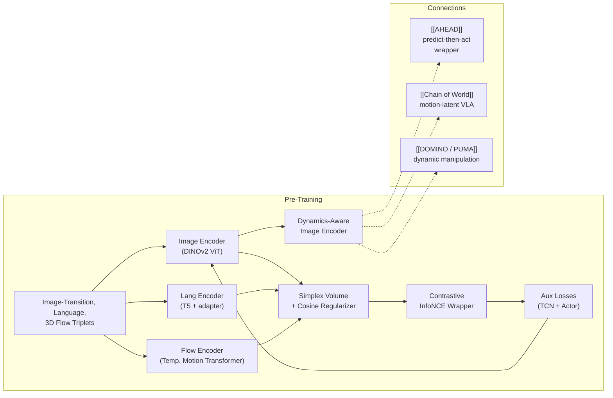

---
tags:
- paper
- domain/3d_perception
- domain/embodied_ai
- domain/multimodal_perception
- domain/reinforcement_learning
- domain/robot_manipulation
- domain/vla
- impact/high_value
- impact/solid
- method/foundation_model
- method/imitation_learning
- method/reinforcement_learning
- method/simulation
- review/auto_tagged
- status/unread
- task/manipulation
- task/scene_understanding
- type/method
- type/system
aliases:
- 'DynaFLIP: Rethinking Robotics Perception via Tri-Modal-Dynamics Guided Representation'
- DynaFLIP
- Tri-Modal Dynamics
- Simplex Volume Minimization
- Hypersphere Alignment
- Dynamics-Aware Encoder
- 3D Flow Alignment
- Action-Relevant Perception
- Tri-Modal Representation
paper_id: arxiv:2605.30350
arxiv_id: '2605.30350'
url: https://huggingface.co/papers/2605.30350
pdf_url: https://arxiv.org/pdf/2605.30350.pdf
local_pdf: '[[DynaFLIP Rethinking Robotics Perception via TriModalDynamics Guided
  Representation.pdf]]'
github: None
project_page: https://dynaflip-robotics.github.io
institutions:
- Seoul National University
- University of Maryland, College Park
- Georgia Institute of Technology
publication_date: '2026-05-29'
score: '8.1'
domains:
- 3d_perception
- embodied_ai
- multimodal_perception
- reinforcement_learning
- robot_manipulation
- vla
methods:
- imitation_learning
- reinforcement_learning
- simulation
tasks:
- manipulation
- scene_understanding
paper_type: system
impact_band: high_value
reading_status: unread
priority_score: 100
review_status: auto_tagged
next_action: inspect_protocol
year: 2026
metadata_publication_date: '2026-05-28'
---

# DynaFLIP: Rethinking Robotics Perception via Tri-Modal-Dynamics Guided Representation

## 📌 Abstract
Robot manipulation critically depends on perception that preserves the action-relevant aspects of a scene. Yet most robot learning pipelines are built upon visual encoders pre-trained for static recognition or vision-language alignment, leaving motion understanding to downstream policies. We introduce DynaFLIP, a dynamics-aware multimodal pre-training framework that pushes motion understanding upstream into perception. We construct image-language-3D flow triplets from heterogeneous human and robot videos, and use these triplets as training-time supervision to shape an image-only encoder. Our key idea is to encourage the three modalities to span a small simplex volume in the shared hyperspherical space -- a smaller simplex volume indicating stronger alignment. To avoid the geometric ambiguity and trivial collapse of naive volume minimization, we combine simplex-volume minimization with a cosine regularizer and a contrastive objective. Our analyses show that DynaFLIP focuses on control-relevant regions critical for manipulation. The resulting dynamics-aware representations serve as reusable visual backbones and consistently outperform baselines across diverse downstream policies, including VLAs. We validate this across diverse simulation and real-world setups, with gains reaching +22.5% under out-of-distribution scenarios. Our results suggest that robot generalization improves when visual representations are trained to encode not just what is present, but how the world changes under action.

## 🖼️ Architecture
![[DynaFLIP Rethinking Robotics Perception via TriModalDynamics Guided Representation_arch.png]]

## 🧠 AI Analysis
## Abstract

Robot manipulation critically depends on perception that preserves the action‑relevant aspects of a scene. Yet most robot learning pipelines are built upon visual encoders pre‑trained for static recognition or vision‑language alignment, leaving motion understanding to downstream policies. We introduce **DynaFLIP**, a dynamics‑aware multimodal pre‑training framework that pushes motion understanding upstream into perception. The method constructs image–language–3D flow triplets from heterogeneous human and robot videos, and uses these triplets as training‑time supervision to shape an image‑only encoder.

The key idea is to encourage the three modalities to span a small simplex volume in the shared hyperspherical space—a smaller simplex volume indicating stronger alignment. To avoid the geometric ambiguity and trivial collapse of naive volume minimization, DynaFLIP combines simplex‑volume minimization with a cosine regularizer and a contrastive objective. Analyses show that DynaFLIP focuses on control‑relevant regions critical for manipulation. The resulting dynamics‑aware representations serve as reusable visual backbones and consistently outperform baselines across diverse downstream policies, including vision‑language‑action models (VLAs). Gains reach **+22.5%** under out‑of‑distribution scenarios, suggesting that robot generalization improves when visual representations encode not only what is present, but how the world changes under action.

## 1. Core Snapshot

### Problem Statement
Standard visual encoders—such as CLIP, DINOv2, and SigLIP—are pre‑trained to recognize objects or align images with natural language in static frames. When these encoders are reused as frozen backbones in robot policies, their attention often falls on visually salient but control‑irrelevant regions: backgrounds, distractor objects, or scene textures, rather than the manipulated object and the contact area (as confirmed by Grad‑CAM heatmaps in the paper). The input to the system is a single image observation from a robot camera, the output is a feature vector that a downstream policy (e.g., MLP, diffusion policy, VLA) consumes to select actions, and the target behaviour is reliable manipulation in the face of new objects, backgrounds, and instructions.

The fundamental bottleneck is that typical pre‑training objectives—static classification, image‑text matching—are never exposed to explicit evidence of how actions physically alter a scene. Motion understanding is deferred entirely to the policy, which must learn dynamics from limited robot interaction data, often without the benefit of rich physical cues. Consequently, the encoder may fail to prioritise the *causal* structure of a scene: which pixels correspond to parts that move or deform under manipulation. DynaFLIP addresses this gap by injecting dynamics awareness directly into the visual encoder, so that even a single static frame at test time carries information about state transitions that are relevant to control.

### Core Contribution
DynaFLIP adds a pre‑training stage that forces an image encoder to produce features aligned with *both* language descriptions of intended changes *and* explicit 3D flow of scene motion. The alignment is driven by a novel objective that minimises the volume of the triangle spanned by the three ℓ₂‑normalised modality embeddings, while guarding against two known failure modes of naive volume minimisation—geometric ambiguity and trivial collapse.

Compared with prior approaches that either align each modality independently to the image (pairwise anchors) or rely solely on static pre‑training, this joint simplex‑based alignment yields features that attend more strongly to manipulated objects and contact regions. Empirically, DynaFLIP’s encoder achieves higher success rates on MetaWorld, RLBench, and LIBERO in both frozen and fine‑tuned settings, and provides particularly large gains under real‑world out‑of‑distribution perturbations when dropped into a VLA policy without further visual adaptation.

### Innovation Origin & Rationale
The design draws on earlier work that constrains multiple embeddings to lie close together in a shared space by minimising the simplex volume they span, rather than using simple pairwise contrastive losses. The observation that robot‑relevant videos naturally contain three complementary signals—visual change, semantic intent, and physical motion—motivates the choice of modalities. The responses to the two failure modes are motivated directly by the paper’s stated pitfalls:

1.  **Geometric ambiguity:** A small simplex volume does not guarantee mutual proximity of all points. For a triangle, the area can approach zero while two vertices remain far apart (the three points become nearly collinear). A cosine regulariser is added to explicitly pull language and flow embeddings together, preventing this degenerate flat triangle.
2.  **Trivial collapse:** Without negative triplets, the volume‑minimisation energy is trivially minimised when all embeddings map to the same point, yielding a useless representation. Embedding the energy in an InfoNCE‑style contrastive framework with batch‑constructed negatives ensures that the encoder must discriminate between matching and non‑matching triplets, which prevents total collapse.

The combination of a simplex volume measurement, a targeted cosine regulariser, and a contrastive wrapper is the central rationale behind DynaFLIP’s alignment loss.

## 2. Reading Map

The paper targets readers working on visual representations for robot manipulation who are already familiar with basic contrastive learning and policy learning (e.g., DINOv2, CLIP, behaviour cloning, VLAs).

On a first pass, read the abstract and Section 1 to understand the motivation, then Section 2.1 and 2.2 for the precise loss design, and Section 3.2–3.4 plus the ablation results in Table 2 to see where the gains appear. The related‑work section can be skimmed initially if the reader already knows R3M, VC‑1, LIV, and the standard pre‑trained backbones. The appendix references should be consulted later when specific architectural or data‑generation details are needed for reproduction.

## 3. Method Walkthrough

### Inputs, Outputs, And Assumptions
The pre‑training stage receives triplets, each consisting of an image transition pair ($I_t$, $I_{t+H}$), a language instruction $L$ describing the intended transition, and a 3D flow trajectory $F_{t:t+K}$ extracted from a video snippet. All three are used **only** during pre‑training. The final product is a single normalised image embedding $z_I$ produced by the image encoder from the current frame $I_t$; at deployment, only this image encoder is retained and no extra modality is needed.

The underlying assumption is that language provides semantic intent about *what* should change, while 3D flow supplies viewpoint‑invariant geometric evidence of *how* the scene actually moved—information that image differences alone cannot reliably supply. The validity of the learned representation therefore hinges on the ability to extract these three signals from ordinary RGB video, without requiring robot actions or calibrated cameras during pre‑training. The paper constructs such data from large‑scale human and robot videos using off‑the‑shelf tools (vision‑language model for instruction generation; point tracking and depth estimation for 3D flow after camera‑motion compensation).

### Pipeline From Data To Prediction
Videos are first processed offline to create triplets. Two frames yield the image transition; an automatic vision‑language model writes a free‑form instruction describing the observed change; point tracking and monocular depth produce 3D flow vectors for a grid of keypoints, with camera ego‑motion compensated to isolate scene‑level movement.

During pre‑training, the image encoder (initialised from DINOv2 and fully fine‑tuned) computes features for both frames. The [CLS] tokens and mean‑pooled patch tokens are concatenated and projected through an MLP Fusion Layer to obtain the image transition embedding $z_I$, normalised to the unit hypersphere. The language instruction is fed through a frozen T5 encoder with a small learnable adapter; the embedding of the [EOS] token is projected to the sphere to produce $z_L$. The 3D flow sequence is encoded by a temporal motion transformer conditioned on a stop‑gradient copy of the current image feature, yielding $z_F$. These three embeddings enter the joint alignment loss; auxiliary actor and temporal contrastive losses further reinforce dynamics‑aware structure.

After pre‑training, only the image encoder is kept and used as a frozen visual backbone in downstream policies—MLP heads, diffusion policies, or the vision branch of a VLA—without any additional fine‑tuning of the visual parameters unless explicitly noted.

### Key Design Choices
**Why simplex volume instead of pairwise anchors?** Pairwise anchor‑based alignment (e.g., image ↔ language, image ↔ flow) does not constrain the language and flow embeddings relative to each other. They can drift apart while still being individually close to the image anchor, breaking the three‑way mutual consistency that DynaFLIP needs. Minimising the simplex volume forces all three to lie in a small region simultaneously.

**Guarding against geometric ambiguity.** The volume (area) alone can be small even when language and flow are far apart, if the triangle becomes flat and elongated. The added cosine regulariser $-\alpha \langle z_L, z_F \rangle$ provides an explicit pairwise pull between language and flow, which eliminates this degeneracy.

**Preventing trivial collapse.** Without a mechanism to separate dissimilar triplets, the encoder can collapse all representations to a single point, making the volume trivially zero. The alignment loss is therefore formulated as a contrastive objective: the volume‑plus‑regulariser energy $E$ of the correct triplet is contrasted against energies of mismatched triplets drawn from the same batch. This forces the encoder to learn a discriminative structure that assigns lower energy to genuine correspondences, effectively preventing collapse.

**Auxiliary dynamics reinforcement.** The authors add an actor loss that predicts 3D flow from a single image feature (mean‑squared error) and a temporal contrastive loss that pulls together embeddings of frames that are temporally close while pushing apart distant frames and frames from different videos. These objectives push the image encoder to encode explicit motion‑prediction and trajectory‑level timing, which the alignment loss alone may not fully capture.

## 4. Core Theory And Formulas

### Main Objective
The central goal is to align the three ℓ₂‑normalised embeddings—language $z_L$, image transition $z_I$, and 3D flow $z_F$—so that they lie close together on the unit sphere $\mathbb{S}^{d-1}$. This is accomplished by driving down the simplex volume they span while preventing collapse and geometric degeneracy through a regulariser and a contrastive structure.

### Important Equations
Let the three embeddings be points on the sphere. Define auxiliary vectors  
$$
u = z_I - z_L, \qquad v = z_F - z_L.
$$
The **unnormalised volume** of the triangle (2‑simplex) spanned by the three points is the Euclidean area in the ambient space:
$$
A(z_L, z_I, z_F) = \frac12 \sqrt{ \|u\|^2 \|v\|^2 - \langle u, v \rangle^2 }.
$$
A smaller $A$ means the three points are geometrically closer together. However, as discussed, a purely area‑based loss can fail.

To cure geometric ambiguity, the area is augmented with a cosine term that pulls language and flow together:
$$
E(z_L, z_I, z_F) = A(z_L, z_I, z_F) \;-\; \alpha \, \langle z_L, z_F \rangle,
$$
where $\alpha > 0$ is a balancing coefficient and $\langle \cdot,\cdot \rangle$ denotes the dot product (since the vectors are normalised, this is the cosine similarity). Minimising $E$ encourages both a small triangle area and a large similarity between $z_L$ and $z_F$, ensuring the triangle does not flatten into a long, narrow shape while still having small volume.

This energy is then embedded in an InfoNCE‑style contrastive loss. For a batch of triplets indexed by $B$, let $E_i = E(z_L^i, z_I^i, z_F^i)$ denote the energy of the correct triplet $i$. Negative energies are formed by mismatching modalities across the batch—for example, swapping the language embedding $z_L^j$ with $z_L^k$ while keeping $z_I^i, z_F^i$ intact—yielding a set $N(i)$ of perturbed energies. The alignment loss is
$$
\mathcal{L}_{\text{align}} = -\frac{1}{|B|}\sum_{i\in B} \log
\frac{ \exp(-E_i / \tau) }
{ \exp(-E_i / \tau) + \sum_{\tilde{E} \in N(i)} \exp(-\tilde{E} / \tau) },
$$
where $\tau$ is a temperature parameter. This form pushes the energy of the genuine triplet to be significantly lower than that of all mismatched triplets. Trivial collapse is thwarted because if all embeddings become identical, $E_i$ and the negative energies become equal, and the loss saturates at $\log(1+|N(i)|)$, forcing the encoder to learn a discriminative distribution.

The full pre‑training objective adds two auxiliary terms:
$$
\mathcal{L}_{\text{total}} = \mathcal{L}_{\text{align}} + \lambda_{\text{tcn}} \, \mathcal{L}_{\text{temporal-contrast}} + \lambda_{\text{act}} \, \mathcal{L}_{\text{actor}}.
$$
- $\mathcal{L}_{\text{temporal-contrast}}$ is a contrastive loss that pulls together embeddings of frames that are temporally close and pushes apart frames that are far apart or from different videos.
- $\mathcal{L}_{\text{act}}$ is a mean‑squared error between ground‑truth 3D flow and a flow prediction regressed directly from the single‑frame image feature $z_I$.

The scalars $\lambda_{\text{tcn}}, \lambda_{\text{act}}$ are weighting coefficients. *The paper’s main text does not provide explicit numerical values for $\alpha$, $\tau$, $\lambda_{\text{tcn}}$, or $\lambda_{\text{act}}$; the reader should consult the appendix for hyper‑parameter settings.*

### Algorithmic Intuition
During training, each batch yields normalised triplets. The three embeddings are computed, the energy $E$ is formed, negative triplets are constructed on‑the‑fly by shuffling modality embeddings, and the contrastive log‑ratio descends to increase the gap between the positive energy and the background distributions. Only the image encoder receives gradient signals from all three loss terms, and only this encoder is retained for downstream use.

> [!note] Why the regulariser and contrastive wrapper are essential
> Without the cosine term, the volume can vanish while language and flow remain far apart (geometric ambiguity). Without negative triplets, the energy can collapse all representations to a point (trivial collapse). The combination resolves both, enabling robust dynamics‑aware pre‑training.

## 5. Architecture, Figures, And Implementation

The image branch starts from a pre‑trained DINOv2 ViT. For both the current frame $I_t$ and the future frame $I_{t+H}$, it extracts the [CLS] token and mean‑pooled patch tokens, concatenates them, and passes the result through an MLP Fusion Layer, followed by ℓ₂ normalisation to produce $z_I$. The language branch feeds the instruction $L$ to a frozen T5 encoder; a small learnable adapter is attached to the [EOS] token output, and its projection gives $z_L$. The 3D flow encoder is a temporal motion transformer that ingests the sequence of flow tokens and is conditioned on a stop‑gradient copy of the current image feature, outputting $z_F$.

Figure 2 illustrates this three‑branch layout along with the fusion, the three loss arrows, and the deployment pathway that retains only the image encoder. Figure 1 is a radar plot that compares average performance across simulation suites, real‑world tasks, and a control‑relevant metric; DynaFLIP occupies the outermost contour. Figure 5 uses Grad‑CAM and PCA to show that the learned features attend strongly to manipulated objects and contact areas, and exhibit coherent object‑level structure in the embedding space.

## 6. Experiments And Evidence

The evaluation addresses four key questions:

1.  **Do the representations retain control‑relevant information?** A linear probe predicting robot joint angles and object poses from frozen embeddings shows that DynaFLIP’s features carry more information about the underlying state than all baselines, as measured by the control‑relevant score (Figure 4).
2.  **Do they improve downstream imitation learning?** Across MetaWorld (15 tasks), RLBench (6 tasks), and four LIBERO suites (split into fine‑tuned and frozen‑encoder settings), DynaFLIP consistently outperforms R3M, VC‑1, LIV, CLIP, DINOv2, and SigLIP. In the frozen LIBERO setting, DynaFLIP reaches **41.5 %** mean success versus the next best **37.2 %**. Gains are observed with MLP, diffusion policy, and VLA policy heads.
3.  **Do gains persist under real‑world distribution shift?** On a real UR3 setup with three base tasks and both visual‑spatial and semantic out‑of‑distribution variants, DynaFLIP achieves the largest margin—**+22.5 %** over the strongest baseline under semantic OOD perturbations (Figure 6).
4.  **Which components are necessary?** Ablations (Table 2) reveal:
    - Removing the contrastive negative‑tuple mechanism drops success to **18.1 %**.
    - Swapping the simplex volume loss for a simple anchor‑based alignment reduces success to **31.8 %**.
    - Removing the language modality (using only image and flow) yields **35.4 %**, highlighting that all three modalities and the joint geometry are critical.

> [!info] Ablation insight
> The enormous drop when negative tuples are removed (18.1 %) confirms that the contrastive wrapper is not just an add‑on but a fundamental safeguard against trivial collapse, without which the learned representation fails to be useful.

## 7. Strengths, Limitations, And Failure Cases

**Strengths:**
- Consistent performance gains when the encoder is used *frozen* across three different policy classes (MLP, diffusion, VLA), demonstrating strong transferability as a visual backbone.
- Particularly large robustness under real‑world out‑of‑distribution perturbations, where the dynamics‑aware features seem to generalise beyond the training distribution.
- Qualitative Grad‑CAM and PCA evidence that the attention concentrates on manipulated objects and contact regions, and that the latent space captures object‑level structure.

**Limitations and caveats:**
- The pre‑training corpus, while covering diverse human and robot data, is relatively modest (260 K trajectories) compared with the scales used to train DINOv2 or SigLIP. Scaling to larger, more diverse video could further improve performance.
- The 3D flow extraction uses a uniform 20 × 20 keypoint grid, which captures *all* scene motion rather than selectively focusing on the robot‑manipulated objects and contact areas. Irrelevant motion (e.g., moving background cloth) may enter the supervisory signal and limit the encoder’s focus on control‑relevant dynamics.
- The paper’s main text does not clarify how sensitive the method is to the quality of the automatically generated language instructions or to errors in camera‑motion compensation during 3D flow estimation. These factors could affect training stability or performance, and no ablation or sensitivity study is reported in the provided excerpt.
- The exact hyper‑parameter values ($\alpha$, $\tau$, and the loss weights) are not specified in the main text, making exact reproduction dependent on the appendix (which is not provided here).

## 8. Reproduction Notes

Pre‑training data are reported to consist of 260 K trajectories sourced from Something‑Something, Epic‑Kitchens, and robot datasets, processed via the pipeline of reference [32] with added 3D flow extraction. The image backbone is a DINOv2 ViT, the language model is T5 with a learnable adapter, and the 3D flow uses a temporal motion transformer. The training objective is the composite loss $\mathcal{L}_{\text{total}}$ described above, but **the exact numerical values of $\alpha$, $\tau$, $\lambda_{\text{tcn}}$, and $\lambda_{\text{act}}$ are stated neither in the main paper text nor in the provided excerpt**; they are presumably detailed in the appendix. Evaluation protocols for each benchmark are described in the paper, but full hyperparameter tables and the data‑generation scripts are not linked in the excerpt. Code availability is not indicated.

## 9. What To Read Closely

- **Section 2.1** is essential to understand how the cosine regulariser and contrastive wrapping jointly resolve geometric ambiguity and trivial collapse. The interplay between the area term, the dot‑product term, and the InfoNCE denominator is the core algorithmic novelty.
- **Ablation Table 2** isolates the marginal contribution of each design choice and provides the most direct evidence for the necessity of the higher‑order geometry and the pitfall mitigations.
- **Control‑relevant score plots (Figure 4)** and the **real‑world OOD results (Figure 6)** are worth careful inspection because they separate the quality of the representation *per se* from the policy’s ability to use it, and show the largest performance margins.
- The method diagram (Figure 2) can be skimmed once the equations are internalised, and the broader related‑work section can be read last.

## 10. Research Ideas And Open Questions

1.  **Task‑relevant flow sampling.** The uniform keypoint grid captures all scene motion, including irrelevant background movement. One could replace it with saliency‑guided sampling that focuses on regions mentioned in the language instruction (using an off‑the‑shelf object detector) or on areas near the robot hand. A small analogous pre‑training run on the same 260 K videos would test whether this improves the control‑relevant score and LIBERO frozen success. The risk is that detector noise on diverse human videos might discard useful background motion patterns that currently help the encoder learn general physical dynamics.

2.  **Replacing language with goal‑image embeddings.** The framework currently relies on automatically generated textual instructions. An open question is whether the language modality can be replaced by goal‑image embeddings (e.g., from the same DINOv2 encoder applied to a goal frame), turning the pre‑training into a fully self‑supervised process. The same simplex‑volume and contrastive machinery could be kept, with $z_L$ now coming from a goal‑image projector. An initial experiment on MetaWorld would reveal whether the missing semantic anchor weakens the representation or whether the geometric signal remains strong enough to prevent degeneracy.

3.  **Plug‑and‑play integration in large VLAs.** Insert the pre‑trained DynaFLIP encoder into an existing large VLA and fine‑tune only the language‑action parts on a long‑horizon task suite. This would test whether dynamics‑aware visual features reduce the number of demonstrations needed to reach a target success rate compared with a SigLIP‑initialised VLA. The main risk is that once the entire VLA is allowed to adapt its vision stack end‑to‑end, the pre‑training advantage could shrink or vanish, requiring careful freezing schedules or regularisation to preserve the dynamics‑aware prior.

## Knowledge Graph & Connections

### Related Work Connections

**[[AHEAD for Dynamic VLA Manipulation]]** shares the core problem of making manipulation policies effective in dynamic scenes where objects move during execution. AHEAD addresses this by a *predict‑then‑act* wrapper that uses optical flow to forecast future patch tokens inside a frozen VLA, compensating for latency. DynaFLIP, in contrast, moves dynamics awareness upstream into the visual backbone before any policy is trained, by pre‑training an image encoder to align with language and 3D flow triplets. The crucial difference is that DynaFLIP produces a single, static feature per frame that already encodes motion‑relevant structure—so a downstream policy does not need to perform explicit forecasting at runtime. This implies that DynaFLIP’s encoder could replace the visual front‑end of AHEAD, potentially reducing the burden on the world model and enabling the wrapper to work more reliably even when optical flow estimates are noisy, because the features themselves are already conditioned on how the scene moves under action.

**[[Chain of World]]** re‑frames VLA training as a world‑modeling exercise where the model learns to infer a continuous latent motion chain and predict a terminal frame, explicitly separating scene structure from motion. DynaFLIP pursues a similar goal—imbuing the visual representation with motion understanding—but does so through a different route: a pre‑training stage that jointly aligns a frozen language encoder, a future‑frame image transition, and 3D flow into a shared hyperspherical space. Whereas Chain of World builds motion tokens directly into the VLA objective, DynaFLIP’s dynamics‑aware encoder can be used as a drop‑in visual backbone for any VLA without modifying the action head. The difference suggests a natural combination: using DynaFLIP’s pre‑trained encoder as the vision module of a CoWVLA‑like architecture might accelerate learning of the latent motion chain, because the static features already possess strong physical priors, freeing the model’s capacity to focus on long‑horizon prediction rather than learning both object identity and motion from scratch.

**[[Towards Generalizable Robotic Manipulation in Dynamic Environments]]** introduces a benchmark and a dynamics‑aware VLA (PUMA) that integrates historical optical flow and object‑centric world queries. The authors observe that single‑frame features common in VLAs fail on moving targets—exactly the limitation DynaFLIP tries to overcome at the representation level. DynaFLIP’s pre‑training with 3D flow already encourages the image encoder to attend to control‑relevant dynamics, so its features could directly strengthen PUMA’s spatiotemporal reasoning, potentially reducing the need for explicit history stacking or heavy flow processing. A compelling open question is whether a PUMA built on top of DynaFLIP’s frozen features would match or surpass the performance of the original, which relies on scene‑centric optical flow, and whether this would simplify the architecture while preserving strong out‑of‑distribution generalization.

### Concept Map

*Dashed arrows indicate potential downstream use of the dynamics‑aware encoder in existing methods.*

### Questions for Future Reading

1. **How robust is dynamics‑aware pre‑training to noise in automatically extracted supervision signals?** DynaFLIP relies on a VLM for language instructions and on point tracking with monocular depth for 3D flow, both of which can produce errors—especially on fast motion, occlusions, or uncommon objects. The paper’s repair of geometric ambiguity and collapse suggests the loss is carefully guarded, but there is no reported ablation on the quality of the language or flow. When reading future works that exploit automatically generated labels (instructions or optical/scene flow), ask: *Do the authors measure the impact of label noise on representation quality, and do they propose any on‑the‑fly filtering or confidence‑weighting to mitigate it?* Evidence of robustness could be shown by deliberately degrading the flow (e.g., adding synthetic noise or reducing grid density) and reporting the resulting downstream success rate or control‑relevant score.

2. **Can dynamics‑aware visual encoders be scaled to internet‑scale data without losing their action‑relevant focus?** DynaFLIP is pre‑trained on 260k curated video clips; standard visual backbones like DINOv2 and CLIP are trained on orders‑of‑magnitude more data, yet they under‑perform on manipulation tasks. Scaling up triplet construction from diverse web videos is attractive, but it risks diluting the control‑relevant dynamics with generic motion (e.g., camera panning, natural scene motion). When evaluating future works, examine whether the method includes a filtering or weighting mechanism that distinguishes manipulation‑related motion from irrelevant background motion, and whether the performance gains hold or saturate when moving from curated robot‑centric videos to massive, uncurated collections. Evidence would be a scaling law plot of success rate vs. pre‑training data size, with a clear metric of motion relevance.

3. **What is the interaction between dynamics‑aware visual priors and policy adaptation during fine‑tuning?** The paper shows strong results with a frozen encoder, but many practical systems fine‑tune the entire VLA. When the vision backbone is allowed to adapt to a specific robot platform and task suite, does the dynamics‑aware prior persist, or does it get overwritten by domain‑specific biases? A critical question for future reading is: *Do authors explicitly examine how much of the pre‑trained dynamics knowledge is retained after end‑to‑end fine‑tuning, and do they propose regularisation or two‑phase training schedules that preserve the motion‑aware structure?* Evidence could take the form of Grad‑CAM comparisons before and after fine‑tuning, or a controlled experiment where the encoder is partially frozen (e.g., only the last few layers) and success under distribution shift is monitored.

---
*Analysis by PaperBrain (x-ai/grok-4.3; refinement: deepseek/deepseek-v4-pro)*

## 📂 Resources
- **Local PDF**: [[DynaFLIP Rethinking Robotics Perception via TriModalDynamics Guided Representation.pdf]]
- [Online PDF](https://arxiv.org/pdf/2605.30350.pdf)
- [ArXiv Link](https://huggingface.co/papers/2605.30350)
