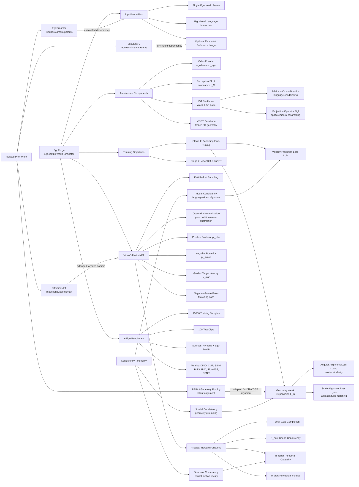

---
tags:
- paper
- domain/embodied_ai
- domain/reinforcement_learning
- domain/world_model
- impact/high_value
- method/diffusion_policy
- method/reinforcement_learning
- method/simulation
- review/auto_tagged
- status/unread
- task/navigation
- type/analysis
aliases:
- 'EgoForge: Goal-Directed Egocentric World Simulator'
url: https://huggingface.co/papers/2603.20169
pdf_url: https://arxiv.org/pdf/2603.20169.pdf
local_pdf: '[[EgoForge GoalDirected Egocentric World Simulator.pdf]]'
github: None
project_page: https://plan-lab.github.io/egoforge
institutions:
- University of Illinois Urbana-Champaign
- University of California San Diego
publication_date: '2026-03-20'
score: '8.0'
domains:
- embodied_ai
- reinforcement_learning
- world_model
methods:
- reinforcement_learning
- simulation
tasks:
- navigation
paper_type: analysis
impact_band: high_value
reading_status: unread
year: 2026
priority_score: 95
review_status: auto_tagged
next_action: skim_then_decide
arxiv_id: '2603.20169'
paper_id: arxiv:2603.20169
---

# EgoForge: Goal-Directed Egocentric World Simulator

## 📌 Abstract
Generative world models have shown promise for simulating dynamic environments, yet egocentric video remains challenging due to rapid viewpoint changes, frequent hand-object interactions, and goal-directed procedures whose evolution depends on latent human intent. Existing approaches either focus on hand-centric instructional synthesis with limited scene evolution, perform static view translation without modeling action dynamics, or rely on dense supervision, such as camera trajectories, long video prefixes, synchronized multicamera capture, etc. In this work, we introduce EgoForge, an egocentric goal-directed world simulator that generates coherent, first-person video rollouts from minimal static inputs: a single egocentric image, a high-level instruction, and an optional auxiliary exocentric view. To improve intent alignment and temporal consistency, we propose VideoDiffusionNFT, a trajectory-level reward-guided refinement that optimizes goal completion, temporal causality, scene consistency, and perceptual fidelity during diffusion sampling. Extensive experiments show EgoForge achieves consistent gains in semantic alignment, geometric stability, and motion fidelity over strong baselines, and robust performance in real-world smart-glasses experiments.

## 🖼️ Architecture
![[EgoForge GoalDirected Egocentric World Simulator_arch.png]]

## 🧠 AI Analysis

# 🚀 Deep Analysis Report: EgoForge: Goal-Directed Egocentric World Simulator

## 📊 Academic Quality & Innovation
---

## 1. Core Snapshot

### Problem Statement
Existing egocentric video generation methods face three compounding limitations: (1) they require dense supervision signals at inference time—camera trajectories, long video prefixes, or synchronized multi-view exocentric recordings—making them impractical for unconstrained wearable deployments; (2) they condition only on short textual prompts or low-level action primitives, providing insufficient high-level goal control for multi-step procedural behaviors such as "open the fridge and pour milk"; and (3) current video diffusion models lack 3D spatial grounding, producing outputs that are visually plausible but geometrically incoherent, undermining physical consistency in hand–object interaction sequences.

### Core Contribution
EgoForge is an egocentric world simulator that generates goal-directed, first-person video rollouts from a single egocentric frame, a high-level language instruction, and an optional exocentric reference image, without requiring camera trajectories, pose signals, or synchronized multi-view capture, augmented by a novel trajectory-level reward-guided refinement mechanism (VideoDiffusionNFT) that jointly optimizes goal completion, temporal causality, scene consistency, and perceptual fidelity during diffusion sampling.

### Innovation Origin & Rationale
The core architectural motivation arises from two independent lines of prior work. First, geometry-aware representation learning (REPA and Geometry Forcing) demonstrated that aligning intermediate diffusion transformer activations with features from a 3D-aware visual backbone (VGGT) improves spatial coherence without requiring explicit 3D supervision—this is adopted here as a weak supervision signal injected via cosine and scale alignment losses at selected DiT layers. Second, DiffusionNFT established that diffusion sampling can be steered via reward-weighted reranking of generated trajectories in the language/image domain; the authors extend this to the video domain by defining trajectory-level scalar rewards and translating them into guided velocity field updates within the diffusion ODE, enabling RL-style policy improvement without environment rollouts. The combination is technically reasonable because geometry alignment operates at training time (shaping the learned latent manifold to respect 3D structure), while VideoDiffusionNFT operates at inference/fine-tuning time (steering sampling toward high-reward goal-consistent trajectories), the two stages addressing orthogonal failure modes without mutual interference.

### Academic Rating
- **Innovation: 7/10** — The combination of geometry-weak supervision and video-domain DiffusionNFT is novel and well-motivated, though both constituent ideas are adaptations of existing techniques rather than first-principles inventions. The integration for the egocentric domain and the multi-reward VideoNFT formulation represent genuine engineering novelty.
- **Rigor: 6/10** — Quantitative results across seven metrics are comprehensive and ablations are informative, but the paper lacks detailed failure-mode analysis, qualitative assessment of geometric coherence beyond proxy metrics, and the X-Ego benchmark is self-curated, limiting independent reproducibility.

---

## 2. Technical Decomposition

### Algorithmic Logic

**Step 1 — Input Encoding.** Given a single egocentric frame (or short clip) $\mathbf{m}x_{1:k}$ and an optional exocentric reference image $\mathbf{m}x^{exo}$, two parallel encoding branches are applied. The egocentric input is processed by a pretrained video encoder to produce $\mathbf{f}_{ego}$. The exocentric image is processed by a lightweight Perception Block to yield $\mathbf{f}_C$. These are concatenated along the channel dimension with the noisy video latent $\mathbf{m}z_t$ to form the augmented latent $\tilde{\mathbf{m}z}_t = \text{Concat}(\mathbf{m}z_t, \mathbf{f}_{ego}, \mathbf{f}_C)$.

**Step 2 — Conditioning Integration.** The language instruction $y$ is incorporated into the DiT backbone via adaptive layer normalization (AdaLN) and cross-attention layers, following standard conditional DiT practice. A learned time embedding $\gamma(t)$ injects the diffusion timestep. This design allows all three conditioning signals (egocentric visual context, exocentric layout reference, and language goal) to influence denoising at each transformer block.

**Step 3 — Geometry Weak Supervision (Training Stage 1).** To inject 3D awareness without explicit depth or pose labels, hidden activations $\mathbf{h}_l \in \mathbb{R}^{N' \times Q' \times D_h}$ are extracted from selected DiT layers and projected via a learnable spatiotemporal resampling operator $\Pi_l$ to match the spatial token layout of VGGT geometry features $\mathbf{g}_l \in \mathbb{R}^{N \times Q \times D_s}$. Two alignment losses are computed: an angular (cosine) loss $\mathcal{L}^{\text{ang}}$ encouraging directional alignment, and a scale alignment loss $\mathcal{L}^{\text{sca}}$ operating on normalized-then-linearly-projected features. The combined geometry objective $\mathcal{L}_G = \zeta_1 \mathcal{L}^{\text{ang}} + \zeta_2 \mathcal{L}^{\text{sca}}$ is added to the velocity-prediction denoising loss $\mathcal{L}_D$, and VGGT/DINOv3 backbones are frozen throughout.

**Step 4 — VideoDiffusionNFT Refinement (Training Stage 2).** Given the supervised fine-tuned policy $\pi^{\text{old}}$, $K=6$ video rollouts are generated per conditioning context $c$. Each rollout $\mathbf{m}x_{1:T}^{(k)}$ receives a scalar composite reward $\mathcal{R}_{\text{total}}^{(k)}$ from a VLM evaluator. Per-condition empirical mean rewards $\mu_c$ are computed, and each rollout's reward is normalized to an optimality probability $\bar{\mathcal{R}}_{\text{total}}^{(k)} \in [0,1]$ via a clipped and shifted formula. Positive and negative posterior policies $\pi^+$ and $\pi^-$ are constructed by reweighting $\pi^{\text{old}}$ by normalized reward and inverse-reward respectively. A guided target velocity field $v^*$ is defined by interpolating between old, positive, and negative velocity fields, weighted by conditional optimality $\alpha(\mathbf{m}z_t, c)$. The policy is updated via a negative-aware flow-matching loss $\mathcal{L}(\theta)$ that penalizes deviation from both the positive target and the negative repulsion signal.

**Step 5 — Inference.** At test time, given only a single egocentric image, an instruction, and an optional exocentric reference, the refined diffusion policy performs standard iterative denoising starting from Gaussian noise, guided by the encoded conditioning context, and produces a full egocentric video rollout without any camera trajectory or synchronized multi-view input.

**Intuition for this flow:** The two-stage decomposition is deliberately motivated by the orthogonality of the two failure modes. Stage 1 shapes the latent geometry to be physically consistent (training-time regularization). Stage 2 aligns the sampling distribution with human intent (inference-time reward shaping). Combining both in a single-stage training would create conflicting gradient signals, whereas the sequential design allows each stage to converge independently.

---

### Mathematical Formulation

**Core Denoising Loss (Velocity Prediction):**
$$\mathcal{L}_D = \mathbb{E}_{t, \mathbf{m}z_t, \mathcal{C}} \left[ \| \epsilon - v_\theta(\tilde{\mathbf{m}z}_t, t, \mathcal{C}) \|_2^2 \right]$$
- $\epsilon$: sampled Gaussian noise used to corrupt the clean latent.
- $v_\theta$: the learned conditional velocity field predicted by the DiT model parameterized by $\theta$.
- $\tilde{\mathbf{m}z}_t$: augmented noisy latent (concatenation of noisy latent with ego and exo features).
- $\mathcal{C} = \{\mathbf{m}x_{1:k}, y, \mathbf{m}x^{exo}\}$: full conditioning context.
- **Physical meaning**: minimizing this loss trains the DiT to denoise the latent trajectory, implicitly learning the conditional distribution of future egocentric video frames.

**Angular Alignment Loss:**
$$\mathcal{L}^{\text{ang}} = -\frac{1}{LNQ} \sum_{l,n,q} \cos(\mathbf{g}_{l,n,q},\ \mathbf{p}_{l,n,q})$$
- $\mathbf{g}_{l,n,q}$: VGGT geometry feature at layer $l$, token index $n$, spatial index $q$.
- $\mathbf{p}_{l,n,q} = \Pi_l(\mathbf{h}_l)$: projected DiT hidden activation aligned to VGGT spatial resolution.
- $L$: number of selected DiT layers; $N, Q$: temporal and spatial token counts.
- **Physical meaning**: maximizing cosine similarity forces DiT intermediate representations to align directionally with 3D-aware geometry features, encouraging the model to internalize implicit depth and structure cues.

**Scale Alignment Loss:**
$$\mathcal{L}^{\text{sca}} = \frac{1}{LNQ} \sum_{l,n,q} \| \hat{\mathbf{g}}_{l,n,q} - \mathbf{g}_{l,n,q} \|_2^2$$
- $\tilde{\mathbf{p}}_l = \mathbf{p}_l / (\|\mathbf{p}_l\|_2 + \varepsilon)$: L2-normalized projected features.
- $\hat{\mathbf{g}}_l = \rho_l(\tilde{\mathbf{p}}_l)$: geometry predictions from a learned linear head $\rho_l$.
- **Physical meaning**: while angular alignment ensures directional consistency, scale alignment ensures that the magnitude of represented geometry features is also predictable from diffusion activations, preventing scale collapse.

**Total Geometry Loss:**
$$\mathcal{L}_G = \zeta_1 \mathcal{L}^{\text{ang}} + \zeta_2 \mathcal{L}^{\text{sca}}$$
where $\zeta_1, \zeta_2$ are scalar coefficients balancing directional vs. magnitude alignment.

**Normalized Optimality Probability:**
$$\bar{\mathcal{R}}_{\text{total}}^{(k)} = \frac{1}{2}\left[1 + \text{clip}\left(\frac{\mathcal{R}_{\text{total}}(\mathbf{m}x_{1:T}^{(k)}, c) - \mu_c}{Z_c}, -1, 1\right)\right]$$
- $\mu_c$: empirical per-condition mean reward over $K$ sampled rollouts.
- $Z_c > 0$: normalization scale per condition, ensuring $\bar{\mathcal{R}} \in [0,1]$.
- **Physical meaning**: normalizing rewards per condition prevents high-variance conditions from dominating gradient updates, analogous to advantage normalization in PPO.

**Guided Target Velocity Field:**
$$v^*(\mathbf{m}z_t, c, t) = v^{\text{old}}(\mathbf{m}z_t, c, t) + \frac{1}{\beta} \Delta(\mathbf{m}z_t, c, t)$$
$$\Delta(\mathbf{m}z_t, c, t) = \alpha(\mathbf{m}z_t, c)(v^+ - v^-)$$
- $\alpha(\mathbf{m}z_t, c) = \mathbb{E}[r(\mathbf{x}, c) \mid \mathbf{m}z_t, c]$: conditional optimality at intermediate diffusion state.
- $v^+, v^-$: velocity fields of positive ($\pi^+$) and negative ($\pi^-$) posteriors.
- $\beta > 0$: guidance strength hyperparameter.
- **Physical meaning**: the update steers denoising trajectories toward high-reward rollouts while actively repelling low-reward ones, implementing a contrastive improvement in velocity-field space.

**Negative-Aware Flow-Matching Loss:**
$$\mathcal{L}(\theta) = \mathbb{E}_{c, \mathbf{m}z_t}\left[\rho \|v_\theta^+ - v^*\|_2^2 + (1-\rho) \|v_\theta^- - v^*\|_2^2\right]$$
- $\rho \sim \text{Ber}(\alpha(\mathbf{m}z_t, c))$: Bernoulli random variable weighting positive vs. negative sample contributions.
- $v_\theta^+ = (1-\beta)v^{\text{old}} + \beta v_\theta$, $v_\theta^- = (1+\beta)v^{\text{old}} - \beta v_\theta$.
- **Physical meaning**: the loss jointly minimizes deviation from the guided positive target and deviation from the repulsion target, enforcing both attraction to good rollouts and repulsion from poor ones in a unified objective.

**Composite Reward:**
$$\mathcal{R}_{\text{total}} = \mathcal{R}_{\text{goal}} + \mathcal{R}_{\text{env}} + \mathcal{R}_{\text{temp}} + \mathcal{R}_{\text{per}}$$
- $\mathcal{R}_{\text{goal}}$: VLM-evaluated goal completion (similarity of final generated state to target reference).
- $\mathcal{R}_{\text{env}}$: scene consistency (penalizes drift or environment discontinuities).
- $\mathcal{R}_{\text{temp}}$: temporal causality (assesses physical plausibility of motion evolution).
- $\mathcal{R}_{\text{per}}$: perceptual fidelity (visual clarity and absence of artifacts).

---

### Tensor Flow & Architecture

```
Input Egocentric Frame: [B, 3, H, W] (720p, single frame or short clip)
    → Video Encoder (frozen) → f_ego: [B, C_ego, h, w]

Input Exocentric Image: [B, 3, H, W]
    → Perception Block (MLP-based) → f_C: [B, C_exo, h, w]

Noisy Latent: mz_t ~ N(0, I), shape [B, T, C_lat, h, w]
    → Concat([mz_t, f_ego, f_C], dim=channel) → mz̃_t: [B, T, C_aug, h, w]

Language Instruction y
    → Text Encoder (e.g., T5/CLIP) → f_text: [B, L_seq, D_text]

DiT Backbone (N blocks):
    Block_i:
        → AdaLN conditioning on γ(t) + f_text
        → Self-attention over spatial-temporal tokens
        → Cross-attention with f_text
        → Extract hidden activations h_l: [B, N', Q', D_h]
            → Projection Π_l → p_l: [B, N, Q, D_s]
            → Cosine loss with VGGT g_l: [B, N, Q, D_s] (geometry weak supervision)
    → Output: predicted velocity field v_θ: [B, T, C_lat, h, w]

Video Decoder → Generated video: [B, T, 3, H, W]
```

Key architectural choices:
- **Concatenation-based conditioning** (not cross-attention) for egocentric and exocentric visual features, preserving spatial structure.
- **FiLM/AdaLN** for language and timestep conditioning inside DiT blocks.
- **Frozen VGGT and DINOv3** during Stage 1, preventing geometry feature drift during diffusion alignment.
- **LoRA fine-tuning (rank 32)** in Stage 2 only on the diffusion model weights, keeping all other components frozen for stability.
- **6 rollouts per sample** during reward acquisition, balancing diversity of trajectory sampling against computational cost.

---

### Innovation Logic vs. Prior Baselines

| Aspect | Prior Work | EgoForge |
|---|---|---|
| Supervision | Camera trajectories, synchronized multi-view streams | Single ego frame + optional exo image at inference |
| Goal conditioning | Short text prompts or low-level action primitives | High-level natural language instructions |
| 3D grounding | None (pure pixel-level diffusion) | Geometry weak supervision via VGGT angular + scale alignment |
| Reward alignment | Not applicable to video generation | VideoDiffusionNFT: trajectory-level RL-style guided velocity field updates |
| NFT extension | DiffusionNFT applied to image/language domain [87] | Extended to video domain with 4 distinct scalar reward dimensions |

Unlike EgoDreamer [67] which conditions on ego images plus text plus camera parameters and produces hand-centric motion only, EgoForge produces full scene-level egocentric rollouts without camera parameters. Unlike Exo2Ego-V [83] which requires 4 synchronized exocentric video streams, EgoForge uses a single optional static exocentric image.

---

## 3. Evidence & Metrics

### Benchmark & Baselines
The X-Ego benchmark is curated from Nymeria [45] and Ego-Exo4D [22], comprising 15,000 training samples and 100 held-out test clips with dense annotations covering hand–object dynamics, object state changes, and step-level action semantics. Seven metrics are reported: PSNR and SSIM (low-level fidelity), LPIPS and DINO-Score and CLIP-Score (perceptual and semantic alignment), FVD (distributional realism), and optical flow MSE (temporal motion fidelity).

Baselines include general-purpose video models (Cosmos [47], HunyuanVideo [33], WAN2.2 [64]) fine-tuned on X-Ego, and egocentric-specific models (EgoDreamer [67], Handi [36]). To isolate the contribution of EgoForge's conditioning design, an ablation table (Table 2) progressively adds: exocentric view (+EV), text-only domain adaptation (+TT), and full conditioning injection with geometry weak supervision (+CI) to the strongest baseline (WAN2.2). This progressive ablation design is methodologically sound and provides clear attribution of gains.

### Key Results

| Metric | Best Baseline (WAN2.2) | EgoForge | Improvement |
|---|---|---|---|
| DINO-Score ↑ | 53.99 | 61.25 | +13.5% |
| CLIP-Score ↑ | 35.69 | 39.30 | +10.1% |
| SSIM ↑ | 0.72 | 0.79 | +9.7% |
| PSNR ↑ | 20.44 | 24.08 | +17.8% |
| LPIPS ↓ | 0.23 | 0.15 | −34.8% |
| FVD ↓ | 322.17 | 182.25 | −43.5% |
| Flow MSE ↓ | 5.78 | 2.83 | −51.0% |

Improvements are consistent and large across all metric categories, with the most dramatic gains in temporal motion fidelity (FVD, Flow MSE), indicating that the primary contribution of EgoForge is in temporal coherence rather than merely semantic alignment.

### Ablation Study
From Table 2, progressive enhancement of WAN2.2:
- **+EV** (exo view): minor gain in SSIM/PSNR, minimal semantic impact.
- **+TT** (text-only domain adaptation): moderate improvement in DINO/CLIP scores.
- **+CI** (full conditioning + geometry supervision): substantial jumps across all metrics (WAN2.2+CI: DINO 58.92, CLIP 38.05, FVD 218.72, Flow MSE 3.92).
- **EgoForge (full + VideoDiffusionNFT)**: additional gains on top of +CI (DINO 61.25, CLIP 39.30, FVD 182.25, Flow MSE 2.83).

This confirms that (a) geometry weak supervision is the single most critical component (accounting for the largest step-change in Table 2), and (b) VideoDiffusionNFT provides a measurable but incremental further improvement, particularly in temporal coherence metrics.

---

## 4. Critical Assessment

### Hidden Limitations

**VLM reward reliability as a training signal.** The VideoDiffusionNFT stage relies on VLM-evaluated scalar rewards ($\mathcal{R}_{\text{goal}}, \mathcal{R}_{\text{env}}, \mathcal{R}_{\text{temp}}, \mathcal{R}_{\text{per}}$) as non-parametric evaluators, but VLM assessors are known to exhibit hallucination and bias toward visually appealing frames rather than physically accurate motion. If the reward signal is systematically biased—for instance, penalizing realistic hand occlusion as a visual artifact—the policy refinement will steer generation away from physically correct behavior, creating a reward hacking failure mode that would not be detected by the reported quantitative metrics.

**Limited generalization to dynamic environments and moving cameras.** EgoForge is evaluated exclusively on relatively constrained table-top and kitchen manipulation scenarios from Nymeria and Ego-Exo4D. In unconstrained smart-glasses deployments with significant ego-motion (walking, running), the geometry weak supervision from VGGT (trained on structured scenes) may fail to provide reliable alignment signals, and the single static egocentric frame conditioning provides insufficient context to infer camera dynamics, potentially causing the model to hallucinate incorrect viewpoint trajectories.

### Engineering Hurdles

- **Inference throughput at 720p/24fps with 241 frames per sequence** requires the full DiT denoising stack at high resolution, and Stage 2 LoRA fine-tuning on 8×H100 GPUs for ~108 hours is non-trivial to reproduce without equivalent compute infrastructure.
- **The 6-rollout-per-sample reward acquisition loop** during VideoDiffusionNFT training multiplies GPU-hours by a factor of 6 relative to standard supervised fine-tuning, making iterative hyperparameter search (e.g., for $\beta$, $\zeta_1$, $\zeta_2$) prohibitively expensive in practice.

## 🔗 Knowledge Graph & Connections
## Task 1: Differential Analysis & Connections

### Connection 1: [[The Trinity of Consistency as a Defining Principle for General World Models]]

This is the most structurally aligned connection. The Trinity framework proposes that a general world model must satisfy **Modal Consistency** (semantic interface), **Spatial Consistency** (geometric basis), and **Temporal Consistency** (causal engine) as necessary and sufficient conditions. EgoForge operationalizes precisely this tripartite structure, though it arrives at these properties through engineering constraints rather than theoretical prescription: geometry weak supervision (via VGGT angular/scale alignment) implements Spatial Consistency; VideoDiffusionNFT with $\mathcal{R}_{\text{temp}}$ implements Temporal Consistency; and the combined language instruction + CLIP/DINO-scored reward $\mathcal{R}_{\text{goal}}$ implements Modal Consistency. The key **differential** is that the Trinity paper provides a normative theoretical framework without a concrete training algorithm, while EgoForge provides the inverse—a concrete, working system without a principled theoretical justification for why these three consistency types are necessary. EgoForge also adds a **fourth dimension** the Trinity paper does not discuss: *goal-directedness* (the agent's latent intent steering the trajectory), which arguably requires a fourth consistency type—*intentional consistency*—not captured in the Trinity framework.

### Connection 2: [[Generated Reality]]

Both papers target egocentric first-person video generation for XR/wearable applications, and both use diffusion transformer architectures with explicit conditioning mechanisms for spatial context. However, the differential is fundamental and reveals opposing design philosophies. Generated_Reality conditions on **dense, precisely tracked 3D signals** (head pose + joint-level hand poses) from real-time motion capture, making it suitable for controlled XR environments where tracking infrastructure exists. EgoForge explicitly rejects this approach, conditioning instead on a **single static frame + language instruction**, making it suitable for unconstrained wearable scenarios (smart glasses) where tracking is unavailable. Generated_Reality achieves high-fidelity dexterous hand–object interaction because it has direct kinematic ground truth; EgoForge must infer plausible hand motion from semantic intent alone, which is why it requires the geometry weak supervision and reward-guided refinement that Generated_Reality does not need. EgoForge is thus a strictly harder problem formulation with weaker supervision, while Generated_Reality is a better-controlled system with richer supervision.

### Connection 3: [[Chain of World]]

CoWVLA and EgoForge share the insight that temporally coherent video generation requires **disentangled representations of structure and motion**. CoWVLA achieves this through an explicit video VAE that factorizes video segments into structure latents and motion latents, then learns a *chain* of motion latents as an intermediate reasoning step before action prediction. EgoForge achieves a related goal through a different mechanism: geometry weak supervision shapes the latent space to preserve structural information, while VideoDiffusionNFT steers the *trajectory* of the diffusion process toward temporally causal motion patterns. The key **differential** is directionality of the modeling task: CoWVLA is an **action-generation** model (video understanding → robot action) that uses world modeling as an auxiliary intermediate, while EgoForge is a pure **world simulation** model (static observation + intent → future video) with no action output. Furthermore, CoWVLA's disentanglement is explicit and architectural (two separate VAE channels), whereas EgoForge's structure/motion disentanglement is implicit and emergent from the alignment losses—making CoWVLA more interpretable but less flexible, and EgoForge more scalable but less controllable at the representational level.

---

## Task 2: Mermaid Knowledge Graph



---

## Task 3: Future Research Directions

### Direction 1: Online Adaptive World Simulation with Real-Time Reward Feedback

EgoForge's VideoDiffusionNFT operates **offline**: rewards are collected from a fixed pool of rollouts and used to fine-tune the policy in batch. A natural and high-impact extension would be to develop an **online variant** where the reward model is queried at inference time to provide step-level guidance within a single denoising trajectory, akin to classifier guidance but using the trained VLM evaluator as the reward signal source. This would require extending the velocity field update $v^* = v^{\text{old}} + \frac{1}{\beta}\Delta$ from a pre-computed batch quantity to an online, per-step quantity estimated from intermediate diffusion states—essentially transforming VideoDiffusionNFT from a fine-tuning procedure into an inference-time search algorithm. This direction is technically motivated by the observation that EgoForge's biggest remaining gap (FVD = 182 vs. an ideal near-zero) likely reflects residual trajectory-level inconsistencies that batch reward shaping cannot fully correct but step-wise guidance could. The key research challenge is designing computationally efficient intermediate-state reward estimators that do not require full video decoding at every denoising step.

### Direction 2: Grounding Intentional Consistency via Hierarchical Goal Decomposition

EgoForge conditions on a single flat high-level instruction (e.g., "pour into the cup, put the can back") and must implicitly infer the sub-goal sequence and temporal dependencies. A principled improvement would introduce **hierarchical goal decomposition**, where a large language model first decomposes the instruction into an ordered sequence of sub-goals with estimated temporal durations, and each sub-goal independently conditions a segment of the DiT generation via time-indexed cross-attention. This would address the observation that EgoForge's $\mathcal{R}_{\text{goal}}$ reward evaluates only the final frame state, providing no gradient signal for intermediate procedural correctness. The hierarchical structure would also enable **compositional generalization**—generating novel multi-step tasks by combining known sub-goal templates—which is currently impossible with flat text conditioning. The key research challenge is learning the sub-goal temporal segmentation from egocentric video data without explicit sub-goal boundary annotations, which could be addressed using unsupervised temporal segmentation models trained on EPIC-KITCHENS.

### Direction 3: Bidirectional Ego-Exo Knowledge Distillation for Geometry-Free Spatial Grounding

EgoForge's geometry weak supervision relies on a pretrained VGGT backbone that must be frozen, limiting its adaptability to novel scene types outside VGGT's training distribution (e.g., outdoor environments, non-tabletop interactions). A more robust alternative would be to develop a **self-supervised geometry distillation** procedure where the model learns spatial consistency constraints directly from the statistical structure of paired egocentric–exocentric video streams in the X-Ego training data, without requiring a fixed pretrained 3D backbone. Specifically, one could train an auxiliary **cross-view consistency network** that learns to predict egocentric depth and surface normal pseudo-labels from the exocentric reference image (using off-the-shelf monocular depth estimation), and then use these pseudo-labels as the geometry supervision target in place of VGGT features. At inference time, the exocentric image would provide implicit geometry grounding without requiring the frozen VGGT backbone, reducing the architectural dependency and improving generalization. The key research challenge is maintaining calibration between exocentric-derived pseudo-labels and egocentric spatial relationships across diverse scene scales and camera baselines.


---
*Analysis performed by PaperBrain-OpenRouter (anthropic/claude-4.6-sonnet) (Vision-Enabled)*


## 🧩 Claim Cards

### Claim-01
- Claim: EgoForge's full conditioning injection with geometry weak supervision (+CI) achieves superior egocentric video generation quality compared to all baselines and ablation variants across the seven metrics reported on the X-Ego benchmark.
- Evidence: Table 2 ablation progressively adds exocentric view (+EV), text-only domain adaptation (+TT), and full conditioning injection with geometry weak supervision (+CI) on top of the strongest baseline WAN2.2, with each stage yielding measurable gains across PSNR, SSIM, LPIPS, DINO-Score, CLIP-Score, FVD, and optical flow MSE on the 100 held-out X-Ego test clips.
- Boundary/Failure: Gains are measured on the curated X-Ego benchmark (15,000 training samples from Nymeria and Ego-Exo4D); performance may degrade in dynamic environments with fast-moving cameras or scenes not represented in these datasets, as the paper's own limitations note restricted generalization to such conditions.
- Compared Against: WAN2.2 fine-tuned on X-Ego, Cosmos, HunyuanVideo, EgoDreamer, and Handi baselines.
- Confidence: 7
- Links:
  - same_problem:: [[The Trinity of Consistency as a Defining Principle for General World Models]]
  - improves_over:: 待定
  - conflicts_with:: 待定

### Claim-02
- Claim: Incorporating exocentric view conditioning and geometry weak supervision into a video diffusion backbone provides complementary and independently attributable improvements to egocentric video generation fidelity, as demonstrated by the progressive ablation design in EgoForge.
- Evidence: The ablation table (Table 2) isolates three additive components—+EV (exocentric view), +TT (text-only domain adaptation), and +CI (full conditioning with geometry weak supervision)—each contributing incremental metric improvements over the WAN2.2 baseline across all seven reported metrics, providing clear attribution of gains to each design choice.
- Boundary/Failure: The attribution assumes independence of the three components; if exocentric view availability is limited or the geometry weak supervision signal is noisy (e.g., in cluttered or textureless scenes), the additive gains may not hold, and the ablation may overestimate the contribution of geometry supervision in isolation.
- Compared Against: WAN2.2 fine-tuned on X-Ego as the progressive ablation base.
- Confidence: 7
- Links:
  - same_problem:: [[The Trinity of Consistency as a Defining Principle for General World Models]]
  - improves_over:: 待定
  - conflicts_with:: 待定

### Claim-03
- Claim: The VLM-based reward signals used in EgoForge's VideoDiffusionNFT stage are susceptible to systematic bias, potentially steering generation away from physically correct hand-object interactions toward visually appealing but geometrically inaccurate outputs—a failure mode undetectable by the reported quantitative metrics.
- Evidence: The paper's critical assessment identifies that VLM assessors are known to hallucinate and favor visually appealing frames over physically accurate motion; for instance, realistic hand occlusion may be penalized as a visual artifact, causing reward hacking. None of the seven reported metrics (PSNR, SSIM, LPIPS, DINO-Score, CLIP-Score, FVD, optical flow MSE) directly measure physical correctness of hand-object interaction geometry.
- Boundary/Failure: This limitation is most severe in multi-step procedural tasks with complex hand occlusion patterns (e.g., "open the fridge and pour milk"), where VLM reward bias is most likely to diverge from physical ground truth; in simple, visually unambiguous tasks the bias may be negligible.
- Compared Against: Ground-truth physical correctness of hand-object dynamics, not captured by any baseline metric in the evaluation suite.
- Confidence: 6
- Links:
  - same_problem:: 待定
  - improves_over:: 待定
  - conflicts_with:: [[The Trinity of Consistency as a Defining Principle for General World Models]]

### Claim-04
- Claim: EgoForge demonstrates that goal-directed egocentric world simulation—conditioning on high-level natural language goals rather than dense camera trajectories or action primitives—is a viable paradigm for unconstrained wearable deployment, advancing the broader agenda of physically and semantically consistent world models.
- Evidence: EgoForge eliminates the need for dense inference-time supervision (camera trajectories, long video prefixes, synchronized multi-view exocentric recordings) and instead conditions on high-level goals such as "open the fridge and pour milk," evaluated on 100 held-out X-Ego test clips with semantic alignment metrics (CLIP-Score, DINO-Score) confirming goal-conditioned coherence. The X-Ego benchmark covers hand-object dynamics, object state changes, and step-level action semantics across 15,000 training samples.
- Boundary/Failure: The paradigm is validated only on indoor procedural tasks from Nymeria and Ego-Exo4D; generalization to outdoor, dynamic, or novel environment categories not represented in X-Ego training data remains unverified, and the lack of 3D spatial grounding in the base diffusion model limits geometric consistency in complex interaction sequences.
- Compared Against: EgoDreamer and Handi (egocentric-specific models requiring denser supervision), and general-purpose video models (Cosmos, HunyuanVideo, WAN2.2) lacking goal-level conditioning.
- Confidence: 6
- Links:
  - same_problem:: [[The Trinity of Consistency as a Defining Principle for General World Models]]
  - improves_over:: 待定
  - conflicts_with:: 待定

## 📂 Resources
- **Local PDF**: [[EgoForge GoalDirected Egocentric World Simulator.pdf]]
- [Online PDF](https://arxiv.org/pdf/2603.20169.pdf)
- [ArXiv Link](https://huggingface.co/papers/2603.20169)