---
tags:
- paper
- domain/embodied_ai
- domain/multimodal_perception
- domain/robot_manipulation
- impact/high_value
- method/diffusion_policy
- method/foundation_model
- method/planning
- review/auto_tagged
- status/unread
- task/manipulation
- task/navigation
- task/planning_reasoning
- task/scene_understanding
- task/video_prediction
- type/system
aliases:
- 'EmboAlign: Aligning Video Generation with Compositional Constraints for Zero-Shot
  Manipulation'
url: https://huggingface.co/papers/2603.05757
pdf_url: https://arxiv.org/pdf/2603.05757.pdf
local_pdf: '[[EmboAlign Aligning Video Generation with Compositional Constraints for
  ZeroShot Manipulation.pdf]]'
github: None
project_page: None
institutions:
- Northwestern University
- Stanford University
publication_date: '2026-03-05'
score: '8.0'
domains:
- embodied_ai
- multimodal_perception
- robot_manipulation
methods:
- foundation_model
- planning
tasks:
- manipulation
- navigation
- planning_reasoning
- scene_understanding
- video_prediction
paper_type: system
impact_band: high_value
reading_status: unread
year: 2026
priority_score: 103
review_status: auto_tagged
next_action: inspect_protocol
arxiv_id: '2603.05757'
paper_id: arxiv:2603.05757
---

# EmboAlign: Aligning Video Generation with Compositional Constraints for Zero-Shot Manipulation

## 📌 Abstract
Video generative models (VGMs) pretrained on large-scale internet data can produce temporally coherent rollout videos that capture rich object dynamics, offering a compelling foundation for zero-shot robotic manipulation. However, VGMs often produce physically implausible rollouts, and converting their pixel-space motion into robot actions through geometric retargeting further introduces cumulative errors from imperfect depth estimation and keypoint tracking. To address these challenges, we present , a data-free framework that aligns VGM outputs with compositional constraints generated by vision-language models (VLMs) at inference time. The key insight is that VLMs offer a capability complementary to VGMs: structured spatial reasoning that can identify the physical constraints critical to the success and safety of manipulation execution. Given a language instruction,  uses a VLM to automatically extract a set of compositional constraints capturing task-specific requirements, which are then applied at two stages: (1) constraint-guided rollout selection, which scores and filters a batch of VGM rollouts to retain the most physically plausible candidate, and (2) constraint-based trajectory optimization, which uses the selected rollout as initialization and refines the robot trajectory under the same constraint set to correct retargeting errors. We evaluate  on six real-robot manipulation tasks requiring precise, constraint-sensitive execution, improving the overall success rate by 43.3\% points over the strongest baseline without any task-specific training data.

## 🖼️ Architecture
![[EmboAlign Aligning Video Generation with Compositional Constraints for ZeroShot Manipulation_arch.png]]

## 🧠 AI Analysis

# 🚀 Deep Analysis Report: EmboAlign: Aligning Video Generation with Compositional Constraints for Zero-Shot Manipulation

## 📊 Academic Quality & Innovation
---

# EmboAlign: Deep Engineering Analysis

## 1. Core Snapshot

### Problem Statement

Video-based robotic manipulation pipelines using pretrained Video Generative Models (VGMs) face two compounding failure modes. First, VGMs trained on internet-scale data frequently hallucinate physically implausible behaviors—object interpenetration, non-conservative motion, prompt-following drift—because physically-grounded interaction data is scarce in their training corpora. Second, even visually plausible rollouts fail during execution because converting pixel-space motion to robot joint actions via geometric retargeting (depth estimation + keypoint tracking) accumulates systematic errors, causing large positional offsets and missed contacts. Current pipelines lack any mechanism to enforce the physical and geometric constraints that successful manipulation inherently requires (spatial relations, kinematic requirements, safety clearances).

### Core Contribution

EmboAlign is a data-free, two-stage compositional constraint alignment framework that uses VLM-derived physical constraints to filter VGM rollouts for physical plausibility and then optimize the retargeted trajectory under the same constraints to correct depth/tracking errors, achieving 68.3% average success rate on six real-robot tasks without any task-specific training.

### Academic Rating

- **Innovation: 7/10** — The core idea of using VLMs and VGMs as complementary systems (VLMs for structured reasoning, VGMs for motion diversity) is well-motivated and cleanly articulated. The two-stage application of the same constraint set is novel in its integration, though each individual component (VLM constraint generation, latent world model scoring, keypoint retargeting, SLSQP optimization) is assembled from existing techniques.
- **Rigor: 7/10** — Real-robot evaluation on six distinct tasks with 10 trials each is credible. Ablation study is systematic and isolates contributions clearly. The failure mode breakdown is unusually thorough. However, evaluation sample size (N=10 per task) is modest, and absence of confidence intervals or statistical tests limits the strength of quantitative claims.

---

## 2. Technical Decomposition

### 2.1 Algorithmic Logic: Step-by-Step Flow

**Step 0: Input Acquisition**
The system receives an initial RGB-D observation **o** = (**I**, **D**) (RGB image and corresponding depth map) and a natural language instruction ℓ (e.g., "Stack the green cube on the red cube").

**Step 1: Compositional Constraint Generation (VLM Stage)**
- Segment Anything Model (SAM / Grounded DINO) is applied to **I** to generate instance segmentation masks {M_e} for task-relevant entities ε.
- For each entity mask M_e, a sparse set of 2D keypoints P_e = {p_{e,j}} is sampled from the mask interior and geometric extrema.
- The keypoint-annotated image is rendered and, together with the language instruction ℓ, is prompted into a VLM (GPT-4 class) to produce the constraint set C = f_vlm(**o**, ℓ).
- Each constraint c ∈ C is a Python callable: c: ℝ^{K×3} → ℝ, where **k** ∈ ℝ^{K×3} is the 3D keypoint configuration of all K keypoints. The convention is c(**k**) ≤ 0 indicating satisfaction.
- Constraints are decomposed into **hard constraints** (physical invariants: no deformation, no disappearance, no static object movement) and **soft constraints** (task-specific goals: spatial alignment, approach direction, placement height).

*Intuition*: VLMs cannot reliably predict motion trajectories, but they are strong at structured physical reasoning from a static scene description. Externalizing constraint logic as Python functions decouples the reasoning from trajectory generation and allows the same logical checks to be applied algebraically at both the selection and optimization stages.

**Step 2: VGM Candidate Rollout Generation**
- N candidate rollout videos {V_i}_{i=1}^N are sampled from a pretrained VGM (LVP [7] is used as the default): V_i ~ p_vgm(· | **o**, ℓ).
- No fine-tuning or gradient updates are applied to the VGM. The VGM provides motion diversity and rich object dynamics as a prior.

**Step 3: Constraint-Guided Video Selection (Two-Score Ranking)**

**3a. Visual Plausibility Scoring (V-JEPA-2)**
- A pretrained latent world model V-JEPA-2 (encoder E_θ, predictor P_φ) operates on the video sequence.
- A sliding context window of size C is placed at anchor positions s across the T-frame sequence.
- The predictor P_φ takes C context frames E_θ(v_{s-C+1:s}) and forecasts latent representations for the next M frames: z̃_s = P_φ(Δ_m, E_θ(v_{s-C+1:s})).
- The encoded future is: z_s = E_θ(v_{s-C+1:s+M}).
- Visual plausibility score:

$$s_{\text{vis}}(V) = \frac{1}{|\mathcal{S}|} \sum_{s \in \mathcal{S}} \left(1 - \frac{\tilde{\mathbf{z}}_s^\top \mathbf{z}_s}{\|\tilde{\mathbf{z}}_s\|_2 \|\mathbf{z}_s\|_2}\right)$$

- **Variable definitions**: |S| = number of anchor positions; z̃_s = predicted latent at anchor s; z_s = encoded actual future at anchor s. Lower s_vis indicates better alignment (more predictable, physically coherent).

- *Physical meaning*: If a rollout contains hallucinations (objects morphing, non-physical motion), V-JEPA-2's predictions diverge from the observed latent, increasing mean cosine discrepancy. This serves as an unsupervised physical plausibility signal without requiring task-specific reward models.

**3b. Spatial Constraint Satisfaction Scoring**
- For rollout V_i, 2D keypoints {P_e} are tracked through all frames using CoTracker [50]: trajectories {π_{e,j,t} ∈ ℝ²}.
- Per-frame depth maps {D̂_t} are estimated using RollingDepth [51] (monocular video depth).
- Scale-shift ambiguity of monocular depth is resolved by fitting an affine transform (α, β) on valid pixels such that αD̂_1 + β ≈ **D** (the known metric depth of the initial frame): D_t = αD̂_t + β.
- Tracked 2D points are back-projected to 3D using calibrated depth and known camera intrinsics, yielding object-centric 3D keypoint trajectories K_i = {k_{e,j,t} ∈ ℝ³}.
- The aggregate constraint violation cost across the trajectory:

$$\text{cost}_{\mathcal{C}}(\mathcal{K}) = \sum_{c \in \mathcal{C}} \sum_{t=1}^T \left[\max(0,\ c(\mathbf{k}_t))\right]^2$$

- **Variable definitions**: c = one constraint function; k_t = 3D keypoint configuration at frame t; the max(0,·) hinge ensures only violations (c > 0) contribute. Satisfaction (c ≤ 0) incurs zero cost.
- Spatial constraint score: s_spatial(V_i; C) = cost_C(K_i).

**3c. Joint Selection (Sequential Evaluation)**
- To avoid expensive 3D reconstruction for all N candidates, candidates are first ranked by s_vis (ascending = most plausible first).
- Then s_spatial is evaluated one-by-one in this order; the first candidate whose spatial cost falls below threshold ε is selected:

$$V^* = V_{(j^*)}, \quad j^* = \min\{j : s_{\text{spatial}}(V_{(j)}; \mathcal{C}) \le \epsilon\}$$

- *Intuition for sequential ordering*: Spatial evaluation requires CoTracker + RollingDepth + 3D backprojection per video — computationally expensive. Visual plausibility is cheap (single forward pass). This ordering ensures the most physically coherent candidates are evaluated spatially first, reducing average computation.

**Step 4: Grasp Estimation**
- AnyGrasp [52] is applied to the initial scene point cloud to predict stable grasp candidates.
- For robustness under partial occlusion, SAM-3D [53] reconstructs a 3D object model, fused into the scene point cloud, and additional grasp candidates are sampled on the augmented representation.
- The highest-scoring grasp defines a fixed gripper-object transform T_grasp ∈ SE(3).

**Step 5: Motion Retargeting (Initial Trajectory)**
- Under the assumption of a rigid gripper-object transform T_grasp throughout manipulation, the 3D keypoint trajectory K* from the selected rollout V* induces end-effector poses.
- At each timestep t, a rigid transform T_t^obj ∈ SE(3) is recovered by fitting rigid correspondences between frame t and the initial frame keypoints.
- End-effector pose: ξ_t^(0) = T_t^obj · T_grasp ∈ SE(3).
- This gives the initial trajectory ξ_{1:T}^(0) = g_retarget(V*, **o**).

**Step 6: Constraint-Based Trajectory Optimization (SLSQP)**
- The retargeted trajectory ξ_{1:T}^(0) serves as initialization for a nonlinear program:

$$\boldsymbol{\xi}_{1:T}^* = \arg\min_{\boldsymbol{\xi}_{1:T}} \sum_{c \in \mathcal{C}} \sum_{t=1}^T \left[\max(0,\ c(\mathbf{k}_t))\right]^2 + \lambda \sum_{t=1}^T \|\boldsymbol{\xi}_t - \boldsymbol{\xi}_t^{(0)}\|^2$$

- **Variable definitions**: ξ_t ∈ SE(3) = end-effector pose at step t (decision variable, normalized to [0,1]); k_t = 3D keypoint configuration induced by ξ_t through the fixed T_grasp transform; λ = trade-off coefficient between constraint satisfaction and trajectory fidelity.
- **First term**: Penalizes constraint violations along the optimized trajectory (identical form to the video selection cost).
- **Second term**: Regularizes the solution to stay close to the VGM motion prior, preventing the optimizer from converging to a physically valid but executionally bizarre trajectory.
- Solved with Sequential Least Squares Programming (SLSQP) [54] — a gradient-based nonlinear optimizer suitable for equality/inequality constrained nonlinear programs with smooth objectives.
- The optimized ξ_{1:T}^* is executed as a 6-DoF end-effector pose sequence.

*Intuition for using VGM as initialization*: Pure constraint-based methods (e.g., ReKep) initialize from heuristic plans and are sensitive to local optima, particularly in non-convex feasible regions created by obstacles. VGM rollouts provide motion-diverse, semantically reasonable initializations that place the optimizer in a better basin of attraction, dramatically improving convergence to feasible solutions.

---

### 2.2 Mathematical Formulation Summary

| Formula                                                     | Objective     | Physical Meaning                                             |
| ----------------------------------------------------------- | ------------- | ------------------------------------------------------------ |
| $s_v$is(V) = mean cosine discrepancy (Eq. 2)                | Minimize      | Lower = more temporally coherent, fewer hallucinations       |
| cost_C(K) = Σ_c Σ_t [max(0, c(k_t))]² (Eq. 1)               | Minimize      | Zero = all constraints satisfied across full trajectory      |
| s_spatial(V_i; C) = cost_C(K_i) (Eq. 3)                     | Threshold < ε | Candidate passes spatial filter                              |
| V* = V_{(j*)} (Eq. 4)                                       | Selection     | Best visually plausible candidate that satisfies constraints |
| ξ*_{1:T} = argmin [constraint penalty + λ·fidelity] (Eq. 5) | Optimize      | Stay physically valid while staying close to VGM prior       |

---

### 2.3 Tensor Flow & Architecture

```
Input: RGB I [H×W×3], Depth D [H×W], Language ℓ
        ↓
SAM/Grounded-DINO → Masks {M_e} [H×W per entity]
        ↓
Keypoint Sampling → 2D keypoints P_e [J_e × 2] per entity
        ↓
VLM (GPT-4) + annotated image → Constraint Set C (Python callables)
        ↓
VGM (LVP) → N video rollouts {V_i} [T × H × W × 3]
        ↓ (parallel for s_vis, sequential for s_spatial)
V-JEPA-2 Encoder E_θ: [T × H × W × 3] → [T × D_latent]
V-JEPA-2 Predictor P_φ: context latents → predicted latents [M × D_latent]
s_vis computed per video
        ↓
Sort by s_vis; for top candidates:
CoTracker: [T × H × W × 3] + initial points [J × 2] → [J × T × 2]
RollingDepth: [T × H × W × 3] → [T × H × W] (scale-relative depth)
Affine calibration: (α, β) fit on initial frame
Back-projection: [J × T × 2] + [T × H × W] → K_i [J × T × 3]
s_spatial = cost_C(K_i)
        ↓
Select V* (first candidate with s_spatial < ε)
        ↓
AnyGrasp + SAM-3D → T_grasp ∈ SE(3)
        ↓
Rigid body fitting on K* → {T_t^obj} → ξ_{1:T}^(0) [T × 6DoF]
        ↓
SLSQP optimization (Eq. 5): ξ_{1:T}^(0) → ξ*_{1:T} [T × 6DoF]
        ↓
Robot execution (Dobot Nova2, 6-DoF)
```

**Key architectural choices**:
- **V-JEPA-2 as plausibility scorer**: Chosen over pixel-level metrics because it operates in a compressed latent space that emphasizes physical dynamics over texture/lighting artifacts. It requires no task-specific fine-tuning.
- **Keypoint representation**: Object-agnostic, works without object-specific CAD models or semantic labels beyond segmentation masks. Captures spatial relations and contact conditions compactly.
- **SLSQP over gradient-based RL/diffusion**: SLSQP is deterministic, interpretable, and can handle mixed equality/inequality constraints directly. No learned dynamics model is required at test time.
- **Affine depth calibration**: Rather than trusting monocular depth scales (which drift), the initial metric depth D anchors the scale/shift, propagating a calibrated metric frame throughout.

---

### 2.4 Innovation Logic

| Aspect | Prior Methods | EmboAlign |
|---|---|---|
| Constraint enforcement | ReKep: constraint-only, no video prior; VLMPC: MPC without video initialization | Two-stage: filter + optimize using same constraint set |
| Video selection | NovaFlow: use VGM directly without filtering | VLM-derived constraints score candidates before execution |
| Trajectory initialization | ReKep: heuristic, sensitive to local optima | VGM rollout provides motion-diverse initialization |
| Plausibility scoring | Task-specific reward models or human annotation | V-JEPA-2 self-supervised latent world model (no task-specific training) |
| Depth scale | Monocular depth (scale ambiguous) | Affine calibration anchored to initial metric depth |
| Data requirements | Most methods require domain-specific training data | Data-free; all components are pretrained and used zero-shot |

The mathematical distinction from ReKep is that ReKep solves the constraint optimization from a heuristic initialization without a video-based motion prior, while EmboAlign initializes from ξ_{1:T}^(0) derived from the VGM's selected rollout, which places the SLSQP solver in a semantically meaningful region of the trajectory space, avoiding non-convex local optima that arise in obstacle-constrained tasks.

---

## 3. Evidence & Metrics

### 3.1 Benchmark & Baselines

**Platform**: Dobot Nova2 robot arm, 6-DoF end-effector control.

**Baselines**:
1. **ReKep** [37]: Constraint-only method. VLM generates relational keypoint constraints as cost functions, solved via hierarchical constrained optimization. No video guidance. Represents the pure constraint-planning paradigm.
2. **NovaFlow** [22]: Video-only method. Extracts 3D flow from VGM rollouts without constraint-based filtering or trajectory refinement. Represents the pure video-retargeting paradigm.

**Fairness**: All methods use identical robot hardware, perception setup (same camera, depth sensor), and environment configurations. EmboAlign uses LVP as default VGM, which is also used in NovaFlow. The ablations isolate component contributions cleanly.

### 3.2 Key Results

**Table I Summary (Success counts / 10 trials)**:

| Method | Stack | Press | Ham. | Place | Open | Pour | Avg. |
|---|---|---|---|---|---|---|---|
| ReKep | 3/10 | 2/10 | 1/10 | 1/10 | 4/10 | 2/10 | **21.7%** |
| NovaFlow | 2/10 | 0/10 | 1/10 | 4/10 | 4/10 | 4/10 | **25.0%** |
| **EmboAlign (Ours)** | **7/10** | **8/10** | **4/10** | **8/10** | **7/10** | **7/10** | **68.3%** |

- Overall improvement: **+43.3 pp over ReKep**, **+43.3 pp over NovaFlow**.
- Largest gains on contact-sensitive tasks: Press the Stapler (+80 pp over NovaFlow, +60 pp over ReKep), Place the Block Securely (+40 pp over NovaFlow, +70 pp over ReKep).
- ReKep fails severely on safety-constrained tasks (Place: 1/10) because its constraint-only optimizer converges to infeasible solutions in non-convex obstacle-constrained spaces.
- NovaFlow fails on contact-sensitive tasks (Press: 0/10) because without constraint filtering, physically implausible rollouts frequently propagate to execution.

### 3.3 Ablation Study

**Table III (Video vs. Constraints)**:

| Variant | Stack | Press | Ham. | Place | Open | Pour | Avg. |
|---|---|---|---|---|---|---|---|
| Constr.-only | 2/10 | 3/10 | 2/10 | 2/10 | 5/10 | 3/10 | 28.3% |
| Video-only | 3/10 | 1/10 | 0/10 | 3/10 | 4/10 | 3/10 | 23.3% |
| +Selection | 5/10 | 6/10 | 2/10 | 6/10 | 5/10 | 5/10 | 48.3% |
| **+Opt (Full)** | **7/10** | **8/10** | **4/10** | **8/10** | **7/10** | **7/10** | **68.3%** |

**Critical component analysis**:
- Adding constraint-guided **selection** alone (+Selection vs. Video-only): +25.0 pp. This is the single largest individual gain, confirming that filtering physically implausible rollouts before execution is the most impactful intervention.
- Adding trajectory **optimization** (+Opt vs. +Selection): +20.0 pp. Correcting retargeting errors is the second most impactful component, particularly for contact-sensitive tasks requiring sub-centimeter precision.
- The VGM quality ablation (Table II) shows that LVP [7] outperforms Wan2.2 and Cosmos2.5, confirming that rollout quality contributes meaningfully, though the constraint pipeline provides gains independent of which VGM is used.

---

## 4. Critical Assessment

### 4.1 Hidden Limitations

**Sample size and statistical validity**: Each task is evaluated with N=10 trials. With such small samples, the difference between 7/10 and 8/10 is not statistically distinguishable. Confidence intervals and significance tests are absent, which limits the reliability of performance comparisons, particularly for tasks like Hammer (4/10 = 40%), where variance is likely high.

**Scalability of VLM constraint generation**: The VLM must correctly identify task-relevant entities, assign appropriate keypoints, and produce syntactically and semantically correct Python constraint functions. The failure mode analysis reports 26.31% of failures from VLM keypoint referring errors, primarily when spatially proximate objects occupy small image regions. In cluttered real-world environments with many similar-looking objects, this error rate will increase substantially.

**Rigid-body assumption in retargeting**: The system assumes a fixed gripper-object rigid transform T_grasp throughout the manipulation phase. This assumption fails for deformable objects, objects that slip in the gripper, or multi-step tasks requiring regrasping. The paper evaluates only single-grasp manipulation tasks, so generalization to regrasping or contact-rich in-hand manipulation is unknown.

**Monocular depth calibration propagation**: The affine calibration (α, β) is fit using the initial frame's metric depth and then applied to all subsequent frames. This assumes that the monocular depth model maintains consistent relative scale/shift throughout the video. In practice, camera motion, scene changes, or lighting variations can cause the monocular depth to drift, breaking the calibration and introducing systematic 3D reconstruction errors. This accounts for 15.80% of reported failures.

**Computational overhead**: The pipeline involves VGM sampling (N rollouts), V-JEPA-2 scoring, sequential CoTracker + RollingDepth 3D reconstruction for candidate selection, AnyGrasp, and SLSQP optimization. The latency is not reported in the paper. For any reactive manipulation or closed-loop control scenario, this pipeline would likely be too slow for real-time use.

**Fixed constraint threshold ε**: The spatial constraint selection threshold ε is a hyperparameter that controls the trade-off between selectivity and fallback behavior (no candidate passes). The paper does not analyze sensitivity to ε or describe what happens when no candidate satisfies the threshold — presumably the pipeline falls back to the lowest-cost candidate, but this is not explicit.

### 4.2 Engineering Hurdles

**VLM prompt engineering fragility**: Generating correctly-structured Python constraint functions from a VLM requires careful prompt design. Minor changes in instruction phrasing or scene complexity can produce syntactically valid but semantically incorrect constraints (e.g., wrong sign convention, incorrect keypoint index references). Robust deployment would require constraint validation, unit testing, and fallback handling — none of which are described.

**CoTracker point initialization sensitivity**: Keypoints are sampled from SAM masks at the initial frame. If SAM produces inaccurate masks (partial occlusion, unusual lighting), the initial keypoint positions will be incorrect, propagating errors through tracking and 3D reconstruction. The paper notes that cluttered scenes with multiple nearby objects exacerbate this problem.

**SLSQP convergence guarantees**: SLSQP is a local optimizer. Although VGM initialization places it in a better basin than heuristic methods, there is no guarantee of convergence to the global optimum, particularly for long-horizon tasks with complex constraint geometry. The paper uses a single optimization run from the VGM initialization without warm-starting strategies, random restarts, or population-based methods that could improve robustness.

**Depth sensor dependency**: The pipeline requires an RGB-D sensor for the initial depth observation D to calibrate monocular depth estimates. This is not a fundamental limitation but means the system cannot operate with RGB-only cameras without modification. The calibration quality depends on the accuracy and resolution of the depth sensor.

**VGM inference cost at scale**: Sampling N rollouts from LVP or similar large video generation models is computationally expensive. The paper does not specify N, inference time per rollout, or total pipeline latency. For deployment on resource-constrained systems or in time-sensitive applications, this is a practical barrier. Reducing N risks selecting from a less diverse candidate pool, potentially missing physically plausible rollouts.

**Integration brittleness**: The pipeline integrates at least seven distinct pre-trained models (VLM, SAM/Grounded-DINO, VGM, V-JEPA-2, CoTracker, RollingDepth, AnyGrasp) plus an optimizer. Each component introduces potential failure modes and API dependencies. Reproducing the exact system requires access to all these models at compatible versions, which is a non-trivial engineering undertaking given that several (V-JEPA-2, LVP) are recent and may not have stable public releases at the time of publication.

## 🔗 Knowledge Graph & Connections
## Task 1: Differential Analysis & Connections

### Connection 1: EmboAlign vs. [[World_Action_Models_are_Zero_shot_Policies]]

Both papers address zero-shot manipulation by leveraging pretrained video generative models as motion priors, but they diverge sharply in how they resolve the gap between video prediction and robot execution. DreamZero (WAM) closes this gap by **jointly learning video and action** within a unified diffusion backbone, enabling real-time closed-loop control at 7Hz through model compression and system optimization. EmboAlign, by contrast, treats the VGM as a **frozen proposal generator** and never trains a video-action joint model — instead, it imposes physical validity post-hoc via VLM-derived compositional constraints applied at both selection and trajectory optimization stages.

The critical differential is in the failure mode addressed: DreamZero targets *semantic and motion generalization* (2× improvement over VLAs on unseen tasks/environments), while EmboAlign specifically targets *physical plausibility and retargeting precision* in contact-sensitive manipulation. DreamZero still inherits the fundamental limitation that its video predictions may violate physical constraints, as no structured constraint enforcement mechanism is present. EmboAlign's constraint-guided selection and SLSQP optimization directly address this, but at the cost of real-time applicability — the multi-model inference pipeline (VGM + V-JEPA-2 + CoTracker + RollingDepth + SLSQP) has no demonstrated real-time capability, whereas DreamZero explicitly achieves 7Hz closed-loop control. These two approaches are therefore **architecturally complementary**: DreamZero's efficiency could benefit from EmboAlign's constraint enforcement, and EmboAlign's physical precision could benefit from DreamZero's closed-loop replanning capability.

---

### Connection 2: EmboAlign vs. [[TiPToP]]

Both EmboAlign and [[TiPToP]] represent **modular, data-free, zero-shot manipulation pipelines** that assemble pretrained foundation model components rather than training end-to-end task-specific policies. TiPToP combines vision foundation models with a Task and Motion Planner (TAMP) to solve multi-step manipulation from RGB + language, evaluated over 28 tasks. EmboAlign similarly stacks SAM, VLM, VGM, V-JEPA-2, CoTracker, RollingDepth, AnyGrasp, and an optimizer into a sequential pipeline.

The key structural difference lies in the **planning representation and constraint source**. TiPToP relies on TAMP's symbolic planning layer to enforce task structure, which requires predefined predicates and geometric primitives, limiting open-vocabulary generalization without additional engineering. EmboAlign derives constraints *automatically* from the VLM at inference time as executable Python functions, requiring no predefined symbolic vocabulary — this makes constraint generation more flexible but also more fragile (26.31% failure rate from VLM keypoint referral errors). TiPToP's modular failure mode analysis methodology (per-component attribution across 173 trials) is methodologically more rigorous than EmboAlign's failure taxonomy (which covers only unsuccessful trials of the full system). Conversely, EmboAlign's constraint-based trajectory optimization provides a mechanism TiPToP lacks: correcting geometric retargeting errors *after* plan generation, which is particularly valuable for contact-sensitive tasks where millimeter-level precision matters.

---

### Connection 3: EmboAlign vs. [[RISE]]

Both papers use a **world model as a physical plausibility evaluator** to bridge the gap between generative model outputs and physically executable robot behavior, but the architectural roles of the world model differ substantially. In [[RISE]], the Compositional World Model is *trained* to jointly predict multi-view futures (controllable dynamics model) and evaluate outcomes (progress value model), forming a closed-loop self-improving RL pipeline where imagined rollouts generate advantages for policy updates. The world model is central to the learning loop.

In EmboAlign, V-JEPA-2 is used **purely as a frozen inference-time scoring signal** — it is never trained on robot data and receives no task-specific supervision. It evaluates visual plausibility via mean cosine discrepancy between predicted and observed latent representations, functioning as an unsupervised physical coherence filter rather than a value function. RISE's world model provides a *dense training signal* (imagined advantages) enabling continuous policy improvement, whereas EmboAlign's world model provides a *discrete filtering signal* (accept/reject rollouts) enabling one-shot candidate selection.

The deeper philosophical difference is that RISE pursues **online self-improvement** through simulated experience, while EmboAlign pursues **offline alignment** of pretrained model outputs through structured constraint enforcement. RISE requires significant infrastructure (multi-view cameras, simulation environment, RL training loop), while EmboAlign is lighter to deploy (no training, no simulation). However, RISE's self-improving pipeline can overcome VLA brittleness in contact-rich tasks through iterative refinement — a capability EmboAlign lacks entirely, since it does not update any model weights and cannot improve from execution feedback.

---

## Task 2: Mermaid Knowledge Graph

```mermaid
graph LR
    EmboAlign["EmboAlign\n(Zero-Shot Manipulation)"]

    %% Two Core Failure Modes
    F1["Failure Mode 1:\nVGM Physical Hallucinations"]
    F2["Failure Mode 2:\nRetargeting Cumulative Errors"]

    EmboAlign --> F1
    EmboAlign --> F2

    %% Core Insight
    Insight["Core Insight:\nVLMs and VGMs are Complementary"]
    EmboAlign --> Insight

    %% Two Complementary Sources
    VGM["VGM\n(Rich Motion Priors\nDiverse Rollouts)"]
    VLM["VLM\n(Structured Physical Reasoning\nConstraint Generation)"]
    Insight --> VGM
    Insight --> VLM

    %% Stage 1: Constraint Generation
    CG["Stage 0:\nCompositional Constraint Generation"]
    VLM --> CG
    SAM["SAM / Grounded-DINO\n(Instance Segmentation)"]
    KP["Sparse 2D Keypoints\nP_e per entity"]
    PyConstraints["Python Constraint Functions\nc: R^Kx3 -> R\nc(k) <= 0 = satisfied"]
    CG --> SAM
    SAM --> KP
    KP --> CG
    CG --> PyConstraints

    %% Hard vs Soft
    HardC["Hard Constraints\nNo deformation, No disappear\nStatic object fixed"]
    SoftC["Soft Constraints\nSpatial alignment\nApproach direction\nPlacement height"]
    PyConstraints --> HardC
    PyConstraints --> SoftC

    %% Stage 2: Rollout Generation
    RG["Stage 1:\nVGM Candidate Rollout Generation\nN videos sampled"]
    VGM --> RG

    %% Stage 3: Constraint-Guided Video Selection
    VS["Stage 2:\nConstraint-Guided Video Selection"]
    RG --> VS

    %% Two Scores
    Svis["Visual Plausibility Score s_vis\nV-JEPA-2 latent world model\nMean cosine discrepancy"]
    Sspatial["Spatial Constraint Score s_spatial\nCoTracker + RollingDepth\n3D backprojection + cost_C"]
    VS --> Svis
    VS --> Sspatial

    %% Sequential Evaluation
    SeqEval["Sequential Evaluation\nSort by s_vis ascending\nEvaluate s_spatial until cost < epsilon"]
    Svis --> SeqEval
    Sspatial --> SeqEval
    BestRollout["V* Selected Rollout"]
    SeqEval --> BestRollout

    %% Stage 4: Retargeting
    Grasp["Grasp Estimation\nAnyGrasp + SAM-3D\nT_grasp in SE(3)"]
    Retarget["Motion Retargeting\nRigid body fitting\nxi_t^0 = T_t^obj x T_grasp"]
    BestRollout --> Grasp
    BestRollout --> Retarget
    Grasp --> Retarget
    InitTraj["Initial Trajectory xi_(1:T)^0"]
    Retarget --> InitTraj

    %% Stage 5: Trajectory Optimization
    TrajOpt["Stage 3:\nConstraint-Based Trajectory Optimization\nSLSQP nonlinear program"]
    InitTraj --> TrajOpt
    PyConstraints --> TrajOpt

    ObjFunc["Objective: min constraint_penalty + lambda x fidelity_penalty\nFirst term: physical validity\nSecond term: stay close to VGM prior"]
    TrajOpt --> ObjFunc

    FinalTraj["Optimized Trajectory xi*_(1:T)\n6-DoF end-effector pose sequence"]
    ObjFunc --> FinalTraj

    %% Execution
    Robot["Real Robot Execution\nDobot Nova2 6-DoF"]
    FinalTraj --> Robot

    %% Comparison
    Baselines["Baselines"]
    ReKep["ReKep\nConstraint-only\nNo video prior\nLocal optima sensitive"]
    NovaFlow["NovaFlow\nVideo-only\nNo constraint filtering\nPhysically implausible rollouts"]
    Baselines --> ReKep
    Baselines --> NovaFlow
    EmboAlign -->|"+43.3pp avg over both"| Baselines

    %% Failure Modes
    FM["Failure Mode Analysis"]
    FM1["Video Gen Quality 31.57%\nSubtle physical artifacts"]
    FM2["VLM Keypoint Referring 26.31%\nSpatially proximate objects"]
    FM3["Retargeting Failure 15.79%\nKeypoint tracking noise"]
    FM4["Depth Estimation 15.80%\nMonocular scale drift"]
    FM5["Others 10.53%"]
    FM --> FM1
    FM --> FM2
    FM --> FM3
    FM --> FM4
    FM --> FM5

    EmboAlign --> FM
```



---

## Task 3: Future Research Directions

### Direction 1: Closed-Loop Constraint-Guided Replanning with Execution Feedback

EmboAlign operates entirely **open-loop**: constraints are applied at planning time, the optimized trajectory is executed, and there is no mechanism to detect mid-execution constraint violations or replan. A natural extension would integrate a lightweight real-time constraint monitor that evaluates the same VLM-derived constraint set C against live RGB-D observations during execution. When a constraint violation is detected (e.g., the object slips from the target approach angle), the system would trigger a local replanning step — re-sampling a small set of VGM rollouts conditioned on the current mid-execution state and re-running the SLSQP optimizer from the current pose. This addresses the 15.79% retargeting failure mode (which is a runtime phenomenon) and moves EmboAlign toward the closed-loop self-improvement paradigm explored in [[RISE]], but without requiring a learned world model or RL infrastructure — only the existing constraint evaluation infrastructure extended to process live streaming observations.

---

### Direction 2: Hierarchical Constraint Decomposition for Long-Horizon Multi-Step Tasks

The current framework treats each manipulation task as a single-phase trajectory optimization under a flat constraint set C. Long-horizon tasks (e.g., "open the drawer, retrieve the tool, assemble the component") require **sequential constraint satisfaction** where constraints from phase k must be satisfied before phase k+1 becomes relevant. A hierarchical extension would prompt the VLM to decompose the instruction into an ordered sequence of sub-goals {G_k}, each with its own constraint subset C_k, and generate sub-goal-conditioned VGM rollouts for each phase. The SLSQP optimization would then enforce a **handoff constraint** between phases: the terminal keypoint configuration of phase k must satisfy the initial constraint of phase k+1. This connects to the TAMP framework in [[TiPToP]], but replaces predefined symbolic predicates with VLM-generated Python constraints, retaining open-vocabulary flexibility while gaining the structured temporal reasoning that flat constraint optimization currently lacks.

---

### Direction 3: Learning a Compact Constraint-Aware Video Scorer to Replace the Multi-Model Selection Pipeline

The current video selection stage chains four models (V-JEPA-2, CoTracker, RollingDepth, 3D back-projection) in a sequential pipeline with high latency and multiple failure points. The VLM-derived constraint functions, together with large-scale VGM rollouts labeled with their downstream execution success, provide a natural **supervision signal** for training a single compact video constraint-satisfaction predictor. Specifically, one could distill the full selection pipeline — VGM output → binary accept/reject label based on constraint cost < ε — into a lightweight video encoder (e.g., a small ViT operating on sub-sampled frames) that directly predicts spatial constraint satisfaction from pixels, bypassing explicit 3D reconstruction entirely. This model could be trained on synthetic data from simulation (where ground truth 3D keypoint trajectories and constraint satisfaction are exact) and transferred to real rollouts via domain randomization. Such a distilled scorer would dramatically reduce inference latency, enabling N-candidate parallel evaluation rather than sequential evaluation, and aligning EmboAlign's selection stage with the real-time requirements identified as a critical limitation in DreamZero's design rationale from [[World_Action_Models_are_Zero_shot_Policies]].


---
*Analysis performed by PaperBrain-OpenRouter (anthropic/claude-4.6-sonnet) (Vision-Enabled)*


## 🧩 Claim Cards

### Claim-01
- Claim: EmboAlign's compositional constraint alignment framework—combining VLM-generated relational keypoint constraints with VGM video rollouts for trajectory refinement—outperforms both pure constraint-planning and pure video-retargeting baselines on zero-shot robotic manipulation tasks.
- Evidence: On a Dobot Nova2 robot arm across multiple manipulation tasks, EmboAlign achieves higher overall success rates than ReKep (constraint-only) and NovaFlow (video-only) baselines. The method integrates spatial, kinematic, and safety constraints to filter and refine pixel-space trajectories extracted from VGM rollouts, addressing both hallucination and geometric retargeting failure modes simultaneously.
- Boundary/Failure: The advantage diminishes or disappears in highly cluttered scenes where VLM keypoint referring errors occur (reported at 26.31% of failures), and on tasks requiring fine-grained contact precision such as Hammer (only 40% success rate, 4/10 trials), suggesting the method does not fully solve dexterous manipulation.
- Compared Against: ReKep (hierarchical constrained optimization without video guidance) and NovaFlow (3D flow extraction from VGM without constraint filtering), both evaluated on identical hardware and perception setups.
- Confidence: 7
- Links:
  - same_problem:: [[World_Action_Models_are_Zero_shot_Policies]]
  - improves_over:: 待定
  - conflicts_with:: 待定

### Claim-02
- Claim: Geometric retargeting from pixel-space VGM rollouts introduces systematic positional errors large enough to cause manipulation failures, and constraint-based trajectory refinement in EmboAlign measurably reduces these errors compared to unconstrained video retargeting.
- Evidence: The paper identifies two compounding failure modes: VGM hallucination of physically implausible behaviors and accumulation of systematic errors during depth estimation and keypoint tracking for geometric retargeting. NovaFlow, which performs 3D flow extraction without constraint-based refinement, serves as the direct ablation demonstrating that video-only retargeting is insufficient. EmboAlign's constraint layer corrects positional offsets and missed contacts that NovaFlow cannot address.
- Boundary/Failure: Constraint-based refinement cannot compensate for failures originating from poor depth estimation quality or severe occlusion, where the geometric retargeting errors exceed the correction capacity of the constraint optimizer.
- Compared Against: NovaFlow (pure video retargeting without constraint filtering), using the same LVP video generative model as EmboAlign's backbone.
- Confidence: 6
- Links:
  - same_problem:: [[World_Action_Models_are_Zero_shot_Policies]]
  - improves_over:: 待定
  - conflicts_with:: 待定

### Claim-03
- Claim: VLM-based keypoint constraint generation is a significant and quantifiable bottleneck in EmboAlign, responsible for approximately 26.31% of total system failures, primarily due to spatial proximity and small object region ambiguity in real-world scenes.
- Evidence: The paper's failure mode analysis explicitly attributes 26.31% of failures to VLM keypoint referring errors, occurring when spatially proximate objects occupy small image regions. This makes VLM constraint generation the single most impactful identified failure source, limiting the reliability of the overall pipeline in cluttered environments.
- Boundary/Failure: This failure rate is measured under the specific lab conditions of the Dobot Nova2 evaluation setup; in more cluttered or visually complex real-world deployments, the VLM referring error rate is expected to be higher, further degrading system performance.
- Compared Against: Other identified failure modes within EmboAlign (e.g., depth estimation errors, trajectory optimization failures); no external baseline directly isolates this component.
- Confidence: 7
- Links:
  - same_problem:: 待定
  - improves_over:: 待定
  - conflicts_with:: 待定

### Claim-04
- Claim: Compositional physical and geometric constraint enforcement during video generation alignment is a broadly applicable strategy for bridging the gap between internet-pretrained VGMs and deployable zero-shot robot policies, complementing world-model-based action generation approaches.
- Evidence: EmboAlign demonstrates that VGMs trained on internet-scale data can be repurposed for manipulation without task-specific fine-tuning by imposing spatial relations, kinematic requirements, and safety clearances as post-hoc constraints during trajectory extraction. This zero-shot transfer paradigm, validated on a 6-DoF robot arm across multiple tasks with N=10 trials each, parallels the motivation of world-action model approaches that also seek to leverage pretrained generative models for policy generation without environment-specific training data.
- Boundary/Failure: The approach is evaluated only on tabletop manipulation with a single robot platform (Dobot Nova2); generalization to higher-DoF systems, deformable objects, or dynamic environments where constraint specification itself is non-trivial has not been demonstrated.
- Compared Against: World Action Models and similar zero-shot policy paradigms that use VGMs or world models as policy surrogates, as represented by related work in the zero-shot manipulation literature.
- Confidence: 6
- Links:
  - same_problem:: [[World_Action_Models_are_Zero_shot_Policies]]
  - improves_over:: 待定
  - conflicts_with:: 待定

## 📂 Resources
- **Local PDF**: [[EmboAlign Aligning Video Generation with Compositional Constraints for ZeroShot Manipulation.pdf]]
- [Online PDF](https://arxiv.org/pdf/2603.05757.pdf)
- [ArXiv Link](https://huggingface.co/papers/2603.05757)