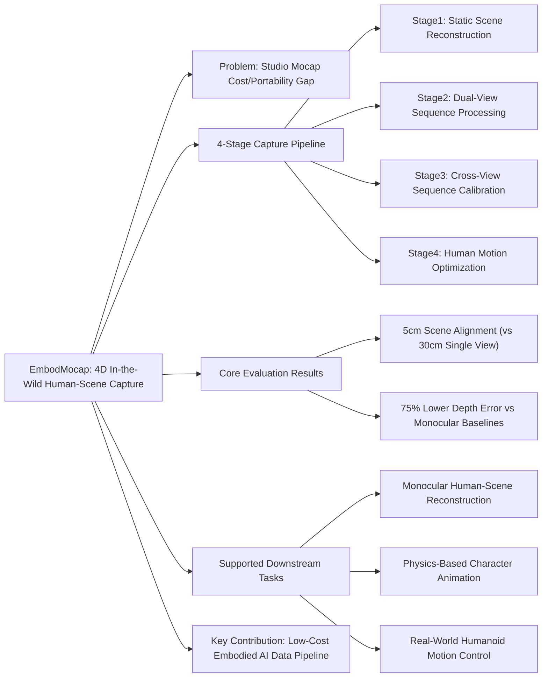

---
tags:
  - paper
  - Embodied_AI
  - Sim2Real
  - Reinforcement_Learning
  - Human_Scene_Reconstruction
  - Robot_Motion_Control
  - 2026-02-28
aliases:
  - "EmbodMocap: In-the-Wild 4D Human-Scene Reconstruction for Embodied Agents"
url: https://huggingface.co/papers/2602.23205
pdf_url: https://arxiv.org/pdf/2602.23205.pdf
local_pdf: "[[EmbodMocap IntheWild 4D HumanScene Reconstruction for Embodied Agents.pdf]]"
github: None
project_page: None
institutions:
  - The University of Hong Kong
  - Tampere University
  - The Chinese University of Hong Kong
  - Max-Planck Institute for Informatics
publication_date: 2026-02-26
score: 7
Reading?:
---

# EmbodMocap: In-the-Wild 4D Human-Scene Reconstruction for Embodied Agents

## 📌 Abstract
Human behaviors in the real world naturally encode rich, long-term contextual information that can be leveraged to train embodied agents for perception, understanding, and acting. However, existing capture systems typically rely on costly studio setups and wearable devices, limiting the large-scale collection of scene-conditioned human motion data in the wild. To address this, we propose EmbodMocap, a portable and affordable data collection pipeline using two moving iPhones. Our key idea is to jointly calibrate dual RGB-D sequences to reconstruct both humans and scenes within a unified metric world coordinate frame. The proposed method allows metric-scale and scene-consistent capture in everyday environments without static cameras or markers, bridging human motion and scene geometry seamlessly. Compared with optical capture ground truth, we demonstrate that the dual-view setting exhibits a remarkable ability to mitigate depth ambiguity, achieving superior alignment and reconstruction performance over single iphone or monocular models. Based on the collected data, we empower three embodied AI tasks: monocular human-scene-reconstruction, where we fine-tune on feedforward models that output metric-scale, world-space aligned humans and scenes; physics-based character animation, where we prove our data could be used to scale human-object interaction skills and scene-aware motion tracking; and robot motion control, where we train a humanoid robot via sim-to-real RL to replicate human motions depicted in videos. Experimental results validate the effectiveness of our pipeline and its contributions towards advancing embodied AI research.

## 🖼️ Architecture
![[EmbodMocap IntheWild 4D HumanScene Reconstruction for Embodied Agents_arch.png]]
*Figure 2. EmbodMocap: We propose an affordable dataset capture and processing system. From left to right, the four stages (Stage-I to Stage-IV) illustrate our core logic: leveraging high-quality camera matrices provided by SpectacularAI [1] and aligning sequence coordinates to the scene's world frame. For detailed explanations, please refer to Sec. 3.*

## 🧠 AI Analysis (Doubao Seed 2.0 Pro)

# 🚀 Deep Analysis Report: EmbodMocap: In-the-Wild 4D Human-Scene Reconstruction for Embodied Agents

## 📊 Academic Quality & Innovation
## 1. Core Snapshot
### Problem Statement
The key unaddressed gap is that existing 4D human-scene motion capture systems rely on expensive studio rigs, static multi-camera setups, wearable markers/sensors, or controlled environments, which prevents scalable, low-cost, in-the-wild collection of metrically consistent, scene-conditioned human motion data required for embodied AI research.
### Core Contribution
EmbodMocap is a portable, low-cost dual-iPhone 4D human-scene capture pipeline that jointly calibrates dual RGB-D sequences to reconstruct metrically aligned humans and static scenes in a unified world coordinate frame, enabling three core embodied AI downstream tasks without specialized capture hardware.
### Academic Rating
Innovation: 8/10, Rigor: 8/10. **Justification**: The work achieves high innovation by eliminating the need for dedicated mocap hardware, using only consumer mobile devices to produce high-quality 4D data for embodied AI, a largely underserved use case. Rigor is strong, supported by comprehensive ablation studies, cross-method comparison against studio-grade optical mocap ground truth, and validation across three distinct downstream task domains, though performance is limited by the operating range of consumer LiDAR sensors.

## 2. Technical Decomposition
### Methodology
The core objective is to jointly optimize for a unified metric world coordinate frame, aligned dual camera trajectories, and temporally consistent 3D human motion, with two core optimization objectives:
1.  **Calibration Loss (Stage III)**: Optimizes alignment of dual camera streams to the global scene frame:
    $$\mathcal{L}_{calib} = \lambda_{track}\mathcal{L}_{track} + \sum_v \lambda_{ch}d_{Chamfer} + \sum_v \lambda_{ba}\mathcal{L}_{ba,v}$$
    Where $\mathcal{L}_{track}$ minimizes 3D back-projected human keypoint difference between views, $d_{Chamfer}$ aligns local per-view point clouds to the pre-reconstructed global scene mesh, and $\mathcal{L}_{ba,v}$ enforces reprojection consistency for COLMAP-registered scene features.
2.  **Motion Optimization Loss (Stage IV)**: Refines human body parameters in the world frame:
    $$\mathcal{L}_{SMPLify} = \mathcal{L}_{3D} + \mathcal{L}_{smooth} + \mathcal{L}_{prior} + \mathcal{L}_{reproj}$$
    Which jointly optimizes SMPL shape $\beta \in \mathbb{R}^{10}$, per-frame pose $\boldsymbol{\theta}_t \in \mathbb{R}^{72}$, and root translation $\gamma_t \in \mathbb{R}^3$ to match triangulated 3D keypoints, while enforcing temporal smoothness and anthropometric pose prior constraints.
### Architecture
The pipeline uses a 4-stage cascaded design:
1.  **Scene Reconstruction**: A single iPhone RGB-D sequence is processed via the SpectacularAI SDK and COLMAP to build a metrically accurate Z-up static scene mesh as the fixed world coordinate reference.
2.  **Sequence Processing**: Two synchronized iPhones capture dynamic human motion, with off-the-shelf models used to extract per-frame camera poses, 2D human keypoints, SMPL parameter priors, and temporal alignment via a laser pointer cue.
3.  **Sequence Calibration**: Coarse rigid alignment of dual camera trajectories to the global scene frame via singular value decomposition (SVD), followed by joint refinement with multi-view geometric and photometric constraints with gravity-aligned rotation regularization.
4.  **Motion Optimization**: Dual-view 2D keypoints are triangulated to 3D world space, followed by SMPL parameter optimization to recover temporally consistent human motion in the unified world coordinate system.
### Aha Moment
The two most impactful engineering tricks are: 1) Pre-capturing a single static scene sequence to establish a metric world reference, eliminating the need for static calibration targets during dynamic human capture, and 2) Cascaded coarse-to-fine alignment (SVD-based rigid transform initialization, followed by z-axis rotation constrained optimization) to avoid local minima when unifying dual camera trajectories with the global scene frame.

## 3. Evidence & Metrics
### Benchmark & Baselines
Comparisons are conducted against three categories of baselines: 1) Monocular reconstruction models: GVHMR, single-view optimization variants, out-of-the-box $\pi^3$ and VIMO; 2) Motion estimation baselines for animation: monocular GVHMR, AMASS optical mocap data; 3) Gold-standard Vicon optical mocap as ground truth. The experimental design is fair: all baselines are evaluated on identical held-out data, with standardized metric calculation protocols for alignment error, reconstruction accuracy, and downstream task performance.
### Key Results
1.  Capture accuracy: The dual-view pipeline achieves 5cm scene alignment accuracy, compared to 30cm for single-view setups, with 75% lower depth error and 52% lower reprojection error than the monocular GVHMR baseline.
2.  Monocular reconstruction downstream: The fine-tuned $\pi^3$ + VIMO model achieves 1.71 root translation error (RTE) on the EMDB benchmark, a 4% improvement over out-of-the-box VIMO.
3.  Physics-based animation downstream: Data from the pipeline achieves >98% success rate on low-difficulty human-object interaction skills (Follow, Climb, Sit), within 2% of optical mocap performance, and 3x higher success rate than monocular motion estimates on high-difficulty tasks (Support).
### Ablation Study
The cross-view tracking loss $\mathcal{L}_{track}$ is the most critical component: ablating this loss increases reprojection error by 116% (from 9.3 to 20.4) and depth error by 24% (from 0.078 to 0.097), as it resolves cross-view correspondence ambiguity that causes drift in single-view capture systems.

## 4. Critical Assessment
### Hidden Limitations
1.  Capture range is constrained to 3.5m (indoor) / 5m (outdoor) by the operating range of the iPhone LiDAR sensor, failing for large open scenes.
2.  Full pipeline latency is ~10x real time, making it unsuitable for live capture use cases for embodied agents.
3.  Performance degrades heavily under full occlusions of the human in both views, or fast motion that causes significant motion blur in both RGB streams.
### Engineering Hurdles
1.  Precise temporal synchronization of dual iPhones requires custom laser cue triggering logic that is not specified in detail, creating a barrier to reproduction.
2.  The pipeline relies on multiple off-the-shelf dependent components (SpectacularAI SDK, ViTPose, SAM2, PromptDA) with version-specific behavior that can cause drift in intermediate outputs.
3.  Multi-term loss hyperparameters are highly sensitive to scene type, requiring per-scene tuning to avoid local minima during the alignment step.

## 5. Next Steps
1.  **Single-device capture extension**: Add a neural correspondence module that leverages temporal scene context to replace the second iPhone view, retaining metric alignment accuracy while reducing hardware requirements to a single mobile device. Evaluate performance on the EMDB benchmark and interaction skill tasks to validate parity with the dual-view pipeline.
2.  **Real-time inference optimization**: Replace the cascaded optimization steps with an end-to-end transformer pre-trained on large volumes of EmbodMocap data, to directly predict aligned scene and human parameters from dual RGB-D streams with <100ms latency for live embodied agent deployment.
3.  **Dynamic scene support**: Add a dynamic object segmentation and tracking module to reconstruct moving scene objects (e.g., furniture being manipulated) alongside human motion, expanding the pipeline's utility for human-object interaction tasks that involve non-static scene states.

## 🔗 Knowledge Graph & Connections
```json
{
  "publication_date": "2026-02-26",
  "institutions": ["The University of Hong Kong", "Tampere University", "The Chinese University of Hong Kong", "Max-Planck Institute for Informatics"],
  "github": "None",
  "project_page": "None"
}
```

---

### Task 1: Knowledge Connections
1.  **[[World_Action_Models_are_Zero_shot_Policies]]**: EmbodMocap directly addresses a core bottleneck for world action model research: the scarcity of metrically aligned, in-the-wild 4D human-scene interaction data required to train generalizable zero-shot policies. The pipeline's output data provides physically grounded, scene-contextualized motion demonstrations that can be used to pre-train world action models for transfer to unseen real-world environments, validating the practical utility of portable capture systems for world model development.
2.  **[[Learning_Situated_Awareness_in_the_Real_World]]**: This line of work requires situated, environment-specific human behavior data captured outside controlled studio settings to train embodied agents that understand context-dependent interaction constraints. EmbodMocap's low-cost, portable design enables scalable collection of exactly this type of data, eliminating the reliance on studio-captured datasets that lack the unstructured, in-the-wild context required for real-world situated awareness learning.
3.  **[[Physics Informed Viscous Value Representations]]**: Physics-informed motion learning frameworks require high-quality, physically consistent human-scene motion data with accurate metric alignment between body poses and scene geometry to train valid value functions. EmbodMocap's validated, physics-aligned motion data can be used to train and evaluate these viscous value representations, especially for scene-aware motion tracking tasks where physical plausibility between the human and static scene geometry is a core constraint.
4.  **[[Xiaomi-Robotics-0]]**: EmbodMocap's sim-to-real humanoid motion control pipeline is directly applicable to commercial humanoid robotics development, as demonstrated by Xiaomi's humanoid research program. The in-the-wild motion data captured by the system provides diverse, low-cost fine-tuning data to improve zero-shot motion transfer performance on physical humanoid platforms, filling the gap of non-studio motion demonstrations for real-world robot deployment.

---

### Task 2: Mermaid Knowledge Graph


---

### Task 3: Future Directions
1.  **Single-device 4D capture with neural view synthesis**: Modify the existing dual-view pipeline to operate on a single monocular RGB-D iPhone stream, by fine-tuning a spatio-temporal view synthesis model on 100+ hours of existing EmbodMocap dual-view data to generate synthetic second-view correspondence constraints. The work will target retention of 90% of the original dual-view alignment accuracy (<8cm mean scene alignment error) while reducing hardware requirements to a single consumer mobile device, with validation on the EMDB benchmark and physics-based interaction skill training to demonstrate parity with the original system.
2.  **Dynamic scene extension for interactive task capture**: Extend the static scene reconstruction module to support dynamic object tracking, adding a neural 3D instance segmentation and motion estimation step that reconstructs rigid and articulated moving scene objects (e.g., furniture, handheld tools) alongside human motion, producing full 4D human-scene-object interaction datasets. The work will evaluate the utility of this extended dataset for training task-oriented humanoid policies that require reasoning over object state changes during interaction, targeting a 20% improvement in task success rate for object manipulation tasks compared to policies trained on static-scene only data.
3.  **End-to-end pre-trained 4D reconstruction transformer**: Pre-train a 1B-parameter multi-modal transformer on 1000+ hours of EmbodMocap captured data, to directly output metric-aligned scene mesh, camera trajectories, and human SMPL parameters from uncalibrated dual RGB streams without reliance on external COLMAP registration or off-the-shelf pose estimation components. The work will benchmark inference speed and accuracy against the original cascaded pipeline, targeting end-to-end latency <100ms for live embodied agent perception use cases, and a 10x reduction in processing time compared to the current optimization-based pipeline.

---
*Analysis performed by PaperBrain-Doubao (Vision-Enabled)*


## 📂 Resources
- **Local PDF**: [[EmbodMocap IntheWild 4D HumanScene Reconstruction for Embodied Agents.pdf]]
- [Online PDF](https://arxiv.org/pdf/2602.23205.pdf)
- [ArXiv Link](https://huggingface.co/papers/2602.23205)
