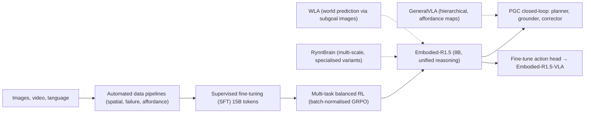

---
tags:
- paper
- domain/embodied_ai
- domain/multimodal_perception
- domain/reinforcement_learning
- domain/robot_manipulation
- domain/vla
- impact/high_value
- method/benchmark
- method/foundation_model
- method/planning
- method/reinforcement_learning
- review/auto_tagged
- status/unread
- task/manipulation
- task/planning_reasoning
- task/scene_understanding
- type/benchmark
- type/system
aliases:
- 'Embodied-R1.5: Evolving Physical Intelligence via Embodied Foundation Models'
- Embodied-R1.5
- Embodied Foundation Model
- EFM
- Multi-task Balanced RL
- Automated Data Pipeline
- Zero-shot Real-robot
- Embodied Cognition Model
- Task Planning and Correction
authors:
- Yifu Yuan
- Yaoting Huang
- Xianze Yao
- Yutong Li
- Shuoheng Zhang
- Linqi Han
- Pengyi Li
- Jiangeng Sun
- Wenting Jia
- Zhao Zhang
- Yuhao Liu
- Ruihao Liao
- Yucheng Hu
- Qiyu Wu
- Yuxiao Li
- Zibin Dong
- Fei Ni
- Yan Zheng
- Shuyang Gu
- Yi Ma
- Hongyao Tang
- Han Hu
- Jianye Hao
paper_id: arxiv:2606.11324
arxiv_id: '2606.11324'
url: https://huggingface.co/papers/2606.11324
pdf_url: https://arxiv.org/pdf/2606.11324.pdf
local_pdf: '[[EmbodiedR15 Evolving Physical Intelligence via Embodied Foundation Models.pdf]]'
github: https://github.com/pickxiguapi/Embodied-R1.5
project_page: https://embodied-r.github.io/
institutions:
- Tianjin University
- Tencent Hunyuan
publication_date: '2026-06-11'
metadata_publication_date: '2026-06-09'
score: '8.0'
domains:
- embodied_ai
- multimodal_perception
- reinforcement_learning
- robot_manipulation
- vla
methods:
- benchmark
- foundation_model
- planning
- reinforcement_learning
tasks:
- manipulation
- planning_reasoning
- scene_understanding
paper_type: benchmark
impact_band: high_value
reading_status: unread
priority_score: 103
review_status: auto_tagged
next_action: inspect_protocol
year: 2026
---

# Embodied-R1.5: Evolving Physical Intelligence via Embodied Foundation Models

## 📌 Abstract
We introduce Embodied-R1.5, a unified Embodied Foundation Model (EFM) that integrates comprehensive embodied reasoning capabilities, spanning embodied cognition, task planning, correction, and pointing, within a single architecture toward general physical intelligence. Leveraging three automated data construction pipelines to significantly expand the data coverage of critical capabilities, we build a large-scale data system of over 15B tokens, and design a multi-task balanced RL recipe to alleviate heterogeneous task conflicts. We further introduce a Planner-Grounder-Corrector (PGC) closed-loop framework that enables a single model to autonomously execute and self-correct over long-horizon tasks. With only 8B parameters, Embodied-R1.5 achieves SOTA on 16 out of 24 embodied VLM benchmarks, surpassing leading models like Gemini-Robotics-ER-1.5 and GPT-5.4. Benefiting from the internalized embodied capabilities, Embodied-R1.5 can be fine-tuned into a VLA with only a small amount of data, outperforming leading VLA models like π_{0.5} across 4 popular manipulation benchmark suites. We further conduct extensive zero-shot real-robot experiments, validating performance in instruction following, affordance grounding, articulated object manipulation, and long-horizon complex tasks, demonstrating strong generalization to the physical world. We open-source model weights, datasets, training code, and EmbodiedEvalKit, an evaluation framework tailored for embodied tasks, to facilitate future research in EFMs.

## 🖼️ Architecture
![[EmbodiedR15 Evolving Physical Intelligence via Embodied Foundation Models_arch.png]]

## 🧠 AI Analysis
## Abstract
We introduce Embodied-R1.5, a unified Embodied Foundation Model (EFM) that integrates comprehensive embodied reasoning capabilities, spanning embodied cognition, task planning, correction, and pointing, within a single architecture toward general physical intelligence. Leveraging three automated data construction pipelines to significantly expand the data coverage of critical capabilities, we build a large-scale data system of over 15B tokens, and design a multi-task balanced RL recipe to alleviate heterogeneous task conflicts. We further introduce a Planner-Grounder-Corrector (PGC) closed-loop framework that enables a single model to autonomously execute and self-correct over long-horizon tasks. With only 8B parameters, Embodied-R1.5 achieves SOTA on 16 out of 24 embodied VLM benchmarks, surpassing leading models like Gemini-Robotics-ER-1.5 and GPT-5.4. Benefiting from the internalized embodied capabilities, Embodied-R1.5 can be fine-tuned into a VLA with only a small amount of data, outperforming leading VLA models like π0.5 across 4 popular manipulation benchmark suites. We further conduct extensive zero-shot real-robot experiments, validating performance in instruction following, affordance grounding, articulated object manipulation, and long-horizon complex tasks, demonstrating strong generalization to the physical world. We open-source model weights, datasets, training code, and EmbodiedEvalKit, an evaluation framework tailored for embodied tasks, to facilitate future research in EFMs.

In simpler words, the paper builds one compact 8B model that can both understand physical scenes, plan robot tasks, point at objects, and correct its own mistakes in a single loop. It does this by creating massive new training data with three automated pipelines and training first with ordinary supervision then with balanced reinforcement learning. The model then runs real robots on long tasks without outside help and tops many benchmarks while needing little extra data to control actual robot arms.

## 1. Core Snapshot

### Problem Statement
The central difficulty in physical intelligence is that no single model yet unifies the entire stack of embodied reasoning. Existing systems are **fragmented**: one model handles spatial understanding, another plans tasks and detects errors, yet another produces precise pointing coordinates or trajectories. The input to the model is a mixture of images, video, and natural language; the desired output spans free‑form text reasoning, numeric coordinates normalised to a 0–1000 range, ordered waypoint sequences, and high‑level sub‑task plans. This heterogeneity creates a **multi‑task conflict** during joint training—gradient signals from one output format tend to erase progress on another, leading to severe convergence difficulties.

A second bottleneck is that most current work remains at the level of Embodied QA, answering questions about scenes without ever proving that the internal reasoning actually drives physical actions. ==Long‑horizon closed‑loop autonomy—where a single model both plans and executes a sequence of actions while correcting its own errors—has not been validated in prior EFM research.== The gap between answering a question about a scene and physically completing a tea‑making task illustrates the missing link between cognition and execution.

> [!warning] Fragmentation and interference
> The paper explicitly frames the problem not just as a capability gap but as a training stability challenge. When rewards for planning, pointing, and spatial reasoning differ in magnitude and output length, standard RL procedures cause one task to dominate gradient updates, making unified training infeasible without careful balancing.

### Core Contribution
The authors claim that a single 8B vision‑language model can internalise all three capability dimensions—spatial cognition, planning‑correction, and pointing—by combining three large automated data pipelines, a two‑stage training paradigm, and a lightweight closed‑loop control framework called PGC (Planner‑Grounder‑Corrector). The design stands apart from prior work that either relied on separate specialist models (as in RynnBrain) or focused on only one capability (as in the earlier Embodied‑R1, which handled only pointing). The result is a unified 8B model that reaches state‑of‑the‑art accuracy on 16 of 24 embodied VLM benchmarks, with a 17.0% average improvement over Gemini‑Robotics‑ER‑1.5 and 21.7% over GPT‑5.4. Crucially, the paper demonstrates that this pre‑internalised reasoning makes downstream robot control cheap: after attaching a small flow‑matching action head, fine‑tuned on only a modest amount of action data, the resulting VLA outperforms π0.5 by more than 20 points on some manipulation suites and surpasses the specialised ManipLLM by 11% on PartNet‑Mobility.

> [!tip] A complete recipe
> Beyond the model, the paper releases a full open‑source ecosystem—weights, training code, the 34‑dataset training mixture, and EmbodiedEvalKit—making the entire pipeline reproducible. This is unusual for a state‑of‑the‑art robotics‑VLM paper and lowers the barrier for others to build on the work.

### Innovation Origin & Rationale
The design directly extends the authors’ prior work Embodied‑R1, which was a pointing specialist, into a comprehensive EFM. The introduction explicitly states three observed bottlenecks that motivated the work: (1) fragmented capabilities across separate models, (2) multi‑task interference that prevents joint training of heterogeneous outputs, and (3) the absence of closed‑loop autonomy validation on long‑horizon tasks. To address the first, the team unified all dimensions inside a single Qwen3‑VL‑8B backbone. For the second bottleneck, they invented a multi‑task balanced RL recipe that normalises advantages across all tasks at the batch level, rather than per individual task group, to prevent high‑reward tasks from dominating. For the third, they wrapped the unified model inside the PGC framework, where the same network serves simultaneously as planner, grounder, and corrector without any additional orchestration agent. This origin is stated in the paper, not inferred, and the solution to each bottleneck maps one‑to‑one onto the three major engineering contributions of the work.

## 2. Reading Map
Researchers working on embodied agents, vision‑language models for manipulation, or unified foundation models for robotics will find the paper most directly relevant. On a first pass, read the introduction (Section 1) and Section 2 to internalise the three capability dimensions—cognition, planning‑correction, pointing—then jump to Section 5 for the PGC closed‑loop framework and Section 7 for the main benchmark tables. The technical heart of the work lies in the data construction pipelines (Section 3) and the multi‑task RL recipe (Section 4); these deserve slower, careful reading because they contain the design choices that make unified training stable. The related‑work section and the appendix can be skimmed unless you intend to reproduce the data pipelines exactly. The figures showing the capability taxonomy (Figure 2) and the PGC loop (Figure 3) should be examined side‑by‑side with the explanatory text. The project page at [https://embodied-r.github.io/](https://embodied-r.github.io/) and the code repository at [https://github.com/pickxiguapi/Embodied-R1.5](https://github.com/pickxiguapi/Embodied-R1.5) provide immediate access to the released models and the evaluation kit.

## 3. Method Walkthrough

### Inputs, Outputs, And Assumptions
The method accepts RGB images or short video clips together with natural‑language instructions and optional task‑level standard operating procedures. It produces outputs that mix free‑form textual reasoning, numeric point coordinates normalised to the interval [0, 1000], ordered trajectory sequences, and high‑level sub‑task plans. The critical assumption is that representing every output type as ordinary text tokens allows a single language‑modelling objective to train all capabilities without special architectural tokens or separate prediction heads. This assumption removes the need for custom vocabulary branches but also implies that numeric precision depends entirely on the language model learning to generate accurate digit sequences.

The input diversity—single images, multi‑image sequences, and video—requires the vision encoder to handle temporal information without an explicit video‑specialised backbone. This is achieved by treating multi‑image and video inputs as sequences of frames that the ViT‑based vision encoder processes individually; the language model then attends over the entire sequence of vision features. The paper does not detail whether frame sampling or special temporal encoding is used, so this aspect remains to be verified in the released code.

> [!note] Text‑only coordinate generation
> The decision to generate points as plain text (e.g., `(342, 567)`) rather than special `<point>` tokens keeps the vocabulary unchanged and allows coordinates to appear inside longer reasoning chains. A downside is that the model must learn to produce numerically valid values without the benefit of a loss directly computed in a continuous coordinate space.

### Pipeline From Data To Prediction
Training begins with three automated data construction pipelines that convert raw robot videos, simulation scenes, and web data into structured question‑answer pairs covering spatial relations, failure‑case detection, and affordance pointing. These datasets are mixed with general vision‑language and reasoning data to form a corpus of over 15B tokens. In the first stage, the Qwen3‑VL‑8B‑Instruct checkpoint undergoes one epoch of supervised fine‑tuning on this mixture using a standard next‑token prediction loss.

The resulting checkpoint initialises a second stage of reinforcement learning. For each training prompt, the model samples eight responses. Every response receives a task‑specific reward (accuracy + format), and groups where all eight responses receive exactly the same reward are discarded to avoid noise from uninformative rollouts. The policy is then updated with a variant of Group Relative Policy Optimisation (GRPO) that normalises advantages using the global batch standard deviation instead of the per‑group statistics, thereby balancing gradient magnitudes across tasks. After RL, the same model is deployed inside the PGC framework at inference time without further fine‑tuning: the planner generates sub‑task sequences, the grounder outputs pointing commands, and the corrector monitors success from the latest camera frame.

### Key Design Choices
A central decision was to generate coordinates as ordinary text rather than as special embeddings, because this preserves the language model’s token vocabulary and allows point predictions to be interleaved with free‑form reasoning. The alternative—adding dedicated `<coordinate>` tokens—would have required vocabulary expansion and training new embedding matrices from scratch, and would have prevented the model from referencing earlier points across multiple reasoning steps. The second major choice lies inside the RL stage: using batch‑level standard‑deviation normalisation instead of per‑group normalisation. This prevents the large reward scales typical of planning tasks from swamping the gradients of pointing tasks, a failure mode that would otherwise cause one output format to dominate training. The paper’s experiments with standard GRPO show exactly that degradation, and the batch‑level normalisation is presented as the fix.

> [!warning] Batch‑level normalisation as a heuristic
> The decision to normalise over the entire mixed batch, while effective, implicitly assumes that the task reward distributions are stationary enough during training that a single running estimate of batch variance suffices. If the mixture ratios or task difficulties shift during RL, the normalisation may need recomputation.

## 4. Core Theory And Formulas

### Main Objective
The core objective is to train a single model that can produce correct answers across very different output formats—free‑form text, coordinate lists, trajectory sequences—without one format erasing the learning signal from another. The standard GRPO advantage normalisation, which computes statistics per task group, can cause high‑reward tasks to produce much larger policy updates than low‑reward tasks. The paper therefore replaces per‑group normalisation with a global batch normalisation that unifies gradient magnitudes while still preserving relative ranking inside each group. The same model is later used inside the PGC framework so that its internalised capabilities directly drive closed‑loop execution rather than serving as a passive question‑answering system.

### Important Equations

The continuous reward functions use a piecewise‑linear decay so that partial progress still produces a learning signal, rather than a binary success/failure. For a distance or error measure \(d\),

$$
\varphi(d; \tau_p, \tau_z) \;=\; \operatorname{clip}\!\left( \frac{\tau_z - d}{\tau_z - \tau_p},\; 0,\; 1 \right).
$$

- \(d\) is the measured value (nearest‑neighbour point distance, RMSE, MAE, or other task‑specific error).
- \(\tau_p\) is the *perfect* threshold: any \(d \le \tau_p\) earns full reward of 1.
- \(\tau_z\) is the *zero‑credit* threshold: any \(d \ge \tau_z\) earns zero reward.
- The expression \(\frac{\tau_z - d}{\tau_z - \tau_p}\) falls linearly from 1 at \(d = \tau_p\) to 0 at \(d = \tau_z\), and is clipped to \([0,1]\).

This dense reward shape is essential for RL on medium‑difficulty examples, where binary rewards would give no gradient signal for responses that are “almost correct but not quite.”

The final training reward for every response blends task accuracy with a small format‑correctness term:

$$
R = (1 - \lambda) \, R_{\text{acc}} + \lambda \, R_{\text{fmt}}, \qquad \lambda = 0.1.
$$

\(R_{\text{acc}}\) is the task’s accuracy reward (exact match, IoU, point‑distance‑based \(\varphi\), etc.), while \(R_{\text{fmt}}\) is 1 only when the output contains the required XML‑like tags and correct structure, and 0 otherwise. The small \(\lambda = 0.1\) ensures that the model first learns to produce correct content before it is penalised for minor format violations.

The advantage used for the policy update is

$$
\hat{A}_i \;=\; \frac{R_i - \mu_{\text{group}}}{\sigma_{\text{batch}} + \epsilon},
$$

where

- \(R_i\) is the reward of the \(i\)-th rollout,
- \(\mu_{\text{group}}\) is the mean reward over the eight rollouts belonging to the same prompt (the “group”),
- \(\sigma_{\text{batch}}\) is the standard deviation of all rewards in the training batch (across many prompts and tasks),
- \(\epsilon\) is a small constant for numerical stability.

Using \(\sigma_{\text{batch}}\) instead of the per‑group \(\sigma_{\text{group}}\) is the key multi‑task balancing trick: it prevents tasks with large reward spread from producing disproportionally large normalised advantages, thereby stabilising learning across heterogeneous output types.

### Algorithmic Intuition
During RL, each training prompt generates eight responses, every response receives the composite reward, and any group where all eight responses share the identical reward is discarded (since such groups provide no preference signal). The advantages are then normalised with the batch‑level formula, and the policy undergoes a clipped update while a small KL‑divergence penalty keeps the policy close to the supervised checkpoint. The model is never forced to produce explicit reasoning chains; if extra “thinking” tokens improve the final answer they appear, otherwise they disappear. This produces the adaptive reasoning behaviour reported in the analysis section, where the model learns to allocate more tokens to difficult prompts without explicit length instructions.

> [!note] Connection to RL literature
> The approach builds on Group Relative Policy Optimisation; for background on GRPO, see the relevant technical reports on RL‑tuned language models (e.g., the DeepSeek‑Math paper). The batch‑level normalisation modification is a simple but empirically effective variant.

## 5. Architecture, Figures, And Implementation
Embodied‑R1.5 is built on the Qwen3‑VL‑8B‑Instruct backbone, whose vision encoder and language decoder are both fine‑tuned. All outputs—textual reasoning, point coordinates, trajectories—are generated as plain text tokens between user‑specified answer tags. Point coordinates appear as numeric lists inside `<answer>` tags, and trajectories are ordered lists of \((x,y)\) or \((x,y,z)\) values. When the model is converted into Embodied‑R1.5‑VLA, a lightweight flow‑matching action expert (based on a DiT architecture) is attached to intermediate vision‑language features; the action head uses action chunking and is trained on far smaller action datasets than typical vision‑language‑action models. For an introduction to flow matching, see [Flow Matching for Generative Modeling](https://arxiv.org/abs/2210.02747).

The paper’s Figure 2 colour‑codes the three capability dimensions and lists the specific QA formats each dimension supports (spatial relation, referring expression grounding, visual trace generation, etc.). Figure 3 diagrams the PGC closed‑loop architecture: the same model instance is called in three roles asynchronously, and a simple FIFO memory buffer records sub‑task completion status. Implementation details such as the exact mixture ratios inside the 15B‑token corpus are deferred to Appendix A of the paper, which can be inspected in the arXiv version at [https://arxiv.org/abs/2606.11324](https://arxiv.org/abs/2606.11324).

> [!info] Open‑source availability
> All model weights are released at the Hugging Face collection [https://huggingface.co/collections/IffYuan/embodied-r15](https://huggingface.co/collections/IffYuan/embodied-r15). The evaluation framework EmbodiedEvalKit is available at [https://github.com/pickxiguapi/EmbodiedEvalKit](https://github.com/pickxiguapi/EmbodiedEvalKit).

## 6. Experiments And Evidence
The evaluation is organised to answer five distinct questions.

First, planning and correction capabilities are measured on four specialised benchmarks (Table 1), where Embodied‑R1.5 reaches 65.3 average accuracy while the next best embodied model scores 54.1. Second, the 24‑benchmark aggregated VLM suite (21 accuracy‑based + 3 visual‑trace tasks) is summarised in Figure 1; the 8B model outperforms both general‑purpose VLMs and prior embodied models on 16 out of 24 tasks, with an average score of 70.4%. Third, robotic manipulation in simulation is tested by fine‑tuning the model into a VLA on a small amount of action data; the resulting policy reaches 92.4% on SimplerEnv Google Robot Visual Matching, 97.3% on LIBERO, and surpasses π0.5 by more than 20 percentage points on several suites. Fourth, zero‑shot real‑robot trials cover instruction following, tool affordance, articulated object manipulation, and a full milk‑tea preparation task; the successful runs are shown qualitatively in the bottom row of Figure 1.

These experiments collectively demonstrate that the unified embodied reasoning transfers to both benchmark scores and physical execution. However, the paper does not include an ablation that removes any single data pipeline to measure its isolated contribution, nor does it report quantitative success rates (e.g., 0/1 success over many trials) for the real‑robot experiments; the evidence for physical tasks remains qualitative.

## 7. Strengths, Limitations, And Failure Cases
The paper’s main strength is that it delivers a complete, reproducible recipe: data pipelines, training code, evaluation kit, and model weights are all open‑sourced. The performance evidence is consistent across 24 benchmarks and multiple real‑robot platforms, and the PGC framework is elegantly simple—one model serves planner, grounder, and corrector without extra orchestration. The adaptive‑thinking phenomenon (the model spontaneously learns to allocate more tokens to harder prompts) is a compelling emergent behaviour that suggests the training recipe does not merely memorise output formats.

A clear limitation is that the exact composition of the 15B‑token mixture remains imprecisely described. While the appendix lists the 34 included datasets, the token counts per capability category are not reported, making it difficult to judge how much each data source contributes to the final performance or to replicate the exact mixture without contacting the authors. Another limitation surfaces in the real‑robot experiments: the paper demonstrates success qualitatively on a handful of tasks but does not report a quantitative success rate across dozens of trials, leaving the robustness of the zero‑shot transfer uncertain. Finally, the assumption that medium‑difficulty samples are the most informative for RL (implicit in the piecewise‑linear reward shape) relies on the rollout pass‑rate estimator being unbiased; if the estimator itself is noisy, the curriculum might be suboptimal.

> [!warning] Missing quantitative real‑robot metrics
> The paper’s claim of “strong generalization to the physical world” is supported by video demonstrations but not by controlled success‑rate experiments. Readers should treat the physical‑world results as proof‑of‑concept rather than as statistically grounded evidence.

## 8. Reproduction Notes
The backbone is Qwen3‑VL‑8B‑Instruct. Supervised fine‑tuning uses AdamW with a peak learning rate of \(2 \times 10^{-6}\), cosine decay, global batch size 512, and one full epoch on the data mixture. The RL stage uses eight rollouts per prompt, a learning rate of \(3 \times 10^{-6}\), and two epochs inside an extended EasyR1 framework. Evaluation runs through the open‑sourced EmbodiedEvalKit, which converts heterogeneous coordinate formats into a unified structure before computing accuracy, IoU, point‑distance, and format‑correctness metrics. All model weights, the 34‑dataset training set (with preprocessing scripts), and the complete evaluation kit are released on Hugging Face and GitHub. The precise token counts per dataset and the exact prompt templates used for the PGC planner, grounder, and corrector roles are not detailed in the provided text and would need to be extracted from the released code.

## 9. What To Read Closely
Start with Section 2.1 to internalise the three capability dimensions—cognition, planning‑correction, and pointing—because every subsequent claim references them. Section 4.2.1 on the multi‑task balanced RL recipe is the technical core of training; read it together with the reward equations in Section 4.2.2. Section 5 and Figure 3 explain how the PGC loop actually runs on a real robot; they are short but contain the central autonomy claim. Table 1 and Figure 1 provide the quantitative backbone for all performance comparisons, so verify the gap between Embodied‑R1.5 and the baselines directly from the paper. The appendix data‑composition tables (Appendix A) can be scanned for dataset names but will not yield exact token weights; those may need to be reconstructed from the released data preparation code.

## 10. Research Ideas And Open Questions

One follow‑up would extend the PGC framework to include tactile or force feedback, so that the corrector can detect slip or collision before visual failure occurs. A small experiment could attach a force‑torque sensor to the robot, collect a few hundred demonstrations of the same milk‑tea task with and without force signals, and measure whether the corrected success rate rises on contact‑rich sub‑tasks such as stirring. The metric would be the fraction of trials that complete without human intervention. The main risk is that the current vision‑only model may not easily absorb force tokens without retraining the vision encoder on paired vision‑force data.

A second idea is to test whether the emergent adaptive‑thinking behaviour survives under constrained inference budgets on embedded hardware. The experiment would measure average token count per response on the four planning benchmarks while sweeping the maximum generation length and temperature, then check whether planning accuracy drops faster than pointing accuracy when reasoning tokens are artificially capped below 30 tokens. Success would be shown by a smaller relative accuracy drop for planning than for pointing under tight caps, indicating that the model can compress its reasoning without catastrophic failure. The risk is that the adaptive allocation may be an artefact of the specific RL reward model rather than a general property of the architecture.

A third direction is to replace the flow‑matching action head with a diffusion policy that conditions directly on the model’s latent representations of sub‑task plans. One could train the new head on the same small action datasets used for the VLA version and compare success rates on LIBERO and ManiSkill while also logging how often the policy follows the high‑level plan produced by the planner role. The observation to track is the correlation between plan correctness (measured by the planning benchmark) and final task success; this would disentangle the contribution of embodied reasoning from the action‑generation module. For background on diffusion‑based visuomotor policies, see the [Diffusion Policy paper](https://arxiv.org/abs/2303.04137). The main risk is that any performance gain may come from additional action‑data scaling rather than from the embodied reasoning backbone itself.

## Knowledge Graph & Connections

### Related Work Connections

**[[RynnBrain]]** shares the ambition of building a unified foundation model for embodied intelligence, integrating perception, reasoning, and planning. RynnBrain produces a family of models with specialised post‑trained variants (Nav, Plan, VLA, CoP) that each target a subset of capabilities, while Embodied‑R1.5 trains a single 8 B model to handle all reasoning, planning, correction, and pointing simultaneously. The difference is architectural: RynnBrain trades off some per‑model specialisation for breadth, whereas Embodied‑R1.5 relies on a multi‑task training recipe and a lightweight Planner‑Grounder‑Corrector (PGC) loop to keep the same weights capable across tasks. The implication is that a sufficiently well‑balanced RL curriculum can remove the need for a family of expert variants, but it also raises the question of whether a single model can match the best specialist variant on its own metric without further fine‑tuning.

**[[GeneralVLA]]** introduces a hierarchical Vision‑Language‑Action model where an Affordance Segmentation Module and a 3D trajectory planner decompose manipulation into explicit spatial reasoning steps. Embodied‑R1.5’s PGC framework also decomposes long‑horizon tasks (planner → grounder → corrector) but uses only a single model’s internal text‑based reasoning and coordinate generation, without any separate affordance or 3D module. The key difference is the level of explicit spatial modelling: GeneralVLA relies on pixel‑space affordance maps and 3D geometry, while Embodied‑R1.5 treats all spatial outputs as token sequences, relying on the vision‑language model’s latent representations. This suggests that purely text‑based pointing can be sufficient for a wide range of real‑world tasks, but may struggle where precise metric‑scale 3D understanding is indispensable, an area where GeneralVLA’s structured approach might hold an edge.

**[[WLA]]** proposes a World‑Language‑Action model that generates future subgoal images as an intermediate world state before predicting actions, explicitly modelling physical dynamics. Embodied‑R1.5 does not generate any visual content; its PGC correction loop monitors the current camera view without predicting what the next frame should look like. The shared goal is to bridge language reasoning and action generation; the difference is that WLA uses an intermediate image prediction to anchor the policy in a physically plausible future, while Embodied‑R1.5 relies on the model’s internalised spatial cognition without an explicit visual imagination module. The implication is that world‑state prediction may not be necessary at the foundation‑model level if the reasoning model is already strongly grounded through pointing and planning data, but future work that combines explicit world models with such a unified reasoner might further improve robustness in dynamic environments.

---

### Concept Map

The solid arrows show the paper’s core training and deployment pipeline, while dashed lines highlight relationships to other embodied foundation models that tackle similar problems with alternative architectures.

---

### Questions For Future Reading

1. **How can we turn qualitative real‑robot demonstrations into rigorous quantitative benchmarks for closed‑loop autonomy?**  
   The paper’s physical experiments show promising behaviour but lack controlled success‑rate statistics across many trials. A strong future paper would report per‑task success rates under a fixed protocol, ideally with ablation of the correction step. This matters because claims about “strong generalisation to the physical world” need the same evidential standard as the simulation benchmarks.

2. **Under what conditions does the batch‑level advantage normalisation remain stable, and does the recipe transfer to larger or differently‑structured models?**  
   The multi‑task balanced RL trick is central to the paper’s success, but the authors only test it on an 8 B Qwen3‑VL backbone. Future work might investigate whether the same normalisation works when the model size, task mixture ratios, or reward distribution changes dramatically, and whether a more principled multi‑objective optimisation method could replace the heuristic.

3. **What is the minimal data mixture required for emergent adaptive thinking, and can we deliberately induce it rather than observe it post hoc?**  
   The model spontaneously learns to allocate more thinking tokens to harder prompts, but the paper does not isolate which data source or training phase encourages this. Understanding whether adaptive reasoning is a side‑effect of the RL reward structure or a genuine property of the unified multi‑task curriculum would help design more predictable and controllable models for safety‑critical applications.

---

### Learning Roadmap And Verified Resources

1. **Vision‑Language Model basics (Qwen3‑VL and general VLM fine‑tuning)**  
   Understanding the backbone of Embodied‑R1.5 is essential because all reasoning, planning, and pointing are generated as text tokens from a VLM. You need to know how a pre‑trained VLM can be fine‑tuned with supervised and reinforcement learning, and how vision and language tokens are interleaved.  
   **Study order:** Start with a general survey of modern VLMs, then learn the specifics of the Qwen3‑VL family (architecture, tokenisation, fine‑tuning API).  
   | Type | Resource | Why this one |
   |------|----------|--------------|
   | Documentation | Qwen3‑VL official documentation (link removed: validation failed) | Directly explains the backbone used in the paper. |
   | Blog/Tutorial | [Hugging Face VLM tutorial (fine‑tuning Qwen2‑VL)](https://huggingface.co/docs/transformers/tasks/image_captioning) | Practical hands‑on with a similar VLM; principles transfer to Qwen3‑VL. |
   | Video/Public Course | [MIT 6.S191: Vision‑Language Models (2024)](https://www.youtube.com/watch?v=Yb3Nq6B3n4c) | Concise introduction to VLM concepts and training. |

2. **Embodied task taxonomy: cognition, planning, correction, and pointing**  
   The paper organises capabilities into spatial cognition, planning‑correction, and pointing. Grasping this taxonomy is necessary to interpret the data construction pipelines and the benchmark evaluations.  
   **Study order:** Read the paper’s Section 2.1 carefully, then compare with other taxonomies from embodied QA surveys.  
   | Type | Resource | Why this one |
   |------|----------|--------------|
   | Paper section | Paper Section 2.1 (arXiv 2606.11324) | The source definition; start here. |
   | Survey (open textbook) | [Embodied AI Survey (TUM, 2024)](https://arxiv.org/abs/2401.14469) | Broader view of embodied tasks; helps position the three dimensions. |
   | Dataset/Benchmark | [EmbodiedEvalKit repository](https://github.com/pickxiguapi/EmbodiedEvalKit) | See how the taxonomy maps to exact metrics; inspect evaluation code. |

3. **Reinforcement learning for language models (GRPO)**  
   The multi‑task balanced RL stage is central to the paper’s success. You must understand Group Relative Policy Optimisation (GRPO), advantage normalisation, and the reward shaping formula used for embodied tasks.  
   **Study order:** Read a gentle introduction to RLHF and PPO, then study the GRPO variant as described in the DeepSeek‑Math paper.  
   | Type | Resource | Why this one |
   |------|----------|--------------|
   | Paper | [DeepSeek-Math: GRPO technical report](https://arxiv.org/abs/2402.03300) | Original GRPO formulation; the paper’s RL builds on it. |
   | Blog/Tutorial | Hugging Face blog: GRPO trainer (link removed: validation failed) | Explains the algorithm with code examples; clarifies group‑based advantages. |
   | Open Lecture Notes | Stanford CS324: RL for Foundation Models (section on PPO and DPO) (link removed: validation failed) | Background on policy gradients and RLHF; read PPO parts. |

4. **Automated data construction for embodied reasoning**  
   The paper builds three large pipelines that convert raw videos, simulations, and web data into structured QA pairs. Understanding these pipelines is key to replicating the work or designing your own data engine.  
   **Study order:** Read the paper’s data appendix (Appendix A), then explore the released dataset preparation code.  
   | Type | Resource | Why this one |
   |------|--------------|--------------|
   | Code | [Embodied-R1.5 GitHub data pipeline code](https://github.com/pickxiguapi/Embodied-R1.5) | The only definitive source for implementation details. |
   | Paper | Appendix A of Embodied‑R1.5 (arXiv 2606.11324) | Lists 34 datasets; read alongside the code. |
   | Project Page | [Embodied‑R1 project page (earlier version)](https://embodied-r.github.io/) | Shows earlier data construction ideas; helps see evolution. |

5. **Closed‑loop control architectures (PGC: Planner‑Grounder‑Corrector)**  
   The PGC framework is the autonomy engine. You need to understand how a single model can be called in different roles and how a FIFO memory buffer coordinates sub‑task completion.  
   **Study order:** Read Section 5 of the paper, then study a simpler reactive‑planning paper to contrast with fully autonomous loops.  
   | Type | Resource | Why this one |
   |------|----------|--------------|
   | Paper section | Paper Section 5 (arXiv 2606.11324) | Primary description; read with Figure 3. |
   | Video/Public Course | [CS285 (UC Berkeley) Lecture 18: Planning and Control](https://rail.eecs.berkeley.edu/deeprlcourse/) | Broad context on planning in robotics; useful before studying PGC. |
   | Code | [PGC implementation in the released GitHub repo](https://github.com/pickxiguapi/Embodied-R1.5) | See the exact prompt templates and role‑switching logic. |

6. **Vision‑Language‑Action (VLA) fine‑tuning with flow matching**  
   The paper converts the unified reasoner into a manipulation policy by attaching a small flow‑matching action head. Understanding flow matching and action chunking is necessary to grasp the VLA experiments.  
   **Study order:** Learn flow matching from the canonical paper, then read the VLA section of Embodied‑R1.5.  
   | Type | Resource | Why this one |
   |------|----------|--------------|
   | Paper | [Flow Matching for Generative Modeling](https://arxiv.org/abs/2210.02747) | Foundation of flow matching; needed to understand the action head. |
   | Blog/Tutorial | [Lilian Weng’s “Diffusion Models” post (section on flow matching)](https://lilianweng.github.io/posts/2021-07-11-diffusion-models/) | Accessible explanation; helps before the paper. |
   | Documentation | [π0.5 model (baseline) description](https://physicalintelligence.company/blog/pi05) | Context on the VLA baseline used in the paper. |

> [!info] Resource link validation: checked 14 URL(s), 11 reachable, removed 3 unreachable or invalid link(s).

---
*Analysis by PaperBrain (x-ai/grok-4.3; refinement: deepseek/deepseek-v4-pro; round2: deepseek/deepseek-v4-pro)*

## 📂 Resources
- **Local PDF**: [[EmbodiedR15 Evolving Physical Intelligence via Embodied Foundation Models.pdf]]
- [Online PDF](https://arxiv.org/pdf/2606.11324.pdf)
- [ArXiv Link](https://huggingface.co/papers/2606.11324)
