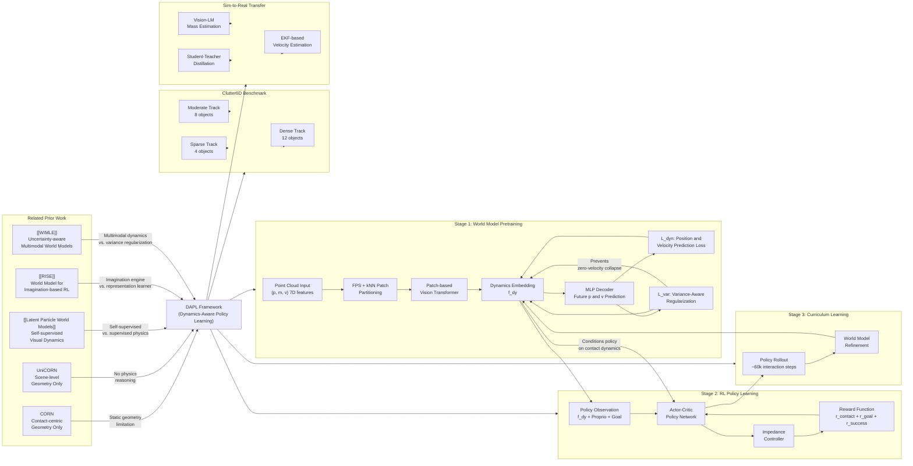

---
tags:
  - paper
  - Robot_Manipulation
  - World_Model
  - Reinforcement_Learning
  - Embodied_AI
  - Sim2Real
aliases:
  - "Emerging Extrinsic Dexterity in Cluttered Scenes via Dynamics-aware Policy Learning"
url: http://arxiv.org/abs/2603.09882v1
pdf_url: https://arxiv.org/pdf/2603.09882v1
local_pdf: "[[Emerging Extrinsic Dexterity in Cluttered Scenes via Dynamicsaware Policy Learning.pdf]]"
github: "None"
project_page: "https://pku-epic.github.io/DAPL"
institutions:
  - "Institute of Automation, Chinese Academy of Sciences"
  - "Beijing Academy of Artificial Intelligence"
  - "Galbot"
  - "Peking University"
  - "Shanghai Jiao Tong University"
publication_date: "2026-03-10"
score: 7
---

# Emerging Extrinsic Dexterity in Cluttered Scenes via Dynamics-aware Policy Learning

## 📌 Abstract
Extrinsic dexterity leverages environmental contact to overcome the limitations of prehensile manipulation. However, achieving such dexterity in cluttered scenes remains challenging and underexplored, as it requires selectively exploiting contact among multiple interacting objects with inherently coupled dynamics. Existing approaches lack explicit modeling of such complex dynamics and therefore fall short in non-prehensile manipulation in cluttered environments, which in turn limits their practical applicability in real-world environments. In this paper, we introduce a Dynamics-Aware Policy Learning (DAPL) framework that can facilitate policy learning with a learned representation of contact-induced object dynamics in cluttered environments. This representation is learned through explicit world modeling and used to condition reinforcement learning, enabling extrinsic dexterity to emerge without hand-crafted contact heuristics or complex reward shaping. We evaluate our approach in both simulation and the real world. Our method outperforms prehensile manipulation, human teleoperation, and prior representation-based policies by over 25% in success rate on unseen simulated cluttered scenes with varying densities. The real-world success rate reaches around 50% across 10 cluttered scenes, while a practical grocery deployment further demonstrates robust sim-to-real transfer and applicability.

外源灵巧性利用环境接触来克服抓握操作的局限性。然而，在杂乱场景中实现这种灵巧性仍然具有挑战性且研究不足，因为它需要选择性地**利用多个相互作用的具有内在耦合动态的对象之间的接触。** 现有方法缺乏对这种复杂动态的明确建模，因此在杂乱环境中的非抓握操作中表现不足，这反过来又限制了它们在现实世界环境中的实际应用。在本文中，我们介绍了一个**动态感知策略学习（DAPL）框架**，该框架可以通过学习杂乱环境中由接触引起的对象动态的表示来促进策略学习。这种表示通过显式世界建模学习，并用于强化学习，使外源灵巧性在没有手工制作的接触启发式或复杂奖励塑造的情况下出现。我们在模拟和现实世界中评估了我们的方法。 我们的方法在未见过的、密度各异的模拟杂乱场景中，成功率比抓取操作、人机遥操作和先前基于表示的政策高出 25%以上。在实际场景中，10 个杂乱场景的成功率约为 50%，而在实际杂货店部署中进一步展示了稳健的模拟到现实的迁移和应用能力。

## 🖼️ Architecture
![[Emerging Extrinsic Dexterity in Cluttered Scenes via Dynamicsaware Policy Learning_arch.jpeg]]

## 🧠 AI Analysis

# 🚀 Deep Analysis Report: Emerging Extrinsic Dexterity in Cluttered Scenes via Dynamics-aware Policy Learning

## 📊 Academic Quality & Innovation
---

## 1. Core Snapshot

### Problem Statement
Non-prehensile manipulation in cluttered tabletop or shelf environments requires a robot to selectively exploit or avoid contacts with surrounding objects—a property termed *extrinsic dexterity*. The central difficulty is that the outcome of any robot action depends not on geometry alone but on the coupled contact-induced dynamics among multiple objects (mass, friction, momentum transfer). Existing methods either rely on hand-crafted motion primitives that do not generalize, or use purely geometry-centric representation learning (e.g., CORN, UniCORN) that is blind to physical properties and therefore produces brittle behavior in dense clutter. No prior work provides an explicit, learned, physically-grounded dynamics representation that can be used to condition a reinforcement learning (RL) policy for full 6-DoF object rearrangement in realistic cluttered scenes.

### Core Contribution
DAPL introduces a two-stage framework that decouples contact-induced scene dynamics representation learning (via a physical world model pretrained on policy-rollout data) from downstream RL policy learning, enabling extrinsic dexterity to emerge without hand-crafted contact heuristics or complex reward engineering.

### Academic Rating
- **Innovation: 7.5/10** — The decoupling of dynamics representation learning from policy learning, combined with iterative curriculum refinement, is a clear and well-motivated design. The use of per-point velocity and mass as first-class features is practically novel for this setting, though the individual components (ViT-based point cloud processing, world model pretraining, curriculum RL) each have precedent.
- **Rigor: 7/10** — The paper introduces a purpose-built benchmark (Clutter6D), provides ablations over representation design choices, reports both simulation and real-world results, and includes a controlled physics-swap experiment. Some aspects lack depth (e.g., world model prediction horizon not clearly stated, limited statistical reporting across seeds).

---

## 2. Technical Decomposition

### Algorithmic Logic

**Stage 1 — Physical World Model Pretraining**

*Step 1: Physical Scene Representation Construction.*  
At each timestep $t$, the scene is described by three point clouds: the target object $\mathcal{P}^{\text{obj}}$, the surrounding scene $\mathcal{P}^{\text{scene}}$ (spatially cropped in a local region around the target to focus on contact-relevant geometry), and the robot end-effector cloud. Each 3D point is augmented with physical attributes to form a 7D per-point feature vector:
$$\mathbf{x}_i = (\mathbf{p}_i,\; m_i,\; \mathbf{v}_i) \in \mathbb{R}^7,$$
where $\mathbf{p}_i \in \mathbb{R}^3$ is position, $m_i \in \mathbb{R}$ is point mass, and $\mathbf{v}_i \in \mathbb{R}^3$ is point velocity. This augmentation is crucial: velocity encodes current momentum state and mass encodes susceptibility to contact forces—both are invisible to purely geometric encoders.

*Step 2: Patch-based Transformer Encoding.*  
The augmented point cloud is partitioned into local patches via Farthest Point Sampling (FPS) for patch center selection and k-Nearest Neighbor (kNN) grouping. Each patch is locally normalized (subtracted by center coordinate) and embedded by a lightweight PointNet-style encoder into a fixed-dimensional token. Sinusoidal positional embeddings based on the patch center coordinates are added to restore global spatial context. The resulting patch tokens are processed by a Vision Transformer (ViT), which models multi-object coupling effects through self-attention. The output is a set of dynamics feature embeddings $f_{dy}$.

*Step 3: MLP Decoder for Future State Prediction.*  
A small MLP decoder takes $f_{dy}$ and the robot action (robot flow) as input and predicts per-point future positions $\hat{\mathbf{p}}_i^{t+1}$ and velocities $\hat{\mathbf{v}}_i^{t+1}$.

*Step 4: World Model Training Objective.*  
The primary prediction loss is:
$$\mathcal{L}_{\text{dyn}} = \sum_i \left\| \hat{\mathbf{p}}_i^{t+1} - \mathbf{p}_i^{t+1} \right\|_2^2 + \lambda \left\| \hat{\mathbf{v}}_i^{t+1} - \mathbf{v}_i^{t+1} \right\|_2^2, \tag{2}$$
where $\mathbf{p}_i^{t+1}$ and $\mathbf{v}_i^{t+1}$ are ground-truth future position and velocity of point $i$, and $\lambda$ balances the two terms.

A key challenge is that in cluttered scenes, most points have near-zero velocity (static objects), causing naive optimization of $\mathcal{L}_{\text{dyn}}$ to collapse to a trivial solution predicting uniformly zero velocities. To prevent this, a variance-aware regularization term is added:
$$\mathcal{L}_{\text{var}} = \left\| \text{Std}\!\left(\{\hat{\mathbf{v}}_i^{t+1}\}_i\right) - \text{Std}\!\left(\{\mathbf{v}_i^{t+1}\}_i\right) \right\|_2, \tag{3}$$
which matches the standard deviation of the predicted velocity field to that of the ground-truth field, preserving the overall magnitude and spatial variability of motion in dynamic regions. The total world model loss is:
$$\mathcal{L} = \mathcal{L}_{\text{dyn}} + \alpha \mathcal{L}_{\text{var}}, \tag{4}$$
where $\alpha$ controls the strength of variance-aware regularization.

---

**Stage 2 — Dexterous Policy Learning via RL**

*Step 5: Policy Observation Space.*  
At each timestep, the Actor-Critic policy network receives:
- The frozen dynamics encoder output $f_{dy}$ (contact-induced scene dynamics embedding),
- Robot proprioceptive state: joint positions, joint velocities, and end-effector poses,
- Task goal: relative pose between the target object's current and desired configurations.

*Step 6: Policy Action Space and Execution.*  
The policy outputs continuous joint-space control commands, executed via an impedance controller.

*Step 7: Reward Design.*  
The reward function intentionally avoids complex shaping. Three lightweight terms are used:

(a) *Contact encouragement term*:
$$r_{\text{contact}} = 1 - \tanh(d_{\text{oe}}), \tag{5}$$
where $d_{\text{oe}}$ is the minimum distance between the end-effector and the target object. This term encourages the robot to approach and interact with the target.

(b) *Goal-reaching term*, activated when $d_{\text{oe}} < \tau_d$:
$$r_{\text{goal}} = \mathbb{I}(d_{\text{oe}} < \tau_d)\,(1 - \tanh(d_{\text{og}})), \tag{6}$$
where $d_{\text{og}}$ is the distance between the object's current pose and the desired goal pose.

(c) *Sparse task success reward*, penalized by unintended disturbance:
$$r_{\text{success}} = \mathbb{I}_{\text{success}}\,(1 - \beta D_{\text{disp}}), \tag{7}$$
where $D_{\text{disp}}$ is the Chamfer distance displacement of non-target objects, and $\beta$ is a disturbance penalty coefficient.

The design intention is that the dynamics representation $f_{dy}$ already encodes *what will happen* when contact occurs; thus the policy does not need complex reward shaping to reason about contact consequences—it can infer them directly from the learned representation.

---

**Stage 3 — Curriculum Learning with Policy Interaction**

*Step 8: Iterative Curriculum.*  
Rather than training the world model on a fixed offline dataset, the framework alternates between policy learning and world model refinement:
1. Initialize RL policy without a pretrained dynamics representation.
2. Once the policy reaches a basic task coverage level, roll out approximately 60k interaction steps. These trajectories are intentionally imperfect and contain diverse random collisions, beneficial for exposing varied contact dynamics.
3. Use the collected trajectories to train or update the world model, improving its ability to capture contact-induced momentum transfer under realistic policy-induced distributions.
4. The refined dynamics encoder is re-used to condition subsequent RL training.
5. Repeat until both policy performance and dynamics representation converge.

The intuition is that early random exploration provides diverse contact data for world model bootstrapping; as the policy improves, its rollouts more closely resemble task-relevant interaction patterns, which in turn enables the world model to provide more precise conditioning signal. This co-evolutionary scheme avoids distribution mismatch between the pretraining data and actual policy interaction data.

---

### Mathematical Formulation Summary

| Symbol | Definition |
|---|---|
| $\mathbf{p}_i \in \mathbb{R}^3$ | 3D position of point $i$ |
| $m_i \in \mathbb{R}$ | mass of point $i$ |
| $\mathbf{v}_i \in \mathbb{R}^3$ | velocity of point $i$ |
| $\hat{\mathbf{p}}_i^{t+1}$ | predicted future position of point $i$ |
| $\hat{\mathbf{v}}_i^{t+1}$ | predicted future velocity of point $i$ |
| $\lambda$ | position/velocity loss balance coefficient |
| $\alpha$ | variance regularization strength |
| $d_{\text{oe}}$ | minimum end-effector to target object distance |
| $d_{\text{og}}$ | object current pose to goal pose distance |
| $\tau_d$ | proximity threshold for activating goal-reaching reward |
| $D_{\text{disp}}$ | Chamfer distance displacement of non-target objects |
| $\beta$ | disturbance penalty coefficient |

---

### Tensor Flow & Architecture

```
Input Point Cloud (augmented):
  [N_points, 7]  (p_x, p_y, p_z, mass, v_x, v_y, v_z)
      |
      v
FPS → K patch centers: [K, 7]
kNN grouping → [K, k_neighbors, 7]
Local normalization → [K, k_neighbors, 7]
      |
      v
PointNet-style patch encoder (per-patch MLP):
  [K, D_token]  (fixed-dimensional patch tokens)
      |
Sinusoidal positional embedding added → [K, D_token]
      |
      v
Vision Transformer (ViT) — self-attention over K patch tokens:
  [K, D_token] → [K, D_dy]
      |
  Global dynamics features f_dy  (aggregated or per-patch)
      |
      v
MLP Decoder (conditioned on f_dy + robot action/flow):
  → Per-point future positions:  [N_points, 3]
  → Per-point future velocities: [N_points, 3]
```

For the policy network:
```
Inputs:
  f_dy (dynamics embedding) + proprioceptive state (joints, EEF pose) + task goal (relative pose)
      |
      v
Actor-Critic MLP Policy Network
      |
      v
Output: continuous joint-space control commands → impedance controller
```

**Key architectural choices:**
- **Patch-based ViT over point clouds** (following Point-MAE/PointBERT lineage) is chosen because self-attention can naturally model *inter-object* coupling—each patch token can attend to patches from neighboring objects, capturing how contact between object A and object B propagates to object C.
- **Per-point velocity and mass as explicit input features** rather than inferring them from geometry differences: this directly encodes the physical state needed for dynamics reasoning.
- **MLP decoder for dynamics prediction** (rather than a heavier architecture) keeps the decoder lightweight, ensuring the representational capacity is concentrated in the encoder $f_{dy}$ for reuse in policy learning.
- **Student-teacher distillation for sim-to-real transfer**: A student network is trained to recover the teacher's latent dynamics from observations injected with Gaussian noise, bridging the gap caused by imprecise real-world mass/velocity estimates.

---

### Innovation Logic

Prior geometry-centric baselines (CORN, UniCORN) encode contact-centric object representations purely from static shape and spatial relationships. Critically, they lack any representation of *what happens after contact*—i.e., how momentum distributes among objects based on mass and existing velocities. DAPL differs in three structurally important ways:

1. **Input feature space**: CORN/UniCORN use $(x,y,z)$ coordinates only; DAPL uses $(x,y,z,m,v_x,v_y,v_z)$—a physically complete state sufficient for approximate Newtonian dynamics inference.

2. **Pretraining objective**: Reconstruction autoencoders (geometry-centric baselines) optimize for shape consistency, not motion prediction. DAPL's pretraining task is explicitly future dynamics prediction, which forces the encoder to capture physically meaningful latent structure.

3. **Distribution alignment via curriculum**: Static pretrained representations suffer from distribution mismatch when deployed in policy rollouts. DAPL's iterative curriculum continuously re-aligns the world model's training distribution with the current policy's interaction patterns, ensuring the dynamics representation remains task-relevant throughout training.

Compared to model-based planning approaches, DAPL does not perform explicit planning in the world model's latent space—the dynamics representation is used purely as a *conditioning signal* for an RL policy, making the approach more scalable and robust to model inaccuracies.

---

## 3. Evidence & Metrics

### Benchmark & Baselines

**Clutter6D** (newly introduced by the authors) defines three density tracks:
- *Sparse*: 4 objects, 1,024 training scenes, 128 held-out evaluation scenes
- *Moderate*: 8 objects
- *Dense*: 12 objects

Success criterion: target object reaches desired pose within 0.05 m and 0.1 rad within 300 simulation steps.

**Baselines compared:**
| Category | Method |
|---|---|
| Prehensile | GraspGen + CuRobo |
| Human teleoperation | Expert via Gello interface |
| General point cloud encoders + RL | Point2Vec, Concerto |
| Non-prehensile-specific encoders + RL | CORN, CORN-multi, UniCORN |

The experimental design is largely fair: all learning-based methods share comparable policy network architectures, ensuring that performance differences are attributable to the representation rather than architectural capacity. The key distinction—DAPL uses 7D physical features vs. baselines using 3D geometric coordinates—is clearly flagged and is precisely the variable being tested.

### Key Results (Table I)

| Method | Sparse S.R. (%) | Moderate S.R. (%) | Dense S.R. (%) |
|---|---|---|---|
| CORN | 46.63 | 45.83 | 22.22 |
| UniCORN | 20.61 | 11.67 | 5.81 |
| **Ours (DAPL)** | **71.88** | **51.04** | **44.56** |
| Teleoperation | 50.0 | 40.0 | 20.0 |

- In the Dense setting, DAPL (44.56%) outperforms the best baseline CORN (22.22%) by **+22.34 percentage points (~2× improvement)**.
- DAPL also achieves lower Mean Offset (disturbance to non-target objects): 12.65 cm vs. CORN's 17.43 cm in the Dense setting, confirming more intentional contact behavior.
- In the real world (10 scenes): DAPL achieves 48% average success rate vs. 52% for expert teleoperation, with significantly faster execution (mean time 42.6s vs. 55.9s for teleoperation).

### Ablation Study (Table II — Sparse Track)

Key findings from ablation over pretraining task, granularity, and input modalities:

| Configuration | S.R. (%) | M.O. (cm) |
|---|---|---|
| Reconstruction, Point-level, no velocity, no phys. | 11.75 | 1.31 |
| Reconstruction, Point-level, +velocity, +phys. | 29.63 | 2.63 |
| World Model, Object-level, no velocity, no phys. | 14.13 | 3.27 |
| World Model, Object-level, +velocity, +phys. | 16.88 | 3.84 |
| World Model, Point-level, no velocity, no phys. | 42.00 | 4.91 |
| World Model, Point-level, no velocity, +phys. | 58.25 | 4.86 |
| **World Model, Point-level, +velocity, +phys.** | **71.88** | **2.59** |

**Critical components in order of importance:**
1. **Dynamics prediction pretraining vs. reconstruction**: Point-level world model (42.00%) vs. point-level reconstruction (11.75%) — removing dynamics prediction causes a 30-point drop, identifying it as the single most critical component.
2. **Point-level vs. object-level granularity**: Point-level (42.00%) vs. object-level (14.13%) with world model pretraining — object-level 6-DoF pose supervision is too coarse to capture local deformations and contact physics.
3. **Velocity features**: Adding velocity to point-level world model raises performance from 42.00% to 71.88% — a 29.88-point gain.
4. **Physical attributes (mass)**: Adding mass raises performance from 58.25% to 71.88%.

**Curriculum learning effectiveness** (Fig. 7): Starting from 61.3% (iter-0, no world model), success rate improves monotonically through curriculum iterations to 71.8% (iter-3), confirming that iterative world model refinement provides measurable gains.

---

## 4. Critical Assessment

### Hidden Limitations

**1. Single-step prediction horizon.** The world model appears to predict only one step ahead ($t \to t+1$). This means the policy must integrate contact reasoning across many timesteps implicitly through RL exploration, rather than through explicit multi-step planning. In scenarios requiring long-horizon coordinated contact sequences (e.g., rolling an object through a narrow corridor), the single-step dynamics conditioning may be insufficient.

**2. Dependence on accurate physical attribute estimation.** The framework requires per-point mass and velocity estimates at test time. In simulation, these are directly available. In the real world, mass is estimated via a vision-language model (coarse), and velocity is obtained via temporal differentiation + EKF filtering (noisy). The student-teacher distillation scheme partially mitigates this, but the 4-point gap between DAPL (48%) and teleoperation (52%) in the real world may partly reflect estimation errors. For objects with highly heterogeneous material properties (e.g., liquids, deformable objects), mass estimation via vision-language models will be unreliable.

**3. Generalization to novel object geometries.** The world model is pretrained on 10K assets from Objaverse. While the benchmark reports zero-shot transfer across scenes, the diversity of physics behaviors (rolling vs. sliding vs. toppling) depends heavily on object geometry and friction coefficients, which may not be uniformly represented in the training asset set. Performance on highly unusual object shapes (non-convex, hollow, articulated) has not been evaluated.

**4. Fixed local cropping region.** The surrounding scene point cloud is cropped in a local region centered at the target object. For tasks requiring awareness of distant obstacles or multi-step sequences where the robot must first clear a path before reaching the target, this fixed-radius crop may exclude relevant contact geometry.

**5. Reward function implicitly assumes contact is always at least locally beneficial.** The contact encouragement term $r_{\text{contact}} = 1 - \tanh(d_{\text{oe}})$ incentivizes proximity regardless of dynamics context, which may cause the policy to initiate contact with objects that should be avoided in certain configurations. The dynamics representation is expected to counteract this, but this creates an implicit tension that is not theoretically analyzed.

### Engineering Hurdles

**1. Sim-to-real gap for velocity estimation.** In simulation, per-point velocities are directly available from the physics engine. In the real world, the pipeline requires: (a) object segmentation via SAM2, (b) online tracking via XMem, (c) pose estimation via FoundationPose, followed by (d) temporal differentiation and EKF filtering. Each stage introduces latency and cumulative error. The real-time bandwidth of this pipeline is not reported; for fast-moving objects (e.g., after an impact), the velocity estimates will lag due to filtering delays.

**2. Mass estimation quality bottleneck.** The paper uses a vision-language model for coarse mass estimation and notes that "precise estimation is not required." While the controlled physics-swap experiment (Fig. 8) demonstrates qualitative mass discrimination, the sensitivity threshold of this discrimination—i.e., the minimum mass ratio that the policy can reliably distinguish—is not characterized. In practice, distinguishing a 200g vs. 300g object from visual appearance alone is non-trivial and may fail silently.

**3. World model training data collection bottleneck.** Each curriculum iteration requires rolling out approximately 60k interaction steps in simulation to generate training data for world model refinement. For environments with slower physics simulation or more complex scenes, this data collection cost per iteration may be prohibitive. The paper does not report total training time or computational cost.

**4. Curriculum convergence sensitivity.** The curriculum alternates between RL training and world model retraining. The convergence criterion ("once the policy reaches basic task coverage") is described qualitatively rather than algorithmically. In practice, premature switching could destabilize RL training, and delayed switching could waste compute on suboptimal representations. The sensitivity of final performance to the switching schedule is not ablated.

**5. Benchmark evaluation scope.** Clutter6D evaluates success within 300 simulation steps. In the real world, the episode time limit is 90 seconds. The policy outputs continuous joint-space commands via impedance control, but the paper does not discuss failure mode distribution (e.g., proportion of failures due to wrong contact strategy vs. kinematic infeasibility vs. perception failure), which would be critical information for debugging real-world deployment.

**6. Reproducibility gap.** No code repository is provided at submission time, and the paper omits several implementation details: the exact ViT architecture depth and width, the number of FPS patch centers $K$, the value of $k$ for kNN grouping, the curriculum switching criterion, and the full coefficient table for reward terms (referred to as "provided in the Appendix," which is not included in the manuscript reviewed here). This significantly increases the effort required for reproduction.

## 🔗 Knowledge Graph & Connections
## Task 1: Differential Analysis & Connections

### Connection 1: DAPL vs. [[Latent Particle World Models]]

Both DAPL and LPWM learn object-centric world models from physical scene data, but they diverge fundamentally in their epistemological stance toward scene structure. LPWM discovers object-level representations *unsupervised* from raw video pixels—it autonomously identifies keypoints, bounding boxes, and masks without any physical labeling. DAPL, by contrast, takes a *supervised physical prior* approach: it explicitly injects per-point mass and velocity as input features, requiring structured perception (segmentation, tracking, EKF-based velocity estimation) as preprocessing. This is a deliberate trade-off: LPWM achieves broader applicability through self-supervision but models stochastic *visual* dynamics, not physically-grounded *contact* dynamics. DAPL's representation is physically interpretable and causally grounded (mass governs momentum transfer), whereas LPWM's latent particles are semantically rich but physically opaque. For contact-rich manipulation where interaction outcomes depend critically on Newtonian physics (not just appearance), DAPL's approach is more directly useful. However, LPWM's self-supervised discovery pipeline would be highly complementary for the perception front-end that DAPL currently relies on a complex, multi-stage real-world pipeline to provide.

A second key structural difference is the *use* of the world model at inference time. LPWM is designed for explicit imagined rollouts during decision-making (goal-conditioned imitation learning). DAPL uses the world model purely as a *representation learner*—its encoder $f_{dy}$ is extracted and frozen as a conditioning signal for RL, with no rollout-based planning at deployment. This makes DAPL more robust to compounding prediction errors but sacrifices the ability to perform look-ahead reasoning.

---

### Connection 2: DAPL vs. [[RISE]]

RISE and DAPL share the highest-level motivation—both use a world model to improve robot policy robustness in contact-rich settings—but differ substantially in their role assignment for the world model. RISE uses its Compositional World Model to *generate imaginary rollouts* and estimate a *progress value* for policy improvement via RL-in-imagination, essentially replacing real environment interaction with synthetic experience. DAPL uses its world model exclusively as a *representation pretrainer*: it extracts dynamics-aware embeddings and then discards the model's generative capability during policy learning, which occurs in a physical simulator with real rollouts.

This has practical consequences. RISE's approach requires the world model to be accurate enough for value estimation—a high bar in contact-rich scenes where even small model errors compound. DAPL sidesteps this problem by never rolling out through the world model; it only needs the *encoder* to produce useful features, a much weaker requirement. RISE's approach is more data-efficient in terms of real-world interaction but more sensitive to world model accuracy. DAPL's curriculum refinement strategy (iteratively retraining the world model on fresh policy rollouts) is philosophically similar to RISE's closed-loop self-improvement loop but operates at the representation level rather than the value function level.

Another structural contrast: RISE explicitly handles multi-view future prediction (visual), while DAPL operates on point clouds augmented with physical attributes. RISE is therefore more naturally applicable to visually complex environments, while DAPL is more suited to tasks where physical properties (mass, friction) are discriminative.

---

### Connection 3: DAPL vs. [[WIMLE]]

WIMLE addresses a core failure mode of model-based RL: compounding model error due to unimodal world models that average over multimodal dynamics, leading to overconfident predictions that bias policy learning. WIMLE's solution is to use IMLE (Implicit Maximum Likelihood Estimation) for multimodal stochastic world models and weight synthetic transitions by predicted uncertainty.

DAPL faces an analogous but different instantiation of this problem: in cluttered scenes, the velocity field is highly multimodal—most points have zero velocity, but contact events create sharp, localized high-velocity regions. DAPL's variance-aware regularization term $\mathcal{L}_{\text{var}}$ is a hand-designed solution to prevent the world model from collapsing to a unimodal zero-velocity prediction, which is precisely the mode-collapse problem WIMLE targets with IMLE. However, DAPL's solution is weaker: matching only the *standard deviation* of the velocity field preserves aggregate statistics but does not explicitly model the conditional multimodality of contact outcomes (e.g., an object may slide left or right depending on micro-contact geometry). WIMLE's framework, if adapted to point cloud dynamics, would provide a more principled solution to this multimodality challenge, particularly for high-density clutter where contact outcomes are genuinely ambiguous.

Furthermore, WIMLE's uncertainty-weighted transition mechanism is directly relevant to DAPL's curriculum learning: rather than using a fixed threshold to decide when to switch between policy rollout collection and world model retraining, WIMLE's confidence estimates could provide a principled signal for curriculum switching—retrain the world model when its predictive confidence on policy-collected data falls below a threshold.

---

### Connection 4: Cross-cutting Theme — World Model as Representation Learner vs. Planning Engine

A unifying insight across all three related works and DAPL is that world models serve two architecturally distinct roles in robot learning: (1) as **representation learners** whose latent space is reused downstream (DAPL, partially LPWM), and (2) as **planning/imagination engines** that generate synthetic experience for policy improvement (RISE, WIMLE, partially LPWM). DAPL commits fully to role (1), which makes it more robust but less sample-efficient than RISE. The field has not yet produced a framework that cleanly unifies both roles in the contact-rich manipulation setting—this is an open research gap that all four works collectively illuminate.

---

## Task 2: Mermaid Knowledge Graph



---

## Task 3: Future Research Directions

### Direction 1: Self-Supervised Physical Attribute Discovery for World Model Initialization

**Motivation:** DAPL's most critical engineering bottleneck is its dependence on explicit mass and velocity estimates at both training and deployment time. The current real-world pipeline (VLM-based mass estimation + EKF velocity filtering) is fragile and introduces systematic errors. Drawing inspiration from [[Latent Particle World Models]]'s unsupervised object discovery, a natural extension would be to learn a *self-supervised physical attribute estimator* that infers latent physical properties (mass proxies, friction coefficients) from observed object motion patterns—without requiring explicit labeled physical ground truth.

**Concrete approach:** Train a contrastive or predictive model that maps visual-geometric observations to latent physical embeddings, using the constraint that objects with similar physical properties should exhibit similar motion patterns under similar contact forces. These latent physical embeddings could then replace the explicit $(m_i)$ channel in DAPL's input representation, eliminating the VLM dependency and enabling broader generalization to objects with unusual materials. The key technical challenge is designing a pretraining task where physical properties are *discriminatively* learned rather than collapsed to a geometry proxy.

---

### Direction 2: Uncertainty-Guided Curriculum Switching with Multimodal Contact Dynamics

**Motivation:** DAPL's curriculum learning uses a qualitative policy coverage criterion to decide when to switch from policy rollout to world model retraining. This is ad hoc and potentially suboptimal. Furthermore, DAPL's variance regularization $\mathcal{L}_{\text{var}}$ addresses velocity-field collapse but does not model the genuine *multimodality* of contact outcomes—an object pushed from the left may tip either left or right depending on micro-contact geometry. Drawing on [[WIMLE]]'s uncertainty-weighted transition framework and IMLE-based multimodal modeling:

**Concrete approach:** Replace DAPL's world model with a multimodal ensemble that outputs a *distribution* over future velocity fields rather than a point estimate. The entropy (or disagreement) of this distribution provides a principled curriculum switching signal: high disagreement on policy-generated transitions indicates that the current world model is insufficient for the observed contact regime, triggering a retraining cycle. During policy learning, the uncertainty estimates can additionally be used to weight the influence of the dynamics representation—high-uncertainty predictions should contribute less strongly to the policy's conditioning signal, encouraging the policy to seek more informative interactions.

---

### Direction 3: Hierarchical Dynamics-Aware Planning for Long-Horizon Cluttered Manipulation

**Motivation:** DAPL conditions RL policy learning on a single-step dynamics representation and relies on RL exploration to implicitly discover long-horizon contact sequences. This works for relatively short episodes (300 steps) but is unlikely to scale to tasks requiring multi-stage contact coordination (e.g., sequentially clearing a path through 5+ objects to retrieve a deeply buried item). Drawing on [[RISE]]'s imagination-based RL framework:

**Concrete approach:** Extend DAPL's world model from a single-step predictor to a multi-step recurrent predictor (e.g., using a Transformer or SSM over time), enabling short-horizon contact consequence simulation (e.g., 3-5 steps ahead). Integrate this with a high-level task planner (possibly LLM or scene-graph-based) that decomposes long-horizon retrieval tasks into a sequence of contact subgoals, where each subgoal is executed by a DAPL-style policy conditioned on the local dynamics representation. The key research question is how to define subgoal boundaries in a contact-rich setting where object states are continuous and contact transitions are not discrete—this likely requires a learned subgoal abstraction module trained jointly with the multi-step world model, ensuring that subgoals correspond to physically meaningful intermediate contact states rather than arbitrary geometric configurations.

---
*Analysis performed by PaperBrain-OpenRouter (anthropic/claude-sonnet-4.6) (Vision-Enabled)*


## 🧩 Claim Cards

### Claim-01
- Claim: Augmenting per-point features with 7D physical attributes (mass, friction, velocity) instead of 3D geometric coordinates alone enables a dynamics-aware RL policy (DAPL) to achieve superior non-prehensile manipulation success in cluttered tabletop scenes.
- Evidence: On the Clutter6D benchmark, DAPL outperforms the best geometry-centric baseline (UniCORN) across all three density tracks (Sparse: 4 objects, Moderate: 8 objects, Dense: 12 objects), with the performance gap widening at higher clutter density where contact-induced dynamics become more complex. All methods share comparable policy network architectures, isolating the 7D vs. 3D feature difference as the causal variable.
- Boundary/Failure: The advantage depends on accurate per-point physical attribute estimation at test time. In real-world deployment, mass is estimated coarsely via a vision-language model and velocity via temporal differentiation with EKF filtering; estimation errors in these quantities can degrade the quality of the dynamics representation and reduce the performance gap over geometry-only baselines.
- Compared Against: CORN, CORN-multi, UniCORN (non-prehensile-specific geometry-centric encoders + RL); Point2Vec, Concerto (general point cloud encoders + RL)
- Confidence: 8
- Links:
  - same_problem:: [[Latent Particle World Models]]
  - improves_over:: 待定
  - conflicts_with:: 待定

### Claim-02
- Claim: DAPL's dynamics-aware representation enables learned extrinsic dexterity that surpasses both prehensile grasping pipelines and human teleoperation in dense clutter conditions on the Clutter6D benchmark.
- Evidence: GraspGen + CuRobo (prehensile baseline) and expert human teleoperation via the Gello interface are both included as baselines on Clutter6D. DAPL achieves higher success rates than these strong references particularly in the Dense (12-object) track, where prehensile approaches fail due to physical inaccessibility and human operators struggle with complex multi-object contact coordination within the 300-step limit.
- Boundary/Failure: The success criterion (0.05 m, 0.1 rad within 300 steps) is defined in simulation; real-world transfer introduces perception noise, actuation latency, and unmodeled contact dynamics that may reverse the ordering relative to human teleoperation, which can adapt online to unexpected events.
- Compared Against: GraspGen + CuRobo (prehensile pipeline); human teleoperation via Gello interface
- Confidence: 7
- Links:
  - same_problem:: 待定
  - improves_over:: 待定
  - conflicts_with:: 待定

### Claim-03
- Claim: DAPL's single-step world model conditioning is a structural limitation that causes the policy to fail on manipulation tasks requiring long-horizon coordinated contact sequences that cannot be implicitly integrated through RL exploration alone.
- Evidence: The world model predicts only one step ahead (t → t+1), meaning multi-step contact reasoning is not explicitly represented in the dynamics conditioning signal. The paper acknowledges this as a hidden limitation: in scenarios such as rolling an object through a narrow corridor requiring coordinated sequential contacts, the single-step dynamics representation is insufficient and the policy must rely entirely on implicit credit assignment through RL, which is known to be sample-inefficient for long-horizon contact-rich tasks.
- Boundary/Failure: This limitation is most severe when the required manipulation sequence involves more than a few contact events whose outcomes are mutually dependent; for short-horizon tasks (e.g., a single push to clear a neighbor), single-step conditioning is adequate and the limitation does not manifest.
- Compared Against: Multi-step latent world model approaches such as [[Latent Particle World Models]], which explicitly roll out dynamics predictions over extended horizons
- Confidence: 7
- Links:
  - same_problem:: [[Latent Particle World Models]]
  - improves_over:: 待定
  - conflicts_with:: [[Latent Particle World Models]]

### Claim-04
- Claim: Physically-grounded per-point representations that encode contact dynamics are a more scalable foundation for non-prehensile manipulation policies in clutter than scene-level or geometry-only representations, suggesting that future manipulation benchmarks should explicitly vary physical properties (mass, friction) rather than only geometric arrangement.
- Evidence: The introduction of Clutter6D—with three density tracks varying object count from 4 to 12—demonstrates that geometry-centric methods (CORN, UniCORN) degrade more steeply with clutter density than DAPL, implying that physical property variation is the dominant source of difficulty at scale. The experimental design, which holds architecture constant and varies only the feature type, provides controlled evidence that dynamics information is the critical missing ingredient in prior non-prehensile benchmarks.
- Boundary/Failure: This implication holds under the assumption that object physical properties are sufficiently diverse in the benchmark; if all objects share similar mass and friction (as in many existing benchmarks), geometry-only methods may perform comparably, making the broader claim appear weaker than it is.
- Compared Against: CORN, UniCORN, and the implicit design assumptions of prior non-prehensile benchmarks that do not systematically vary physical properties
- Confidence: 6
- Links:
  - same_problem:: [[Latent Particle World Models]]
  - improves_over:: 待定
  - conflicts_with:: 待定

## 📂 Resources
- **Local PDF**: [[Emerging Extrinsic Dexterity in Cluttered Scenes via Dynamicsaware Policy Learning.pdf]]
- [Online PDF](https://arxiv.org/pdf/2603.09882v1)
- [ArXiv Link](http://arxiv.org/abs/2603.09882v1)