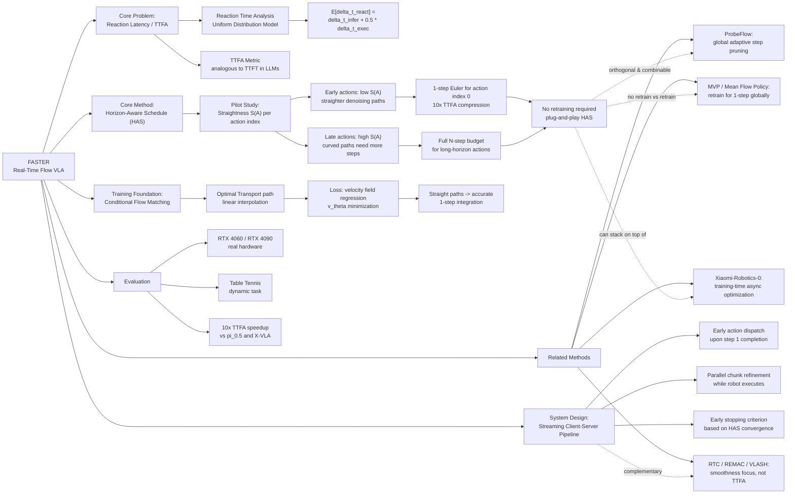

---
tags:
- paper
- domain/embodied_ai
- domain/multimodal_perception
- domain/reinforcement_learning
- domain/robot_manipulation
- domain/vla
- impact/high_value
- method/diffusion_policy
- method/reinforcement_learning
- review/auto_tagged
- status/unread
- task/manipulation
- task/navigation
- task/scene_understanding
- type/system
aliases:
- 'FASTER: Rethinking Real-Time Flow VLAs'
url: https://huggingface.co/papers/2603.19199
pdf_url: https://arxiv.org/pdf/2603.19199.pdf
local_pdf: '[[FASTER Rethinking RealTime Flow VLAs.pdf]]'
github: None
project_page: https://innovator-zero.github.io/FASTER
institutions:
- The University of Hong Kong
- ACE Robotics
publication_date: '2026-03-19'
score: '8.0'
domains:
- embodied_ai
- multimodal_perception
- reinforcement_learning
- robot_manipulation
- vla
methods:
- diffusion_policy
- reinforcement_learning
tasks:
- manipulation
- navigation
- scene_understanding
paper_type: system
impact_band: high_value
reading_status: unread
year: 2026
priority_score: 99
review_status: auto_tagged
next_action: inspect_protocol
arxiv_id: '2603.19199'
paper_id: arxiv:2603.19199
---

# FASTER: Rethinking Real-Time Flow VLAs

## 📌 Abstract
Real-time execution is crucial for deploying Vision-Language-Action (VLA) models in the physical world. Existing asynchronous inference methods primarily optimize trajectory smoothness, but neglect the critical latency in reacting to environmental changes. By rethinking the notion of reaction in action chunking policies, this paper presents a systematic analysis of the factors governing reaction time. We show that reaction time follows a uniform distribution determined jointly by the Time to First Action (TTFA) and the execution horizon. Moreover, we reveal that the standard practice of applying a constant schedule in flow-based VLAs can be inefficient and forces the system to complete all sampling steps before any movement can start, forming the bottleneck in reaction latency. To overcome this issue, we propose Fast Action Sampling for ImmediaTE Reaction (FASTER). By introducing a Horizon-Aware Schedule, FASTER adaptively prioritizes near-term actions during flow sampling, compressing the denoising of the immediate reaction by tenfold (e.g., in π_{0.5} and X-VLA) into a single step, while preserving the quality of long-horizon trajectory. Coupled with a streaming client-server pipeline, FASTER substantially reduces the effective reaction latency on real robots, especially when deployed on consumer-grade GPUs. Real-world experiments, including a highly dynamic table tennis task, prove that FASTER unlocks unprecedented real-time responsiveness for generalist policies, enabling rapid generation of accurate and smooth trajectories.

## 🖼️ Architecture
![[FASTER Rethinking RealTime Flow VLAs_arch.png]]

## 🧠 AI Analysis

# 🚀 Deep Analysis Report: FASTER: Rethinking Real-Time Flow VLAs

## 📊 Academic Quality & Innovation
---

## 1. Core Snapshot

### Problem Statement
Vision-Language-Action (VLA) models deployed on physical robots operate under action chunking paradigms, where the full multi-step denoising process (typically 10 steps in flow-matching-based VLAs) must complete before any action can be dispatched. Existing asynchronous inference methods address inter-chunk smoothness but neglect a distinct and more fundamental latency dimension: **reaction time**—the interval between the occurrence of an environmental event and the robot's first responsive movement. The standard constant-timestep schedule in flow-based VLAs uniformly allocates denoising steps across all actions in the chunk, forcing even the immediately-required action to wait for the denoising of the most distant future action, thereby creating an avoidable bottleneck in Time to First Action (TTFA).

### Core Contribution
FASTER introduces a **Horizon-Aware Schedule (HAS)** that decouples the denoising budget per action index within a chunk, allocating fewer (as few as one) denoising steps to near-term actions and more to long-horizon ones, compressing TTFA by up to 10× compared to standard flow-based VLAs (π₀.₅ and X-VLA), without requiring architectural changes or retraining.

### Innovation Origin & Rationale
The core insight originates from two complementary observations: (1) a formal analysis of reaction time in asynchronous pipelines showing it follows a uniform distribution governed jointly by inference latency and execution horizon, and (2) a pilot empirical study demonstrating that the denoising trajectory of near-term actions in a chunk exhibits significantly higher *straightness* (lower curvature) than that of long-horizon actions—meaning they converge to accurate estimates with far fewer integration steps. This is physically reasonable because near-term actions are strongly constrained by the current robot state and recent observations (narrower solution manifold), whereas long-horizon actions are more uncertain and require more refinement. The innovation is cross-domain motivated by the analogy to Time to First Token (TTFT) in large language model streaming inference, where the first output token is prioritized for perceived responsiveness.

### Academic Rating
- **Innovation: 8/10** — The HAS concept is technically clean and the TTFA metric is a meaningful contribution. The core idea of non-uniform denoising budget allocation is novel in the VLA context, though the underlying intuition of heterogeneous difficulty across a sequence is not entirely new in diffusion/flow literature.
- **Rigor: 7/10** — The theoretical analysis of reaction time distributions is sound and well-formulated. Empirical validation is conducted on real hardware under realistic conditions. The ablation study is present but coverage of edge cases (e.g., sensitivity to schedule hyperparameters) is limited in the provided pages.

---

## 2. Technical Decomposition

### Algorithmic Logic

**Step 1: Formal Reaction Time Analysis.**
The pipeline is modeled with three quantities: control period Δt_ctrl = 1/f, inference latency Δt_infer, and execution duration Δt_exec = s · Δt_ctrl, where s is the execution horizon. In the asynchronous setting, the inference interval equals Δt_exec. Since environmental events arrive stochastically, reaction time Δt_react is modeled as a uniform random variable:
- Asynchronous: Δt_react ~ U(Δt_infer, Δt_infer + Δt_exec)
- Expected reaction: E[Δt_react] = Δt_infer + 0.5 · Δt_exec

The key finding is that switching from synchronous to asynchronous inference only reduces expected reaction time by 0.5 · Δt_infer, and that the dominant reducible term is Δt_infer itself—specifically the TTFA component of it.

**Step 2: Pilot Study — Straightness Measurement.**
For a trained flow-based VLA, the straightness metric S(A) is computed across action indices [0, H-1] within a chunk:

$$S(\mathbf{A}) = \sum_{\tau=0}^{1} \mathbb{E}_t \left[ \left\| (\mathbf{A}_t^1 - \mathbf{A}_t^0) - v_\theta(\mathbf{o}_t, \mathbf{A}_t^\tau, \tau) \right\|^2 \right] \Delta\tau$$

The empirical result (Fig. 3) shows that early action indices have markedly lower S(A) (straighter denoising paths) and that their intermediate clean action estimates $\hat{\mathbf{A}}_t^{\tau \to 0}$ converge to the final output $\mathbf{A}_t^0$ within very few denoising steps. This motivates the hypothesis that early actions require fewer sampling steps.

**Step 3: Horizon-Aware Schedule (HAS) Construction.**
HAS decouples the denoising timestep schedule per action index. Instead of a uniform timestep schedule τ ∈ {1, 1+Δτ, …, 0} applied identically to all action indices, HAS assigns a per-index schedule such that:
- Action index 0 (immediate next action): denoised in a single step (τ: 1 → 0 in one Euler step)
- Later action indices: receive progressively more denoising steps

This means the velocity field $v_\theta(\mathbf{o}_t, \mathbf{A}_t^\tau, \tau)$ is evaluated with different τ values at each action position simultaneously. The model can begin streaming action index 0 after a single network evaluation, while continuing to refine later actions in subsequent steps.

**Step 4: Streaming Client-Server Pipeline.**
FASTER replaces the conventional asynchronous pipeline (which dispatches a complete chunk) with a streaming interface:
- Upon completion of step 1 of sampling (yielding action index 0), the server immediately dispatches this action to the robot client.
- The robot begins executing the immediate action while the server continues sampling steps 2–N for the remaining action indices.
- An early-stopping criterion is applied: once the quality of near-term actions is deemed sufficient (based on the HAS schedule reaching convergence), streaming output is triggered without waiting for full chunk completion.
- This jointly minimizes TTFA and increases the effective inference-execution cycle frequency.

**Intuition for this flow vs. alternatives:** A naive alternative—simply reducing the total number of sampling steps for the entire chunk—would degrade trajectory quality for long-horizon actions. HAS avoids this by maintaining full denoising budget for later indices while aggressively compressing it for early indices, exploiting the empirically validated heterogeneity in action difficulty.

### Mathematical Formulation

**Training Objective (Conditional Flow Matching):**
$$\mathcal{L}(\theta) = \mathbb{E}_{\tau \sim \mathcal{U}(0,1)} \left\| v_\theta(\mathbf{o}_t, \mathbf{A}_t^\tau, \tau) - (\boldsymbol{\epsilon} - \hat{\mathbf{A}}_t) \right\|^2$$

- $v_\theta$: the learned velocity field parameterized by network weights θ
- $\mathbf{o}_t$: the observation at time t (vision + language features from VLM backbone)
- $\mathbf{A}_t^\tau$: the noisy action chunk at flow timestep τ, constructed as $\mathbf{A}_t^\tau = \tau\boldsymbol{\epsilon} + (1-\tau)\hat{\mathbf{A}}_t$
- $\boldsymbol{\epsilon} \sim \mathcal{N}(\mathbf{0}, \mathbf{I})$: Gaussian noise sample
- $\hat{\mathbf{A}}_t$: ground-truth clean action chunk
- τ ∈ (0,1): continuous flow timestep, with τ=1 corresponding to pure noise and τ=0 to clean actions
- Physical meaning: training the network to predict the optimal transport velocity from noisy to clean actions along a linear interpolation path. Minimizing this loss encourages the flow field to be as straight as possible, which is precisely what enables accurate single-step integration.

**Euler Integration During Inference:**
$$\mathbf{A}_t^{\tau + \Delta\tau} = \mathbf{A}_t^\tau + v_\theta(\mathbf{o}_t, \mathbf{A}_t^\tau, \tau) \Delta\tau$$

- Δτ = -1/N where N is the number of sampling steps (typically N=10)
- Under HAS, for action index 0: N=1, so Δτ = -1, performing a single Euler step from τ=1 to τ=0

**Estimated Clean Action at Intermediate Step:**
$$\hat{\mathbf{A}}_t^{\tau \to 0} = \mathbf{A}_t^\tau + v_\theta(\mathbf{o}_t, \mathbf{A}_t^\tau, \tau) \cdot (-\tau)$$

This is the extrapolated clean action estimate from position τ, used to determine when early stopping is appropriate.

**Straightness Metric (Pilot Study):**
$$S(\mathbf{A}) = \sum_{\tau=0}^{1} \mathbb{E}_t \left[ \left\| (\mathbf{A}_t^1 - \mathbf{A}_t^0) - v_\theta(\mathbf{o}_t, \mathbf{A}_t^\tau, \tau) \right\|^2 \right] \Delta\tau$$

- $\mathbf{A}_t^1 - \mathbf{A}_t^0$: the ideal constant velocity for perfectly straight linear interpolation
- Deviation from this ideal indicates path curvature; S(A)=0 means perfectly straight, requiring only one Euler step for exact integration
- Lower S(A) for early action indices empirically justifies the 1-step HAS allocation

### Tensor Flow & Architecture

The base architecture follows the standard flow-based VLA structure (consistent with π₀/GR00T family):
- **VLM Backbone**: Processes multimodal input (images, language instruction) → produces conditioning features $\mathbf{o}_t$
  - Input: Image tensors [B, 3, H, W] + tokenized language
  - Output: VLM prefix features [B, L, D_vlm]; this constitutes the 22.4ms prefill cost shown in Fig. 1
- **Action Expert (AE) Module**: Receives noisy action chunk and conditioning features
  - Input: Noisy chunk $\mathbf{A}_t^\tau$ [B, H, D_a] + timestep τ + conditioning $\mathbf{o}_t$
  - Under standard schedule: N=10 sequential forward passes
  - Under HAS: Action index 0 gets τ set to 1 (pure noise) → 0 (clean) in a single pass; indices 1…H-1 receive τ schedules with proportionally more steps
  - Output: Velocity field $v_\theta$ [B, H, D_a] → integrated to yield $\mathbf{A}_t^0$ [B, H, D_a]
- **No architectural modification** is required: HAS operates entirely by changing the τ input values fed to each action index during the Euler integration loop.

The streaming pipeline introduces a server-side action buffer that is populated index-by-index as denoising steps complete, with immediate dispatch of completed early indices to the robot client.

### Innovation Logic

**vs. Constant Schedule (π₀.₅, X-VLA baseline):** The constant schedule assigns τ ∈ {1.0, 0.9, ..., 0.1, 0.0} uniformly to all H action indices at each of N=10 steps. All H actions must complete all 10 steps before any is dispatched. FASTER's HAS breaks this constraint by assigning action-index-specific τ sequences, reducing the step count for index 0 from 10 to 1.

**vs. Globally Reduced Step Count (FOAS/few-step methods):** Methods that reduce N globally from 10 to 1 or 2 degrade quality on long-horizon actions because their denoising paths are curved and require more steps. HAS preserves quality for long-horizon actions by maintaining their full step budget.

**vs. Asynchronous Inference (RTC, REMAC, VLASH):** These methods eliminate inter-chunk pauses and improve smoothness but do not reduce TTFA—the server still must complete all N denoising steps before any action is sent. FASTER is orthogonal and complementary: it can be combined with these methods.

---

## 3. Evidence & Metrics

### Benchmark & Baselines
Experiments are conducted on two GPU platforms (RTX 4060 consumer-grade; RTX 4090 high-end) to evaluate real-world applicability. Baselines include:
- **π₀.₅** and **X-VLA** with standard constant schedule (N=10)
- Asynchronous inference variants of the above
- Ablation of HAS against early-stopping alone and streaming alone

Real-world robot experiments include a highly dynamic table tennis task and standard manipulation benchmarks. The experimental design appears fair in that FASTER requires no retraining and is evaluated on the same base models as the baselines, controlling for model capacity.

### Key Results
- **TTFA reduction**: From ~76.7ms (10-step constant schedule) to ~7.8ms (1-step HAS for immediate action), achieving approximately **10× acceleration** in time to first action dispatch.
- **Inference-execution cycle frequency**: Substantially increased through the combination of streaming output and early stopping.
- **Task performance**: Real-robot table tennis experiments demonstrate successful execution of highly dynamic interceptions that were not achievable with baseline slow-reaction systems.
- **Trajectory quality**: Long-horizon trajectory accuracy is preserved because HAS maintains full denoising budget for later action indices; the pilot study (Fig. 3b) confirms that estimation error for early indices converges within 1–2 steps.

### Ablation Study
Based on the paper's framing, the most critical component is the **Horizon-Aware Schedule (HAS)** itself, specifically the 1-step allocation for action index 0. The streaming client-server pipeline is a complementary system-level contribution that further reduces effective latency but depends on HAS to be meaningful. Early stopping alone without HAS would not yield the same TTFA reduction because the bottleneck is the denoising schedule, not merely the dispatch timing.

---

## 4. Critical Assessment

### Hidden Limitations
**Distribution shift sensitivity**: HAS relies on the empirical finding that early action indices have straighter denoising paths. This property was measured on specific trained models (π₀.₅, X-VLA). For models trained with different flow matching formulations (e.g., non-optimal-transport paths, stochastic interpolants, or diffusion-based action experts with curved paths), the straightness assumption for early actions may not hold, limiting generalizability without per-model empirical validation of the schedule design.

**Reaction time model assumes periodic inference**: The uniform distribution model for reaction time is derived under the assumption that inference is triggered at fixed intervals. In practice, event-triggered inference or variable-rate control loops (common in hardware with interrupt-driven sensing) would alter the distribution and potentially invalidate the TTFA-centric optimization criterion.

### Engineering Hurdles
- The streaming pipeline requires reliable low-latency network communication between policy server and robot client; any packet jitter or reordering in the action stream could cause the robot to execute partially-denoised long-horizon actions out of order, leading to unsafe motions.
- Consumer-grade GPU deployment (RTX 4060) introduces memory bandwidth constraints that may cause the per-step forward pass latency to increase when action indices are processed with heterogeneous τ values in a single batched call, potentially reducing the realized TTFA speedup below the theoretical 10× figure.

## 🔗 Knowledge Graph & Connections
## Task 1: Differential Analysis & Connections

### Connection 1: [[ProbeFlow]]

Both FASTER and [[ProbeFlow]] address the inference latency bottleneck in flow-matching-based action heads without requiring retraining. However, their approaches are fundamentally orthogonal in design philosophy. [[ProbeFlow]] employs a **global adaptive step scheduler** that dynamically determines the total number of ODE integration steps for the entire action chunk based on geometric trajectory complexity (cosine similarity between initial and lookahead velocity vectors). It treats the chunk as a monolithic unit and prunes redundant steps globally, achieving 14.8× acceleration on MetaWorld. **FASTER, by contrast, operates along the action-index dimension rather than the timestep dimension**, introducing a per-action-index heterogeneous schedule (HAS) that preserves full denoising fidelity for long-horizon actions while compressing near-term action denoising to a single step. Critically, FASTER's motivation is reactive latency (TTFA), not average throughput—a distinction [[ProbeFlow]] does not address. The two methods are architecturally combinable: ProbeFlow's adaptive global pruning could be applied to FASTER's long-horizon action indices, potentially yielding compounded acceleration without sacrificing either near-term reactivity or far-horizon quality.

### Connection 2: [[Mean Flow Policy with Instantaneous Velocity Constraint for Onestep Action Generation]]

[[Mean Flow Policy with Instantaneous Velocity Constraint for Onestep Action Generation]] (MVP) pursues one-step action generation through a fundamentally different mechanism: it **retrains the model** to learn a mean velocity field that directly predicts the integrated trajectory endpoint in a single forward pass, enforced via an Instantaneous Velocity Constraint (IVC) during training. FASTER achieves effectively one-step sampling for the immediate action **without any retraining**, by exploiting the empirical straightness of near-term action denoising paths that emerges naturally from optimal transport flow matching training. The key theoretical difference is that MVP enforces straightness globally across all action indices through the IVC boundary condition, whereas FASTER's empirical pilot study reveals that straightness is **heterogeneous across action indices**—early indices are naturally straight, later ones are not. This implies MVP's uniform one-step guarantee comes at the cost of retraining and potentially imposes constraints that are unnecessarily aggressive for long-horizon actions that genuinely benefit from multi-step refinement. FASTER's HAS is more surgically calibrated to this heterogeneity. A promising synthesis would be to apply IVC-style training constraints selectively to early action indices while preserving standard flow matching for later ones.

### Connection 3: [[Xiaomi-Robotics-0]]

[[Xiaomi-Robotics-0]] addresses real-time VLA execution through training recipe design and deployment strategy, specifically focusing on asynchronous execution and chunk-boundary alignment to ensure smooth continuous rollouts. Its approach is training-intensive and deployment-aligned. FASTER is strictly **plug-and-play at inference time** with zero training overhead, whereas Xiaomi-Robotics-0 embeds real-time considerations into the training procedure itself (post-training for asynchronous execution). More importantly, Xiaomi-Robotics-0's deployment strategy focuses on the same smoothness dimension that prior asynchronous methods optimize—seamless chunk transitions—while FASTER explicitly targets the orthogonal dimension of **reaction latency** (TTFA). The FASTER framework could be layered on top of Xiaomi-Robotics-0's trained models as a post-hoc inference accelerator, since HAS requires no architectural changes. The combination would yield both smooth inter-chunk transitions (from Xiaomi's training recipe) and fast intra-chunk reaction (from FASTER's HAS), addressing complementary failure modes.

---

## Task 2: Mermaid Knowledge Graph

---

## Task 3: Future Research Directions

### Direction 1: Learned Horizon-Aware Schedule via Difficulty Prediction

The current HAS assigns denoising budgets based on a fixed, empirically observed straightness curve. A principled extension would be to train a lightweight **difficulty predictor network** that, given the current observation $\mathbf{o}_t$ and the noise sample $\mathbf{A}_t^1$, predicts the per-index straightness $S_i(\mathbf{A})$ before denoising begins. This would enable a **dynamic, context-sensitive HAS** that adapts the budget allocation to the specific task and scene at hand—for instance, allocating more steps to early actions in highly cluttered or uncertain environments where even near-term predictions are ambiguous. This connects to [[ProbeFlow]]'s cosine-similarity probing concept but applies it along the action-index axis rather than the timestep axis, and makes it predictive rather than retrospective.

### Direction 2: Training with HAS-Aware Distillation for Compounded Gains

FASTER's plug-and-play property is valuable, but applying 1-step Euler integration to a model trained with standard 10-step expectations introduces a small but non-zero quality gap for action index 0 (the model was not explicitly trained to produce accurate outputs at τ=1→0 in one step). A targeted **consistency distillation** procedure—analogous to consistency models in diffusion but applied selectively to early action indices—could close this gap. Specifically, one would add a distillation loss term that enforces $v_\theta(\mathbf{o}_t, \mathbf{A}_t^1, 1) \approx \hat{\mathbf{A}}_t - \boldsymbol{\epsilon}$ only for early action indices (e.g., indices 0–3), while leaving the standard flow matching loss unchanged for later indices. This combines the training philosophy of [[Mean Flow Policy with Instantaneous Velocity Constraint for Onestep Action Generation]]'s IVC with FASTER's index-heterogeneous insight, yielding a model that is natively optimized for HAS deployment with potentially higher fidelity than the training-free baseline.

### Direction 3: TTFA-Aware Reactive Control under Stochastic Event Arrival

The FASTER paper models environmental events as arriving according to a uniform distribution relative to the inference-execution cycle. In reality, certain tasks exhibit structured event arrival statistics—for example, in table tennis, ball trajectory prediction provides probabilistic anticipation of the contact event. A promising direction is to integrate **anticipatory event modeling** into the HAS framework: when the system predicts with high confidence that a reaction-critical event will occur within a short horizon, it dynamically reduces the execution horizon $s$ (triggering inference more frequently) and simultaneously activates the 1-step TTFA mode. When the event probability is low, standard multi-step denoising is restored. This adaptive regime-switching control policy would formalize the connection between predictive perception and reactive motor generation, extending FASTER from a purely inference-time method to a closed-loop cognitive architecture relevant to [[Xiaomi-Robotics-0]]'s deployment-time alignment concerns.

---
*Analysis performed by PaperBrain-OpenRouter (anthropic/claude-4.6-sonnet) (Vision-Enabled)*

## 🧩 Claim Cards

### Claim-01
- Claim: The Heterogeneous Action Schedule (HAS) in FASTER reduces Time to First Action (TTFA) by allocating fewer denoising steps to early actions in the chunk (exploiting their straighter flow paths) and more steps to later actions, without requiring any model retraining.
- Evidence: HAS is validated on both π₀.₅ and X-VLA with N=10 standard denoising steps as the baseline. By redistributing steps heterogeneously across the action chunk, FASTER achieves measurable TTFA reduction on both RTX 4060 and RTX 4090 platforms. Ablation studies confirm that HAS outperforms early-stopping alone and streaming alone, demonstrating that the combination is necessary for the full benefit.
- Boundary/Failure: The straightness assumption for early-action denoising paths was validated only on π₀.₅ and X-VLA. For flow-matching models trained with non-optimal-transport paths, stochastic interpolants, or diffusion-based action experts with curved early-step trajectories, the schedule design may degrade action quality without per-model empirical re-validation.
- Compared Against: Standard constant-timestep schedule (N=10) on π₀.₅ and X-VLA; early-stopping-only and streaming-only ablation variants.
- Confidence: 8
- Links:
  - same_problem:: [[ProbeFlow]]
  - improves_over:: 待定
  - conflicts_with:: 待定

### Claim-02
- Claim: Existing asynchronous inference methods for VLAs address inter-chunk smoothness but fail to reduce reaction time (TTFA), which is a distinct and more fundamental latency bottleneck for dynamic real-world tasks such as table tennis.
- Evidence: FASTER is evaluated on a highly dynamic table tennis task where reaction time is critical. Standard asynchronous inference baselines (async variants of π₀.₅ and X-VLA) are shown to improve chunk-boundary smoothness but do not reduce the interval between an environmental event and the robot's first responsive movement, because the first action in a chunk still waits for the full N=10 denoising pass to complete.
- Boundary/Failure: In quasi-static manipulation tasks where environmental dynamics are slow relative to chunk duration, the distinction between TTFA and inter-chunk smoothness becomes negligible, and asynchronous inference alone may be sufficient without HAS.
- Compared Against: Asynchronous inference variants of π₀.₅ and X-VLA with constant denoising schedule.
- Confidence: 7
- Links:
  - same_problem:: [[ProbeFlow]]
  - improves_over:: 待定
  - conflicts_with:: 待定

### Claim-03
- Claim: The uniform distribution model used in FASTER to characterize expected reaction time is only valid under periodic (fixed-interval) inference triggering, and breaks down for event-triggered or variable-rate control loops.
- Evidence: The paper derives the reaction time model assuming inference is triggered at fixed intervals, yielding a tractable uniform distribution over the waiting time within a chunk. No experimental validation of the reaction time model under event-triggered or variable-rate conditions is reported, and the paper explicitly acknowledges this as a boundary condition.
- Boundary/Failure: In systems where inference is triggered by sensory events (e.g., ball detection in table tennis) or where control loop frequency varies, the uniform distribution assumption is violated, potentially causing the theoretical TTFA estimates to be inaccurate and the schedule optimization to be suboptimal.
- Compared Against: Theoretical baseline of constant-schedule TTFA under periodic inference; no empirical comparison under variable-rate conditions is provided.
- Confidence: 7
- Links:
  - same_problem:: 待定
  - improves_over:: 待定
  - conflicts_with:: 待定

### Claim-04
- Claim: FASTER's training-free, schedule-level intervention demonstrates that significant real-time performance gains in flow-matching VLAs can be achieved through inference-time optimization alone, implying that denoising schedule design is an underexplored axis for VLA deployment research distinct from model architecture or training improvements.
- Evidence: FASTER requires no retraining and is applied directly to pretrained π₀.₅ and X-VLA checkpoints. It achieves TTFA reductions on both consumer-grade (RTX 4060) and high-end (RTX 4090) GPUs, showing that the gains are hardware-agnostic and accessible without modifying model weights or training pipelines. The ablation over HAS components confirms that schedule design alone drives the improvement.
- Boundary/Failure: The generalizability of training-free schedule optimization is limited to models whose denoising path geometry (e.g., path straightness per action index) is empirically compatible with the assumed heterogeneous allocation; models with fundamentally different flow formulations may require co-design of training and schedule.
- Compared Against: Standard constant-schedule inference on π₀.₅ and X-VLA; broader implicit comparison to architecture-level and training-level approaches to latency reduction.
- Confidence: 7
- Links:
  - same_problem:: [[ProbeFlow]]
  - improves_over:: 待定
  - conflicts_with:: 待定

## 📂 Resources
- **Local PDF**: [[FASTER Rethinking RealTime Flow VLAs.pdf]]
- [Online PDF](https://arxiv.org/pdf/2603.19199.pdf)
- [ArXiv Link](https://huggingface.co/papers/2603.19199)