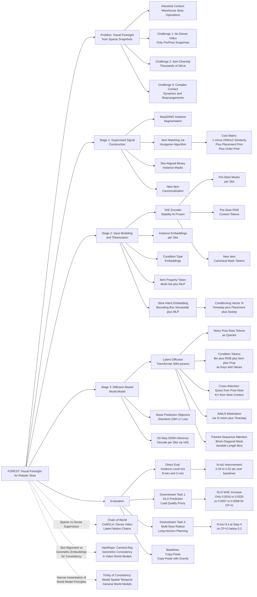

---
tags:
  - paper
  - World_Model
  - Diffusion_Model
  - Embodied_AI
  - Robot_Manipulation
aliases:
  - "Visual Foresight for Robotic Stow: A Diffusion-Based World Model from Sparse Snapshots"
url: http://arxiv.org/abs/2602.13347v1
pdf_url: https://arxiv.org/pdf/2602.13347v1
local_pdf: "[[Visual Foresight for Robotic Stow A DiffusionBased World Model from Sparse Snapshots.pdf]]"
github: "None"
project_page: "None"
institutions:
  - "Amazon, Seattle, US"
publication_date: "2026-02-12"
score: 7
---

# Visual Foresight for Robotic Stow: A Diffusion-Based World Model from Sparse Snapshots

## 📌 Abstract
Automated warehouses execute millions of stow operations, where robots place objects into storage bins. For these systems it is valuable to anticipate how a bin will look from the current observations and the planned stow behavior before real execution. We propose FOREST, a stow-intent-conditioned world model that represents bin states as item-aligned instance masks and uses a latent diffusion transformer to predict the post-stow configuration from the observed context. Our evaluation shows that FOREST substantially improves the geometric agreement between predicted and true post-stow layouts compared with heuristic baselines. We further evaluate the predicted post-stow layouts in two downstream tasks, in which replacing the real post-stow masks with FOREST predictions causes only modest performance loss in load-quality assessment and multi-stow reasoning, indicating that our model can provide useful foresight signals for warehouse planning.

## 🖼️ Architecture
![[Visual Foresight for Robotic Stow A DiffusionBased World Model from Sparse Snapshots_arch.png]]

## 🧠 AI Analysis

# 🚀 Deep Analysis Report: Visual Foresight for Robotic Stow: A Diffusion-Based World Model from Sparse Snapshots

## 📊 Academic Quality & Innovation
---

# Deep Engineering-Centric Analysis: FOREST

## 1. Core Snapshot

### Problem Statement

In large-scale automated warehouse fulfillment, robotic stow systems must place thousands of items per day into fabric storage bins. A critical operational gap exists: before physically executing a stow, there is no reliable mechanism to anticipate the resulting bin configuration. This foresight would support downstream decisions such as load-quality assessment (e.g., remaining horizontal free space) and long-horizon multi-stow planning. The problem is compounded by three structural difficulties: (1) supervision is temporally sparse—only pre- and post-stow RGB snapshots are available, with no intermediate motion trajectory data; (2) there is extreme item diversity (thousands of SKUs varying in size, shape, rigidity, and deformability); and (3) stow interactions are physically complex, as incoming items can push, slide, or topple pre-existing items in non-local and difficult-to-anticipate ways.

### Core Contribution

FOREST introduces a stow-intent-conditioned latent diffusion world model that operates exclusively on temporally sparse pre/post-stow RGB snapshots, predicting structured post-stow bin states represented as item-aligned instance masks through a slot-based bin-state tokenization and cross-attention conditioned denoising transformer.

### Academic Rating

- **Innovation: 7/10** — The problem formulation (visual foresight from snapshot pairs in a production warehouse) is genuinely novel and industrially motivated. The use of diffusion models as single-step world models over structured instance-mask representations rather than raw pixels is a principled architectural choice. However, the component-level techniques (latent diffusion, cross-attention conditioning, VAE-based tokenization) are individually standard, and the novelty lies primarily in their composition and domain-specific adaptation.

- **Rigor: 7.5/10** — The experimental design is disciplined: direct IoU evaluation, two downstream proxy tasks, ablation studies (referenced in appendices), multi-stow rollout evaluation, and fine-grained stratification by item size and stow difficulty. The use of a frozen external DLO predictor to decouple mask quality from downstream model capacity is a methodologically sound design choice. The absence of a public codebase and reliance on a proprietary dataset (ARMBench) limits independent reproducibility.

---

## 2. Technical Decomposition

### Algorithmic Logic

The FOREST pipeline consists of three sequential stages, each addressing a distinct engineering challenge.

**Stage 1: Supervised Signal Construction from Sparse Snapshots**

*Step 1.1 — Instance Mask Extraction:* Given a paired pre/post-stow RGB image, a MaskDINO-based instance segmentation model is applied independently to both frames. This yields two sets of binary instance masks: $\{m_i^{\text{pre}}\}_{i=1}^{N_{\text{pre}}}$ and $\{m_j^{\text{post}}\}_{j=1}^{N_{\text{post}}}$, where $N_{\text{post}} = N_{\text{pre}} + 1$ for successful single-item stow events.

*Step 1.2 — Item Matching (Assignment Problem):* A Hungarian algorithm is used to establish a one-to-one correspondence between pre- and post-stow instance masks. The cost matrix $C_{ij}$ is defined as:

$$C_{ij} = (1 - D_{ij}) + \lambda_{\text{pos}} \Phi_{\text{pos}}(i, j) + \lambda_{\text{ord}} \Phi_{\text{ord}}(i, j)$$

where $D_{ij}$ is the cosine similarity between DINOv2-extracted RGB patch embeddings of masks $i$ (pre) and $j$ (post); $\Phi_{\text{pos}}(i,j)$ encodes a placement prior that penalizes assignments where the new item is not near the planned insertion point; $\Phi_{\text{ord}}(i,j)$ is an order-preservation prior that penalizes left-to-right ordering changes among pre-existing items. The matched pairs define slot correspondence: each physical item occupies the same slot index before and after the stow. Slot 0 is reserved for the newly stowed item and is set to all zeros in the pre-stow state.

*Step 1.3 — New Item Canonicalization:* Rather than using the induct-view image of the incoming item (which may introduce pose ambiguity), the new item's post-stow instance mask is extracted and canonicalized: it is translated to the center of a fixed-size canvas with its principal axis aligned vertically. This canonical binary mask serves as the new-item observation $o_{\text{new}}$, providing a contact-surface-view of the item while stripping post-stow positional information that would constitute label leakage.

*Intuition:* The slot-aligned representation is the critical design choice here. It converts an unordered set-valued prediction problem (predict a set of masks) into a structured channel-wise prediction problem (predict a fixed-dimensional multi-channel binary image), which is amenable to convolutional and attention-based processing. This structure also makes item-level correspondences explicit without requiring the model to learn permutation invariance from scratch.

**Stage 2: Input Modeling and Tokenization**

*Step 2.1 — Bin State Encoding:* For each item slot $k$, the slot's binary mask (either from the pre-stow or the noisy post-stow state) is independently encoded by a frozen VAE encoder, transforming a single-channel binary spatial map into a compact latent feature map. The latent is then patchified into a sequence of tokens with 2D positional embeddings. Each token is augmented with: (i) a learnable *instance embedding* shared across all tokens of slot $k$, enabling the model to identify which item a token belongs to; and (ii) a *condition-type embedding* that distinguishes whether a token originates from a bin state (pre or post) versus another conditioning source.

*Step 2.2 — Pre-Stow RGB Tokens:* The pre-stow RGB image (beyond its instance masks) is encoded by the same VAE and patchified, providing richer visual context about bin geometry, lighting, and item texture. These tokens receive positional and condition-type embeddings.

*Step 2.3 — New Item Tokens:* The canonical new item mask is encoded and tokenized analogously to bin state tokens, with appropriate condition-type embedding.

*Step 2.4 — Item Property Token:* ARMBench provides discrete physical attributes for each item (rigid, round, square, conveyable, foldable, fragile), encoded as a multi-hot binary vector. A two-layer MLP embeds this into a single property token $c_{\text{prop}} \in \mathbb{R}^{1 \times D}$, augmented with a condition-type embedding.

*Step 2.5 — Stow Intent Embedding:* The stow intent $u = \{u_{\text{place}}, u_{\text{push}}\}$ where each component is a 4D bounding box coordinate $(x_1, y_1, x_2, y_2)$ in bin coordinate frame. Each scalar coordinate is mapped to a $d/4$-dimensional sinusoidal feature, concatenated into a $d$-dimensional vector, and processed by a two-layer MLP to yield intent embeddings $\Psi_{u_{\text{place}}}, \Psi_{u_{\text{push}}} \in \mathbb{R}^d$. The diffusion timestep $t$ is similarly embedded as $\Psi_t$. These are summed into a single conditioning vector:

$$\xi = \Psi_t + \Psi_{u_{\text{place}}} + \Psi_{u_{\text{push}}}$$

This $\xi$ is injected into every transformer block via Adaptive Layer Normalization (AdaLN), modulating scale and shift parameters as a function of $\xi$.

*Intuition for AdaLN over cross-attention for intent:* The stow intent is a compact, low-dimensional signal (bounding box coordinates). Injecting it via AdaLN as a global modulation signal avoids inflating the attention sequence length with intent tokens and prevents the attention mechanism from attending spuriously to intent tokens versus relevant spatial context. Cross-attention is reserved for the higher-dimensional structured spatial context (pre-stow bin state, new item), where spatial attention patterns are informative.

**Stage 3: Diffusion-Based World Model (Denoising)**

*Step 3.1 — Forward Process:* At training time, the ground-truth post-stow bin state latent $z_{\text{post}} \in \mathbb{R}^{[1, N_{\text{slots}}, C, h, w]}$ is patchified into tokens, then a diffusion timestep $t$ is sampled and Gaussian noise is added according to the forward diffusion schedule to yield noisy tokens $z_{\text{post}}^t$.

*Step 3.2 — Transformer Architecture:* The denoising model is a transformer operating on two token sequences at each diffusion step $t$:
- **Query tokens**: noisy post-stow latent tokens $z_{\text{post}}^t \in \mathbb{R}^{[1, N, D]}$ where $N = K \times (h/p \times w/p)$, $K$ is the number of item slots, $p$ is the patch size.
- **Key/Value tokens (condition tokens)**: concatenation of pre-stow bin state tokens ($c_{\text{bin}} \in \mathbb{R}^{[1, N_b, D]}$, $N_b = N$), pre-stow RGB tokens ($c_{\text{RGB}} \in \mathbb{R}^{[1, N/K, D]}$), new item tokens ($c_{\text{item}} \in \mathbb{R}^{[1, N_i, D]}$, $N_i = N/K$), and property token ($c_{\text{prop}} \in \mathbb{R}^{[1,1,D]}$).

Within each transformer block: (i) self-attention operates over noisy post-stow query tokens; (ii) cross-attention takes noisy post-stow tokens as queries and all condition tokens as keys/values; (iii) AdaLN modulates every block using $\xi$; (iv) a position-wise feedforward network follows.

*Step 3.3 — Variable-Length Handling:* Since the number of pre-existing items varies across stow events, the sequence length of condition tokens varies. Rather than padding all sequences to a fixed length (which wastes compute and introduces uninformative tokens), the authors use a packed-sequence attention scheme: within a mini-batch, all stow sequences are concatenated along the sequence dimension and a block-diagonal attention mask is constructed, restricting each token to attend only to tokens from the same stow event. This enables efficient batched computation without padding overhead.

*Step 3.4 — Training Objective:* FOREST follows the standard noise-prediction objective used in latent diffusion models (Rombach et al., 2022). The model $\epsilon_\theta$ is trained to predict the noise $\epsilon$ added to the post-stow latent at timestep $t$:

$$\mathcal{L} = \mathbb{E}_{z, \epsilon \sim \mathcal{N}(0,I), t} \left[ \| \epsilon - \epsilon_\theta(z_{\text{post}}^t, t, c_{\text{bin}}, c_{\text{RGB}}, c_{\text{item}}, c_{\text{prop}}, \xi) \|_2^2 \right]$$

where $z_{\text{post}}^t = \sqrt{\bar{\alpha}_t} z_{\text{post}} + \sqrt{1 - \bar{\alpha}_t} \epsilon$ is the noisy latent at timestep $t$; $\bar{\alpha}_t$ is the cumulative noise schedule coefficient; $c_{\text{bin}}, c_{\text{RGB}}, c_{\text{item}}, c_{\text{prop}}$ are the condition token sequences from Stage 2; and $\xi$ is the AdaLN conditioning vector from the stow intent and timestep.

Minimizing this objective trains the model to learn the reverse denoising process conditioned on the stow context, which at inference time is used to sample post-stow latents via iterative denoising (50 steps), which are then decoded by the VAE decoder back to binary instance mask space.

### Mathematical Formulation Summary

| Formula | Variables | Physical Meaning |
|---|---|---|
| $C_{ij} = (1-D_{ij}) + \lambda_{\text{pos}}\Phi_{\text{pos}}(i,j) + \lambda_{\text{ord}}\Phi_{\text{ord}}(i,j)$ | $D_{ij}$: DINOv2 cosine similarity; $\Phi_{\text{pos}}$: placement penalty; $\Phi_{\text{ord}}$: ordering penalty | Minimizing $C_{ij}$ finds assignments that are visually similar and physically consistent with stow intent |
| $\xi = \Psi_t + \Psi_{u_{\text{place}}} + \Psi_{u_{\text{push}}}$ | $\Psi_t$: timestep embedding; $\Psi_{u_{\text{place}}}$: placement intent embedding; $\Psi_{u_{\text{push}}}$: sweep intent embedding | Encodes both the denoising progression and the intended stow behavior into a single conditioning signal for global modulation |
| $\mathcal{L} = \mathbb{E}\[\|\epsilon - \epsilon_\theta(\cdot)\|_2^2\]$ | $\epsilon$: ground-truth noise; $\epsilon_\theta$: predicted noise from transformer | Standard LDM noise-prediction objective; minimizing it trains conditional denoising of post-stow latents |

### Tensor Flow & Architecture

```
Input: Pre-stow RGB [1, 3, H, W]
       Pre-stow instance masks [1, N_pre, H, W] (binary, slot-aligned)
       New item canonical mask [1, 1, H', W']
       Item properties [1, 6] (multi-hot)
       Stow intent [1, 8] (two bounding boxes)
       (Training only) Post-stow instance masks [1, N_slots, H, W]

Stage 2 - VAE Encoding:
  Pre-stow masks per slot: [1, H, W] → VAE Enc → [1, C, h, w] → Patchify → [1, (h/p)*(w/p), D]
  All N slots stacked: [1, N_slots*(h/p)*(w/p), D] = [1, N, D] — condition tokens c_bin
  Pre-stow RGB: [1, 3, H, W] → VAE Enc → [1, C, h, w] → Patchify → [1, N/K, D] — tokens c_RGB
  New item mask: [1, 1, H', W'] → VAE Enc → Patchify → [1, N/K, D] — tokens c_item
  Item properties: [1, 6] → MLP → [1, 1, D] — token c_prop
  Intent + timestep: → MLP → ξ ∈ R^d (scalar conditioning vector)

Stage 3 - Diffusion Transformer:
  Training: Post-stow masks [1, N_slots, H, W] → VAE Enc → Patchify → [1, N, D]
            Add noise at timestep t → noisy tokens z^t_post [1, N, D]
  
  Each Transformer Block:
    Self-Attention on z^t_post: [1, N, D] → [1, N, D]
    Cross-Attention: Q=z^t_post [1,N,D], K/V=concat(c_bin, c_RGB, c_item, c_prop) [1, N+N/K+N/K+1, D]
    AdaLN modulation with ξ: scale/shift parameters computed from ξ, applied to layer norm
    FFN: [1, N, D] → [1, N, D]
  
  Output: Predicted noise ε_θ [1, N, D] (same shape as noisy tokens)
  
  Inference: Iterative denoising (50 steps DDIM/DDPM):
    z^0_post [1, N, D] → VAE Dec per slot → [N_slots, H, W] binary masks
```

### Innovation Logic

Prior visual foresight models (Finn & Levine 2017, Ebert et al. 2018) operate on dense video sequences, predicting future pixel frames autoregressively. FOREST differs in four structural ways:

1. **Sparse supervision**: Instead of requiring dense video, FOREST is trained only on snapshot pairs, which is the only data format available at warehouse scale.

2. **Structured prediction space**: Rather than predicting raw RGB images (which requires modeling irrelevant texture and lighting variation), FOREST predicts in instance-mask space, making physical item placement geometrically explicit and measurement directly with IoU.

3. **Slot-aligned bin representation**: Unlike prior work that treats scenes as unordered sets or raw grids, the slot-based item-aligned representation provides explicit correspondence structure that enables item-level evaluation and slot-shuffled training augmentation.

4. **Intent conditioning via AdaLN vs. additional tokens**: The stow intent is injected globally via AdaLN rather than as attention tokens. This separates the role of spatial structured context (handled by cross-attention) from the role of high-level action intent (handled by global modulation), which is conceptually cleaner and computationally efficient.

---

## 3. Evidence & Metrics

### Benchmarks & Baselines

All experiments are conducted on ARMBench, a proprietary large-scale real production dataset. No public benchmark is used, which limits external comparability. Two heuristic baselines are compared:

- **Copy-Paste (CP)**: Places the new item's canonical mask at the planned insertion position in the pre-stow layout without modeling interactions with existing items.
- **Copy-Paste with Gravity (CP+G)**: Extends CP by applying a vertical settling step that drops the pasted item downward until it contacts the bin floor or existing items, approximating rigid-body settling.

The experimental design is fair in the sense that all methods receive identical inputs (pre-stow bin state, new item mask, stow intent) and are evaluated against identical ground-truth post-stow masks. The absence of any learning-based baseline (other than FOREST variants) is a limitation, though the authors justify this by claiming FOREST is the first learned world model for this problem, which is plausible given the domain specificity.

Three FOREST variants are evaluated: **FOREST-DI** (trained on direct insert only), **FOREST-SI** (trained on sweep insert only), and **FOREST-J** (trained jointly on both modes, conditioned on stow intent via AdaLN).

### Key Results

**Direct Evaluation (IoU on predicted post-stow instance masks):**

| Setting | Metric | Copy-Paste | CP+Gravity | FOREST-DI/SI | FOREST-J |
|---|---|---|---|---|---|
| Direct Insert | N-IoU (new item) | 0.2846 | 0.3632 | 0.7017 | 0.7021 |
| Direct Insert | O-IoU (pre-existing) | 0.8563 | 0.8563 | 0.8550 | 0.8536 |
| Sweep Insert | N-IoU (new item) | 0.1214 | 0.2167 | 0.6166 | **0.6422** |
| Sweep Insert | O-IoU (pre-existing) | 0.5287 | 0.5287 | 0.6878 | 0.6906 |

FOREST improves N-IoU by approximately **0.34–0.44 absolute points** over copy-paste on direct insert, and by **0.42–0.52 absolute points** on sweep insert. For small items (intrinsically hard), FOREST achieves N-IoU above 0.5 compared to baselines near 0.1. For "surprising" stow events (where copy-paste N-IoU ≈ 0, indicating the item ended up far from the intended position), FOREST achieves N-IoU 0.56–0.61 for sweep insert.

**Downstream DLO Prediction:**

Using ground-truth post-stow masks: MAE = 0.0168 (direct insert), 0.0255 (sweep insert). Using CP+G masks: MAE increases by 0.0057 and 0.0098 respectively. Using FOREST masks: MAE increases by only **0.0016 and 0.0025**, recovering approximately **70% of the error introduced by the heuristic baseline**. The linear regression analysis shows FOREST-based DLO predictions achieve $R^2 = 0.83$ (direct) and $0.68$ (sweep) versus $R^2 = 0.67$ and $0.37$ for CP+G.

**Multi-Stow Reasoning:**

FOREST-J and FOREST-DI/SI maintain N-IoU around 0.4 at rollout step 4, while CP+G degrades below 0.2 after step 3, demonstrating stable multi-step composability.

### Ablation Study

The paper references ablation studies in Appendices F and elsewhere. Key findings mentioned include:

- The pre-stow RGB token stream (beyond instance masks alone) provides richer visual context; its removal degrades performance (Appendix F).
- The item property token (physical attributes) contributes to performance (Appendix F).
- Slot-shuffled training augmentation is important for leveraging instance embeddings.
- The synthesized post-stow RGB image (used for multi-stow rollout's pre-stow RGB input) is confirmed to be a minor confound, as the rollout performance with real pre-stow RGB (but predicted masks fed forward) nearly matches full rollout, indicating accumulated mask errors dominate over RGB synthesis quality.

The most critical component is the structured slot-aligned instance-mask representation combined with the latent diffusion transformer architecture, as evidenced by the 2-3× N-IoU improvement over all baselines.

---

## 4. Critical Assessment

### Hidden Limitations

**Data Distribution Dependency:** FOREST depends on MaskDINO-based instance segmentation to extract training signals. In production, if the segmentation model fails on new item categories (novel shapes, transparent items, heavy occlusion), both training signal quality and test-time new-item representation degrade. The filtering heuristics (removing stows where post-stow count ≠ pre-stow count + 1) mitigate but do not eliminate noisy supervision.

**Single-Step World Model with Limited Physical Grounding:** FOREST models stow dynamics implicitly through learned associations rather than explicit physics. For highly unusual physical outcomes (e.g., an item causing a cascade toppling of multiple existing items), the training data distribution may not provide sufficient coverage, and the model will regress toward the mean prediction.

**Evaluation on Proprietary Data Only:** The exclusive reliance on ARMBench makes external validation impossible. Generalization to different bin geometries, camera viewpoints, or stow paradigms beyond the bookshelf-like vertical stowing strategy used at Amazon cannot be assessed.

**Canonical Mask Assumes Contact-Surface Availability:** The new item is represented by its post-stow instance mask (canonicalized), not the induct-view image. This assumes that the in-bin contact-surface view of the new item is available at inference time. In deployment, this requires either accurate shape estimation from the induct image or an additional localization step—a non-trivial engineering dependency.

**Inference Latency:** With 50 denoising steps and a 50M-parameter transformer operating on multi-slot token sequences, inference latency may be a constraint for real-time stow decision-making in high-throughput settings. The paper does not report inference time.

**O-IoU Saturation Masking True Dynamics:** Pre-existing item O-IoU is high even for copy-paste (0.85+), reflecting the physical reality that most pre-existing items do not move substantially. This makes it difficult to distinguish model quality for cases where pre-existing items do significantly rearrange, which is precisely the hardest and most valuable prediction scenario. A more targeted evaluation metric for pre-existing item displacement would be more diagnostic.

### Engineering Hurdles for Reproduction

**Instance Segmentation Quality Dependence:** Reproducing the training pipeline requires an instance segmentation model of comparable quality to MaskDINO trained on warehouse bin imagery. Without a domain-matched segmentation model, the item matching step will produce noisy slot assignments, corrupting the supervision signal.

**Item Matching Sensitivity to Hyperparameters:** The Hungarian assignment cost matrix (Equation 2) involves $\lambda_{\text{pos}}$ and $\lambda_{\text{ord}}$ hyperparameters for balancing placement and ordering priors. The paper does not report the exact values or sensitivity analysis; incorrectly set priors could produce systematically incorrect slot correspondences, especially for bins with many items.

**VAE Adaptation for Binary Masks:** The paper uses an off-the-shelf Stability AI VAE (designed for RGB natural images) applied to binary masks. Binary masks have fundamentally different statistics than natural images (bimodal, sparse), and the VAE's encoder/decoder may introduce boundary artifacts or imprecise reconstructions. It is unclear whether the VAE is fine-tuned or used fully frozen; this choice significantly impacts reconstruction fidelity of instance masks.

**Packed-Sequence Attention Implementation:** The block-diagonal attention masking scheme for variable-length sequences requires custom attention kernel implementation (similar to Flash Attention's variable-length mode). Standard PyTorch or Hugging Face transformer implementations do not natively support this without modification, making this a non-trivial implementation step.

**Multi-Stow Rollout RGB Synthesis:** During rollout, a synthesized post-stow RGB image is needed as the pre-stow RGB input for the next stow step. This requires rendering the new item's texture (from induct-view image) into the bin image using the predicted mask as placement guidance. This rendering pipeline involves additional engineering (texture mapping, lighting normalization) not fully detailed in the main paper.

**Large-Scale Proprietary Dataset:** ARMBench is not fully public in the format needed for this task. Reproducing results requires either access to ARMBench production data or constructing an analogous warehouse dataset with synchronized induct images, bin RGB before/after stow, and stow intent metadata—a significant data collection effort.

## 🔗 Knowledge Graph & Connections
## Task 1: Differential Analysis & Connections

### Connection 1: FOREST vs. [[Chain of World]]

Both papers address the problem of learning predictive models over visual representations conditioned on action or intent signals, and both leverage latent-space generative modeling rather than direct pixel-space prediction. However, the architectural and supervisory philosophies diverge significantly.

**CoWVLA** operates in a dense video regime: it uses a pretrained video VAE to factorize video segments into structure and motion latents, then trains a VLA to infer a *continuous latent motion chain* across multiple frames. The temporal continuity assumption is central — the model must learn smooth inter-frame dynamics. **FOREST**, by contrast, explicitly rejects this assumption: it operates on temporally *sparse* snapshot pairs with no intermediate motion signal, treating the stow as a single-step transition rather than a trajectory. Where CoWVLA disentangles background structure from motion to avoid redundant reconstruction, FOREST solves the same redundancy problem through a fundamentally different mechanism — the slot-aligned instance-mask representation, which discards texture and background entirely in favor of object-level binary geometry. Both papers independently converge on the insight that raw pixel reconstruction is an inefficient supervision target for world models, but they arrive at structurally different solutions suited to their respective data regimes (dense video vs. sparse snapshots).

### Connection 2: FOREST vs. [[GeometryAware_Rotary_Position_Embedding_for_Consistent_Video_World_Model]]

**ViewRope** identifies a core failure mode in video world models: *geometric drift* caused by screen-space positional embeddings that lack 3D consistency, leading to hallucination during long-horizon or camera-revisit scenarios. Its solution is to inject camera-ray geometry directly into attention via modified rotary embeddings. **FOREST** faces an analogous consistency problem in a different form: when rolling out multi-step stow predictions, positional consistency of pre-existing items across successive stow events must be maintained. FOREST addresses this not through geometric embeddings but through the slot-alignment mechanism — by fixing each physical item to a persistent slot index across stow events, the model implicitly enforces spatial identity consistency without explicit 3D geometric encoding.

The key difference is scope: ViewRope targets *camera-relative* 3D consistency across a continuous scene, while FOREST targets *item-relative* positional consistency across discrete interaction steps in a constrained bin geometry. FOREST's bin coordinate system is fixed (frontal camera, rectangular bin), which makes full projective geometry modeling unnecessary. However, ViewRope's insight about positional embedding as an inductive bias for consistency suggests a potential enhancement: replacing FOREST's learned 2D positional embeddings within each slot with bin-geometry-aware embeddings that encode absolute position in the physical bin coordinate frame, which could improve spatial precision for item placement prediction.

### Connection 3: FOREST vs. [[The_Trinity_of_Consistency_as_a_Defining_Principle_for_General_World_Models]]

The Trinity framework proposes that a general world model must satisfy **Modal Consistency** (semantic interface), **Spatial Consistency** (geometric basis), and **Temporal Consistency** (causal engine). Evaluating FOREST against this framework is instructive.

**Modal Consistency**: FOREST conditions on multi-modal inputs (RGB image, binary masks, discrete item properties, bounding-box intent), but its output modality is restricted to binary instance masks. There is no semantic language interface, and the model does not generalize across domains. By the Trinity framework's standards, FOREST achieves narrow modal consistency within its task-specific modality set, but is not a general-purpose world model.

**Spatial Consistency**: FOREST enforces spatial consistency through slot alignment and item matching, maintaining item identity across the bin state transition. However, it lacks explicit 3D geometric grounding — the bin is treated as a 2D projection, and depth information is not modeled, which is a notable limitation for physically accurate spatial reasoning.

**Temporal Consistency**: FOREST is a *single-step* world model. It does not model temporal continuity during the stow action — only the endpoint. The multi-stow rollout evaluation is a form of composed temporal consistency (each prediction feeds into the next), but the model has no explicit causal mechanism connecting successive stow states beyond sequential application of the single-step model. The Trinity framework would classify FOREST as temporally consistent only at the coarsest granularity (pre→post stow) rather than at the finer causal level.

FOREST thus represents a domain-specialized subset of the Trinity ideals, with deliberate trade-offs: it sacrifices generality and full temporal/modal coverage in exchange for tractability in a real industrial deployment setting.

---

## Task 2: Mermaid Knowledge Graph



---

## Task 3: Future Research Directions

### Direction 1: Physics-Informed Slot Dynamics via Learned Contact Models

FOREST currently learns stow dynamics purely from visual associations without any explicit physical grounding. A natural extension would integrate a differentiable contact model as an auxiliary supervision signal. Specifically, one could augment the FOREST training objective with a physics-consistency loss that penalizes predicted mask configurations violating fundamental constraints: item penetration (two item masks occupying the same pixel), suspension (an item mask with no support from the bin floor or another item beneath it), and volume inconsistency (a deformable item's predicted mask area deviating beyond learned bounds from its canonical mask area). These constraints can be encoded as differentiable penalties computed directly from the predicted binary masks in pixel space, added to the denoising loss as:

$$\mathcal{L}_{\text{total}} = \mathcal{L}_{\text{noise}} + \lambda_{\text{phys}} (\mathcal{L}_{\text{penetration}} + \mathcal{L}_{\text{support}} + \mathcal{L}_{\text{volume}})$$

This approach would be particularly valuable for improving prediction accuracy on "surprising" stow events (where items topple or compress unexpectedly), which are currently the hardest cases for FOREST and where physical constraints are most informative. The research challenge is designing differentiable approximations to these constraints that are compatible with the latent-space denoising process.

### Direction 2: Geometry-Aware Positional Encoding for Bin Coordinate Consistency in Multi-Stow Rollout

Motivated by the insight from [[GeometryAware_Rotary_Position_Embedding_for_Consistent_Video_World_Model]], FOREST's current 2D learned positional embeddings within each slot are relative to the slot's local canvas and do not encode absolute position in the physical bin coordinate frame. During multi-stow rollout, small per-step positional errors in predicted item locations can accumulate because there is no geometric anchor tying each token to a bin-absolute coordinate. A concrete improvement would replace the 2D sinusoidal or learned positional embeddings with bin-coordinate-aware embeddings derived from the camera's known intrinsic parameters and bin geometry, encoding each token's absolute $(x, y)$ position in centimeters within the bin frame rather than in image pixels. This would provide an inductive bias for spatially stable predictions across rollout steps, analogous to how ViewRope's ray-direction embeddings prevent geometric drift across camera movements. The key research question is whether bin-frame absolute coordinates improve rollout stability beyond step 2-3, where the current models begin to show accumulated error.

### Direction 3: World Model Pre-Training with Cross-Domain Snapshot Pairs for Low-Resource Stow Adaptation

FOREST is trained exclusively on ARMBench production data, which requires large-scale real stow operations to accumulate sufficient supervision. A significant practical limitation is that deploying FOREST in a new warehouse or with a new bin geometry requires collecting fresh paired snapshot data. A promising direction is to develop a pre-training regime using synthetically generated snapshot pairs from physics simulators (e.g., PyBullet, Isaac Sim) across diverse bin geometries and item categories, then fine-tuning on small amounts of real production data via low-rank adaptation (LoRA) of the denoising transformer. The pre-training task would use the same noise-prediction objective, but with synthetic binary masks from rendered 3D scenes. Drawing on the [[Chain of World]] paradigm of disentangling structure from dynamics, the pre-training could additionally incorporate a latent motion consistency objective that regularizes the latent transition from pre-stow to post-stow to be smooth in a learned embedding space, discouraging abrupt non-physical transitions. The central research question is whether synthetic stow dynamics transfer to real warehouse conditions, and which components of the FOREST architecture (slot tokenization, diffusion transformer weights, VAE) benefit most from domain-adaptive fine-tuning versus direct transfer.

---
*Analysis performed by PaperBrain-OpenRouter (anthropic/claude-4.6-sonnet) (Vision-Enabled)*


## 📂 Resources
- **Local PDF**: [[Visual Foresight for Robotic Stow A DiffusionBased World Model from Sparse Snapshots.pdf]]
- [Online PDF](https://arxiv.org/pdf/2602.13347v1)
- [ArXiv Link](http://arxiv.org/abs/2602.13347v1)
