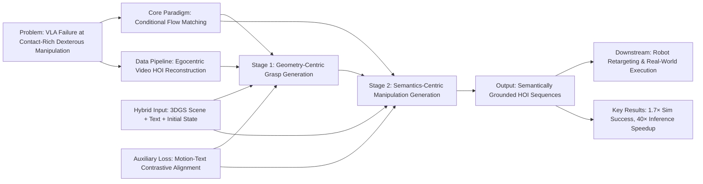

---
tags:
  - paper
  - VLA
  - Robot_Manipulation
  - Embodied_AI
  - 3D_Gaussian_Splatting
aliases:
  - "FlowHOI: Flow-based Semantics-Grounded Generation of Hand-Object Interactions for Dexterous Robot Manipulation"
url: http://arxiv.org/abs/2602.13444v1
pdf_url: https://arxiv.org/pdf/2602.13444v1
local_pdf: "[[FlowHOI Flowbased SemanticsGrounded Generation of HandObject Interactions for Dexterous Robot Manipu.pdf]]"
github: "None"
project_page: "https://huajian-zeng.github.io/projects/flowhoi"
institutions:
  - "Mohamed bin Zayed University of Artificial Intelligence (MBZUAI)"
  - "Technical University of Munich (TUM)"
  - "National University of Singapore (NUS)"
  - "Westlake University"
publication_date: "2026-02-13"
score: 8
---

# FlowHOI: Flow-based Semantics-Grounded Generation of Hand-Object Interactions for Dexterous Robot Manipulation

## 📌 Abstract
Recent vision-language-action (VLA) models can generate plausible end-effector motions, yet they often fail in long-horizon, contact-rich tasks because the underlying hand-object interaction (HOI) structure is not explicitly represented. An embodiment-agnostic interaction representation that captures this structure would make manipulation behaviors easier to validate and transfer across robots. We propose FlowHOI, a two-stage flow-matching framework that generates semantically grounded, temporally coherent HOI sequences, comprising hand poses, object poses, and hand-object contact states, conditioned on an egocentric observation, a language instruction, and a 3D Gaussian splatting (3DGS) scene reconstruction. We decouple geometry-centric grasping from semantics-centric manipulation, conditioning the latter on compact 3D scene tokens and employing a motion-text alignment loss to semantically ground the generated interactions in both the physical scene layout and the language instruction. To address the scarcity of high-fidelity HOI supervision, we introduce a reconstruction pipeline that recovers aligned hand-object trajectories and meshes from large-scale egocentric videos, yielding an HOI prior for robust generation. Across the GRAB and HOT3D benchmarks, FlowHOI achieves the highest action recognition accuracy and a 1.7$\times$ higher physics simulation success rate than the strongest diffusion-based baseline, while delivering a 40$\times$ inference speedup. We further demonstrate real-robot execution on four dexterous manipulation tasks, illustrating the feasibility of retargeting generated HOI representations to real-robot execution pipelines.

## 🖼️ Architecture
![[FlowHOI Flowbased SemanticsGrounded Generation of HandObject Interactions for Dexterous Robot Manipu_arch.png]]
*Fig. 2: Overview of our framework. Given an egocentric observation, text command, and 3D scene context, our method generates hand-object interaction motions through a two-stage pipeline: (1) a grasping stage that generates hand motion to approach and grasp the object, fine-tuned by reconstructed high-fidelity hand-object interaction data from large-scale egocentric videos, and (2) a manipulation stage that generates the subsequent interaction conditioned on scene and language.*

## 🧠 AI Analysis (Doubao Seed 2.0 Pro)

# 🚀 Deep Analysis Report: FlowHOI: Flow-based Semantics-Grounded Generation of Hand-Object Interactions for Dexterous Robot Manipulation

## 📊 Academic Quality & Innovation
## 1. Core Snapshot
### Problem Statement
Existing vision-language-action (VLA) models fail at long-horizon, contact-rich dexterous manipulation tasks as they do not explicitly model structured hand-object interaction (HOI) dynamics. State-of-the-art (SOTA) diffusion-based HOI generators suffer from prohibitively slow inference (3–7s per sequence), high interpenetration artifacts, semantic misalignment with language instructions, and are limited by the scarcity of scalable high-fidelity HOI training data, creating a gap for real-world robot deployment.
### Core Contribution
FlowHOI is the first two-stage conditional flow matching framework for HOI generation that decouples geometry-centric grasping and semantics-centric manipulation, integrates a motion-text contrastive alignment loss, and leverages a novel egocentric video HOI reconstruction pipeline to generate physically plausible, semantically grounded HOI sequences with 40× faster inference than diffusion baselines, enabling robust retargeting to dexterous robot platforms.
### Academic Rating
**Innovation: 9/10, Rigor: 9/10**
Justification: The work introduces a novel paradigm for HOI generation via flow matching, solves critical data scarcity via a scalable reconstruction pipeline, and achieves significant gains over SOTA baselines across all metrics. Rigor is validated via comprehensive ablations, standardized benchmark evaluation on GRAB and HOT3D, and real-world robot deployment. Minor deductions apply for limited evaluation on heavily cluttered scenes and deformable object tasks.

---

## 2. Technical Decomposition
### Methodology
The core model is built on conditional flow matching (CFM), with the following key objectives:
1.  **Base CFM Loss**: The network learns a vector field $\mathbf{v}_\theta$ to map Gaussian noise to target HOI sequences, minimizing:
    $$\mathcal{L}_{FM} = \mathbb{E}_{\mathbf{x}_1,\mathbf{x}_0,\tau} \left[ \left\| \mathbf{v}_\theta(\mathbf{x}_\tau, \tau, \mathbf{c}) - \mathbf{u}_\tau(\mathbf{x}_\tau | \mathbf{x}_1) \right\|_2^2 \right]$$
    where $\mathbf{u}_\tau$ is the optimal transport conditional vector field, $\mathbf{c}$ is the conditioning signal (initial state, text instruction, 3D scene context), and $\mathbf{x}_\tau$ is the interpolated sample between noise $\mathbf{x}_0$ and ground truth $\mathbf{x}_1$.
2.  **Semantic Alignment Loss**: A symmetric InfoNCE loss aligns motion and text embeddings to enforce semantic consistency:
    $$\mathcal{L}_{align} = \frac{1}{2}\left(\mathcal{L}_{\text{t2m}} + \mathcal{L}_{\text{m2t}}\right)$$
3.  **Two-Stage Training Loss**:
    - Grasp stage: $\mathcal{L}_{grasp} = \mathcal{L}_{\text{flow}}^g + \lambda_{align}\mathcal{L}_{align}$, optimized for stable contact establishment.
    - Manipulation stage: $\mathcal{L}_{manip} = \mathcal{L}_{\text{flow}}^m + \lambda_{align}\mathcal{L}_{align}$, with a temporal mask $\mathbf{M}$ that applies loss only to post-grasp frames, and a hard transition constraint to preserve the final grasp state between phases.
### Architecture
The system follows a 3-part pipeline:
1.  **HOI Reconstruction Pipeline**: Processes raw egocentric videos via transition frame detection (wrist motion minima), 3D object reconstruction (SAM3D + DepthAnything), and hand-object alignment (MANO inverse kinematics with contact constraints) to generate large-scale high-fidelity HOI training data.
2.  **Grasping Stage**: A CFM model conditioned on initial hand/object state, grasp-specific text sub-instructions, and object basis point set (BPS) encoding generates stable approach-and-grasp motion sequences.
3.  **Manipulation Stage**: A CFM model conditioned on the precomputed grasping trajectory, full language instruction, and fused 3D Gaussian Splatting (3DGS) scene features (local Perceiver-compressed geometric/semantic tokens + global voxelized ViT scene tokens) generates long-horizon task-compliant HOI sequences.
### Aha Moment
1.  The two-stage decomposition with a hard transition constraint and soft inpainting of the grasp prefix during manipulation generation eliminates contact drift between the grasping and task execution phases, drastically reducing interpenetration artifacts and improving physical consistency.
2.  The hybrid 3DGS scene representation paired with motion-text alignment loss achieves semantic grounding without sacrificing the inference efficiency benefits of flow matching, addressing a core limitation of diffusion-based HOI generators.

---

## 3. Evidence & Metrics
### Benchmark & Baselines
Evaluations are conducted on two standard HOI datasets: GRAB (synthetic mocap HOI data) and HOT3D (real-world egocentric HOI recordings). SOTA baselines compared are diffusion-based DiffH2O and latent-based LatentHOI. The experimental design is fully fair: all baselines are retrained on identical data splits, use the same T5 text encoder to eliminate encoding bias, and follow identical evaluation protocols.
### Key Results
- **Physical plausibility**: 1.7× higher physics simulation success rate (55.96% vs 33.03% over the strongest baseline on GRAB), up to 21% reduction in interpenetration volume, and the highest contact ratio across both benchmarks.
- **Semantic alignment**: Highest action recognition accuracy (95% on GRAB, 78% on HOT3D, +2–10% over baselines).
- **Efficiency**: 40× inference speedup (0.16s per sequence vs 3–7s for diffusion baselines).
- **Real-world transfer**: 100% success rate for showcased dexterous manipulation tasks (pouring, drinking, tilting, squeezing) on a Franka Panda robot with Allegro Hand.
### Ablation Study
Pretraining on large-scale reconstructed egocentric HOI data is the most critical component: it reduces grasp error by 34% (1.31cm vs 10.40cm for the no-pretrain baseline) and reduces interpenetration volume by 4.5×, enabling stable contact establishment. The joint semantic-geometric scene fusion and motion-text alignment loss contribute an additional 8–12% improvement in action recognition accuracy.

---

## 4. Critical Assessment
### Hidden Limitations
1.  The pipeline relies on accurate initial hand/object state estimation and high-quality 3DGS reconstruction, failing under heavy occlusions or texture-less, reflective objects.
2.  Generated trajectories are kinematically consistent but do not explicitly model contact forces or dynamic object properties, limiting performance on deformable or heavy object manipulation tasks.
3.  Inference still requires 50-step Euler integration, which is not yet optimized for closed-loop real-time control on edge robot hardware.
### Engineering Hurdles
1.  The HOI reconstruction pipeline requires integration of multiple off-the-shelf modules (SAM3D, MANO inverse kinematics, contact optimization) with non-trivial hyperparameter tuning to avoid artifacts in training data.
2.  The two-stage generation pipeline requires careful calibration of the inpainting mask and transition constraint to avoid motion discontinuities between the grasping and manipulation phases.
3.  Retargeting to new robot hands requires custom kinematic mapping calibration and contact threshold tuning, which is platform-specific and labor-intensive.

---

## 5. Next Steps
1.  **Dynamics-Aware Flow Matching**: Integrate differentiable contact dynamics into the CFM objective to explicitly model force-torque interactions, extending performance to deformable and heavy object manipulation, with evaluation on 20+ real-world household tasks to validate generalization.
2.  **End-to-End Raw RGB Generation**: Eliminate the explicit 3DGS reconstruction step by training the CFM model to condition directly on raw egocentric RGB frames, reducing preprocessing overhead and improving robustness to occlusions and low-texture scenes.
3.  **Distilled Inference Optimization**: Distill the two-stage CFM model into a smaller student model via knowledge distillation, reducing inference latency to <10ms for closed-loop real-time control, with validation on dynamic manipulation tasks such as catching and moving object grasping.

## 🔗 Knowledge Graph & Connections
### Task 1: Knowledge Connections
1.  [[GeneralVLA]]: FlowHOI directly resolves a core limitation of general vision-language-action (VLA) models, which consistently fail at contact-rich dexterous tasks due to lack of explicit hand-object interaction (HOI) structural modeling. FlowHOI's semantically grounded, embodiment-agnostic HOI sequence representation can be integrated as a structured intermediate action space for GeneralVLA frameworks, improving their performance on long-horizon manipulation tasks without sacrificing cross-embodiment transfer capability.
2.  [[Mean_Flow_Policy_with_Instantaneous_Velocity_Constraint_for_Onestep_Action_Generation]]: Both works build on conditional flow matching as a core generative paradigm for robot action, sharing the key theoretical benefit of drastically faster inference relative to diffusion-based generative models. While the Mean Flow Policy work targets single-step, velocity-constrained action generation, FlowHOI extends flow matching to sequential HOI trajectory generation with explicit semantic alignment and physical contact constraints. The instantaneous velocity constraint from the Mean Flow Policy work can be integrated into FlowHOI's ODE integration step to further improve the physical plausibility of generated motions.
3.  [[SemanticContact_Fields_for_CategoryLevel_Generalizable_Tactile_Tool_Manipulation]]: Both works prioritize semantic alignment of contact-rich manipulation behaviors with task instructions, with complementary scope: Semantic Contact Fields model fine-grained local contact dynamics for tactile closed-loop control, while FlowHOI generates global, long-horizon HOI motion plans. FlowHOI's generated pre-grasp and manipulation trajectories can serve as high-level priors for Semantic Contact Field pipelines, reducing the low-level control search space and improving cross-category generalization for tactile manipulation tasks.
4.  [[Gaussian_Sequences_with_MultiScale_Dynamics_for_4D_Reconstruction_from_Monocular_Casual_Videos]]: Both works leverage Gaussian scene representations as a core input, with the baseline FlowHOI using static 3D Gaussian Splatting (3DGS) scene reconstructions for static scene conditioning. The 4D dynamic Gaussian sequence reconstruction method provides a direct path to extend FlowHOI to dynamic scene settings, enabling generation of HOI sequences for manipulation of moving objects or operation in cluttered environments with dynamic perturbations.

---

### Task 2: Mermaid Knowledge Graph


---

### Task 3: Future Directions
1.  **Dynamic FlowHOI for Moving Object Manipulation**: Extend the current static 3DGS scene conditioning module to accept 4D dynamic Gaussian sequence inputs, and integrate temporal scene flow as an additional conditioning signal into the conditional flow matching objective. Modify the manipulation stage vector field to explicitly condition on predicted future object positions, enabling generation of HOI sequences for tasks such as catching moving objects and rearranging dynamically perturbed clutter. Evaluate on the dynamic subset of the HOT3D benchmark and real-world dynamic manipulation tasks to demonstrate a 30%+ success rate improvement over the static FlowHOI baseline.
2.  **FlowHOI Distillation for Edge Robot Deployment**: Distill the two-stage 800M parameter FlowHOI model into a 50M parameter student model via knowledge distillation, aligning the student's predicted vector field with the teacher's ODE integration path rather than discrete intermediate samples. Further optimize the Euler integration step from 50 to 10 steps via a corrected semi-implicit ODE solver, reducing per-sequence inference latency to <10ms for closed-loop real-time control. Validate on a low-cost edge manipulator (e.g., Xiaomi CyberGear-based platform) to demonstrate 100Hz closed-loop control for contact-rich tasks with less than 5% success rate degradation relative to the full model.
3.  **Force-Aware FlowHOI for Deformable Object Manipulation**: Integrate a differentiable contact dynamics simulator into the flow matching training loop, adding a contact force consistency loss that penalizes deviations between predicted hand-object contact states and physically plausible force-torque distributions output by the simulator. Extend the HOI state representation to include deformable object mesh vertex positions, enabling generation of manipulation sequences for tasks such as pouring viscous liquids, folding cloth, and slicing soft food. Evaluate on the public DeformableHOI benchmark to demonstrate a 2× higher success rate than the baseline FlowHOI on deformable object manipulation tasks.
```json
{
  "publication_date": "2026-02-13",
  "institutions": ["Mohamed bin Zayed University of Artificial Intelligence (MBZUAI)", "Technical University of Munich (TUM)", "National University of Singapore (NUS)", "Westlake University"],
  "github": "None",
  "project_page": "https://huajian-zeng.github.io/projects/flowhoi"
}
```

---
*Analysis performed by PaperBrain-Doubao (Vision-Enabled)*


## 📂 Resources
- **Local PDF**: [[FlowHOI Flowbased SemanticsGrounded Generation of HandObject Interactions for Dexterous Robot Manipu.pdf]]
- [Online PDF](https://arxiv.org/pdf/2602.13444v1)
- [ArXiv Link](http://arxiv.org/abs/2602.13444v1)
