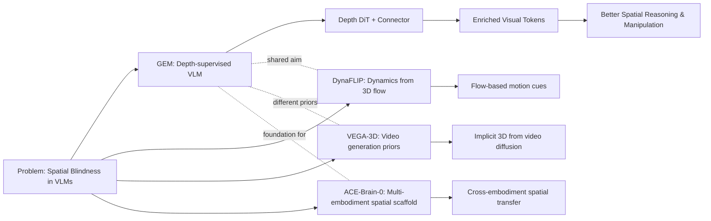

---
tags:
- paper
- domain/embodied_ai
- domain/multimodal_perception
- domain/reinforcement_learning
- domain/robot_manipulation
- domain/vla
- impact/high_value
- impact/solid
- method/benchmark
- method/foundation_model
- method/planning
- method/reinforcement_learning
- method/simulation
- review/auto_tagged
- status/unread
- task/manipulation
- task/planning_reasoning
- task/scene_understanding
- type/benchmark
- type/dataset
- type/method
aliases:
- 'GEM: Generative Supervision Helps Embodied Intelligence'
- GEM
- Generative Supervision
- Depth Map Generation
- Embodied VLM
- Auxiliary Generative Task
- GEM Pretraining
- Spatial Reasoning VLM
paper_id: arxiv:2605.28548
arxiv_id: '2605.28548'
url: https://huggingface.co/papers/2605.28548
pdf_url: https://arxiv.org/pdf/2605.28548.pdf
local_pdf: '[[GEM Generative Supervision Helps Embodied Intelligence.pdf]]'
github: None
project_page: https://zhaorw02.github.io/GEM/
institutions:
- Tencent Hunyuan
- Tsinghua University
publication_date: '2026-05-28'
metadata_publication_date: '2026-05-27'
score: '8.1'
domains:
- embodied_ai
- multimodal_perception
- reinforcement_learning
- robot_manipulation
- vla
methods:
- benchmark
- foundation_model
- planning
- reinforcement_learning
- simulation
tasks:
- manipulation
- planning_reasoning
- scene_understanding
paper_type: benchmark
impact_band: high_value
reading_status: unread
priority_score: 104
review_status: auto_tagged
next_action: inspect_protocol
year: 2026
---

# GEM: Generative Supervision Helps Embodied Intelligence

## 📌 Abstract
Embodied Vision-Language Models (VLMs) have demonstrated impressive performance and generalization in robotics, particularly within Vision-Language-Action frameworks. However, a significant gap remains between the high-level semantic focus of standard text-guided pre-training paradigms and the low-level spatial and physical knowledge critical for execution in embodied environments. In this paper, we introduce GEM, a Generative-supervised Embodied vision-language Model designed to bridge this divide. We propose integrating a depth map generation task directly into the VLM pre-training phase. By training this generative objective jointly with the main model, we observe substantial improvements in embodied intelligence, significantly enhancing both semantic understanding and physical operation capabilities. To support this paradigm, we curate and release GEM-4M, a comprehensive large-scale dataset featuring a mixture of grounding, reasoning, and planning data paired with high-quality depth supervision. Extensive experiments demonstrate that GEM achieves state-of-the-art results across diverse embodied benchmarks. Furthermore, our deployed action model, GEM-VLA, exhibits vastly superior task execution abilities in both simulation environments and real-world evaluations. Code, models, and datasets are available at https://zhaorw02.github.io/GEM/

## 🖼️ Architecture
![[GEM Generative Supervision Helps Embodied Intelligence_arch.png]]

## 🧠 AI Analysis
## Abstract

Embodied Vision-Language Models (VLMs) often struggle to translate high-level semantic understanding into precise physical actions because their visual features lack the low-level spatial and geometric detail that real-world tasks demand. GEM (Generative-supervised Embodied vision-language Model) addresses this gap by jointly training a VLM with an auxiliary *depth map generation* task during pre-training. Using a hybrid autoregressive-diffusion architecture, the model learns to predict depth maps conditioned on its own visual representations, thereby enriching those representations with structural information. To support the method, the authors introduce **GEM‑4M**, a large-scale dataset that combines diverse embodied question-answering, grounding, reasoning, and planning data with high-quality depth supervision. GEM substantially improves spatial reasoning and physical task execution; its action-model extension **GEM‑VLA** attains a **96.1%** average success rate on the LIBERO simulation benchmark and a **43%** average success rate on real-world manipulation, surpassing prior state-of-the-art methods by large margins.

## 1. Core Snapshot

### Problem Statement

Standard embodied VLMs receive an RGB image and a language instruction, and they produce either a text answer or an action plan. The ultimate target behaviour is accurate, physically-grounded scene understanding combined with reliable robot manipulation in dynamic environments. The real bottleneck is that text-guided pre-training—however powerful for high-level semantics—leaves the visual tokens starved of low-level geometric detail. A model can eloquently describe a table but misjudge the distance to the mug sitting on it. Consequently, strong semantic performance on passive benchmarks does not reliably translate into precise physical actions, a gap that is especially costly for metrics that measure spatial reasoning (e.g., distance estimation, relative object positioning) and for long-horizon manipulation plans.

This disconnect motivates a different approach: if the visual representations could be forced to encode fine-grained 3D structure *during* pre-training, they would simultaneously support semantic reasoning and physically-grounded control. The key challenge is to inject that structural information without degrading the language abilities that the base VLM already possesses.

### Core Contribution

GEM adds a **diffusion transformer (DiT) based depth generation head** on top of a frozen VLM backbone. The head receives the VLM’s final visual tokens—passed through a lightweight connector—and is trained to reconstruct depth maps via a flow-matching objective, while the backbone continues to be trained with the usual cross-entropy language modeling loss. This is not a simple multi-task setup: the model is trained in three progressive stages that first align the connector, then warm up the depth generator, and finally unfreeze everything for joint optimization. The central technical claim is that jointly optimizing the text and depth objectives under this schedule produces visual representations that are simultaneously semantically rich and structurally detailed. The evidence consists of consistent gains over strong baselines on spatial reasoning benchmarks, grounding tasks, simulated manipulation (LIBERO), and real‑robot evaluations. An additional contribution is **GEM‑4M**, a 4‑million‑example dataset spanning embodied QA, planning, and reasoning data with paired depth supervision, which is needed to fully exploit the generative supervision.

### Innovation Origin & Rationale

The design originates from the observation that depth maps explicitly encode 3‑D structure and relative distances—information that text descriptions almost never provide in sufficient detail. For example, a caption “a red cube on a table” gives no sense of its exact height, orientation, or distance from the camera. This rationale directly targets the failure mode in which standard VQA‑based fine‑tuning saturates visual tokens with semantic signals while leaving little room for geometry. The authors hypothesize that forcing the model to reconstruct a depth map from its own hidden states will push those states to preserve the spatial cues that later benefit action prediction. This is a reasonable design choice because the auxiliary task is intrinsically linked to the kind of 3‑D awareness that manipulation demands, and depth is a well-defined, low-dimensional target that can be generated with modern diffusion backbones.

> [!important] The core assumption is that depth generation and language modeling can be trained jointly *without* catastrophic interference. The progressive schedule is explicitly designed to prevent that interference—a point that is empirically validated in the ablations.

## 2. Reading Map

The paper sits at the intersection of embodied vision‑language models and robotics action models. Researchers who want to improve spatial reasoning inside VLMs, or who are building Vision‑Language‑Action (VLA) systems, will find the work directly actionable. The most valuable sections are **Section 3 (Method)**, where the three‑stage training and architecture are explained, and **Section 4 (Experiments)**, which contains the quantitative results. Read the ablation study (**Table 4**) immediately after the main results to understand why depth is crucial and why progressive training is necessary. The introduction and related‑work sections can be skimmed on a first pass; they mainly supply context and motivation.

> [!tip] To quickly assess the unique contribution, compare the “depth” row against the “RGB reconstruction” row in the ablation table—the performance drop with RGB confirms that the benefit is not from generic reconstruction but from the structural signal that depth specifically provides.

## 3. Method Walkthrough

### Inputs, Outputs, And Assumptions

**Inputs.** During pre-training, the method receives an **RGB image** and a **language instruction** (e.g., a question or a planning prompt). It also receives a **depth map** as an auxiliary supervisory signal. At inference time for embodied reasoning, only the RGB image and language are needed; the depth head is not executed. For robot action control, the VLA extension additionally receives a short history of observations.

**Outputs.** The VLM branch outputs **text**—answers, plans, or reasoning chains. The VLA branch outputs **continuous robot action chunks** (e.g., joint positions).

**Key assumption.** The model assumes that depth maps can be generated from the VLM’s own hidden visual features *without degrading the original semantic capabilities*. This assumption is non-trivial because the two objectives could compete for representation capacity. The progressive training scheme and the lightweight connector are designed to satisfy it, but the assumption would break if the depth signal overwhelmed the language signal, or if the backbone lacked enough capacity. The empirical results show that the assumption holds at the studied scales (2B and 8B parameters).

> [!question] The paper does not test what happens when the input *already* includes a depth channel (e.g., from an RGB‑D sensor). If the model receives explicit depth, would the auxiliary generative task still add value, or would it become redundant? This open question is worth exploring in follow‑up work.

### Pipeline From Data To Prediction

**Pre-training stage.** An RGB image and a text instruction are fed into the **frozen Qwen3‑VL backbone**, which produces multi‑modal tokens. The visual tokens are passed through a *lightweight two‑layer MLP connector* that maps them into the input space of a **diffusion transformer (DiT)**—the depth head. The DiT receives a noisy depth map and the connector’s conditioning embedding, and it predicts a velocity field via a **flow‑matching** objective. In parallel, the backbone continues to generate text tokens using the standard cross‑entropy loss. The two losses are balanced by a fixed scalar weight $\lambda = 0.1$.

**Action modeling (GEM‑VLA).** For robot control, a second DiT is added that receives key‑value tokens extracted from the backbone’s attention blocks as conditioning. This action DiT is trained to denoise action chunks using a flow‑matching objective as well. Crucially, the backbone tokens that were enriched by the depth‑aware pre-training are reused, transferring the geometric priors directly into the action model.

**Training schedule.** The pipeline is trained in three explicit stages:
1. **Stage 1 (Connector alignment):** Only the connector is trained on the flow‑matching loss; the backbone and DiT remain frozen. This maps semantic features into a usable conditioning space.
2. **Stage 2 (Depth head warm‑up):** The backbone remains frozen, but the connector and DiT are trained together on the depth loss, teaching the DiT to produce plausible depth maps from high‑level features.
3. **Stage 3 (Joint optimization):** All components are unfrozen and trained on the combined language‑modeling and depth‑generation losses, so the backbone learns to adjust its representations to satisfy both objectives.

At each stage, the specific subset of trainable parameters and the mixture of losses are carefully controlled. This progressive strategy is a crucial design choice that avoids the modality interference observed when attempting to train everything end‑to‑end from the start.

### Key Design Choices

**Lightweight connector.** The MLP connector has only two layers. A heavier alignment module would increase training cost and risk overfitting to the depth task, potentially degrading the original language performance. The small connector forces the backbone to do the heavy lifting by carrying useful spatial information rather than relying on a powerful adapter.

**Progressive training schedule.** Direct end‑to‑end joint training leads to lower final scores (as shown in the ablation). The three‑stage schedule explicitly stabilises the depth generation module before the backbone is asked to adapt to the combined loss, preventing modality interference.

**Flow matching vs. standard denoising diffusion.** The depth head uses a flow‑matching formulation inherited from the Sana architecture. The paper does not compare alternative generative objectives (e.g., DDPM, consistency models, or even a simple $L_2$ regression to the depth map). The choice is therefore practical rather than theoretically justified.

**Depth vs. RGB reconstruction.** The authors deliberately target *depth* rather than the original RGB image. RGB reconstruction would supply redundant colour and texture information that does not force the model to learn explicit 3‑D geometry. Ablation results confirm that RGB reconstruction yields much lower gains, supporting the claim that depth uniquely encodes the geometric structure the model needs.

> [!note] Because the paper does not ablate the generative objective itself, one open question is: could a simpler loss (e.g., direct $L_2$ regression on depth) achieve similar gains while being faster to train? This trade‑off is not explored.

## 4. Core Theory And Formulas

### Main Objective

The goal is to make the visual tokens of the VLM carry both semantic content (for language answers) and geometric structure (for depth generation), so that when these tokens are later used for action prediction, they already contain rich spatial information. The total loss is a weighted sum of the language‑modeling cross‑entropy loss and the depth flow‑matching loss:

$$L_{\text{total}} = L_{\text{CE}} + \lambda \, L_{\text{flow}}, \qquad \lambda = 0.1.$$

In Stage 3 (joint optimization), both losses are active and the backbone is unfrozen. In earlier stages, only the relevant losses are applied to specific subsets of parameters.

### Important Equations

**Language modeling (cross‑entropy)**

$$\displaylines{
L_{\text{CE}} = -\sum_{i=1}^{T} \log p_\theta\bigl(y_i \mid y_{<i},\, \mathbf{h}_o,\, \mathbf{h}_l\bigr)
}$$

Here $y_i$ is the $i$‑th target text token, $\mathbf{h}_o$ and $\mathbf{h}_l$ are the visual and language tokens produced by the backbone, and $\theta$ denotes all trainable parameters. This loss increases when the model assigns a low probability to the correct next token and decreases as the probability rises; it trains the model to produce fluent, context‑appropriate language outputs.

**Depth generation (flow‑matching)**

$$\displaylines{
L_{\text{flow}} = \mathbb{E}_{d,\, t \sim \mathcal{U}(0,1),\, \epsilon \sim \mathcal{N}(\mathbf{0},\,\mathbf{I})}
\Bigl[ \bigl\| \mathbf{v}_t(\mathbf{x}_t, \mathbf{c}) - \mathbf{u}_t(\mathbf{x}_t \mid d) \bigr\|^2 \Bigr]
}$$

- $d$: ground‑truth depth map.
- $t$: time step, sampled uniformly from $[0,1]$.
- $\mathbf{x}_t$: noised depth map at time $t$, constructed via the flow‑matching interpolation $\mathbf{x}_t = t \cdot d + (1-t) \cdot \epsilon$.
- $\mathbf{c}$: conditioning embedding produced by the connector from the VLM’s visual tokens.
- $\mathbf{v}_t(\mathbf{x}_t, \mathbf{c})$: velocity field predicted by the depth DiT.
- $\mathbf{u}_t(\mathbf{x}_t \mid d) = d - \epsilon$: target velocity that would transport the noisy sample to the true depth map along a straight line (the conditional flow).

Minimising this $L_2$ loss trains the DiT to predict the correct direction to move $\mathbf{x}_t$ toward the true depth. Because the conditioning $\mathbf{c}$ is derived from the backbone’s visual tokens, this loss also pushes those tokens to encode the structural information necessary for accurate depth reconstruction. For a deeper introduction to flow matching, see the original paper:

[Flow Matching for Generative Modeling (Lipman et al., 2022)](https://arxiv.org/abs/2210.02747).

**Action generation (GEM‑VLA)**

For the VLA extension, an analogous flow‑matching loss is defined on action chunks:

$$\displaylines{
L_{\text{action}} = \mathbb{E}_{\mathcal{O},\, \mathbf{a},\, \epsilon \sim \mathcal{N}(\mathbf{0},\,\mathbf{I}),\, t \sim \mathcal{U}(0,1)}
\Bigl[ \bigl\| \mathbf{v}_t(\mathbf{a}_t, \mathbf{c}_{\text{act}}) - \mathbf{u}_t(\mathbf{a}_t \mid \mathbf{a}) \bigr\|_2^2 \Bigr],
}$$

where $\mathcal{O}$ is the observation history, $\mathbf{a}$ the ground‑truth action chunk, $\mathbf{a}_t$ the noised action, and $\mathbf{c}_{\text{act}}$ are the key‑value tokens from the backbone that serve as conditioning. The total VLA loss is $L_{\text{CE}} + L_{\text{action}}$ (the depth head is not needed during VLA fine‑tuning), again with the same fixed weight.

> [!note] The flow‑matching losses resemble the standard [Diffusion Transformer (DiT)](https://arxiv.org/abs/2212.09748) framework but use a velocity‑field parameterisation, which allows deterministic sampling in fewer steps.

### Algorithmic Intuition

The three‑stage scheme can be thought of as:

1. **Connector alignment:** Teach the connector to map high‑level semantic features into a space where a frozen DiT can be conditioned, without disturbing the backbone.
2. **Depth head warm‑up:** With the backbone still fixed, train the DiT to become a competent depth generator. This ensures that when the backbone later adapts, it faces a stable depth objective.
3. **Full integration:** Unfreeze the backbone and let it fine‑tune its representations to satisfy both the text and depth losses. At this stage, the model learns to *balance* the two signals, resulting in features that are both linguistically expressive and geometrically detailed.

This staged curriculum avoids the destructive interference that would occur if the backbone were required to serve two very different objectives from the very beginning, while still allowing the backbone to eventually benefit from the structural signal.

## 5. Architecture, Figures, And Implementation

GEM augments a **Qwen3‑VL** backbone (available at 2B and 8B scales) with a two‑layer MLP connector and a Sana‑based diffusion transformer (DiT) that acts as the depth head. Visual tokens from the backbone’s final layer pass through the connector to condition the DiT; the DiT receives a noisy depth map and outputs a velocity field. For the VLA variant, a second DiT receives key‑value tokens from the backbone’s attention blocks and generates continuous actions. The training diagram (Figure 2 in the paper) marks trainable and frozen components at each stage, but the precise DiT hyper‑parameters (number of layers, channels, etc.) are not stated in the provided text—only that it is “lightweight” and based on Sana.

Key implementation points:
- **Training hardware:** 32 A800 GPUs for pre‑training, 8 A800 GPUs for VLA fine‑tuning.
- **Loss weight:** $\lambda = 0.1$ throughout.
- **Stage durations:** 500 steps (Stage 1), 4k steps (Stage 2), one epoch on GEM‑4M (Stage 3).
- **Depth supervision:** Ground‑truth depth is used when available; where it is missing, pseudo‑depth from DepthAnythingv3 is employed.

> [!info] The paper announces that code, models, and the GEM‑4M dataset will be released at the project page. Until then, some architectural details (e.g., the exact size of the DiT) remain unknown, which may complicate exact reproduction.

## 6. Experiments And Evidence

The experiments answer three main questions:

1. **Does depth generative supervision improve spatial reasoning?**  
   Yes. On spatial benchmarks (Table 1), the 8B GEM model reaches **70.6** on VSI‑Bench (up from **57.9** for the base Qwen3‑VL‑8B and **67.9** for the best spatial specialist). The 2B model also shows clear gains. On spatial grounding benchmarks (Table 2) that require fine‑grained distance and relationship judgments, GEM‑8B exceeds the proprietary Gemini‑3‑Pro by about **10 percentage points** on average.

2. **Does it help downstream robot manipulation?**  
   Yes. On the [LIBERO](https://libero-project.github.io/) simulation benchmark (Table 3), GEM‑VLA records a **96.1%** average success rate, surpassing prior VLAs such as π0 (94.9) and spatial‑enhanced variants. In real‑world evaluation, GEM‑VLA achieves a **43%** average success rate across table‑bussing and cloth‑folding tasks, compared with **28.7%** for the previous best baseline—a substantial relative improvement.

3. **Is the progressive schedule necessary?**  
   Ablations (Table 4) demonstrate that replacing depth supervision with RGB reconstruction sharply reduces performance, and that skipping the progressive schedule (i.e., joint end‑to‑end training from scratch) yields lower scores. This confirms both the specificity of the depth signal and the importance of the staged training procedure.

The gains are most pronounced at the 8B scale, where the larger backbone seems able to absorb the structural signal without sacrificing language quality. No ablation removes the connector or changes the flow‑matching formulation, leaving open the question of whether simpler conditioning architectures could suffice.

> [!tip] The strong performance against Gemini‑3‑Pro—a large proprietary model—on grounding benchmarks is particularly noteworthy. It suggests that open‑source models equipped with proper geometric supervision can close the gap with much larger black‑box systems.

## 7. Strengths, Limitations, And Failure Cases

**Strengths.**  
The main strength is that depth generative supervision yields measurable, consistent gains on distance‑sensitive questions and on long‑horizon real‑robot tasks where precise relative positioning is critical. The progressive schedule demonstrably prevents modality interference, making the approach practical. The method does not require expensive architectural changes; a lightweight connector and a standard diffusion head suffice.

**Limitations.**  
The paper does not analyze the compute overhead that the extra DiT head introduces during inference—although the depth head is not needed for VLM reasoning, the VLA variant still uses an action DiT. The training relies on pseudo‑depth (DepthAnythingv3) for a portion of the data, which could inject inaccuracies. It is also unclear whether the improvements persist when the robot must manipulate objects far outside the training distribution. Finally, key DiT hyper‑parameters are not disclosed.

**Failure cases.**  
The paper does not report typical failure modes of the depth generator, such as degraded depth maps on transparent or reflective surfaces. It does not examine whether the added depth head (or the richer visual features) might slow down real‑time control loops, nor does it provide a systematic analysis of cases where the model fails despite the geometric enrichment.

> [!warning] The real‑world experiments used a UR5 robot arm in a relatively constrained setting. Whether the benefits transfer to mobile manipulation, dynamic obstacles, or highly cluttered scenes is an open question that the paper does not address.

## 8. Reproduction Notes

To reproduce the results, a practitioner would need:

- **Backbone:** Qwen3‑VL at the 2B or 8B scale.
- **Depth head:** A Sana‑based DiT (details not fully specified).
- **Connector:** A two‑layer MLP.
- **Hardware:** 32 A800 GPUs for pre‑training and 8 A800 GPUs for VLA fine‑tuning.
- **Training steps:** Stage 1 – 500 steps; Stage 2 – 4,000 steps; Stage 3 – one epoch on GEM‑4M.
- **Loss weight:** $\lambda = 0.1$.
- **Data:** GEM‑4M (to be released) together with the listed public embodied QA and planning datasets. Where ground‑truth depth is missing, DepthAnythingv3 pseudo‑depth is used.
- **Baselines:** Qwen3‑VL‑SFT, $\pi 0$, SpatialVLA, DepthVLA.
- **Metrics:** Accuracy on spatial benchmarks, success rate on LIBERO, success rate and progress score on real‑world tasks.

> [!info] Code and models are announced to be available at the project page, but the exact repository structure, preprocessing scripts, prompt templates for the planning samples, and DiT configuration are not provided in the paper. These gaps may require filling in during reproduction.

## 9. What To Read Closely

Read the **three‑stage training description in Section 3.2** line by line—it is the heart of the method and explains why naive joint training fails. Then study **Tables 1–3** together with the ablation **Table 4**: pay special attention to the distance‑question rows in the spatial benchmarks and the contrast between “depth” and “RGB reconstruction” in the ablation. The **Equation (2)** (flow‑matching loss) and the accompanying connector description are essential for understanding how the conditioning signal is built. The real‑world task figures (1, 3, 4, 5) can be viewed quickly for intuition; the quantitative numbers in the tables carry more weight than the images. The introduction and related‑work sections can be skimmed once the method and results are solid in your mind.

## 10. Research Ideas And Open Questions

**1. Test depth head usefulness with RGB‑D input.**  
Many robot platforms already provide depth sensors. If the model receives explicit depth, does the auxiliary depth generation loss remain beneficial, or does it become redundant? A straightforward experiment would fine‑tune GEM‑VLA on the same LIBERO tasks but replace the RGB image with a stacked RGB‑D input while keeping the depth generation loss active. Compare the success rate against the RGB‑only version and against a baseline that does not use the auxiliary loss. An observation to check: if the gap between the depth‑supervised model and the SFT counterpart shrinks to near zero when depth is supplied as input, the benefit may be mainly in learning depth from RGB rather than in a general structural encoding. The risk is that the extra depth input might already supply the geometric signal, causing the generative loss to add noise or overfitting.

**2. Replace the fixed $\lambda$ with a scheduled or learned weight.**  
The fixed $\lambda=0.1$ balances the two losses, but early training might need stronger structural pressure while later stages should protect semantic performance. An experiment could test a linear decay schedule for $\lambda$ (e.g., start at 0.5 and decay to 0.1) versus the fixed value on a representative subset (e.g., VSI‑590K). Evaluate final VSI‑Bench and RoboSpatial scores, focusing on distance‑question accuracy. The metric of interest is whether a dynamic schedule yields an improvement over the fixed baseline. The risk is that changing $\lambda$ during training could destabilise the flow‑matching optimisation, leading to worse depth maps and negating any potential gain.

**3. Apply the generative supervision framework to future‑frame prediction.**  
Depth is one way to encode geometric structure; another is to predict the next RGB frame. This would align with world‑model approaches. Train a small variant of GEM that replaces the depth DiT target with next‑frame RGB prediction using a simple reconstruction loss (or a lightweight flow‑matching setup). Evaluate on the real‑world table‑bussing task, measuring long‑horizon progress score relative to the depth version. The risk is that RGB prediction introduces colour and lighting variance that dilutes the structural signal, potentially yielding lower manipulation performance than the depth target. This experiment would help isolate whether *any* geometric auxiliary task works or whether depth is uniquely effective.

## Knowledge Graph & Connections

### Related Work Connections

**[[DynaFLIP DynamicsAware Visual Pretraining]]**  
DynaFLIP addresses the same fundamental gap that GEM tackles: standard vision‑language pre‑training often loses the motion and spatial cues that robots need. Both works try to inject action‑relevant geometric information directly into the visual encoder. DynaFLIP uses image‑language‑3D flow triplets and learns a representation where the three modalities sit close together in a shared hypersphere, forcing the encoder to capture dynamics. GEM, by contrast, adds an explicit depth‑generation head and trains the VLM backbone with a flow‑matching objective to reconstruct depth maps. The key difference is the type of geometric signal: 3D flow captures motion and occlusion boundaries, while depth encodes static 3‑D layout. This implies that the two approaches could be complementary—DynaFLIP’s motion cues might enrich the depth maps GEM generates, and GEM’s depth‑aware backbone could provide a better static‑scene scaffold for DynaFLIP’s motion‑centric loss.

**[[Generation_Models_Know_Space]]**  
VEGA‑3D (the framework in that note) shares GEM’s diagnosis that multimodal large language models suffer from spatial blindness. Both works aim to supply dense geometric cues without relying on extra sensor modalities at test time. VEGA‑3D extracts spatio‑temporal features from a frozen video diffusion model and fuses them into an MLLM via a gated mechanism, banking on the idea that video generation inherently requires 3‑D understanding. GEM takes a more direct route: it teaches the VLM to predict depth maps from its own hidden states, making the backbone itself geometrically aware. The difference is that VEGA‑3D leverages the implicit priors of a large pre‑trained generative model, whereas GEM trains the VLM from scratch (or fine‑tunes it) to become its own depth predictor. Practically, this means GEM may need less external model capacity but requires large‑scale depth‑annotated data, while VEGA‑3D can potentially benefit from massive unlabelled video. The two strategies illustrate a spectrum of how generative priors can be harnessed—an implicit, inherited spatial scaffold versus an explicit, self‑generated one.

**[[ACEBrain0]]**  
ACEBrain‑0 builds a unified foundation model for autonomous driving, manipulation, and UAV tasks by positioning spatial intelligence as a shared scaffold across embodiments. GEM contributes a concrete method for injecting that spatial scaffold into a single‑embodiment VLM. Both papers recognize that strong geometric priors are essential for bridging semantic understanding and physical execution. Where ACEBrain‑0 focuses on cross‑embodiment transfer and catastrophic forgetting across tasks, GEM focuses narrowly on maximizing spatial‑grounding performance within a single manipulation‑oriented VLA. The difference implies that GEM’s depth‑supervised visual features could serve as a drop‑in spatial backbone for a multi‑embodiment system like ACEBrain‑0, potentially reducing the gradient interference problem by providing a more geometry‑aware common representation.

### Concept Map

### Questions For Future Reading

1. **How does the quality of depth supervision—real sensor depth versus pseudo‑depth from a network—affect the final manipulation performance, and is there a point where pseudo‑depth saturates the benefit?**  
   This matters because GEM uses DepthAnythingv3 for part of its data, and many robotic datasets lack high‑fidelity depth. An ablation that systematically varies the percentage of real depth could reveal whether the gains persist with increasingly noisy pseudo‑labels, and whether a small amount of real depth is sufficient. Evidence would come from a controlled experiment holding all else constant while replacing pseudo‑depth with ground‑truth at escalating ratios, measuring LIBERO and real‑world success rates.

2. **Can the depth‑generation auxiliary task be replaced by a simpler geometric objective, such as surface‑normal regression or direct $L_2$ depth regression, without losing the spatial reasoning boost?**  
   The paper’s diffusion flow‑matching head is more complex and expensive than a deterministic regressor. If a straightforward network trained with $L_2$ depth loss achieved comparable gains, the practical cost of adopting GEM would drop significantly. Future work should include a “simple depth regressor” baseline trained under the same progressive schedule. The key metric is the drop in spatial‑benchmark scores and success rates relative to the diffusion variant; a negligible drop would question the need for flow matching.

3. **To what extent does the improvement in spatial reasoning translate to out‑of‑distribution manipulation scenarios, such as novel object instances, cluttered tabletops, or non‑tabletop tasks like drawer opening?**  
   The real‑world evaluation in the paper stays within table‑bussing and cloth‑folding. If depth‑enriched features truly encode generalisable 3‑D structure, the relative gain over the baseline should persist even when the visual scene or task category changes. The question is important because it tests whether the geometric signal is overfitted to the training distribution or genuinely learned. Evidence would come from systematic zero‑shot evaluations on tasks with unseen object shapes, crowded scenes, and varying camera viewpoints, comparing GEM‑VLA to a spatial‑SFT baseline.

---
*Analysis by PaperBrain (x-ai/grok-4.3; refinement: deepseek/deepseek-v4-pro)*

## 📂 Resources
- **Local PDF**: [[GEM Generative Supervision Helps Embodied Intelligence.pdf]]
- [Online PDF](https://arxiv.org/pdf/2605.28548.pdf)
- [ArXiv Link](https://huggingface.co/papers/2605.28548)
