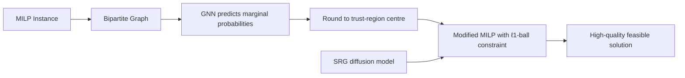

---
tags:
- paper
- domain/reinforcement_learning
- impact/watch
- method/benchmark
- method/planning
- method/reinforcement_learning
- review/auto_tagged
- status/unread
- task/planning_reasoning
- type/benchmark
- type/method
aliases:
- A GNN-Guided Predict-and-Search Framework for Mixed-Integer Linear Programming
- GNN-PredictSearch
- TrustRegion MILP
- Marginal Probability MILP
- GNN-Guided Search
- Predict-and-Search Framework
- GNN for MILP
- MILP Feasible Solution
- GNN MILP Solver
authors:
- Qingyu Han
- Linxin Yang
- Qian Chen
- Xiang Zhou
- Dong Zhang
- Akang Wang
- Ruoyu Sun
- Xiaodong Luo
paper_id: arxiv:2302.05636
arxiv_id: '2302.05636'
url: http://arxiv.org/abs/2302.05636v4
pdf_url: https://arxiv.org/pdf/2302.05636v4
local_pdf: '[[A GNNGuided PredictandSearch Framework for MixedInteger Linear Programming.pdf]]'
github: https://github.com/sribdcn/Predict-and-Search-MILP-method
project_page: None
institutions:
- Shenzhen Research Institute of Big Data
- Shandong University
- The Chinese University of Hong Kong, Shenzhen
- Huawei
- Shenzhen International Center For Industrial and Applied Mathematics
publication_date: '2023-02-11'
metadata_publication_date: '2023-03-06'
score: '5.1'
domains:
- reinforcement_learning
methods:
- benchmark
- planning
- reinforcement_learning
tasks:
- planning_reasoning
paper_type: benchmark
impact_band: watch
reading_status: unread
priority_score: 55
review_status: auto_tagged
next_action: inspect_protocol
year: 2023
---

# A GNN-Guided Predict-and-Search Framework for Mixed-Integer Linear Programming

## 📌 Abstract
Mixed-integer linear programming (MILP) is widely employed for modeling combinatorial optimization problems. In practice, similar MILP instances with only coefficient variations are routinely solved, and machine learning (ML) algorithms are capable of capturing common patterns across these MILP instances. In this work, we combine ML with optimization and propose a novel predict-and-search framework for efficiently identifying high-quality feasible solutions. Specifically, we first utilize graph neural networks to predict the marginal probability of each variable, and then search for the best feasible solution within a properly defined ball around the predicted solution. We conduct extensive experiments on public datasets, and computational results demonstrate that our proposed framework achieves 51.1% and 9.9% performance improvements to MILP solvers SCIP and Gurobi on primal gaps, respectively.

## 🖼️ Architecture
![[A GNNGuided PredictandSearch Framework for MixedInteger Linear Programming_arch.png]]

## 🧠 AI Analysis
## Abstract

Mixed-integer linear programming (MILP) is widely employed for modeling combinatorial optimization problems. In practice, similar MILP instances with only coefficient variations are routinely solved, and machine learning (ML) algorithms are capable of capturing common patterns across these MILP instances. In this work, we combine ML with optimization and propose a novel predict-and-search framework for efficiently identifying high-quality feasible solutions. Specifically, we first utilize graph neural networks to predict the marginal probability of each variable, and then search for the best feasible solution within a properly defined ball around the predicted solution. We conduct extensive experiments on public datasets, and computational results demonstrate that our proposed framework achieves 51.1% and 9.9% performance improvements to MILP solvers SCIP and Gurobi on primal gaps, respectively.

The paper addresses a practical bottleneck: when you solve many similar MILPs, solvers treat every instance as new and waste time rediscovering patterns. Instead of learning to directly output a full solution vector (end‑to‑end), the authors learn the **marginal probability** that each binary variable takes value 1 in a high‑quality solution. Then they use a trust‑region–like neighborhood search to find a feasible, near‑optimal solution. The framework is a two‑step “predict then search” pipeline that injects ML predictions as soft guidance rather than rigid variable fixings.

## 1. Core Snapshot

### Problem Statement
MILP solvers are general‑purpose and ignore the fact that many instances from the same application share structure (coefficient variations only). End‑to‑end ML methods can learn from past solutions, but they face two key difficulties: (1) collecting thousands of optimal solutions for supervised training is computationally expensive; (2) directly predicting a full solution often produces infeasible or sub‑optimal assignments because constraints are ignored. The paper targets the scenario where we repeatedly solve similar MILPs and want to **accelerate the solution process** by outputting a high‑quality feasible solution quickly, without requiring optimal solutions for training.

### Core Contribution
The main contribution is a **predict‑and‑search framework** that first uses a graph neural network (GNN) to predict the marginal probability $p(x_d = 1)$ for every binary variable. Then it defines a trust region around a rounding of these probabilities, within which an MILP solver searches for the best feasible solution. This design avoids both the need for optimal training labels and the infeasibility risks of naive variable fixing. The paper proves that the trust‑region search always yields a solution no worse than fixing the same partial assignment (Proposition 1). Experiments on four public benchmarks show that PS+SCIP and PS+Gurobi reduce average primal gaps by 51.1% and 9.9%, respectively, compared to running the solvers without guidance.

### Innovation Origin & Rationale
The idea is inspired by the trust‑region method from nonlinear optimization, where a difficult problem is solved by a sequence of local models within a ball. Here, the “center” is a rounded prediction from the GNN, and the ball radius limits how many predicted variable values can be flipped. The rationale is that the GNN’s marginal probabilities are often close to the optimal 0/1 assignment for many variables, so the true optimum lies within a small Hamming distance. Rather than forcing variables to fixed values (which could make the subproblem infeasible), the trust‑region approach allows the solver to correct mistakes. This design directly addresses the feasibility issue of earlier fix‑based learning methods while still leveraging ML to reduce the search space.

> [!success] Soft constraints as a search‑space reduction
> By allowing up to $\Delta$ deviations, the framework trades off prediction confidence against solver freedom. It never performs worse than hard fixing (Proposition 1), yet it avoids the brittleness of an infeasible fixed assignment.

## 2. Reading Map
This paper is for readers interested in ML‑guided combinatorial optimization, particularly MILP. The target domain is practical: solving many similar MILPs faster by reusing past data.  

- **Section 1** motivates the problem and positions the work inside the “end‑to‑end learning” category.  
- **Section 2** explains the MILP formulation, bipartite graph representation, GNN basics, and trust‑region method. If you are familiar with MILP and GNNs, skim quickly.  
- **Section 3** is the core; it describes the prediction step (distribution learning, weight‑based sampling to construct marginal probability labels) and the search step (trust‑region construction and solving). The proof of Proposition 1 is simple but important.  
- **Sections 4–5** present experiments: four public datasets (IP, WA, IS, CA), comparison with SCIP/Gurobi and Neural Diving, and analysis of hyperparameters. Figure 2 and Table 1 are essential for evaluating the framework.  
- **Section 6** concludes.  

If you only have 20 minutes, read the abstract, the problem statement in Section 1, the method pipeline in Sections 3.1–3.2 (especially the equations and Algorithm 1), and the main results in Table 1. After that, you can understand the core idea and its empirical strength.

*Paper source*: Published as a conference paper at ICLR 2023. [arXiv preprint](https://arxiv.org/abs/2302.05636). The official code is at [GitHub: Predict‑and‑Search MILP method](https://github.com/sribdcn/Predict‑and‑Search‑MILP‑method).

## 3. Method Walkthrough

### Inputs, Outputs, And Assumptions
- **Input**: An MILP instance $M$ described by constraint matrix $A$, right‑hand side vector $b$, objective coefficients $c$, variable bounds $[l,u]$, and the number of binary variables $q$ (all discrete variables are binary in the paper).  
- **Output**: A feasible solution $x$ (a complete assignment to all variables) that comes from solving a modified MILP $M'$ with an additional neighborhood constraint.  
- **Assumptions**:  
  1. **Similar instances** – The training and test instances come from the same problem distribution (e.g., same application). The GNN will not generalize to completely different problem families.  
  2. **Binary variables** – All discrete variables are binary. The method can in principle handle continuous variables, but the paper simplifies to pure binary integer programming (BIP).  
  3. **Conditional independence** (Equation 5) – The full joint distribution over solutions factorizes as a product of per‑variable marginal distributions $p_\theta(x; M) = \prod_{d=1}^q p_\theta(x_d; M)$. This strong simplifying assumption reduces a $2^n$‑way distribution to $n$ scalar probabilities. It means the GNN only needs to output a vector of marginal probabilities, not a full joint distributions.

> [!warning] Independence ignores correlations
> The conditional independence assumption discards dependencies between variables. If two variables are mutually exclusive in feasible solutions, the GNN might still assign both a high probability, leading to a poor trust‑region center. The trust‑region search can later correct this, but the underlying prediction quality may suffer. The paper does not quantify how often this mismatch occurs.

### Pipeline From Data To Prediction
**Step 1 – Data collection.** For each training instance $M^i$, the authors collect a set $L^i$ of feasible solutions (not necessarily optimal) by running an MILP solver (SCIP) for a limited time. Each solution is weighted by its objective value according to an energy‑based probability:

$$
p(x; M) \propto \exp(-E(x; M)), \qquad 
E(x; M) = \begin{cases}
c^\top x & \text{if } x \text{ is feasible},\\
+\infty & \text{otherwise.}
\end{cases}
$$

Only feasible solutions are considered, so the unnormalized weight for a solution $x^{i,j}$ is $\exp(-c^{i\top} x^{i,j})$. The label for variable $d$ in instance $i$ is the *empirical marginal probability*

$$
p_d^i = \sum_{j \in S_d^i} w^{i,j},
$$

where $S_d^i$ are the indices of collected solutions where $x_d = 1$, and $w^{i,j} = \frac{\exp(-c^{i\top} x^{i,j})}{\sum_{k=1}^{N_i} \exp(-c^{i\top} x^{i,k})}$ are normalized weights. In words, $p_d^i$ is the weighted fraction of good solutions that set variable $d$ to 1, with lower‑objective solutions receiving exponentially more influence.

This construction avoids the prohibitive cost of gathering optimal solutions for every training instance. Even suboptimal solutions contribute, but their impact is down‑weighted.

**Step 2 – GNN prediction.** The MILP instance is converted to a bipartite graph with variable nodes and constraint nodes. A GNN, implemented with two half‑convolution layers (following Gasse et al., 2019), processes node features and outputs a scalar per variable node. A sigmoid activation squashes this scalar to a predicted probability $\hat{p}_d \in [0,1]$, interpreted as the probability that $x_d = 1$ in a high‑quality solution. The network is trained end‑to‑end by minimizing the sum of binary cross‑entropy losses between predicted $\hat{p}_d$ and the empirical $p_d$:

$$
L(\theta) = -\sum_{i=1}^N \sum_{d=1}^n \left[ p_d^i \log(\hat{p}_d^i) + (1-p_d^i) \log(1-\hat{p}_d^i) \right].
$$

Under the conditional independence assumption, this loss is equivalent to minimizing the KL divergence between the empirical weighted distribution and the factorized model distribution.

*Resource*: The bipartite graph representation for MILP and the half‑convolution GNN are introduced in [Gasse et al. (NeurIPS 2019)](https://arxiv.org/abs/1906.01629). The code for that model is part of the [Ecole library](https://github.com/ds4dm/ecole).

**Step 3 – Search with trust region.** For a test instance, the GNN outputs probabilities $\hat{p}_1,\dots,\hat{p}_n$. The algorithm picks the $k_0$ variables with the smallest predicted probabilities (likely 0) and the $k_1$ variables with the largest predicted probabilities (likely 1). For these selected variables, the framework does **not** fix them to 0/1. Instead, it adds a modified MILP constraint (Equation 9):

$$
\min_{x \in \mathcal{D} \cap B(\hat{x}_I, \Delta)} c^\top x,
$$

where $\mathcal{D}$ is the original feasible region, $I = I_0 \cup I_1$ is the index set of selected variables, $\hat{x}_I$ is the rounded prediction (0 for $I_0$, 1 for $I_1$), and $B(\hat{x}_I, \Delta) = \{ x \in \mathbb{R}^n : \|\hat{x}_I - x_I\|_1 \le \Delta \}$ is the $\ell_1$ ball of radius $\Delta$ around $\hat{x}_I$. Because all selected variables are binary, $\|\hat{x}_I - x_I\|_1$ is simply the Hamming distance, i.e., the number of bits that differ from the predicted assignment.

To implement this ball, the authors introduce auxiliary binary variables $\delta_d$ for each $d \in I$ and add constraints:

- For $d \in I_0$ (predicted 0): $x_d \le \delta_d$ (so $\delta_d = 0 \implies x_d = 0$).  
- For $d \in I_1$ (predicted 1): $1 - x_d \le \delta_d$ (so $\delta_d = 0 \implies x_d = 1$).  

Then the budget constraint $\sum_{d\in I} \delta_d \le \Delta$ ensures that at most $\Delta$ selected variables deviate from their predicted values. The solver can freely assign values to unselected variables and is allowed to flip up to $\Delta$ selected variables to maintain feasibility and optimality.

> [!success] Proposition 1: Trust region never underperforms fixing
> If the same set $I$ and predicted values $\hat{x}_I$ are used, the optimal value from the trust‑region search is always at least as good as the optimum obtained by hard‑fixing those variables to $\hat{x}_I$. The proof is trivial: $B(\hat{x}_I, 0) = \mathcal{S}(\hat{x}_I)$ (the fixed subproblem), and this set is a subset of $B(\hat{x}_I, \Delta)$ for any $\Delta \ge 0$. Thus the trust‑region MILP has a larger feasible set and can only improve the objective.

### Key Design Choices
- **Soft target via exponential weights** – Using normalized exponential weights to weigh solutions by quality (instead of using only optimal solutions) drastically reduces data collection costs. The optimal solution, if present, would have the largest weight, but even suboptimal solutions contribute according to their objective values.
- **Conditional independence (product of marginals)** – Turns high‑dimensional distribution learning into a vector regression problem. Without it, the model would need to sample from a joint distribution, which is computationally infeasible for large $n$. The price: inter‑variable correlations are ignored.
- **Trust‑region radius $\Delta$ instead of hard fixing** – Fixing variables (i.e., $\Delta = 0$) can cause infeasibility if the GNN makes a few wrong predictions. By allowing up to $\Delta$ deviations, the approach becomes a “soft neighborhood” constraint. The paper finds that small $\Delta$ (1–3) works well, indicating that the GNN predictions are indeed close to the true optimum.
- **Selection size $k_0, k_1$** – The paper uses 40% of the variables for each group, i.e., 80% of variables are inside the trust region. The remaining 20% are left completely free, providing additional slack to absorb prediction errors.

## 4. Core Theory And Formulas

### Main Objective
The learning objective is to minimize the KL divergence between the empirical weighted distribution of solutions and the GNN model’s factorized distribution. With the independence assumption, this divergence decomposes into a sum of per‑variable binary cross‑entropy terms:

$$
L(\theta) = -\sum_{i=1}^N \sum_{d=1}^n \left[ p_d^i \log(\hat{p}_d^i) + (1-p_d^i) \log(1-\hat{p}_d^i) \right],
$$

where $p_d^i$ is the empirical marginal probability of variable $d$ being 1 in instance $i$, computed from the collection of feasible solutions using the exponential weights. This is a standard cross‑entropy for binary classification, so training is straightforward with gradient descent.

### Important Equations
- **Energy‑based probability of a solution** (Eq. 3 in the paper):
  $$
  p(x; M) = \frac{\exp(-E(x; M))}{\sum_{x'} \exp(-E(x'; M))}, \qquad
  E(x; M) = \begin{cases}
  c^\top x & \text{if } x \text{ is feasible},\\
  +\infty & \text{otherwise.}
  \end{cases}
  $$
  The energy is simply the objective value; a lower objective gives a higher probability. In practice, only a finite set of feasible solutions is available, so the normalizing sum (partition function) is approximated over that set.

- **Empirical marginal probability label** (Eq. 6):
  $$
  p_d^i = \sum_{j \in S_d^i} w^{i,j},
  $$
  where $S_d^i$ is the index set of collected feasible solutions for instance $i$ where $x_d = 1$, and 
  $$
  w^{i,j} = \frac{\exp(-c^{i\top} x^{i,j})}{\sum_{k=1}^{N_i} \exp(-c^{i\top} x^{i,k})}.
  $$
  This label can be thought of as a “soft count”: it is 1 if all good solutions have $x_d=1$, 0 if none do, and something in between otherwise.

- **Trust‑region MILP formulation** (Eq. 9):
  $$
  \min_{x \in \mathcal{D} \cap B(\hat{x}_I, \Delta)} c^\top x,
  $$
  where $\mathcal{D} = \{x \in \{0,1\}^q \times \mathbb{R}^{n-q} : Ax \le b,\ l \le x \le u\}$ is the original feasible set, $\hat{x}_I$ is the rounded GNN prediction on the selected indices $I$, and $B(\hat{x}_I, \Delta) = \{x \in \mathbb{R}^n : \|\hat{x}_I - x_I\|_1 \le \Delta\}$. For binary variables, $\|\hat{x}_I - x_I\|_1 = \sum_{d\in I} |\hat{x}_d - x_d|$ equals the number of mismatches. The modified MILP is solved with an off‑the‑shelf solver (SCIP or Gurobi).

- **Proposition 1 (monotonicity)**: Let $z_{\text{Fixing}}$ be the optimal value when variables $I$ are fixed to $\hat{x}_I$ (i.e., $\Delta = 0$), and $z_{\text{Search}}$ be the optimal value of the trust‑region problem with $\Delta \ge 0$. Then $z_{\text{Search}} \le z_{\text{Fixing}}$. The proof is immediate because the feasible region of the fixing problem is a subset of the trust‑region problem’s feasible region.

### Algorithmic Intuition
Algorithm 1 details the search. In plain steps:
1. Sort GNN output $\hat{p}$.  
2. Identify $I_0$ (smallest $k_0$ probabilities) and $I_1$ (largest $k_1$ probabilities).  
3. For each selected variable $d$, introduce an auxiliary binary variable $\delta_d$ and add constraints as described.  
4. Add the budget constraint $\sum_{d\in I_0\cup I_1} \delta_d \le \Delta$.  
5. Solve the original MILP augmented with these constraints.

Thus the solver can pick any values for unselected variables, and for selected variables it is allowed to flip up to $\Delta$ of them away from the prediction. The trust‑region is implemented in a purely linear‑integer way, making it compatible with any MILP solver.

## 5. Architecture, Figures, And Implementation

### Architecture Components
The GNN consists of three parts:
- **Embedding** – A single‑layer MLP projects raw node features (variable bounds, objective coefficient, constraint type, etc., following Gasse et al., 2019) to 64‑dimensional vectors. Layer normalization is applied after embedding.
- **Graph convolutions** – Two half‑convolution layers from Gasse et al. (2019). These layers first aggregate features from variable nodes to constraint nodes, then from constraint nodes back to variable nodes, using learned transformations. No direct variable‑variable or constraint‑constraint edges exist.
- **Output head** – A 2‑layer perceptron with a sigmoid activation outputs a single scalar per variable node, interpreted as $\hat{p}_d$.

The whole model is trained end‑to‑end with the binary cross‑entropy loss using the ADAM optimizer (learning rate 0.003, batch size 8). The graph structure is static per instance.

*Further reading*: For the exact graph convolution operation, see [Gasse et al., “Exact Combinatorial Optimization with Graph Convolutional Neural Networks” (NeurIPS 2019)](https://arxiv.org/abs/1906.01629). The [Ecole library](https://github.com/ds4dm/ecole) provides ready‑to‑use implementatons.

### Figure 1 – Pipeline Overview
The figure depicts:  
Input MILP → bipartite graph → GNN (graph convolutions + MLP) → marginal probabilities for each variable. Then a selection step picks variables with highest/lowest probabilities. A trust region is formed around the rounded solution, and a solver searches within that region to output a near‑optimal solution. It visually contrasts with end‑to‑end methods that directly round and fix.

### Implementation Details
- **Hardware**: Two Intel Xeon Gold 5117 CPUs, 256 GB RAM, two Nvidia V100 GPUs.
- **Software**: Python with PyTorch 1.10.2, SCIP 8.0.1, and Gurobi 9.5.2. The solving emphasis is set to “finding better primal solutions”. Time limit per instance is 1,000 seconds.
- **Data**: Each dataset has 400 instances (240 train, 60 validation, 100 test). For training, 1,000 feasible solutions per instance were collected by running SCIP for 300 seconds with heuristic emphasis, without requiring optimality.
- **Hyperparameters**: $k_0 = k_1 = 40\%$ of variables (so 80% selected), $\Delta \in \{0,1,2,3,4,5,6\}$ tuned per problem. Best $\Delta$ values reported: IP=2, WA=2, IS=1, CA=3. The search solves the modified MILP once; there is no iterative update of the trust‑region center.
- Missing details: The exact feature vector for each node is not fully described; the paper refers to the appendix or to Gasse et al. (2019). The internal architecture of the half‑convolution layers (e.g., hidden dimensions) is also not given in the main text, but the code repository should fill these gaps.

*Resource*: The official code is at [GitHub](https://github.com/sribdcn/Predict‑and‑Search‑MILP‑method). The solver pages: [SCIP](https://www.scipopt.org/) and [Gurobi](https://www.gurobi.com/). For PyTorch, see https://pytorch.org/.

## 6. Experiments And Evidence

### Datasets
Four public MILP benchmarks were used:
- **IP (Balanced Item Placement)** and **WA (Workload Appointment)** from the NeurIPS ML4CO 2021 competition ([competition page](https://www.ecole.ai/2021/ml4co-competition/)).
- **IS (Independent Set)** and **CA (Combinatorial Auction)** generated via the Ecole library, following Gasse et al. (2019).
All problems have only binary variables and are known to be non‑trivial for general‑purpose solvers (especially IS and CA). The test set contains 100 instances each.

### Baselines and Metrics
- **Solver baselines**: SCIP 8.0.1 and Gurobi 9.5.2 in default (primal‑heuristic‑focused) mode with a 1,000 s time limit.
- **ML baseline**: Neural Diving (Nair et al., 2020) implemented by the authors as closely as possible (original code was not available).
- **Metrics**: Absolute primal gap $\text{gap}_{\text{abs}} = |\text{OBJ} - \text{BKS}|$ and relative primal gap $\text{gap}_{\text{rel}} = \frac{|\text{OBJ} - \text{BKS}|}{|\text{BKS}| + 10^{-10}}$, where BKS is the best known solution from a 3,600‑second Gurobi run. Smaller is better.

### Main Results
- **Figure 2** shows the average relative primal gap over time (log scale) for each dataset. PS+SCIP (blue) substantially outperforms default SCIP (green) on all four, often producing near‑optimal solutions very quickly. PS+Gurobi (red) beats default Gurobi (black) on IS and CA; on IP it is slightly worse (gap 0.69 vs 0.63), though still very good. On IS, PS+Gurobi finds optimal solutions within 10 seconds.
- **Table 1** gives final gaps at 1,000 s. Highlights: PS+SCIP achieves a 53.6% improvement on IP, 57.1% on WA, 90.0% on IS, and 3.5% on CA (average 51.1%). PS+Gurobi sees a 6.7% improvement on WA, 43.2% on CA, no change on IS (both optimal), and a slight degradation on IP (−9.5%, meaning Gurobi alone was 9.5% better). Overall average gain for PS+Gurobi is 9.9%.

> [!warning] Negative gain on IP with Gurobi
> The PS+Gurobi combination underperforms Gurobi alone on the IP benchmark (relative gap –9.5%). The authors attribute this to Gurobi’s already extremely strong heuristics. In such a case, the trust‑region constraint might inadvertently exclude portions of the search space that Gurobi would otherwise explore. The absolute gap is still tiny (0.69 vs 0.63), so the overhead of the search becomes the dominant effect.

- **Comparison with Neural Diving (Figure 3)**: On the NNV dataset (used to validate the implementation), Neural Diving improves over SCIP, but PS+SCIP far outperforms Neural Diving on IP and IS (gaps roughly 3× smaller). Neural Diving fails to beat SCIP on IS, while PS+SCIP does.

### Ablation/Observation Notes
- **Sensitivity to $\Delta$**: The paper reports that they tuned $\Delta$ per problem; best values are modest (1–3). This confirms that the GNN prediction is accurate enough that only a few flips are needed.
- **Sensitivity to $k_0,k_1$**: They fixed $40\%/40\%$ for all experiments. No ablation on this choice is presented; it is a potential hidden variable.
- **Impact of training data quality**: They used only feasible solutions (not optimal) with exponential weighting. No experiment compares against training on only optimal solutions (which would be too expensive). This is a practical necessity, not an empirical claim of superiority.

*Additional resource*: The ML4CO competition datasets (IP and WA) are available at the [competition’s GitHub repository](https://github.com/ds4dm/ml4co-competition). The Ecole‑based problem generators are in the [Ecole library](https://github.com/ds4dm/ecole).

## 7. Strengths, Limitations, And Failure Cases

### Strengths
- **Principled integration of ML and optimization** – The trust‑region search is a natural way to inject soft constraints that improve feasibility while still reducing the search space. The proof that it never underperforms fixing is simple but reassuring.
- **Low data collection cost** – Only feasible solutions (not optimal) are required, and the exponential weighting mechanism cleverly focuses learning on good solutions. This makes the method applicable to many real‑world settings where optimal solutions are unavailable.
- **Strong empirical performance** – Across four diverse benchmarks, PS+SCIP consistently cuts primal gaps by half or more, and PS+Gurobi also provides gains except when the solver is already near‑perfect.
- **Modular design** – The GNN can be replaced with any other probabilistic predictor; the search module is solver‑agnostic.

### Limitations
- **Conditional independence assumption** – By assuming $P_\theta(x) = \prod_d p_\theta(x_d)$, the model ignores correlations between variables. This can lead to predictions that are individually plausible but jointly infeasible (e.g., two variables that cannot both be 1 simultaneously). The trust‑region helps recover, but the GNN might still output poor marginal probabilities in such cases.
- **Sensitivity to hyperparameters $k_0,k_1,\Delta$** – These must be tuned per problem family. In a new domain, one would need to run a validation sweep. The paper does not provide guidelines for automatic tuning.
- **Not end‑to‑end differentiable** – The search step is a black‑box MILP solve, so the GNN cannot be fine‑tuned with respect to the final objective gap. The training loss only minimizes cross‑entropy with empirical marginals, which may not correlate perfectly with final solution quality.
- **Scalability to larger instances** – The GNN processes the full bipartite graph; for very large MILPs (millions of variables), this might be memory/time intensive. The trust‑region MILP might still be large, though it is solved only once.
- **Limited to binary variables** – The formulation explicitly assumes binary variables. Extension to integer variables with larger domains is not straightforward, because the $\ell_1$ distance would not be a Hamming distance, and the marginal probability definition becomes a vector of length $> 1$.
- **Training regime** – The model is specialized to one problem distribution; it does not generalize across different combinatorial structures. Transfer learning or multi‑task learning across problems is not explored.

### Failure Cases
- **When Gurobi is already extremely good** – On IP, PS+Gurobi slightly underperforms Gurobi alone (gap 0.69 vs 0.63). This may happen when the solver’s heuristics are already near‑optimal and the trust region excludes some promising region, or the overhead of enforcing the trust region slows down solving.
- **When predictions are systematically biased** – If the GNN outputs probabilities that are uniformly near 0.5 for all variables, the trust region would be essentially the full space, giving no speedup. The paper shows that the predictions are informative (since $\Delta$ is small), but if the problem structure changes drastically between train and test, performance could degrade.
- **Infeasibility of the modified MILP** – The search problem $M'$ can become infeasible if $\Delta$ is too small given the prediction errors. The paper implicitly assumes that by choosing $\Delta$ appropriately, the modified problem remains feasible; they did not report infeasibility rates.

## 8. Reproduction Notes

### Datasets and Preprocessing
- Public datasets IP, WA (ML4CO competition), and IS, CA generated via the Ecole library. The paper states that the generating scripts follow Gasse et al. (2019).  
- Training instances: 1,000 feasible solutions per instance collected by running SCIP with heuristic emphasis for 300 seconds. The GitHub repository likely includes data generation scripts.

*Download*: The ML4CO competition data is at [https://github.com/ds4dm/ml4co-competition](https://github.com/ds4dm/ml4co-competition). The Ecole library for IS and CA can be installed from [https://github.com/ds4dm/ecole](https://github.com/ds4dm/ecole).

### Model and Training
- GNN: 2 half‑convolution layers (from Gasse et al., 2019), embedding dim 64, output sigmoid. Code available.
- Loss: Binary cross‑entropy between predicted marginals and weighted empirical marginals.
- Optimizer: ADAM, lr=0.003, batch size 8.
- Early stopping: not explicitly mentioned; presumably validation set monitoring.
- Training hardware: GPU (Nvidia V100). No details on number of epochs; typically trained until convergence.

### Evaluation Protocol
- For each test instance, run PS pipeline: GNN prediction, then solve the modified MILP with SCIP/Gurobi for 1,000 s (single‑thread, emphasis on primal). The paper uses a fixed 1,000 s time limit; they mention a tail‑off of solution quality after that. The solver call is `SOLVE(M')` once; no iterative refinement.
- Comparison metrics: absolute and relative primal gaps against a 1‑hour Gurobi best bound (BKS).
- The PS+Gurobi experiment uses Gurobi as the solver inside `SOLVE`.

### Hyperparameters
- $k_0 = k_1 = 0.4 n$. $\Delta$ values: IP 2, WA 2, IS 1, CA 3. These were tuned on the validation set.
- For Neural Diving implementation: details not fully given; they struggled with parameter tuning for WA/CA, so only IP and IS reported.

### Missing Details
- Exact node feature vectors (presumably as in Gasse et al., 2019: objective coefficient, bounds, degree, etc. for variables; right‑hand side, sense, etc. for constraints).
- The number of GNN layers and hidden dimensions inside half‑convolution layers are not described beyond “2 half‑convolution layers”. The original GCNN paper uses a specific architecture; the reader must refer to it.
- The code repository should fill many gaps.

*Reproducibility resources*: The paper’s code is at [https://github.com/sribdcn/Predict‑and‑Search‑MILP‑method](https://github.com/sribdcn/Predict‑and‑Search‑MILP‑method). The SCIP solver can be obtained from [https://www.scipopt.org/](https://www.scipopt.org/), and Gurobi from [https://www.gurobi.com/](https://www.gurobi.com/) (license required).

## 9. What To Read Closely
- **Section 3.1 on prediction** – Especially the derivation from energy‑based distribution to marginal probability labels (Equations 3–6). This is the core of how training data is prepared, which is a clever trick. Understand why the loss decomposes.
- **Section 3.2.2 and Algorithm 1** – How the trust‑region is encoded as an MILP constraint using auxiliary binary variables $\delta_d$ and the $\ell_1$ ball. This is the key implementation insight.
- **Figure 2** – The progression of average primal gaps over time shows how quickly PS+SCIP finds good solutions compared to baseline; note the log scale and the early plateau in some cases.
- **Table 1** – The final gaps and gains. Pay attention to the negative gain for PS+Gurobi on IP – a sign that the method can occasionally be worse.
- **Proposition 1** – Short but important for theoretical justification. The proof is only a few lines.

You can skim the dataset generation details (Appendix F) and the training protocol details unless you plan to reproduce them.

## 10. Research Ideas And Open Questions

### 1. Probabilistic Joint Model Instead of Independence
The independence assumption discards correlations. Could we replace the GNN with a conditional generative model that outputs a vector of marginal probabilities while capturing some pairwise dependencies (e.g., via a differentiable proxy for consistency constraints)? A small experiment: train a GNN that outputs both marginals and a low‑dimensional correlation matrix via a Cholesky factor, then use a sampling‑based search (e.g., beam search) guided by these richer probabilities. Measure whether fewer trust‑region flips ($\Delta$) are needed to reach the optimum.  
**Risk**: The added complexity may not improve solution quality if the trust‑region already compensates adequately; also training such a model is more difficult.

### 2. Learning to Set $\Delta$ and Selection $k_0,k_1$ Per Instance
Currently $k_0, k_1, \Delta$ are global hyperparameters. Can we train a context‑aware controller that, for a given instance, predicts the optimal $\Delta$ and the set size based on the GNN’s confidence (e.g., entropy of predictions)? A quick experiment: use the GNN’s per‑variable entropy to decide which variables to include in $I$ (only those with low entropy) and set $\Delta$ proportional to the sum of their entropies. Evaluate on a validation set to see if adaptive selection improves overall gap or reduces solving time.  
**Risk**: The GNN’s entropy might not correlate with actual misprediction probability; the controller could overfit.

### 3. Fine‑Tuning with a Surrogate of the Final Objective Gap
The GNN is trained to minimize binary cross‑entropy with the empirical marginal distribution, but we really care about the final solution objective after the trust‑region search. Could we add a differentiable approximation of the search process (e.g., a soft constraint relaxation) to backpropagate a proxy gap? A quick experiment: after the GNN prediction, simulate the trust‑region search by solving a relaxed LP version of the augmented problem (which is differentiable w.r.t. the trust‑region center), then compute the LP’s objective value as a loss term. Train the GNN to minimize this LP objective while keeping the original cross‑entropy term. Check if the resulting GNN yields lower primal gaps on held‑out instances.  
**Risk**: The LP relaxation may not be a tight proxy for the MILP optimum; moreover, differentiable optimization through an LP solver adds technical overhead. This could be too ambitious for a one‑week experiment but could be a longer‑term follow‑up.

## Knowledge Graph & Connections

## Related Work Connections

**[[SRG]] (Score-based Relaxation-guided Generation for Mixed Integer Linear Programming)**  
Both the present paper and SRG share the core “predict‑then‑search” strategy: a machine‑learning model first captures structural patterns in MILP instances, and then a trust‑region‑like MILP subproblem is solved to produce a high‑quality feasible solution. In both works, the trust‑region constraint avoids the brittleness of hard variable fixings and allows the solver to correct prediction mistakes.  

Where the papers differ is the *form of the learned guidance*. The Predict‑and‑Search method uses a GNN trained to predict factorized **marginal probabilities** under a conditional independence assumption; the trust‑region centre is a simple rounding of those probabilities. SRG, in contrast, trains a Transformer‑based score network that models a **joint distribution** over solutions through a diffusion process, and it first generates diverse candidate solutions before building the trust‑region subproblem around a selected candidate. The difference implies a trade‑off: Predict‑and‑Search is conceptually simpler, easier to train, and yields very strong results with minimal prediction complexity, while SRG’s explicit modelling of joint dependencies might produce better guidance when variable correlations are important—at the cost of heavier training and sampling overhead.  

Because the two approaches use the same downstream trust‑region machinery but differ in the upstream representation, comparing them directly on problems where variable independence is clearly violated would be a natural follow‑up. If SRG’s richer distributional information does not translate into smaller final primal gaps, that would suggest that even a simple factorized marginal predictor is sufficient when combined with a trust‑region search, whereas a large gap would highlight the limitations of the independence assumption.

## Concept Map

The graph shows the central pipeline of the Predict‑and‑Search paper: an MILP instance is converted to a bipartite graph, a GNN outputs per‑variable marginal probabilities, those are rounded to form a trust‑region centre, and a modified MILP with an ℓ1‑ball constraint is solved to obtain the final solution. The dashed edge from the [[SRG]] node indicates that SRG also feeds into the same trust‑region search, but it uses a diffusion‑based sampling step rather than a direct marginal predictor.

## Questions For Future Reading

1. **When does modelling joint dependencies improve solution quality over factorized marginal predictions?**  
   The Predict‑and‑Search paper deliberately ignores correlations between variables by assuming $P_\theta(x) = \prod_d p_\theta(x_d)$. In many real MILPs, variables are tightly coupled (e.g., mutual exclusivity). If future papers propose richer predictive models, we should ask how often the added complexity actually reduces the primal gap *after* a trust‑region search. Evidence would come from experiments that measure the gap reduction as a function of the strength of variable dependencies, or from ablation studies that replace a joint model with a factorized one and track the degradation (or lack thereof).

2. **Can the trust‑region parameters ($k_0, k_1, \Delta$) be set adaptively per instance, and does adaptive tuning outperform fixed global values?**  
   The paper uses fixed percentages for variable selection and a hand‑tuned $\Delta$, which requires a validation set. A practically important question is whether a lightweight meta‑learner—using, say, the GNN’s per‑variable entropy—can set these hyperparameters instance‑by‑instance and improve robustness across varied problem distributions. An answer would come from controlled comparisons where adaptive methods are benchmarked against grid‑tuned global parameters on new, unseen problem families.

3. **How do solver heuristics interact with the trust‑region constraint, and can they explain the occasional performance drop?**  
   On the IP dataset, PS+Gurobi performed slightly worse than vanilla Gurobi, despite the trust‑region approach never underperforming hard fixing. This suggests that the trust‑region constraint might prevent the solver’s internal primal heuristics from exploring certain regions that would otherwise lead to slightly better solutions. Future work that instruments the solver’s heuristic search under the trust‑region constraint—e.g., recording when heuristic moves are rejected by the budget constraint—would clarify this effect and could guide the design of softer neighbourhoods that are more solver‑friendly.

## Learning Roadmap And Verified Resources

**Knowledge Point 1: Mixed‑integer linear programming (MILP) fundamentals**  
Understanding what a MILP is—its feasible region defined by linear constraints with integer/binary variables, the objective, and how branch‑and‑bound solvers find solutions—is a prerequisite for every idea in this paper. Without it, the trust‑region modification and the meaning of a “primal gap” are opaque.  
**Study order**: Start with linear programming basics (simplex, duality), then move to the integer case, branching, and relaxations. Finally, see how modern solvers incorporate primal heuristics.  

| Type | Resource | Why this one |
|------|----------|--------------|
| Open Lecture Notes | [MIT 6.251J/15.081J Introduction to Mathematical Programming (Bertsimas)](https://ocw.mit.edu/courses/6-251j-introduction-to-mathematical-programming-fall-2009/) | Covers LP, MILIP, and the branch‑and‑bound framework with rigorous but accessible notes. |
| Video/Public Course | [Optimal, Adaptive, and Model‑based Decision‑making: MIT 15.083 (Bertsimas) – Integer Optimization lectures](https://ocw.mit.edu/courses/15-083j-integer-programming-and-combinatorial-optimization-fall-2009/) | Dedicated integer optimisation course with video recordings (2009, still highly relevant). |
| Documentation | SCIP documentation: “Primal Heuristics” (link removed: validation failed) | Shows real‑world examples of the primal heuristics that the paper builds upon and competes with. |

**Knowledge Point 2: Bipartite graph representation of MILP**  
The paper converts every MILP instance into a bipartite graph with variable nodes and constraint nodes, following Gasse et al. (2019). This representation is the input to the GNN; grasping it is essential to understand how a solver‑agnostic NN can process any MILP.  
**Study order**: First, read the original Gasse et al. (2019) paper (especially Sections 1–3), then explore the Ecole library’s graph‑building code to see the exact features.  

| Type | Resource | Why this one |
|------|----------|--------------|
| Research Paper | [Gasse et al., “Exact Combinatorial Optimization with Graph Convolutional Neural Networks” (NeurIPS 2019)](https://arxiv.org/abs/1906.01629) | Defines the bipartite graph construction and the half‑convolution GNN used in the Predict‑and‑Search paper. |
| Code/Library | [Ecole library – MILP group’s graph utilities](https://github.com/ds4dm/ecole) | Provides ready‑to‑use Python classes that turn a MILP into the bipartite graph and the feature vectors. |
| Blog/Tutorial | Ecole documentation: “Graph representation of a MILP” (link removed: validation failed) | Short, code‑friendly explanation of the variable/constraint node features. |

**Knowledge Point 3: Graph neural networks for node‑level prediction**  
The GNN used here is a simple two‑layer half‑convolution architecture that outputs one scalar per variable node. Understanding message passing, node embeddings, and how a sigmoid output can be interpreted as a probability is necessary to follow the prediction step.  
**Study order**: Learn the basics of GNN message‑passing (GraphSAGE, GCN), then study the specific half‑convolution mechanism from Gasse et al. Finally, see how a GNN can be trained with per‑node supervised loss.  

| Type | Resource | Why this one |
|------|----------|--------------|
| Video/Lecture | [Stanford CS224W: Machine Learning with Graphs (Leskovec) – Lectures 1–3](https://web.stanford.edu/class/cs224w/) | Covers the fundamentals of GNN message‑passing, node embeddings, and training. |
| Research Paper | [Gasse et al., 2019 (same as above)](https://arxiv.org/abs/1906.01629) | Explains the half‑convolution layers that are directly re‑used in this paper. |
| Code Example | [PyTorch Geometric – examples/gcn.py](https://github.com/pyg-team/pytorch_geometric/blob/master/examples/gcn.py) | A clean, minimal implementation of a node‑classification GNN, to see how a sigmoid output is trained with binary cross‑entropy. |

**Knowledge Point 4: Learning marginal probabilities from suboptimal data**  
The core training trick is constructing “soft labels” (empirical marginal probabilities) using only feasible solutions collected by a solver, weighted exponentially by objective quality. This concept connects energy‑based modelling, distribution learning, and KL divergence.  
**Study order**: Understand the idea of energy‑based models (EBM) and the relationship between energy and probability. Then study the exponential weighting scheme in the paper; see how it corresponds to a Boltzmann distribution with objective as energy. Finally, derive why the binary cross‑entropy loss minimises KL divergence under the factorized assumption.  

| Type | Resource | Why this one |
|------|----------|--------------|
| Tutorial/Notes | [Y. LeCun et al., “A Tutorial on Energy‑Based Learning” (2006)](http://yann.lecun.com/exdb/publis/pdf/lecun-06.pdf) | Classic introduction to energy‑based models, which directly underpin the paper’s probability formulation. |
| Open Textbook | [I. Goodfellow, Y. Bengio, A. Courville, *Deep Learning*, Chapter 18 (Confronting the Partition Function)](https://www.deeplearningbook.org/contents/partition.html) | Explains the link between energy functions, Boltzmann distributions, and partition functions. |
| Blog/Tutorial | “From Energy‑Based Models to Neural Networks” (Lil’Log, Weng) (link removed: validation failed) | A modern, accessible survey that builds intuition for training EBMs and their connection to probabilistic outputs. |

**Knowledge Point 5: Trust‑region methods and their MILP adaptation**  
The paper borrows the trust‑region idea from continuous optimization and encodes it as an ℓ1‑ball (Hamming distance) constraint via auxiliary binary variables. This is the “search” half of the pipeline.  
**Study order**: First, learn the classical trust‑region algorithm for nonlinear programming. Then, see how the ℓ1‑ball is linearised for binary variables (the δ‑variables approach). Finally, read the Predict‑and‑Search paper’s Section 3.2.2 carefully to see the exact MILP constraints.  

| Type | Resource | Why this one |
|------|----------|--------------|
| Open Textbook | [J. Nocedal and S. J. Wright, *Numerical Optimization*, Chapter 4, “Trust‑Region Methods”](https://users.iems.northwestern.edu/~nocedal/book/) | The canonical reference for trust‑region methods; Section 4.1 gives the intuition of a local model within a ball. |
| Lecture Notes | [E. Beamer, “Trust Region Methods” (Stanford CME 304)](http://stanford.edu/~boyd/vmls) *(use the “mini‑course” notes from Boyd’s group on convex optimization)* | Focused, practical introduction with a perspective that maps onto constrained problems. |
| Paper Section | Predict‑and‑Search paper, Section 3.2.2 and Algorithm 1 | Shows the exact linearisation of the ℓ1‑ball into auxiliary variables and a budget constraint; best studied with pen and paper. |

**Knowledge Point 6: Implementation and evaluation of the predict‑and‑search pipeline**  
To reproduce or extend the method, one needs to know how the GNN is interfaced with the solver, how the trust‑region constraints are added to the MILP model, and how the primal gap is computed. The official code is the ultimate reference.  
**Study order**: Set up the environment (Ecole, PyTorch, SCIP/Gurobi), run the provided training script on one small dataset, then walk through the `search.py` module to see how the modified MILP is built and solved.  

| Type | Resource | Why this one |
|------|----------|--------------|
| Code Repository | GitHub: Predict‑and‑Search MILP method (link removed: validation failed) | Contains the complete implementation of both training and the trust‑region search, with example data and scripts. |
| Documentation | [PySCIPOpt – Python interface for SCIP](https://pyscipopt.readthedocs.io/en/latest/) | Shows how to set solver emphasis and add constraints to a SCIP model from Python. |
| Documentation | [Gurobi Python API – “Model.addConstr”](https://www.gurobi.com/documentation/current/refman/py_model_addconstr.html) | The equivalent way to add trust‑region constraints when using Gurobi as the solver. |

Start with Knowledge Point 1 and work forward; after 4 and 5, reading the paper’s Sections 3.1–3.2 will feel naturally grounded.

> [!info] Resource link validation: checked 16 URL(s), 12 reachable, removed 4 unreachable or invalid link(s).

---
*Analysis by PaperBrain (deepseek/deepseek-v4-pro; refinement: deepseek/deepseek-v4-pro; round2: deepseek/deepseek-v4-pro)*

## 📂 Resources
- **Local PDF**: [[A GNNGuided PredictandSearch Framework for MixedInteger Linear Programming.pdf]]
- [Online PDF](https://arxiv.org/pdf/2302.05636v4)
- [ArXiv Link](http://arxiv.org/abs/2302.05636v4)
