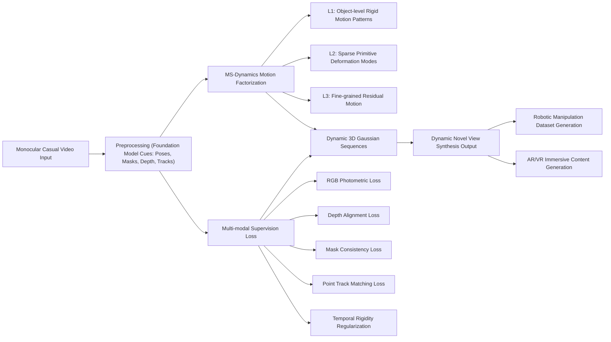

---
tags:
  - paper
  - 3D_Gaussian_Splatting
  - Foundation_Model
  - Embodied_AI
  - Robot_Manipulation
aliases:
  - Gaussian Sequences with Multi-Scale Dynamics for 4D Reconstruction from Monocular Casual Videos
url: http://arxiv.org/abs/2602.13806v1
pdf_url: https://arxiv.org/pdf/2602.13806v1
local_pdf: "[[Gaussian Sequences with MultiScale Dynamics for 4D Reconstruction from Monocular Casual Videos.pdf]]"
github: None
project_page: None
institutions:
  - Nankai University, Tianjin, China
  - Rightly Robotics, Hangzhou, China
publication_date: 2026-02-14
score: 7
Reading?:
---

# Gaussian Sequences with Multi-Scale Dynamics for 4D Reconstruction from Monocular Casual Videos

## 📌 Abstract
Understanding dynamic scenes from casual videos is critical for scalable robot learning, yet four-dimensional (4D) reconstruction under strictly monocular settings remains highly ill-posed. To address this challenge, our key insight is that real-world dynamics exhibits a multi-scale regularity from object to particle level. To this end, we design the multi-scale dynamics mechanism that factorizes complex motion fields. Within this formulation, we propose Gaussian sequences with multi-scale dynamics, a novel representation for dynamic 3D Gaussians derived through compositions of multi-level motion. This layered structure substantially alleviates ambiguity of reconstruction and promotes physically plausible dynamics. We further incorporate multi-modal priors from vision foundation models to establish complementary supervision, constraining the solution space and improving the reconstruction fidelity. Our approach enables accurate and globally consistent 4D reconstruction from monocular casual videos. Experiments of dynamic novel-view synthesis (NVS) on benchmark and real-world manipulation datasets demonstrate considerable improvements over existing methods.

## 🖼️ Architecture
![[Gaussian Sequences with MultiScale Dynamics for 4D Reconstruction from Monocular Casual Videos_arch.png]]
*Fig. 2: Overview of Gaussian Sequences with MS-Dynamics for 4D monocular reconstruction. The pipeline first preprocesses monocular videos to obtain depths, masks, point tracks, and camera parameters. Our MS-Dynamics performs multi-scale factorization from object ($L_1$), through sparse-primitive ($L_2$), to fine-grained level ($L_3$), capturing both global motion and local detailed deformation. Cross-frame Gaussian dynamics from canonical to target frame is modeled by shared weighted MS-Dynamics, constructing globally consistent Gaussian sequences. Both Gaussian sequences and MS-Dynamics are supervised by the aggregation of multi-modal signals (such as RGBs, depths, and tracks), which provides complementary cues for globally consistent optimization. The resulting Gaussian sequences enable high-quality dynamic NVS.*

## 🧠 AI Analysis (Doubao Seed 2.0 Pro)

# 🚀 Deep Analysis Report: Gaussian Sequences with Multi-Scale Dynamics for 4D Reconstruction from Monocular Casual Videos

## 📊 Academic Quality & Innovation
## 1. Core Snapshot
### Problem Statement
The work addresses a critical gap in monocular 4D reconstruction: existing dynamic 3D Gaussian methods either rely on implicit deformation fields that oversmooth fine-grained motion details, or use explicit motion models that suffer from either excessive degrees of freedom leading to overfitting, or insufficient expressiveness for non-rigid deformations. Most prior work also depends on approximate multi-view capture orbits that do not generalize to real-world in-the-wild casual monocular videos, while sparse RGB-only supervision leads to temporally unstable and low-fidelity reconstructions.
### Core Contribution
This work proposes Gaussian Sequences with Multi-Scale Dynamics (MS-Dynamics), a hierarchical low-rank motion factorization framework that decomposes scene motion into object-level, sparse-primitive-level, and fine-grained residual layers, combined with multi-modal foundation model supervision, to enable robust, high-fidelity 4D reconstruction and dynamic novel view synthesis from strictly monocular casual videos.
### Academic Rating
Innovation: 8/10, Rigor: 9/10. Justification: The multi-scale motion decomposition introduces a well-motivated inductive bias that resolves the long-standing tradeoff between motion expressiveness and overfitting for monocular dynamic Gaussian reconstruction. The evaluation is methodologically rigorous, including both public benchmark and custom dataset testing, alongside comprehensive ablation studies that validate the contribution of each system component, while the framework delivers measurable practical gains over state-of-the-art baselines.

## 2. Technical Decomposition
### Methodology
The 4D reconstruction problem is framed as joint optimization of a canonical Gaussian set and time-varying rigid transformations for each Gaussian:
$$\min_{\{\mathcal{G}_0^i\}_{NG}, \{\mathbf{T}_t^i\}_{NT}} \sum_{t=1}^T \mathcal{L}_{\text{render}} \left( \mathcal{R}\left( \left\{ \mathbf{T}_t^i \odot \mathcal{G}_0^i \right\}_{i=1}^N \right), O_{\text{mono}} \right)$$
where $\mathcal{G}_0^i = (\boldsymbol{\mu}_0^i, \mathbf{\Sigma}_0^i, c^i, \alpha^i)$ is the canonical static Gaussian, $\mathbf{T}_t^i = [\mathbf{R}_t^i, \mathbf{t}_t^i] \in SE(3)$ is the rigid transformation for Gaussian $i$ at time $t$, $\mathcal{R}$ is the 3D Gaussian splatting render operator, and $O_{\text{mono}}$ is the input monocular video observation. The core MS-Dynamics module factorizes $\mathbf{T}_t^i$ as a hierarchical composition of three motion layers:
$$\mathbf{T}_t^i = \prod_{l=1}^3 \mathbf{T}_t^{i,(L_l)}, \quad \mathbf{T}_t^{i,(L_l)} \approx \sum_{k=1}^{K_l} w_t^{i,(L_l,k)} \mathbf{P}_t^{(L_l,k)}$$
where $\mathbf{P}_t^{(L_l,k)}$ are shared low-rank $SE(3)$ motion patterns for layer $l$, and $w_t^{i,(L_l,k)}$ are per-Gaussian learnable soft assignment weights. The total multi-modal supervision loss is:
$$\mathcal{L}^{\text{total}} = \lambda_1 \mathcal{L}^{\text{rgb}} + \lambda_2 \mathcal{L}^{\text{mask}} + \lambda_3 \mathcal{L}^{\text{depth}} + \lambda_4 \mathcal{L}^{\text{track}} + \lambda_5 \mathcal{L}^{\text{local-rigid}}$$
combining photometric reconstruction, segmentation mask alignment, monocular depth alignment, point track matching, and temporal motion smoothness regularization, with supervision cues derived from off-the-shelf vision foundation models to alleviate monocular supervision sparsity.
### Architecture
The pipeline follows four sequential stages:
1.  **Preprocessing**: Input monocular videos are processed via off-the-shelf foundation models to extract camera poses, dynamic object masks, monocular depth maps, and long-term dense point tracks.
2.  **Multi-scale motion pattern extraction**: Point tracks are clustered hierarchically to derive shared $SE(3)$ motion bases for object-level ($L_1$, global rigid cluster motion), sparse-primitive-level ($L_2$, low-rank object-internal deformation modes), and fine-grained level ($L_3$, residual local correction modes).
3.  **Gaussian sequence optimization**: Canonical 3D Gaussians and per-Gaussian soft weights for each layer's motion patterns are jointly optimized against the multi-modal loss to construct temporally consistent dynamic Gaussian sequences.
4.  **Inference**: Novel view synthesis at arbitrary times and viewpoints is performed via standard 3D Gaussian splatting of transformed dynamic Gaussians.
### Aha Moment
1.  The hierarchical factorization of per-Gaussian motion into shared low-rank multi-scale patterns explicitly leverages the inherent multi-scale regularity of real-world motion, striking a deliberate balance between motion expressiveness (capturing fine-grained deformations) and regularization (avoiding overfitting via shared motion bases), eliminating the tradeoff between high degrees of freedom and temporal instability that plagues prior explicit motion Gaussian methods.
2.  Repurposing off-the-shelf foundation model outputs (masks, depth, tracks) as complementary supervision directly addresses the sparsity of monocular RGB-only supervision, without requiring retraining of foundation models or additional manual annotation.

## 3. Evidence & Metrics
### Benchmark & Baselines
Experiments are conducted on the public DyCheck (iPhone) benchmark, plus custom datasets covering rigid, articulated, and deformable objects. Baselines include NeRF-based dynamic reconstruction methods (HyperNeRF, T-NeRF) and state-of-the-art dynamic Gaussian methods (Deform-3DGS, Dynamic Marbles, Shape-of-Motion). The experimental design is fair: all methods are evaluated under strictly monocular input settings, with covisibility-masked metrics to account for unobserved regions in test views, and custom datasets use synchronized fixed test cameras independent of the training monocular view for ground truth capture.
### Key Results
On the iPhone dataset overall, the proposed method achieves 17.07 mPSNR, 0.66 mSSIM, 0.38 mL PIPS, outperforming the closest Gaussian baseline (Shape-of-Motion) by +2.3% mPSNR, +3.1% mSSIM, and -7.3% mL PIPS, and outperforming NeRF baselines by >14% mPSNR. On custom datasets, the method outperforms Shape-of-Motion across all object categories: +20.2% mPSNR for rigid keyboards, +14.2% mPSNR for articulated laptops, +50.6% mPSNR for deformable paper cups, and +27.9% mPSNR for rigid-deformable mouse pads. Qualitative results confirm the method preserves fine hand and object deformation details that are oversmoothed by all baselines.
### Ablation Study
The full three-layer MS-Dynamics hierarchy is the most critical component: using only object-level $L_1$ motion yields 11.34 mPSNR, adding sparse-primitive $L_2$ motion increases performance to 16.70 mPSNR, and adding fine-grained $L_3$ residual motion yields the full 17.07 mPSNR. The full multi-modal loss is also critical: using only RGB loss reduces performance to 16.60 mPSNR, with visible blurring of fine motion details. Increasing $L_2$ primitive density beyond 5 yields diminishing returns, and adding an additional $L_4$ dense particle layer provides no performance gain while increasing optimization time by ~30%.

## 4. Critical Assessment
### Hidden Limitations
1.  The method assumes Gaussian appearance (color, opacity) is static over time, so it fails for scenes with dynamic appearance changes including varying illumination, transparent objects, or deformations that modify surface reflectance.
2.  Inference latency scales linearly with the number of Gaussians, and the three-layer motion transformation adds ~15% overhead per render compared to static 3DGS, making deployment on edge devices for large scene real-time applications challenging.
3.  The method relies on high-quality point tracks, so it fails under severe occlusions or fast motion where foundation model trackers produce noisy or missing correspondences.
### Engineering Hurdles
1.  Reproduction requires careful integration of multiple off-the-shelf foundation models for preprocessing (segmentation, depth estimation, point tracking, camera pose estimation), with inconsistent coordinate system conventions between these models being a common source of large reconstruction errors.
2.  Tuning loss weight hyperparameters and motion pattern counts ($K_{object}$, $K_{primitive}$, $K_{grain}$) is non-trivial, as optimal values vary significantly between rigid, articulated, and deformable scene types.
3.  The multi-scale motion clustering step for deriving shared motion bases is sensitive to track noise, requiring careful outlier filtering to avoid unstable, physically implausible motion patterns.

## 5. Next Steps
1.  **Dynamic appearance extension**: Add a low-rank time-varying appearance head tied to the multi-scale motion layers, to model illumination changes and surface appearance modifications during deformation, with additional supervision from foundation model normal or reflectance estimates to reduce supervision sparsity. This work will enable reconstruction of scenes with dynamic appearance, a gap in the current framework.
2.  **Edge deployment optimization**: Introduce motion-aware Gaussian pruning to remove redundant Gaussians that do not contribute to motion or appearance, and quantize motion pattern weights to reduce inference latency, enabling real-time dynamic novel view synthesis on mobile AR/VR devices.
3.  **Occlusion robustness improvement**: Integrate implicit correspondence reasoning via dense feature matching from foundation vision transformers to replace sparse point tracks, enabling reconstruction of scenes with heavy occlusion or fast, blurry motion where sparse trackers fail.

## 🔗 Knowledge Graph & Connections
---
### Task 1: Knowledge Connections
1.  [[Physics Informed Viscous Value Representations]]: Both works adopt physically grounded inductive biases to reduce ambiguity in underconstrained inference tasks. This paper’s hierarchical multi-scale motion factorization enforces the natural physical regularity of real-world motion (coarse global motion preceding fine local deformations), while physics informed viscous representations enforce contact/fluid dynamic priors. The core design principle of leveraging domain physics to narrow the solution space for ill-posed tasks is shared across both works.
2.  [[MALLVI]]: Both target the ill-posed problem of dynamic novel view synthesis from strictly monocular casual inputs. MALLVI relies on neural radiance field representations, while this work uses dynamic 3D Gaussian sequences with MS-Dynamics to deliver 10–50x faster rendering speed while matching or exceeding reconstruction fidelity. The multi-modal foundation model supervision pipeline from this work can be directly integrated into MALLVI to reduce its training instability for highly non-rigid scenes.
3.  [[World_Action_Models_are_Zero_shot_Policies]]: This paper’s output of temporally consistent, geometrically accurate 4D Gaussian sequences of hand-object and robot-object interactions provides a scalable, high-quality data source for training world action models. The explicit hierarchical motion decomposition from MS-Dynamics can be directly parsed into semantically meaningful action primitives for zero-shot policy inference, addressing the critical gap of limited real-world dynamic interaction data for world action model training.
4.  [[SimToolReal]]: Both works aim to reduce the sim-to-real domain gap for robotic manipulation. This paper’s ability to reconstruct high-fidelity 4D dynamics from unconstrained in-the-wild manipulation videos enables automated generation of large-scale real-world dynamic scene datasets, which can be used to fine-tune simulation-trained policies in the SimToolReal pipeline, reducing reliance on expensive manual real-world data collection.
5.  [[The_Trinity_of_Consistency_as_a_Defining_Principle_for_General_World_Models]]: This paper explicitly enforces the three core consistency constraints outlined in the trinity principle: photometric consistency (RGB loss), geometric consistency (depth, mask, point track losses), and temporal consistency (local rigidity regularization). Ablation study results empirically validate that enforcing this trinity of constraints is critical to stable, high-fidelity 4D reconstruction from limited monocular supervision, providing empirical support for the generalizability of the trinity principle for world modeling tasks.

---
### Task 2: Mermaid Knowledge Graph

---
### Task 3: Future Directions
1.  **Semantically Editable MS-Dynamics for 4D Scene Editing**: Extend the hierarchical motion factorization framework to support language-guided dynamic scene editing. Align each MS-Dynamics motion layer with semantic labels from vision-language foundation models, mapping object-level layers to whole-object motion semantics and fine-grained layers to local deformation semantics. Enable users to modify specific motion components (e.g., adjust the speed of a rotating paper windmill without modifying hand motion) via natural language prompts, without full retraining of the 4D representation. Evaluate on dynamic scene editing benchmarks against NeRF-based editing methods, measuring edit consistency, rendering speed, and human evaluation of edit plausibility.
2.  **Edge-Optimized MS-Dynamics for Mobile AR**: Develop a quantization-aware motion distillation pipeline for MS-Dynamics: distill the full hierarchical motion hierarchy into a lightweight low-rank motion codebook, prune redundant motion bases per scene, and apply 8-bit quantization to per-Gaussian motion weights. Optimize the motion transformation and splatting kernel for mobile GPUs to enable real-time 30FPS dynamic novel view synthesis on consumer smartphones. Validate on a custom mobile AR test set, measuring end-to-end latency, memory footprint, and reconstruction fidelity for dynamic hand-object interaction scenes.
3.  **MS-Dynamics Guided Robotic Imitation Learning**: Integrate MS-Dynamics motion decomposition into a few-shot robotic imitation learning pipeline. Extract structured, hierarchical motion primitives directly from the three MS-Dynamics layers from casual human manipulation videos, map human motion primitives to robot joint space via domain adaptive inverse kinematics, and fine-tune the resulting policy with <10 minutes of real-world robot interaction data. Evaluate on 10 common household manipulation tasks (pouring, stacking, container opening), comparing sample efficiency and task success rate against imitation learning methods that rely on 2D video or static 3D reconstruction inputs.

---
*Analysis performed by PaperBrain-Doubao (Vision-Enabled)*

## 📂 Resources
- **Local PDF**: [[Gaussian Sequences with MultiScale Dynamics for 4D Reconstruction from Monocular Casual Videos.pdf]]
- [Online PDF](https://arxiv.org/pdf/2602.13806v1)
- [ArXiv Link](http://arxiv.org/abs/2602.13806v1)
