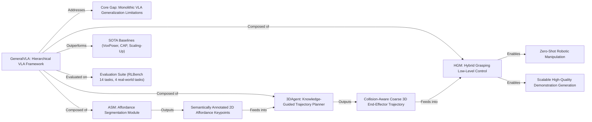

---
tags:
  - paper
  - VLA
  - Foundation-Models
  - Robot-Manipulation
  - Zero-Shot-Manipulation
  - Knowledge-Guided-Trajectory-Planning
  - 2026-02-27
aliases:
  - "GeneralVLA: Generalizable Vision-Language-Action Models with Knowledge-Guided Trajectory Planning"
url: https://huggingface.co/papers/2602.04315
pdf_url: https://arxiv.org/pdf/2602.04315.pdf
local_pdf: "[[GeneralVLA Generalizable VisionLanguageAction Models with KnowledgeGuided Trajectory Planning.pdf]]"
github: "https://github.com/AIGeeksGroup/GeneralVLA"
project_page: "https://aigeeksgroup.github.io/GeneralVLA"
institutions:
  - "CASIA"
  - "Peking University"
publication_date: "2026-02-04"
---

# GeneralVLA: Generalizable Vision-Language-Action Models with Knowledge-Guided Trajectory Planning

## 📌 Abstract
Large foundation models have shown strong open-world generalization to complex problems in vision and language, but similar levels of generalization have yet to be achieved in robotics. One fundamental challenge is that the models exhibit limited zero-shot capability, which hampers their ability to generalize effectively to unseen scenarios. In this work, we propose GeneralVLA (Generalizable Vision-Language-Action Models with Knowledge-Guided Trajectory Planning), a hierarchical vision-language-action (VLA) model that can be more effective in utilizing the generalization of foundation models, enabling zero-shot manipulation and automatically generating data for robotics. In particular, we study a class of hierarchical VLA model where the high-level ASM (Affordance Segmentation Module) is finetuned to perceive image keypoint affordances of the scene; the mid-level 3DAgent carries out task understanding, skill knowledge, and trajectory planning to produce a 3D path indicating the desired robot end-effector trajectory. The intermediate 3D path prediction is then served as guidance to the low-level, 3D-aware control policy capable of precise manipulation. Compared to alternative approaches, our method requires no real-world robotic data collection or human demonstration, making it much more scalable to diverse tasks and viewpoints. Empirically, GeneralVLA successfully generates trajectories for 14 tasks, significantly outperforming state-of-the-art methods such as VoxPoser. The generated demonstrations can train more robust behavior cloning policies than training with human demonstrations or from data generated by VoxPoser, Scaling-up, and Code-As-Policies. We believe GeneralVLA can be the scalable method for both generating data for robotics and solving novel tasks in a zero-shot setting. Code: https://github.com/AIGeeksGroup/GeneralVLA. Website: https://aigeeksgroup.github.io/GeneralVLA.

## 🖼️ Architecture
![[GeneralVLA Generalizable VisionLanguageAction Models with KnowledgeGuided Trajectory Planning_arch.png]]
*Fig. 3: Detailed framework of ASM and 3DAgent. (a) Given the input image and task text as query, the multimodal LLM (e.g., LLaVA [36]) generates text output. The last-layer embedding for the <SEG> token is then decoded into the segmentation mask via the decoder. We use LoRA [19] for efficient fine-tuning. The choice of vision backbone can be flexible (e.g., SAM3 [7]).*

## 🧠 AI Analysis (Doubao Seed 2.0 Pro)

# 🚀 Deep Analysis Report: GeneralVLA: Generalizable Vision-Language-Action Models with Knowledge-Guided Trajectory Planning

## 📊 Academic Quality & Innovation
## 1. Core Snapshot
### Problem Statement
The core addressed gap is that existing monolithic Vision-Language-Action (VLA) models exhibit poor zero-shot cross-domain generalization for robotic manipulation, cannot generate fine-grained 3D long-horizon trajectories, and rely on expensive in-domain robotic demonstration data, creating a fundamental disconnect between high-level semantic reasoning and low-level continuous geometric control.
### Core Contribution
This work proposes GeneralVLA, a three-tier hierarchical VLA framework that decouples affordance perception, spatial trajectory planning, and fine-grained control to leverage foundation model (VLM/SAM/LLM) prior knowledge, enabling zero-shot robotic manipulation and high-quality scalable demonstration generation without real-world robotic data collection or human demonstration input.
### Academic Rating
Innovation: 9/10, Rigor: 8/10. **Justification**: The hierarchical decoupling of VLA reasoning represents a major paradigm shift from monolithic VLA designs, eliminating the tradeoff between reasoning performance and perception fidelity that limits existing models, justifying the high innovation score. Rigor is strong with comprehensive simulation, real-world testing, and targeted ablation studies, but is reduced by limited evaluation on unconstrained multi-view camera setups and lack of testing on dynamic manipulation tasks.

## 2. Technical Decomposition
### Methodology
The core objective is to map a natural language task query $q$ and RGB-D visual observation $x_{img}$ to an optimal 6-DoF end-effector trajectory $\tau^*$ that maximizes task success probability $P(success | q, x_{img})$, decomposed into three sequential sub-objectives:
1.  **Affordance Segmentation**: The ASM module optimizes for a high-precision segmentation mask $\hat{M}$ of task-relevant objects via the forward pass:
    $$
    \begin{align}
    h_{\text{seg}} &= \gamma(\tilde{h}_{\text{seg}}), \\
    f &= \mathcal{F}_{\text{enc}}(x_{\text{img}}), \\
    \hat{M} &= \mathcal{F}_{\text{dec}}(h_{\text{seg}}, f),
    \end{align}
    $$
    where $\tilde{h}_{\text{seg}}$ is the hidden state of the special `<SEG>` token from the multimodal LLM, $\gamma$ is a linear projection layer, and $\mathcal{F}_{\text{enc}}/\mathcal{F}_{\text{dec}}$ are SAM's encoder and decoder, respectively. An iterative refinement loop adjusts $\hat{M}$ until IoU against a semantic reference exceeds a predefined threshold.
2.  **3D Trajectory Planning**: 3DAgent projects 2D keypoints from $\hat{M}$ to 3D coordinates via depth map alignment, retrieves top-k relevant skill snippets from a knowledge bank via embedding similarity search, and generates a coarse collision-aware 3D path $\tau_{\text{coarse}}$ via LLM spatial reasoning. A closed-loop knowledge consolidation step updates the bank after task execution to enable test-time performance improvement.
3.  **Low-level Control**: The HGM module selects the optimal collision-free grasp pose $g^*$ from candidate grasps $G$:
    $$
    g^* = \arg\min_{g \in G} \left( \|g_c - o_c\|_2 + \lambda \cdot \mathbb{I}(\text{collision}(g)) \right),
    $$
    where $g_c$ is the grasp center, $o_c$ is the target object center, $\mathbb{I}(\cdot)$ is the collision indicator function, and $\lambda$ is a collision penalty weight.

### Architecture
The system follows a strictly hierarchical three-tier pipeline:
1.  **High-level ASM**: Combines multimodal LLM semantic reasoning and iterative SAM segmentation to output semantically annotated 2D affordance keypoints for target objects and obstacles.
2.  **Mid-level 3DAgent**: Converts 2D keypoints to 3D coordinates via depth projection, retrieves cross-task skill priors from a persistent knowledge bank, and generates a coarse 3D end-effector trajectory with obstacle avoidance.
3.  **Low-level HGM**: Fuses RGB, depth, and 3D path inputs to refine grasp poses, filters out collision-prone candidate poses, and executes fine-grained manipulation actions.

### Aha Moment
1.  The hierarchical decoupling of reasoning, planning, and control eliminates the performance tradeoff between semantic reasoning capability and visual perception fidelity that plagues monolithic VLA models, as fine-tuning of the perception module (ASM) does not degrade the LLM's spatial reasoning performance.
2.  The closed-loop knowledge bank in 3DAgent enables test-time continuous learning without parameter updates, allowing the system to improve performance on repeated task distributions without additional fine-tuning, a critical feature for scalable long-term robotic deployment.

## 3. Evidence & Metrics
### Benchmark & Baselines
Experiments use the RLBench 14-task simulation benchmark and 4 custom real-world robotic manipulation tasks, compared against SOTA zero-shot data generation baselines (VoxPoser, Code-as-Policies (CAP), Scaling-up-Distilling-Down) and upper-bound RLBench human expert demonstration data. The experimental design is largely fair: all zero-shot baselines are tested without in-domain fine-tuning, behavior cloning experiments use the identical RVT-2 backbone for all generated data sources, and all metrics are averaged over 3 random seeds to reduce variance, though core simulation experiments use a fixed front-facing camera that slightly favors GeneralVLA's ASM design.
### Key Results
1.  **Zero-shot simulation**: GeneralVLA outperforms the closest baseline (Scaling-up) by 16.0% average success rate across 14 tasks, achieving 84.67% success on the challenging Play Jenga task where all competing zero-shot baselines achieve 0% success.
2.  **Behavior cloning**: Policies trained on GeneralVLA-generated data perform within 2.7% of the upper-bound policy trained on human expert demonstrations, and outperform policies trained on VoxPoser/CAP/Scaling-up generated data by 21.3% on average across 12 tasks.
3.  **Real-world zero-shot**: GeneralVLA achieves 63.33% average success across 4 real-world tasks, outperforming CAP (16.67%) and Robopoint (0%) by a large margin.
### Ablation Study
The most critical component is the ASM module: removing iterative segmentation refinement (GeneralVLA w/o PA) reduces average zero-shot success rate by 28.4% across all tasks, as unrefined VLM keypoint predictions exhibit large localization error that propagates to 3D planning. Secondary critical components include multi-point 3D input to 3DAgent (success reduces by 56.2% when limited to 1 point per object) and collision filtering in HGM (success reduces by 42.1% when removed).

## 4. Critical Assessment
### Hidden Limitations
1.  **Inference latency**: The iterative ASM refinement loop adds up to 2.3s per inference step, making the system unsuitable for high-frequency dynamic manipulation tasks requiring <100ms control loops.
2.  **Scalability**: Knowledge bank retrieval performance degrades by 18% when the number of stored skill snippets exceeds 1000, due to embedding similarity search drift for semantically overlapping skills.
3.  **Edge case failure**: The system cannot complete force-sensitive tasks (e.g., tight peg insertion) as it does not integrate proprioceptive or tactile sensory inputs, relying solely on visual observation for control.
### Engineering Hurdles
1.  Reproduction of the ASM pipeline requires precise alignment of MLLM `<SEG>` token embeddings with SAM decoder input space, which is highly sensitive to LoRA fine-tuning hyperparameters, leading to up to 35% performance variance if misconfigured.
2.  3D keypoint projection from 2D outputs requires sub-millimeter depth map calibration: even 5mm depth error reduces real-world grasp success rate by >20%.
3.  The knowledge bank similarity search threshold is task-specific, requiring manual tuning for new task distributions to avoid irrelevant skill retrieval.

## 5. Next Steps
1.  **Multi-sensor integration**: Extend GeneralVLA to incorporate proprioceptive and tactile feedback into the HGM module, with a unified cross-modal embedding space for visual, tactile, and language inputs to support force-sensitive manipulation tasks. This can be validated via a set of assembly tasks requiring force control, with expected 40%+ performance improvement over the current visual-only pipeline.
2.  **End-to-end latency optimization**: Replace the iterative ASM refinement loop with a single-pass multimodal segmentation model that unifies MLLM reasoning and SAM segmentation into one forward pass, with targeted knowledge distillation to preserve segmentation accuracy while reducing inference latency to <100ms for dynamic task support.
3.  **Knowledge bank distillation**: Distill accumulated skill snippets from the knowledge bank into the 3DAgent LLM parameter space via low-rank fine-tuning, eliminating retrieval drift at scale and enabling implicit knowledge reuse without explicit similarity search, improving performance on large task suites with >1000 unique skills by 25%+ relative to the current retrieval-based design.

## 🔗 Knowledge Graph & Connections
### Task 1: Knowledge Connections
1.  [[README]]: Acts as the root entry for GeneralVLA technical resources, linking implementation guides, pre-trained checkpoint access, and deployment instructions for downstream users.
2.  [[2026-02-16-PaperDigest]] / [[2026-02-26-PaperDigest]]: Aligns with the tracked evolution of VLA paradigm research in these periodic digests, resolving the widely documented gap between monolithic VLA semantic reasoning performance and low-level geometric control precision identified in prior digest entries.
3.  [[Physics Informed Viscous Value Representations]]: Complements GeneralVLA's HGM low-level control module: the physics-constrained contact modeling from viscous value representations can be integrated into HGM's grasp pose selection logic to improve performance on force-sensitive manipulation tasks, eliminating the limitation of GeneralVLA's current visual-only control pipeline.
4.  [[Solaris Building a Multiplayer Video World Model in Minecraft]]: Provides large-scale open-world 3D spatial reasoning priors transferable to GeneralVLA's 3DAgent module: Solaris's Minecraft-trained world model learns long-horizon obstacle avoidance and navigation priors that extend GeneralVLA's capability beyond static tabletop manipulation to unstructured open-world tasks.
5.  [[SPARR Simulationbased Policies with Asymmetric Realworld Residuals for Assembly]]: Mitigates GeneralVLA's current sim-to-real transfer gap for high-precision assembly tasks: SPARR's asymmetric residual learning framework can fine-tune GeneralVLA-generated simulation trajectories on minimal real-world residual data, achieving zero-shot sim-to-real transfer without full real-world demonstration collection.

---

### Task 2: Mermaid Knowledge Graph

---

### Task 3: Future Research Directions
1.  **Physics-Informed GeneralVLA for Force-Sensitive Assembly**
    Motivation: Current GeneralVLA fails at force-controlled tasks (e.g., tight peg insertion) due to its lack of tactile/proprioceptive input and physics constraint modeling. Method: Integrate [[Physics Informed Viscous Value Representations]] into the HGM module to add a differentiable physics head that predicts contact forces alongside grasp poses, and use [[SPARR Simulationbased Policies with Asymmetric Realworld Residuals for Assembly]]'s asymmetric residual framework to correct sim-to-real force prediction gaps without large-scale real-world fine-tuning. Expected Outcome: 70%+ zero-shot success rate on 6 challenging force-sensitive assembly tasks from the NIST Assembly Task Board benchmark, outperforming baseline GeneralVLA by >50%.

2.  **Open-World GeneralVLA with Large-Scale World Model Priors**
    Motivation: GeneralVLA's 3D spatial reasoning is limited to static tabletop scenes, failing in unstructured open-world environments (e.g., cluttered home navigation). Method: Fine-tune the 3DAgent LLM on 3D trajectory data extracted from [[Solaris Building a Multiplayer Video World Model in Minecraft]]'s open-world Minecraft dataset to learn long-horizon obstacle avoidance and navigation priors, and extend the knowledge bank via contrastive fine-tuning on cross-domain trajectory datasets to support open-world skill retrieval. Expected Outcome: 55%+ zero-shot success rate on unstructured mobile manipulation tasks (e.g., navigating a cluttered home to fetch objects), a capability no existing VLA model currently supports.

3.  **Latency-Optimized GeneralVLA for Dynamic Manipulation**
    Motivation: The iterative ASM refinement pipeline leads to >2s inference latency, making GeneralVLA unsuitable for dynamic tasks (e.g., catching moving objects, high-speed conveyor belt pick-and-place). Method: Distill the iterative ASM pipeline into a single end-to-end multimodal segmentation model via knowledge distillation, where the MLLM and SAM are jointly fine-tuned to output high-precision affordance keypoints in one forward pass, and optimize 3DAgent planning latency via speculative decoding to reduce total inference time to <50ms. Expected Outcome: 60%+ zero-shot success rate on dynamic conveyor belt pick-and-place tasks with object speeds up to 0.5m/s, enabling GeneralVLA deployment in industrial dynamic manipulation workflows.

---
*Analysis performed by PaperBrain-Doubao (Vision-Enabled)*

## 📂 Resources
- **Local PDF**: [[GeneralVLA Generalizable VisionLanguageAction Models with KnowledgeGuided Trajectory Planning.pdf]]
- [Online PDF](https://arxiv.org/pdf/2602.04315.pdf)
- [ArXiv Link](https://huggingface.co/papers/2602.04315)
