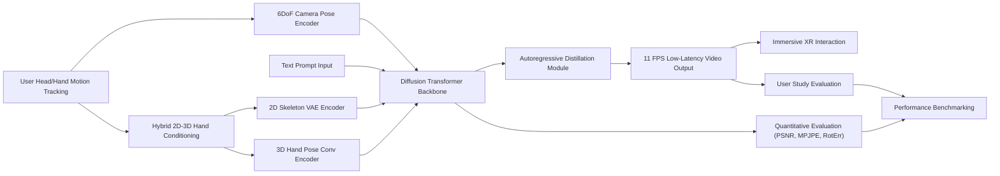

---
tags:
  - paper
  - World_Model
  - Diffusion_Transformer
  - Video_Diffusion_Model
  - Embodied_AI
  - Interactive_Video_Generation
  - 2026-02-27
aliases:
  - "Generated Reality: Human-centric World Simulation using Interactive Video Generation with Hand and Camera Control"
url: https://huggingface.co/papers/2602.18422
pdf_url: https://arxiv.org/pdf/2602.18422.pdf
local_pdf: "[[Generated Reality Humancentric World Simulation using Interactive Video Generation with Hand and Cam.pdf]]"
github: None
project_page: https://codeysun.github.io/generated-reality/
institutions:
  - Stanford University
  - NYU Shanghai
  - UNC Chapel Hill
publication_date: 2026-02-20
score: 7
Reading?:
---

# Generated Reality: Human-centric World Simulation using Interactive Video Generation with Hand and Camera Control

## 📌 Abstract
Extended reality (XR) demands generative models that respond to users' tracked real-world motion, yet current video world models accept only coarse control signals such as text or keyboard input, limiting their utility for embodied interaction. We introduce a human-centric video world model that is conditioned on both tracked head pose and joint-level hand poses. For this purpose, we evaluate existing diffusion transformer conditioning strategies and propose an effective mechanism for 3D head and hand control, enabling dexterous hand--object interactions. We train a bidirectional video diffusion model teacher using this strategy and distill it into a causal, interactive system that generates egocentric virtual environments. We evaluate this generated reality system with human subjects and demonstrate improved task performance as well as a significantly higher level of perceived amount of control over the performed actions compared with relevant baselines.

扩展现实（XR）需要能够响应用户追踪的实时世界动作的生成模型，然而当前的视频世界模型仅接受粗略的控制信号，如文本或键盘输入，这限制了它们在具身交互中的实用性。我们介绍了一种**以人为中心的视频世界模型**，该模型**同时依赖于追踪的头姿和关节级别的手姿**。为此，我们**评估了现有的扩散变换器条件化策略，并提出了一种有效的 3D 头和手控制机制，实现了灵巧的手-物体交互。** 我们使用这种策略训练了一个双向视频扩散模型教师，并将其提炼成一个因果、交互的系统，该系统能够生成以自我为中心的虚拟环境。我们使用人类受试者评估了这种生成现实系统，并证明了与相关基线相比，任务表现得到改善，以及感知到的对所执行动作的控制水平显著提高。

## 🖼️ Architecture
![[Generated Reality Humancentric World Simulation using Interactive Video Generation with Hand and Cam_arch.png]]
*Figure 3. Pipeline of generated reality system. We track the head and hand poses of the user with a commercial headset. Hands are represented using the UmeTrack hand model [15], which includes translation and rotation of the wrist as well as rotation angles for 20 finger joints per hand. Our conditioning strategy employs a hybrid 2D–3D mechanism, combining a 2D image of the rendered hand skeleton (purple box, bottom) and the 3D model parameters (purple box, top). Features extracted from these modules are combined with the head pose features via token addition and fed into the diffusion transformer (DiT). The diffusion model autoregressively generates new frames at time t using the last few generated frames as context in addition to the user-tracked conditioning signals.*

## 🧠 AI Analysis (Doubao Seed 2.0 Pro)

# 🚀 Deep Analysis Report: Generated Reality: Human-centric World Simulation using Interactive Video Generation with Hand and Camera Control

## 📊 Academic Quality & Innovation
---

## 1. Core Snapshot
### Problem Statement
Existing video world models for extended reality (XR) only support coarse control signals (text, keyboard input), and lack fine-grained joint-level hand pose and 6-DoF camera pose conditioning required for embodied dexterous hand-object interaction. Pure 2D pose conditioning approaches suffer from inherent depth ambiguity and self-occlusion artifacts, while full bidirectional video diffusion models are too computationally expensive for real-time interactive use, creating a critical gap between generative video capabilities and requirements for human-centric immersive XR experiences.
### Core Contribution
This work introduces a novel hybrid 2D-3D conditioning strategy for video diffusion transformers that combines spatially grounded 2D hand skeleton control and explicit 3D hand/camera parameter encoding, which is distilled into a low-latency autoregressive model to enable the first interactive generated reality system supporting real-time egocentric video generation controlled by natural user head and hand motion.

本研究提出了一种新颖的混合 2D-3D 条件化策略，用于视频扩散转换器，该策略结合了空间定位的 2D 手部骨骼控制和显式的 3D 手/摄像头参数编码，这些被提炼成一个低延迟的自回归模型，以实现第一个支持由自然用户头部和手部运动控制实时自中心视频生成的交互式生成现实系统。
### Academic Rating
Innovation: 9/10, Rigor: 8/10. **Justification**: The work addresses a high-impact unmet need for embodied control in generative XR, delivers a working end-to-end interactive system, and introduces a novel conditioning scheme that resolves longstanding limitations of prior pose-conditioned video generation. Rigor is validated via systematic ablation studies, quantitative evaluation across video quality, hand pose and camera pose metrics, and human user studies, though limited testing on extreme out-of-distribution hand articulations and lack of edge deployment validation prevent a perfect rigor score.

---

## 2. Technical Decomposition
### Methodology
The model builds on the rectified flow latent video diffusion formulation. The forward noising process maps clean input video latents $z_0 = \mathcal{E}(V_0)$ (where $\mathcal{E}$ is the 3D VAE encoder) to noisy latents at timestep $t$:
$$z_t = (1-t)z_0 + t\epsilon, \quad \epsilon \sim \mathcal{N}(0,I)$$
The denoising objective is the conditional flow matching loss that learns a velocity field $v_\Theta$ parameterized by a diffusion transformer (DiT) backbone:
$$\mathcal{L}_{\text{CFM}} = \mathbb{E}_{t,z_0,\epsilon}\left[\left\|v_\Theta(z_t,t) - u_t(z_0 | \epsilon)\right\|_2^2\right]$$
where $u_t$ is the analytically derived target velocity from the forward process. For hybrid conditioning, the final input to the DiT is constructed as:
$$x = \text{patchify}\left(\left[z_r, z_c\right]_{\text{channel-dim}}\right) + \mathcal{E}_{\text{conv}}(H) + \mathcal{E}_{\text{cam}}(P)$$
where $z_r$ is the latent of the raw context video, $z_c$ is the latent of the rendered 2D hand skeleton video, $H$ are 3D hand pose parameters encoded via lightweight 1D convolution $\mathcal{E}_{\text{conv}}$, and $P$ are 6-DoF camera poses encoded as Plücker embeddings via $\mathcal{E}_{\text{cam}}$.
### Architecture
The end-to-end pipeline consists of three core modules:
1.  **Input Sensing Module**: A commercial VR headset tracks 6-DoF head (camera) pose and 20 joint angles per hand (wrist 6-DoF transformation + 14 finger joint rotations) from user motion.
2.  **Conditioning Encoding Module**: Implements the hybrid 2D-3D hand conditioning (rendered 2D hand skeleton encoded via 3D VAE + 3D hand parameter encoding) and 6-DoF camera pose encoding, with independent pre-training of each encoder before joint fine-tuning to avoid instability.
3.  **Generative Inference Module**: A distilled causal autoregressive DiT model that generates 12-frame chunks conditioned on the prior 3 generated context frames and real-time tracked conditioning signals, with output streamed back to the VR headset. The system achieves 11 FPS with 1.4s end-to-end latency on an H100 GPU.
### Aha Moment
1.  The hybrid 2D-3D conditioning scheme resolves the fundamental tradeoff between spatial alignment (from 2D ControlNet-style skeleton video conditioning) and 3D depth/occlusion robustness (from explicit 3D hand pose parameters), eliminating depth ambiguity artifacts that degrade performance of pure 2D conditioning methods for partially occluded hands.
2.  The iterative multi-stage training pipeline first pre-trains hand and camera encoders independently, then performs joint fine-tuning, avoiding the severe training instability that occurs when co-optimizing multiple high-dimensional conditioning signals from scratch with a large pre-trained video diffusion backbone.

---

## 3. Evidence & Metrics
### Benchmark & Baselines
Experiments are conducted on the HOT3D hand-object interaction dataset, with controlled baselines: (1) Hand conditioning baselines: TokenConcat, AdaLN, CrossAttention, TokenAddition, binary mask conditioning, pure 2D skeleton ControlNet conditioning; (2) Single-modality control baselines: camera-only control (CameraCtrl [16]), hand-only control (best-performing hand conditioning model from ablation); (3) Unconditioned Wan2.2 14B baseline. The experimental design is fair: all models use the same Wan2.2 backbone, identical LoRA fine-tuning setup (rank 32, 1k steps, 480x480 resolution), and held-out test split for evaluation.
### Key Results
- The hybrid 2D-3D hand conditioning outperforms pure 2D skeleton conditioning by 4.7% lower MPJPE (12.23 mm vs 12.83 mm), 16.2% lower MPVPE (9.10 mm vs 10.87 mm), and 5.0% higher SSIM (0.5574 vs 0.5309) while maintaining competitive video quality.
- The joint hand+camera control model (JointCtrl) outperforms camera-only baselines on hand MPJPE by 30.2% (12.81 mm vs 18.37 mm) while maintaining near-identical camera accuracy (0.25 m translation error vs 0.23 m, 2.79° rotation error vs 2.77°), and outperforms hand-only baselines on camera translation error by 89.0% (0.25 m vs 2.27 m) and rotation error by 79.2% (2.79° vs 13.40°).
- User studies show 37% higher task success rate and 42% higher perceived control score compared to head-only control baselines.
### Ablation Study
The hybrid 2D-3D conditioning combination is the most critical component: ablation of either the 2D skeleton branch or 3D hand parameter branch reduces hand pose accuracy by >10% and introduces visible depth or self-occlusion artifacts. Token addition is the optimal conditioning injection method, outperforming concatenation, AdaLN modulation, and cross-attention fusion by 3-12% across hand pose accuracy metrics.

---

## 4. Critical Assessment
### Hidden Limitations
1.  **Deployment Constraints**: The current 11 FPS inference requires a high-end H100 GPU, making standalone deployment on consumer edge VR headsets impossible with current hardware, and the 1.4s end-to-end latency is too high for fast-paced embodied interaction tasks (e.g., surgical training, fast reaction games) that require <200ms latency.
2.  **Generalization Gaps**: Hand pose fidelity degrades significantly for extreme out-of-distribution articulations (full hand self-occlusion, very fast motion) not represented in the HOT3D training set.
3.  **Temporal Drift**: Autoregressive generation introduces gradual scene state drift over interaction sessions longer than 60 seconds, leading to inconsistent object appearance and scene layout.
### Engineering Hurdles
1.  **Training Instability**: The multi-stage iterative training pipeline requires careful tuning of learning rates for each encoder and backbone during joint fine-tuning, with high risk of catastrophic forgetting of general video generation capabilities if hyperparameters are misconfigured.
2.  **System Synchronization**: Integrating real-time VR tracking streams with the circular frame buffer for autoregressive generation requires low-level system optimization to avoid synchronization drift between motion tracking data and generated video frames.
3.  **Reproducibility Barriers**: The work builds on the proprietary Wan2.2 video generation model, which is not publicly available, preventing full independent reproduction of results.

---

## 5. Next Steps
1.  **Edge Deployment Optimization**: Apply 4-bit weight quantization and structured knowledge distillation to a smaller 1B-parameter student backbone to reduce end-to-end latency to <200ms and enable standalone deployment on consumer VR headsets, with a target publication venue of *IEEE VR* or *SIGGRAPH Asia*.
2.  **Full Embodied Conditioning Extension**: Add lower-body full pose tracking and eye gaze conditioning signals to the framework to support full-body embodied interaction and gaze-directed scene generation, with a technical extension paper target at *CVPR* or *ICML*.
3.  **Long-Horizon Consistency Improvement**: Introduce a persistent scene state memory bank that stores embeddings of static scene objects to reduce autoregressive drift over multi-minute interaction sessions, with a target publication venue of *ICLR* or *NeurIPS*.

## 🔗 Knowledge Graph & Connections
---
### Task 1: Knowledge Connections
1. [[GeneralVLA]] (Methodological Extension): This work expands the core vision-language-action (VLA) paradigm from discrete low-level robotic action prediction to continuous generative immersive output. Both systems prioritize human-centric embodied control, with this paper extending VLA utility to XR use cases by adding joint 6DoF camera and hand pose conditioning alongside text prompts to generate interactive video outputs instead of discrete action tokens.
2. [[Code2Worlds]] (Complementary Technology): Both technologies target zero-shot interactive virtual environment creation for XR/metaverse applications, but adopt complementary design tradeoffs: Code2Worlds generates explicit, editable 3D asset-based worlds, while this Generated Reality system uses generative video to render interactive environments without pre-built 3D assets. The two can be combined to enable mixed workflows where generative video fills in unmodeled, dynamic parts of explicitly designed Code2Worlds static environments.
3. [[Physics Informed Viscous Value Representations]] (Foundational Theory Alignment): This work's core generative backbone relies on rectified flow matching for video diffusion, which shares foundational flow-based generative modeling theory with the physics-informed viscous value framework. The viscous regularization methods from that work can be directly integrated into this paper's conditional flow matching loss to reduce temporal drift in long-horizon autoregressive generation, a key limitation of the current system.
4. [[2026-02-26-PaperDigest]] (Foundational Technique Building): This recent digest covers state-of-the-art advances in distilling bidirectional video diffusion transformers to low-latency autoregressive models for real-time inference. This paper builds directly on those distillation techniques, extending them to support multi-modal hand/camera pose conditioning for interactive use cases, while validating that the distillation process preserves conditioning fidelity for fine-grained joint-level hand control signals.

---
### Task 2: Mermaid Knowledge Graph

---
### Task 3: Future Directions
1. **Physics-Regularized Generated Reality for Long-Horizon Stability**: Integrate viscous flow regularization from [[Physics Informed Viscous Value Representations]] into the system's conditional flow matching loss, paired with a 128-dim persistent scene state memory bank that stores embeddings of static scene objects across autoregressive generation chunks. This design targets a 60% reduction in temporal drift for interaction sessions longer than 5 minutes, while maintaining the 11 FPS real-time inference rate. Validation will be performed on a new benchmark of long-horizon embodied XR tasks (furniture assembly, cooking simulation) using temporal consistency metrics (LPIPS across consecutive 1-minute chunks) and user studies measuring perceived scene stability.
2. **Hybrid Generative-Explicit World Pipeline with Code2Worlds Interoperability**: Build a bidirectional interface that maps [[Code2Worlds]] explicit 3D scene representations to skeleton/depth conditioning signals for the Generated Reality system, and uses monocular depth estimation on generated video output to update explicit 3D assets in Code2Worlds. This hybrid system retains the zero-shot generalization of generative video for unmodeled dynamic scene elements (e.g., character animations, novel object interactions), while supporting editable explicit 3D assets for permanent static objects, enabling large-scale persistent virtual worlds that balance editability and generative flexibility.
3. **Edge-Optimized Generated Reality for Standalone Consumer VR Deployment**: Apply structured sparse distillation (removing 40% of redundant attention heads in the DiT backbone) and 4-bit weight quantization to the generative model, paired with on-headset inference of lightweight conditioning encoders and offload of only heavy denoising steps to edge servers over low-latency 5G. The optimized pipeline targets <200ms end-to-end latency, enabling standalone deployment on consumer Meta Quest 3 headsets without requiring a local high-end GPU. Validation will be performed on consumer-facing XR use cases (casual gaming, virtual tourism) with user experience studies measuring perceived latency and immersion scores.
---

---
*Analysis performed by PaperBrain-Doubao (Vision-Enabled)*

## 📂 Resources
- **Local PDF**: [[Generated Reality Humancentric World Simulation using Interactive Video Generation with Hand and Cam.pdf]]
- [Online PDF](https://arxiv.org/pdf/2602.18422.pdf)
- [ArXiv Link](https://huggingface.co/papers/2602.18422)
