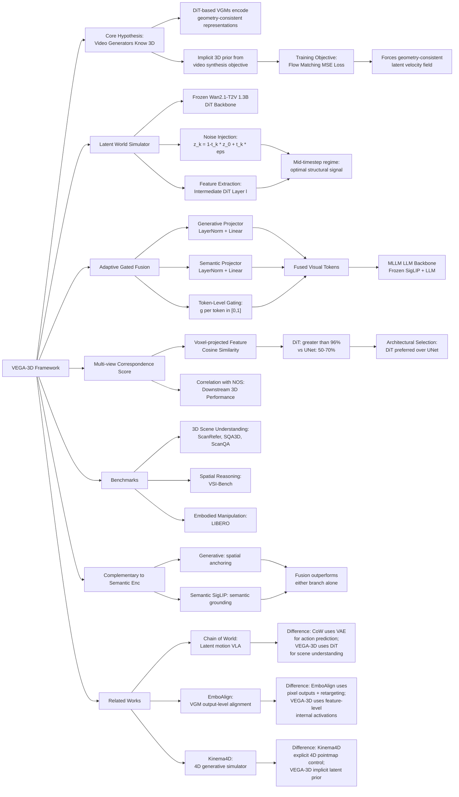

---
tags:
- paper
- domain/3d_perception
- domain/embodied_ai
- domain/multimodal_perception
- domain/reinforcement_learning
- domain/robot_manipulation
- domain/world_model
- impact/high_value
- method/benchmark
- method/diffusion_policy
- method/foundation_model
- method/planning
- method/reinforcement_learning
- method/simulation
- review/auto_tagged
- status/unread
- task/manipulation
- task/planning_reasoning
- task/scene_understanding
- task/video_prediction
- type/benchmark
aliases:
- 'Generation Models Know Space: Unleashing Implicit 3D Priors for Scene Understanding'
url: https://huggingface.co/papers/2603.19235
pdf_url: https://arxiv.org/pdf/2603.19235.pdf
local_pdf: '[[Generation Models Know Space Unleashing Implicit 3D Priors for Scene
  Understanding.pdf]]'
github: https://github.com/H-EmbodVis/VEGA-3D
project_page: None
institutions:
- Huazhong University of Science and Technology
- Baidu Inc.
publication_date: '2026-03-19'
score: '8.0'
domains:
- 3d_perception
- embodied_ai
- multimodal_perception
- reinforcement_learning
- robot_manipulation
methods:
- benchmark
- foundation_model
- planning
- reinforcement_learning
- simulation
tasks:
- manipulation
- planning_reasoning
- scene_understanding
- video_prediction
paper_type: benchmark
impact_band: high_value
reading_status: unread
year: 2026
priority_score: 103
review_status: auto_tagged
next_action: inspect_protocol
arxiv_id: '2603.19235'
paper_id: arxiv:2603.19235
---

# Generation Models Know Space: Unleashing Implicit 3D Priors for Scene Understanding

## 📌 Abstract
While Multimodal Large Language Models demonstrate impressive semantic capabilities, they often suffer from spatial blindness, struggling with fine-grained geometric reasoning and physical dynamics. Existing solutions typically rely on explicit 3D modalities or complex geometric scaffolding, which are limited by data scarcity and generalization challenges. In this work, we propose a paradigm shift by leveraging the implicit spatial prior within large-scale video generation models. We posit that to synthesize temporally coherent videos, these models inherently learn robust 3D structural priors and physical laws. We introduce VEGA-3D (Video Extracted Generative Awareness), a plug-and-play framework that repurposes a pre-trained video diffusion model as a Latent World Simulator. By extracting spatiotemporal features from intermediate noise levels and integrating them with semantic representations via a token-level adaptive gated fusion mechanism, we enrich MLLMs with dense geometric cues without explicit 3D supervision. Extensive experiments across 3D scene understanding, spatial reasoning, and embodied manipulation benchmarks demonstrate that our method outperforms state-of-the-art baselines, validating that generative priors provide a scalable foundation for physical-world understanding. Code is publicly available at https://github.com/H-EmbodVis/VEGA-3D.

## 🖼️ Architecture
![[Generation Models Know Space Unleashing Implicit 3D Priors for Scene Understanding_arch.png]]

## 🧠 AI Analysis

# 🚀 Deep Analysis Report: Generation Models Know Space: Unleashing Implicit 3D Priors for Scene Understanding

## 📊 Academic Quality & Innovation
---

## 1. Core Snapshot

### Problem Statement

Multimodal Large Language Models (MLLMs) exhibit a well-documented "spatial blindness": their visual encoders (e.g., SigLIP, CLIP) are trained with contrastive objectives that reward semantic invariance rather than geometric fidelity, causing them to struggle with fine-grained spatial reasoning, object localization, and physical layout understanding. Existing remediation strategies either (a) require explicit 3D modalities (point clouds, depth maps) that are scarce and domain-specific, or (b) impose complex geometric scaffolding via auxiliary reconstruction/distillation pipelines that demand multi-stage training and task-specific annotations. Both paradigms introduce substantial data and engineering overhead while remaining brittle to distribution shifts.

### Core Contribution

VEGA-3D repurposes a frozen pre-trained video diffusion model as a *Latent World Simulator* by injecting controlled noise into scene latents and extracting spatiotemporal features from intermediate DiT layers at mid-denoising timesteps, then fusing these geometry-consistent representations with discriminative semantic tokens via a token-level adaptive gated mechanism to endow MLLMs with dense 3D structural awareness without any explicit 3D supervision.

### Innovation Origin & Rationale

The core insight originates from the observation that video generative models must, by construction, enforce 3D geometric consistency: to produce plausible video frames under camera motion and occlusion, the model's latent space must implicitly encode persistent object geometry, depth ordering, and physical dynamics. This is not merely a heuristic—it is a structural consequence of the training objective. A diffusion model trained to restore corrupted spatiotemporal latents must develop internal representations that are invariant to noise along directions that do not correspond to physical structure, effectively learning a 3D-consistent world model. The authors operationalize this by activating the generative model's structural reasoning via controlled noise perturbation (mimicking the mid-denoising regime where structural coherence is enforced but local texture details are still diffuse), then harvesting features from intermediate Diffusion Transformer (DiT) layers. The choice of DiT over UNet architectures is empirically motivated by the global attention mechanism of DiTs, which yields multi-view correspondence scores exceeding 96% versus significantly lower scores for convolution-based generators. The technical reasonableness is further supported by the complementarity of generative and semantic features: generative priors supply spatial anchoring while discriminative encoders supply semantic alignment, and their fusion yields consistent additive gains across all evaluated tasks.

### Academic Rating

- **Innovation: 7.5/10** — The paradigm of repurposing generative models as a perceptual prior is conceptually clean and well-motivated, though the individual components (noise injection for feature extraction, gated fusion) draw on established techniques. The key novelty is the systematic empirical validation that multi-view correspondence in generative latent spaces predicts downstream 3D understanding, and the practical operationalization via a plug-and-play frozen encoder.
- **Rigor: 7/10** — The paper provides quantitative support across multiple benchmarks, an explicit correspondence metric, and ablation studies. However, the paper is only partially visible in the provided pages, limiting assessment of full experimental detail and statistical significance.

---

## 2. Technical Decomposition

### Algorithmic Logic

The VEGA-3D pipeline is structured into three logical stages that compose into a dual-branch visual encoding architecture:

**Stage 1 — 3D Awareness Analysis (Sec. 4.1):**
The authors first establish *why* and *which* generative features carry 3D priors by defining a **Multi-view Correspondence Score**. Using the ScanNet test split (posed RGB + depth), encoder features from each view are projected into a shared global voxel grid via ground-truth camera extrinsics. For a voxel $m$ visible from two views $v_i$ and $v_j$, the cosine similarity of the extracted feature vectors $\mathbf{h}_{m,v_i}$ and $\mathbf{h}_{m,v_j}$ quantifies geometric consistency. Averaging this score over all valid voxel pairs and scenes produces a single scalar per backbone. A **Normalized Overall Score (NOS)** aggregates downstream 3D task metrics (normalized to $[0,1]$) across all evaluated models. Plotting correspondence score vs. NOS reveals a strong positive correlation, empirically establishing that multi-view feature consistency is a reliable proxy for 3D geometric capability. This analysis additionally reveals an architectural dichotomy: UNet-based generators (SVD, Vmem, SD2.1) achieve low correspondence ($\sim$50–70%), while DiT-based models (Wan2.1-T2V, Wan2.1-VACE) achieve $>$96%, attributed to global self-attention enabling long-range geometric alignment.

**Stage 2 — Latent World Simulation (Sec. 4.2):**
Given an input video $\mathbf{V} \in \mathbb{R}^{T \times H \times W \times 3}$, the frozen VAE encoder $E(\cdot)$ maps it to a clean latent $\mathbf{z}_0 = E(\mathbf{V})$. Rather than using $\mathbf{z}_0$ directly (which fails to activate the generative model's structural reasoning), the method perturbs it along the Flow Matching noising trajectory:
$$\mathbf{z}_k = (1 - t_k)\mathbf{z}_0 + t_k \boldsymbol{\epsilon}, \quad \boldsymbol{\epsilon} \sim \mathcal{N}(\mathbf{0}, \mathbf{I}), \quad t_k = \frac{k}{K}$$
where $k$ is a discrete timestep index in $\{0, \ldots, K\}$ (with $K=1000$) and $t_k$ is its normalized time. The perturbed latent $\mathbf{z}_k$ is fed into the frozen DiT backbone $\Phi(\cdot)$ with an **empty text prompt** ($\mathbf{c}_{\text{text}} = \text{""}$), ensuring the activated features depend solely on visual structure and the model's learned physics rather than text-conditioned semantics (minimizing hallucination). Features from an intermediate DiT layer $l$ are extracted. Empirically, mid-range timesteps (neither too clean nor too noisy) and intermediate layers yield the richest structural priors—at low noise, the model is in a near-trivial regime; at high noise, structure is destroyed; at the final layer, features specialize toward generation rather than structural encoding.

**Stage 3 — Adaptive Gated Fusion (Sec. 4.3):**
The extracted generative features and the semantic features from the discriminative encoder (SigLIP) occupy heterogeneous representation spaces with a distribution shift. To bridge this gap, the authors design a **token-level adaptive gated fusion module** (Fig. 5). The flow is:
1. Generative latent features undergo **pooling and flattening** to align spatiotemporal resolution.
2. Separate **Generative Projector** and **Semantic Projector** (both trainable, with layer normalization) map the respective features into a shared projection space.
3. A **gating mechanism** computes per-token scalar weights: the projected features are concatenated and passed through a lightweight network producing token-level weights $g \in [0,1]^N$ (where $N$ is the token count). The gated generative tokens are: $\mathbf{g}_{\text{tokens}} = g \otimes \mathbf{P}_{\text{gen}}$ and the complementary semantic tokens are $(1-g) \otimes \mathbf{P}_{\text{sem}}$.
4. The **fused visual tokens** are formed as element-wise addition of the gated branches: $\mathbf{v}_{\text{fused}} = \mathbf{g}_{\text{tokens}} \oplus \mathbf{s}_{\text{tokens}}$, which are passed to the MLLM's LLM backbone.

The gating is token-level (not global), allowing the model to selectively amplify generative priors for spatially ambiguous tokens while relying on semantic features for semantically discriminative tokens. The MLLM is fine-tuned with the standard cross-entropy loss (Eq. 1) on the task dataset; the generative backbone and semantic encoder remain frozen throughout.

**Intuition for the flow:** The noise injection step is the most important design choice. The diffusion model's denoising network is trained to map corrupted observations back to clean structure; its intermediate activations at mid-denoising therefore encode the model's "understanding" of what the underlying 3D structure must be, regardless of surface texture. This is structurally analogous to using a ResNet's penultimate layer for transfer learning, but here the "pretraining task" is 3D-consistent video synthesis, which directly rewards geometric representations.

---

### Mathematical Formulation

**Multi-view Correspondence Score (Eq. 3):**
$$S_{\text{voxel}}^{(m)} = \frac{\mathbf{h}_{m,v_i}^\top \mathbf{h}_{m,v_j}}{\|\mathbf{h}_{m,v_i}\| \|\mathbf{h}_{m,v_j}\|}$$
- $m$: index of a specific 3D voxel in the scene.
- $v_i, v_j$: two distinct camera views observing voxel $m$.
- $\mathbf{h}_{m,v_i}$: feature vector extracted from the encoder at the spatial location corresponding to voxel $m$ under view $v_i$.
- **Physical meaning**: A score of 1.0 indicates that the same physical point elicits an identical representation regardless of viewpoint, i.e., the model has learned view-invariant 3D geometry. Averaging over all voxels yields a scene-level geometric consistency indicator.

**Flow Matching Noising (Eq. 4):**
$$\mathbf{z}_k = (1 - t_k)\mathbf{z}_0 + t_k \boldsymbol{\epsilon}$$
- $\mathbf{z}_0$: clean video latent produced by the frozen VAE encoder $E(\mathbf{V})$.
- $\boldsymbol{\epsilon} \sim \mathcal{N}(\mathbf{0}, \mathbf{I})$: sampled Gaussian noise of the same shape as $\mathbf{z}_0$.
- $t_k = k/K$: normalized noise level at discrete step $k \in \{0, \ldots, K\}$.
- $\mathbf{z}_k$: perturbed latent at noise level $t_k$.
- **Physical meaning**: This interpolates between the clean visual signal and pure noise. At intermediate $t_k$ (empirically, mid-range $k$), the perturbed latent activates the generative model's structural denoising pathway, causing intermediate DiT layers to produce spatially coherent, geometry-rich feature maps. This avoids both the trivial (no activation, $k\approx 0$) and fully corrupted ($k\approx K$) regimes.

**Flow Matching Objective (Eq. 2, for context on pretraining):**
$$\mathcal{L}_{\text{FM}}(\psi) = \mathbb{E}_{\mathbf{z}_0, \boldsymbol{\epsilon}, t}\left[\|\mathbf{u}_t - v_\psi(\mathbf{z}_t, t, \mathbf{c})\|_2^2\right]$$
- $\psi$: parameters of the frozen flow network (DiT backbone).
- $\mathbf{u}_t = \frac{d\mathbf{z}_t}{dt}$: target velocity (direction from noise to clean latent).
- $v_\psi(\mathbf{z}_t, t, \mathbf{c})$: predicted velocity at timestep $t$ given conditioning $\mathbf{c}$.
- **Physical meaning**: The network is trained to predict the direction of denoising at each step; to do so accurately, it must maintain a coherent internal model of the 3D world's structure and dynamics.

**MLLM Training Objective (Eq. 1):**
$$\mathcal{L}_{\text{CE}}(\Theta) = -\sum_{i=1}^L \log p_\Theta(y_i \mid y_{<i}, \mathbf{x}, \mathbf{v})$$
- $\Theta = (\theta_{\text{lm}}, \theta_{\text{enc}}, \theta_{\text{proj}})$: all trainable parameters (LLM, encoder, projector).
- $y_i$: the $i$-th response token; $y_{<i}$: all preceding tokens.
- $\mathbf{x}$: text input tokens; $\mathbf{v}$: fused visual tokens.
- **Physical meaning**: Standard autoregressive cross-entropy on response tokens; geometry is implicitly injected via the fused visual token stream $\mathbf{v}$, not via any explicit geometric loss. This makes the framework compatible with standard MLLM training pipelines.

---

### Tensor Flow & Architecture

| Stage | Operation | Representative Shape |
|---|---|---|
| Input | Video frames | $[T, H, W, 3]$ |
| VAE Encode | Frozen VAE $E(\cdot)$ | $\mathbf{z}_0 \in \mathbb{R}^{T' \times h \times w \times C_z}$ |
| Noise Injection | Linear interpolation (Eq. 4) | $\mathbf{z}_k \in \mathbb{R}^{T' \times h \times w \times C_z}$ |
| DiT Forward Pass | Frozen DiT $\Phi(\cdot)$, extract layer $l$ | Intermediate activations $\in \mathbb{R}^{T' \times h \times w \times C_d}$ |
| Pooling & Flatten | Spatial/temporal pooling | $\mathbf{F}_{\text{gen}} \in \mathbb{R}^{N \times C_d}$ |
| Generative Projector | LayerNorm + Linear (trainable) | $\mathbf{P}_{\text{gen}} \in \mathbb{R}^{N \times C_{\text{fuse}}}$ |
| Semantic Encoder | Frozen SigLIP | $\mathbf{F}_{\text{sem}} \in \mathbb{R}^{N \times C_s}$ |
| Semantic Projector | LayerNorm + Linear (trainable) | $\mathbf{P}_{\text{sem}} \in \mathbb{R}^{N \times C_{\text{fuse}}}$ |
| Token-Level Gating | Lightweight gating network | Weights $g \in [0,1]^N$ |
| Adaptive Gated Fusion | $g \otimes \mathbf{P}_{\text{gen}} \oplus (1-g) \otimes \mathbf{P}_{\text{sem}}$ | $\mathbf{v}_{\text{fused}} \in \mathbb{R}^{N \times C_{\text{fuse}}}$ |
| MLLM Input | Fused visual tokens + text tokens | Standard MLLM input |

**Architectural choices of note:**
- The generative backbone (Wan2.1-T2V 1.3B) is **entirely frozen**, contributing zero gradient-updated parameters; only the projectors and gating network are trained, making the framework lightweight and plug-and-play.
- The **empty text prompt** to the DiT is a deliberate design choice to decouple the extracted features from text-conditioned semantics, ensuring the features reflect only visual and physical structure.
- The **token-level** (rather than global scalar) gating is critical: it allows spatially adaptive weighting, so that tokens corresponding to geometrically ambiguous image regions can receive higher generative weight while semantically clear tokens remain discriminatively anchored.

---

### Innovation Logic

Prior methods in Stream (a) (explicit 3D) use point cloud encoders or depth maps as direct geometric inputs, operating in explicit 3D space. Prior methods in Stream (b) (geometric scaffolding) inject 3D geometry via auxiliary reconstruction networks or BEV projections, requiring geometric annotations (camera pose, depth) and multi-stage training.

VEGA-3D differs structurally as follows:
1. **No explicit 3D input or geometric annotation**: Unlike PointLLM, Video-3D LLM, or 3DRS, VEGA-3D requires only RGB video frames. The geometric prior is entirely implicit within the frozen generative backbone.
2. **Feature-level rather than output-level extraction**: Unlike approaches that distill from 3D reconstruction outputs (e.g., depth maps), VEGA-3D extracts intermediate activations from within the diffusion model, capturing the model's internal geometric reasoning rather than its pixel-space outputs.
3. **Complementary dual-branch fusion rather than replacement**: Unlike methods that replace the semantic encoder with a 3D-aware encoder, VEGA-3D preserves the discriminative semantic backbone and adds generative features as a complementary stream, exploiting the additive gains from their orthogonal strengths (Fig. 3a shows fusion consistently outperforms either branch alone).
4. **Frozen generative encoder**: Unlike fine-tuning generative models for discriminative tasks (which risks catastrophic forgetting of the geometric prior), VEGA-3D keeps the generative backbone frozen, ensuring the geometric prior remains intact.

---

## 3. Evidence & Metrics

### Benchmark & Baselines

The paper evaluates across three categories of benchmarks:
- **3D Scene Understanding**: ScanRefer (visual grounding, Acc@0.25), Multi3DRefer (F1@0.25), SQA3D (EM), ScanQA (CIDEr), Scan2Cap (BLEU-4@0.5).
- **Spatial Reasoning**: VSI-Bench.
- **Embodied Manipulation**: LIBERO benchmark.

**Baselines** include: Inn3D-LLM (CVPR25), Video-3D LLM (CVPR25), 3DRS (NeurIPS25), and the underlying semantic-only MLLM backbone. The comparison is broadly fair in that VEGA-3D operates without explicit 3D inputs, making it a strictly weaker input modality baseline; outperforming methods that use point clouds or depth represents a meaningful result. However, a caveat is that the generative backbone (Wan2.1 1.3B) adds parameters not present in some baselines, so parameter-controlled comparisons would strengthen the analysis.

### Key Results (from Fig. 1d and Fig. 3a)

From the radar chart (Fig. 1d), VEGA-3D achieves:
- **ScanRefer (Acc@0.25)**: ~63.2 (vs. baselines in the 40–55 range).
- **Multi3DRefer (F1@0.25)**: ~60.8.
- **SQA3D (EM)**: ~61.3.
- **ScanQA (CIDEr)**: ~106.3.
- **Scan2Cap (BLEU-4@0.5)**: ~42.2.

From Fig. 3a (ablation on feature contributions, Δ Score over semantic-only baseline):
- Generative features alone: consistent but smaller gains (e.g., +4.1% ScanQA CIDEr).
- Fusion (Ours): +8.8% ScanRefer, +4.8% Multi3DRefer, +4.6% SQA3D, +4.1% ScanQA, +2.2% Scan2Cap — consistent improvements across all tasks, confirming complementarity.

### Ablation Study

The most critical component is the **Adaptive Gated Fusion** module and the **noise injection timestep selection**. The ablation in Fig. 3a demonstrates that:
1. Semantic features alone (baseline) underperform on all 3D tasks.
2. Generative features alone outperform the baseline but underperform the full model, indicating that semantic features provide irreplaceable discriminative grounding.
3. Fusion consistently yields the highest scores, confirming that neither branch alone is sufficient.

The architectural analysis (Sec. 4.1, Fig. 3b) establishes that the **DiT architecture** (vs. UNet) is a prerequisite for meaningful geometric priors, with correspondence scores above 96% being the threshold for strong downstream performance. This represents a necessary condition rather than a tunable hyperparameter, and its identification is arguably the paper's most rigorous empirical contribution.

The **empty text prompt** during generative feature extraction is also a key design choice: using a text-conditioned prompt would introduce semantic entanglement into the geometric features, degrading the complementarity of the two branches.

---

## 4. Critical Assessment

### Hidden Limitations

**Inference latency and computational overhead**: The method requires a full forward pass through a 1.3B-parameter frozen DiT backbone (Wan2.1-T2V) for every input video at inference time. DiT forward passes over $T$ frames at a non-trivial noise level are significantly more expensive than a single SigLIP forward pass. While the generative backbone is frozen and therefore does not require gradient computation, the computational cost per inference query is substantially higher than a standard MLLM, and this overhead is not quantified in the visible portions of the paper. For real-time embodied AI applications (e.g., LIBERO manipulation), latency budgets are strict, and this may be a practical bottleneck.

**Dependency on mid-denoising timestep selection**: The efficacy of the extracted features is sensitive to the choice of noise level $k$ (equivalently, $t_k = k/K$). The paper states empirically that "mid-range timesteps" are optimal, but the sensitivity of downstream performance to this hyperparameter across different scene types, lighting conditions, and video lengths is not fully characterized. In scenes with unusual appearance statistics (e.g., heavily occluded, nighttime, or synthetic environments), the optimal timestep may shift, requiring re-calibration or a learned timestep selector.

### Engineering Hurdles

- Integrating a video generation model (operating in compressed spatiotemporal latent space with its own VAE) as a co-encoder within an MLLM training pipeline requires careful alignment of video tokenization, frame sampling rates, and spatial resolution between the generative and semantic branches, adding non-trivial engineering complexity to the training setup.
- Maintaining reproducibility across different video generative backbones (the paper claims compatibility with multiple generators) requires that each new backbone's intermediate layer semantics and spatial resolution conventions be separately analyzed, preventing fully automatic plug-and-play deployment without backbone-specific validation.

## 🔗 Knowledge Graph & Connections
## Task 1: Differential Analysis & Connections

### Connection 1: [[Chain of World]]

**Relationship**: Both papers exploit frozen video generation model latent spaces as a source of structured world knowledge for downstream tasks. CoWVLA uses a pretrained video VAE to factorize video into structure and motion latents to guide action prediction; VEGA-3D uses a frozen DiT backbone's intermediate activations (activated via noise injection) to supply 3D geometric priors to an MLLM.

**Differential Analysis**:
- **Purpose of generative model**: In [[Chain of World]], the video VAE is used as a *motion extractor* to produce temporally continuous latent action chains for VLA pre-training — the generative model's role is fundamentally dynamic and action-predictive. In VEGA-3D, the DiT backbone is used as a *static geometric feature extractor* — the model performs a single forward pass at a fixed noise level to harvest spatial structure, with no temporal prediction objective.
- **Supervision signal**: CoWVLA supervises the latent motion chain autoregressively (predicting terminal frames and aligning with robot actions). VEGA-3D uses only standard cross-entropy on language response tokens; the geometric prior enters purely through the feature stream, not through any auxiliary reconstruction or prediction loss.
- **Architectural integration**: CoWVLA disentangles structure and motion latents explicitly via a VAE with factorized components. VEGA-3D does not disentangle; it extracts a holistic spatiotemporal feature from an intermediate DiT layer and relies on the gating mechanism to selectively blend it with semantic features.
- **Key advantage of VEGA-3D over CoWVLA's approach**: VEGA-3D requires no task-specific pre-training of the generative pathway — the DiT is entirely frozen with zero fine-tuning, making it more broadly plug-and-play across non-action tasks (grounding, QA, captioning). CoWVLA's latent motion chain requires a dedicated pre-training phase aligned to robot action spaces.

---

### Connection 2: [[EmboAlign]]

**Relationship**: Both papers recognize that video generative models (VGMs) contain rich implicit knowledge about physical world dynamics and attempt to leverage this for embodied/spatial reasoning tasks. Both also highlight a complementarity between generative and semantic/reasoning models.

**Differential Analysis**:
- **How the generative model is leveraged**: [[EmboAlign]] operates at the *output level* — it uses the pixel-space video rollouts of a VGM and then applies geometric retargeting (depth estimation, keypoint tracking) to convert these rollouts into robot actions. VEGA-3D operates at the *feature level* — it never uses the VGM's pixel outputs at all, instead harvesting intermediate DiT layer activations as geometric feature representations. This makes VEGA-3D less susceptible to the cumulative geometric retargeting errors that EmboAlign explicitly identifies as a core failure mode.
- **Role of complementary model**: EmboAlign pairs a VGM with a VLM to extract compositional physical constraints (spatial relationships, safety conditions) that are used to align the VGM's rollouts at inference time. VEGA-3D pairs a VGM with a discriminative semantic encoder (SigLIP) and fuses their features at the token level to enrich an MLLM. The complementarity structure is analogous, but EmboAlign's constraint alignment is applied post-generation (output-level correction), while VEGA-3D's fusion is applied pre-generation (feature-level augmentation).
- **3D grounding**: EmboAlign still depends on imperfect depth estimation and keypoint tracking for 3D geometric grounding. VEGA-3D entirely bypasses explicit 3D reconstruction by using the VGM's *implicit* geometric representations, which the paper demonstrates are more accurate geometric proxies (via the multi-view correspondence score) than explicit reconstruction pipelines.

---

### Connection 3: [[Kinema4D]]

**Relationship**: Both papers address the fundamental problem that 3D/4D spatial reasoning is required for embodied AI, and both leverage generative models as a component of the solution. Kinema4D builds an action-conditioned 4D generative simulator; VEGA-3D extracts implicit 3D priors from a video generative model to enhance spatial scene understanding in MLLMs.

**Differential Analysis**:
- **Explicit vs. implicit 3D**: Kinema4D explicitly constructs a 4D spatiotemporal representation by projecting URDF-based robot kinematics into pointmaps and using these as visual control signals for the generative model — the 3D geometry is explicit, precise, and robot-centric. VEGA-3D's 3D representation is entirely implicit, residing in the latent activations of a frozen DiT; no explicit 3D structure (pointmap, depth, camera pose) is constructed during inference.
- **Scope of application**: Kinema4D targets interactive simulation of robot-world interactions, requiring action conditioning and precise kinematic control. VEGA-3D targets scene *understanding* (QA, grounding, captioning, spatial reasoning) rather than simulation or action generation — it enriches an MLLM's perception without any action conditioning.
- **Generative model's role**: In Kinema4D, the generative model is the *output mechanism* — it synthesizes the environmental reaction to robot actions. In VEGA-3D, the generative model is the *input processing mechanism* — it is a feature extractor whose synthesis outputs are never used. This is a fundamental architectural inversion of the generative model's role in the pipeline.
- **Scalability**: VEGA-3D's frozen-encoder approach scales automatically as video generation models improve (better generative models → higher correspondence scores → better downstream 3D understanding), without requiring re-engineering the simulation framework. Kinema4D's pipeline is more tightly coupled to the specific generative architecture and the URDF-based kinematic representation.

---

## Task 2: Mermaid Knowledge Graph

---

## Task 3: Future Research Directions

### Direction 1: Learnable Noise-Level Scheduling via Meta-Gradient Optimization

The current VEGA-3D framework selects the noise timestep $k$ as a fixed hyperparameter, empirically chosen to be in the "mid-range." However, the optimal noise level is likely scene-dependent: indoor scenes with dense occlusion may require different noise levels than outdoor scenes with large depth variation, and fine-grained grounding tasks may benefit from different structural activation regimes than high-level spatial reasoning tasks. A natural extension is to learn a **task-conditioned timestep selector** — a lightweight network that takes as input the semantic encoder's CLS token (capturing scene type and task) and predicts a distribution over timestep indices $k$. The selector would be trained end-to-end via the MLLM's cross-entropy loss using the straight-through estimator or Gumbel-softmax relaxation. This would transform the noise level from a static hyperparameter into an adaptive, task-aware architectural component, potentially yielding further gains on tasks with divergent geometric granularity requirements (e.g., object-level grounding vs. scene-level layout reasoning).

---

### Direction 2: Multi-Layer Hierarchical Generative Feature Fusion for Multi-Scale 3D Reasoning

VEGA-3D currently extracts features from a single intermediate DiT layer $l$. However, DiT architectures exhibit layer-wise feature specialization: early layers tend to encode coarse global structure (room layout, dominant surface geometry), while later layers encode finer local structure (object boundaries, surface normals). A **multi-scale hierarchical fusion** approach would extract features from multiple DiT layers $\{l_1, l_2, \ldots, l_M\}$ and design a cross-scale attention pooling mechanism to produce a pyramid of geometric tokens. These would be fused with semantic tokens at corresponding scales (analogous to FPN-style feature pyramid networks in detection). This is particularly motivated by the observation in VEGA-3D that generative priors are "particularly beneficial for localization-centric tasks" — multi-scale extraction would allow the model to supply coarse layout context for scene-level QA while simultaneously providing fine-grained boundary cues for object-level grounding, potentially unifying the gains across task categories that currently benefit from different feature regimes.

---

### Direction 3: Generative Prior Transfer for Monocular 3D Scene Reconstruction via Feature Distillation

The correspondence score analysis in VEGA-3D (Sec. 4.1) demonstrates that DiT-based video generation model features exhibit >96% multi-view geometric consistency — substantially higher than any discriminative encoder evaluated, including those trained with explicit 3D supervision. This suggests that the geometric information already present in these features may be sufficient to support **monocular 3D reconstruction** via direct feature distillation, without any explicit 3D ground-truth. Concretely, one could train a lightweight student depth/normal estimation network to regress the 3D structure implied by the generative features: the teacher signal would be the voxel-projected feature consistency itself (self-supervised via multi-view reprojection using the frozen DiT features as pseudo-GT correspondences), while the student learns to predict dense geometry from a single RGB frame at inference time. This would convert the implicit 3D prior into an explicit, deployable geometric estimator that can then serve as a more powerful input to existing explicit-3D MLLM pipelines (Stream (a) in Fig. 1), potentially closing the gap between implicit and explicit 3D approaches without requiring any labeled 3D dataset.

---
*Analysis performed by PaperBrain-OpenRouter (anthropic/claude-4.6-sonnet) (Vision-Enabled)*

## 🧩 Claim Cards

### Claim-01
- Claim: Intermediate activations extracted from a frozen video diffusion transformer (Wan2.1-T2V, 1.3B parameters) at a carefully selected mid-denoising timestep encode implicit 3D spatial priors sufficient to augment MLLMs for 3D scene understanding without requiring any explicit 3D input modalities (point clouds, depth maps).
- Evidence: VEGA-3D, using only RGB video input and frozen DiT feature extraction, outperforms baselines that consume explicit 3D inputs (point clouds or depth) on ScanRefer (Acc@0.25), Multi3DRefer (F1@0.25), SQA3D (EM), ScanQA (CIDEr), and Scan2Cap (BLEU-4@0.5) benchmarks, demonstrating that generative model internals carry actionable geometric information.
- Boundary/Failure: The claim breaks down if the mid-denoising timestep is poorly selected; the method is sensitive to this hyperparameter, and suboptimal timestep choices degrade spatial feature quality. Additionally, the approach may fail on scene types far outside the video diffusion model's training distribution.
- Compared Against: Inn3D-LLM (CVPR25), Video-3D LLM (CVPR25), 3DRS (NeurIPS25), and the semantic-only MLLM backbone (e.g., SigLIP/CLIP-based encoders).
- Confidence: 7
- Links:
  - same_problem:: [[Chain of World]]
  - improves_over:: 待定
  - conflicts_with:: 待定

### Claim-02
- Claim: VEGA-3D achieves competitive or superior performance on 3D scene understanding benchmarks (ScanRefer, Multi3DRefer, SQA3D, ScanQA, Scan2Cap) and spatial reasoning (VSI-Bench) compared to state-of-the-art methods that rely on explicit 3D modalities, despite operating under a strictly weaker input modality assumption.
- Evidence: The paper reports that VEGA-3D surpasses Inn3D-LLM (CVPR25), Video-3D LLM (CVPR25), and 3DRS (NeurIPS25) across multiple metrics including Acc@0.25 on ScanRefer, F1@0.25 on Multi3DRefer, EM on SQA3D, CIDEr on ScanQA, and BLEU-4@0.5 on Scan2Cap, as well as VSI-Bench spatial reasoning scores, without using point clouds or depth maps.
- Boundary/Failure: The comparison is not parameter-controlled: VEGA-3D adds a 1.3B-parameter DiT backbone not present in some baselines, which may account for part of the performance gain rather than the spatial prior hypothesis alone. Results may not generalize to benchmarks requiring fine-grained metric depth estimation.
- Compared Against: Inn3D-LLM (CVPR25), Video-3D LLM (CVPR25), 3DRS (NeurIPS25).
- Confidence: 7
- Links:
  - same_problem:: [[Chain of World]]
  - improves_over:: 待定
  - conflicts_with:: 待定

### Claim-03
- Claim: The inference-time computational overhead of VEGA-3D is a practical bottleneck for real-time embodied AI applications because it requires a full forward pass through a 1.3B-parameter frozen DiT backbone per input video, substantially exceeding the cost of a standard single-encoder MLLM inference.
- Evidence: The paper does not quantify latency or FLOPs for the DiT forward pass at inference time. However, DiT forward passes over T video frames at a non-trivial noise level are architecturally far more expensive than a single SigLIP or CLIP forward pass. The LIBERO manipulation benchmark, included as an evaluation target, imposes strict real-time latency budgets that this overhead may violate.
- Boundary/Failure: This limitation is less critical for offline scene understanding tasks (e.g., ScanRefer, ScanQA) where batch inference is acceptable, but becomes a hard constraint in closed-loop robotic control requiring sub-100ms response times.
- Compared Against: Standard MLLM inference pipelines using SigLIP or CLIP visual encoders without generative backbone augmentation.
- Confidence: 6
- Links:
  - same_problem:: 待定
  - improves_over:: 待定
  - conflicts_with:: 待定

### Claim-04
- Claim: Generative video diffusion models trained on large-scale internet video implicitly learn 3D spatial structure as a byproduct of their denoising objective, and this latent geometric knowledge can be transferred to discriminative scene understanding tasks without any fine-tuning of the generative backbone, suggesting a broader paradigm shift in how generative models can serve as geometric feature extractors for downstream perception.
- Evidence: VEGA-3D freezes the Wan2.1-T2V DiT entirely and uses only its intermediate activations as spatial feature sources, yet achieves state-of-the-art results on multiple 3D understanding and spatial reasoning benchmarks. This demonstrates that the denoising training objective incidentally encodes geometric priors transferable to grounding, QA, and captioning tasks without task-specific generative training.
- Boundary/Failure: The broader implication is weakened if the observed gains are primarily attributable to the additional model capacity (1.3B parameters) rather than the geometric content of the features. The paradigm also depends on the availability of large-scale video diffusion models, limiting applicability in resource-constrained or domain-specific settings where such models do not exist.
- Compared Against: Contrastive vision encoders (SigLIP, CLIP) trained with semantic invariance objectives; reconstruction/distillation pipelines requiring multi-stage training and task-specific annotations.
- Confidence: 6
- Links:
  - same_problem:: [[Chain of World]]
  - improves_over:: 待定
  - conflicts_with:: 待定

## 📂 Resources
- **Local PDF**: [[Generation Models Know Space Unleashing Implicit 3D Priors for Scene Understanding.pdf]]
- [Online PDF](https://arxiv.org/pdf/2603.19235.pdf)
- [ArXiv Link](https://huggingface.co/papers/2603.19235)