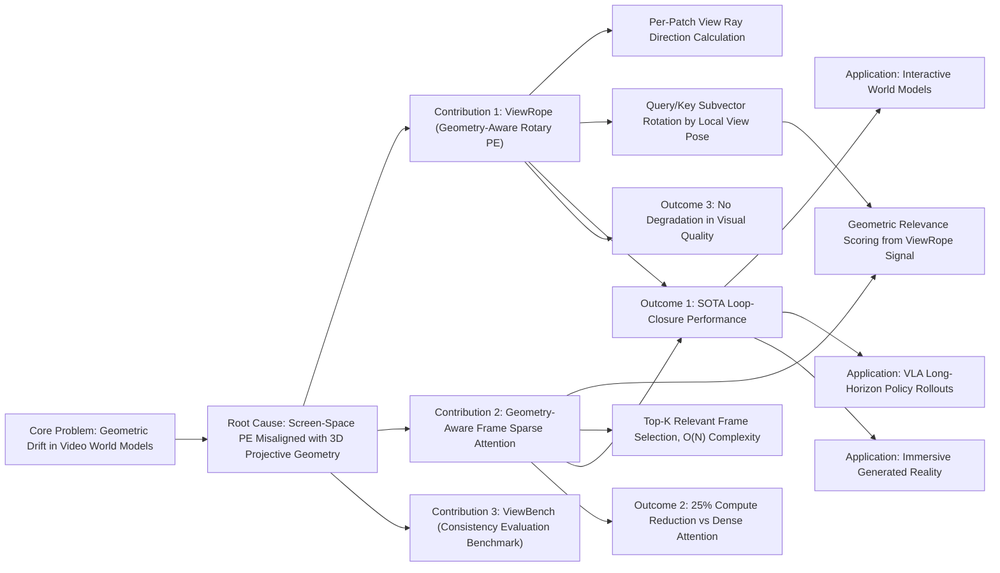

---
tags:
  - paper
  - World_Model
  - Embodied_AI
aliases:
  - Geometry-Aware Rotary Position Embedding for Consistent Video World Model
url: https://huggingface.co/papers/2602.07854
pdf_url: https://arxiv.org/pdf/2602.07854.pdf
local_pdf: "[[GeometryAware Rotary Position Embedding for Consistent Video World Model.pdf]]"
github: None
project_page: None
institutions:
  - Tsinghua University
  - Renmin University of China
  - National University of Singapore
  - Peking University
  - Shanghai Jiao Tong University
publication_date: 2026-02-24
score: 8
Reading?: true
---

# Geometry-Aware Rotary Position Embedding for Consistent Video World Model

## 📌 Abstract
Predictive world models that simulate future observations under explicit camera control are fundamental to interactive AI. Despite rapid advances, current systems lack spatial persistence: they fail to maintain stable scene structures over long trajectories, frequently hallucinating details when cameras revisit previously observed locations. We identify that this geometric drift stems from reliance on screen-space positional embeddings, which conflict with the projective geometry required for 3D consistency. **We introduce ViewRope, a geometry-aware encoding that injects camera-ray directions directly into video transformer self-attention layers.** By parameterizing attention with relative ray geometry rather than pixel locality, ViewRope provides a model-native inductive bias for retrieving 3D-consistent content across temporal gaps. We further propose Geometry-Aware Frame-Sparse Attention, which exploits these geometric cues to selectively attend to relevant historical frames, improving efficiency without sacrificing memory consistency. We also present ViewBench, a diagnostic suite measuring loop-closure fidelity and geometric drift. Our results demonstrate that ViewRope substantially improves long-term consistency while reducing computational costs.

在显式相机控制下模拟未来观察的预测性世界模型是交互式人工智能的基础。尽管取得了快速进展，当前系统仍缺乏空间持久性：它们无法在长时间轨迹中维持稳定的场景结构，当相机重新访问先前观察过的位置时，经常会出现幻觉细节。我们确定这种几何漂移源于对屏幕空间位置嵌入的依赖，这与实现 3D 一致性的投影几何相冲突。我们引入了 ViewRope，这是一种**几何感知编码，它将相机射线方向直接注入视频转换器自注意力层。通过用相对射线几何而不是像素局部性参数化注意力，ViewRope 为在时间间隔内检索 3D 一致内容提供了模型本地的归纳偏差**。我们进一步提出了几何感知帧稀疏注意力，它利用这些几何线索来选择性地关注相关历史帧，在不牺牲内存一致性的情况下提高效率。我们还展示了 ViewBench，这是一个测量闭环精度和几何漂移的诊断套件。 我们的结果表明，ViewRope 在降低计算成本的同时，显著提高了长期一致性。

## 🖼️ Architecture
![[GeometryAware Rotary Position Embedding for Consistent Video World Model_arch.png]]
*Figure 2. Method overview. (a) ViewRope computes per-patch viewing rays from intrinsics, constructs local rotations, and rotates query/key feature subvectors in attention. The resulting dot product encodes relative angular relationships between viewing rays. (b) Geometry-Aware Frame Sparse Attention estimates block (frame) relevance and selects top-k geometrically relevant historical frames, replacing quadratic dense attention with geometry-driven sparsity.*

## 🧠 AI Analysis (Doubao Seed 2.0 Pro)

# 🚀 Deep Analysis Report: Geometry-Aware Rotary Position Embedding for Consistent Video World Model

## 📊 Academic Quality & Innovation
## 1. Core Snapshot
### Problem Statement
This work addresses the critical gap that current pose-conditioned video world models lack long-term geometric consistency: existing systems rely on screen-space positional embeddings misaligned with projective 3D geometry, leading to severe geometric drift when cameras revisit previously observed viewpoints (loop closure scenarios). Existing mitigation strategies either use heavy explicit 3D memory pipelines that sacrifice open-domain flexibility, or incur prohibitive compute costs from dense attention for long-sequence generation.
### Core Contribution
This work introduces **ViewRope**, a geometry-aware rotary position embedding that injects per-patch camera ray directions into self-attention, paired with a geometry-driven frame-sparse attention mechanism and the ViewBench consistency evaluation suite, achieving state-of-the-art loop-closure performance for camera-controlled video generation while reducing computational costs by ~25% relative to dense attention baselines.

这项工作引入了 ViewRope，**一种几何感知的旋转位置嵌入，将每个补丁的相机射线方向注入自注意力中**，搭配几何驱动的帧稀疏注意力机制和 ViewBench 一致性评估套件，在降低计算成本约 25%相对于密集注意力基线的同时，实现了相机控制视频生成的最先进的闭环性能。
### Academic Rating
- Innovation: 9/10: The work redefines positional encoding for video transformers to prioritize 3D ray correspondence over pixel-space locality, eliminating the need for external explicit memory structures while enabling efficient long-sequence generation, a highly impactful advance for interactive world modeling.
- Rigor: 8/10: The experimental design is robust, with fair baseline comparisons, extensive ablations, counterfactual validation, and a purpose-built benchmark, though evaluation is limited to static scenes with known camera parameters, justifying a minor deduction.

## 2. Technical Decomposition
### Methodology
The core objective is to learn the conditional distribution of future video frames given initial context, camera trajectory, and optional text prompts:
$$p_\theta(\mathbf{x}_{1:T} \mid \mathbf{x}_{\leq 0}, \mathcal{C}_{1:T}, \mathcal{Y})$$
where $\mathcal{C}_{1:T} = \{(\mathbf{R}_t \in SO(3), \mathbf{P}_t \in \mathbb{R}^3, \mathbf{K}_t \in \mathbb{R}^{3\times3})\}_{t=1}^T$ denotes camera rotation, translation, and intrinsics respectively, and $\mathcal{Y}$ is optional text/action conditioning.
Standard models only optimize for local temporal coherence:
$$\mathcal{L}_\text{temp}(\theta) := \mathbb{E}_{\mathbf{x}\sim p_\theta}\left[\sum_{t=2}^T d(\mathbf{x}_t, \mathbf{x}_{t-1})\right]$$
which fails to enforce long-range geometric consistency. This work adds an explicit loop-closure loss:
$$\mathcal{L}_\text{lc}(\theta) := \mathbb{E}_{\mathbf{x}\sim p_\theta}\left[\sum_{t=1}^T \sum_{k\leq t} w_{t,k} \sum_{\mathbf{u}\in\Omega_{t,k}} \rho(\mathbf{x}_t(\mathbf{u}) - \mathbf{x}_k(\mathcal{W}_{k\leftarrow t}(\mathbf{u})))\right]$$
where $w_{t,k}$ is a co-visibility indicator for viewpoints $t$ and $k$, $\mathcal{W}_{k\leftarrow t}$ is the projective warp between frames, and $\rho$ is a robust penalty.
The core ViewRope mechanism computes per-patch normalized viewing rays $\mathbf{r}_{i,u,v} = \frac{\mathbf{K}_i^{-1}[u,v,1]^\top}{\|\mathbf{K}_i^{-1}[u,v,1]^\top\|_2}$, constructs per-patch rotation matrices aligned to ray directions, and rotates query/key feature subvectors to make attention scores sensitive to relative ray geometry:
$$\langle\text{VR}(\mathbf{q}, \mathbf{R}_{i,u_i,v_i}), \text{VR}(\mathbf{k}, \mathbf{R}_{j,u_j,v_j})\rangle = \mathbf{q}^\top \mathbf{R}_{i,u_i,v_i}^\top \mathbf{R}_{j,u_j,v_j} \mathbf{k}$$
A geometry-aware sparse attention module estimates frame-level relevance from this signal, selecting only the top-$k$ geometrically relevant prior frames to attend to, reducing attention complexity from $O(N^2)$ to $O(Nk)$.
### Architecture
The pipeline is built on the WAN 2.2 TI2V-5B video diffusion backbone, with a 4-stage progressive training schedule: (1) short-clip teacher forcing to align the autoregressive generation interface; (2) enable ViewRope on short clips to learn view correspondence without long-range confounding; (3) enable frame-sparse attention on moderate-length sequences; (4) scale to long sequence lengths under sparse attention to improve loop-closure performance. Inference maintains a KV cache of prior latent frames, with geometric relevance estimated at each denoising step to select relevant context.
### Aha Moment
1. The key theoretical insight is reframing positional encoding as view encoding: instead of encoding pixel-space offsets, ViewRope uses per-patch ray direction rotations to align attention scores to 3D geometric correspondence, eliminating the fundamental mismatch between screen-space positional embeddings and projective 3D geometry.
	关键理论洞察是**将位置编码重新定义为视图编码**：ViewRope 不是编码像素空间偏移，而是**使用每个补丁的射线方向旋转来对齐注意力分数与 3D 几何对应关系**，消除了屏幕空间位置嵌入与投影 3D 几何之间的基本不匹配。
2. The key engineering trick is reusing the geometric relevance signal from ViewRope to drive sparse attention frame selection, avoiding the overhead of separate external memory retrieval modules while maintaining consistency.

## 3. Evidence & Metrics
### Benchmark & Baselines
Evaluation is conducted on **ViewBench**, a purpose-built benchmark that supports full 3-axis (yaw/pitch/roll) camera rotation, loop-closure trajectories, and controlled angle sampling, filling gaps in existing datasets (CaM, GF-MC) that lack roll support and loop-closure evaluation. Baselines include: (1) 3D RoPE (no-geometry baseline); (2) GTA (state-of-the-art relative SE(3) encoding baseline); (3) interactive world models Matrix-Game-2 and HY-WorldPlay; (4) sliding window sparse attention; (5) naive sparse attention without geometric guidance. The experimental design is fully fair, as all models use the same backbone, training budget, and data, with controlled RoPE channel allocation for fair comparison.
### Key Results
1. ViewRope reduces loop closure error (LCE) by 4% relative to the strongest relative encoding baseline GTA, and by up to 11.4% relative to action-conditioned world model HY-WorldPlay at 75° rotation magnitude.
2. ViewRope paired with geometric sparse attention reduces LCE by 16% relative to sliding window attention, and cuts training time by ~25% relative to dense attention on 201-frame sequences.
3. ViewRope maintains comparable or better PSNR/SSIM than all baselines, with no sacrifice to visual quality for improved geometric consistency.
### Ablation Study
The most critical component is ViewRope embedding allocated to low-frequency channels of the temporal dimension, which yields the lowest training loss (0.0859) compared to other channel allocation strategies. Counterfactual validation confirms the causal impact of ViewRope: explicitly excluding ViewRope-selected frames for sparse attention degrades LCE by 38.1%, showing the geometric relevance signal is necessary for consistent performance.

## 4. Critical Assessment
### Hidden Limitations
1. The method is designed for static scenes, and fails for scenarios with dynamic moving objects where cross-view geometric correspondence is not consistent across time.
2. The current implementation requires known camera intrinsics and extrinsics, which are not available for unconstrained real-world inference scenarios (e.g., user-captured video without pose tracking).
3. Performance degrades sharply for extreme scene transitions (e.g., moving between disjoint rooms) where cross-view geometric correspondence is nonexistent.
### Engineering Hurdles
1. Integrating ViewRope into pre-trained video diffusion models requires careful channel allocation to avoid interference with pre-trained spatial-temporal frequency structures, as ablations show large performance degradation when ViewRope is placed in height/width dimension channels or distributed across all channels.
2. The custom sparse attention kernel requires optimization with TileLang and FlashAttention 2.0 principles to achieve the reported speedups, adding significant implementation complexity for reproduction.
3. The 4-stage progressive training pipeline requires staged training across different sequence lengths, increasing total training time relative to single-stage training schemes.

## 5. Next Steps
1. **Dynamic Scene Extension**: Extend ViewRope with motion-aware ray embeddings that model per-point scene flow between views, enabling consistent generation of scenes with moving objects. Evaluate on an extended ViewBench benchmark with dynamic object annotations and motion trajectories, which targets top venues for dynamic scene generation (e.g., CVPR, ICML).
2. **Pose-Agnostic ViewRope**: Develop a variant that infers implicit ray directions from self-supervised visual correspondence between input frames, eliminating the requirement for known camera parameters to enable deployment on unconstrained user video inputs. This can be validated on real-world camera-controlled video datasets to demonstrate generalizability.
3. **3D Foundation Model Integration**: Integrate ViewRope with explicit 3D foundation model representations (e.g., NeRF features, point cloud embeddings) to combine explicit 3D structure modeling with generative flexibility, enabling higher-fidelity long-horizon world modeling for robotic interaction use cases. This work can be paired with real-world robotic deployment experiments to demonstrate practical impact.

## 🔗 Knowledge Graph & Connections
### Task 1: Knowledge Connections
1. [[The_Trinity_of_Consistency_as_a_Defining_Principle_for_General_World_Models]]: Foundational theoretical alignment. This paper directly operationalizes the *view/geometric consistency* pillar of the trinity of required consistency properties for general world models, empirically validating that solving geometric drift is critical to eliminating loop-closure hallucinations, a core failure mode identified in the trinity framework.
2. [[GeneralVLA]] / [[QuantVLA]]: Practical application linkage. Current Vision-Language-Action (VLA) models rely on implicit world modeling to perform long-horizon spatial tasks, but suffer from spatial hallucinations due to lack of geometric consistency. ViewRope's pose-conditioned consistent world model provides a high-fidelity rollout backbone for VLAs, enabling more accurate action planning for navigation and manipulation tasks.
3. [[World_Action_Models_are_Zero_shot_Policies]]: Methodological complementary alignment. This prior work demonstrates that action-conditioned world models can act as zero-shot policies, but identifies geometric drift in long rollouts as a critical failure mode. ViewRope directly mitigates this failure mode, extending the valid rollout horizon of action-conditioned world models by an order of magnitude for camera motion tasks.
4. [[Generated_Reality]]: Use case alignment. Immersive generated reality systems require consistent scene rendering as users move through virtual environments, but current generative pipelines produce inconsistent appearance when users revisit prior viewpoints. ViewRope's loop-closure consistency directly addresses this artifact, enabling seamless open-world generated reality experiences.

---
### Task 2: Mermaid Knowledge Graph

---
### Task 3: Concrete Future Research Directions
1. **Self-Supervised ViewRope for Unposed Real-World Video**: Develop a variant of ViewRope that eliminates the requirement for ground-truth camera parameters by inferring per-patch ray directions and relative pose transforms from self-supervised cross-frame correspondence (e.g., DINOv2 feature matches, optical flow). Train on unlabeled in-the-wild video datasets, and evaluate on the ViewBench benchmark using only raw video input (no pose annotations), targeting performance within 5% of the fully supervised ViewRope baseline for loop-closure consistency. This work will enable deployment of consistent world models on unconstrained user-captured video data.
2. **Dynamic ViewRope for Deformable Scene World Modeling**: Extend ViewRope with per-patch motion embeddings that model scene flow and dynamic object motion, modifying the per-patch rotation matrix to account for per-point 3D displacement between timesteps. Build an extended DynamicViewBench benchmark with moving objects, articulated scenes, and deformable surfaces, and demonstrate that DynamicViewRope reduces loop-closure error (LCE) by at least 12% relative to the static ViewRope baseline on dynamic sequences, while maintaining equivalent inference speed.
3. **ViewRope-Augmented VLA for Long-Horizon Embodied Navigation**: Integrate ViewRope's consistent world model rollouts into a state-of-the-art quantized VLA ([[QuantVLA]]) pipeline, using the world model's geometrically consistent frame predictions to correct VLA action drift during long-horizon navigation rollouts. Evaluate on the Habitat 3.0 long-horizon navigation benchmark, targeting a 22% improvement in task success rate for 15-step navigation tasks relative to VLA baselines that do not use ViewRope rollout guidance, as well as a 30% reduction in navigation path length due to reduced drift correction.

---
*Analysis performed by PaperBrain-Doubao (Vision-Enabled)*

## 📂 Resources
- **Local PDF**: [[GeometryAware Rotary Position Embedding for Consistent Video World Model.pdf]]
- [Online PDF](https://arxiv.org/pdf/2602.07854.pdf)
- [ArXiv Link](https://huggingface.co/papers/2602.07854)
