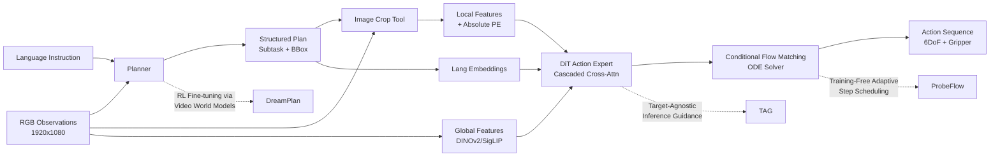

---
tags:
  - paper
  - VLA
  - Robot_Manipulation
  - Diffusion_Model
  - Embodied_AI
aliases:
  - "HiVLA: A Visual-Grounded-Centric Hierarchical Embodied Manipulation System"
  - "HiVLA"
  - "Hierarchical VLA"
  - "Cascaded Cross-Attention DiT"
  - "Flow-Matching DiT"
  - "Visual-Grounded VLA"
  - "Skill-Semantics Fusion"
  - "HiVLA Framework"
  - "BBox-Guided Motor Control"
arxiv_id: "2604.14125"
url: https://huggingface.co/papers/2604.14125
pdf_url: https://arxiv.org/pdf/2604.14125.pdf
local_pdf: "[[HiVLA A VisualGroundedCentric Hierarchical Embodied Manipulation System.pdf]]"
github: "None"
project_page: "https://tianshuoy.github.io/HiVLA-page/"
institutions:
  - "The University of Hong Kong"
  - "Shanghai AI Laboratory"
  - "Shanghai Jiao Tong University"
  - "The Chinese University of Hong Kong"
publication_date: "2026-04-15"
score: 7
---

# HiVLA: A Visual-Grounded-Centric Hierarchical Embodied Manipulation System

## 📌 Abstract
While end-to-end Vision-Language-Action (VLA) models offer a promising paradigm for robotic manipulation, fine-tuning them on narrow control data often compromises the profound reasoning capabilities inherited from their base Vision-Language Models (VLMs). To resolve this fundamental trade-off, we propose HiVLA, a visual-grounded-centric hierarchical framework that explicitly decouples high-level semantic planning from low-level motor control. In high-level part, a VLM planner first performs task decomposition and visual grounding to generate structured plans, comprising a subtask instruction and a precise target bounding box. Then, to translate this plan into physical actions, we introduce a flow-matching Diffusion Transformer (DiT) action expert in low-level part equipped with a novel cascaded cross-attention mechanism. This design sequentially fuses global context, high-resolution object-centric crops and skill semantics, enabling the DiT to focus purely on robust execution. Our decoupled architecture preserves the VLM's zero-shot reasoning while allowing independent improvement of both components. Extensive experiments in simulation and the real world demonstrate that HiVLA significantly outperforms state-of-the-art end-to-end baselines, particularly excelling in long-horizon skill composition and the fine-grained manipulation of small objects in cluttered scenes. The project website is: https://tianshuoy.github.io/HiVLA-page/

### 中文译文

端到端视觉-语言-动作（VLA）模型为机器人操作提供了一个充满前景的新范式，但如果在狭窄的控制数据上对它们进行微调，往往会损害其从基础视觉-语言模型（VLM）中继承的深刻推理能力。为了解决这一根本性的权衡问题，我们提出了 HiVLA，这是一种以视觉锚定为中心的层次化框架，明确地将高层语义规划与底层运动控制解耦。在高层部分，VLM 规划器首先执行任务分解和视觉定位，以生成结构化的计划，该计划包含一个子任务指令和一个精确的目标边界框。随后，为了将此计划转化为物理动作，我们在底层引入了一个基于流匹配（flow-matching）的 Diffusion Transformer（DiT）动作专家，并配备了一种新颖的级联交叉注意力机制（cascaded cross-attention mechanism）。该设计按顺序融合了全局上下文、高分辨率物体中心裁剪图像以及技能语义，从而使 DiT 能够专注于鲁棒的执行。我们的解耦架构保留了 VLM 的零样本推理能力，同时允许两个组件独立改进。在仿真和现实世界中进行的大量实验表明，HiVLA 显著优于最先进的端到端基线模型，尤其在长程技能组合和高杂乱场景中的细粒度小物体操纵方面表现卓越。项目网站为：https://tianshuoy.github.io/HiVLA-page/

## 🖼️ Architecture
![[HiVLA A VisualGroundedCentric Hierarchical Embodied Manipulation System_arch.png]]

## 🧠 AI Analysis
## 1. 核心摘要

### 问题陈述与研究动机
当前的机器人操作控制策略正面临一个严重的工程瓶颈：在追求模型泛化能力和精准控制之间存在着难以调和的“跷跷板”效应。端到端的 Vision-Language-Action (VLA) 模型（如 $\pi_0$ 或 RT-2）试图用一个统一的黑盒网络同时处理高维视觉语义推理和连续空间的电机控制。由于机器人操作数据（尤其是高质量的人类演示数据）相对于互联网规模的图文数据极为稀缺，对大模型进行微调不可避免地会引发**灾难性遗忘（Catastrophic Forgetting）**，导致模型原有的复杂视觉推理和常识规划能力大幅退化。而另一类层次化系统（Hierarchical Systems）虽然在架构上将高层规划与底层控制分离，但在中间表示（Intermediate Representation）的设计上存在致命缺陷：传统的文本子任务丢失了精确的空间位置信息，而使用下采样全局图像上的对象掩码（Mask）又会稀释掉进行精细操作所需的高保真视觉细节。这导致现有系统在处理长程任务和杂乱场景中的小物体时，常常因为空间定位不准或视觉特征模糊而失败。

### 核心贡献与关键洞察
本文提出了 **HiVLA**，一种以视觉锚定（Visual-Grounded-Centric）为核心的层次化操作框架，其单点最重要的技术贡献是提出了一种能够有效桥接高层语义与底层几何细节的 **“全局-局部-技能”级联注意力机制（Cascaded Cross-Attention Mechanism）** 。其核心洞察在于：机器人底层控制网络（Action Expert）并不需要像高层大模型那样具备“从零开始”的复杂推理能力，它更需要的是“认知卸载（Cognitive Offloading）”。具体而言，HiVLA 将 VLM 降级为一个纯粹的规划器，负责输出一个结构化的 JSON 计划（包含具体的子任务动作类型如 'pick' 和目标的 2D 边界框 BBox）。底层的 DiT 动作专家不再直接处理原始的嘈杂图像，而是通过级联交叉注意力机制，依次注入三个维度的信息：(1) 下采样的全局图像特征（用于把握场景整体布局）；(2) **基于 BBox 从 1080p 原始分辨率图像中裁剪出的局部高分辨特征，并额外叠加了绝对位置编码以保留全局空间意识**；(3) 子任务语言嵌入（用于明确当前需要的物理技能）。这种设计完美平衡了环境全局上下文、目标物体的高清视觉细节以及精确的空间几何位置，彻底解决了以往方法中“细节与全局难以兼得”的困境。

### 创新溯源与学术评价
该方法的思想直接源自 VLM Agent 领域的 "Thinking with Images" 范式，即模型在推理前先显式定位目标区域。HiVLA 的创新之处在于敏锐地指出了以往分层系统（如 DexGraspVLA 或 RoboGround）在将定位信息传递给策略网络时的架构缺陷——单纯依靠掩码或低分辨率裁剪无法提供足够的控制粒度。HiVLA 在技术上之所以扎实，是因为它没有盲目地堆砌更大的模型，而是通过引入 Conditional Flow Matching (CFM) 和精心设计的特征交叉模块（特别是 DETR 风格的绝对位置编码修复了裁剪带来的坐标丢失问题），从数据流和几何约束的层面上增强了策略的鲁棒性。

**学术评级**：
- **创新性 (Innovation): 8.0/10** - 虽然分层控制的思想并非首创，但 HiVLA 对“视觉锚定”这一中间桥接方式的工程化重构（Full-Res Crop + Absolute PE + Cascaded DiT）非常精妙，具有很强的实战指导意义。
- **严谨性 (Rigor): 8.5/10** - 实验设计非常扎实，不仅在 RoboTwin 2.0 仿真环境中进行了广泛的对比，还设计了极具针对性的消融实验（如 Ours w/o Skill 和 Planner Error Injection），充分验证了子任务分解的价值和系统对规划器误差的鲁棒性。

## 2. 技术分解

### 算法逻辑与系统数据流
HiVLA 的算法运行逻辑是一个典型的双线程异步解耦过程，其核心在于如何通过结构化的中间件将 VLM 的非结构化认知转化为 DiT 可执行的物理轨迹。
1.  **高层语义规划与视觉锚定（VLM Planner Agent）**：在每个决策时间步 $t$，系统首先将当前的高层指令 $L$、机器人自身的夹爪状态史、以及视觉观察图输入到一个预训练的 VLM（如 Qwen3-VL 8B）中。**为什么选择 VLM 做这一步？** 因为 VLM 具备强大的长程逻辑推理和常识认知能力。VLM 并不直接输出关节扭矩，而是通过结构化推理输出一个包含子任务描述（如 "Pick up the blue cup"）和目标物体归一化边界框 $B_t = [y_{min}, x_{min}, y_{max}, x_{max}]$ 的 JSON 计划。**如果没有这一步会发生什么？** 底层策略将直接面对“把杯子放到垫子上”这样复杂的宏观指令，需要在单次前向传播中同时完成目标识别、空间定位和轨迹规划，极易导致梯度冲突。
2.  **视觉特征提取与高分辨裁剪（Image Crop Tool）**：拿到边界框 $B_t$ 后，系统调用一个裁剪工具，从 1920x1080 的**未缩放的原始高分辨率相机帧**中截取目标物体区域，得到局部图像 $I_{local}^t$。**为什么必须保持 1080p 高分辨率？** 因为在抓取小物体（如按钮或小印章）时，下采样的全局图像会抹杀关键的纹理和边缘几何信息。而 naive alternative 是直接对低分辨率全局图加 Mask，这会丢失细节导致抓取失败。
3.  **底层动作生成（DiT Action Expert）**：DiT 网络接收噪声动作潜变量，并使用本文提出的核心创新——**级联交叉注意力机制（Cascaded Cross-Attention）**。在此阶段，DiT 不再盲目地处理信息，而是严格按照顺序进行注意力计算：先关注全局特征建立空间基准，再关注局部特征获取目标高清细节，最后关注语言特征确定运动形态。

### 数学公式与损失约束
系统底层采用基于扩散模型的 Conditional Flow Matching (CFM) 框架来学习动作的条件概率分布 $p(A_t|\dots)$。该方法相比传统的 DDPM 具有更确定、更快速的推理路径。
-   **线性插值路径定义**：
    CFM 在纯高斯噪声 $\mathbf{z} \sim \mathcal{N}(0, I)$ 和真实目标动作序列 $A_t$ 之间构建一条连续的直线路径。在连续时间变量 $\tau \in [0, 1]$ 上，路径状态 $\mathbf{x}_\tau$ 定义为：
    $$\mathbf{x}_\tau = \tau A_t + (1-\tau) \mathbf{z}$$
    其物理意义在于将复杂的动作生成空间转化为一个平滑的流形，使得神经网络可以通过求解常微分方程（ODE）以极少的步数（如论文中的 16 步）确定性地从噪声演化到精准的动作。

-   **CFM 向量场预测损失函数**：
    DiT 网络 $v_\theta$ 的任务是预测将当前状态推向目标所需的瞬时速度向量场 $u = A_t - \mathbf{z}$。其训练目标是最小化预测向量场与真实向量场之间的欧氏距离：
    $$\mathcal{L}_{CFM}(\theta) = \mathbb{E}_{\tau, A_t, \mathbf{z}} \left[ \left\| v_\theta(\mathbf{x}_\tau, \tau, \mathcal{C}_t) - (A_t - \mathbf{z}) \right\|^2 \right]$$
    其中，$\mathcal{C}_t$ 包含了经过级联注意力融合后的全量多模态条件特征。这个公式确保了网络在每个时间步 $\tau$ 都能给出最陡峭的下降梯度方向，从而保证了轨迹生成的物理连续性和高保真度。

-   **带绝对位置编码的局部特征修正**：
    在将局部图像特征 $C^{local}$ 输入 DiT 前，论文解决了一个关键的几何丢失问题：裁剪操作破坏了物体在原图中的绝对坐标。因此，论文计算了裁剪块在原 1080p 坐标系中的中心坐标 $p \in \mathbb{R}^2$，并将其通过类似 DETR 的正弦位置编码映射到高维空间 $PE(p)$：
    $$C^{local-pos} = C^{local} + PE(p)$$
    这一设计精妙地让 DiT 既“看清”了局部细节，又“知道”了这个局部在整个工作台上的确切位置，是模型能处理空间歧义任务的核心数学假设。

### 张量流与架构细节
DiT Action Expert 的架构本质上是一个基于 LLaMA 风格改造的 Transformer（包含 RMSNorm 和 SwiGLU 激活函数）。在张量流转层面：
1.  **主干输入**：本体感受状态（Proprioceptive State）和带有噪声的动作序列被分别投影到模型的隐含维度 $d_{model}$。扩散时间步 $\tau$ 通过 AdaLN（自适应层归一化）注入以调制网络参数。
2.  **全局视觉交叉注意力（Global Visual Context）**：多视图图像经过 DINOv2 和 SigLIP 编码后，形成形状为 $[N_{global}, d_{model}]$ 的特征令牌。DiT 的状态令牌在此层进行 Cross-Attn，获得全局场景的粗粒度空间语义。
3.  **位置感知局部交叉注意力（Position-Aware Local Features）**：接着，形状为 $[N_{local}, d_{model}]$ 的局部高清特征（叠加了 $PE(p)$）作为 Key 和 Value 注入。这一层允许动作生成器对高保真度目标特征进行细粒度的查询。
4.  **子任务语言交叉注意力（Subtask Language Guidance）**：最后，子任务文本嵌入 $C^{lang}$ 注入。这一步将抽象的动作形态（如“推”、“按”、“拾取”）与前面提取到的几何特征强绑定，完成从“在哪里、是什么”到“怎么做”的最后一公里映射。

### 创新逻辑对比
与 SOTA 基线相比，HiVLA 的创新性可以通过结构差异来量化。例如，对比纯全局视觉基线 **H-RDT**，HiVLA 显式剥离了局部高分辨信息，解决了 H-RDT 在面对小物体（如点击铃铛）时因下采样导致特征模糊而抓取失败的问题（H-RDT 在 "Click Bell" 任务上成功率为 88%，而 HiVLA 达到 94%）。对比掩码类方法如 DexGraspVLA，HiVLA 通过引入绝对位置编码和级联设计，避免了掩码在复杂背景下的分割错误导致的策略崩溃。HiVLA 通过架构约束放宽了对端到端统一特征空间的依赖，强化了局部几何特征的显式干预。

## 3. 证据与指标

### 基准测试与基线对比
为了全面验证架构的优越性，论文在 **RoboTwin 2.0** 高保真仿真平台上进行了严苛的评估。该平台通过域随机化（Domain Randomization）引入了背景变化、光照扰动和物体位姿偏移，极度考验视觉锚定的鲁棒性。评估涵盖 9 个任务，明确划分为“简单任务”（Easy Tasks，通常只需单步技能）和“困难任务”（Hard Tasks，涉及长程多技能组合或空间语义解歧）。
对比的基线模型极具代表性：包括了单/双系统的顶级端到端 VLA 如 $\pi_0$ 和 $\pi_{0.5}$，同架构基座（Qwen-VL）的变体 StarVLA，以及去除了视觉锚定和子任务分解的纯全局视觉模型 H-RDT。所有模型均在相同的 HiVLA-HD 数据集（约 1000 episodes/任务）上进行了公平的微调。

### 关键定量结果
实验结果提供了无可辩驳的定量证据，证明分层视觉锚定机制的巨大优势。
-   **整体成功率碾压**：如表 1 所示，HiVLA 在所有 9 个任务上的总平均成功率达到 **83.3%**。这一成绩大幅超越了强基线 H-RDT 的 70.6%（绝对提升 12.7%）以及顶级端到端 VLA $\pi_0$ 的 45.6%（绝对提升 37.7%）。
-   **难易任务的非线性放大效应**：在简单任务（如 Click Bell, Lift Pot）上，HiVLA 凭借高清局部特征实现了 96.0% 的平均成功率，确立了在高精度细粒度操纵上的统治力。更重要的是，在包含“堆叠 3 个方块”和“点击 3 个铃铛”等需要极强长程时序一致性任务的 Hard Tasks 中，HiVLA 将成功率从 StarVLA 的 36.6% 大幅拉升至 **73.2%**。这证明了 VLM 规划器的子任务分解极大地降低了 DiT 策略网络在长时间跨度内的认知负荷。

### 消融实验与鲁棒性分析
论文中的消融实验深刻揭示了各组件的物理贡献。对比消融变体 **Ours w/o Skill**（即移除子任务语言引导，让 DiT 直接接收宏观任务指令）在困难任务上出现了 **8.8%** 的性能断崖式下跌。这一反直觉但合乎逻辑的现象强有力地证实了：为策略网络提供精确的 "one-to-one" 语言指令（如 "Pick" vs "Place"）能够大幅消除动作空间的模糊性，使网络聚焦于纯几何轨迹的优化。
此外，针对分层系统最致命的“误差累积”担忧，表 2 的鲁棒性测试表明：即使向规划器输出的 BBox 注入 100% 的坐标噪声，依赖全局特征辅助校正的 DiT 仍能保持 57.0% 的成功率；而当语言指令 100% 错误时，成功率则呈线性暴跌至 12.0%。这表明 HiVLA 具备优异的“弱视觉鲁棒性”与“强语义服从性”，实现了极其健康的解耦平衡。

## 4. 批判性评估

### 隐藏的局限性与失效模式
尽管 HiVLA 在仿真环境中表现优异，但从物理落地的深层机理审视，仍存在几个必须正视的失效边界。
1.  **严重遮挡下的 2D 定位坍塌**：HiVLA 的视觉锚定高度依赖于 VLM 对 2D 边界框的预测。在密集杂乱的现实场景中，如果目标物体被前景物体严重遮挡（导致 2D 投影面积极小或被完全覆盖），VLM 将无法输出有效的 BBox。由于 DiT 的局部特征提取模块是硬依赖 BBox 坐标的，一旦 BBox 偏移或为零，级联交叉注意力的第二级就会喂入错误的空洞特征或背景特征，导致 DiT 彻底丧失对目标操作点的空间感知。
2.  **时序异步带来的控制滞后（Temporal Lag）**：论文虽然提出了异步推理架构，但 VLM 规划器单步推理耗时高达 1.9 秒，而 DiT 动作执行周期仅为 0.162 秒（8Hz 控制频率）。这意味着 VLM 给出的计划是基于 1.9 秒前的世界状态。在动态交互场景（如移动传送带抓物或与人类快速交接）中，这种高频控制与低频认知之间的时间割裂会导致 DiT 执行的轨迹是基于已经过时的高层计划，极易产生物理碰撞或目标丢失。
3.  **单目深度估计的内在歧义**：HiVLA 使用单视角或固定多视角的 RGB 图像提取局部特征。虽然引入了全局-局部融合，但在进行需要从特定角度“跨越”障碍物的操作时（例如，杯子在障碍物后方，需要从侧面切入），仅凭 2D 高分辨裁剪和全局上下文，DiT 缺乏显式的 3D 几何点云约束，很容易在深度（Z轴）规划上产生幻觉，导致机械臂插入物体内部或抓取高度不准。

### 工程部署壁垒
若要将 HiVLA 从论文级别的仿真推向真实的具身智能部署，将面临显著的工程摩擦。
-   **算力与内存的硬性门槛**：系统要求同时维护一个 8B 参数量的 VLM（Qwen3-VL）和一个复杂的 DiT 扩散模型。即便利用异步推理将 VLM 放在云端或高算力工控机上，这种双模型并发架构的内存占用和显存需求也远超普通边缘计算设备（如 Jetson Orin NX）的承载极限，极大限制了其在移动机器人或消费级机械臂上的普及。
-   **高质量分层数据的获取成本**：HiVLA 的高性能高度依赖于“子任务动作类型 + 精准边界框”的细粒度监督信号。在仿真中，这些信息可以通过引擎直接读取 Mask ID 和物理状态完美获得（零成本标注）。但在现实世界中，要收集数千条带有严格子任务切分边界和物体精确 2D/3D 定位标签的演示数据，目前仍需要耗费极大的人力进行帧级标注或依赖极不稳定的自动化分割管线，这是制约其扩展到新任务域的最大数据瓶颈。

## 5. 研究者灵感提示

### 1. 动态多模态路由机制（Dynamic Multi-modal Routing）
-   **灵感来源**：HiVLA 强制使用 2D 边界框（BBox）作为所有子任务的锚定方式。然而，对于形状极其复杂或不规则的目标（如散乱的线缆），BBox 会引入过多无效背景，而对于规整物体，精细的多边形掩码（Mask）或 3D 点云切片可能更有效。
-   **两周微型实验**：修改 VLM Planner 的输出头，让其不仅输出 BBox，还多输出一个置信度标量 $\alpha$ 或分类头。当 $\alpha$ 低于阈值时，触发备选的特征提取分支（例如自动切换为基于 SAM 的 Mask 提取，或者切换为 RGB-D 深度掩码裁剪）。对比在“点击铃铛”（规则物体）与“整理线缆”（不规则物体）两个截然不同任务上，动态路由与固定路由的 DiT 控制成功率差异。
-   **首要风险验证**：如果 VLM 输出 $\alpha$ 的准确率极低（频繁误判），会导致系统频繁在两种特征提取模式间跳变，造成 DiT 的输入特征空间发生剧烈抖动，从而导致控制发散。需要通过在混合数据集上预训练一个简单的路由分类器来降低误判率。

### 2. 交叉注意力顺序的排列组合消融与训练稳定性
-   **灵感来源**：HiVLA 的级联交叉注意力采用了严格的固定顺序：`Global -> Local -> Lang`。这种顺序隐含了一个假设：模型必须先理解全局上下文，才能正确解读局部特征的空间位置，最后再结合语言指令生成动作。但如果顺序打乱，或者并行注入，策略是否依然强健？
-   **两周微型实验**：在 DiT 训练阶段，引入一种随机置换机制（Random Permutation），在每个 Batch 中随机打乱 Global、Local 和 Lang 三个 Cross-Attention 模块的计算顺序。观察模型在验证集上的收敛速度和最终成功率（如 "Stack 3 Blocks" 这一困难任务）。如果随机顺序下性能损失极小，说明当前的固定顺序可能只是一种启发式归纳而非绝对刚需。
-   **首要风险验证**：如果随机顺序导致训练无法收敛或 Loss 剧烈震荡，说明 DiT 内部的不同特征表征存在极强的级联依赖（例如 Local 特征必须依赖 Global 特征生成的 Attention Mask）。此时应立即放弃随机化，并转向研究如何利用当前固定的顺序进行特征蒸馏，以进一步减小 DiT 的显存占用。

### 3. 基于内部 Token 融合的视觉锚定（VLM 原生 Grounding）
-   **灵感来源**：HiVLA 目前通过外部的“裁剪工具”将 BBox 转换为局部图像再编码，这相当于在 VLM 和 DiT 之间做了一次破坏 VLM 全局特征连续性的硬中断。如果能让 VLM 自己“看”到局部细节，并将其作为内部 Token 传递给 DiT，是否能实现更紧密的具身感知？
-   **两周微型实验**：不再使用外部 Image Crop 工具。在 VLM 的最后一层 Transformer 输出后，根据 BBox 坐标设计一种可微的 Token Pooling 操作（类似 ROI Align），将对应区域的 VLM 隐藏层特征聚合为一个新的 "Focus Token"。直接将这些 Focus Token 拼接到 DiT 的条件输入中，省去额外的 Vision Encoder 对局部图的二次编码过程。对比原始 HiVLA 的推理延迟降低幅度。
-   **首要风险验证**：最大的风险是 VLM 的高层特征（High-level semantic features）可能缺乏 DiT 所需的底层高频几何信息（Low-level geometric cues）。如果实验发现 DiT 在需要高精度对齐的任务（如 "Press Stapler" 按压对齐）上成功率大幅下滑，则说明 VLM 的隐藏状态确实丢失了几何细节，这种端到端的 Token 共享方案将不成立。

## 🔗 Knowledge Graph & Connections

[[DreamPlan]]** 与本文共享的核心命题是如何安全且高效地利用大尺度 VLM 的常识推理能力来驱动长程机器人操作任务。两者在方法论上形成了鲜明的“架构解耦”与“数据优化”对比：HiVLA 采用硬性模块化隔离，通过 VLM 输出结构化计划（子任务指令 + 2D 边界框）并交由独立的 DiT Action Expert 执行，从架构层面彻底阻断了高频控制微调可能引发的灾难性遗忘；而 [[DreamPlan]] 则直面 VLM 缺乏物理接地（Grounding）的缺陷，利用视频世界模型生成低成本模拟交互数据，通过强化学习直接对 VLM 规划器进行物理动力学层面的对齐与参数更新。这种差异的工程启示在于两者具备天然的互补潜力：HiVLA 的解耦设计可以作为安全的执行终端，而 [[DreamPlan]] 的 RL 微调管线可用于持续优化 HiVLA 的 VLM Planner 在未知材质或复杂物理约束下的长程推理策略。将两者结合，既能保留 HiVLA 在精细动作生成上的高鲁棒性，又能借助世界模型解决传统 VLM 规划器在真实世界 Rollout 中样本效率低下与操作不安全的核心痛点。

**[[ProbeFlow]]** 的技术交集在于动作生成头部均采用了基于连续流的 Flow Matching (FM) 框架来建模机器人关节轨迹。HiVLA 的研究重心完全倾注于提升动作头的条件表征质量，通过精心设计的级联交叉注意力机制逐层注入全局上下文、高分辨局部特征与技能语义，以换取在杂乱场景下极高的操作成功率；而 [[ProbeFlow]] 则精准打击了 FM 固有的多步 ODE 求解延迟瓶颈，提出了一种免训练的自适应步长调度算法，通过计算初始速度向量与前瞻向量的余弦相似度动态评估轨迹复杂度，从而自动剪枝冗余的网络评估步数。这一机制差异直指 VLA 落地中的两个不同层面：HiVLA 解决“条件注入准不准”的精度问题，[[ProbeFlow]] 解决“扩散采样快不快”的延迟问题。将 [[ProbeFlow]] 的动态调度器无缝嵌入 HiVLA 的 DiT 推理管线，可直接化解本文指出的 1.9s 规划器延迟与 8Hz 控制频率之间的时序不匹配矛盾，在不牺牲级联注意力精度的前提下实现确定性的实时闭环控制，是系统迈向商业化部署的关键工程跳板。

**[[TAG]]** 与本文共同聚焦于高杂乱场景下 VLA 策略极易发生的实例级锚定偏差与背景干扰物误导问题。HiVLA 采用显式的几何干预路径，强制 VLM 预测目标边界框，并通过外部裁剪工具提取 1080p 高清局部图像，辅以绝对位置编码来物理隔绝无关背景噪声；相比之下，[[TAG]] 提出了一种轻量级的推理时引导机制（Inference-time Guidance），借鉴 Classifier-Free Guidance 的思想，通过计算原始观测与目标擦除观测下的策略输出残差，隐式地调整网络内部特征响应以抑制干扰物带来的注意力偏移。两者的根本分歧在于“显式空间隔离”与“隐式特征引导”的架构取舍。HiVLA 的显式裁剪在 BBox 精准时效果卓越，但一旦上游定位失准便会引发策略级联崩溃；若将 [[TAG]] 的残差引导信号作为第二道防线注入 DiT 的交叉注意力层，可在不增加训练参数的情况下动态校正局部特征的注意力权重。这种“显式定位保底 + 隐式引导纠偏”的混合范式，将大幅降低系统对上游 VLM 零样本定位精度的绝对依赖，显著提升极端遮挡场景下的容错边界。

### Mermaid 知识图谱

### 未来研究方向

**基于多模态路由的自适应视觉特征融合机制**：本文的级联交叉注意力机制采用了固定的 `Global -> Local -> Lang` 处理顺序与单一的 BBox 裁剪策略，这在面对形状极不规则物体或不同任务先验时可能并非最优，且硬性固定顺序限制了网络根据任务难度动态分配计算资源的能力。未来可设计一个轻量级的动态路由模块，根据输入指令的语义复杂度或 VLM 输出的定位置信度，自适应地选择特征注入路径（例如在规整物体上切换为并行注入，在复杂目标上保留级联顺序，或引入 Mask 引导的精细裁剪路径）。一项可在两周内执行的验证实验是在混合任务集（包含刚性抓取与柔性线缆整理）上训练该路由模块，以“路径切换频次”、“特征空间方差”和“任务成功率”作为核心指标进行对比评估。该方向的主要风险在于路由模块的梯度不稳定可能导致特征空间频繁跳变，引发机械臂运动抖动或策略发散；早期诊断可通过监控路由概率分布的熵值与动作平滑度来实现，若熵值过高则需立即引入路径切换正则化项或温度系数进行约束。这一研究方向深度契合具身智能领域从单一固定架构向 Mixture-of-Experts (MoE) 和自适应计算范式演进的底层趋势。

**融合预测性世界模型的规划-控制时序延迟补偿**：论文明确指出 VLM Planner 单步推理耗时高达 1.9s 与 DiT Action Expert 8Hz 高频控制之间存在严重的时序割裂，这在动态交互场景（如移动传送带抓取或人机协作交接）中会导致策略基于过时的高维状态执行动作，是系统迈向真实物理部署的最大工程壁垒。未来可引入轻量级视频世界模型在 VLM 推理间隙进行环境状态的前向推演，使 DiT 策略同时以高阶宏观计划和预测的近未来视觉状态为联合条件进行动作生成，从而填补认知盲区。实验设计可在具有高频动态干扰的仿真环境中，对比“静态滞后计划执行”与“世界模型预测补偿执行”在动态目标追踪与避障任务上的成功率及轨迹平滑度差异。核心风险在于世界模型的生成幻觉可能累积并误导底层控制，产生危险的物理碰撞；早期诊断需实时监测世界模型的重投影误差与不确定性估计，一旦误差突破安全阈值即强制降级回退至保守的静态开环控制。该方向顺应了具身智能从开环静态策略向闭环节奏控制与模型预测控制融合的不可逆趋势。

**从 2D 视觉锚定向 3D 几何感知的隐式升维**：HiVLA 高度依赖 2D 边界框进行局部特征提取，在目标被前景物体严重遮挡或操作需要精确深度介入（如侧向插入或精密对齐）时，纯 2D 裁剪极易丢失关键的 Z 轴几何信息，导致 DiT 在深度维度上产生控制幻觉。下一步研究可将 2D Crop 替换为基于 RGB-D 点云体素或 3D Gaussian Splatting 的局部几何补丁，并在 DiT 中设计支持 3D 坐标感知的交叉注意力层，实现原生 3D 空间下的细粒度操作。短期实验可采集一组包含严重遮挡与需深度对齐操作的机器人演示数据，对比 2D Crop DiT 与 3D Patch DiT 在精细装配任务上的位姿控制误差与碰撞率。主要风险在于 3D 特征提取与编码的计算开销将剧增，可能无法满足毫秒级控制周期的实时性要求；早期可通过 Profiling 工具评估 3D 编码器的前向耗时，若超出 50ms 则需转向基于 2.5D 深度图与轻量级体素池化的折中方案。这一演进直接呼应了当前具身基础模型领域正从纯 2D 视觉表征向原生 3D 空间理解跨越的范式转移，为下一代具备物理常识的通用操作策略奠定基础。

---
*Analysis by PaperBrain (qwen/qwen3.6-plus)*

## 📂 Resources
- **Local PDF**: [[HiVLA A VisualGroundedCentric Hierarchical Embodied Manipulation System.pdf]]
- [Online PDF](https://arxiv.org/pdf/2604.14125.pdf)
- [ArXiv Link](https://huggingface.co/papers/2604.14125)
