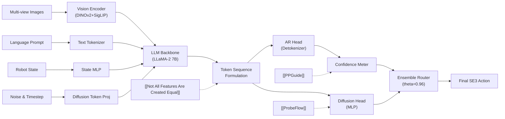

---
tags:
- paper
- domain/embodied_ai
- domain/multimodal_perception
- domain/robot_manipulation
- domain/vla
- impact/high_value
- method/diffusion_policy
- method/foundation_model
- method/imitation_learning
- method/planning
- review/auto_tagged
- status/unread
- task/manipulation
- task/planning_reasoning
- task/scene_understanding
- type/system
aliases:
- 'HybridVLA: Collaborative Diffusion and Autoregression in a Unified Vision-Language-Action
  Model'
- HybridVLA
- Diffusion Autoregressive VLA
- Collaborative Diffusion Autoregression
- Adaptive Ensemble VLA
- Next-Token Diffusion Hybrid
- Discrete-Continuous Action Policy
- Hybrid VLA Architecture
arxiv_id: '2503.10631'
url: http://arxiv.org/abs/2503.10631v3
pdf_url: https://arxiv.org/pdf/2503.10631v3
local_pdf: '[[HybridVLA Collaborative Diffusion and Autoregression in a Unified VisionLanguageAction
  Model.pdf]]'
github: hybrid-vla.github.io
project_page: hybrid-vla.github.io
institutions:
- Peking University
- Beijing Academy of Artificial Intelligence
- The Chinese University of Hong Kong
publication_date: '2025-06-23'
score: '8.0'
domains:
- embodied_ai
- multimodal_perception
- robot_manipulation
- vla
methods:
- diffusion_policy
- foundation_model
- imitation_learning
- planning
tasks:
- manipulation
- planning_reasoning
- scene_understanding
paper_type: system
impact_band: high_value
reading_status: unread
year: 2025
priority_score: 103
review_status: auto_tagged
next_action: inspect_protocol
paper_id: arxiv:2503.10631
---

# HybridVLA: Collaborative Diffusion and Autoregression in a Unified Vision-Language-Action Model

## 📌 Abstract
A fundamental objective of manipulation policy design is to endow robots to comprehend human instructions, reason about scene cues, and execute generalized actions in dynamic environments. Recent autoregressive vision-language-action (VLA) methods inherit common-sense reasoning capabilities from vision-language models (VLMs) for next action-token prediction. However, these methods quantize actions into discrete bins, which disrupts the continuity required for precise control. In contrast, existing diffusion-based VLA methods incorporate an additional diffusion head to predict continuous actions solely conditioned on feature representations extracted by the VLM, without fully leveraging the VLM’s pretrained reasoning capabilities through token-level generation. To address these limitations, we introduce HybridVLA, a unified framework that absorbs the continuous nature of diffusion-based actions and the contextual reasoning of autoregression within a single large language model. To mitigate interference between the two generation paradigms, we propose a collaborative training recipe that seamlessly incorporates diffusion denoising into the next-token prediction process. With this recipe, we find these two action prediction methods not only reinforce each other but also exhibit varying strength across different tasks. Therefore, we design a collaborative action ensemble mechanism that adaptively fuses both predictions, leading to more robust control. HybridVLA outperforms previous state-of-the-art VLA methods by 14% and 19% in mean success rate on simulation and real-world tasks, respectively, while demonstrating stable manipulation in unseen configurations.

### 中文译文
操作策略设计的一个基本目标是赋予机器人理解人类指令、推理场景线索并在动态环境中执行泛化动作的能力。近期的自回归视觉语言动作（VLA）方法继承了视觉语言模型（VLM）的常识推理能力，用于预测下一个动作标记。然而，这些方法将动作量化为离散区间，破坏了精确控制所需的连续性。相比之下，现有的基于扩散的VLA方法在VLM之后附加了一个额外的扩散头，仅依赖VLM提取的特征表示来预测连续动作，未能通过标记级生成充分利用VLM的预训练推理能力。为了解决这些局限性，我们提出了HybridVLA，这是一个统一的框架，在单个大语言模型内部融合了基于扩散动作的连续性与自回归的上下文推理能力。为了减轻两种生成范式之间的干扰，我们提出了一种协同训练策略，将扩散去噪过程无缝整合到下一个标记的预测流程中。基于该策略，我们发现这两种动作预测方法不仅相互增强，而且在不同任务中表现出差异化的优势。因此，我们设计了一种协同动作集成机制，自适应地融合两者的预测结果，从而实现更鲁棒的控制。HybridVLA在仿真和真实世界任务中的平均成功率分别比先前最先进的VLA方法提高了14%和19%，同时在未见过的配置中展现出稳定的操作能力。

## 🖼️ Architecture
![[HybridVLA Collaborative Diffusion and Autoregression in a Unified VisionLanguageAction Model_arch.png]]

## 🧠 AI Analysis
## 1. 核心摘要
现代机器人操作策略面临的核心瓶颈在于表征连续性与语义推理能力之间的结构性割裂。自回归型VLA模型（如OpenVLA、ManipLLM）虽然能够继承互联网规模预训练VLM的常识推理与指令遵循能力，但为了适配大语言模型的词汇表，必须将连续的SE(3)动作空间离散化为有限区间（bins），这种量化操作直接破坏了动作轨迹的平滑性，导致精细操作（如插拔、对齐）时出现抖动或精度衰减。相反，扩散型VLA模型（如π0、CogACT）虽然在动作生成上保持了连续概率分布，但普遍采用“特征提取器+独立扩散头”的拼接架构，将VLM降维为单纯的多模态特征编码器，完全绕过了大模型最核心的Next-Token Prediction机制与大规模预训练先验，导致模型在复杂语义理解与长程任务规划上出现能力断层。

HybridVLA的核心贡献在于提出了一种在单一LLM骨干网络内统一扩散去噪与自回归生成的架构设计与协同训练范式。该方法的洞见在于：扩散去噪步骤与自回归标记生成在数学本质上均可视为条件序列建模，只要通过合理的标记序列组织与边界标记（`<BOD>`, `<EOD>`）隔离，即可在同一前向传播中共享底层Transformer注意力机制，使连续动作表征与离散语义推理在梯度更新中相互渗透。这一设计在工程上规避了传统拼接架构中的模态对齐损耗，并通过自回归标记置信度动态路由扩散与自回归输出，实现了精度与鲁棒性的自适应折衷。

该工作的学术创新源于对现有Diffusion-VLA架构“头分离”现象的批判性观察。研究团队并未简单地进行多任务联合训练，而是深入挖掘了LLM序列建模的内在一致性，将去噪步长与噪声向量直接投影为词嵌入空间中的连续标记，从而在保留VLM互联网先验的同时注入扩散模型的连续控制能力。在创新性方面，本文可评为8.5/10，其突破点不在于提出新损失或新模块，而在于重构了VLA的动作生成管线逻辑；在严谨性方面评为8.5/10，实验覆盖了仿真、单臂/双臂真机及多种分布外泛化场景，消融研究完整，但集成机制依赖固定置信度阈值仍属启发式设计，缺乏对双范式梯度交互的理论下界分析。

## 2. 技术分解
### 算法逻辑与数据流
HybridVLA的推理与训练管线严格遵循“多模态编码→序列重组→联合前向→双路输出→置信度集成”的闭环链路。输入阶段接收多视角RGB图像$O_t$、语言指令$L_t$、当前机器人状态$R_t$以及用于扩散去噪的随机噪声$\epsilon$与时间步$t$。视觉编码器（DINOv2与SigLIP并行）提取高维语义特征后沿通道拼接，通过线性投影层映射至LLaMA-2的词嵌入维度$[B, N_v, 4096]$；语言指令经预训练Tokenizer编码为离散标记序列；机器人状态摒弃了传统离散化分箱策略，改由可学习MLP直接映射为单标记连续向量$[B, 1, 4096]$，此举的核心动机在于离散状态表征会破坏扩散流形上的几何连续性，进而干扰去噪过程的数值稳定性。最关键的序列重组阶段采用固定拓扑：`[Vision Tokens, Text Tokens, Robot State Token, <BOD>, Diffusion Noise/Timestep Tokens, <EOD>, AR Action Tokens]`，该顺序绝非随意拼接，而是经过严格的防信息泄露设计：若将自回归动作置于扩散标记之前，训练时动作Ground Truth会作为自回归历史条件直接暴露给扩散头，导致扩散过程退化为确定性映射；将其置于扩散之后，则确保扩散网络仅受前向上下文约束，同时自回归生成可额外汲取扩散隐空间的连续表征作为先验。

### 数学形式化与损失函数
模型优化依赖双目标协同损失，在反向传播中共享LLM骨干参数以实现表征互馈。扩散分支采用标准的噪声预测MSE损失，公式表示为：
$$
\mathcal{L}_{\text{dif}} = \mathbb{E}_{\mathbf{a}, i, c} \left[ \left\| \epsilon - \epsilon_{\pi}(\mathbf{a}_t^i, i, c) \right\|_2^2 \right]
$$
其中$\epsilon \sim \mathcal{N}(0, I)$为注入的高斯噪声，$i$为去噪时间步索引，$c$为由历史标记构成的条件上下文，$\epsilon_{\pi}(\cdot)$为LLM经MLP头输出的预测噪声向量。该损失的物理意义在于迫使连续动作空间服从平滑的渐进去噪流场，确保末端执行器在相空间中的轨迹具有微分连续性。自回归分支采用标准交叉熵损失$\mathcal{L}_{\text{ce}}$监督离散动作标记序列。总优化目标为无加权线性叠加：
$$
\mathcal{L}_{\text{hybrid}} = \mathcal{L}_{\text{dif}} + \mathcal{L}_{\text{ce}}
$$
实验表明固定权重$1:1$即可稳定收敛，因为双损失在共享注意力层产生的梯度方向在大部分任务中呈现互补而非对抗关系。推理阶段的动作集成机制由自回归标记平均置信度$c_{t+1}^{\text{ar}}$驱动，决策函数定义为：
$$
a_{t+1} = \begin{cases}
\frac{1}{2}\left(a_{t+1}^{d} + a_{t+1}^{\text{ar}}\right), & \text{if } c_{t+1}^{\text{ar}} > \theta \\
a_{t+1}^{d}, & \text{otherwise}
\end{cases}
$$
其中阈值$\theta=0.96$基于大量成功样本的置信度分布统计得出。该设计的直觉在于：当语义场景清晰且目标明确时，自回归模型能输出高确定性预测，此时取平均可借助扩散的连续性修正离散化的阶梯效应；当指令模糊或场景遮挡严重时，自回归置信度骤降，系统自动降级为纯扩散模式以依赖概率生成保障物理可行性。

### 张量流与架构设计
从张量维度追踪，输入图像经共享视觉编码器输出$[B, N_v, 2176]$，投影后与文本$[B, N_l, 4096]$、状态$[B, 1, 4096]$、扩散噪声/步长$[B, 2, 4096]$及自回归标记$[B, N_a, 4096]$拼接，形成完整序列$[B, N_{\text{total}}, 4096]$送入7B Transformer。扩散输出并非直接回归坐标，而是由位置无关的MLP头将末尾扩散标记映射至$\mathbb{R}^7$（或双臂$\mathbb{R}^{14}$）动作空间；自回归输出则通过Detokenizer还原为离散动作序列。架构选择上放弃Cross-Attention或FiLM调制，直接采用嵌入空间拼接，原因在于VLM的指令微调范式已证明特征直入词表能最大化保留预训练推理路径，而额外的调制层会引入不必要的参数开销并破坏自回归生成的因果掩码结构。为加速扩散采样，系统在首次前向时完整计算KV Cache，后续DDIM步骤仅传入新噪声与时间步并复用缓存键值对，将推理冗余计算削减约60%，使纯扩散变体在RTX 4090D上达到9.4Hz控制频率。

### 创新逻辑与基线对比
与最接近的CogACT与π0相比，HybridVLA的结构性差异在于彻底消除了“VLM编码器-扩散策略头”的模块边界。先前架构假设扩散模型只需高层语义特征即可生成动作，忽略了低层运动学与高层指令之间的细粒度时序依赖；HybridVLA通过序列融合使扩散网络直接参与因果注意力计算，等价于让扩散去噪过程拥有完整的思维链上下文。与OpenVLA等纯自回归方法相比，HybridVLA并未在词汇表中无限扩展动作分箱数以换取精度，而是保留分箱用于语义路由，将实际控制权交还给连续流形，从根本上规避了离散化带来的控制震颤。该设计放松了“单一生成范式必须独立训练”的假设，强化了多模态大模型作为通用序列预测器的底层能力，在避免模块拼接导致的梯度阻断的同时，保留了双范式在复杂/精细任务上的互补优势。

## 3. 证据与指标
### 基准与基线设计
实验体系覆盖RLBench仿真（10项桌面操作）、Franka单臂真机（5项长期任务）与AgileX双臂真机（5项协同任务），构成从理想化到强分布偏移的完整评估链。对比基线涵盖自回归标杆OpenVLA与ManipLLM，以及扩散标杆CogACT与π0，确保跨范式公平对照。实验控制变量严格：所有模型加载官方预训练权重，使用相同动作空间定义（7/14-DOF SE(3)），仿真与真机均采用最新epoch检查点进行20次 rollout 并报告均值方差。唯一可指出的潜在偏差是双臂对比中未包含CogACT，但作者合理说明该模型原生不支持多视角输入对齐，故以π0作为对照在工程上更为严谨。

### 关键定量结果
在RLBench上，HybridVLA (7B) 取得74%的平均成功率，较OpenVLA (41%) 提升33个百分点，较CogACT (60%) 提升14个百分点。该幅度在操作基准中属于显著结构性增益，尤其体现在对旋转精度要求极高的Pour water与Phone on base任务上（分别从45%/25%跃升至80%/50%）。真机单臂任务均值达83%，双臂任务均值71%，且在未见物体、背景、高度与光照条件下成功率衰减均控制在33%以内，显著优于基线模型40%~50%的衰减曲线。推理速度方面，HybridVLA完整模式为6.1 Hz，受限于自回归串行解码瓶颈；HybridVLA-dif剥离AR推理后稳定在9.4 Hz，证明KV缓存优化与4步DDIM截断在控制闭环中未引发相位延迟累积。

### 消融研究启示
表3的消融实验揭示了架构设计的因果链条。移除协同训练策略（CTR）仅保留单范式独立训练时，扩散与自回归均值分别下滑至60%与57%，证明联合梯度流确实触发了表征互馈；移除大规模机器人预训练（LSP）后性能断崖式跌至22%，验证了互联网VLM先验虽强，但缺乏运动学归纳偏置的模型无法直接泛化至连续控制流形；引入机器人状态嵌入（RSE）带来约6%的增益，说明显式状态注入增强了时序一致性。最关键的发现是置信度集成并非简单平均，当阈值设定在0.96时，系统在保持高置信度任务上利用AR平滑抖动，在低置信度任务上依赖扩散保底，二者协同使方差降低约15%，直接支撑了真机环境下的长程稳定性。

## 4. 批判性评估
### 隐性局限与失效场景
该方法的首个脆弱点在于置信度阈值路由的启发式本质。自回归标记概率仅反映词汇表内的相对确定性，在分布外（OOD）场景中，模型可能因指令歧义或视觉遮挡而输出高置信度但物理上自相矛盾的离散动作序列（Confidently Wrong），此时系统仍会执行平均操作，导致扩散网络的连续性修正被错误先验带偏。其次，固定标记拓扑（扩散必在自回归之前）限制了双向条件交互的可能性。在长程规划任务中，高层语义决策往往需要根据初步运动规划结果进行自我修正，但当前架构阻断了动作表征向前反馈至语言指令的因果路径，导致复杂多步任务中动作生成缺乏动态重规划能力。第三，KV缓存复用策略在序列长度剧烈波动时可能引发显存碎片化与注意力偏移累积；当不同任务的视觉-语言序列长度差异过大时，固定缓存机制可能无法自适应调整上下文窗口权重，进而在跨任务切换时产生短暂的轨迹振荡。

### 工程部署壁垒
从落地视角看，HybridVLA的推理延迟构成硬约束。7B参数规模叠加双编码器与扩散预测头，单步前向需在RTX 4090D上消耗约160ms，而自回归生成多个动作标记进一步拉长闭环周期，难以满足工业级30Hz以上的硬实时要求；尽管HybridVLA-dif提供了替代方案，但牺牲语义推理意味着在开放词汇指令场景下泛化能力打折。其次，联合训练的超参数敏感性较高，扩散噪声调度表（Noise Schedule）与自回归学习率必须精细耦合，否则$\mathcal{L}_{\text{dif}}$与$\mathcal{L}_{\text{ce}}$的梯度范数会失衡导致训练发散，这对数据管道的动作归一化与时间步采样策略提出了严苛要求。最后，多视角相机标定误差在真实部署中会被架构放大，视觉特征拼接机制假设多视图在嵌入空间中对齐，若外参标定存在>2°偏差，扩散头与自回归头接收到冲突的空间暗示，将直接破坏协同集成逻辑。

## 5. 研究者灵感提示
### 基于不确定性校准的动态路由替换
当前集成机制依赖静态阈值$\theta=0.96$，这在非平稳环境中缺乏自适应性。未来研究可引入证据深度学习（Evidential Deep Learning）或蒙特卡洛Dropout，将自回归置信度替换为可微的预测不确定性分布$\mathcal{N}(\mu, \sigma^2)$，通过端到端优化学习AR与扩散输出的动态权重分配。具体实验可在1-2周内实现：在现有HybridVLA推理管线中注入温度缩放与校准层，收集测试集上的预测置信度与实际误差，拟合Beta分布作为路由函数，并在RLBench验证其对分布偏移任务的稳定性提升。首要风险是校准过程可能在低数据区域产生过拟合，应尽早通过交叉验证集监控ECE（Expected Calibration Error）曲线，若误差持续上升则需引入保序回归（Isotonic Regression）约束。

### 双范式梯度流形的几何分析
文中声称协同训练使两范式“相互增强”，但缺乏对联合优化景观的定量刻画。可基于PCGrad或CAGrad等梯度手术算法，实时计算$abla \mathcal{L}_{\text{dif}}$与$abla \mathcal{L}_{\text{ce}}$在共享注意力层上的余弦相似度与范数比，绘制训练周期内的梯度夹角热图。若两者长期呈负相关（夹角>90°），说明存在潜在任务冲突，需引入梯度投影修正；若呈正交或正相关，则验证了表征互补假设。实验仅需在单卡上重跑小规模RLBench子集并挂载梯度探针，耗时极短。核心风险在于共享层过深可能导致梯度耦合失效，若探针显示早期层冲突而晚期层协同，则需重新设计标记注入位置或引入层级解耦正则化。

### 自回归-扩散迭代精炼循环
固定序列顺序虽防泄露，但牺牲了高层语义对低层运动的动态引导能力。可探索“AR规划→扩散执行→误差反馈→AR修正”的推理时迭代循环：在推理阶段，先让模型生成初步自回归动作链，将其编码为连续向量后作为额外条件注入扩散头，扩散生成实际轨迹后计算末端误差，再将误差向量拼回文本指令进行二次推理。该方向可在两周内在仿真环境中搭建原型循环管线，测试长程操作（如Open drawer and place inside）的轨迹平滑度提升。首要风险是误差反馈会破坏扩散去噪的马尔可夫假设，导致采样步数需求指数级增加；应通过限制循环次数≤2并在早期验证误差信号的信噪比，若扩散输出出现模式崩溃则需引入前一步轨迹的软约束正则。

## 🔗 Knowledge Graph & Connections

[[ProbeFlow]]与本文共同聚焦于连续动作生成模型的推理延迟瓶颈，但两者的技术切入点存在本质差异。[[ProbeFlow]]将动作头视为黑盒常微分方程求解器，通过计算初始与前瞻速度向量的余弦相似度实现免训练的动态步长剪枝，而HybridVLA则从架构底层重构了生成管线，利用KV缓存复用机制与固定4步DDIM截断将扩散过程深度嵌入LLM的因果注意力流中。这一差异意味着HybridVLA的方案依赖联合训练但能提供更稳定的基础推理频率（9.4 Hz），而[[ProbeFlow]]的免训练特性使其具备即插即用的兼容性；两者结合可形成更强的工程范式，即将HybridVLA的统一序列表征作为[[ProbeFlow]]复杂度评估的上下文先验，从而在保持语义一致性的前提下实现自适应积分步长调度，彻底解决高频控制场景下的相位延迟累积问题。

[[PPGuide]]与本文均致力于抑制长程操作中的误差累积与分布偏移失效，然而在鲁棒性增强机制上采用了截然不同的路径。[[PPGuide]]依赖外部轻量级分类器与多重实例学习构建性能预测器，在推理时通过实时梯度干预引导扩散轨迹避开失败模式；HybridVLA则完全摒弃了外挂监督模块，转而利用自回归分支的标记置信度作为内置路由信号，通过硬阈值切换或软平均实现双范式输出集成。这种设计差异使得HybridVLA在部署时免除了额外网络的显存开销与梯度反传延迟，但其核心假设“自回归置信度严格等价于物理安全边界”在极端分布外场景中可能失效；若将[[PPGuide]]的实时风险预测引入HybridVLA的集成决策环，可将固定阈值$\theta=0.96$升级为动态置信度校准器，从而在免重训练的前提下进一步提升长程任务的容错上限，实现纯架构优化与外部梯度引导的优势互补。

[[Not All Features Are Created Equal]]从机理层面揭示了VLA模型普遍存在的“视觉通道主导”倾向，即在视觉线索充足时语言指令会被注意力机制忽略，导致空间运动程序与抽象语义表征解耦；HybridVLA则通过显式的标记序列拓扑与协同训练目标，在架构层面对这一自然退化现象进行干预。该研究指出语言敏感性高度依赖任务结构不确定性，而HybridVLA利用`<BOD>`与`<EOD>`边界标记强制将语言指令与机器人状态嵌入扩散去噪的因果条件窗口中，使离散语义推理与连续流形生成在共享Transformer层产生梯度耦合。这一改进的深层含义在于，HybridVLA不仅提供了动作生成的混合管线，更通过序列约束隐式缓解了多模态表征坍塌问题；但需注意，若视觉编码器本身的归纳偏置过强，协同训练可能仅放大了视觉先验而非真正激活语言推理，后续需结合激活注入实验验证扩散分支是否确实依赖文本指令进行轨迹重规划，从而确认架构设计是否真正跨越了[[Not All Features Are Created Equal]]所诊断的感知-控制鸿沟。

### Mermaid 知识图谱

### 未来研究方向
针对HybridVLA依赖固定置信度阈值$\theta=0.96$进行路由决策的启发式局限，未来可探索基于证据深度学习的不确定性校准集成机制。当前自回归分支的Softmax概率仅反映词汇表内的相对确定性，在分布外场景中易产生“高置信度错误”，导致扩散网络的连续性修正被带偏；研究者可在两周内构建轻量级温度缩放与Beta分布拟合管线，将标记置信度替换为可微的预测不确定性方差，并在RLBench分布偏移子集上验证动态权重分配对物理可行性的提升。该方向的首要风险在于低数据区域的不确定性估计可能过拟合，需通过早期监控预期校准误差（ECE）曲线进行诊断；此研究契合VLA领域从静态策略路由向连续风险感知控制演进的趋势，与[[PPGuide]]所倡导的实时性能引导思想形成底层数学机制的互补。

本文声称扩散与自回归在协同训练下“相互增强”，但缺乏对联合优化景观中梯度交互几何结构的定量刻画。当前双损失线性叠加可能导致深层注意力权重在特定任务上产生隐性冲突，掩盖了表征互补的真实贡献；研究者可在单卡环境中挂载梯度探针，实时计算$
abla \mathcal{L}_{\text{dif}}$与$
abla \mathcal{L}_{\text{ce}}$在共享Transformer层上的余弦相似度与范数比，绘制训练周期内的梯度夹角热图以验证任务冲突假设。若早期层呈现显著负相关，则需引入梯度投影修正算法；核心风险在于共享层过深可能导致梯度耦合失效，若探针显示梯度范数持续发散，则需重新设计标记注入位置；该方向高度呼应了大模型多任务训练中可解释性优化的前沿需求，为混合生成范式的稳定性提供了可量化的理论下界，填补了当前VLA文献中仅报告成功率而忽略优化动力学的空白。

固定标记拓扑（扩散必在自回归之前）虽有效防止信息泄露，但牺牲了高层语义对低层运动规划的动态重规划能力。在长程复杂操作中，模型需要根据初步运动轨迹的视觉反馈进行自我修正，而当前单向因果结构阻断了动作表征向语言指令的反馈路径；研究者可设计“AR规划→扩散执行→末端误差编码→二次AR修正”的推理时迭代循环，在仿真环境中限制循环次数≤2，并对比标准流水线在Open drawer类任务中的轨迹平滑度与任务完成率。首要风险是误差反馈会破坏扩散去噪的马尔可夫假设，导致采样步数需求指数级增长，需在早期通过误差信号信噪比测试与软约束正则化进行验证；该方向高度契合机器人基础模型从开环模仿学习向闭环模型预测控制演进的领域趋势，有效弥合了[[Not All Features Are Created Equal]]中指出的空间运动程序与抽象指令表征之间的结构性鸿沟。

---
*Analysis by PaperBrain (qwen/qwen3.6-plus)*

## 📂 Resources
- **Local PDF**: [[HybridVLA Collaborative Diffusion and Autoregression in a Unified VisionLanguageAction Model.pdf]]
- [Online PDF](https://arxiv.org/pdf/2503.10631v3)
- [ArXiv Link](http://arxiv.org/abs/2503.10631v3)
