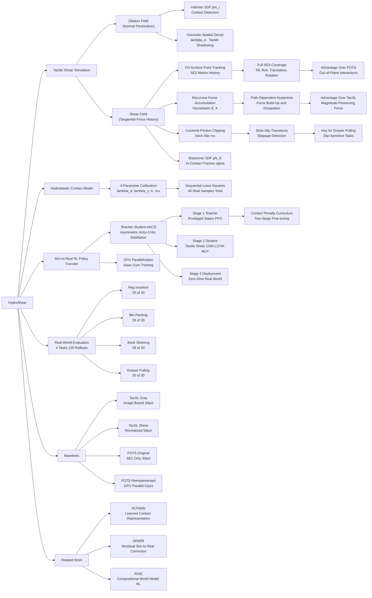

---
tags:
  - paper
  - Robot_Manipulation
  - Sim2Real
  - Reinforcement_Learning
  - Embodied_AI
aliases:
  - "HydroShear: Hydroelastic Shear Simulation for Tactile Sim-to-Real Reinforcement Learning"
url: https://huggingface.co/papers/2603.00446
pdf_url: https://arxiv.org/pdf/2603.00446.pdf
local_pdf: "[[HydroShear Hydroelastic Shear Simulation for Tactile SimtoReal Reinforcement Learning.pdf]]"
github: "None"
project_page: "https://hydroshear.github.io"
institutions:
  - "University of Michigan, Robotics Department"
  - "Amazon Industrial Robotics (AIR)"
publication_date: "2026-02-28"
score: 8
---

# HydroShear: Hydroelastic Shear Simulation for Tactile Sim-to-Real Reinforcement Learning

## 📌 Abstract
In this paper, we address the problem of tactile sim-to-real policy transfer for contact-rich tasks. Existing methods primarily focus on vision-based sensors and emphasize image rendering quality while providing overly simplistic models of force and shear. Consequently, these models exhibit a large sim-to-real gap for many dexterous tasks. Here, we present HydroShear, a non-holonomic hydroelastic tactile simulator that advances the state-of-the-art by modeling: a) stick-slip transitions, b) path-dependent force and shear build up, and c) full SE(3) object-sensor interactions. HydroShear extends hydroelastic contact models using Signed Distance Functions (SDFs) to track the displacements of the on-surface points of an indenter during physical interaction with the sensor membrane. Our approach generates physics-based, computationally efficient force fields from arbitrary watertight geometries while remaining agnostic to the underlying physics engine. In experiments with GelSight Minis, HydroShear more faithfully reproduces real tactile shear compared to existing methods. This fidelity enables zero-shot sim-to-real transfer of reinforcement learning policies across four tasks: peg insertion, bin packing, book shelving for insertion, and drawer pulling for fine gripper control under slip. Our method achieves a 93% average success rate, outperforming policies trained on tactile images (34%) and alternative shear simulation methods (58%-61%).

## 🖼️ Architecture
![[HydroShear Hydroelastic Shear Simulation for Tactile SimtoReal Reinforcement Learning_arch.png]]

## 🧠 AI Analysis

# 🚀 Deep Analysis Report: HydroShear: Hydroelastic Shear Simulation for Tactile Sim-to-Real Reinforcement Learning

## 📊 Academic Quality & Innovation
---

# HydroShear: Deep Engineering Analysis

---

## 1. Core Snapshot

### Problem Statement

The sim-to-real transfer of RL policies for contact-rich manipulation is bottlenecked by tactile simulation fidelity. Existing approaches split into two inadequate camps: (1) vision-based tactile simulators that achieve high RGB image quality but poorly model the underlying shear force dynamics; and (2) physics-based approximations (penalty-based, hydroelastic) that model forces but fail to reproduce *tactile shadowing*, path-dependent deformation hysteresis, or full SE(3) object–sensor interactions. Specifically, prior marker-based methods such as FOTS are limited to SE(2) planar motion and cannot model the out-of-plane (rolling, tilting) components critical for dexterous manipulation. This simulation gap causes policies trained in simulation to fail at zero-shot real-world deployment on tasks requiring slip detection, multi-object contacts, and precise force modulation.

### Core Contribution

HydroShear introduces a non-holonomic, GPU-parallelizable hydroelastic contact model that uses Signed Distance Functions (SDFs) to track the full SE(3) path-dependent displacement history of indenter surface points relative to the elastomer membrane, enabling physics-consistent tactile shear simulation that captures stick–slip transitions, force build-up/dissipation, and tactile shadowing, achieving 93% average zero-shot sim-to-real success rate across four contact-rich manipulation tasks.

### Academic Rating

- **Innovation: 7.5/10** — The core novelty is the principled extension of hydroelastic contact models to tactile shear simulation via SDF-based on-surface point tracking and recursive force accumulation with Coulomb friction. The GPU-parallelizable formulation enabling large-scale RL training is a practically significant contribution. However, the individual components (hydroelastic contact, SDF-based collision, recursive viscoelastic force tracking, AACD distillation) are each existing techniques; the novelty lies in their integration and application.
- **Rigor: 7/10** — The paper provides clear mathematical formulations, a structured calibration procedure, and a systematic multi-task evaluation with ablations. Weak points include limited statistical reporting (no standard deviations on success rates), a relatively small calibration dataset (10 samples per motion type), and the reliance on Isaac Gym's Kelvin-Voigt contact model as the underlying physics engine, which introduces its own inaccuracies not analyzed in depth.

---

## 2. Technical Decomposition

### Algorithmic Logic: Step-by-Step

**Step 1: Define the tactile sensing geometry.**
The elastomer membrane of the GelSight Mini sensor is represented as a 2D grid of N tactile query points (marker positions) $\{\mathbf{p}_i\}_{i=1}^N$ where $\mathbf{p}_i \in \mathbb{R}^3$. Each point has an associated 2D shear vector $\mathbf{s}_i = (d_x, d_y) \in \mathbb{R}^2$. The goal of the model is to produce the mapping $\mathbf{M}: ((x,y), \{{}^E\mathbf{X}_t^I\}_{t=0}^T) \rightarrow \mathbf{s}_i$, predicting marker displacement fields from the indenter pose history. The total displacement field is decomposed as:
$$\mathbf{M}_t((x,y), {}^E\mathbf{X}_{0:t}^I) = \mathbf{M}_t^d((x,y)) + \mathbf{M}_t^s((x,y), {}^E\mathbf{X}_{0:t}^I)$$
where $\mathbf{M}_t^d$ is the dilation (normal penetration) component and $\mathbf{M}_t^s$ is the shear component.

**Step 2: Compute the dilation field.**
In-contact tactile grid points are identified by evaluating the indenter SDF $\phi_I : \mathbb{R}^3 \rightarrow \mathbb{R}$: a grid point $\mathbf{p}_i$ is in contact if $\phi_I(\mathbf{p}_i) < 0$. The dilation field aggregates the influence of all in-contact grid points $C = \{c_i \in \mathbb{N} \mid \phi_I(\mathbf{p}_{c_i}) < 0\}$:
$$\mathbf{M}_t^d = \sum_{i=1}^{|C|} -\phi_I(\mathbf{p}_{c_i}) \cdot \mathbf{v}_{c_i} \cdot \exp\{-\lambda_d \|\mathbf{v}_{c_i}\|_2^2\}$$
$$\mathbf{v}_{c_i} = \begin{bmatrix} x \\ y \end{bmatrix} - \mathbf{p}_{c_i}^{xy}$$
Here $-\phi_I(\mathbf{p}_{c_i})$ weights the contribution by penetration depth, and the Gaussian decay $\exp\{-\lambda_d \|\mathbf{v}_{c_i}\|_2^2\}$ models elastomer shadowing — the physical phenomenon that deformation propagates spatially from the contact point.

**Step 3: Track on-surface indenter surface points (hydroelastic shear core).**
The key innovation is tracking M on-surface points $\{\mathbf{o}_{j,t}\}_{j=1}^M$ on the indenter in the elastomer frame. Their coordinates are computed as $\mathbf{o}_{j,t} = {}^E\mathbf{X}_t^I \bar{\mathbf{o}}_j$, where $\bar{\mathbf{o}}_j$ are the local indenter surface point coordinates. A recursive force tracker is maintained to model viscoelastic force accumulation.

**Step 4: Compute the fraction of displacement that is in-contact (α calculation).**
For each indenter surface point $\mathbf{o}_{j,t}$, the fraction of the displacement that is actually in contact with the elastomer is estimated using the elastomer SDF $\phi_E : \mathbb{R}^3 \rightarrow \mathbb{R}$:
$$\alpha_{j,t} = \frac{\text{ReLU}(-\phi_E(\mathbf{o}_{j,t})) - \text{ReLU}(-\phi_E(\mathbf{o}_{j,t-1}))}{\phi_E(\mathbf{o}_{j,t}) - \phi_E(\mathbf{o}_{j,t-1})}$$
$$\mathbf{d}_{j,t} = \alpha_{j,t}^d(\mathbf{o}_{j,t} - \mathbf{o}_{j,t-1})$$
The ReLU formulation compactly handles three cases: (a) both SDF values negative → fully in contact ($\alpha=1$); (b) both positive → fully out of contact ($\alpha=0$); (c) opposite signs → partial contact ($0 < \alpha < 1$). This avoids discontinuities at the contact boundary.

**Step 5: Accumulate forces recursively with Coulomb friction (stick-slip).**
The recursive hydroelastic contact force tracker updates forces based on viscoelastic elastomer properties $(E, K, A_j)$ where E is normal stiffness, K is tangential stiffness, and $A_j$ is the surface area element:
$$\tilde{\mathbf{f}}_{j,t} = F(\tilde{\mathbf{f}}_{j,t-1}, {}^E\mathbf{X}_t^I, {}^E\mathbf{X}_{t-1}^I, \bar{\mathbf{o}}_j; E, K, A_j, \mu)$$
The force update decomposes displacement $\mathbf{d}_{j,t}$ into normal ($d_{j,t}^n = \langle \mathbf{d}_{j,t}, \hat{\mathbf{n}}_j \rangle$) and tangential ($\mathbf{d}_{j,t}^{xy} = \mathbf{d}_{j,t} - d_{j,t}^n \hat{\mathbf{n}}_j$) components:
$$f_{j,t}^n = \tilde{f}_{j,t-1}^n + E A_j d_{j,t}^n \quad \text{(normal stiffness accumulation)}$$
$$\mathbf{f}_{j,t}^{xy} = \tilde{\mathbf{f}}_{j,t-1}^{xy} + K A_j \mathbf{d}_{j,t}^{xy} \quad \text{(tangential stiffness accumulation)}$$
Normal forces are lower-bounded by zero (no tension/pulling):
$$\bar{f}_{j,t}^n = \text{ReLU}(f_{j,t}^n)$$
Coulomb friction is enforced by clipping the tangential force magnitude:
$$\bar{\mathbf{f}}_{j,t}^{xy} = \min\left(1, \frac{\mu \bar{f}_{j,t}^n}{\|\mathbf{f}_{j,t}^{xy}\|_2}\right) \mathbf{f}_{j,t}^{xy}$$
Contact forces are reset to zero when the indenter surface point leaves the elastomer ($H(-\phi_E(\mathbf{o}_{j,t}))$ term via the Heaviside function).

**Step 6: Project forces onto the elastomer surface to get the projected surface point.**
The contact force $\tilde{\mathbf{f}}_{j,t}$ is used to find the corresponding elastomer surface point:
$$\hat{\mathbf{o}}_{j,t} = \mathbf{o}_{j,t} + \hat{\mathbf{f}}_{j,t}$$
where $\hat{\mathbf{f}}_{j,t}$ are the displacements applied to the indenter surface points. Under sticking, $\hat{\mathbf{o}}_{j,t}$ does not change; under sliding, it shifts to represent the new contact location on the elastomer.

**Step 7: Compute the shear vector field.**
The shear field is assembled from the set $K_t = \{k_i \mid \phi_E(\mathbf{o}_{k_i,t}) < 0\}$ of indenter surface points currently in penetration with the elastomer:
$$\mathbf{M}_t^s = \sum_{i=1}^{|K_t|} -\phi_E(\mathbf{o}_{k_i,t}) \cdot -\tilde{\mathbf{f}}_{k_i,t}^{xy} \cdot \exp\{-\lambda_s \|\mathbf{v}_{k_i}\|_2^2\}$$
$$\mathbf{v}_{k_i} = \begin{bmatrix} x \\ y \end{bmatrix} - \hat{\mathbf{o}}_{k_i,t}^{xy}$$
Each in-penetration indenter surface point contributes to the shear field weighted by its penetration depth and spatially attenuated via Gaussian decay centered at its projected elastomer surface position. The combination captures the spatial spreading characteristic of real elastomer deformation.

**Step 8: RL training pipeline (Teacher-Student AACD).**
A three-stage pipeline is used:
- *Stage 1*: A teacher actor-critic is trained with PPO in Isaac Gym using privileged state information (object poses, contact forces). A contact penalty curriculum is applied — training proceeds initially without contact penalty until the task is first solved, then the penalty is introduced to encourage controlled contact behavior.
- *Stage 2*: A student policy is trained from scratch using AACD (Asymmetric Actor-Critic Distillation), initialized with the pretrained teacher critic. The student observes EE pose, goal pose, and tactile shear feedback (no privileged states). A CNN processes the tactile shear image, followed by LSTM and MLP layers.
- *Stage 3*: Zero-shot deployment of the student actor in the real world.

**Intuition for this flow:** The decomposition into dilation (penetration depth) + shear (tangential force history) mirrors the physical mechanisms of elastomer deformation independently. The recursive force tracker is motivated by the observation that real elastomers exhibit path-dependent hysteresis — the current deformation state depends on the loading history, not just instantaneous contact geometry. This is precisely what instantaneous penalty-based methods miss.

### Mathematical Formulation Summary

| Component | Equation | Physical Meaning |
|---|---|---|
| Dilation field | $\mathbf{M}_t^d = \sum -\phi_I(\mathbf{p}_{c_i}) \cdot \mathbf{v}_{c_i} \cdot \exp\{-\lambda_d \|\mathbf{v}_{c_i}\|_2^2\}$ | Models elastomer bulge from normal indenter penetration with spatial shadowing |
| In-contact fraction | $\alpha_{j,t} = \frac{\text{ReLU}(-\phi_E(\mathbf{o}_{j,t})) - \text{ReLU}(-\phi_E(\mathbf{o}_{j,t-1}))}{\phi_E(\mathbf{o}_{j,t}) - \phi_E(\mathbf{o}_{j,t-1})}$ | Determines how much of the incremental displacement contributes to in-contact deformation |
| Normal force accumulation | $f_{j,t}^n = \tilde{f}_{j,t-1}^n + EA_j d_{j,t}^n$ | Linear spring model for elastomer normal stiffness |
| Tangential force accumulation | $\mathbf{f}_{j,t}^{xy} = \tilde{\mathbf{f}}_{j,t-1}^{xy} + KA_j \mathbf{d}_{j,t}^{xy}$ | Linear spring model for tangential (shear) stiffness |
| Coulomb clipping | $\bar{\mathbf{f}}_{j,t}^{xy} = \min(1, \frac{\mu \bar{f}_{j,t}^n}{\|\mathbf{f}_{j,t}^{xy}\|_2})\mathbf{f}_{j,t}^{xy}$ | Implements stick-slip transition: sliding occurs when tangential force exceeds $\mu$ times normal force |
| Shear field aggregation | $\mathbf{M}_t^s = \sum -\phi_E(\mathbf{o}_{k_i,t}) \cdot -\tilde{\mathbf{f}}_{k_i,t}^{xy} \cdot \exp\{-\lambda_s \|\mathbf{v}_{k_i}\|_2^2\}$ | Aggregates force contributions from all in-penetration surface points with distance-based attenuation |

**Model parameters requiring calibration:** $(\lambda_d, \lambda_s, K, \mu)$ — four scalar values calibrated sequentially via least-squares optimization on 10 real samples per motion type.

**Calibration objective functions:**
$$\lambda_d^* = \arg\min_{\lambda_d} \sum_{i=1}^n \|\mathbf{Y}_i^d - \mathbf{M}_t^d((x_i, y_i); \lambda_d)\|_2^2$$
$$\lambda_s^* = \arg\min_{\lambda_s} \sum_{i=1}^n \|\hat{\mathbf{Y}}_i^s - \mathbf{M}_t((x_i, y_i); \lambda_d^*, \lambda_s, 1, 1e5)\|_2^2$$
$$K^* = \arg\min_K \sum_{i=1}^n \|\mathbf{Y}_i^s - \mathbf{M}_t((x_i, y_i); \lambda_d^*, \lambda_s^*, K, 1e5)\|_2^2$$
$$\mu^* = \arg\min_\mu \sum_{i=1}^n \|\mathbf{Y}_i^\mu - \mathbf{M}_t((x_i, y_i); \lambda_d^*, \lambda_s^*, K^*, \mu)\|_2^2$$
The sequential decoupling is a deliberate approximation to avoid solving the full highly nonlinear joint problem where global optima are not guaranteed.

### Tensor Flow & Architecture

The student policy network processes:
- **Tactile shear input**: $[B, 2, H, W]$ (2-channel vector field: $d_x, d_y$ per grid point) → CNN encoder → feature vector $[B, F]$
- **Proprioceptive/goal inputs**: EE pose and relative EE-goal pose → MLP embedding
- **Temporal integration**: Concatenated features → LSTM → hidden state $[B, H_{LSTM}]$ → MLP → action $[B, A]$

The teacher critic receives additional privileged state channels (contact forces, object poses) processed through a separate MLP branch. The AACD framework initializes the student's critic with the pretrained teacher critic weights, providing a strong value function baseline that guides the student's policy learning toward regions of the state space already explored by the privileged teacher.

### Innovation Logic

**vs. TacSL:** TacSL uses an instantaneous penalty-based force field that approximates contact from SDF penetration depth and relative velocity. It has no force accumulation history and therefore cannot model hysteresis, stick-slip, or path-dependent shear build-up. The normalized shear variant discards magnitude information critical for multi-object contacts (Bin Packing).

**vs. FOTS:** FOTS decomposes marker displacement into three components tracking SE(2) object motion (translation + rotation in plane). This fundamentally limits it to in-plane interactions. HydroShear tracks full SE(3) motion via SDF-based surface point tracking, enabling tilt and roll components that are critical for book shelving (lateral insertion) and bin packing (object rolling).

**vs. FEM methods:** FEM-based tactile simulation is accurate but requires $O(n^3)$ linear system solves per time step, making it computationally prohibitive for RL training at scale (thousands of parallel environments). HydroShear's formulation is embarrassingly parallelizable: each grid point's dilation and shear contributions are computed independently, enabling GPU batching across all environments simultaneously.

---

## 3. Evidence & Metrics

### Benchmarks & Baselines

The paper evaluates against five policy variants across four tasks (Table II):
1. **TacSL Gray**: Grayscale tactile image policy (image-based baseline)
2. **TacSL Shear**: Per-taxel normalized shear vector (discards magnitude)
3. **FOTS (Original)**: Original FOTS implementation (SE(2) only)
4. **FOTS (Reimplemented)**: FOTS with GPU parallelization + contact-patch-centered shear computation (a significantly improved baseline introduced by the authors)
5. **HydroShear**: The proposed method

The experimental design is largely fair: all student policies use identical network architectures (CNN + LSTM + MLP), identical observation spaces (EE pose, goal pose, tactile shear), and the same teacher critic for AACD distillation. The only variable is the tactile simulation framework. A potential fairness concern is that the FOTS reimplementation was modified by the authors, though they argue this makes it a stronger baseline and these modifications are disclosed transparently.

### Key Results (Table II: 30 rollouts per task)

| Model | Peg | Bin | Book | Drawer | Total | Rate |
|---|---|---|---|---|---|---|
| TacSL Gray | 16/30 | 16/30 | 6/30 | 3/30 | 41/120 | 34.2% |
| TacSL Shear | 19/30 | 4/30 | 23/30 | 24/30 | 70/120 | 58.3% |
| FOTS (orig.) | 1/30 | 5/30 | 20/30 | 15/30 | 41/120 | 34.2% |
| FOTS (Reimpl.) | 20/30 | 24/30 | 26/30 | 3/30 | 73/120 | 60.8% |
| **HydroShear** | **25/30** | **29/30** | **28/30** | **30/30** | **112/120** | **93.3%** |

**Improvement over best baseline (FOTS Reimpl.):** +32.5 percentage points (93.3% vs. 60.8%). The improvement is most pronounced on Drawer Pulling (30/30 vs. 3/30), where slip detection requires accurate tangential force magnitude information unavailable in the FOTS contact-patch-centered representation when contact configurations change dynamically.

**Calibration accuracy (Table I, RMSE in pixels / cosine similarity):**
HydroShear achieves the lowest RMSE and highest cosine similarity across all four shear types (Dilation, Shear, Twist, Roll). On Roll, TacSL achieves RMSE 3.861 vs. HydroShear's 1.576, and FOTS achieves RMSE 2.841 vs. HydroShear's 1.576 — a 45% RMSE reduction for out-of-plane motions.

### Ablation Study

The most critical components identified:

1. **Full SE(3) tracking (vs. SE(2) in FOTS)**: The FOTS vs. HydroShear comparison isolates the importance of out-of-plane motion modeling. The 32.5% overall improvement, concentrated in tasks with full 3D contact (Book Shelving with lateral insertion, Drawer Pulling with perturbation-induced tilt), demonstrates that SE(3) coverage is essential.

2. **Path-dependent force accumulation (vs. instantaneous forces in TacSL)**: The TacSL Shear vs. HydroShear comparison on Bin Packing (4/30 vs. 29/30) and Drawer Pulling (24/30 vs. 30/30) highlights that magnitude-preserving, history-aware shear representation is critical for tasks requiring multi-contact reasoning.

3. **Contact penalty curriculum**: The paper reports empirically that teacher checkpoints without the contact penalty curriculum produce student policies that make overly aggressive contact with the environment (e.g., damaging the GelSight Mini elastomer). This curriculum is essential for safe real-world deployment.

4. **GPU parallelization of FOTS**: The FOTS Original (1/30 Peg Insertion) vs. FOTS Reimplemented (20/30) comparison reveals that the reference frame choice (object center vs. contact patch center) and GPU parallelization significantly impact transfer quality, independent of the shear model itself.

---

## 4. Critical Assessment

### Hidden Limitations

**1. Dependency on penetrating contact simulation:** HydroShear fundamentally relies on the ability of the underlying physics engine to simulate object penetration into the elastomer. The paper uses Isaac Gym's Kelvin-Voigt compliant contact model. This introduces an additional sim-to-real gap that HydroShear does not address: the physics engine's own inaccuracies in simulating compliant body contact (stiffness tuning, damping artifacts) will propagate into the tactile simulation. The model is described as "agnostic to the underlying physics engine," but in practice, its accuracy is bounded by the contact engine's fidelity.

**2. Four-parameter calibration with small dataset:** The model has only 4 scalar parameters ($\lambda_d, \lambda_s, K, \mu$), which limits its expressive power for heterogeneous surface geometries. The calibration uses only 10 samples per motion type (40 total), which is a very small dataset. The sequential (greedy) optimization strategy, while computationally tractable, does not guarantee globally optimal parameter estimates due to inter-parameter dependencies. Error propagation across the calibration stages is not analyzed.

**3. Homogeneous elastomer assumption:** The model assumes spatially uniform viscoelastic properties (E, K are scalar constants applied to all surface area elements). Real elastomers exhibit spatially varying stiffness due to manufacturing tolerances, aging, and the sensor's internal structure (e.g., the gel layer thickness varies spatially). This assumption may limit accuracy for contact geometries spanning large portions of the sensor surface.

**4. SE(3) coverage limited to indenter SDF resolution:** The paper notes that "using higher SDF resolutions can result in higher shear simulation accuracy at the cost of slowing down" computation. The choice of SDF voxel resolution directly trades off between rotational motion accuracy (particularly for fine-grained SE(3) components like small tilts) and computational cost. The specific resolutions used and their sensitivity impact are not reported in detail.

**5. No statistical significance analysis:** The success rates are reported as point estimates over 30 rollouts per task. No confidence intervals, standard deviations, or statistical significance tests (e.g., binomial confidence intervals, McNemar's test) are reported, making it difficult to assess whether the observed differences (particularly the HydroShear 25/30 vs. FOTS Reimpl. 20/30 on Peg Insertion) are statistically meaningful.

### Engineering Hurdles for Reproduction

**1. SDF generation for arbitrary geometries:** The method requires watertight SDF representations for both the indenter and the elastomer. For non-spherical indenter geometries or irregular elastomers (as encountered in real deployments), generating accurate watertight SDFs requires careful mesh preprocessing (manifold repair, gap filling). The paper claims generality to "arbitrary watertight geometries," but the only evaluated indenter shape is a sphere, which is a particularly simple case for SDF computation.

**2. Calibration requires a robot-mounted calibration setup:** The calibration procedure requires a robot arm (the paper uses a 7-DoF KUKA MED LBR R820) with a spherical indenter mounted at the TCP, rigidly fixed to the tactile sensor, with full pose access. This setup is not available in typical manipulation lab environments and represents a significant equipment barrier to reproducing the calibration results.

**3. Isaac Gym dependency and TacSL integration:** The paper trains in Isaac Gym and uses Isaac Gym TacSL's Kelvin-Voigt contact implementation. Isaac Gym is being deprecated in favor of Isaac Lab/IsaacSim; reproducing results on newer simulation stacks would require significant re-engineering of the physics contact setup, not merely the HydroShear module itself.

**4. AACD training instability with contact curriculum:** The two-stage contact penalty curriculum (train without penalty until initial success, then finetune with penalty) introduces a hyperparameter-sensitive phase transition. The paper does not report the specific success threshold used to trigger the penalty introduction, the magnitude of the penalty, or the sensitivity of downstream student policy performance to these curriculum hyperparameters.

**5. Gravity compensation for shear fields:** The paper mentions adding a gravity effect compensation to displacement-based shear algorithms (FOTS and HydroShear) to account for the object's gravitational pull on the grasped object and hence on the elastomer while in-grasp. This is described as a detail in Appendix J. Omitting this correction during reproduction would introduce a systematic bias in the shear field particularly for heavy objects, degrading sim-to-real transfer.

**6. Scaling to non-GelSight sensors:** The dilation and shear field formulations assume a flat elastomer membrane with a regular grid of marker positions. Sensors with curved membranes (e.g., DIGIT, Tactip) would require reformulating the dilation field projection and the 2D shear vector definition in non-Euclidean surface coordinates.

## 🔗 Knowledge Graph & Connections
## Task 1: Differential Analysis & Connections

### Connection 1: HydroShear vs. [[SemanticContact_Fields_for_CategoryLevel_Generalizable_Tactile_Tool_Manipulation]]

Both papers directly attack the same core bottleneck: **the sim-to-real gap in tactile sensing for contact-rich manipulation**. However, their approaches are structurally orthogonal. SCFields addresses the problem from the *representation* side — it fuses visual semantics with dense contact estimates via a learned 3D neural field, enabling category-level generalization across tool geometries. HydroShear addresses it from the *physics simulation* side — it constructs a physically grounded, analytical shear model that does not require real-world tactile data at scale for pre-training. The key differential: SCFields requires a two-stage sim-to-real contact learning pipeline with large-scale simulated pre-training and real-world fine-tuning to handle diverse geometries, whereas HydroShear calibrates only 4 scalar parameters from 40 real samples and generalizes to arbitrary watertight SDF geometries analytically. SCFields is stronger on geometric generalization across tool categories; HydroShear is stronger on physical fidelity of shear dynamics (stick-slip, hysteresis) for a fixed sensor type. A critical limitation SCFields identifies — that "direct zero-shot sim-to-real transfer is challenging due to the complex dynamics of nonlinear deformation of soft sensors" — is precisely the problem HydroShear claims to solve for the GelSight class of sensors. The two approaches are potentially complementary: HydroShear's physics model could serve as the simulation backbone within SCFields' pre-training pipeline, replacing less physically accurate contact models.

---

### Connection 2: HydroShear vs. [[SPARR]]

Both papers confront the **sim-to-real gap in contact-rich assembly/manipulation** and both use simulation-trained base policies. However, their philosophical stances on how to bridge the gap are opposed. SPARR accepts that the sim-to-real gap is irreducible and proposes a **hybrid residual correction** approach: a sim-trained base policy provides behavioral priors, and a real-world residual policy (trained with sparse rewards online) compensates for residual dynamics discrepancies. This requires real-world RL data collection, which carries safety and hardware costs. HydroShear instead attempts to **close the simulation gap upstream** so that zero-shot transfer succeeds without any real-world fine-tuning. The differential is fundamental: SPARR is a gap-compensation strategy (assume the gap exists, correct for it online), while HydroShear is a gap-elimination strategy (construct a simulator faithful enough to make zero-shot transfer viable). SPARR's approach is more robust to unknown residual dynamics but requires real-world RL infrastructure; HydroShear's approach is zero-shot but depends on the quality of the physics model. For tactile-specific manipulation where sensor feedback is the dominant source of sim-to-real discrepancy (as opposed to rigid-body dynamics), HydroShear's approach is more targeted. SPARR does not use tactile feedback at all, relying on visual observations for the residual policy — suggesting that combining SPARR's residual framework with HydroShear's tactile simulation could yield a more complete solution for contact-rich manipulation under both tactile and dynamics uncertainties.

---

### Connection 3: HydroShear vs. [[RISE]]

The connection here is more architectural than methodological: both papers use **world models or forward simulators as the core training substrate** for policy improvement, but at very different levels of abstraction. RISE constructs a compositional world model that predicts multi-view futures and evaluates imagined outcomes with a progress value model, enabling closed-loop self-improvement without real-world rollouts. HydroShear's "world model" is a physics-based tactile simulator — a domain-specific forward model for one sensor modality rather than a general visual dynamics model. The critical differential is **scope vs. fidelity**: RISE's world model operates over high-dimensional visual futures across diverse tasks but does not model physical contact dynamics with physical accuracy; HydroShear's model operates over a narrow modality (tactile shear vectors) but captures the precise physical mechanisms (hydroelastic forces, Coulomb friction, SE(3) tracking) needed for contact-rich manipulation. RISE's self-improvement loop relies on VLA-style policies that are brittle in contact-rich tasks — precisely the failure mode HydroShear's tactile feedback is designed to address. Integrating HydroShear's high-fidelity tactile forward model as a specialized module within RISE's compositional world model architecture represents a meaningful research direction: the tactile branch would provide physically grounded contact state predictions while RISE's visual branch handles geometric scene understanding.

---

### Connection 4: Cross-Cutting Theme — Teacher-Student Distillation for Sim-to-Real

Both HydroShear and [[SPARR]] use asymmetric information structures during training: HydroShear's teacher has access to privileged states (contact forces, object poses) unavailable during real deployment, while SPARR's base policy uses low-level state observations replaced by visual observations in the residual stage. The AACD (Asymmetric Actor-Critic Distillation) mechanism in HydroShear and the base+residual decomposition in SPARR both reflect the same underlying principle — **leveraging privileged simulation information during training while producing deployable policies that operate on observable modalities**. HydroShear's approach is more elegant in that the entire transfer is handled zero-shot via a single distillation stage, while SPARR requires online real-world adaptation. This suggests that the quality of the simulation model is the key determinant of whether one-stage distillation suffices, directly motivating HydroShear's investment in physics model fidelity.

---

## Task 2: Mermaid Knowledge Graph

---

## Task 3: Future Research Directions

### Direction 1: Learned Hybrid Shear Model with Physics-Informed Neural Residuals

HydroShear's four-parameter model achieves strong calibration but assumes spatially homogeneous elastomer stiffness and a simplified Coulomb friction law. A natural extension is to replace the scalar stiffness parameters $(E, K)$ with spatially-varying neural fields $E(\mathbf{x}), K(\mathbf{x})$ — small MLPs or implicit neural representations conditioned on the 3D coordinate — while retaining the hydroelastic recursive force structure as the physical backbone. This would form a **physics-informed neural shear model**: the physical structure enforces conservation laws and causal consistency (forces reset on contact loss, no tension in normal direction), while the neural residuals absorb the heterogeneous, nonlinear elastomer behavior that the linear spring model cannot capture. The key research question is whether 40–200 calibration samples suffice to train such a model without overfitting, and whether the increased expressiveness improves sim-to-real transfer on sensors with complex internal geometry (e.g., DIGIT, which has a gel layer backed by foam with spatially varying compliance).

---

### Direction 2: Cross-Sensor Transferable Shear Representation via Geometry-Conditioned Normalization

HydroShear is calibrated and demonstrated exclusively on the GelSight Mini. The four calibration parameters are sensor-specific, and the SDF geometry of the elastomer must be re-specified for each sensor type. A significant practical limitation is that different robot platforms use different tactile sensors (DIGIT, Tactip, GelSight 360), requiring full re-calibration per sensor. A research direction is to develop a **geometry-conditioned normalization scheme** that transforms the raw hydroelastic shear output into a sensor-agnostic latent contact state representation. Concretely, one could train a contrastive or metric learning objective across multiple simulated sensor geometries, supervised by the physical contact state (normal force, tangential force, contact area), such that policies trained on one sensor's tactile representation zero-shot transfer to another. This connects directly to the SCFields approach of learning category-level representations, but operating at the level of the sensor geometry rather than the tool geometry. The core challenge is defining the invariant contact state across sensors with fundamentally different mechanical properties and spatial resolutions.

---

### Direction 3: Online HydroShear Parameter Adaptation via Tactile Observation History

The current calibration pipeline is offline, requires dedicated robot time and a specific calibration setup (KUKA arm + spherical indenter), and produces fixed parameters that do not adapt to elastomer aging, temperature-dependent stiffness changes, or contamination on the sensor surface. A compelling extension is **online parameter adaptation**: treating $(\lambda_d, \lambda_s, K, \mu)$ as latent variables to be inferred in real-time from the discrepancy between predicted and observed marker displacement fields during task execution. This could be formulated as a differentiable filtering problem where the HydroShear model's analytical Jacobians with respect to its parameters enable gradient-based maximum likelihood estimation of parameters from a rolling window of tactile observations. The challenge is that during task execution, the true contact geometry is unknown (the indenter pose in the elastomer frame is a latent variable), making this a joint estimation problem over both the contact state and the model parameters. Connecting this to RISE's self-improvement framework — where imagined rollouts from the updated model are used to improve the policy — would create a closed-loop tactile model adaptation system that continuously improves both its shear simulator and its manipulation policy from real-world experience.

---
*Analysis performed by PaperBrain-OpenRouter (anthropic/claude-sonnet-4.6) (Vision-Enabled)*

## 🧩 Claim Cards

### Claim-01
- Claim: HydroShear, by combining hydroelastic contact geometry with a path-dependent shear displacement model supporting full SE(3) object–sensor interaction, produces tactile shear signals that enable zero-shot sim-to-real transfer of RL manipulation policies more effectively than any prior tactile simulation approach tested.
- Evidence: Across four contact-rich manipulation tasks (Table II), HydroShear outperforms all five policy variants including the strengthened FOTS reimplementation and both TacSL baselines. The method explicitly models tactile shadowing and deformation hysteresis that prior methods omit, and policies trained with HydroShear deploy zero-shot to real hardware without additional fine-tuning.
- Boundary/Failure: Performance is bounded by the fidelity of the underlying physics engine (Isaac Gym's Kelvin-Voigt compliant contact model); inaccuracies in simulating elastomer penetration propagate directly into HydroShear's shear estimates, potentially degrading sim-to-real transfer for sensors with highly nonlinear elastomers.
- Compared Against: TacSL Gray, TacSL Shear, FOTS (Original), FOTS (Reimplemented)
- Confidence: 8
- Links:
  - same_problem:: [[SemanticContact_Fields_for_CategoryLevel_Generalizable_Tactile_Tool_Manipulation]]
  - improves_over:: 待定
  - conflicts_with:: 待定

### Claim-02
- Claim: Extending FOTS from SE(2) planar motion to full SE(3) contact-patch-centered shear computation with GPU parallelization constitutes a substantially stronger baseline than the original FOTS, yet HydroShear still surpasses this reimplemented baseline on all evaluated tasks.
- Evidence: The authors introduce FOTS (Reimplemented) as a significantly improved baseline incorporating GPU parallelization and contact-patch-centered shear computation — modifications disclosed transparently. Despite these enhancements closing part of the gap, HydroShear achieves higher task success rates across all four manipulation tasks in Table II, demonstrating that SE(3) support and path-dependent hysteresis modeling provide gains beyond what SE(2)-to-SE(3) extension alone achieves.
- Boundary/Failure: Because the FOTS reimplementation was performed by the HydroShear authors rather than the original FOTS authors, residual implementation differences unrelated to the SE(2)/SE(3) distinction may inadvertently favor HydroShear; the claim weakens if an independent reimplementation yields different relative performance.
- Compared Against: FOTS (Original), FOTS (Reimplemented)
- Confidence: 7
- Links:
  - same_problem:: 待定
  - improves_over:: 待定
  - conflicts_with:: 待定

### Claim-03
- Claim: HydroShear's four-parameter calibration model (lambda_d, lambda_s, K, mu) is a critical limitation: the small parameter count restricts expressiveness, and calibration on a small dataset risks overfitting to specific contact conditions, potentially causing the sim-to-real gap to re-emerge for objects or contact geometries outside the calibration distribution.
- Evidence: The paper explicitly acknowledges only four scalar parameters govern the entire shear displacement model. No large-scale calibration dataset or cross-object generalization study is reported; calibration is performed on a limited set of contact scenarios. This is identified as a hidden limitation in the paper's own critical assessment, with no ablation quantifying sensitivity to parameter mis-specification.
- Boundary/Failure: The limitation is most severe for novel object geometries, surface textures, or elastomer materials not represented in the calibration set; for well-matched calibration conditions the four parameters may be sufficient.
- Compared Against: Vision-based tactile simulators with higher-dimensional learned appearance models (TacSL Gray, TacSL Shear)
- Confidence: 7
- Links:
  - same_problem:: [[SemanticContact_Fields_for_CategoryLevel_Generalizable_Tactile_Tool_Manipulation]]
  - improves_over:: 待定
  - conflicts_with:: 待定

### Claim-04
- Claim: Accurate shear force dynamics in tactile simulation — rather than high-fidelity RGB tactile image reconstruction — are the decisive factor for sim-to-real transfer of RL policies on contact-rich manipulation tasks requiring slip detection and precise force modulation.
- Evidence: TacSL Gray and TacSL Shear, which prioritize visual image quality but poorly model shear dynamics, are outperformed by HydroShear on all four tasks despite using identical network architectures (CNN + LSTM + MLP), identical observation spaces, and the same AACD distillation teacher. The performance gap persists even when TacSL provides normalized per-taxel shear vectors (TacSL Shear), indicating that shear magnitude and path-dependent history — not just direction — are critical signals.
- Boundary/Failure: This implication may not generalize to tasks where visual texture or contact geometry recognition (rather than force modulation) is the primary challenge, where high-fidelity RGB tactile images could be more informative than shear vectors.
- Compared Against: TacSL Gray, TacSL Shear
- Confidence: 8
- Links:
  - same_problem:: [[SemanticContact_Fields_for_CategoryLevel_Generalizable_Tactile_Tool_Manipulation]]
  - improves_over:: 待定
  - conflicts_with:: 待定

## 📂 Resources
- **Local PDF**: [[HydroShear Hydroelastic Shear Simulation for Tactile SimtoReal Reinforcement Learning.pdf]]
- [Online PDF](https://arxiv.org/pdf/2603.00446.pdf)
- [ArXiv Link](https://huggingface.co/papers/2603.00446)