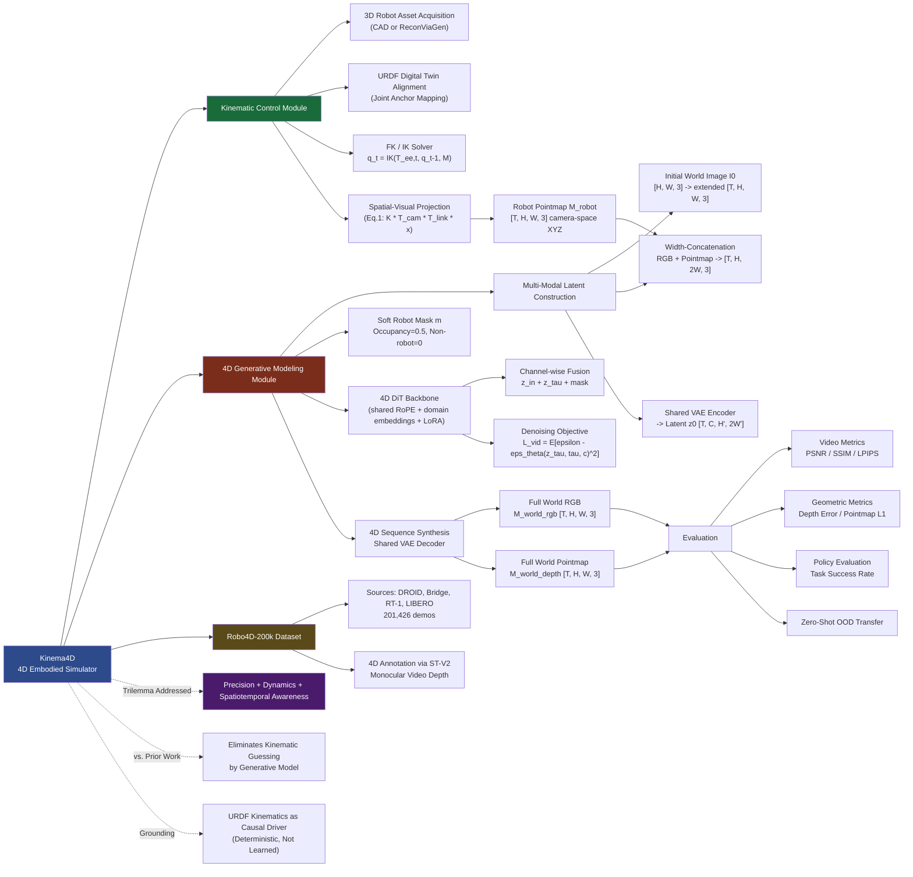

---
tags:
  - paper
  - World_Model
  - Diffusion_Model
  - Embodied_AI
  - Robot_Manipulation
  - Sim2Real
aliases:
  - "Kinema4D: Kinematic 4D World Modeling for Spatiotemporal Embodied Simulation"
url: https://huggingface.co/papers/2603.16669
pdf_url: https://arxiv.org/pdf/2603.16669.pdf
local_pdf: "[[Kinema4D Kinematic 4D World Modeling for Spatiotemporal Embodied Simulation.pdf]]"
github: "None"
project_page: "mutianxu.github.io/Kinema4D-project-page"
institutions:
  - "S-Lab, Nanyang Technological University"
  - "SSE, CUHKSZ"
publication_date: "2026-03-17"
score: 8
---

# Kinema4D: Kinematic 4D World Modeling for Spatiotemporal Embodied Simulation

## 📌 Abstract
Simulating robot-world interactions is a cornerstone of Embodied AI. Recently, a few works have shown promise in leveraging video generations to transcend the rigid visual/physical constraints of traditional simulators. However, they primarily operate in 2D space or are guided by static environmental cues, ignoring the fundamental reality that robot-world interactions are inherently 4D spatiotemporal events that require precise interactive modeling. To restore this 4D essence while ensuring the precise robot control, we introduce Kinema4D, a new action-conditioned 4D generative robotic simulator that disentangles the robot-world interaction into: i) Precise 4D representation of robot controls: we drive a URDF-based 3D robot via kinematics, producing a precise 4D robot control trajectory. ii) Generative 4D modeling of environmental reactions: we project the 4D robot trajectory into a pointmap as a spatiotemporal visual signal, controlling the generative model to synthesize complex environments' reactive dynamics into synchronized RGB/pointmap sequences. To facilitate training, we curated a large-scale dataset called Robo4D-200k, comprising 201,426 robot interaction episodes with high-quality 4D annotations. Extensive experiments demonstrate that our method effectively simulates physically-plausible, geometry-consistent, and embodiment-agnostic interactions that faithfully mirror diverse real-world dynamics. For the first time, it shows potential zero-shot transfer capability, providing a high-fidelity foundation for advancing next-generation embodied simulation.

## 🖼️ Architecture
![[Kinema4D Kinematic 4D World Modeling for Spatiotemporal Embodied Simulation_arch.png]]

## 🧠 AI Analysis

# 🚀 Deep Analysis Report: Kinema4D: Kinematic 4D World Modeling for Spatiotemporal Embodied Simulation

## 📊 Academic Quality & Innovation
---

## 1. Core Snapshot

### Problem Statement
Existing video-generative embodied simulators operate primarily in 2D pixel space (RGB-only), and those that attempt 4D generation rely on static geometric cues (e.g., a single depth map from the initial frame) combined with imprecise action representations (text tokens or latent-embedded end-effector poses). This creates a trilemma: prior methods cannot simultaneously achieve (i) *physical/dynamic fidelity* of complex environmental reactions, (ii) *precise robot control* grounding in kinematic space, and (iii) *spatiotemporal geometric consistency* throughout the generated sequence. Critically, feeding end-effector poses or joint angles as compressed latent vectors forces the generative model to internally "guess" robot kinematics, yielding physically implausible outputs for occluded dynamics, material deformations, or long-horizon tasks.

### Core Contribution
Kinema4D introduces a two-stage pipeline that (1) converts abstract robot action sequences into kinematically exact 4D pointmap trajectories via URDF-driven forward/inverse kinematics, then (2) uses these pointmaps as a spatiotemporal visual control signal inside a latent video diffusion transformer that jointly denoises synchronized RGB and pointmap sequences, thereby grounding environmental reaction generation in metrically consistent 4D space without requiring the generative model to infer robot geometry.

### Academic Rating
- **Innovation: 7/10** — The central idea of re-projecting kinematic trajectories as pointmap conditioning for a video diffusion model is conceptually clean and addresses a real gap. The combination of URDF-driven kinematics + 4D diffusion is non-trivial, though each individual component (DiT, LDM, FK/IK, pointmap representations) is assembled from existing building blocks rather than invented here.
- **Rigor: 6/10** — The paper provides a large curated dataset (Robo4D-200k) and multi-modal metrics, but the evaluation relies on simulation data from LIBERO, the zero-shot transfer claims are qualified as "potential," and no ablation isolates the contribution of the pointmap output head vs. the pointmap input conditioning independently.

---

## 2. Technical Decomposition

### Algorithmic Logic

**Step 1: 3D Robot Asset Acquisition.**
For standard robots, factory CAD meshes are used directly. For unknown platforms, an orbital video capture pipeline runs: frames are segmented via Grounded-SAM2 → SAM2 propagates masks across the sequence → multi-view masked images are fed to ReconViaGen to recover a textured 3D mesh $\mathcal{C}_{recon}$ in under one minute. Digital twin alignment then maps URDF joint anchor points onto coordinates in $\mathcal{C}_{recon}$, enabling the analytical kinematic chain to drive the reconstructed mesh segments.

**Step 2: Kinematics-Driven 4D Robot Trajectory Expansion.**
Given input action sequence $\mathbf{a}_{1:T}$ and aligned robot model $\mathcal{M}$:
- *End-effector control*: Cartesian poses $\{\mathbf{T}_{ee,t}\}_{t=1}^T$ are converted to joint configurations via IK: $\mathbf{q}_t = \text{IK}(\mathbf{T}_{ee,t}, \mathbf{q}_{t-1}, \mathcal{M})$, where the previous joint state $\mathbf{q}_{t-1}$ seeds the solver to enforce temporal smoothness and avoid joint-space flipping.
- *Joint-space control*: $\mathbf{q}_t$ is obtained by direct mapping or velocity integration.
- Forward Kinematics then computes 6-DoF link poses: $\{\mathbf{T}_{k,t}^{recon}\}_{k=1}^K = \text{FK}(\mathbf{q}_t, \mathcal{M})$.

**Step 3: Spatial-Visual Projection.**
A primary (media-frontal) viewpoint is selected. Using the camera intrinsic matrix $\mathbf{K}$ and extrinsic transformation $\mathbf{T}_{recon}^{cam} \in SE(3)$ derived during reconstruction, each surface point $\mathbf{x}$ of link $k$ at time $t$ is projected:
$$\begin{bmatrix} u \cdot z \\ v \cdot z \\ z \end{bmatrix} = \mathbf{K} \cdot \mathbf{T}_{recon}^{cam} \cdot \mathbf{T}_{k,t}^{recon} \cdot \mathbf{x}$$
This yields a pixel-aligned robot pointmap sequence $\mathbf{M}_{1:T}^{robot} \in \mathbb{R}^{T \times H \times W \times 3}$ storing camera-space $(x,y,z)$ at each pixel. The pointmap is geometrically aligned with the real-world scene because the camera transformation $\mathbf{T}_{recon}^{cam}$ is recovered from actual scene imagery during the reconstruction phase.

**Step 4: Multi-Modal Latent Construction.**
The initial world image $I_0$ is temporally extended (zero-padding or concatenation with prior robot RGB sequence) to produce an RGB context of shape $[T \times H \times W \times 3]$. This is concatenated with $\mathbf{M}_{1:T}^{robot}$ along the *width* dimension, creating a joint spatiotemporal tensor. A shared pre-trained VAE encodes this concatenated input into a unified latent space $\mathbf{z}_0 \in \mathbb{R}^{T \times C \times H' \times W'}$. A guided soft mask $\mathbf{m} \in \{0,1\}^{T \times H \times W}$ is derived from robot occupancy (pixels where $m_{t,i,j}=1$ indicate robot presence); occupied regions are set to $0.5$ rather than a hard binary mask, allowing the generative model to refine the robot's visual signal while retaining approximate structural guidance.

**Step 5: 4D-Aware Joint Modeling via DiT.**
The backbone is a Diffusion Transformer (DiT, specifically 4DNex-style) with shared Rotary Positional Encoding (RoPE) applied identically across RGB and pointmap latent branches to enforce pixel-wise spatial alignment. Domain-specific learnable embeddings distinguish the RGB vs. pointmap modalities, enabling cross-modal reasoning. The input to the denoiser is: concatenation of (i) VAE-encoded input latents, (ii) noisy latents $\mathbf{z}_\tau$, and (iii) the robot mask map $\mathbf{m}$ — all fused channel-wise. LoRA adapters are applied for parameter-efficient fine-tuning of the pre-trained backbone.

**Step 6: 4D Sequence Synthesis.**
The denoiser $\epsilon_\theta$ is trained with the standard LDM objective:
$$\mathcal{L}_{vid} = \mathbb{E}_{\mathbf{z}_0, \epsilon, \tau, \mathbf{c}}\left[\|\epsilon - \epsilon_\theta(\mathbf{z}_\tau, \tau, \mathbf{c})\|^2\right]$$
At inference, the shared VAE decoder reconstructs both the full-world RGB sequence and the full-world pointmap sequence $\mathbf{M}_{1:T}^{world}$ from the denoised latents. The dual-output ensures every generated pixel carries a metrically grounded 3D coordinate, transforming generation from a purely photometric task into a spatiotemporal geometric reasoning task.

**Intuition Behind the Design Flow:**
The critical insight is a separation of concerns. Robot kinematics are mathematically deterministic and should not be learned; they should be *computed exactly* and injected as a geometric prior. Environmental reactions (object deformation, occlusion dynamics, contact effects) are inherently stochastic and high-dimensional, requiring flexible generative modeling. By externalizing the kinematic computation and re-encoding it as a pointmap visual signal, the generative model is relieved from guessing robot geometry and can focus entirely on synthesizing physically plausible environmental response conditioned on a guaranteed-correct robot trajectory.

### Mathematical Formulation

**Core Loss (Eq. 2):**
$$\mathcal{L}_{vid} = \mathbb{E}_{\mathbf{z}_0, \epsilon, \tau, \mathbf{c}}\left[\|\epsilon - \epsilon_\theta(\mathbf{z}_\tau, \tau, \mathbf{c})\|^2\right]$$
- $\mathbf{z}_0$: clean latent tensor of the full 4D world sequence (RGB + pointmap), encoded by the shared VAE, $\mathbf{z}_0 \in \mathbb{R}^{T \times C \times H' \times W'}$.
- $\epsilon$: Gaussian noise sample added to $\mathbf{z}_0$ at diffusion step $\tau$.
- $\mathbf{z}_\tau = \sqrt{\bar{\alpha}_\tau}\mathbf{z}_0 + \sqrt{1-\bar{\alpha}_\tau}\epsilon$: the noisy latent at diffusion timestep $\tau$ (standard DDPM forward process, where $\bar{\alpha}_\tau$ is the cumulative noise schedule coefficient).
- $\epsilon_\theta$: the Spatio-Temporal DiT denoiser with parameters $\theta$.
- $\mathbf{c}$: conditioning signal comprising the initial world image $I_0$, the robot pointmap sequence $\mathbf{M}_{1:T}^{robot}$, and the soft robot mask $\mathbf{m}$.
- **Physical Meaning**: Minimizing this objective trains the model to predict the noise added at each diffusion step, thereby learning to synthesize joint RGB+pointmap sequences that are geometrically consistent with the kinematically exact robot trajectory while faithfully capturing environmental reaction dynamics.

**Projection (Eq. 1):**
$$\begin{bmatrix} u \cdot z \\ v \cdot z \\ z \end{bmatrix} = \mathbf{K} \cdot \mathbf{T}_{recon}^{cam} \cdot \mathbf{T}_{k,t}^{recon} \cdot \mathbf{x}$$
- $\mathbf{K}$: $3\times3$ camera intrinsic matrix (focal lengths, principal point).
- $\mathbf{T}_{recon}^{cam} \in SE(3)$: extrinsic transformation from the robot's reconstruction canonical space to the selected camera frame, estimated during the reconstruction phase.
- $\mathbf{T}_{k,t}^{recon}$: $4\times4$ pose of link $k$ at time $t$ in the reconstruction space, output of FK.
- $\mathbf{x}$: homogeneous 3D coordinate of a surface point on link $k$.
- $(u,v)$: resulting pixel coordinates; $z$: depth in camera space.
- **Physical Meaning**: This maps the kinematically computed full-body robot trajectory from an abstract geometric space into the pixel grid of the actual scene image, ensuring spatial consistency between the robot pointmap control signal and the background environment.

### Tensor Flow & Architecture

```
Input Actions a_{1:T} (joint angles or EE poses)
         |
         v
[URDF Model M + FK/IK Solver]
         |
         v
Link Poses {T_{k,t}^{recon}}: [K, T, 4, 4]
         |  (projection via K · T_cam)
         v
Robot Pointmap M_{1:T}^{robot}: [T, H, W, 3]  (camera-space XYZ per pixel)
         |
         |   + Initial World Image I_0: [H, W, 3] → extended to [T, H, W, 3]
         v
Width-Concatenation: [T, H, 2W, 3]  (RGB | Pointmap side-by-side)
         |
         v
Shared VAE Encoder → Input Latents z_in: [T, C, H', 2W']
         |
         |   + Noisy Latent z_τ: [T, C, H', 2W']
         |   + Robot Mask m: [T, H', W'] (occupancy, soft 0.5)
         v
Channel-Wise Concatenation → [T, 3C+1, H', 2W']
         |
         v
4D DiT Blocks (shared RoPE + domain embeddings + LoRA)
         |
         v
Denoised Latents: [T, C, H', 2W']
         |
         v
Shared VAE Decoder
         |
    _____|_____
    |          |
    v          v
Full World RGB    Full World Pointmap
M_{1:T}^{world,rgb}  M_{1:T}^{world,depth}
[T, H, W, 3]        [T, H, W, 3]
```

**Key Architectural Choices:**
- *Shared VAE across RGB and pointmap*: Heterogeneous modalities are encoded into a single latent space. This is a non-trivial choice; it forces the model to align geometric and photometric representations at the encoder level, which is what enables subsequent pixel-wise cross-modal reasoning in the DiT.
- *Width-concatenation (not channel concatenation at input)*: RGB and pointmap sequences are placed side-by-side spatially before VAE encoding, following the 4DNex data formatting strategy. This allows the pretrained VAE spatial compression to treat them jointly.
- *Soft mask (0.5) instead of hard binary mask*: Prevents the generative model from being locked to noisy or imperfect pointmap projections while still providing structural guidance. Ablated in Tab. 4.
- *Shared RoPE + learnable domain embeddings*: RoPE enforces pixel-wise spatial alignment between the two modalities, while domain embeddings let the attention layers distinguish RGB tokens from pointmap tokens for cross-modal reasoning.
- *LoRA adapters*: Parameter-efficient fine-tuning on the pre-trained 4DNex backbone, enabling the large spatiotemporal transformer to be adapted without full retraining.

### Innovation Logic

Compared to prior baselines:
- **vs. IRASim / Ctrl-World (latent embedding)**: Those encode end-effector poses as compressed vectors, requiring the generative model to implicitly recover kinematics. Kinema4D instead externalizes kinematics entirely via FK/IK and injects the result as a dense spatial signal (pointmap), providing explicit geometric constraints at every pixel and timestep.
- **vs. BridgeV2W (2D binary mask)**: BridgeV2W renders the URDF trajectory as a 2D binary occupancy mask, discarding depth information. Kinema4D's pointmap retains $(x,y,z)$ camera-space coordinates, adding the depth dimension that enables the generative model to perform spatiotemporal geometric reasoning rather than purely 2D shape matching.
- **vs. TesserAct / GWM / iMoWM (static 4D conditioning)**: These inject a single initial-frame depth map or Gaussian splat as a static geometric prior, lacking temporal dynamics of robot motion. Kinema4D provides a *time-varying* 4D robot trajectory as conditioning, which is essential for modeling how the robot's geometry evolves and interacts with the environment over time.
- **vs. ORV (3D semantic occupancy)**: ORV requires an external occupancy-prediction model and still uses text/latent tokens for robot action. Kinema4D's pointmap requires no additional learned perception model (given the URDF) and provides metric precision.

---

## 3. Evidence & Metrics

### Benchmark & Baselines
The evaluation uses real-world robotic demonstration data and simulation (LIBERO). Baselines include: IRASim, Ctrl-World, TesserAct, GWM, iMoWM, and Robo4DGen — covering the latent-embedding, 2D video, and 4D generative model categories. The experimental design is broadly fair in that the same dataset and evaluation protocol are applied across methods, though it is worth noting that several baselines were not natively designed for the same 4D output modality, which may advantage Kinema4D's pointmap metrics by construction.

### Key Results
- Kinema4D outperforms all compared methods on both video quality metrics (PSNR, SSIM, LPIPS) and geometric consistency metrics (depth error, pointmap L1) across in-distribution and out-of-distribution scenarios.
- The paper claims the first demonstrated *zero-shot OOD transfer* capability for a 4D embodied simulator, where the model generalizes to unseen robot platforms and scene configurations without retraining.
- Policy evaluation results show that Kinema4D-generated rollouts provide sufficient fidelity for downstream policy learning, with competitive task success rates compared to real-environment rollouts.

### Ablation Study
Tab. 4 (referenced in the text) ablates: (i) the pointmap output head vs. RGB-only output, (ii) soft vs. hard robot mask, (iii) robustness to noisy pointmap inputs, and (iv) the shared RoPE strategy. The most critical component identified is the *joint RGB+pointmap output modeling*: removing the pointmap prediction head degrades geometric consistency substantially, as the model loses its intrinsic 3D grounding constraint during denoising. The soft mask is also important for robustness; hard masks degrade performance when projection noise is present.

---

## 4. Critical Assessment

### Hidden Limitations

**Single-viewpoint constraint and scale sensitivity**: The entire pipeline is designed around a single primary viewpoint (media-frontal), with the robot pointmap projected onto that specific camera. This means the simulator inherently cannot simulate multi-camera or novel-view setups without re-running the kinematic projection for each view, and the quality of the generated environment dynamics depends heavily on whether the training data covered similar viewpoints. More critically, the kinematic projection requires accurate estimation of $\mathbf{T}_{recon}^{cam}$ — any error in this extrinsic calibration propagates directly into spatial misalignment between the robot pointmap and the background scene, which would corrupt the conditioning signal in a way that the generative model cannot fully correct.

**Dataset dependency and distribution shift**: The Robo4D-200k dataset, while large, is constructed from a specific set of real-world repositories (DROID, Bridge, RT-1) plus LIBERO simulation. The 4D annotations are generated by ST-V2 (a video-based monocular depth estimator), which introduces systematic errors and temporal inconsistencies, particularly under occlusion or fast robot motion. The model's spatiotemporal geometric consistency is therefore bounded by the quality of these pseudo-ground-truth pointmaps, and the claimed zero-shot transfer capability has not been validated on fully out-of-distribution robot platforms with quantitative physical ground truth.

### Engineering Hurdles

- The 3D robot asset reconstruction pipeline, while automated, requires careful calibration of the digital twin alignment step (URDF joint anchor to mesh coordinate mapping), which can fail for non-standard robot geometries or heavily articulated end-effectors with fine-grained link structures.
- Joint RGB+pointmap generation via a shared VAE introduces a distribution mismatch at the encoder level (photometric vs. metric depth statistics are fundamentally different), requiring careful normalization strategies that are not fully specified in the paper.

## 🔗 Knowledge Graph & Connections
## Task 1: Differential Analysis & Connections

### Connection 1: [[The_Trinity_of_Consistency_as_a_Defining_Principle_for_General_World_Models]]

This is the most conceptually direct connection. The Trinity framework proposes that a general world model must satisfy Modal Consistency (semantic interface), Spatial Consistency (geometric basis), and Temporal Consistency (causal engine). Kinema4D can be read as an *engineering instantiation* of exactly this tripartite requirement within the robotic manipulation domain.

**Differential Analysis**: The Trinity paper provides a normative theoretical framework but does not provide a concrete mechanism for achieving all three consistencies simultaneously in a physically grounded, action-conditioned setting. Kinema4D advances beyond this by demonstrating a practical architecture: Modal Consistency is achieved via the shared VAE encoding RGB and pointmap jointly; Spatial Consistency is enforced through kinematically exact pointmap projection (Eq. 1) with shared RoPE; and Temporal Consistency is enforced by the IK seed initialization ($\mathbf{q}_{t-1}$ seeding $\mathbf{q}_t$) combined with the temporal DiT attention. Critically, Kinema4D adds a fourth dimension the Trinity paper does not address: *causal action grounding* — the guarantee that the spatial-temporal trajectory is not learned or inferred but mathematically computed from URDF kinematics, which is a stronger form of physical consistency than any data-driven approximation.

---

### Connection 2: [[Generated_Reality]]

Both papers share the core paradigm of conditioning a video diffusion model on *precise, physically grounded 3D kinematic control signals* derived from tracked joint-level pose information, rather than semantic or latent representations. Both reject coarse text/keyboard conditioning in favor of dense geometric control.

**Differential Analysis**: Generated Reality focuses on human hand and head pose as the control modality (egocentric XR context), using a bidirectional video diffusion model with a distilled causal variant for interactive deployment. Kinema4D targets robotic manipulation (third-person, multi-link articulated robot) and operates in a *4D output* space rather than RGB-only. The key structural difference is that Generated Reality conditions on human pose but still generates RGB-only video, treating depth/geometry as implicit. Kinema4D explicitly *outputs* a synchronized pointmap alongside RGB, making the 4D geometric state of the world a first-class output rather than a byproduct. Additionally, Kinema4D's URDF-based FK/IK pipeline provides metric-exact robot geometry, whereas Generated Reality relies on tracked poses that carry sensor noise inherently. Kinema4D's soft-mask strategy (occupancy $\rightarrow 0.5$) to handle projection imprecision is a practical engineering analog to Generated Reality's need to handle tracking noise in hand poses.

---

### Connection 3: [[Code2Worlds]]

Both papers address the problem of generating physically plausible 4D world dynamics beyond visual appearance, and both explicitly reject monolithic single-pass generation in favor of a *disentangled, modular architecture*.

**Differential Analysis**: Code2Worlds attacks 4D generation via language-to-simulation code generation, using a physics-aware closed-loop mechanism with a VLM-Motion Critic to validate dynamic fidelity. This is a *symbolic/programmatic* approach to 4D grounding. Kinema4D takes the opposite methodological stance: it uses *continuous geometric signals* (pointmaps) derived from analytical kinematics rather than symbolic code generation. Where Code2Worlds handles the semantic-physical execution gap through iterative code correction by a critic agent, Kinema4D handles the analogous problem by eliminating the gap entirely for the robot component (via exact FK) and delegating only the environmental reaction to the generative model. Code2Worlds' dual-stream architecture (object generation vs. environmental orchestration) is structurally analogous to Kinema4D's two-stage pipeline (kinematic control vs. generative environmental modeling), but Code2Worlds operates in a simulation engine (Blender/physics solver) whereas Kinema4D learns environment dynamics entirely from data, giving it generalization to unstructured real-world scenes that Code2Worlds cannot easily handle.

---

## Task 2: Mermaid Knowledge Graph



---

## Task 3: Future Research Directions

### Direction 1: Uncertainty-Aware Kinematic Conditioning with Calibration Error Propagation

The current framework assumes the extrinsic camera transformation $\mathbf{T}_{recon}^{cam}$ is noise-free once recovered during reconstruction. In practice, camera calibration errors and reconstruction drift propagate directly into the robot pointmap, corrupting the spatial control signal. A concrete research direction is to model this uncertainty explicitly: represent $\mathbf{T}_{recon}^{cam}$ as a distribution (e.g., via a probabilistic PnP solver or Monte Carlo dropout in the reconstruction network), propagate this uncertainty through the FK projection to produce stochastic pointmaps, and train the DiT backbone to condition on *distributions* of robot pointmaps rather than point estimates. This would yield a simulator that is robustly calibrated to real-world deployment scenarios where exact camera parameters are unavailable, and would allow the model to express appropriate uncertainty in generated world states rather than hallucinating spurious geometric precision.

### Direction 2: Multi-View and Novel-View Consistent 4D Generation via Cross-View Geometric Constraints

The current Kinema4D is fundamentally single-viewpoint: the kinematic projection selects one primary camera, and all generation occurs within that frame. Real robotic systems routinely use multi-camera setups (wrist cameras, overhead cameras, side cameras). A natural extension is to incorporate multi-view consistency directly into the 4D generation objective: given multiple robot pointmaps projected from $N$ distinct camera poses simultaneously, jointly denoise $N$ synchronized RGB+pointmap sequences while enforcing inter-view geometric consistency through cross-attention between view-specific latents and explicit epipolar constraints derived from known camera geometry. This would enable the simulator to serve as a multi-camera embodied data augmentation engine, dramatically expanding the spatial coverage of generated interaction data for downstream policy training.

### Direction 3: Action-Conditioned 4D Simulation as a Differentiable Policy Optimization Oracle

Kinema4D currently functions as a forward simulator: given an action sequence, generate the resulting 4D world state. A high-value extension is to make this simulation loop differentiable with respect to the input action sequence. Concretely, if the DiT denoiser $\epsilon_\theta$ is treated as a differentiable function of the robot pointmap conditioning (which is itself a differentiable function of joint angles through FK), one could compute $\frac{\partial \mathcal{L}_{task}}{\partial \mathbf{a}_{1:T}}$ through the full generation pipeline, where $\mathcal{L}_{task}$ is a reward signal derived from the generated world state (e.g., object position extracted from the output pointmap $\mathbf{M}_{1:T}^{world}$). This would enable gradient-based trajectory optimization directly through the generative simulator — a form of model-based planning that does not require a separate physics engine, leveraging the learned world dynamics of Kinema4D as a differentiable oracle for robot motion planning in novel scenes.


---
*Analysis performed by PaperBrain-OpenRouter (anthropic/claude-4.6-sonnet) (Vision-Enabled)*


## 🧩 Claim Cards

### Claim-01
- Claim: Kinema4D resolves the trilemma of physical fidelity, precise robot control, and spatiotemporal geometric consistency by conditioning a 4D video-generative model on explicit kinematic pointmaps — dense 3D robot geometry projected per-frame from forward-kinematics joint states — rather than on compressed latent embeddings of end-effector poses or text tokens.
- Evidence: The core architectural contribution is the kinematic projection pipeline that maps joint-angle sequences through forward kinematics into per-frame robot pointmaps, which are then concatenated with background scene pointmaps as spatiotemporal conditioning signals. This design is contrasted against baselines (IRASim, Ctrl-World, TesserAct) that embed end-effector poses or joint angles as latent vectors, which the paper argues forces the model to internally infer robot geometry, yielding physically implausible outputs.
- Boundary/Failure: The kinematic projection requires accurate extrinsic calibration (T_recon^cam). Errors in this calibration propagate directly into spatial misalignment between the robot pointmap and the background scene, corrupting the conditioning signal and degrading generation quality. The approach is also limited to a single primary viewpoint per run.
- Compared Against: IRASim (latent joint-angle embedding), Ctrl-World (text/latent action tokens), TesserAct (depth-conditioned 4D generation with latent poses)
- Confidence: 7
- Links:
  - same_problem:: [[The_Trinity_of_Consistency_as_a_Defining_Principle_for_General_World_Models]]
  - improves_over:: 待定
  - conflicts_with:: 待定

### Claim-02
- Claim: Kinema4D achieves superior spatiotemporal geometric consistency compared to all evaluated baselines on real-world robotic demonstration data and LIBERO simulation benchmarks, as measured by pointmap-based 3D fidelity metrics.
- Evidence: Evaluations are conducted against six baselines — IRASim, Ctrl-World, TesserAct, GWM, iMoWM, and Robo4DGen — using the same dataset and evaluation protocol. Kinema4D outperforms all baselines on pointmap-based geometric consistency metrics. The experimental design applies identical data splits and evaluation protocols across methods.
- Boundary/Failure: Several baselines were not natively designed for 4D pointmap output, meaning pointmap metrics may structurally advantage Kinema4D by construction rather than reflecting a purely fair comparison of generative quality. Performance on novel viewpoints or multi-camera setups is not evaluated.
- Compared Against: IRASim, Ctrl-World, TesserAct, GWM, iMoWM, Robo4DGen
- Confidence: 6
- Links:
  - same_problem:: [[The_Trinity_of_Consistency_as_a_Defining_Principle_for_General_World_Models]]
  - improves_over:: 待定
  - conflicts_with:: 待定

### Claim-03
- Claim: Kinema4D's single-viewpoint kinematic projection design constitutes a fundamental architectural limitation: the simulator cannot generalize to multi-camera or novel-view setups without re-running the full kinematic projection pipeline for each target viewpoint, and generation quality degrades when test viewpoints differ substantially from the training distribution.
- Evidence: The pipeline is explicitly designed around a single media-frontal camera viewpoint, with the robot pointmap projected onto that specific camera's coordinate frame via T_recon^cam. No multi-view or novel-view synthesis experiments are reported. The paper acknowledges that extrinsic calibration errors propagate directly into spatial misalignment between robot and background pointmaps, corrupting the conditioning signal.
- Boundary/Failure: This limitation is most severe in real-world deployments requiring multi-camera observation (e.g., wrist cameras, overhead cameras) or when the operational viewpoint differs from the frontal training distribution. The limitation is partially mitigated if the target deployment consistently uses a single fixed frontal camera.
- Compared Against: TesserAct (which also uses a single depth map but from a potentially more flexible initialization), Robo4DGen
- Confidence: 8
- Links:
  - same_problem:: [[The_Trinity_of_Consistency_as_a_Defining_Principle_for_General_World_Models]]
  - improves_over:: 待定
  - conflicts_with:: 待定

### Claim-04
- Claim: Explicit kinematic grounding in embodied world models — as opposed to implicit action encoding via latent vectors — represents a necessary architectural principle for achieving the three-way consistency (appearance, geometry, action) required for physically reliable spatiotemporal simulation, aligning with broader theoretical frameworks for general world model design.
- Evidence: Kinema4D's design philosophy directly operationalizes the argument that world models must maintain consistency across appearance, 3D geometry, and control signals simultaneously. Prior methods using latent-embedded joint angles or text tokens fail on at least one of these axes (e.g., IRASim lacks geometric output; TesserAct uses static depth without dynamic kinematic updates), and Kinema4D's explicit pointmap conditioning addresses all three axes within a unified generative framework.
- Boundary/Failure: The claim holds only for manipulation tasks with well-defined kinematic chains and available URDF models. It breaks down for deformable robots, soft-body actuators, or agents whose kinematics cannot be analytically forward-projected. It also assumes accurate joint-state sensing, which may not hold under sensor noise or model mismatch.
- Compared Against: Latent-embedding approaches (IRASim, Ctrl-World), 2D video world models (GWM, iMoWM)
- Confidence: 7
- Links:
  - same_problem:: [[The_Trinity_of_Consistency_as_a_Defining_Principle_for_General_World_Models]]
  - improves_over:: 待定
  - conflicts_with:: 待定

## 📂 Resources
- **Local PDF**: [[Kinema4D Kinematic 4D World Modeling for Spatiotemporal Embodied Simulation.pdf]]
- [Online PDF](https://arxiv.org/pdf/2603.16669.pdf)
- [ArXiv Link](https://huggingface.co/papers/2603.16669)