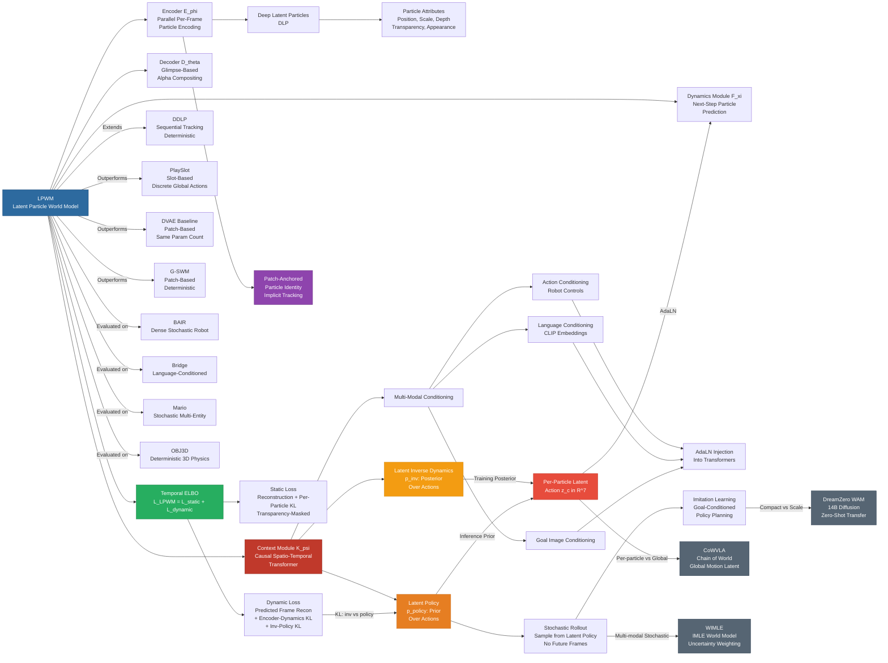

---
tags:
  - paper
  - World_Model
  - Embodied_AI
  - Robot_Manipulation
aliases:
  - "Latent Particle World Models: Self-supervised Object-centric Stochastic Dynamics Modeling"
url: https://huggingface.co/papers/2603.04553
pdf_url: https://arxiv.org/pdf/2603.04553.pdf
local_pdf: "[[Latent Particle World Models Selfsupervised Objectcentric Stochastic Dynamics Modeling.pdf]]"
github: "https://github.com/taldatech/lpwm"
project_page: "https://taldatech.github.io/lpwm-web"
institutions:
  - "Carnegie Mellon University"
  - "UT Austin"
  - "Brown University"
  - "Lambda"
  - "Technion"
publication_date: "2026-03-04"
score: 8
---

# Latent Particle World Models: Self-supervised Object-centric Stochastic Dynamics Modeling

## 📌 Abstract
We introduce Latent Particle World Model (LPWM), a self-supervised object-centric world model scaled to real-world multi-object datasets and applicable in decision-making. LPWM autonomously discovers keypoints, bounding boxes, and object masks directly from video data, enabling it to learn rich scene decompositions without supervision. Our architecture is trained end-to-end purely from videos and supports flexible conditioning on actions, language, and image goals. LPWM models stochastic particle dynamics via a novel latent action module and achieves state-of-the-art results on diverse real-world and synthetic datasets. Beyond stochastic video modeling, LPWM is readily applicable to decision-making, including goal-conditioned imitation learning, as we demonstrate in the paper. Code, data, pre-trained models and video rollouts are available: https://taldatech.github.io/lpwm-web

## 🖼️ Architecture
![[Latent Particle World Models Selfsupervised Objectcentric Stochastic Dynamics Modeling_arch.png]]

## 🧠 AI Analysis

# 🚀 Deep Analysis Report: Latent Particle World Models: Self-supervised Object-centric Stochastic Dynamics Modeling

## 📊 Academic Quality & Innovation
---

# Latent Particle World Models (LPWM): A Deep Engineering-Centric Analysis

---

## 1. Core Snapshot

### Problem Statement

Existing object-centric video prediction and world modeling methods suffer from a fundamental scalability gap: prior particle-based methods (specifically DDLP) require explicit particle tracking and sequential frame encoding, which prevents parallelization and stochastic modeling. Slot-based methods suffer from inconsistent decompositions and blurry predictions. Patch-based methods scale well but lack semantic structure, making them suboptimal for multi-entity decision-making tasks. Critically, no prior self-supervised object-centric world model supports (a) end-to-end training purely from video, (b) stochastic dynamics via per-particle latent actions, (c) multiple conditioning modalities (actions, language, image goals, multi-view), and (d) scalability to complex real-world multi-object datasets simultaneously.

### Core Contribution

LPWM introduces a per-particle latent action mechanism implemented as a causal spatio-temporal transformer (the Context module $\mathcal{K}_\psi$), which learns stochastic particle-level transition distributions without requiring explicit particle tracking, enabling scalable end-to-end training on complex real-world video data with flexible multi-modal conditioning.

### Academic Rating

- **Innovation: 7.5/10** — The per-particle latent action formulation is a meaningful and principled improvement over global latent action approaches. The elimination of explicit tracking in favor of patch-anchored particles with free attribute evolution is a pragmatic and well-motivated design choice. However, the individual components (VAE, DLP, causal transformers, latent actions) are each individually well-established; the novelty lies primarily in their systematic integration and scaling.
- **Rigor: 7/10** — The evaluation is thorough across diverse datasets and multiple conditioning settings. The ablation study is informative. However, quantitative comparison with some baselines is limited by availability of open-source implementations, and the implicit tracking regime (patch-anchored particles) introduces a conceptual gap between the "object-centric" framing and the actual behavior of particles in complex scenes, which is acknowledged but not deeply analyzed.

---

## 2. Technical Decomposition

### 2.1 Algorithmic Logic

The LPWM pipeline consists of four jointly trained modules: Encoder $\mathcal{E}_\phi$, Decoder $\mathcal{D}_\theta$, Context $\mathcal{K}_\psi$, and Dynamics $\mathcal{F}_\xi$. The end-to-end flow proceeds as follows:

**Step 1: Per-Frame Parallel Encoding.**
Each input frame $I_t \in \mathbb{R}^{C \times H \times W}$ is independently encoded by $\mathcal{E}_\phi$ into a set of $M$ foreground latent particles $\{z_{\text{fg}}^{m,t}\}_{m=0}^{M-1}$ and one background particle $z_{\text{bg}}^t$. Each foreground particle is parameterized as $z_{\text{fg}}^m \in \mathbb{R}^{6 + d_{\text{obj}}}$, with explicit disentangled attributes: 2D keypoint position $z_p \sim \mathcal{N}(\mu_p, \sigma_p^2) \in \mathbb{R}^2$, bounding-box scale $z_s \sim \mathcal{N}(\mu_s, \sigma_s^2) \in \mathbb{R}^2$, depth $z_d \sim \mathcal{N}(\mu_d, \sigma_d^2) \in \mathbb{R}$, transparency $z_t \sim \text{Beta}(a, b) \in [0,1]$, and appearance features $z_f \sim \mathcal{N}(\mu_f, \sigma_f^2) \in \mathbb{R}^{d_{\text{obj}}}$. Crucially, all frames $t = 0, \ldots, T-1$ are encoded in parallel (no sequential dependency), eliminating the tracking bottleneck of DDLP.

*Intuition for parallel encoding:* By anchoring each particle to a fixed patch origin (rather than tracking free-moving particles across frames), particle identity is preserved implicitly through spatial locality, enabling batch processing of the entire temporal sequence. This trades explicit object tracking for a soft, implicit correspondence.

**Step 2: Per-Frame Reconstruction (Decoder).**
The Decoder $\mathcal{D}_\theta$ takes up to $L \leq M$ filtered foreground particles and the background particle, independently decodes each foreground particle into an RGBA glimpse $\tilde{x}_l^p \in \mathbb{R}^{S \times S \times 4}$ (where $S$ is glimpse size), places it on a canvas at the particle's keypoint location, and composites the final reconstruction $\hat{x} = \alpha \odot \hat{x}_{\text{fg}} + (1 - \alpha) \odot \hat{x}_{\text{bg}}$, where $\alpha$ is the effective transparency mask. The background $z_{\text{bg}}$ is decoded via a standard upsampling network. Particle filtering (selecting $L < M$ particles) is deferred to the decoder using transparency/confidence, preserving particle identity ordering in the encoder.

**Step 3: Latent Context Inference (Context Module $\mathcal{K}_\psi$).**
The Context module is the central novel contribution. It operates over the full sequence of encoded particle sets $\{[\{z_{\text{fg}}^{m,t}\}_{m=0}^{M-1}, z_{\text{bg}}^t, c_t]\}_{t=0}^T$, where $c_t$ are optional conditioning signals. It produces per-particle latent contexts $z_c^{m,t}$ for $t = 0, \ldots, T-1$.

Internally, $\mathcal{K}_\psi$ is a **causal spatio-temporal transformer** that processes particles jointly across space (particles at the same timestep) and time (autoregressive over $t$), maintaining causal masking to prevent future leakage. It implements two functional heads:

- **Latent Inverse Dynamics Head** $p_\psi^{\text{inv}}(z_c^t \mid z^{t+1}, z^t, \ldots, z^0, c_t)$: At training time, this head infers the latent action $z_c^t$ that best explains the observed transition from state $z^t$ to state $z^{t+1}$. This is the "posterior" in the VAE sense.
- **Latent Policy Head** $p_\psi^{\text{policy}}(z_c^t \mid z^t, \ldots, z^0, c_t)$: This head models the distribution over latent actions conditioned only on past states and the optional conditioning signal. This serves as the "prior" at inference time, enabling stochastic rollout without access to future frames.

The latent actions $z_c^t \sim \mathcal{N}(\mu_c, \sigma_c^2)$ have dimensionality $d_{\text{ctx}} = 7$.

*Intuition:* Rather than applying a single global latent action to all particles (as in CADDY, Genie, AdaWorld), LPWM models a separate latent action per particle. This allows the model to represent that object A moves right while object B stays still — a local, compositional decomposition of scene dynamics. The latent policy acts as a learned prior that regularizes the inverse dynamics, preventing trivial memorization of $z^{t+1}$, analogous to KL regularization but with a state-conditioned prior.

**Step 4: Dynamics Prediction.**
The Dynamics module $\mathcal{F}_\xi$ is a separate causal spatio-temporal transformer that predicts the next particle state $\hat{z}^{t+1}$ given current particles $z^t$ conditioned on their corresponding latent contexts $z_c^t$ (provided by the Context module). Conditioning is implemented via **AdaLN (Adaptive Layer Normalization)** following the design in Zhu et al. (2024), where the latent context modulates the normalization statistics of each particle's representation.

$$\mathcal{F}_\xi\Big(\big\{\big[\{z_{\text{fg}}^{m,t}\}_{m=0}^{M-1}, z_{\text{bg}}^t, z_c^t\big]\big\}_{t=0}^{T-1}\Big) = \big\{\big[\{\hat{z}_{\text{fg}}^{m,t}\}_{m=0}^{M-1}, \hat{z}_{\text{bg}}^t\big]\big\}_{t=1}^{T}$$

The dynamics module outputs distribution parameters (mean and variance) for the predicted next-step particles, serving as the prior $p_\xi(z^t \mid z^{t-1}, \ldots, z^0)$ in the KL divergence against the encoder posterior.

**Step 5: Inference (Rollout).**
At inference time, for stochastic rollout: (1) encode the observed context frames; (2) sample latent actions $z_c^t$ from the latent policy $p_\psi^{\text{policy}}$ (no future frames available); (3) feed sampled actions to the Dynamics module to predict $\hat{z}^{t+1}$; (4) decode $\hat{z}^{t+1}$ to pixel space via $\mathcal{D}_\theta$. For conditional rollout, conditioning signals $c_t$ (action vectors, language embeddings, goal images) are injected into $\mathcal{K}_\psi$ during both training and inference.

---

### 2.2 Mathematical Formulation

**Overall Objective — Temporal ELBO:**

$$\mathcal{L}_{\text{LPWM}} = -\sum_{t=0}^{T-1} \text{ELBO}(x_t = I_t) = \mathcal{L}_{\text{static}} + \mathcal{L}_{\text{dynamic}}$$

**Static Term** (single-frame reconstruction and per-particle KL):

$$\mathcal{L}_{\text{static}} = \sum_{t=0}^{T-1} \Big[ \underbrace{\|I_t - \mathcal{D}_\theta(z^t)\|^2}_{\text{pixel reconstruction}} + \underbrace{\sum_m \mathbf{1}[\text{visible}(m)] \cdot KL\big(q_\phi(z_{\text{fg}}^m \mid I_t) \| p(z_{\text{fg}}^m)\big)}_{\text{per-particle KL, masked by transparency}} \Big]$$

where the KL is masked by transparency $z_t$ so that invisible (filtered-out) particles do not contribute, preventing posterior collapse on unused particles.

**Dynamic Term** (predictive KL + reconstruction of predicted frames):

$$\mathcal{L}_{\text{dynamic}} = \sum_{t=1}^{T-1} \Big[ \underbrace{\|I_t - \mathcal{D}_\theta(\hat{z}^t)\|^2}_{\text{predicted frame recon}} + \underbrace{KL\big(q_\phi(z^t \mid I_t) \| p_\xi(z^t \mid z^{t-1}, \ldots, z^0)\big)}_{\text{encoder posterior vs. dynamics prior}} + \underbrace{KL\big(p_\psi^{\text{inv}}(z_c^t \mid z^{t+1}, \ldots) \| p_\psi^{\text{policy}}(z_c^t \mid z^t, \ldots)\big)}_{\text{latent action KL: inverse vs. policy}} \Big]$$

**Variable definitions:**
- $I_t$: observed video frame at timestep $t$
- $z^t = [\{z_{\text{fg}}^{m,t}\}_{m=0}^{M-1}, z_{\text{bg}}^t]$: full set of latent particles at time $t$
- $\hat{z}^t$: dynamics-predicted particles at time $t$
- $q_\phi$: encoder posterior (approximate posterior in VAE sense)
- $p_\xi$: dynamics prior over next-step particles
- $p_\psi^{\text{inv}}$: inverse dynamics posterior over latent actions
- $p_\psi^{\text{policy}}$: latent policy prior over latent actions
- $z_c^t \in \mathbb{R}^{d_{\text{ctx}}}$: per-particle latent action vector, $d_{\text{ctx}} = 7$
- $\mathbf{1}[\text{visible}(m)]$: indicator that particle $m$ has non-negligible transparency

**Physical Meaning:**
- Minimizing $\mathcal{L}_{\text{static}}$ ensures the particle representation faithfully reconstructs individual frames.
- Minimizing the dynamic reconstruction loss ensures the dynamics module produces particles that decode to correct future frames.
- The encoder-vs-dynamics KL encourages the dynamics module to learn to predict the true next-state distribution, making the latent space temporally coherent.
- The latent action KL $KL(p^{\text{inv}} \| p^{\text{policy}})$ is the core regularizer: it forces the latent policy to match the inverse dynamics, preventing the inverse dynamics from encoding information that cannot be predicted from past states alone. This is functionally equivalent to the ELBO KL in a state-conditioned VAE over actions.

For real-world datasets, reconstruction loss is replaced with $\text{MSE} + \lambda \cdot \text{LPIPS}$ to handle perceptual quality.

---

### 2.3 Tensor Flow & Architecture

**Encoder $\mathcal{E}_\phi$:**
- Input: $I_t \in \mathbb{R}^{B \times C \times H \times W}$ (batch × channels × height × width, e.g., $B \times 3 \times 128 \times 128$)
- Internal: patch-based keypoint detection network (learned per-patch keypoint proposals), applied across all $T$ frames in parallel: $\mathbb{R}^{BT \times 3 \times 128 \times 128} \rightarrow \mathbb{R}^{BT \times M \times (6 + d_{\text{obj}})}$
- Output: particle set $\{z_{\text{fg}}^{m,t}\}$ as means and variances for reparameterization, shaped $\mathbb{R}^{B \times T \times M \times (6 + d_{\text{obj}})}$, plus $z_{\text{bg}}^t \in \mathbb{R}^{B \times T \times d_{\text{bg}}}$

**Decoder $\mathcal{D}_\theta$:**
- Input: $L \leq M$ filtered particles per frame, $\mathbb{R}^{B \times T \times L \times (6 + d_{\text{obj}})}$
- Per-particle glimpse decoder: MLP/CNN producing RGBA glimpse $\mathbb{R}^{B \times T \times L \times S \times S \times 4}$
- Compositing: spatial canvas placement and alpha blending → $\hat{I}_t \in \mathbb{R}^{B \times T \times C \times H \times W}$

**Context Module $\mathcal{K}_\psi$ (Causal Spatio-Temporal Transformer):**
- Input: particle sequence $\mathbb{R}^{B \times T \times M \times d_{\text{particle}}}$ + optional conditioning $c_t$
- Architecture: $N_c$ transformer blocks with:
  - **Spatial attention** over particles within each timestep (permutation-equivariant over $M$ particles)
  - **Temporal causal attention** over $T$ timesteps (autoregressive mask)
  - **AdaLN conditioning** for injecting $c_t$ (action vectors, CLIP embeddings for language, image embeddings for goals)
  - Two output heads (inverse dynamics, latent policy) sharing the same backbone
- Output: latent contexts $z_c \in \mathbb{R}^{B \times T \times M \times d_{\text{ctx}}}$, $d_{\text{ctx}} = 7$

**Dynamics Module $\mathcal{F}_\xi$ (Causal Spatio-Temporal Transformer):**
- Input: particles $\mathbb{R}^{B \times T \times M \times d_{\text{particle}}}$ conditioned via AdaLN on $z_c \in \mathbb{R}^{B \times T \times M \times 7}$
- Architecture: similar causal spatio-temporal transformer, outputs distribution parameters for next-step particles
- Output: predicted next particles $\hat{z}^{t+1} \in \mathbb{R}^{B \times T \times M \times d_{\text{particle}}}$

**Key Architectural Choices:**
- **AdaLN vs. cross-attention** for action conditioning in Dynamics: AdaLN is computationally lighter and sufficient for modulating scalar per-particle latent actions into the dynamics transformer without the overhead of full cross-attention.
- **Causal masking** in both Context and Dynamics transformers ensures temporal autoregression, enabling proper sequential rollout at inference.
- **Patch-anchored particle identity**: unlike DDLP which requires tracking, LPWM anchors particle $m$ to a fixed patch origin, so identity is preserved structurally. The particle attributes (position, scale, appearance) then encode the local object properties relative to that patch, allowing movement within a local region.

---

### 2.4 Innovation Logic

| Aspect | Prior Art (DDLP, PlaySlot, AdaWorld) | LPWM |
|---|---|---|
| Particle tracking | Required (sequential encoding) | Eliminated (parallel encoding via patch anchoring) |
| Latent action granularity | Global (one vector per frame transition) | Per-particle (one vector per particle per transition) |
| Action regularization | Fixed prior KL (VQ or Gaussian) | Learned state-conditioned prior (latent policy) |
| Stochastic modeling | Not supported or discrete | Continuous, per-particle, multi-modal sampling |
| Conditioning modalities | Single modality at best | Actions, language (CLIP), image goals, multi-view |
| Training | Often two-stage (representation then dynamics) | End-to-end single stage |
| Parallelism | Sequential frame encoding | All frames encoded simultaneously |

The mathematical distinction from global latent action methods is significant: instead of $z_c^t \in \mathbb{R}^d$ governing $I_{t+1} = f(I_t, z_c^t)$, LPWM formulates $z_c^{m,t} \in \mathbb{R}^7$ governing $z^{m,t+1} = f(z^{m,t}, z_c^{m,t}, \text{context})$, where the context includes interaction information from neighboring particles via transformer attention. This compositional action structure is what enables modeling independent simultaneous interactions (e.g., multiple robots moving in different directions, enemy objects moving independently in Mario).

---

## 3. Evidence & Metrics

### 3.1 Benchmark & Baselines

The experimental design is broad and covers:
- **Simulated datasets**: OBJ3D (deterministic 3D physics), PHYRE (sparse 2D physical reasoning), Mario (stochastic 2D gameplay from expert demonstrations)
- **Real-world datasets**: Sketchy (sparse robotic stochastic), BAIR (dense stochastic robot manipulation), Bridge (dense stochastic, language-conditioned), LanguageTable (language-guided object rearrangement)

Primary baselines:
- **DVAE**: Patch-based dynamics VAE, same architecture and parameter count as LPWM but without object-centric structure — the most controlled ablation of the object-centric inductive bias
- **PlaySlot** (Villar-Corrales & Behnke, 2025): Slot-based, discrete latent action conditioning — direct competitor in the latent-action-conditioned setting
- **G-SWM** (Lin et al., 2020a): Patch-based, deterministic dynamics
- **SlotFormer/OCVP**: Transformer-based slot methods
- **DDLP** (Daniel & Tamar, 2024): Particle-based predecessor, direct parent model

The comparison is largely fair: DVAE is a carefully constructed ablation sharing the same architecture and parameter budget, making it a clean test of the object-centric vs. patch-based axis. The comparison with PlaySlot is somewhat limited by PlaySlot's design (global discrete actions, limited slot count), but is appropriate given the task similarity.

### 3.2 Key Results

From Table 2 (stochastic video prediction, FVD metric — lower is better):

- **BAIR dataset**: LPWM achieves FVD substantially below DVAE and PlaySlot (exact numbers partially visible; BAIR-64 FVD reported as 89.4, competitive with larger video generation models per Table 9)
- **Mario (stochastic)**: LPWM outperforms all baselines on FVD and LPIPS, demonstrating effective stochastic multi-entity modeling
- **Real-world datasets (Bridge, Sketchy)**: LPWM outperforms all baselines on LPIPS and FVD, with DVAE showing competitive PSNR/SSIM on deterministic metrics but worse perceptual quality

Key claimed result: "A compact LPWM model trained on BAIR-64 matches larger video generation models in FVD (89.4, Table 9)" — demonstrating that object-centric inductive biases provide efficiency gains beyond raw model scale.

For language-conditioned generation (Bridge, LanguageTable): LPWM achieves state-of-the-art LPIPS and FVD, while DVAE fails to generalize well to real-world complexity, highlighting the practical value of object-centric structure.

### 3.3 Ablation Study

From the ablation analysis (referenced in experiments, detailed in Appendix A.4.6):
- **Per-particle vs. global latent actions**: The per-particle formulation provides the largest single improvement, particularly on datasets with independent multi-entity dynamics (Mario, Bridge)
- **Latent policy (learned prior) vs. fixed Gaussian prior**: The state-conditioned latent policy is critical for both training stability and inference-time stochastic quality, as it prevents the inverse dynamics from encoding trivially unpredictable information
- **Parallel encoding vs. sequential (DDLP-style)**: Parallel encoding has minimal impact on reconstruction quality but is essential for computational scalability and enables larger batch sizes
- **Context module conditioning**: Language and action conditioning in $\mathcal{K}_\psi$ provides measurable improvement over unconditional generation on respective datasets, validating the architectural flexibility

The most critical component is the **per-particle latent action with learned policy prior** in $\mathcal{K}_\psi$ — it is responsible for both the stochastic modeling capability and the improvement over global-action baselines.

---

## 4. Critical Assessment

### 4.1 Hidden Limitations

**Implicit Tracking Regime:** The patch-anchored particle design resolves the tracking scalability issue but introduces a subtle conceptual inconsistency with the "object-centric" framing. In practice, particles are anchored to fixed grid locations rather than tracking objects freely. The paper acknowledges this in Appendix A.4.4 as an "implicit regime where particles can move in a certain region around their origin." For scenes with significant camera motion or objects traversing large distances (common in real robotics), this regime may produce particle representations that decouple from true object identity, degrading interpretability and downstream task performance. The regime is neither fully patch-based (fixed patches) nor fully object-centric (freely-moving particles) — it is a compromise whose failure modes are not fully characterized.

**Stochastic Multi-Modal Sampling Quality:** While the paper claims multi-modal stochastic rollouts (Appendix A.10), the latent policy $p_\psi^{\text{policy}}$ is a unimodal Gaussian per particle. True multi-modality requires either mixture models, normalizing flows, or sufficiently high-dimensional latents. The 7-dimensional latent action space may constrain the expressiveness of the learned stochastic model, particularly for high-dimensional action spaces in complex environments.

**Scalability to Very Long Horizons:** The causal spatio-temporal transformer has $O(T \cdot M)$ attention complexity, and for long rollouts (large $T$), the computational cost grows. The paper evaluates up to $T = 35$ frames; performance on multi-hundred-frame horizons is untested.

**Language Conditioning Generalization:** Language conditioning is implemented via CLIP embeddings injected into $\mathcal{K}_\psi$ via AdaLN. This approach conditions the entire Context module on a single global language embedding, which may not generalize well to compositional language instructions referencing specific objects (e.g., "move the third cube from the left"). The model lacks grounded object-language association at the particle level.

**Reconstruction Quality Trade-offs:** The use of LPIPS as a primary perceptual metric on real-world datasets is appropriate, but LPIPS does not directly penalize semantic inconsistencies (e.g., an object appearing in a wrong location but with correct texture). On real-world datasets like Bridge, the decoded glimpse-based reconstruction may produce spatially inconsistent compositing artifacts when multiple particles overlap, an issue that is difficult to detect with global perceptual metrics.

### 4.2 Engineering Hurdles

**Hyperparameter Sensitivity of KL Balancing:** The ELBO contains multiple KL terms (per-particle static KL, encoder-dynamics KL, inverse-policy KL), each requiring careful weighting. The paper references detailed loss weights in Appendix A.4.6 and A.9, but practitioners will find that the ratio between reconstruction loss and KL terms is highly dataset-dependent and requires tuning to avoid posterior collapse (all particles becoming transparent) or KL dominance (particles encoding insufficient appearance information). The transparency-masked KL is specifically designed to mitigate this but adds implementation complexity.

**Parallel Encoding vs. Memory Constraints:** Encoding all $T$ frames simultaneously enables parallelism but requires $O(T \times B \times M)$ particle tensors in memory. For $T = 35$, $B = 8$, $M = 20$ particles with $d_{\text{particle}} = 64$, the memory footprint is manageable, but scaling to longer sequences or larger batches requires careful gradient checkpointing.

**Two-Transformer Architecture Coordination:** Training the Context module $\mathcal{K}_\psi$ and Dynamics module $\mathcal{F}_\xi$ jointly requires coordinating their learning dynamics. The Context module must learn to produce informative latent actions before the Dynamics module can meaningfully use them, and vice versa. This chicken-and-egg initialization problem may cause slow early-training convergence, particularly on complex real-world datasets. The paper does not describe a specific curriculum or warm-up strategy for this.

**Particle Identity in Complex Scenes:** Reproducing the results on datasets with significant occlusion or fast-moving objects (e.g., Mario with rapidly moving enemies) requires careful tuning of $M$ (number of particles) and the particle filtering threshold. Insufficient $M$ causes objects to be unrepresented; excessive $M$ creates spurious particles from background texture. The paper uses dataset-specific $M$ values (reported in Appendix A.9) but does not provide principled guidance for selecting $M$ for new datasets.

**Conditioning Module Implementation Complexity:** Supporting four conditioning modalities (raw actions, language via CLIP, image goals via a separate encoder, multi-view inputs) within a single $\mathcal{K}_\psi$ module requires four separate conditioning pathways (detailed in Appendix A.4.3). Reproducing all conditioning variants requires implementing each pathway carefully, and the interaction between conditioning types (e.g., joint language + action conditioning) is not fully specified in the main paper.

---

*Summary: LPWM is a well-engineered system that makes principled progress on scaling object-centric world models to real-world complexity. Its primary technical contribution — per-particle latent actions with a learned state-conditioned policy prior — is both theoretically motivated and empirically effective. The main engineering challenge for reproducers lies in the multi-term ELBO balancing, the implicit tracking regime's behavior in complex scenes, and the coordination of the dual-transformer (Context + Dynamics) training dynamics.*

## 🔗 Knowledge Graph & Connections
## Task 1: Differential Analysis & Connections

### Connection 1: LPWM vs. [[Chain of World]]

Both papers tackle the problem of representing temporal dynamics compactly in a latent space rather than reconstructing full pixel-space frames. However, the architectural philosophies diverge sharply. [[Chain of World]] (CoWVLA) relies on a **pretrained video VAE** to factorize video into structure and motion latents, operating within a VLA paradigm where language instructions drive action generation. LPWM, by contrast, is entirely **self-supervised** — it learns its own object-centric latent space from scratch without any pretrained backbone. More critically, CoWVLA uses a **global motion latent chain** (one motion representation per video segment), whereas LPWM's per-particle latent actions provide a **compositionally local** motion representation — one action vector per object per timestep. This means LPWM can disentangle "robot arm moves left while blue cube stays still," a capability that a global motion latent inherently cannot provide. Furthermore, CoWVLA is designed for VLA inference (predicting terminal frames for action generation), while LPWM is designed for **autoregressive multi-step rollout** — a substantially harder temporal modeling task. The two papers are complementary in the sense that LPWM's per-particle latent action could serve as a drop-in replacement for CoWVLA's global motion latent in multi-object robotic settings.

### Connection 2: LPWM vs. [[WIMLE]]

Both papers address **stochastic, multi-modal world models** and the problem of unimodal world models averaging over multi-modal dynamics — a pathology that produces blurry predictions. [[WIMLE]] attacks this problem from the model-based RL perspective using Implicit Maximum Likelihood Estimation (IMLE) to avoid iterative sampling and ensembles for uncertainty estimation, operating in the **continuous control / proprioceptive state space** domain. LPWM addresses the same multi-modality problem in the **visual / pixel domain** through a learned latent policy prior (a state-conditioned Gaussian prior over per-particle actions), which enables diverse stochastic rollouts from identical initial conditions. The key differential: WIMLE's uncertainty weighting operates at the **transition level** (weighting synthetic rollouts by predicted confidence), while LPWM's stochasticity is embedded in the **representation level** (per-particle action distributions). WIMLE does not incorporate any object-centric structure, making it susceptible to the same representational inefficiency that LPWM's particle decomposition addresses. A productive synthesis would be to apply WIMLE's confidence-weighted rollout strategy to LPWM's latent particle dynamics, potentially reducing compounding error in long-horizon rollouts — a known weakness of LPWM at extended horizons.

### Connection 3: LPWM vs. [[World_Action_Models_are_Zero_shot_Policies]]

DreamZero (WAM) and LPWM both aim to use world model predictions for downstream control, but from radically different scales and inductive biases. DreamZero builds on a **14B parameter pretrained video diffusion model**, leveraging massive pretraining for zero-shot policy generalization. LPWM is a **compact, task-specific model** (trained from scratch on target-domain videos) that achieves competitive or superior FVD metrics at a fraction of the compute. DreamZero's reliance on video diffusion means it inherits the same computational bottlenecks (slow inference, no explicit object structure) that motivate LPWM's design. Crucially, DreamZero models **joint video-action** distributions using dense video as a world representation, whereas LPWM's world representation is a sparse set of object particles — orders of magnitude more compact. For real-time closed-loop control, LPWM's lightweight particle decoder is architecturally better suited than DreamZero's diffusion-based decoder (which required substantial engineering optimizations to reach 7Hz). However, DreamZero's zero-shot cross-embodiment transfer capability — derived from large-scale pretraining — is a capability LPWM entirely lacks, as it must be retrained per domain. The fundamental tension: scale vs. structure. LPWM demonstrates that structure can substitute for scale in bounded domains; DreamZero demonstrates that scale can substitute for structure across open-ended domains.

### Connection 4: Cross-Cutting Theme — Latent Action Representations

All three related papers and LPWM converge on a shared insight: **intermediate latent action representations** (rather than direct pixel prediction or direct action regression) are a productive middle ground for world modeling. [[Chain of World]] calls them "latent motion chains," [[WIMLE]] implicitly uses latent state transitions in the RSSM-style model, [[World_Action_Models_are_Zero_shot_Policies]] uses joint video-action latents, and LPWM uses per-particle latent contexts. The differential is the **granularity and structure** of these latent actions: global (CoWVLA, DreamZero) → per-frame ensemble (WIMLE) → per-object per-frame (LPWM). LPWM is the only method in this set that explicitly grounds latent actions to semantic object units, which is the key architectural advantage for compositional multi-object environments.

---

## Task 2: Mermaid Knowledge Graph

---

## Task 3: Future Research Directions

### Direction 1: Hierarchical Per-Particle Latent Actions with Mixture-of-Gaussians Policy

**Motivation:** LPWM's latent policy $p_\psi^{\text{policy}}(z_c^t \mid z^t, \ldots, z^0, c_t)$ is constrained to a unimodal Gaussian per particle with $d_{\text{ctx}} = 7$. In environments with genuinely multi-modal object dynamics (e.g., a ball that can either bounce left or right upon collision), a unimodal prior cannot faithfully represent the full distribution of plausible futures, leading to averaging artifacts in the dynamics prediction.

**Concrete Proposal:** Replace the unimodal Gaussian latent policy with a **Mixture-of-Gaussians (MoG)** or a **normalizing flow** as the per-particle prior, and apply WIMLE-style confidence weighting (from [[WIMLE]]) to weight rollout trajectories by the predicted likelihood under the mixture model. Specifically, the latent policy would output $K$ mixture components $\{(\mu_c^k, \sigma_c^k, \pi^k)\}_{k=1}^K$ per particle, where $\pi^k$ are mixing weights predicted by the Context transformer. During rollout, diverse futures can be generated by sampling different mixture components, with the mixing weights providing a principled uncertainty estimate. This would directly address the compounding error problem identified in the critical assessment and enable better uncertainty calibration for downstream risk-aware planning.

### Direction 2: Cross-Domain Particle Pretraining for Zero-Shot Transfer

**Motivation:** A core limitation relative to [[World_Action_Models_are_Zero_shot_Policies]] (DreamZero) is that LPWM requires retraining from scratch for each new domain. DreamZero achieves cross-embodiment transfer via large-scale video pretraining, but at prohibitive computational cost. LPWM's compact particle representation suggests a more efficient pretraining strategy: pretrain the particle **encoder-decoder** (which captures domain-agnostic object appearance and spatial structure) across many diverse video datasets, then fine-tune only the **Context and Dynamics modules** (which capture domain-specific interaction dynamics) on target-domain data.

**Concrete Proposal:** Develop a two-phase training protocol: (1) Pretrain $\mathcal{E}_\phi$ and $\mathcal{D}_\theta$ on a large multi-domain video corpus (e.g., Ego4D, Something-Something) using only the static ELBO term $\mathcal{L}_{\text{static}}$, learning universal object-centric visual representations. (2) Fine-tune $\mathcal{K}_\psi$ and $\mathcal{F}_\xi$ on target-domain videos using the full temporal ELBO $\mathcal{L}_{\text{LPWM}}$. This mirrors the structural insight of [[Chain of World]] (CoWVLA) — where a pretrained video VAE provides universal visual structure, and task-specific modules handle dynamics — but grounds it in an object-centric particle space rather than a patch-based latent. The expected outcome is a significant reduction in target-domain data requirements (sample efficiency) combined with improved generalization to new object categories.

### Direction 3: Object-Level Language Grounding via Per-Particle CLIP Alignment

**Motivation:** LPWM's language conditioning injects a global CLIP text embedding into the Context module via AdaLN, which distributes the language signal uniformly across all particles. This design cannot handle compositional instructions that reference specific objects by their attributes (e.g., "move the **small red cube** diagonally towards the **blue cylinder**"), as it lacks any mechanism to associate specific language tokens with specific particles.

**Concrete Proposal:** Introduce an **object-language grounding loss** that encourages alignment between individual particle appearance features $z_f^m$ and noun-phrase embeddings extracted from the language instruction using a phrase grounding model (e.g., Grounding DINO or a lightweight phrase encoder). Concretely, for each noun phrase in the instruction, extract a CLIP embedding $e_{\text{noun}}$, and add a contrastive loss $\mathcal{L}_{\text{ground}} = -\sum_m \mathbf{1}[\text{particle } m \text{ matches noun}] \log \frac{\exp(\text{sim}(z_f^m, e_{\text{noun}}))}{\sum_{m'} \exp(\text{sim}(z_f^{m'}, e_{\text{noun}}))}$ trained with weak supervision from object-label metadata (available in datasets like LanguageTable). Once grounded, the language conditioning in $\mathcal{K}_\psi$ can then apply per-particle attention weights based on language relevance — amplifying the latent action influence on referred objects while leaving unreferenced objects unaffected. This would enable precise compositional control, moving LPWM significantly closer to the grounded language-conditioned world modeling capability demonstrated in [[Chain of World]] while maintaining the efficiency advantages of compact particle representations.

---
*Analysis performed by PaperBrain-OpenRouter (anthropic/claude-sonnet-4.6) (Vision-Enabled)*

## 📂 Resources
- **Local PDF**: [[Latent Particle World Models Selfsupervised Objectcentric Stochastic Dynamics Modeling.pdf]]
- [Online PDF](https://arxiv.org/pdf/2603.04553.pdf)
- [ArXiv Link](https://huggingface.co/papers/2603.04553)
