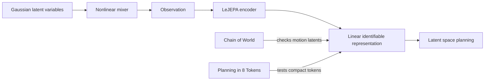

---
tags:
- paper
- domain/3d_perception
- domain/multimodal_perception
- domain/reinforcement_learning
- domain/robot_manipulation
- domain/world_model
- impact/high_value
- method/planning
- method/reinforcement_learning
- method/world_model
- review/auto_tagged
- status/unread
- task/manipulation
- task/planning_reasoning
- task/scene_understanding
- type/analysis
aliases:
- When Does LeJEPA Learn a World Model?
- LeJEPA
- LeJEPA World Model
- Linear Identifiability
- Gaussian Latent Identifiability
- JEPA Identifiability Guarantee
- Alignment Gaussian Regularization
- Latent Variable Recovery
- World Model Identifiability
paper_id: arxiv:2605.26379
arxiv_id: '2605.26379'
url: http://arxiv.org/abs/2605.26379v1
pdf_url: https://arxiv.org/pdf/2605.26379v1
local_pdf: '[[When Does LeJEPA Learn a World Model.pdf]]'
github: https://github.com/klindtlab/lejepa-identifiability
project_page: None
institutions:
- Cold Spring Harbor Laboratory
- New York University
- Brown University
publication_date: '2026-05-25'
metadata_publication_date: '2026-05-25'
score: '8.2'
domains:
- 3d_perception
- multimodal_perception
- reinforcement_learning
- robot_manipulation
- world_model
methods:
- planning
- reinforcement_learning
tasks:
- manipulation
- planning_reasoning
- scene_understanding
paper_type: analysis
impact_band: high_value
reading_status: unread
priority_score: 105
review_status: auto_tagged
next_action: skim_then_decide
year: 2026
---

# When Does LeJEPA Learn a World Model?

## 📌 Abstract
A representation that scrambles the true degrees of freedom of the world cannot support reliable planning or compositional generalization. We prove that LeJEPA (alignment plus Gaussian regularization) linearly recovers the world's latent variables from nonlinear observations, a property known as linear identifiability, in a broad class of worlds where latents evolve under stationary, additive-noise transitions. Our main result is that among all such worlds, the Gaussian is the unique latent distribution for which this guarantee holds. The forward direction rests on a spectral decomposition in which each degree of nonlinearity is strictly penalized by alignment, making the linear map the optimum; the converse rules out every non-Gaussian alternative. We further prove an approximate identifiability result where the guarantee degrades gracefully, and show that linear, orthogonal identifiability enables optimal latent-space planning. We validate the theory with experiments ranging from 2D examples to 1024-dimensional latents, including distributional ablations and pixel-based robotic control. Our theory turns an empirically successful recipe into a mathematical guarantee, providing the foundation for building World Models that provably recover the structure of the world.

## 🖼️ Architecture
![[When Does LeJEPA Learn a World Model_arch.png]]

## 🧠 AI Analysis
## Abstract
A representation that scrambles the true degrees of freedom of the world cannot support reliable planning or compositional generalization. We prove that LeJEPA (alignment plus Gaussian regularization) linearly recovers the world’s latent variables from nonlinear observations, a property known as linear identifiability, in a broad class of worlds where latents evolve under stationary, additive-noise transitions. Our main result is that among all such worlds, the Gaussian is the unique latent distribution for which this guarantee holds. The forward direction rests on a spectral decomposition in which each degree of nonlinearity is strictly penalized by alignment, making the linear map the optimum; the converse rules out every non-Gaussian alternative. We further prove an approximate identifiability result where the guarantee degrades gracefully, and show that linear, orthogonal identifiability enables optimal latent-space planning. We validate the theory with experiments ranging from 2D examples to 1024-dimensional latents, including distributional ablations and pixel-based robotic control. Our theory turns an empirically successful recipe into a mathematical guarantee, providing the foundation for building World Models that provably recover the structure of the world.

In simpler terms, the paper proves that the LeJEPA training method recovers hidden world variables exactly (up to rotation) when those variables are Gaussian, and shows this is the only distribution that works under the paper’s assumptions about how the world generates observations.

> [!INFO] Code, formal proofs, and an interactive demo are available at the [official repository](https://github.com/klindtlab/lejepa-identifiability).

## 1. Core Snapshot

### Problem Statement
The core challenge is to determine when a self‑supervised representation actually becomes a *World Model* – that is, when it recovers the independent latent variables $z$ of the environment instead of entangling them into an opaque, mixed code.  
**Motivation.** A representation that scrambles position with colour or velocity with texture may perform well on a narrow benchmark, yet fail catastrophically when the world changes (e.g., under new lighting or actuator limits). Reliable planning, compositional generalisation and linear probing all require a representation that is a linear (up to rotation) copy of the true latents.  
**Setup.** We observe nonlinear mixtures $x = g(z)$ produced by an unknown *mixing function* $g$. The *encoder* $f$ maps observations to a representation $y = f(x)$. The composition $h = f \circ g$ should ideally invert the mixing: $h(z) \approx Q z$ for some orthogonal matrix $Q$.  
**Bottleneck.** Without an explicit mathematical guarantee, even state‑of‑the‑art self‑supervised losses can converge to representations that entangle the true degrees of freedom – they look linear under probing but fail under out‑of‑distribution shifts.  
**This paper’s answer.** It asks: under a fixed, natural class of generative processes, what distribution of $z$ forces $h$ to be linear? The paper answers with a precise *if‑and‑only‑if* condition: the latent variables must be Gaussian.

### Core Contribution
==The central contribution is a pair of theorems showing that LeJEPA achieves linear identifiability **if and only if** the latent variables are Gaussian==, within the broad class of worlds that satisfy independence, stationarity and additive‑noise transitions.  

- **Forward theorem.** When the latents are Gaussian, *any* measurable encoder that simultaneously minimises the alignment loss and satisfies the Gaussian regulariser must learn the true latents up to an orthogonal rotation. The proof rests on a spectral decomposition in Hermite polynomials: every degree of nonlinearity in the encoder reduces the cross‑view correlation, making the linear map the unique optimum.  
- **Converse theorem.** For *every* non‑Gaussian latent distribution in the same broad class, the alignment objective can be minimised by a nonlinear encoder that does not recover the true latents linearly. In other words, Gaussianity is both sufficient and necessary.  
- **Degradation and planning.** The paper further provides a quantitative approximate‑identifiability bound that shows how recovery error increases gracefully with small deviations from perfect alignment or Gaussianity. It also proves that an orthogonally identifiable representation is optimal for latent‑space planning under quadratic costs.  
- **Empirical validation.** Experiments span 2D synthetic mixings, scaling from 2 to 1024 latent dimensions, a sweep over the shape parameter of a generalised normal distribution (peaking sharply at the Gaussian), and pixel‑based control on the DMC Reacher.  

**Limitation.** The results assume the encoder output dimension matches the true latent dimension; mismatched output dimensions are discussed but not quantitatively analysed. The additive‑noise and stationarity assumptions, while broad, do not cover all realistic worlds.

### Innovation Origin & Rationale
Previous JEPA‑style methods prevented representation collapse through implicit mechanisms (e.g., stop‑gradient or clustering), whose resulting embedding distributions were poorly characterised. This opacity blocked identifiability analysis because the distribution of the learned representation could not be pinned down.  

LeJEPA replaces the implicit regulariser with an explicit **Sketched Isotropic Gaussian Regularization (SIGReg)** that forces the representation distribution toward an isotropic Gaussian. This simple fix supplies a concrete, analysable target. Once the representation’s marginal is constrained to be exactly Gaussian, the *alignment* loss becomes an inner product under the transition operator, whose eigenfunctions (Hermite polynomials for Gaussians) reveal that nonlinearities only reduce the correlation between positive pairs. Thus, the explicit Gaussian anchor turns an untractable optimisation into a spectral optimisation problem with a unique linear solution.  

> [!IMPORTANT] The key insight: an **explicit** Gaussian target makes it possible to prove that the global optimum of the LeJEPA objectives must undo the nonlinear mixing, whereas earlier implicit regularisers left too many degrees of freedom open.

## 2. Reading Map
The paper is written for researchers interested in theoretical guarantees for self‑supervised representation learning, causal representation learning, or latent‑space planning.  

- **Theorists and proof‑focused readers** should read Section 3 (World and Learner assumptions) carefully, then follow the main theorem statements and proof sketches in Section 5. The spectral arguments using Hermite polynomials (for the Gaussian case) and Sturm–Liouville theory (for the converse) are the core.  
- **Practitioners** can focus on the problem setup (Section 3), the final guarantees (Theorem 1–4 statements), and the experimental evidence (Section 6). The approximate bound gives a practical diagnostic for when identifiability will degrade.  
- **Skippable on a first pass:** the deep comparison with slow feature analysis in Appendix F and the extended distributional ablations in Appendix H can be deferred until after the main claims are understood.  

> [!TIP] If your primary interest is whether LeJEPA will work on a new domain, start by checking whether the latent distribution is approximately Gaussian and whether positive pairs can be generated by a stationary additive‑noise process; Section 6 shows that the sharpness of the Gaussian optimum is the crucial empirical factor.

## 3. Method Walkthrough

### Inputs, Outputs, And Assumptions
**Inputs.** The method receives *positive pairs* of observations $(x, x')$, where $x = g(z)$ and $x' = g(z')$, generated from latent pairs $(z, z')$ that evolve according to the world model.  
**Outputs.** A representation $h = f \circ g$ such that $h(z)$ is an orthogonal copy of the true latents $z$ (i.e., $h(z) = Qz$ with $Q^\top Q = I$).  

**World Assumptions (Section 3.1).**  
1. **Independence.** The latent components $z_i$ are mutually independent, and the transition $p(z'_i \mid z_i)$ factorises across coordinates: $z'_i = m_i(z_i) + \eta_i$ with independent noises $\eta_i$.  
2. **Stationarity.** Both views share the same marginal distribution: $p(z) = p(z')$. This means the generating process does not change between the two views.  
3. **Additive noise.** The transition is additive, i.e., $z'_i = m_i(z_i) + \eta_i$ with $\eta_i$ independent of $z_i$.  

*Why these matter.* Independence allows the analysis to treat each latent dimension separately; without it, the spectral decomposition would couple dimensions. Stationarity guarantees that the marginal distribution is preserved across the positive pair, which is essential for the fixed‑point arguments that pick out the Gaussian. Additive noise makes the transition operator a convolution, simplifying the eigenfunction analysis.  

> [!WARNING] While these assumptions are standard in identifiability and disentanglement literature, they exclude, for example, worlds where a common cause affects multiple latents, or where the marginal changes drastically between views (e.g., video with strong motion blur that alters the distribution of object speeds). The approximate bound partly addresses small violations, but large deviations remain outside the theory.

### Pipeline From Data To Prediction
1. **Positive‑pair generation.** Sample a latent $z$ from the chosen distribution (in the forward theory, $z \sim \mathcal{N}(0, I_n)$). Apply the stationary additive‑noise transition to get $z'$. Under Gaussianity, the only transition that preserves the marginal is the Ornstein–Uhlenbeck process: $z' = \rho z + \sqrt{1-\rho^2}\,\eta$, with $\eta \sim \mathcal{N}(0, I_n)$ independent of $z$.  
2. **Nonlinear mixing.** The raw observations are $x = g(z)$ and $x' = g(z')$ where $g$ is an unknown, potentially highly nonlinear function.  
3. **Encoder training.** The encoder $f$ is trained end‑to‑end so that $h = f \circ g$ simultaneously:  
   - **maximises** the cross‑view correlation (alignment loss), and  
   - **satisfies** the Gaussian regulariser, i.e., the empirical batch distribution of $h(z)$ is driven towards $\mathcal{N}(0, I_n)$.  
4. **Convergence guarantee.** Under the conditions of Theorem 1, the global minimum of this combined objective is achieved only by encoders for which $h(z)$ is an orthogonal transformation of $z$.  

### Key Design Choices
**Why an explicit Gaussian regulariser (SIGReg)?**  
The central difficulty in earlier JEPA methods was that the representation distribution was only implicitly prevented from collapsing, making it impossible to characterise the set of optimal encoders. By imposing a concrete, isotropic Gaussian target, the regulariser pins down the marginal and turns the alignment objective into a simple optimisation over functions with a fixed distribution.  

**Alternative regularisers.** The paper empirically compares SIGReg (full Gaussianity), VICReg (covariance only) and InfoNCE (implicit Gaussianity). While VICReg and InfoNCE can also recover linear representations when the latents are exactly Gaussian, the converse experiment shows that only SIGReg keeps the global optimum tightly focused on the Gaussian – second‑moment constraints alone leave degenerate non‑linear solutions when the latent distribution deviates slightly.  

**Orthogonal symmetry.** The learned representation is determined only up to an orthogonal rotation $Q$. This symmetry is inherent to the isotropic Gaussian regulariser and is harmless: any rotation of a Gaussian remains Gaussian, and downstream planning with rotation‑invariant costs (e.g., quadratic cost $\|Qz\|^2 = \|z\|^2$) is unaffected.

## 4. Core Theory And Formulas

### The World’s Transition Operator and the The OU Process
Under the Gaussian‑world assumptions, stationarity forces the transition to be the Ornstein–Uhlenbeck process:

$$
z' = \rho\, z + \sqrt{1 - \rho^2}\, \eta, \qquad \eta \sim \mathcal{N}(0, I_n), \; \eta \perp z.
$$

- $\rho \in (0,1)$ is the correlation coefficient between corresponding coordinates of $z$ and $z'$.  
- The noise vector $\eta$ is independent of $z$ and has unit variance.  

*Practical meaning.* This equation defines the “natural” positive pairs in a Gaussian world: the next state is a weighted sum of the current state and fresh Gaussian noise, scaled so that the marginal variance stays exactly 1. Because the Gaussian is the only distribution invariant under such an additive‑noise channel, this is a crucial fixed‑point property that forces all latent distributions that enjoy linear identifiability to be Gaussian.

### Alignment Loss and Its Spectral Form
After the Gaussian regulariser has whitened the representation to $\mathcal{N}(0,I)$, the alignment loss simplifies to:

$$
\mathcal{L}(h) = 2n - 2 \sum_{i=1}^n \mathbb{E}\bigl[ h_i(z')\, h_i(z) \bigr].
$$

- $n$ is the latent dimension (and also the encoder output dimension).  
- $h_i$ is the $i$‑th coordinate of the representation $h$.  
- $\mathbb{E}[h_i(z')\,h_i(z)]$ measures the correlation between the two views for that component.  

Thus, *maximising* the sum of cross‑view correlations is equivalent to *minimising* $\mathcal{L}$. The regulariser fixes the scale and covariance, so only the directional alignment matters.

### Spectral Penalisation of Nonlinearity
Because the marginal of $z$ is isotropic Gaussian, each component $h_i$ can be expanded in the orthogonal **Hermite polynomials** $\{He_d\}_{d=0}^\infty$ that are eigenfunctions of the Gaussian transition operator. The expansion yields

$$
\mathbb{E}\bigl[ h_i(z')\, h_i(z) \bigr] = \sum_{d=1}^\infty w_d \,\rho^d,
$$

- $w_d = \sum_{\text{degree } d} c_{i,d}^2$ is the total squared coefficient of degree‑$d$ Hermite terms in the expansion of $h_i$.  
- Since $\sum_d w_d = 1$ (variance constraint from regulariser), we have the *inequality*  

$$
\sum_{d=1}^\infty w_d \rho^d \;\le\; \rho,
$$

and equality holds **if and only if** $w_1 = 1$ and all higher $w_d = 0$.  

*Interpretation.* Each “unit” of nonlinearity (weight $w_d$ with $d>1$) reduces the cross‑view correlation by a factor $\rho^d$ instead of the maximal $\rho$. The alignment objective therefore severely punishes any degree‑2 or higher component. Under the Gaussian regulariser, the only way to saturate the bound is a purely linear representation.

> [!TIP] For a deeper understanding of the spectral decomposition, see the [Hermite polynomials entry on Wikipedia](https://en.wikipedia.org/wiki/Hermite_polynomials) and the properties of the Ornstein–Uhlenbeck operator.

### Approximate Identifiability Bound (Theorem 3)
When the alignment and Gaussianity constraints are only approximately satisfied, the recovery error can be bounded:

$$
\mathbb{E}\bigl[ \| h(z) - Q z \|^2 \bigr] \;\le\; D \;+\; (\varepsilon + D)^2,
$$

- $D$ (alignment gap) is the shortfall of the total cross‑view correlation from its theoretical maximum $\rho n$: $D = \rho n - \sum_i \mathbb{E}[h_i(z')h_i(z)]$.  
- $\varepsilon$ (covariance deviation) is the distance of the representation covariance from the identity matrix (measured by the Frobenius norm).  

Both $D$ and $\varepsilon$ vanish when the LeJEPA objectives are satisfied exactly, recovering the exact linear‑identifiability result. When they are small, the error grows quadratically in $(\varepsilon + D)$, predicting graceful degradation.

## 5. Architecture, Figures, And Implementation
**Architecture.** The theory places no architectural constraints on the encoder $f$ beyond measurability; any neural network that outputs a vector of the same dimension as the latent space can be used. In experiments, the paper uses a 4‑layer MLP for synthetic 2D and high‑dimensional scaling studies, and a convolutional network for pixel‑based Reacher trajectories.  

**Figures.** Figure 1 illustrates the end‑to‑end pipeline: clean Gaussian latents (left), spiral nonlinear mixing producing observations (centre), and the recovered isotropic Gaussian representation after LeJEPA training (right). Figure 2 abstracts the world‑learner interaction, showing how the attract term (alignment) and SIGReg term (Gaussian regulariser) act on the composed map $h$. Figure 3 displays control trajectories decoded from different encoders, and Figure 4 plots linearity of the recovered representation against the shape parameter of the latent distribution.  

**Implementation details.** The main text does not specify batch sizes, exact optimizer settings, learning‑rate schedules, or training steps. A grid search over the correlation $\rho$ and regulariser strength $\lambda$ is mentioned, but the values are listed in the appendix. The [official repository](https://github.com/klindtlab/lejepa-identifiability) contains the complete training code and hyperparameter configurations, which are essential for reproduction.

> [!NOTE] For exact reproduction, refer to the repository. The paper provides Lean‑verified proofs, ensuring the mathematical claims are machine‑checked.

## 6. Experiments And Evidence
The experimental section validates the theory on four fronts.  

1. **2D mixing inversion.** Four nonlinear mixture functions are inverted by LeJEPA up to a rotation when latents are Gaussian. $R^2$ values against ground‑truth latents exceed 0.99.  
2. **Scaling to high dimensions.** From 2 to 1024 latent dimensions with a RealNVP‑based mixer, both SIGReg and VICReg maintain $R^2 > 0.999$, while InfoNCE degrades at large $N$ because a fixed kernel width cannot adapt to the growing variance.  
3. **Distributional converse.** Sweeping the shape parameter $\alpha$ of a generalised normal distribution shows a sharp peak in linear recovery ($R^2$) at $\alpha = 2$ (the Gaussian). For SIGReg, recovery collapses quickly for both sub‑ and super‑Gaussian tails; VICReg and InfoNCE also peak at the Gaussian but show less dramatic drop‑offs, highlighting that second‑moment constraints alone leave a wider basin of nonlinear optima.  
4. **Pixel‑based Reacher control.** With Gaussian OU sampling ($\rho = 0.99$), the learned representation achieves $R^2 = 0.95$. When trajectories are collected from a trained RL policy (whose state distribution is strongly non‑Gaussian), $R^2 \le 0.5$. Control costs in the learned latent space track linear identifiability monotonically, confirming the planning theorem. Across all runs, the measured recovery error is consistent with the approximate bound of Theorem 3.  

The evidence is strengthened by the clean distributional ablation that directly tests the if‑and‑only‑if claim, but weakened by the absence of a head‑to‑head comparison against classical slow feature analysis (the discussion is relegated to Appendix F). Not clear from the provided text whether the exact strength of the regulariser was ablated separately from $\rho$.

## 7. Strengths, Limitations, And Failure Cases
**Strengths.** The paper delivers the first rigorous linear‑identifiability guarantee for any JEPA‑type method. The results are supported by both Lean‑verified proofs and a broad set of controlled experiments. The approximate bound shows that the identifiability does not vanish abruptly but degrades predictably, which is valuable for practitioners.  

**Limitations.**  
- **Dimension matching.** The theory requires the encoder output dimension to equal the true latent dimension $n$. The paper acknowledges this (see Limitations section) but does not quantify how quickly identifiability collapses when $m 
eq n$.  
- **Assumption rigidity.** The guarantees rely on exact stationarity and additive‑noise transitions; real‑world data rarely satisfy these perfectly.  
- **Gaussianity of latents.** While the converse shows Gaussianity is *necessary*, real latent variables are often heavy‑tailed or multimodal, potentially ruling out exact recovery. The approximate bound only covers small deviations.  

**Observed failure cases.**  
- **Non‑Gaussian trajectory distributions.** When positive pairs are sampled from an RL policy on the Reacher, the latent state distribution collapses to low‑entropy regions and LeJEPA fails to recover a linear world model ($R^2 \le 0.5$).  
- **Mismatched output dimension.** The paper documents that using an output dimension larger than $n$ leads to a representation that is not linear in the true latents, though the exact relationship is not fully characterised.

## 8. Reproduction Notes
- **Code and proofs.** Available at [https://github.com/klindtlab/lejepa-identifiability](https://github.com/klindtlab/lejepa-identifiability).  
- **Datasets.** Synthetic: 2D and high‑dimensional Gaussian latents mixed by explicit nonlinear functions (spiral, polynomial, RealNVP). Real: pixel observations from DeepMind Control (DMC) Reacher.  
- **Encoder architectures.** 4‑layer MLP for synthetic studies; CNN for Reacher pixels.  
- **Positive‑pair generation.** Ornstein–Uhlenbeck process for Gaussian worlds; RL policy roll‑outs for the Reacher.  
- **Metrics.** $R^2$ after optimal orthogonal alignment (linear probing) and control cost in the learned latent space.  
- **Baselines.** Three regularisation levels: SIGReg (full Gaussian), VICReg (covariance), InfoNCE (implicit Gaussian). Oracle: planning in true joint space.  
- **Hyperparameters.** Not fully specified in the main text; the repository contains the grid search over correlation $\rho$ and regulariser weight $\lambda$, as well as optimizer, batch size, and schedule.

> [!NOTE] For a complete reproduction, clone the repository and consult the training configuration files. The Lean proofs offer a machine‑checkable version of the main theorems.

## 9. What To Read Closely
- **Theorems 1–4 and their proof sketches (Section 5).** These contain the precise if‑and‑only‑if statement and the degradation bound. Understanding the spectral argument is key to seeing *why* the Gaussian is unique.  
- **Generalised‑normal sweep (Figure 4b and related discussion).** This directly tests the converse result and shows the sharp peak of identifiability at the Gaussian.  
- **Scaling experiment (Table 1) and Reacher experiment (Table 2).** These demonstrate how different regularisers behave under high‑dimensional mixing and real pixel data, respectively.  
- **Skim if short on time:** The detailed comparison with slow feature analysis (Appendix F) and the extended distributional ablations (Appendix H) can wait until after the core is digested.

## 10. Research Ideas And Open Questions
**1. Identifiability with mismatched output dimensions.**  
Train encoders whose output dimension $m$ is larger than the true latent dimension $n$ on the existing 2D mixing setups. Measure how much of the true subspace is recovered via the best possible linear probe, and examine whether extra dimensions encode redundancy or collapse toward zero activity. A risk is that optimisation dynamics simply ignore the surplus dimensions, which would say little about the theoretical identifiability gap; a careful analysis would require isolating the effect of the regulariser on the null space.

**2. Slowly varying non‑stationarity.**  
Relax the strict stationarity assumption by letting the correlation $\rho$ drift smoothly over time in a controlled synthetic world. Track the alignment gap and the measured $R^2$ as $\rho$ changes, and check whether the approximate bound of Theorem 3 still predicts recovery error. The main risk is that non‑stationarity introduces new eigenfunctions that the current Hermite‑based analysis does not cover, possibly causing the bound to become overly conservative or invalid.

**3. Action‑conditioned positive pairs and independence violations.**  
Test whether the same identifiability guarantee transfers when positive pairs are generated by applying random actions instead of the OU process, using the Reacher environment but replacing the isotropic sampling with a uniform random policy. Measure recovery $R^2$ and the straightness of decoded trajectories. The risk here is that action‑induced correlations between state dimensions may break the independence assumption and alter the spectral ordering, so even if the latents remain Gaussian the linear optimum might not be reachable with a plain JEPA objective.

## Knowledge Graph & Connections

### Related Work Connections

- **[[Chain of World]]** shares the goal of learning structured latent representations that support planning and generalisation. CoWVLA explicitly factorises video into structure and motion latents, assuming that the discovered motion chain captures the true temporal dynamics of the world. LeJEPA provides a precise theoretical lens on when such a motion representation can be expected to be a linear copy of the underlying latents: the latent process must be Gaussian and stationary with additive noise. If the true motion latents in a robotic domain deviate from those assumptions, the CoWVLA encoder may instead entangle the motion signals, yielding a representation that works on training distributions but fails under new camera angles or changed dynamics. The LeJEPA framework offers a diagnostic test—measuring how closely the empirical latent distribution matches a Gaussian—that could predict the reliability of CoWVLA’s motion prior in novel scenes.

- **[[Planning in 8 Tokens]]** demonstrates that extremely compact discrete tokenizers can drive effective latent‑space planning, at the cost of discarding much of the continuous structure of the environment. LeJEPA’s orthogonal identifiability result shows that a linear copy of the true latents is optimal for planning under quadratic costs, because any rotation of the latents preserves the cost metric. Discrete tokenizers break both linearity and rotational symmetry; planning on a small codebook of 8 tokens may still succeed, but the learned tokens are no longer guaranteed to be linear functions of the true state, and the planning cost may become arbitrarily distorted in unfamiliar regions. This opens a natural research frontier: identifying what structural properties a discrete latent space must preserve—perhaps in the form of approximate linear identifiability or isometry—so that compactness does not destroy the compositionality that world models need for robust planning.

### Concept Map

### Questions For Future Reading

1. **How can we detect and mitigate the failure of identifiability when the true latent distribution is not Gaussian?** The paper proves that exact linear recovery is lost as soon as the latent distribution deviates from Gaussianity, and the Reacher experiment shows a sharp drop when trajectories come from a policy instead of an OU process. A practical question is whether we can develop a self‑supervised diagnostic that, given only the learned representation and positive pairs, estimates the alignment gap and warns the user that the representation is not trustworthy for control in unseen regimes. Empirical studies that systematically relate the shape of the latent distribution to the downstream planning error could provide the calibration needed for such a diagnostic.

2. **Under what relaxations of the stationarity and additive‑noise assumptions can partial identifiability still be guaranteed?** Many real‑world processes, such as video with changing lighting or camera motion, violate exact stationarity. It would be valuable to see whether a notion of *stable* or *slowly varying* dynamics can be formalised, under which the latent variables remain recoverable up to a smooth time‑dependent transformation. Future papers that introduce such relaxed models and prove an approximate identifiability bound—perhaps extending Theorem 3—would directly expand the practical scope of world‑model identifiability.

3. **How does the identifiability landscape change when the encoder output dimension does not match the true latent dimension?** The paper notes that mismatched dimensions are a limitation but does not analyse the phenomenon. A consequential next step is to understand whether over‑parameterised encoders (output dimension larger than the true latent count) can still recover the true latents in a subspace while allocating the extra capacity to noise or redundancy, or whether the Gaussian regulariser forces all dimensions to carry equal variance and thereby distorts the true latent structure. Empirical investigations with controlled synthetic mixings and varying output dimensions, paired with measures of subspace recovery (such as canonical correlation analysis), would clarify how robust LeJEPA’s guarantee is to model misspecification.

---
*Analysis by PaperBrain (x-ai/grok-4.3; refinement: deepseek/deepseek-v4-pro)*

## 📂 Resources
- **Local PDF**: [[When Does LeJEPA Learn a World Model.pdf]]
- [Online PDF](https://arxiv.org/pdf/2605.26379v1)
- [ArXiv Link](http://arxiv.org/abs/2605.26379v1)
