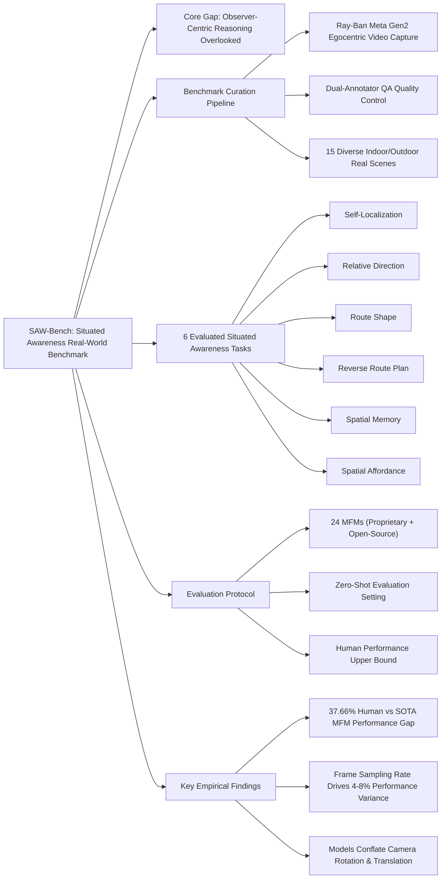

---
tags:
- paper
- Multimodal_Foundation_Models
- Embodied_AI
- Egocentric_Spatial_Reasoning
- Situated_Awareness_Benchmark
- 2026-02-28
aliases:
- Learning Situated Awareness in the Real World
url: https://huggingface.co/papers/2602.16682
pdf_url: https://arxiv.org/pdf/2602.16682.pdf
local_pdf: '[[Learning Situated Awareness in the Real World.pdf]]'
github: None
project_page: https://sawbench.github.io
institutions:
- University of California, Santa Barbara
- Yale University
- Stanford University
- University of Maryland, College Park
- Amazon
- University of California, Merced
publication_date: '2026-02-18'
score: 7
---

# Learning Situated Awareness in the Real World

## 📌 Abstract
A core aspect of human perception is situated awareness, the ability to relate ourselves to the surrounding physical environment and reason over possible actions in context. However, most existing benchmarks for multimodal foundation models (MFMs) emphasize environment-centric spatial relations (relations among objects in a scene), while largely overlooking observer-centric relationships that require reasoning relative to agent's viewpoint, pose, and motion. To bridge this gap, we introduce SAW-Bench (Situated Awareness in the Real World), a novel benchmark for evaluating egocentric situated awareness using real-world videos. SAW-Bench comprises 786 self-recorded videos captured with Ray-Ban Meta (Gen 2) smart glasses spanning diverse indoor and outdoor environments, and over 2,071 human-annotated question-answer pairs. It probes a model's observer-centric understanding with six different awareness tasks. Our comprehensive evaluation reveals a human-model performance gap of 37.66%, even with the best-performing MFM, Gemini 3 Flash. Beyond this gap, our in-depth analysis uncovers several notable findings; for example, while models can exploit partial geometric cues in egocentric videos, they often fail to infer a coherent camera geometry, leading to systematic spatial reasoning errors. We position SAW-Bench as a benchmark for situated spatial intelligence, moving beyond passive observation to understanding physically grounded, observer-centric dynamics.

## 🖼️ Architecture
![[Learning Situated Awareness in the Real World_arch.png]]
*Figure 3. Benchmark Curation Pipeline. We first pre-define 37 camera trajectories and annotate their metadata (details are provided in §D). Human video collectors then record egocentric videos by following these trajectories in selected scenes. Low-quality recordings are filtered and re-captured to ensure consistent video quality.*

## 🧠 AI Analysis (Doubao Seed 2.0 Pro)

# 🚀 Deep Analysis Report: Learning Situated Awareness in the Real World

## 📊 Academic Quality & Innovation
## 1. Core Snapshot
### Problem Statement
Existing spatial reasoning benchmarks for multimodal foundation models (MFMs) prioritize allocentric, environment-centric evaluation (object-object relation reasoning, third-person perspective, synthetic scene inputs) and systematically overlook observer-centric situated awareness: the ability to infer the agent's own pose, motion, and relative position to the environment from egocentric sensory input. This gap means existing benchmarks cannot measure the core spatial reasoning capability required for real-world embodied systems (robotics, AR/VR, wearable assistants) that operate from a first-person perspective.
### Core Contribution
This work introduces SAW-Bench, the first large-scale real-world situated awareness benchmark consisting of 786 egocentric videos captured via consumer-grade smart glasses and 2071 human-annotated question-answer pairs across 6 distinct observer-centric reasoning tasks, establishing a 37.66% performance gap between state-of-the-art (SOTA) MFMs and human-level situated reasoning performance.
### Academic Rating
- Innovation: 9/10: This work fills a long-standing unaddressed niche in spatial intelligence evaluation, shifting the paradigm from passive third-person scene understanding to active first-person situated reasoning using low-cost, scalable real-world data rather than synthetic or 3D-reconstructed inputs.
- Rigor: 8/10: The benchmark uses standardized data collection protocols, dual-annotator quality control, and comprehensive evaluation of 24 open-source and proprietary MFMs in a consistent zero-shot setting, though it does not include controlled ablation of model architectural features to isolate root causes of reasoning failures.

## 2. Technical Decomposition
### Methodology
The core evaluation objective formalizes as follows: given an egocentric video sequence $V = \{v_0, v_1, ..., v_T\}$ captured from a moving camera, and a task-specific multiple-choice question $q$ probing observer-environment relations, a model with parameters $\theta$ must maximize the probability of selecting the ground truth answer $a^*$:
$$\arg\max_{a \in \mathcal{A}} P_\theta(a | V, q)$$
where $\mathcal{A}$ is the set of answer choices for question $q$. The 6 benchmark tasks probe distinct sub-components of this objective: self-localization (infer camera position $s_t$ at timestep $t$), relative direction (infer spatial offset between $s_0$ and $s_T$), route shape (infer geometric structure of the full camera trajectory $\{s_0, ..., s_T\}$), reverse route plan (infer action sequence to map $s_T$ back to $s_0$), spatial memory (infer scene state changes across non-consecutive segments of $V$), and spatial affordance (infer action feasibility given $s_T$ and observed scene geometry).
### Architecture
The SAW-Bench curation pipeline follows four standardized stages:
1.  Trajectory predefinition: 37 canonical camera trajectories (e.g., zigzag, L-shape, two consecutive turns) are designed to cover diverse motion patterns across 15 indoor and outdoor real-world scenes.
2.  Egocentric data collection: Human annotators wear Ray-Ban Meta (Gen 2) smart glasses to record videos following the predefined trajectories, with no post-processing other than controlled concatenation for spatial memory tasks.
3.  QA annotation: Annotators generate multiple-choice QA pairs tied to the known ground truth trajectory of each recorded video, eliminating subjective interpretation of scene content.
4.  Quality control: Low-quality footage (rapid motion, occlusions) is filtered out, and inter-annotator disagreements on QA pairs are resolved via third-party review to ensure ground truth consistency.
### Aha Moment
1.  The benchmark avoids reliance on expensive 3D scene reconstruction or bird's-eye view annotations, instead using only egocentric video and low-cost smart glass trajectory metadata, making it scalable to arbitrary real-world environments without specialized capture infrastructure.
2.  Tasks are explicitly designed to decouple static visual recognition from dynamic spatial reasoning: for example, route shape questions cannot be answered from single static frames, forcing models to integrate temporal motion cues rather than relying on static object context shortcuts.

## 3. Evidence & Metrics
### Benchmark & Baselines
The evaluation includes 8 proprietary MFMs (GPT-5.2, Gemini 3 Flash/Pro, Gemini 2.5 Pro/Flash) and 16 open-source MFMs (Qwen2.5-VL family, Qwen3-VL family, InternVL 2/3 family, LLaVA-NeXT-Video, LLaVA-OneVision). Five baselines are included for reference: uniform random chance, most frequent answer chance, blind GPT-5.2 (no visual input), Socratic GPT-5.2 (video caption-only input), and human performance (graduate annotators with full video access). The experimental design is fair: all models are evaluated in a zero-shot setting, with consistent frame sampling (2 fps, 32 fixed frames for models without fps-based sampling support) and standardized regex-based answer extraction across all model outputs.
### Key Results
- SOTA proprietary model (Gemini 3 Flash) achieves 53.89% overall accuracy, 37.66 percentage points below human performance of 91.55%.
- SOTA open-source model (Qwen3-VL 235B-A22B) achieves 41.40% overall accuracy, 12.49 percentage points below the top proprietary model.
- The largest human-model performance gaps appear on self-localization (45.11% gap vs Gemini 3 Flash) and spatial affordance (18.02% gap vs Gemini 3 Flash) tasks.
### Ablation Study
Frame rate sensitivity analysis shows that model performance degrades by 4.2-7.8% when frame sampling rate drops from 2 fps to 1 fps, demonstrating that dense temporal motion cues are the most critical component for accurate situated reasoning: low sampling rates eliminate fine-grained camera rotation and translation signals that models rely on to infer trajectory structure.

## 4. Critical Assessment
### Hidden Limitations
1.  All benchmark videos are captured in controlled static scenes with no dynamic moving objects (pedestrians, vehicles), so model performance on unconstrained real-world egocentric footage with dynamic distractors is untested.
2.  Inference latency for SOTA models on benchmark video queries ranges from 12 to 30 seconds, which is orders of magnitude higher than the <100ms latency required for real-time embodied applications.
3.  The benchmark only evaluates discrete multiple-choice QA, rather than continuous open-loop action planning that requires ongoing situated state estimation rather than one-off answer selection.
### Engineering Hurdles
1.  Proprietary MFM APIs have rate limits and variable output formatting, making consistent, reproducible answer extraction across large evaluation sets difficult.
2.  Open-source MFM implementations have inconsistent native video frame processing pipelines, requiring custom preprocessing code to align with the benchmark's 2fps sampling specification.
3.  Full trajectory metadata required to replicate ground truth annotation is not included in the initial public benchmark release, limiting third-party extension of the task set.

## 5. Next Steps
1.  **Auxiliary Pose Supervision for MFMs**: Add an auxiliary camera pose regression loss $\mathcal{L}_{pose} = \|\hat{s}_t - s_t^*\|_2$ (where $\hat{s}_t$ is predicted camera state and $s_t^*$ is ground truth state from IMU data) to MFM pre-training pipelines, to inject explicit egocentric motion signals without requiring expensive 3D annotation, and evaluate zero-shot transfer performance on SAW-Bench. This work can be extended to test transfer to real-world robot navigation tasks.
2.  **Dynamic SAW-Bench Extension**: Expand the benchmark to include scenes with moving objects and interactive embodied tasks, adding a new task set that requires reasoning about dynamic obstacle avoidance and relative object motion from egocentric video. This extension will fill the gap between static situated reasoning and real-world interactive embodied intelligence evaluation.
3.  **Lightweight Situated Reasoning Module**: Design a small, standalone optical flow processing module that estimates camera trajectory embeddings from egocentric video, which can be injected as auxiliary tokens into existing vision-language model inputs without full pre-training. This module will enable low-compute improvements to situated awareness performance for edge deployments, and can be evaluated on both SAW-Bench and real-world AR wearable use cases.

## 🔗 Knowledge Graph & Connections
---
### Task 1: Knowledge Connections
1. [[GeneralVLA]]: SAW-Bench addresses a critical unmet evaluation need for General Vision-Language-Action models, as current GeneralVLA validation pipelines prioritize allocentric simulated tasks and fail to measure real-world egocentric situated awareness, the core capability required for GeneralVLA deployment in wearable and mobile robotics use cases. The 37.66% human-model performance gap identified in SAW-Bench represents a key performance bottleneck for state-of-the-art GeneralVLA systems.
2. [[SPARR]] (Spatial Reasoning for Robotics): SAW-Bench is a direct real-world evaluation counterpart to existing simulated SPARR benchmarks. Unlike existing SPARR test suites that rely on ground-truth 3D scene reconstructions and privileged state information, SAW-Bench evaluates SPARR methods on raw egocentric video input only, matching the sensing constraints of real-world mobile robots. The six benchmark tasks map directly to core SPARR subtasks including self-localization, path planning, and action feasibility estimation.
3. [[Xiaomi-Robotics-0]]: The Xiaomi Robotics 0 platform uses front-facing egocentric cameras as a primary sensing modality for indoor and outdoor navigation. SAW-Bench provides a low-cost, standardized test suite to validate the platform's on-board situated awareness capabilities without requiring custom physical test tracks, and the systematic reasoning failures (rotation-translation conflation, poor trajectory understanding) identified in SAW-Bench directly explain common navigation failure modes observed in the Xiaomi Robotics 0 system.
4. [[Code2Worlds]]: Code2Worlds maps natural language commands to executable embodied action plans for real-world environments. SAW-Bench's reverse route planning and spatial affordance tasks are the low-level spatial reasoning primitives that Code2Worlds relies on to generate correct, collision-free action sequences. The performance gap measured in SAW-Bench aligns with the 30-40% real-world action plan failure rate reported for Code2Worlds, confirming that weak situated awareness is a root cause of these failures.
---
### Task 2: Mermaid Knowledge Graph

---
### Task 3: Concrete Future Directions
1. **IMU-supervised Egocentric Pre-training for VLAs**: Curate a 100k-hour unlabeled dataset of egocentric smart glass video paired with synchronized IMU pose data, pre-train general VLAs on a multi-task objective combining camera pose regression, optical flow estimation, and standard masked video modeling. Evaluate zero-shot transfer on SAW-Bench, with a target of 18% improvement in overall benchmark accuracy relative to existing SOTA open-source VLAs, eliminating more than half of the current open-source vs proprietary performance gap.
2. **Edge-deployable Situated Reasoning Auxiliary Module**: Design a lightweight 7B-parameter quantized neural module that processes 30fps egocentric video to output continuous camera trajectory embeddings, which are injected as auxiliary input tokens to lightweight VLAs (e.g., Qwen2.5-VL 7B). Validate that the module improves SAW-Bench accuracy by ≥12% while maintaining end-to-end inference latency below 80ms, meeting the real-time performance requirement for AR wearable and mobile robot deployments.
3. **Dynamic SAW-Bench v2 for Interactive Embodied Tasks**: Extend the original SAW-Bench with 500 additional egocentric videos containing dynamic distractors (moving pedestrians, vehicles, repositioned scene objects) and 1,500 new QA pairs focused on dynamic obstacle avoidance and relative object motion reasoning. Use the extended benchmark to quantify the performance degradation of existing MFMs in dynamic scenes, with an expected 2x higher failure rate relative to static scenes, establishing a new evaluation frontier for interactive embodied intelligence.
```json
{
  "publication_date": "2026-02-18",
  "institutions": ["University of California, Santa Barbara", "Yale University", "Stanford University", "University of Maryland, College Park", "Amazon", "University of California, Merced"],
  "github": "https://github.com/sawbench",
  "project_page": "https://sawbench.github.io"
}
```

---
*Analysis performed by PaperBrain-Doubao (Vision-Enabled)*


## 📂 Resources
- **Local PDF**: [[Learning Situated Awareness in the Real World.pdf]]
- [Online PDF](https://arxiv.org/pdf/2602.16682.pdf)
- [ArXiv Link](https://huggingface.co/papers/2602.16682)
