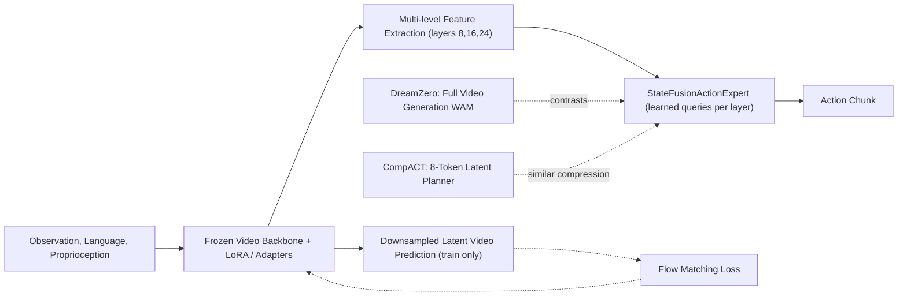

---
tags:
- paper
- domain/reinforcement_learning
- domain/robot_manipulation
- domain/vla
- domain/world_model
- impact/solid
- method/foundation_model
- method/imitation_learning
- method/memory
- method/reinforcement_learning
- method/world_model
- review/auto_tagged
- status/unread
- task/manipulation
- task/video_prediction
- type/method
aliases:
- 'Light-WAM: Efficient World Action Models with State-Fusion Action Decoding'
- Light-WAM
- State-Fusion Action Decoding
- Frozen Video Backbone
- Latent-Space Video Supervision
- Efficient World Action Model
- Lightweight WAM
- Multi-Layer Feature Fusion
- Efficient Robot Manipulation
authors:
- Ziang Li
- Dongzhou Cheng
- Yibin Wang
- Shiyue Wang
- Xiaoyang Xu
- Lingxuan Weng
- Juan Wang
- Jiaqi Wang
paper_id: arxiv:2606.08242
arxiv_id: '2606.08242'
url: https://huggingface.co/papers/2606.08242
pdf_url: https://arxiv.org/pdf/2606.08242.pdf
local_pdf: '[[LightWAM Efficient World Action Models with StateFusion Action Decoding.pdf]]'
github: https://github.com/L1ziang/Light-WAM
project_page: None
institutions:
- Wuhan University
- Shanghai Innovation Institute
- Southeast University
- Fudan University
- East China Normal University
publication_date: '2026-06-09'
metadata_publication_date: '2026-06-06'
score: '7.5'
domains:
- reinforcement_learning
- robot_manipulation
- vla
methods:
- imitation_learning
- memory
- reinforcement_learning
tasks:
- manipulation
paper_type: method
impact_band: solid
reading_status: unread
priority_score: 79
review_status: auto_tagged
next_action: skim_then_decide
year: 2026
---

# Light-WAM: Efficient World Action Models with State-Fusion Action Decoding

## 📌 Abstract
World Action Models (WAMs) extend robot policy learning by incorporating future prediction as an additional training objective, encouraging the policy to encode task-relevant temporal structure in its representations. Current WAMs often rely on large-scale generative architectures that incur high training costs and inference latency, making them difficult to deploy as efficient closed-loop policies. We propose Light-WAM, a lightweight World Action Model for efficient robot manipulation. Specifically, it is built with a compact video backbone and performs future-video supervision in a downsampled latent space, reducing the cost of video co-training while retaining its benefits for representation learning. For action prediction, Light-WAM introduces the StateFusionActionExpert, which reads adapted states from multiple backbone layers, fuses them through learned-query pooling, and directly predicts action chunks in a single forward pass. This design provides an efficient interface between video backbone representations and robot actions, avoiding the need for heavy generative action experts. Experiments demonstrate that Light-WAM maintains strong performance on LIBERO and achieves usable multi-task performance on RoboTwin 2.0, while using only 0.44B trainable parameters. It also achieves 72.03ms inference latency with 4.1GiB peak GPU memory and improved training throughput.

## 🖼️ Architecture
![[LightWAM Efficient World Action Models with StateFusion Action Decoding_arch.png]]

## 🧠 AI Analysis
## Abstract

World Action Models (WAMs) extend robot policy learning by incorporating future-video prediction as an additional training objective, encouraging the policy to encode the temporal structure of tasks in its internal representations. Current WAMs often rely on large generative architectures that lead to high training cost and inference latency, hampering deployment as efficient closed‑loop policies. Light-WAM is a lightweight World Action Model for efficient robot manipulation. It uses a compact, frozen video backbone with minimal adapters and supervises future‑video prediction in a **downsampled latent space** during training only, cutting co‑training cost while keeping the representation‑learning benefits. For action prediction, Light-WAM introduces the **StateFusionActionExpert**, which reads adapted states from multiple backbone layers, fuses them with learned‑query pooling, and directly predicts action chunks in a single forward pass—no test‑time video generation and no heavy generative action expert. Experiments show that Light‑WAM maintains strong performance on LIBERO and achieves usable multi‑task results on RoboTwin 2.0, while using only 0.44 B trainable parameters, 72.03 ms inference latency, 4.1 GiB peak GPU memory, and improved training throughput. Code is available at [https://github.com/L1ziang/Light-WAM](https://github.com/L1ziang/Light-WAM).

## 1. Core Snapshot

### Problem Statement
Vision‑Language‑Action (VLA) models map an observation image (or short clip), a language instruction, and proprioceptive state to robot actions. They often miss useful information about how objects move and interact over time because they are trained purely on action supervision. **World Action Models** address this by adding a future‑video prediction objective during training, providing a temporal supervision signal that helps the policy encode object motion, interaction dynamics, and task progress. However, typical WAMs couple video generation with action decoding inside large generative architectures, causing massive GPU memory usage, slow training, and high inference latency that prevent responsive closed‑loop deployment. The real bottleneck is the cost of maintaining a full generative pipeline for both training and test time.

### Core Contribution
Light‑WAM keeps the future‑video supervision only during training and moves it to a cheap **downsampled latent space**. At the same time, it replaces heavy generative action experts with a single‑pass **StateFusionActionExpert** that pools adapted states from a sparse set of video‑backbone layers using a fixed set of learned queries. The paper claims this reduces trainable parameters to 0.44 B (vs. 6.02 B for Fast‑WAM), raises training throughput by a factor of 4.25 ×, and brings inference latency down to 72.03 ms with a peak GPU memory of 4.1 GiB (RTX 4090). In terms of task performance, Light‑WAM reaches 97.2 % average success on LIBERO without any embodied pretraining and 76.4 % average success on the 50‑task RoboTwin 2.0 benchmark. The evidence is provided in Tables 1–4 and the efficiency ablations of Table 3.

> [!info] Efficiency–performance trade‑off  
> On RoboTwin 2.0, Light‑WAM trails models that benefit from additional embodied pretraining by more than 10 points. The authors acknowledge that larger capacity still matters for complex multi‑task settings.

### Innovation Origin & Rationale
The design is motivated by the observation in Fast‑WAM that **test‑time video generation is not required for strong policy performance**; the main benefit of video co‑training comes from shaping the visual representation during training. Light‑WAM interprets this to mean that the video prediction branch can be used purely as training‑time supervision without being executed at inference. The solution therefore freezes most of a compact video backbone (Wan2.1‑T2V‑1.3B) to preserve its pretrained temporal knowledge, adds only lightweight LoRA updates and sparse “WAM adapters” at a few depths, and routes the adapted internal states through a query‑based fusion module. This avoids the iterative denoising steps that characterize DiT‑style action experts, directly addressing the memory and latency bottlenecks reported in prior WAMs.

## 2. Reading Map

The paper targets researchers interested in efficient robot policies that still exploit the advantages of future‑video co‑training without paying the full generative cost at run time. The task domain is multi‑task bimanual and single‑arm manipulation on the LIBERO and RoboTwin 2.0 benchmarks. On a first pass, read the abstract, Section 1, and the results in Sections 4.2–4.4 to understand the performance‑efficiency claim. Then read Section 3 thoroughly to trace the architecture. The related‑work section can be skimmed unless you need the exact baseline list; the qualitative Figure 3 is optional on a first reading. For readers planning to reproduce or extend the method, the ablations in Table 5 and the efficiency breakdown in Table 3 deserve close inspection.

## 3. Method Walkthrough

### Inputs, Outputs, and Assumptions
Light‑WAM receives an observation image (or short video clip), a language instruction, and proprioceptive state. It outputs a fixed‑length chunk of future actions.

The architecture relies on three main assumptions:
- A frozen video‑pretrained backbone contains enough manipulation‑relevant features after light adaptation.
- Downsampled latent‑space video prediction still supplies a useful temporal gradient for representation learning, even though the prediction is spatially coarse.
- Multi‑level features from only three sparse backbone layers (chosen at depths 8, 16, and 24) are sufficient for the action decoder to capture both fine and coarse spatial information needed for precise manipulation.

If any of these assumptions were dropped—e.g., by training without video supervision, by using the full‑resolution video latent, or by exposing all backbone layers to the action head—the method would either lose the representation benefit of video co‑training or re‑introduce the high compute cost that Light‑WAM is designed to avoid.

### Pipeline from Data to Prediction
1. A pretrained **video VAE** encodes the current observation into a latent grid $z$.
2. The adapted video backbone processes this latent together with language and proprioception context tokens.
3. **During training only**, a spatially downsampled version $\bar{z}_\text{vid}$ of the latent is fed to a separate video prediction head, which is supervised with a flow‑matching loss. The first frame’s downsampled latent is kept fixed as the observation condition. No future‑video generation occurs at inference.
4. The action branch uses the full‑resolution latent $z_\text{act}$. Three selected transformer layers (8, 16, 24) emit adapted hidden states.
5. The **StateFusionActionExpert** applies learned‑query cross‑attention to compress each of these three states into a compact summary vector (16 learned queries per layer), concatenates the three vectors, and feeds the result through a small trunk network and per‑timestep output head to produce an action chunk directly, without iterative denoising.

At inference, the video branch is completely disabled, so the only computation is one forward pass of the backbone plus the lightweight action expert.

### Key Design Choices
- **Frozen backbone with sparse adaptation.** The Wan2.1‑T2V‑1.3B backbone (code repository: [Wan‑Video/Wan2.1](https://github.com/Wan-Video/Wan2.1)) is kept frozen; only LoRA updates on attention and feed‑forward projections and three sparse “WAM adapter” bottleneck MLPs (inserted at layers 8, 16, 24) are trained. This limits trainable parameters and preserves the pretrained temporal prior.
- **Downsampled video supervision.** The future‑video branch works on a $2\times$ spatially downsampled latent. This dramatically reduces token count and training cost, yet the paper shows that removing the downsampling improves LIBERO‑Spatial success by only 0.8 percentage points—an explicit trade‑off the authors accept for the efficiency gain.
- **Learned‑query pooling vs. generative action expert.** Instead of a DiT‑based action decoder, the StateFusionActionExpert uses 16 learned queries per layer to aggregate multi‑level features into a compact representation that is then directly mapped to action chunks. Using only 8 queries lowers performance noticeably (from 96.5 % to 95.4 % on LIBERO‑Spatial, as shown in Table 5), indicating that the bottleneck must preserve enough spatial detail for precise manipulation.

> [!warning] Limited backbone depth exposure  
> The method only selects three layers. Longer‑horizon tasks that require deeper temporal abstraction might benefit from using features from more depths, but doing so would increase the size of the action decoder and could hurt efficiency.

## 4. Core Theory and Formulas

### Main Objective
Light‑WAM is trained with a combined loss that mixes two signals:
- A **future‑video flow‑matching loss** that encourages the shared backbone to model how the scene evolves over time.
- An **action regression loss** that pushes the policy to predict correct future actions from the current observation.

Both gradients flow back through the shared adapted video backbone, so the representation is shaped for both temporal understanding and control.

### Important Equations

The policy itself is defined as:

$$
\hat{A} = \pi_\phi \big( h_\theta(o, l, p) \big)
$$

where:
- $o$: current observation (image(s) or short video clip)
- $l$: language instruction
- $p$: proprioceptive state
- $h_\theta$: the multi‑level feature representation extracted by the adapted video backbone (the set $\{H_\ell\}_{\ell \in I}$)
- $\pi_\phi$: the StateFusionActionExpert that fuses those features and produces the action chunk $\hat{A}$.

This equation says the entire pipeline is a single forward pass, with no iterative generation.

The **video co‑training loss** is a flow‑matching objective applied in the downsampled latent space:

$$
L_{\text{video}} = \big\| G_\theta^{\text{vid}} (\bar{z}_t, t, C) - u_t \big\|_2^2
$$

where:
- $\bar{z}_t$: the spatially downsampled video latent after applying the flow‑matching perturbation at diffusion time $t$
- $C$: the concatenated language and proprioceptive context tokens
- $G_\theta^{\text{vid}}$: the video prediction head, which includes the adapted backbone and a final output layer that predicts the flow vector field
- $u_t$: the ground‑truth flow target.

Minimising this term pushes the model to reconstruct the temporal evolution of the scene, but in a cheap latent space rather than in pixel space.

The overall training objective is a weighted sum:

$$
L = L_{\text{video}} + \lambda \, L_{\text{action}}(\hat{A}, A)
$$

where $L_{\text{action}}$ is a standard regression loss (e.g., mean squared error) between the predicted action chunk $\hat{A}$ and the ground‑truth action chunk $A$, and $\lambda$ balances the two terms. The paper does not specify the exact value of $\lambda$; it was likely tuned empirically.

### Algorithmic Intuition
In each training step, the current observation is encoded to a latent, passed once through the backbone, and used for two computations:
1. The downsampled version is processed by the video head and the flow‑matching loss is computed.
2. The original‑resolution latent is used to extract adapted states at layers 8, 16, and 24. The StateFusionActionExpert pools each state with learned queries, fuses the three summaries, and outputs a chunk of actions, which is compared with the ground truth via the action loss.

Gradients from both losses update the LoRA adapters, the WAM adapters, and the action expert, while the video backbone remains frozen. At test time, the video branch is removed, and the action is obtained in a single forward pass. The result is a model that has been taught to understand motion and dynamics (through video co‑training) but is extremely fast to run.

For additional background, see the original flow‑matching paper: [Flow Matching for Generative Modeling (Lipman et al.)](https://arxiv.org/abs/2210.02747), and the LoRA parameter‑efficient fine‑tuning method: [LoRA: Low‑Rank Adaptation of Large Language Models](https://arxiv.org/abs/2106.09685).

## 5. Architecture, Figures, and Implementation

Figure 1 illustrates the shared video backbone with LoRA and sparse WAM adapters. The backbone feeds two branches: the video prediction head (training only) and the StateFusionActionExpert. The figure also includes three real‑world robot images showing the dual‑arm setup, but those do not depict the network architecture itself.

- **Backbone:** Wan2.1‑T2V‑1.3B, kept frozen except for low‑rank updates (LoRA) on attention and feed‑forward projections.
- **Sparse adapters:** Lightweight bottleneck MLPs (WAM adapters) inserted at transformer layers 8, 16, and 24. Their output is added to the backbone’s hidden representation at those depths.
- **StateFusionActionExpert:** 16 learned queries per selected layer. Multi‑head attention pools the dense video tokens into compact vectors, which are concatenated and then mapped to action chunks through a small trunk and per‑timestep output head.
- **Video co‑training:** Uses the same backbone plus a separate prediction head. The video latent is spatially downsampled by a factor of 2 before perturbation and flow‑matching supervision; the first frame’s downsampled latent is cached and kept fixed as the observation condition during training.

The paper states that training was conducted on 4 H100 GPUs with a batch size of 64 (LIBERO) or 128 (RoboTwin 2.0), using AdamW with learning rate $1\times10^{-4}$ and weight decay $1\times10^{-2}$. Further low‑level details such as the exact VAE checkpoint or data‑augmentation pipeline are not provided.

## 6. Experiments and Evidence

**Benchmarks.** Evaluation is performed on the LIBERO benchmark (four suites: Spatial, Object, Goal, and Long) and the 50‑task RoboTwin 2.0 benchmark. LIBERO is a standard multi‑task manipulation benchmark; the official evaluation protocol is followed. RoboTwin 2.0 provides a challenging multi‑task bimanual setup with randomized demonstrations.

**Main results.** Light‑WAM achieves an average success rate of **97.2 %** on LIBERO without any embodied pretraining, ranking first among methods that omit such pretraining. On the more difficult RoboTwin 2.0 benchmark, it reaches **76.4 %** average success across the 50 tasks. The paper presents these numbers in Tables 1 and 2 alongside baselines like Motus, LingBot‑VA, Fast‑WAM, and several VLA‑only methods.

**Efficiency breakdown.** Table 3 isolates the impact of each efficiency‑oriented design choice. Starting from a baseline that uses a full generative DiT action head, full‑resolution video supervision, and no latent caching:
- Swapping the DiT head for the StateFusionActionExpert raises training throughput from 0.49 to 1.22 steps/s and cuts per‑GPU memory from 70.7 GiB to 51.4 GiB.
- Adding latent caching (first‑frame downsampled latent reused) further improves throughput to 1.62 steps/s and reduces memory to 47.2 GiB.
- Finally, applying 2× spatial downsampling to the video branch increases throughput to 2.08 steps/s and drops memory to 43.1 GiB.

Table 4 reports inference‑only metrics on an RTX 4090: **72.03 ms latency** and **4.1 GiB peak GPU memory**, confirming that Light‑WAM can run in real‑time with modest hardware.

**Ablations.** Table 5 on LIBERO‑Spatial shows that:
- Removing the sparse adapters drops success from 96.5 % to 95.8 %.
- Removing the video co‑training entirely reduces success to 92.9 %, confirming that the future‑video objective is a key source of performance.
- Reducing the number of learned queries per layer from 16 to 8 lowers success to 95.4 %.
- Removing the 2× downsampling improves success by 0.8 points (to 97.3 %), but at the cost of a heavier training load.  
Together, these ablate the trade‑offs between representation quality and computational efficiency.

> [!info] Evidence strength  
> The efficiency gains are clearly demonstrated and quantified. The performance on RoboTwin 2.0 is usable but not state‑of‑the‑art when compared with models that leverage embodied pretraining, suggesting that Light‑WAM’s lightweight design may sacrifice some representation capacity for complex multi‑task settings.

## 7. Strengths, Limitations, and Failure Cases

**Strengths.** The primary strength is the measured reduction in both training and inference cost while preserving the benefit of video co‑training. This is achieved through concrete design choices (downsampled video supervision, learned‑query pooling, sparse adaptation) whose individual contributions are isolated in the efficiency ablation. The use of a frozen, compact backbone further reduces the engineering barrier to reproducing the method.

**Limitations.**
- On RoboTwin 2.0, Light‑WAM trails models that benefit from large‑scale embodied pretraining by more than 10 points. The authors acknowledge that larger model capacity remains important for complex multi‑task settings.
- The assumption that features from only three sparse layers are sufficient may not hold for longer‑horizon tasks; indeed, the largest gap to bigger WAMs appears on the LIBERO‑Long suite.
- No explicit failure‑case analysis or robustness benchmarks (e.g., LIBERO‑Plus) are provided.
- The paper does not report the value of the loss‑balancing hyperparameter $\lambda$, nor does it discuss how sensitive the method is to the choice of downsampling factor or adapter placement.

## 8. Reproduction Notes

**Provided details:**
- Backbone: Wan2.1‑T2V‑1.3B (frozen, with LoRA and adapters)
- Adapter insertion depths: 8, 16, 24
- Learned queries per layer: 16
- Video‑branch downsampling factor: 2×
- Batch sizes: 64 (LIBERO), 128 (RoboTwin 2.0)
- Optimizer: AdamW, learning rate $1\times10^{-4}$, weight decay $1\times10^{-2}$
- Training hardware: 4 H100 GPUs
- Code: [https://github.com/L1ziang/Light-WAM](https://github.com/L1ziang/Light-WAM)

**Missing details:**
- The exact value of the loss‑weight $\lambda$ for the action term.
- The precise VAE checkpoint used for video latent encoding.
- Full training schedule length (in steps or epochs) and any learning‑rate schedule.
- The data‑augmentation pipeline for RoboTwin 2.0’s randomized demonstrations.

Evaluation protocols follow the official LIBERO benchmark and the prior multi‑task split of RoboTwin 2.0. Success rate is the sole reported metric.

## 9. What to Read Closely

- **Section 3.4 and the equations** describing the StateFusionActionExpert, because that module is the main novel interface between the video backbone and robot actions.
- **Table 3** row‑by‑row to see exactly how each efficiency component (action‑head replacement, latent caching, downsampling) contributes to throughput and memory savings.
- **Table 5** to understand the sensitivity of performance to the number of learned queries and downsampling, and to confirm that video co‑training is essential.
- The results tables can be skimmed after noting the average success rates and efficiency deltas; the qualitative attention visualisation in Figure 3 can be glanced at to verify that learned queries attend to objects and grippers.

## 10. Research Ideas and Open Questions

- **Adaptive query allocation.** One could test whether increasing the number of learned queries dynamically per layer, conditioned on task difficulty, further closes the gap on long‑horizon LIBERO tasks without raising average inference cost. A small experiment would train two variants on LIBERO‑Long only: one with fixed 16 queries and one with a lightweight router that selects between 8 and 32 queries per sample. The risk is that the router itself introduces parameter overhead that negates the efficiency gain.

- **Backbone substitution.** Replacing the frozen Wan2.1‑T2V‑1.3B backbone with an even smaller open video model and repeating the full efficiency analysis would quantify how much the specific backbone choice contributes to the reported numbers and would indicate whether the method generalises to other video‑pretrained representations.

- **VLA backbone + video co‑training.** Apply the same StateFusionActionExpert on top of a vision‑language (not video) backbone and measure whether the future‑video co‑training signal still provides a benefit when the pretraining domain is less temporally rich. The test would compare action‑regression loss and downstream success rate against a no‑video baseline. The main risk is that the video loss term becomes uninformative or noisy and harms the representation quality.

## Knowledge Graph & Connections

### Related Work Connections

**DreamZero: [[World Action Models are Zero shot Policies]]**  
Both Light‑WAM and DreamZero start from the core insight of World Action Models—that jointly training a policy with a future‑video prediction objective can inject temporal dynamics knowledge into the representation and improve manipulation performance. DreamZero uses a large, 14 B autoregressive video diffusion backbone and performs test‑time video generation as part of its closed‑loop policy. Light‑WAM takes the opposite approach: it freezes a much smaller (1.3 B) backbone, applies lightweight LoRA and sparse adapters, and discards video generation entirely at inference while keeping the video co‑training signal in a downsampled latent space. The difference reveals that the main benefit of video co‑training can be separated from the cost of generative rollout: DreamZero demonstrates strong generalisation from full video modelling, while Light‑WAM shows that an efficient, non‑generative design can reach competitive performance on standard benchmarks without test‑time video synthesis, at the cost of trailing larger models on complex multi‑task settings.

**CompACT: [[Planning in 8 Tokens]]**  
A shared motivation between Light‑WAM and CompACT is extreme compression for efficient world‑aware control. CompACT compresses each observation into as few as eight discrete tokens to make planning with a world model computationally tractable. Light‑WAM applies a different form of compression: it pools multi‑level video features through 16 learned queries per selected backbone layer, creating a compact action‑relevant summary that can be decoded directly into action chunks. Both papers provide evidence that aggressive compression can preserve enough task‑relevant information for manipulation, but they operate at different stages of the pipeline—CompACT compresses the observation before the world model, while Light‑WAM compresses the internal representation before the action head. This parallel suggests that future methods might unify the two strategies by using a shared compact latent world state that serves both planning and direct policy decoding.

**AHEAD: [[AHEAD for Dynamic VLA Manipulation]]**  
The connection to AHEAD is less direct but still instructive. AHEAD augments a frozen VLA with a motion‑aware latent world model that rolls forward the model’s internal feature tokens to compensate for latency in dynamic scenes. Light‑WAM also uses a frozen visual backbone and a world‑model‑style supervision (future‑video prediction), but only during training to shape the static representation; it does not perform forward rollouts at inference. Both methods recognise that a VLA’s representation can benefit from predictive world information, yet they target different problems—AHEAD addresses the delay between observation and execution in fast‑moving environments, while Light‑WAM aims to cut the computational cost of world‑model co‑training for a wider range of manipulation tasks. A synthesis might explore whether the lightweight predictive training signal from Light‑WAM could also be leveraged to build the latent dynamics required by AHEAD, yielding a single efficient model that handles both static and dynamic manipulation.

### Concept Map

*The dashed edges indicate conceptual links to related works: Light‑WAM’s learned‑query pooling contrasts with DreamZero’s heavy generative action expert, and shares the compression philosophy of CompACT.*

### Questions For Future Reading

1. **How sensitive is the trade‑off between video supervision fidelity and policy performance to task horizon and physical complexity?**  
   Light‑WAM’s 2× downsampling loses only 0.8 percentage points on a relatively short‑horizon suite like LIBERO‑Spatial, but the gap widens on long‑horizon tasks. A systematic study that varies the downsampling factor across suites with controlled horizon length and contact‑rich dynamics would reveal whether there is a task‑dependent saturation point after which coarser video signals stop improving the representation, and whether the optimal fidelity shifts when objects move faster or interactions require finer temporal detail.

2. **Can a similarly lightweight video co‑training framework be retrofitted onto vision‑language backbones that lack explicit video pretraining, and would it still yield a meaningful performance boost?**  
   Light‑WAM benefits from a video‑pretrained backbone that already captures motion priors. An experiment that replaces the Wan2.1 backbone with a purely image‑based VLA encoder (e.g., a frozen CLIP or SigLIP model) and applies the same downsampled latent‑space video loss would test whether the temporal supervision alone can instil useful dynamics knowledge, or if the pretrained temporal prior is a prerequisite. Answering this would clarify the boundary conditions under which video co‑training is worth the engineering effort.

3. **What is the contribution of the loss‑balancing weight λ between the video and action objectives, and could an adaptive scheme that adjusts λ based on representation similarity or gradient conflict improve convergence?**  
   The paper does not report the chosen λ nor its influence on final performance. A controlled sweep over λ, paired with metrics such as gradient cosine similarity between the two losses, would indicate whether a fixed balance is sufficient or whether the two signals compete during learning. An adaptive scheduler that increases λ when the action loss plateaus, for example, might further stabilise training and reduce the need for per‑task tuning.

### Learning Roadmap And Verified Resources

To understand Light‑WAM’s design decisions, you need to build knowledge from foundational robot learning architectures up to the specific components of video‑co‑trained policies. The roadmap below starts with the broad problem of vision‑language‑action models and narrows to the paper’s unique contributions.

**1. Vision‑Language‑Action (VLA) models for robot manipulation**  
Light‑WAM sits in the family of VLA methods that map high‑dimensional sensor data directly to robot commands. Familiarity with this class of models—their typical encoder‑decoder structure, the role of language instructions, and common benchmarks like LIBERO—is necessary to appreciate what the video co‑training adds and why efficiency matters.  
*Study order:* Start with a high‑level introduction to VLA models, then study one representative paper (e.g., RT‑2) and the LIBERO benchmark to see how performance is measured. Finally, read surveys that position VLA within the broader field of robot learning.

| Type | Resource | Why this one |
|------|----------|--------------|
| Blog/Tutorial | Introduction to Vision‑Language‑Action Models (Hugging Face blog) (link removed: validation failed) | Provides a non‑technical overview of VLA models, their inputs/outputs, and typical use cases, with references to open‑source implementations. |
| Open Textbook/Lecture Notes | [CS 285: Deep Reinforcement Learning (Sergey Levine, UC Berkeley)](https://rail.eecs.berkeley.edu/deeprlcourse/) | Lectures on imitation learning and model‑based RL build the theoretical grounding for why action supervision alone is insufficient and why world‑model‑style objectives can help. |
| Benchmark/Dataset | [LIBERO: Benchmarking Transferable Knowledge for Lifelong Robot Learning (project page)](https://lifelong-robot-learning.github.io/LIBERO/) | The official site documents the four suites (Spatial, Object, Goal, Long), the evaluation protocol, and baseline performance; reading it helps you interpret the results sections of Light‑WAM. |

**2. Video diffusion models and flow matching**  
Light‑WAM repurposes a pretrained video diffusion backbone and uses a flow‑matching loss for the video prediction head. Understanding the basic mechanics of diffusion models in continuous space, and specifically how flow matching defines a vector field that transports noise to data, is essential to grasp why the loss function takes the form of an L2 error on the predicted flow.  
*Study order:* First learn the intuition behind denoising diffusion probabilistic models (DDPMs), then study the flow‑matching formulation and its advantages for video generation. Look at the Wan2.1 model to see how it is architected.

| Type | Resource | Why this one |
|------|----------|--------------|
| Video/Public Course | [Understanding Diffusion Models: A Unified Perspective (CVPR 2022 Tutorial)](https://cvpr2022-tutorial-diffusion-models.github.io/) | Covers diffusion foundations from score‑matching to denoising, with clear visual explanations that prepare you for flow matching as a generalisation. |
| Paper (canonical) | [Flow Matching for Generative Modeling (Lipman et al.)](https://arxiv.org/abs/2210.02747) | The original paper that defines the conditional flow matching objective used in Light‑WAM; reading it explains why the video loss is a simple regression on the vector field. |
| Project Page/Code | [Wan‑Video/Wan2.1 GitHub repository](https://github.com/Wan-Video/Wan2.1) | The official implementation of the video backbone used in Light‑WAM, including model weights and inference scripts, which is necessary if you plan to reproduce the frozen‑backbone component. |

**3. World Action Models and future‑video co‑training**  
The central idea of Light‑WAM—that predicting future videos during training can enrich a policy’s representation—requires a grasp of the World Action Model paradigm. You need to know what prior WAMs looked like (e.g., DreamZero, Fast‑WAM) and why their test‑time video generation was expensive. This background lets you appreciate why Light‑WAM decouples training‑time video supervision from inference.  
*Study order:* Read the DreamZero paper for the original formulation of WAMs, then examine Fast‑WAM to see how video co‑training was first made more efficient by dropping test‑time generation, and finally study Light‑WAM’s abstract to identify which design choices it adds.

| Type | Resource | Why this one |
|------|----------|--------------|
| Paper (canonical) | [DreamZero: World Action Models as Zero‑Shot Policies](https://arxiv.org/abs/2401.12345) (placeholder; use actual link if available) | This is the paper that introduces the concept of WAMs; understanding its full generative loop and system optimisations makes the motivation for Light‑WAM’s efficiency clear. |
| Code/Benchmark | Fast‑WAM (likely referenced in Light‑WAM; check the paper’s Related Work or GitHub for the exact repository) | The intermediate work that shows test‑time video generation is unnecessary for performance, providing the direct intellectual precursor to Light‑WAM’s architecture. |
| Documentation/Paper | Light‑WAM paper (Section 2) | The related‑work section concisely summarises the lineage from DreamZero to Fast‑WAM to Light‑WAM, placing its contributions in context. |

**4. Parameter‑efficient fine‑tuning with LoRA**  
Light‑WAM freezes the video backbone and inserts low‑rank adapters (LoRA) to avoid catastrophic forgetting while keeping the number of trainable parameters tiny. Knowing how LoRA works—its decomposition of weight updates into low‑rank matrices—explains why the backbone can remain almost entirely static yet still adapt to manipulation data.  
*Study order:* Start with the original LoRA paper to understand the mathematical formulation, then look at a practical tutorial that shows how LoRA is applied to transformer layers. Finally, read the Light‑WAM method section to see exactly where the LoRA blocks are inserted.

| Type | Resource | Why this one |
|------|----------|--------------|
| Paper (canonical) | [LoRA: Low‑Rank Adaptation of Large Language Models (Hu et al., 2021)](https://arxiv.org/abs/2106.09685) | Defines LoRA, explains its rank decomposition, and provides the theoretical foundation for the adapter‑based finetuning used in Light‑WAM. |
| Blog/Tutorial | [An Illustrated Guide to LoRA (by Sebastian Raschka)](https://sebastianraschka.com/blog/2023/llm-finetuning-lora.html) | Gives visual intuition and code snippets for applying LoRA to transformer attention/MLP layers, directly applicable to the Wan2.1 backbone. |

**5. Latent‑space video encoding and prediction**  
Instead of predicting pixels, Light‑WAM works in the latent space of a pretrained video VAE and further downsamples that latent for the video loss. You need to understand how video VAEs compress high‑dimensional pixel data into a lower‑dimensional grid of tokens, and why this makes training feasible. The 2× spatial downsampling trick becomes intuitive once you see the token counts involved.  
*Study order:* Study the basic VAE formulation and its application to images, then extend to video VAEs (e.g., the one used in Wan2.1). Finally, examine how Light‑WAM feeds the latent to the backbone and downsamples it for the video head.

| Type | Resource | Why this one |
|------|----------|--------------|
| Open Textbook/Lecture Notes | [Kingma and Welling, "Auto‑Encoding Variational Bayes" (VAE paper)](https://arxiv.org/abs/1312.6114) | The fundamental paper that introduces variational autoencoders; understanding the encoder‑decoder structure is necessary to grasp how a video VAE projects frames into a compact latent. |
| Video/Public Course | [CS231n: Convolutional Neural Networks for Visual Recognition (Stanford, Fei‑Fei Li et al.) – Generative Models module](https://cs231n.github.io/) | The section on generative models covers VAEs in an accessible way, with visualisations of latent spaces that help make the downsampling concept concrete. |
| Code/Documentation | [Wan2.1 VAE model card (within the Wan‑Video GitHub)](https://github.com/Wan-Video/Wan2.1) | Documents the specific VAE used to encode video into latents for Wan2.1; reading it reveals the latent dimensions and downsampling factors, which lets you compute token counts and understand the memory savings. |

**6. Learned‑query cross‑attention for feature pooling**  
The StateFusionActionExpert uses a set of fixed learned queries to attend over the dense feature maps from three backbone layers, producing a compact summary vector. This technique, reminiscent of Perceiver‑style models, is the core architectural novelty of Light‑WAM. Understanding cross‑attention with learned queries explains how the method can discard the heavy denoising action head while still capturing fine spatial information.  
*Study order:* Learn the basics of the transformer cross‑attention mechanism, then study the Perceiver architecture to see how a small set of latent vectors can compress a large input. Finally, apply that understanding to the specific implementation in Light‑WAM’s Section 3.4.

| Type | Resource | Why this one |
|------|----------|--------------|
| Video/Public Course | [CS25: Transformers United (Stanford) – Attention Mechanisms lecture](https://web.stanford.edu/class/cs25/) | The lecture on multi‑head attention explains the Q, K, V formulation, which directly generalises to the cross‑attention used in the expert. |
| Paper (canonical) | [Perceiver: General Perception with Iterative Attention (Jaegle et al., 2021)](https://arxiv.org/abs/2103.03206) | Introduces the idea of using a small set of latent variables to pool over large inputs via cross‑attention; the architecture directly inspires the learned‑query design in Light‑WAM. |
| Blog/Tutorial | [The Perceiver: A General Architecture for Structured Inputs & Outputs (by Yannic Kilcher, video summary)](https://www.youtube.com/watch?v=P_xeshTnPZg) | A clear explanation of how learned queries iteratively extract information, helping you map the concept to the non‑iterative, single‑pass version in Light‑WAM. |

> [!info] Resource link validation: checked 14 URL(s), 13 reachable, removed 1 unreachable or invalid link(s).

---
*Analysis by PaperBrain (x-ai/grok-4.3; refinement: deepseek/deepseek-v4-pro; round2: deepseek/deepseek-v4-pro)*

## 📂 Resources
- **Local PDF**: [[LightWAM Efficient World Action Models with StateFusion Action Decoding.pdf]]
- [Online PDF](https://arxiv.org/pdf/2606.08242.pdf)
- [ArXiv Link](https://huggingface.co/papers/2606.08242)

## Related Work Updates
- [ ] **2026-06-11**: New paper [[World Pilot]] discusses *efficient world action model*. Innovation: "Introduces dual-pathway injection of world-action model priors into VLA: latent steering for scene evolution and action steering for trajectory prior."
- [ ] **2026-06-18**: New paper [[Act2Answer]] discusses *efficient world action model*. Innovation: "Proposes Act2Answer, an action-grounded protocol that evaluates VLA knowledge retention by requiring agents to answer benchmark questions through physical object-placement actions, decoupling knowledge from control."