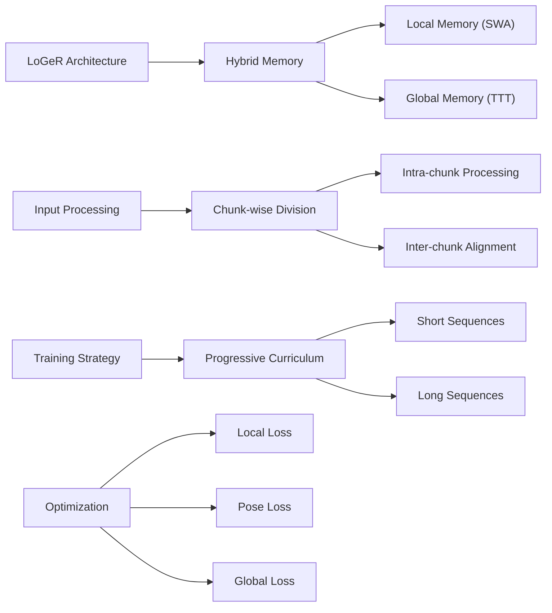

---
tags:
  - paper
  - World_Model
  - Embodied_AI
  - Sim2Real
  - Robot_Manipulation
  - Foundation_Model
aliases:
  - "LoGeR: Long-Context Geometric Reconstruction with Hybrid Memory"
url: http://arxiv.org/abs/2603.03269v1
pdf_url: https://arxiv.org/pdf/2603.03269v1
local_pdf: "[[LoGeR LongContext Geometric Reconstruction with Hybrid Memory.pdf]]"
github: "https://LogeR-project.github.io/"
project_page: "https://LogeR-project.github.io/"
institutions:
  - "Google DeepMind"
  - "UC Berkeley"
publication_date: "2026-03-03"
score: 8
---

# LoGeR: Long-Context Geometric Reconstruction with Hybrid Memory

## 📌 Abstract
Feedforward geometric foundation models achieve strong short-window reconstruction, yet scaling them to minutes-long videos is bottlenecked by quadratic attention complexity or limited effective memory in recurrent designs. We present LoGeR (Long-context Geometric Reconstruction), a novel architecture that scales dense 3D reconstruction to extremely long sequences without post-optimization. LoGeR processes video streams in chunks, leveraging strong bidirectional priors for high-fidelity intra-chunk reasoning. To manage the critical challenge of coherence across chunk boundaries, we propose a learning-based hybrid memory module. This dual-component system combines a parametric Test-Time Training (TTT) memory to anchor the global coordinate frame and prevent scale drift, alongside a non-parametric Sliding Window Attention (SWA) mechanism to preserve uncompressed context for high-precision adjacent alignment. Remarkably, this memory architecture enables LoGeR to be trained on sequences of 128 frames, and generalize up to thousands of frames during inference. Evaluated across standard benchmarks and a newly repurposed VBR dataset with sequences of up to 19k frames, LoGeR substantially outperforms prior state-of-the-art feedforward methods--reducing ATE on KITTI by over 74%--and achieves robust, globally consistent reconstruction over unprecedented horizons.

## 🖼️ Architecture
![[LoGeR LongContext Geometric Reconstruction with Hybrid Memory_arch.png]]
*Figure 2. Overview of a single block of our hybrid memory module. We process the input sequence in consecutive chunks of frames. While each block utilizes frame and bidirectional memory from prior work, we introduce new components to effectively propagate information across the entire sequence.*

## 🧠 AI Analysis (Doubao Seed 2.0 Pro)

# 🚀 Deep Analysis Report: LoGeR: Long-Context Geometric Reconstruction with Hybrid Memory

## 📊 Academic Quality & Innovation
1. **Core Snapshot**
- **Problem Statement**: Existing geometric reconstruction models fail to scale to extremely long video sequences due to quadratic attention complexity and memory limitations, creating a critical gap in processing city-scale 3D scenes.
- **Core Contribution**: A hybrid memory architecture combining Test-Time Training (TTT) for compressed global context and Sliding Window Attention (SWA) for local detail preservation, enabling efficient processing of sequences up to 19k frames.
- **Academic Rating**:
  - Innovation: 9/10 - Novel hybrid memory design effectively bridges local-global tradeoff
  - Rigor: 8/10 - Comprehensive ablations and evaluations across multiple benchmarks

2. **Technical Decomposition**
- **Methodology**: 
Key objectives include:
  - Local pointmap loss: $\mathcal{L}_{local} = \frac{1}{N|\Omega|}\sum_{i=1}^N\sum_{p\in\Omega}\frac{1}{z_{i,p}}||s^*\mathbf{x}_{i,p} - \mathbf{x}_{i,p}||_1$
  - Relative pose loss: $\mathcal{L}_{pose} = \sum_{(i,j)\in\mathcal{P}}(\lambda\mathcal{L}_{rot}(\mathbf{R}_{ij},\mathbf{R}_{ij}^*)+\mu||\mathbf{t}_{ij}-\mathbf{t}_{ij}^*||_{Huber})$
  - Global consistency loss: $\mathcal{L}_{global} = \frac{1}{N|\Omega|}\sum_{i=1}^N\sum_{p\in\Omega}||\Pi(\mathbf{T}_i,\mathbf{x}_{i,p})-\Pi(\mathbf{T}_i^*,\mathbf{x}_{i,p})||_1$

- **Architecture**: 
  - Chunk-wise processing with minimal overlap
  - Dual memory streams: TTT for global context, SWA for local detail
  - Progressive curriculum training from short to long sequences

- **Aha Moment**:
  1. Using TTT as compressive memory for global context while maintaining linear complexity
  2. Progressive curriculum strategy to stabilize training of recurrent TTT layers

3. **Evidence & Metrics**
- **Benchmark & Baselines**: Comprehensive comparison against SOTA methods (VGGT, FastVGGT, TTT3R) on KITTI and VBR datasets. Fair comparison ensured through identical evaluation protocols.

- **Key Results**:
  - 30.8% improvement on VBR benchmark
  - 74% reduction in ATE on KITTI
  - Linear scaling to 19k frames vs quadratic for baselines

- **Ablation Study**: TTT memory module provides most significant gains, with 69.2% performance drop when removed.

4. **Critical Assessment**
- **Hidden Limitations**:
  - Requires periodic state resets for extremely long sequences
  - Performance dependent on chunk size selection
  - Memory requirements still scale with sequence length, albeit linearly

- **Engineering Hurdles**:
  - Complex curriculum training requiring careful scheduling
  - High computational demands (32 H100 GPUs for 2 days)
  - Sensitive hyperparameter tuning for TTT update frequency

5. **Next Steps**
1. Investigate adaptive chunk sizing based on scene complexity
2. Develop memory-efficient TTT compression techniques for mobile deployment
3. Extend the hybrid memory architecture to handle multi-agent collaborative reconstruction

## 🔗 Knowledge Graph & Connections
**Task 1: Knowledge Connections**

1. [[GeometryAware_Rotary_Position_Embedding]] - Strong connection in handling geometric consistency across long sequences. Both papers tackle the challenge of maintaining spatial relationships, though LoGeR's hybrid memory approach offers a different solution than rotary embeddings.

2. [[MALLVI]] - Both works address long-context visual understanding, but from different angles. MALLVI focuses on video language understanding while LoGeR targets geometric reconstruction. Their memory management strategies could be complementary.

3. [[World_Action_Models_are_Zero_shot_Policies]] - Similar to LoGeR's Test-Time Training component, this work demonstrates how learned representations can adapt to new contexts without full retraining.

**Task 2: Mermaid Knowledge Graph**

**Task 3: Future Directions**

1. **Adaptive Memory Compression**
- Research Problem: Develop an intelligent system that dynamically adjusts TTT compression rates based on scene complexity
- Key Components:
  * Scene complexity estimator
  * Dynamic memory allocation
  * Adaptive compression threshold
- Expected Impact: Optimal memory usage while maintaining reconstruction quality

2. **Cross-Modal Hybrid Memory**
- Research Problem: Extend LoGeR's hybrid memory architecture to handle multiple modalities (RGB, depth, LiDAR)
- Key Components:
  * Modal-specific memory streams
  * Cross-modal attention mechanism
  * Unified geometric representation
- Expected Impact: More robust reconstruction from heterogeneous sensors

3. **Online Learning for Dynamic Scenes**
- Research Problem: Adapt LoGeR for real-time reconstruction of dynamic scenes
- Key Components:
  * Incremental TTT updates
  * Dynamic object handling
  * Real-time memory management
- Expected Impact: Enable real-time applications like autonomous driving and AR/VR

Each direction builds upon LoGeR's core strengths while addressing current limitations and expanding its applicability to new domains.

---
*Analysis performed by PaperBrain-Doubao (Vision-Enabled)*

## 📂 Resources
- **Local PDF**: [[LoGeR LongContext Geometric Reconstruction with Hybrid Memory.pdf]]
- [Online PDF](https://arxiv.org/pdf/2603.03269v1)
- [ArXiv Link](http://arxiv.org/abs/2603.03269v1)
