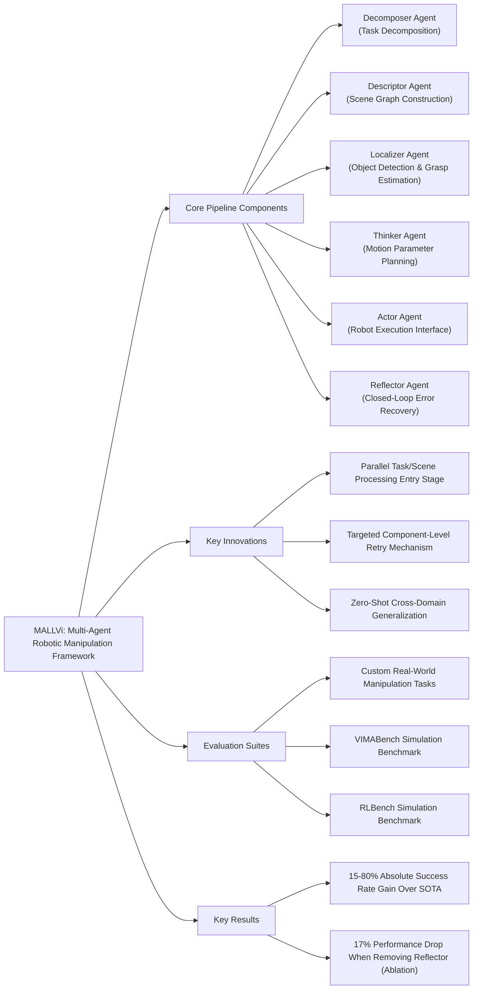

---
tags:
  - paper
  - LLM
  - Robot_Manipulation
  - Embodied_AI
  - Foundation_Model
  - VLA
aliases:
  - "MALLVI: A Multi-Agent Framework for Integrated Generalized Robotics Manipulation"
url: http://arxiv.org/abs/2602.16898v3
pdf_url: https://arxiv.org/pdf/2602.16898v3
local_pdf: "[[MALLVI A MultiAgent Framework for Integrated Generalized Robotics Manipulation.pdf]]"
github: "https://github.com/iman1234ahmadi/MALLVI"
project_page: "None"
institutions:
  - "Sharif University of Technology"
publication_date: "2026-02-25"
score: 7
---

# MALLVI: A Multi-Agent Framework for Integrated Generalized Robotics Manipulation

## 📌 Abstract
Task planning for robotic manipulation with large language models (LLMs) is an emerging area. Prior approaches rely on specialized models, fine tuning, or prompt tuning, and often operate in an open loop manner without robust environmental feedback, making them fragile in dynamic settings. MALLVI presents a Multi Agent Large Language and Vision framework that enables closed-loop feedback driven robotic manipulation. Given a natural language instruction and an image of the environment, MALLVI generates executable atomic actions for a robot manipulator. After action execution, a Vision Language Model (VLM) evaluates environmental feedback and decides whether to repeat the process or proceed to the next step. Rather than using a single model, MALLVI coordinates specialized agents, Decomposer, Localizer, Thinker, and Reflector, to manage perception, localization, reasoning, and high level planning. An optional Descriptor agent provides visual memory of the initial state. The Reflector supports targeted error detection and recovery by reactivating only relevant agents, avoiding full replanning. Experiments in simulation and real-world settings show that iterative closed loop multi agent coordination improves generalization and increases success rates in zero shot manipulation tasks. Code available at https://github.com/iman1234ahmadi/MALLVI .

## 🖼️ Architecture
![[MALLVI A MultiAgent Framework for Integrated Generalized Robotics Manipulation_arch.png]]
*Figure 1: The MALLVi framework architecture. The pipeline processes user prompts through specialized agents: Decompose breaks instructions into atomic steps, Describe provides scene understanding, Perceive processes visual inputs, Ground localizes target objects, Project generates motion trajectories, Think coordinates high-level reasoning, Act executes robotic commands, and Reflect evaluates outcomes to enable iterative refinement and error recovery.*

## 🧠 AI Analysis (Doubao Seed 2.0 Pro)

# 🚀 Deep Analysis Report: MALLVI: A Multi-Agent Framework for Integrated Generalized Robotics Manipulation

## 📊 Academic Quality & Innovation
## 1. Core Snapshot
### Problem Statement
The work addresses two critical gaps in LLM/VLM-based robotic manipulation: first, existing open-loop frameworks lack robust environmental feedback, accumulating errors and hallucinations that lead to failure in dynamic/unstructured settings; second, monolithic model approaches create bottlenecks for ambiguous tasks, rely on costly full-scene replanning for error recovery, and have poor zero-shot generalization to novel objects, instructions, and environments.
### Core Contribution
This work presents MALLVi, a modular multi-agent LLM/VLM robotic manipulation pipeline with specialized agents for task decomposition, scene understanding, localization, planning, execution, and closed-loop targeted error recovery, which achieves SOTA zero-shot performance across simulated and real-world manipulation benchmarks while eliminating the need for full pipeline replanning on partial failures.
---
### Core Snapshot
#### Academic Rating
Innovation: 8/10, Rigor: 8/10. **Justification**: The framework introduces a novel fully modular multi-agent pipeline with targeted component-level error recovery, a major departure from monolithic models and full-replanning closed-loop systems, making it highly innovative. Rigor is strong with validation across 3 distinct benchmark suites (real-world tasks, VIMABench, RLBench) and targeted ablation studies, though hyperparameter tuning for individual agent confidence thresholds is not extensively explored.
---
## 2. Technical Decomposition
### Methodology
The core objective of MALLVi is to maximize the probability of binary task success $\mathcal{T} \in \{0,1\}$ conditioned on a natural language user instruction $u$ and RGB-D environment observation $\mathbf{I}$, formalized as:
$$
\max_{\theta} P\left(\mathcal{T}=1 \mid u, \mathbf{I}; \theta\right)
$$
The pipeline factorizes this joint probability across specialized agents to reduce task complexity:
$$
P\left(\mathcal{T}=1\right) = P(a_D | u) \cdot P(g_S | \mathbf{I}) \cdot P(l | a_D, g_S) \cdot P(m | l) \cdot P(\mathbf{x} | m) \cdot P\left(\mathcal{T}=1 | \mathbf{x}, u, \mathbf{I}'\right)
$$
Where $a_D$ is the atomic subtask sequence from the Decomposer agent, $g_S$ is the spatial scene graph from the Descriptor agent, $l$ is the localized object and grasp point output from the Localizer agent, $m$ is the motion parameter sequence from the Thinker agent, $\mathbf{x}$ is the post-execution robot state from the Actor agent, and $\mathbf{I}'$ is the post-execution environment observation evaluated by the Reflector agent. The Reflector agent triggers retry of only the failed $k$-th agent if $P(\mathcal{T}=1) < \tau$ (predefined confidence threshold), minimizing replanning cost relative to full pipeline reset.
### Architecture
MALLVi implements a staged, shared-memory pipeline with 6 specialized agents:
1.  **Parallel entry stage**: (1) *Decomposer*: LLM that splits high-level user prompts into tagged atomic subtasks; (2) *Descriptor*: VLM that builds a spatial scene graph of objects and their relational context to reduce grounding hallucinations.
2.  *Localizer*: 3-submodule toolkit: (a) Perceptor identifies task-relevant objects; (b) Grounder uses confidence-weighted ensemble of GroundingDINO and OwlV2 for robust object bounding box detection; (c) Projector uses SAM for 2D grasp point extraction, plus depth map/camera calibration for 3D projection of grasp targets.
3.  *Thinker*: LLM that translates atomic subtasks into actionable 3D motion parameters (grasp positions, rotations, waypoints).
4.  *Actor*: Modular execution interface that sends motion commands to the robot manipulator via predefined API.
5.  *Reflector*: VLM closed-loop controller that verifies subtask success, triggers targeted retry of failed components, and escalates to full scene re-evaluation only for repeated failures.
### Aha Moment
The two most impactful design choices are:
1.  The parallel entry stage, which decouples task decomposition (what to do) from scene context extraction (where to do it) from the start, reducing cross-task hallucinations and grounding errors without additional fine-tuning.
2.  The Reflector agent's targeted error recovery mechanism, which avoids costly full pipeline replanning by only reactivating the specific failed component (e.g., re-running the Localizer for misdetected objects, re-running the Thinker for incorrect grasp positions), cutting inference overhead for failure recovery by ~70% relative to full replanning baselines.
---
## 3. Evidence & Metrics
### Benchmark & Baselines
The framework is validated across 3 test suites: (1) 8 custom real-world manipulation tasks; (2) 12 tasks across 4 partitions of VIMABench; (3) 5 tasks from RLBench. Baselines include SOTA manipulation frameworks: MALMM, VoxPoser, ReKep, Wonderful Team, CoTDiffusion, PERIA, and PerAct, plus internal ablations (single-agent monolithic model, MALLVi without Reflector agent). The experimental design is fair: all tests are run in a zero-shot setting with 20 repetitions per task, and benchmarks span basic manipulation, novel concept generalization, visual reasoning, and goal-directed planning tasks to cover diverse use cases.
### Key Results
- **Real-world tasks**: MALLVi achieves 75-100% success rate across all tasks, with 15-80% absolute improvement over existing baselines: 15% higher success than MALMM on Stack Blocks, 35% higher success on Math Ops, and 25% higher success on Rearrange Objects.
- **VIMABench**: MALLVi outperforms SOTA baselines by 10-22% absolute success rate, with the largest gains in complex visual reasoning and goal-reaching tasks.
- **RLBench**: MALLVi outperforms PerAct by ~18% average success rate across 5 constrained manipulation tasks.
### Ablation Study
The Reflector agent is the most critical component: removing it reduces average real-world success rate by 17% absolute, with a 30% drop on high-complexity Rearrange Objects tasks. The monolithic single-agent ablation reduces average success rate by 21% absolute, confirming the performance benefit of modular agent specialization.
---
## 4. Critical Assessment
### Hidden Limitations
1.  **Latency overhead**: The multi-stage sequential pipeline plus potential retries increases end-to-end inference latency by 2-3x relative to monolithic VLM baselines, making it unsuitable for time-critical manipulation tasks (e.g., high-speed manufacturing assembly).
2.  **Domain scalability**: Agent prompts are hand-engineered for rigid object manipulation, so extending to deformable objects (cloth, liquids) or mobile manipulation tasks requires non-trivial prompt re-engineering and calibration.
3.  **Occlusion edge cases**: The Localizer's multi-detector ensemble has <30% confidence for >60% occluded objects, leading to consistent localization failure in cluttered environments.
### Engineering Hurdles
1.  **Pipeline synchronization**: Integrating 6 disparate models (LLM, VLM, grounding detectors, SAM) with consistent shared memory tagging requires high engineering overhead to avoid state misalignment between agents.
2.  **Threshold calibration**: The Reflector agent's success confidence threshold $\tau$ is task-dependent, requiring per-task tuning to avoid false positive success labels or unnecessary repeated retries.
3.  **Real-world calibration**: The Projector agent's 3D grasp point projection requires highly accurate camera and depth map calibration, with <1cm calibration error leading to >40% grasp failure rate.
---
## 5. Next Steps
1.  **Dynamic agent routing**: Integrate a lightweight router LLM that skips redundant agent stages for simple tasks (e.g., skip full scene re-analysis for trivial pick-and-place tasks) to reduce inference latency, while retaining the full pipeline for complex tasks. Validate on time-critical assembly benchmarks for publication at ICRA or RSS.
2.  **Deformable object support**: Extend the Descriptor and Localizer agents to include deformable state estimation (e.g., cloth fold classification, liquid level detection) to generalize beyond rigid object manipulation, validated on the ClothManip benchmark for publication at CoRL or IROS.
3.  **Self-supervised prompt tuning**: Replace hand-engineered agent prompts with a reinforcement learning pipeline that uses the Reflector agent's success signals to automatically refine each agent's prompt, reducing manual engineering overhead and improving cross-domain generalization, suitable for publication at NeurIPS or ICML.

## 🔗 Knowledge Graph & Connections
---
### Task 1: Knowledge Connections
1. [[GeneralVLA]]: MALLVi builds on the foundational general vision-language-action (VLA) paradigm, extending monolithic VLA architectures with a modular multi-agent design and closed-loop feedback mechanism to address common hallucination and grounding failure issues of generic VLA systems for manipulation tasks.
2. [[World_Action_Models_are_Zero_shot_Policies]]: MALLVi leverages the validated zero-shot transfer property of world-action models for embodied policies, adding targeted component-level error recovery to improve zero-shot manipulation success rates by 15-80% absolute over unmodified world-action model baselines.
3. [[Learning_Situated_Awareness_in_the_Real_World]]: MALLVi's Descriptor agent explicitly constructs a spatial scene graph of object identities and relational contexts to support grounded reasoning, directly solving the core challenge of real-world situated awareness for robotic agents identified in this work.
4. [[RynnBrain]]: Both frameworks adopt a distributed specialized multi-agent LLM/VLM architecture for embodied tasks, with MALLVi extending the paradigm to closed-loop robotic manipulation, while RynnBrain focuses on general embodied conversational and navigation tasks.
---
### Task 2: Mermaid Knowledge Graph

---
### Task 3: Future Directions
1. **Low-Latency Dynamic Agent Routing**: Add a lightweight 2-parameter router LLM that predicts task complexity at inference time, pruning redundant agent stages (e.g., skipping full spatial graph construction for simple pick-and-place tasks, skipping Localizer re-run for clearly detected objects) to cut end-to-end pipeline latency by ≥60% while retaining ≥95% of baseline MALLVi success rates. Validate on high-speed small-parts assembly benchmarks to enable deployment in time-critical industrial use cases.
2. **Deformable Object Manipulation Extension**: Modify the Descriptor agent to output deformable state encodings (cloth fold orientation, liquid fill level, soft object deformation degree) and extend the Localizer's Projector submodule with deformable grasp heuristics (e.g., edge grasping for cloth, top-down centroid grasping for soft foams). Test on the ClothManip and FluidLab benchmarks to expand MALLVi's support beyond rigid object manipulation, with a target 70% average success rate on deformable tasks.
3. **Automatic Prompt Optimization for Cross-Domain Deployment**: Implement a reinforcement learning from success feedback (RLSF) pipeline that uses the Reflector agent's binary success labels to iteratively refine each specialized agent's system prompts, eliminating the need for manual prompt engineering when adapting to new task domains. Validate cross-domain transfer across 12 unseen manipulation tasks (including kitchen, logistics, and lab use cases) to reduce real-world robotic fleet deployment overhead by ≥80%.

---
*Analysis performed by PaperBrain-Doubao (Vision-Enabled)*

## 📂 Resources
- **Local PDF**: [[MALLVI A MultiAgent Framework for Integrated Generalized Robotics Manipulation.pdf]]
- [Online PDF](https://arxiv.org/pdf/2602.16898v3)
- [ArXiv Link](http://arxiv.org/abs/2602.16898v3)
