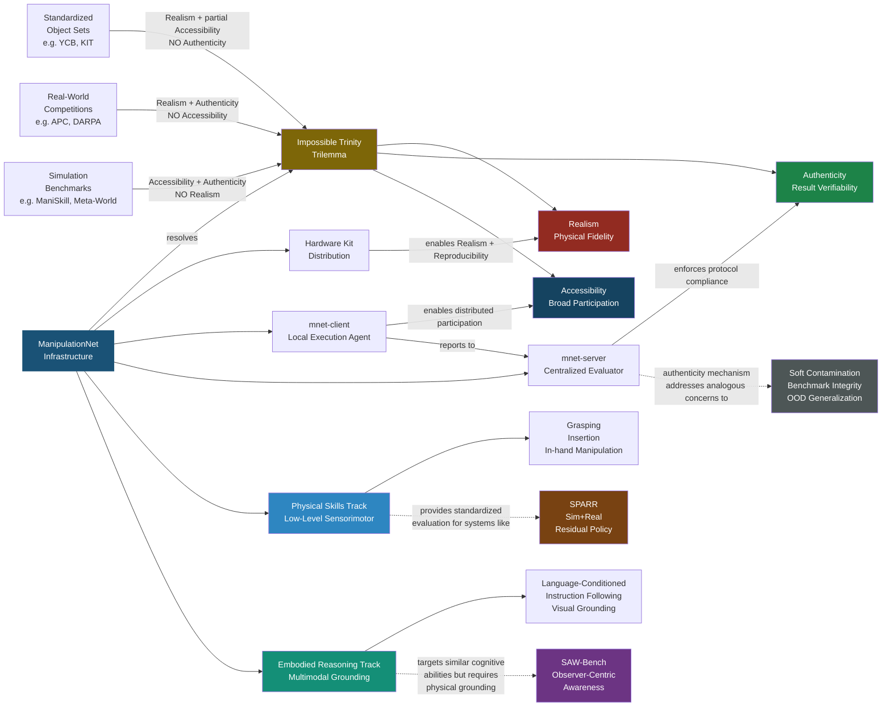

---
tags:
  - paper
  - Embodied_AI
  - Robot_Manipulation
  - Foundation_Model
  - VLA
aliases:
  - "ManipulationNet: An Infrastructure for Benchmarking Real-World Robot Manipulation with Physical Skill Challenges and Embodied Multimodal Reasoning"
url: http://arxiv.org/abs/2603.04363v1
pdf_url: https://arxiv.org/pdf/2603.04363v1
local_pdf: "[[ManipulationNet An Infrastructure for Benchmarking RealWorld Robot Manipulation with Physical Skill .pdf]]"
github: "None"
project_page: "https://manipulation-net.org"
institutions:
  - "Rice University"
  - "U.S. National Institute of Standards and Technology"
  - "Massachusetts Institute of Technology"
  - "Karlsruhe Institute of Technology"
  - "Autodesk Research"
  - "University of California, Berkeley"
  - "KTH Royal Institute of Technology"
  - "Tsinghua University"
  - "Columbia University"
  - "ASTM International"
  - "Carnegie Mellon University"
  - "German Aerospace Center (DLR)"
  - "University of Texas at Dallas"
  - "University of Texas at Austin"
  - "NVIDIA Research"
publication_date: "2026-03-04"
score: 7
---

# ManipulationNet: An Infrastructure for Benchmarking Real-World Robot Manipulation with Physical Skill Challenges and Embodied Multimodal Reasoning

## 📌 Abstract
Dexterous manipulation enables robots to purposefully alter the physical world, transforming them from passive observers into active agents in unstructured environments. This capability is the cornerstone of physical artificial intelligence. Despite decades of advances in hardware, perception, control, and learning, progress toward general manipulation systems remains fragmented due to the absence of widely adopted standard benchmarks. The central challenge lies in reconciling the variability of the real world with the reproducibility and authenticity required for rigorous scientific evaluation. To address this, we introduce ManipulationNet, a global infrastructure that hosts real-world benchmark tasks for robotic manipulation. ManipulationNet delivers reproducible task setups through standardized hardware kits, and enables distributed performance evaluation via a unified software client that delivers real-time task instructions and collects benchmarking results. As a persistent and scalable infrastructure, ManipulationNet organizes benchmark tasks into two complementary tracks: 1) the Physical Skills Track, which evaluates low-level physical interaction skills, and 2) the Embodied Reasoning Track, which tests high-level reasoning and multimodal grounding abilities. This design fosters the systematic growth of an interconnected network of real-world abilities and skills, paving the path toward general robotic manipulation. By enabling comparable manipulation research in the real world at scale, this infrastructure establishes a sustainable foundation for measuring long-term scientific progress and identifying capabilities ready for real-world deployment.

## 🖼️ Architecture
![[ManipulationNet An Infrastructure for Benchmarking RealWorld Robot Manipulation with Physical Skill _arch.png]]

## 🧠 AI Analysis

# 🚀 Deep Analysis Report: ManipulationNet: An Infrastructure for Benchmarking Real-World Robot Manipulation with Physical Skill Challenges and Embodied Multimodal Reasoning

## 📊 Academic Quality & Innovation
---

# ManipulationNet: Engineering-Centric Analysis Report

---

## 1. Core Snapshot

### Problem Statement

The field of robotic manipulation lacks a widely adopted, real-world benchmark that simultaneously satisfies three properties: **realism** (physical evaluation rather than simulation), **authenticity** (verifiable protocol adherence and result integrity), and **accessibility** (broad community participation without geographic or temporal constraints). As illustrated in the paper's "impossible trinity" diagram (Figure 1), prior benchmarking efforts—standardized object sets with protocols, real-world competitions, and simulation-based benchmarks—each address at most two of these three properties. Specifically: standardized object sets offer realism and partial accessibility but lack formal result verification (authenticity); competitions ensure authenticity and realism but are prohibitively centralized and temporally constrained; simulation benchmarks are highly accessible and reproducible but fail on physical realism and contact-dynamics fidelity. This trilemma has caused manipulation research progress to remain fragmented, with results across groups being largely incomparable even for ostensibly identical tasks.

### Core Contribution

ManipulationNet introduces a **hybrid centralized–decentralized infrastructure** that distributes standardized physical hardware kits globally (ensuring realism and reproducibility) while enforcing task authenticity and result comparability through a unified software client (`mnet-client`) connected to a centralized evaluation server (`mnet-server`), organized into two complementary evaluation tracks: Physical Skills and Embodied Reasoning.

### Academic Rating

| Dimension | Score | Justification |
|-----------|-------|---------------|
| **Innovation** | 7/10 | The core conceptual insight—treating realism, authenticity, and accessibility as an explicit trilemma and designing a hybrid architecture to resolve it—is clear and well-motivated. The two-track design (physical skills + embodied reasoning) is a principled structural choice. However, the paper as presented in the provided pages is primarily an infrastructure and position paper; the algorithmic novelty is organizational rather than algorithmic in the deep technical sense. |
| **Rigor** | 6/10 | The framing of the trilemma is rigorous and the taxonomy of prior work is thorough and well-cited. However, from the pages provided, quantitative experimental validation, formal metric definitions, and ablation studies are not yet visible, limiting the assessment of empirical rigor. The paper reads at this stage as a design specification and motivation document rather than a results paper. |

---

## 2. Technical Decomposition

### 2.1 Algorithmic Logic: Infrastructure Flow

Based on the pages provided, ManipulationNet operates through the following architectural pipeline:

**Step 1: Hardware Kit Distribution (Standardization Layer)**
Physical standardized hardware kits are distributed to participating laboratories worldwide. These kits contain identical physical objects and task fixtures, ensuring that the physical substrate of benchmarking—objects, tolerances, contact surfaces—is held constant across geographically distributed sites. This is a direct engineering response to the failure mode of standardized object sets alone: prior sets (e.g., YCB) ensured object identity but not protocol adherence or result verification.

**Step 2: Task Instantiation via `mnet-server` (Centralized Control Layer)**
The centralized `mnet-server` issues real-time task instructions to participating sites. The server manages task scheduling, randomization of trial conditions (to prevent overfitting to specific configurations), and coordination across distributed nodes. This design ensures that the task specification is not self-reported by participants but externally issued, which is the primary mechanism for enforcing authenticity.

**Step 3: Local Execution and Data Collection via `mnet-client` (Decentralized Execution Layer)**
The `mnet-client` software runs locally at each participating laboratory, receives instructions from `mnet-server`, interfaces with the local robotic system, and collects benchmarking results in a standardized format. Critically, this client serves as both a protocol enforcement mechanism and a telemetry pipeline, transmitting execution outcomes back to the server. The local-global architecture allows any lab with the hardware kit and `mnet-client` to participate asynchronously, resolving the temporal and geographic accessibility constraints of competitions.

**Step 4: Centralized Performance Evaluation (Verification Layer)**
All submitted results are evaluated centrally by `mnet-server`, ensuring that the same scoring criteria and metrics are applied uniformly. This is the authenticity-enforcing step: unlike results reported in papers or videos, the central server can enforce protocol compliance at the data-collection level and apply standardized evaluation logic.

**Step 5: Track-Specific Evaluation**
Tasks are bifurcated into two tracks:
- **Physical Skills Track**: Evaluates low-level sensorimotor skills under real-world physical constraints (contact dynamics, force, compliance, precision). This track targets capabilities such as grasping, insertion, and in-hand manipulation.
- **Embodied Reasoning Track**: Minimizes the physical manipulation burden and instead evaluates high-level reasoning, multimodal grounding, and language-conditioned task interpretation. This track assesses whether a robot can correctly contextualize natural language instructions and visual inputs into appropriate actions.

**Intuition for this Flow:** The hybrid centralized–decentralized architecture is chosen because purely centralized evaluation (competitions) fails on accessibility, while purely decentralized evaluation (object set + self-reporting) fails on authenticity. By separating the hardware layer (decentralized, standardized kits) from the control and verification layer (centralized server), ManipulationNet achieves all three properties simultaneously. The two-track decomposition reflects the recognition that manipulation competence has separable physical and cognitive components that require distinct evaluation methodologies.

### 2.2 Mathematical Formulation

The paper in its provided pages does not present explicit mathematical objective functions or loss formulations, as the contribution is primarily infrastructural and organizational rather than algorithmic. The following represents the implicit formal structure derivable from the text:

**Trilemma Formalization:**
Let a benchmark $\mathcal{B}$ be characterized by three binary or continuous properties:
- $\mathcal{R}(\mathcal{B}) \in [0,1]$: Realism (degree of physical fidelity)
- $\mathcal{A}(\mathcal{B}) \in [0,1]$: Authenticity (degree of result verifiability and protocol enforcement)
- $\mathcal{C}(\mathcal{B}) \in [0,1]$: Accessibility (breadth of community participation)

The core thesis is that prior works satisfy:
$$\max_{\mathcal{B} \in \text{prior}} \min(\mathcal{R}, \mathcal{A}, \mathcal{C}) \approx 0$$

meaning no single prior benchmark simultaneously achieves high scores on all three. ManipulationNet's design goal is:
$$\mathcal{B}^* = \arg\max_{\mathcal{B}} \min(\mathcal{R}(\mathcal{B}), \mathcal{A}(\mathcal{B}), \mathcal{C}(\mathcal{B}))$$

**Performance Metric Structure (implicit):**
For a given task $T_i$ in the Physical Skills Track, the evaluation score $S_i$ for a robotic system $\pi$ is presumably computed as:
$$S_i(\pi) = f(\text{outcomes}_{i,1}, \text{outcomes}_{i,2}, \ldots, \text{outcomes}_{i,n})$$
where $\text{outcomes}_{i,j}$ is the binary or continuous success measurement for trial $j$ of task $i$, collected and transmitted by `mnet-client` and scored by `mnet-server`. The specific form of $f$ (e.g., success rate, partial credit metrics) is not defined in the provided pages and presumably depends on the specific task.

### 2.3 System Architecture

From the provided pages, the architectural components can be organized as follows:

```
[Physical World]
    ↓ (standardized hardware kits distributed globally)
[Distributed Laboratory Sites]
    ├── Hardware Kit (objects, fixtures, task boards)
    └── mnet-client (local software agent)
            ↓ TCP/IP or equivalent network protocol
[mnet-server (Centralized)]
    ├── Task Instruction Engine (issues trial parameters)
    ├── Result Collection Database
    └── Evaluation Engine (standardized scoring)
            ↓
[Leaderboard / Performance Record]
```

**Key Architectural Choices:**
- **Decentralized execution, centralized verification**: This separation is the primary engineering innovation. It mirrors patterns from federated learning (local compute, global aggregation) but applied to physical benchmarking.
- **Two-track structure**: The Physical Skills Track and Embodied Reasoning Track are designed to be complementary rather than redundant, allowing cross-track analysis of how cognitive and physical capabilities co-develop.
- **Persistent and scalable**: Unlike competitions (temporally bounded), the infrastructure is designed to remain operational indefinitely, enabling longitudinal tracking of field-wide progress.

### 2.4 Innovation Logic

**Structural differentiation from prior approaches:**

| Prior Approach | Primary Failure Mode | ManipulationNet's Response |
|---|---|---|
| Standardized object sets (YCB, KIT) | No result verification; protocol adherence is self-reported | `mnet-client`/`mnet-server` architecture enforces protocol and collects results centrally |
| Real-world competitions (APC, DARPA, RoboCup) | Geographic/temporal centralization excludes participants; one-off nature limits reproducibility | Distributed hardware kits + persistent server enable anytime, anywhere participation |
| Simulation benchmarks (ManiSkill, Meta-World, RLBench) | Sim-to-real gap; contact dynamics are imperfect; results may not transfer to physical systems | Requires physical execution on real hardware; simulation is not accepted as a substitute |

The structural innovation is therefore not algorithmic but **infrastructural**: it is the first framework to resolve the trilemma by architecturally separating the standardization layer (hardware kits), the execution layer (`mnet-client`), and the verification layer (`mnet-server`).

---

## 3. Evidence & Metrics

### Benchmark & Baselines

Based on the pages provided, ManipulationNet is presented as an infrastructure paper rather than a results paper. The provided pages (through page 8) contain extensive literature review and architectural motivation but do not yet present experimental results comparing robotic systems on the benchmark tasks. The paper references a wide set of prior benchmarks and competitions as contextualization rather than as direct experimental baselines.

The two benchmark tracks are defined conceptually:
- **Physical Skills Track**: Targets low-level sensorimotor skills (grasping, insertion, manipulation under physical constraints)
- **Embodied Reasoning Track**: Targets multimodal grounding, language-conditioned task interpretation

Specific tasks within each track, their success metrics, and comparative results from participating systems are not visible in the provided pages and likely appear in later sections of the full paper.

### Key Results

Not available from the provided pages. The paper at this stage presents design rationale rather than empirical performance data.

### Ablation Study

Not available from the provided pages. An ablation study of the infrastructure components (e.g., the necessity of centralized verification vs. self-reporting, impact of hardware standardization on cross-site variance) would be the natural form of ablation for an infrastructure paper, but this analysis is not present in the pages reviewed.

---

## 4. Critical Assessment

### Hidden Limitations

**1. Authenticity Enforcement vs. System Heterogeneity:**
While the `mnet-client`/`mnet-server` architecture is designed to enforce protocol compliance, there remains a fundamental challenge: robotic systems vary enormously in their end-effectors, sensor modalities, degrees of freedom, and physical embodiment. A task protocol that is identical in object configuration and success criteria may still systematically favor certain robot morphologies (e.g., parallel-jaw grippers vs. dexterous hands). The infrastructure addresses object standardization but does not appear to standardize robot embodiment, which may introduce a confound when comparing results across systems.

**2. Sim-to-Real Gap is Not Eliminated but Transferred:**
By requiring physical execution, ManipulationNet correctly identifies that simulation benchmarks have a fidelity gap. However, the infrastructure itself introduces a different form of variability: environmental conditions (lighting, surface friction, ambient temperature, table levelness) at distributed sites cannot be fully controlled even with standardized hardware kits. The degree to which hardware kit distribution eliminates inter-site variability is an empirical question not addressed in the provided pages.

**3. Scalability of the Centralized Server:**
As the number of participating institutions grows, the `mnet-server` must handle concurrent task instruction issuance, result ingestion, and evaluation at scale. The paper does not discuss the engineering of `mnet-server` for high-throughput distributed operation, fault tolerance, or handling of network partitions.

**4. The Two-Track Design Assumes Separability:**
The bifurcation into Physical Skills and Embodied Reasoning tracks implicitly assumes that physical skill and cognitive reasoning are sufficiently separable for independent evaluation. In practice, dexterous manipulation often requires tight sensorimotor-cognitive coupling (e.g., tactile feedback informing grasp re-planning in real time). Tasks that require this coupling may fall awkwardly between tracks or be artificially decomposed.

**5. Long-Horizon Task Coverage:**
From the pages provided, individual tasks appear to target specific isolated skills. Whether the infrastructure supports long-horizon, multi-step tasks that require skill composition is unclear and represents a potential gap for evaluating general manipulation systems.

### Engineering Hurdles

**1. Hardware Kit Logistics and Maintenance:**
Distributing standardized physical hardware kits globally is operationally non-trivial. Object wear, damage, and replacement must be managed to ensure that the physical substrate remains consistent over time. A scratched or deformed object may have meaningfully different contact mechanics than the reference specimen. The paper does not specify a maintenance or replacement protocol for kit components.

**2. `mnet-client` Integration with Heterogeneous Robot Systems:**
The `mnet-client` must interface with a wide variety of robot platforms, middleware stacks (ROS, ROS2, proprietary APIs), and sensor configurations. Implementing robust, low-friction client integration across this diversity is a significant software engineering challenge. Without well-maintained robot-agnostic APIs or abstraction layers, participation may be limited to labs with significant software engineering resources.

**3. Network Latency and Real-Time Instruction Delivery:**
If `mnet-server` issues real-time task instructions (e.g., randomized object placement or trial parameters at execution time), network latency between distributed sites and the central server could introduce timing inconsistencies. For contact-rich manipulation tasks where setup timing matters, this could affect comparability.

**4. Result Verification vs. Gaming:**
The authenticity mechanism relies on `mnet-client` faithfully reporting execution outcomes. However, the paper does not detail how the system prevents adversarial reporting (e.g., a participant modifying the client to report inflated success rates). Without cryptographic attestation or video verification requirements, the authenticity guarantee may be weaker than claimed.

**5. Community Adoption Bootstrapping:**
The value of a benchmark infrastructure is proportional to the number and diversity of participating systems. Without an initial critical mass of participants, the leaderboard provides limited comparative signal. The paper does not discuss adoption incentives, community governance mechanisms, or onboarding procedures for new participants, all of which are critical to the practical success of the initiative.

---

*Note: This analysis is based solely on the eight pages of the paper provided. Later sections containing experimental results, detailed task specifications, metric definitions, and system implementation details—if present in the full paper—would substantially change the completeness of the evidence and metrics assessment.*

## 🔗 Knowledge Graph & Connections
## Connection & Refinement Analysis

---

### Task 1: Differential Analysis & Connections

#### Connection 1: [[Learning_Situated_Awareness_in_the_Real_World]] — Complementary Evaluation Targets

**Relationship:** SAW-Bench and ManipulationNet's Embodied Reasoning Track share a common motivation—evaluating the cognitive, observer-centric capabilities of embodied agents—but differ fundamentally in their evaluation substrate and design philosophy.

**Differential Analysis:**
- SAW-Bench operates on **pre-recorded egocentric video** (Ray-Ban smart glasses), making it a passive, static-dataset benchmark. ManipulationNet's Embodied Reasoning Track requires **live physical execution**, meaning the agent must ground language/visual instructions into real robot actions rather than answering questions about observed video.
- SAW-Bench targets **multimodal foundation models (MFMs)** directly, testing perception and reasoning in isolation from action. ManipulationNet explicitly couples reasoning to physical grounding—a correct interpretation of a natural language instruction that fails to produce an executable action is a benchmark failure, not a partial success.
- SAW-Bench's six awareness tasks probe observer-centric spatial reasoning (egocentric viewpoint, pose, motion). ManipulationNet's Embodied Reasoning Track similarly requires contextualizing the robot's own state relative to objects and task requirements, but extends this to **actionable multimodal grounding** rather than question-answer evaluation.
- Crucially, ManipulationNet addresses the **authenticity problem** that SAW-Bench, as a static dataset, sidesteps entirely. SAW-Bench cannot be "gamed" through physical protocol violation, but it also cannot capture the dynamic, contact-rich reality of embodied action.

**Synthesis:** The two benchmarks are complementary. SAW-Bench could serve as a diagnostic pre-screen for the cognitive components of ManipulationNet's Embodied Reasoning Track: a model that fails SAW-Bench's observer-centric tasks is unlikely to succeed at language-conditioned physical manipulation. Combining both would enable researchers to isolate whether Embodied Reasoning Track failures originate at the perception/reasoning stage or at the physical grounding stage.

---

#### Connection 2: [[Soft_Contamination]] — Authenticity Mechanisms and the Integrity Problem

**Relationship:** The paper's central emphasis on **authenticity**—verifiable protocol adherence and result integrity—maps directly onto the contamination concerns raised in the Soft Contamination note, though in a physically embodied rather than data-driven context.

**Differential Analysis:**
- The Soft Contamination paper identifies that benchmark integrity in LLM evaluation is compromised by **semantic duplicates** in training data, causing benchmarks to test shallow generalization rather than genuine OOD capability. ManipulationNet faces an analogous but physically instantiated version of this problem: a robot system could be **overfit to specific object configurations or task protocols** if benchmark task parameters are known in advance.
- ManipulationNet's `mnet-server` architecture—which issues real-time task instructions rather than pre-disclosing trial configurations—is a direct engineering countermeasure to this manipulation (pun intended). The server's role in randomizing trial parameters at execution time functions analogously to a decontamination filter: it prevents the physical equivalent of "soft contamination" where teams optimize their systems specifically for known benchmark conditions.
- However, ManipulationNet's authenticity mechanism has a significant gap that the Soft Contamination paper implicitly highlights: **client-side result reporting is trusted without cryptographic verification**. Just as n-gram decontamination filters fail to detect semantic duplicates, simple protocol enforcement via `mnet-client` may fail to detect subtler forms of result manipulation (e.g., selective trial reporting, manual assistance during difficult trials).
- The Soft Contamination finding that "performance improvements reflect both genuine capability gains and shallow benchmark-specific optimization" applies directly to ManipulationNet: without longitudinal tracking and cross-task generalization metrics, it will be difficult to distinguish genuine manipulation capability improvements from task-specific overfitting.

**Synthesis:** ManipulationNet would benefit from incorporating the Soft Contamination paper's methodological insight: designing **held-out test conditions** that are never disclosed to participants, analogous to truly held-out benchmark datapoints, and periodically rotating task parameters to prevent long-term overfitting.

---

#### Connection 3: [[SPARR]] — Sim-to-Real Gap and Physical Benchmark Necessity

**Relationship:** SPARR directly motivates ManipulationNet's rejection of simulation-only evaluation and illustrates precisely the class of failure modes that ManipulationNet's Physical Skills Track is designed to detect.

**Differential Analysis:**
- SPARR's core finding is that **simulation-trained assembly policies degrade in real-world deployment** due to discrepancies in contact dynamics and sensor noise—the sim-to-real gap. This is precisely the limitation ManipulationNet identifies in simulation-based benchmarks (ManiSkill, Meta-World, RLBench): their "imperfect approximations of contact dynamics render results incapable of fully reflecting the true manipulation capabilities."
- SPARR's solution is a **hybrid sim+real residual policy**: a simulation-trained base policy supplemented by a real-world residual policy that compensates for dynamics discrepancies. This architectural choice implicitly acknowledges that simulation benchmarks, while useful for generating initial policy priors, are insufficient as final performance validators. ManipulationNet provides the infrastructure to serve as that final validator.
- SPARR's use of **sparse rewards in the real world** and **dense rewards in simulation** maps onto ManipulationNet's two-track design: the Physical Skills Track can provide sparse binary success signals (analogous to SPARR's real-world sparse rewards), while simulation benchmarks can be used for dense-reward pretraining before physical benchmark evaluation.
- Importantly, SPARR focuses on **assembly tasks** (contact-rich, precision-demanding insertion), which are exactly the type of tasks ManipulationNet's Physical Skills Track is designed to evaluate. SPARR-style policies are natural candidates for submission to ManipulationNet, and ManipulationNet would provide a standardized evaluation of whether SPARR's residual policy approach generalizes across robotic platforms and lab environments.

**Synthesis:** SPARR and ManipulationNet have a natural methodological relationship: SPARR represents a **systems contribution** (how to train manipulation policies that bridge sim-to-real) while ManipulationNet represents an **evaluation contribution** (how to objectively measure whether such bridging has succeeded). The field needs both, and the two are directly complementary.

---

#### Connection 4: Cross-Cutting Theme — The Observer vs. Actor Dichotomy

Across all three related notes, a consistent structural tension emerges: benchmarks designed for **passive observers** (SAW-Bench evaluating MFMs on video; LLM benchmarks evaluated on static datasets) are easier to standardize and authenticate than benchmarks requiring **active physical agents** (ManipulationNet; SPARR's real-world RL). This tension is the fundamental reason ManipulationNet is non-trivial to build. The infrastructure complexity of ManipulationNet—hardware kits, `mnet-client`, `mnet-server`—is entirely a consequence of the transition from passive to active evaluation. The Soft Contamination paper further suggests that even passive benchmarks are harder to keep authentic than they appear, implying that the authenticity challenge ManipulationNet faces is even more severe than the paper currently acknowledges.

---

### Task 2: Mermaid Knowledge Graph



---

### Task 3: Future Research Directions

#### Direction 1: Cryptographic Attestation for Physical Benchmark Authenticity

**Motivation:** ManipulationNet's authenticity guarantee rests on trusting the `mnet-client` to faithfully report execution outcomes. As noted in the critical assessment, this is vulnerable to adversarial reporting. Simultaneously, the Soft Contamination paper demonstrates that even well-intentioned benchmark systems can produce inflated results through subtle data integrity issues.

**Proposed Research:** Design a **cryptographically verifiable result submission protocol** for physical robot benchmarks. Concretely, this would involve: (1) embedding tamper-evident sensors (e.g., cryptographically signed IMU or force-torque streams) into the hardware kits, (2) requiring video attestation with perceptual hashing to detect post-hoc editing, and (3) developing a lightweight **zero-knowledge proof** scheme that allows participants to demonstrate task success without revealing proprietary system details. This connects to recent work on verifiable computation and trusted hardware (e.g., Intel SGX) applied to robotics result reporting. The research question is: can we design an authenticity mechanism for physical benchmarks that is as robust as cryptographic verification in software, while remaining practically deployable across heterogeneous lab environments?

---

#### Direction 2: Cross-Track Transfer Metrics — Quantifying Physical-Cognitive Coupling

**Motivation:** ManipulationNet's two-track design (Physical Skills vs. Embodied Reasoning) implicitly assumes these dimensions are separable for independent evaluation. However, SPARR's architecture illustrates that real manipulation requires tight sensorimotor-cognitive coupling (e.g., visual feedback driving grasp re-planning during contact). SAW-Bench similarly suggests that observer-centric spatial reasoning is inseparable from effective action in context.

**Proposed Research:** Develop **cross-track transfer metrics** that quantify how capability in one track predicts or enables capability in the other. Specifically: (1) define a set of **bridge tasks** that require both low-level physical skill and high-level multimodal reasoning (e.g., "find the object described in the instruction and perform a compliant insertion into the fixture"), (2) measure the **mutual information** between Physical Skills Track performance and Embodied Reasoning Track performance across a diverse population of robotic systems, and (3) use this data to construct a **capability dependency graph** that reveals which physical skills are prerequisite for which reasoning capabilities and vice versa. This would transform ManipulationNet from a benchmarking infrastructure into a **scientific instrument** for understanding the structure of manipulation competence.

---

#### Direction 3: Adaptive Hardware Kit Versioning with Sim-to-Real Gap Quantification

**Motivation:** Physical hardware kits degrade over time (wear, damage), and environmental variability across distributed sites (lighting, friction, temperature) introduces uncontrolled confounds. SPARR's residual policy approach quantifies the sim-to-real gap for a specific policy, but there is no existing methodology for quantifying the **inter-site physical variability gap** in distributed benchmarks—analogous to measuring contamination spread across training corpora in the Soft Contamination paper.

**Proposed Research:** Develop a **kit calibration and versioning protocol** that treats physical hardware variability as a measurable quantity rather than an uncontrolled nuisance. Concretely: (1) design **calibration tasks** with known ground-truth outcomes (e.g., dropping a standardized mass onto a fixture and measuring rebound via accelerometry) that can be executed at each site to characterize local physical conditions, (2) use these calibration measurements to construct **site-specific physical variability profiles** that can be used to normalize cross-site performance comparisons (analogous to domain adaptation in transfer learning), and (3) develop a **kit versioning system** where each physical kit is assigned a version identifier based on measured wear metrics, enabling longitudinal studies to control for hardware degradation. This would provide the first rigorous quantification of how much inter-site physical variability affects benchmark comparability in distributed real-world robot evaluation.

---
*Analysis performed by PaperBrain-OpenRouter (anthropic/claude-4.6-sonnet) (Vision-Enabled)*


## 📂 Resources
- **Local PDF**: [[ManipulationNet An Infrastructure for Benchmarking RealWorld Robot Manipulation with Physical Skill .pdf]]
- [Online PDF](https://arxiv.org/pdf/2603.04363v1)
- [ArXiv Link](http://arxiv.org/abs/2603.04363v1)
